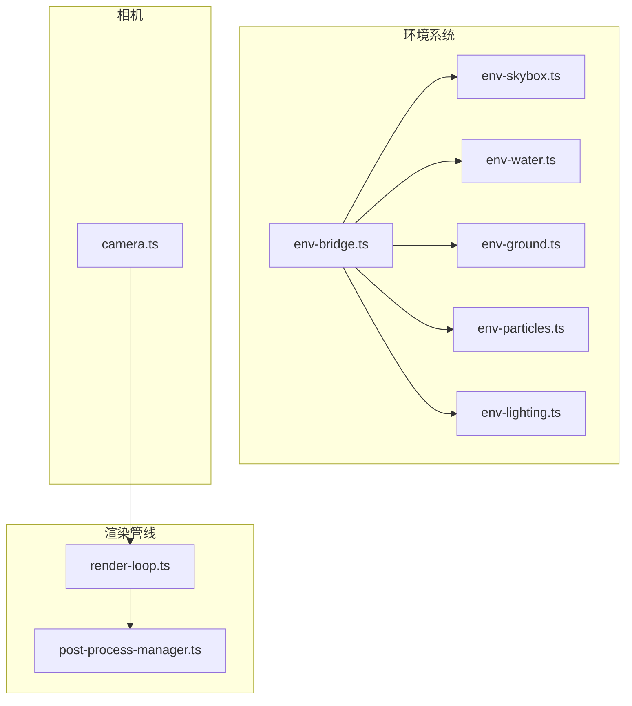
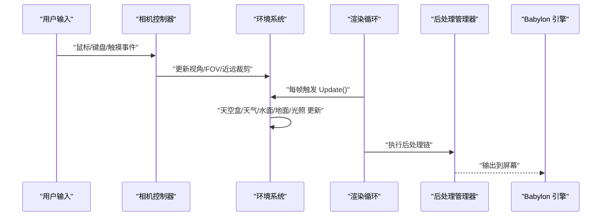
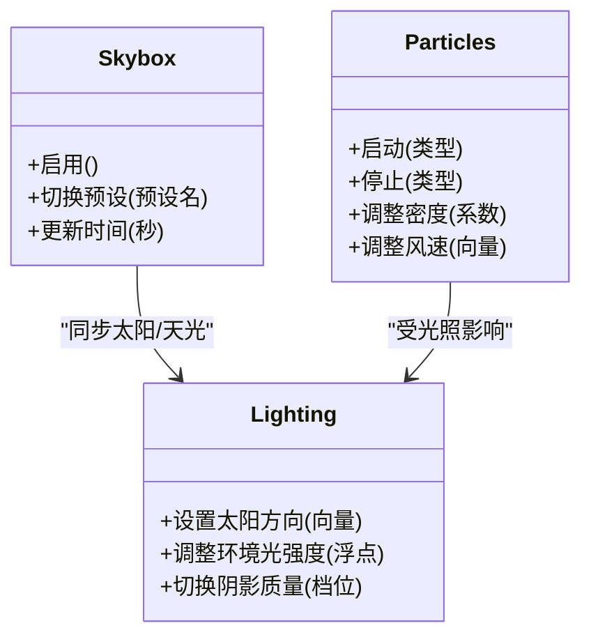
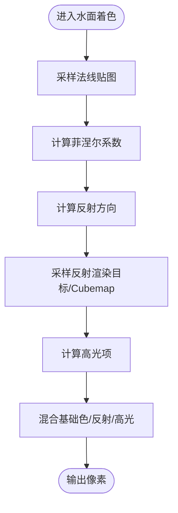
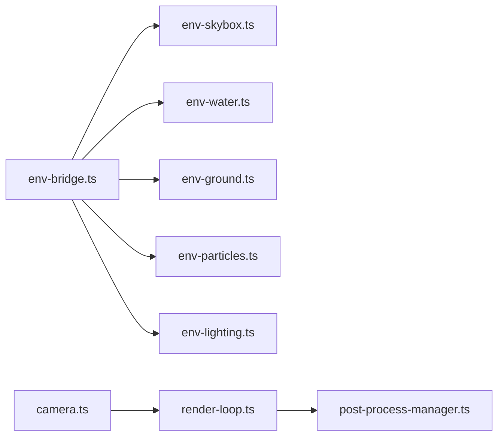

# 3D 渲染系统

<cite>
**本文引用的文件**   
- [frontend/src/scene/env/env-bridge.ts](file://frontend/src/scene/env/env-bridge.ts)
- [frontend/src/scene/env/env-skybox.ts](file://frontend/src/scene/env/env-skybox.ts)
- [frontend/src/scene/env/env-water.ts](file://frontend/src/scene/env/env-water.ts)
- [frontend/src/scene/env/env-ground.ts](file://frontend/src/scene/env/env-ground.ts)
- [frontend/src/scene/env/env-particles.ts](file://frontend/src/scene/env/env-particles.ts)
- [frontend/src/scene/env/env-lighting.ts](file://frontend/src/scene/env/env-lighting.ts)
- [frontend/src/scene/render/post-process-manager.ts](file://frontend/src/scene/render/post-process-manager.ts)
- [frontend/src/scene/camera/camera.ts](file://frontend/src/scene/camera/camera.ts)
- [frontend/src/core/render-loop.ts](file://frontend/src/core/render-loop.ts)
- [frontend/src/menus/settings-rendering.ts](file://frontend/src/menus/settings-rendering.ts)
- [frontend/src/scene/env/shaders/water.vertex.fx](file://frontend/src/scene/env/shaders/water.vertex.fx)
- [frontend/src/scene/env/shaders/water.fragment.fx](file://frontend/src/scene/env/shaders/water.fragment.fx)
- [frontend/src/scene/env/shaders/skybox.vertex.fx](file://frontend/src/scene/env/shaders/skybox.vertex.fx)
- [frontend/src/scene/env/shaders/skybox.fragment.fx](file://frontend/src/scene/env/shaders/skybox.fragment.fx)
- [docs/architecture.md](file://docs/architecture.md)
- [docs/adr/adr-024-rendering-enhancement-phase2-ssr-reflectionprobe.md](file://docs/adr/adr-024-rendering-enhancement-phase2-ssr-reflectionprobe.md)
- [docs/adr/adr-026-environment-system-enhancement.md](file://docs/adr/adr-026-environment-system-enhancement.md)
- [docs/adr/adr-074-cubemap-rt-spherical-reflection.md](file://docs/adr/adr-074-cubemap-rt-spherical-reflection.md)
- [docs/adr/adr-076-cel-shading-postprocess-mode.md](file://docs/adr/adr-076-cel-shading-postprocess-mode.md)
- [docs/adr/adr-115-stylized-water-glint-research.md](file://docs/adr/adr-115-stylized-water-glint-research.md)
- [docs/adr/adr-132-env-brightness-unification.md](file://docs/adr/adr-132-env-brightness-unification.md)
</cite>

## 目录
1. [简介](#简介)
2. [项目结构](#项目结构)
3. [核心组件](#核心组件)
4. [架构总览](#架构总览)
5. [详细组件分析](#详细组件分析)
6. [依赖关系分析](#依赖关系分析)
7. [性能考量](#性能考量)
8. [故障排查指南](#故障排查指南)
9. [结论](#结论)
10. [附录：着色器与自定义效果实现指南](#附录着色器与自定义效果实现指南)

## 简介
本文件面向使用 Babylon.js 的 3D 渲染子系统，系统性阐述场景管理、模型加载与渲染、材质与纹理、光照与阴影、环境渲染（天空盒、天气粒子、水面反射、地面与地形）、相机控制、后处理与性能优化策略。文档同时提供着色器编程与自定义渲染效果的实践方法，帮助开发者快速理解并扩展渲染能力。

## 项目结构
渲染相关代码主要位于前端 TypeScript 工程内，围绕“环境系统”、“渲染管线”、“相机控制”三大模块组织：
- 环境系统：负责天空盒、天气粒子、水面、地面/地形、光照等环境要素的统一管理与更新
- 渲染管线：封装后处理链、渲染目标与帧循环调度
- 相机控制：提供多种交互模式与参数化控制

图表来源
- [frontend/src/scene/env/env-bridge.ts](file://frontend/src/scene/env/env-bridge.ts)
- [frontend/src/scene/env/env-skybox.ts](file://frontend/src/scene/env/env-skybox.ts)
- [frontend/src/scene/env/env-water.ts](file://frontend/src/scene/env/env-water.ts)
- [frontend/src/scene/env/env-ground.ts](file://frontend/src/scene/env/env-ground.ts)
- [frontend/src/scene/env/env-particles.ts](file://frontend/src/scene/env/env-particles.ts)
- [frontend/src/scene/env/env-lighting.ts](file://frontend/src/scene/env/env-lighting.ts)
- [frontend/src/scene/render/post-process-manager.ts](file://frontend/src/scene/render/post-process-manager.ts)
- [frontend/src/core/render-loop.ts](file://frontend/src/core/render-loop.ts)
- [frontend/src/scene/camera/camera.ts](file://frontend/src/scene/camera/camera.ts)

章节来源
- [docs/architecture.md](file://docs/architecture.md)

## 核心组件
- 环境桥接与环境编排：集中协调天空盒、水体、地面、天气粒子与光照的创建、更新与销毁
- 天空盒与天气：支持静态/动态天空盒、云、雨、雪等粒子系统
- 水面与反射：基于渲染目标与法线贴图的水面着色，支持镜面高光与反射
- 地面与地形：可配置的地面网格与纹理混合，支持无限平面或高度图地形
- 光照与阴影：全局光照、方向光/点光源、阴影贴图与强度控制
- 后处理：SSR、反射探针、卡通描边等后处理链的可插拔管理
- 相机控制：轨道、自由飞行、AR 模式切换与输入绑定
- 渲染循环：统一帧调度、节流与降级策略

章节来源
- [frontend/src/scene/env/env-bridge.ts](file://frontend/src/scene/env/env-bridge.ts)
- [frontend/src/scene/env/env-skybox.ts](file://frontend/src/scene/env/env-skybox.ts)
- [frontend/src/scene/env/env-water.ts](file://frontend/src/scene/env/env-water.ts)
- [frontend/src/scene/env/env-ground.ts](file://frontend/src/scene/env/env-ground.ts)
- [frontend/src/scene/env/env-particles.ts](file://frontend/src/scene/env/env-particles.ts)
- [frontend/src/scene/env/env-lighting.ts](file://frontend/src/scene/env/env-lighting.ts)
- [frontend/src/scene/render/post-process-manager.ts](file://frontend/src/scene/render/post-process-manager.ts)
- [frontend/src/scene/camera/camera.ts](file://frontend/src/scene/camera/camera.ts)
- [frontend/src/core/render-loop.ts](file://frontend/src/core/render-loop.ts)

## 架构总览
下图展示了从用户输入到最终画面的关键路径：相机控制驱动场景观察，环境系统按帧更新各子系统，渲染管线在后处理阶段合成最终图像。

图表来源
- [frontend/src/scene/camera/camera.ts](file://frontend/src/scene/camera/camera.ts)
- [frontend/src/scene/env/env-bridge.ts](file://frontend/src/scene/env/env-bridge.ts)
- [frontend/src/core/render-loop.ts](file://frontend/src/core/render-loop.ts)
- [frontend/src/scene/render/post-process-manager.ts](file://frontend/src/scene/render/post-process-manager.ts)

## 详细组件分析

### 环境桥接与环境编排
- 职责：统一初始化/释放环境资源；根据预设或运行时配置组合天空盒、天气、水面、地面、光照；暴露高层 API 供 UI 与菜单调用
- 关键点：
  - 将各子系统抽象为可独立启停的模块，避免耦合
  - 通过状态机/开关控制功能等级（如仅天空盒、开启水面反射、开启体积云）
  - 与设置面板联动，持久化用户偏好

章节来源
- [frontend/src/scene/env/env-bridge.ts](file://frontend/src/scene/env/env-bridge.ts)
- [docs/adr/adr-026-environment-system-enhancement.md](file://docs/adr/adr-026-environment-system-enhancement.md)

### 天空盒与天气
- 天空盒：支持立方体贴图或程序化着色；可随时间/位置变化；与雾效配合营造深度感
- 天气粒子：云、雨、雪的粒子系统，支持密度、风速、生命周期与碰撞检测
- 与光照联动：太阳方向影响阴影与高光；云层厚度影响环境光强度

图表来源
- [frontend/src/scene/env/env-skybox.ts](file://frontend/src/scene/env/env-skybox.ts)
- [frontend/src/scene/env/env-particles.ts](file://frontend/src/scene/env/env-particles.ts)
- [frontend/src/scene/env/env-lighting.ts](file://frontend/src/scene/env/env-lighting.ts)

章节来源
- [frontend/src/scene/env/env-skybox.ts](file://frontend/src/scene/env/env-skybox.ts)
- [frontend/src/scene/env/env-particles.ts](file://frontend/src/scene/env/env-particles.ts)
- [frontend/src/scene/env/env-lighting.ts](file://frontend/src/scene/env/env-lighting.ts)

### 水面反射与高光
- 水面着色：顶点位移模拟波浪，片段着色计算菲涅尔、高光与反射采样
- 反射方案：基于渲染目标的平面反射或球面反射（Cubemap RT），兼顾性能与真实度
- 可调参数：波高、波长、粗糙度、反射强度、高光阈值

图表来源
- [frontend/src/scene/env/env-water.ts](file://frontend/src/scene/env/env-water.ts)
- [frontend/src/scene/env/shaders/water.vertex.fx](file://frontend/src/scene/env/shaders/water.vertex.fx)
- [frontend/src/scene/env/shaders/water.fragment.fx](file://frontend/src/scene/env/shaders/water.fragment.fx)
- [docs/adr/adr-074-cubemap-rt-spherical-reflection.md](file://docs/adr/adr-074-cubemap-rt-spherical-reflection.md)
- [docs/adr/adr-115-stylized-water-glint-research.md](file://docs/adr/adr-115-stylized-water-glint-research.md)

章节来源
- [frontend/src/scene/env/env-water.ts](file://frontend/src/scene/env/env-water.ts)
- [frontend/src/scene/env/shaders/water.vertex.fx](file://frontend/src/scene/env/shaders/water.vertex.fx)
- [frontend/src/scene/env/shaders/water.fragment.fx](file://frontend/src/scene/env/shaders/water.fragment.fx)

### 地面与地形
- 地面网格：可配置尺寸与分段数，支持无限平面或高度图地形
- 纹理混合：多层纹理叠加与遮罩，支持细节贴图与法线贴图
- 与水面交互：水面边界与地面碰撞检测，避免穿透

章节来源
- [frontend/src/scene/env/env-ground.ts](file://frontend/src/scene/env/env-ground.ts)

### 光照与阴影
- 光源类型：方向光（主光源）、点光源、聚光灯
- 阴影贴图：分辨率、级联阴影、软阴影选项
- 环境光：半球光/环境贴图，统一亮度调节

章节来源
- [frontend/src/scene/env/env-lighting.ts](file://frontend/src/scene/env/env-lighting.ts)
- [docs/adr/adr-132-env-brightness-unification.md](file://docs/adr/adr-132-env-brightness-unification.md)

### 相机控制系统
- 模式：轨道相机、第一人称/自由飞行、AR 相机
- 输入：鼠标拖拽、滚轮缩放、键盘 WASD、触屏手势
- 行为：阻尼平滑、视锥剔除、近远裁剪自适应

章节来源
- [frontend/src/scene/camera/camera.ts](file://frontend/src/scene/camera/camera.ts)

### 后处理效果
- 链式后处理：SSR、反射探针、色调映射、泛光、卡通描边等
- 质量档位：根据设备能力自动降级或手动选择
- 性能：按需启用、分帧渲染、降低分辨率

章节来源
- [frontend/src/scene/render/post-process-manager.ts](file://frontend/src/scene/render/post-process-manager.ts)
- [docs/adr/adr-024-rendering-enhancement-phase2-ssr-reflectionprobe.md](file://docs/adr/adr-024-rendering-enhancement-phase2-ssr-reflectionprobe.md)
- [docs/adr/adr-076-cel-shading-postprocess-mode.md](file://docs/adr/adr-076-cel-shading-postprocess-mode.md)

### 渲染循环与帧调度
- 统一帧循环：在每帧中依次更新环境、相机、后处理
- 节流与降级：低 FPS 时降低粒子密度、关闭昂贵后处理
- 资源回收：场景切换时及时释放纹理/几何体

章节来源
- [frontend/src/core/render-loop.ts](file://frontend/src/core/render-loop.ts)

## 依赖关系分析
- 环境系统内部解耦：通过桥接层聚合，各子系统可独立测试与替换
- 渲染管线与环境的协作：环境系统写入渲染目标，后处理读取并进行合成
- 相机与渲染循环：相机更新由输入驱动，渲染循环保证时序一致

图表来源
- [frontend/src/scene/env/env-bridge.ts](file://frontend/src/scene/env/env-bridge.ts)
- [frontend/src/scene/env/env-skybox.ts](file://frontend/src/scene/env/env-skybox.ts)
- [frontend/src/scene/env/env-water.ts](file://frontend/src/scene/env/env-water.ts)
- [frontend/src/scene/env/env-ground.ts](file://frontend/src/scene/env/env-ground.ts)
- [frontend/src/scene/env/env-particles.ts](file://frontend/src/scene/env/env-particles.ts)
- [frontend/src/scene/env/env-lighting.ts](file://frontend/src/scene/env/env-lighting.ts)
- [frontend/src/core/render-loop.ts](file://frontend/src/core/render-loop.ts)
- [frontend/src/scene/render/post-process-manager.ts](file://frontend/src/scene/render/post-process-manager.ts)
- [frontend/src/scene/camera/camera.ts](file://frontend/src/scene/camera/camera.ts)

章节来源
- [frontend/src/scene/env/env-bridge.ts](file://frontend/src/scene/env/env-bridge.ts)
- [frontend/src/core/render-loop.ts](file://frontend/src/core/render-loop.ts)

## 性能考量
- 纹理与几何体复用：共享材质与纹理，减少 GPU 内存占用
- 后处理分级：根据设备能力与当前 FPS 动态调整 SSR/反射质量
- 粒子系统优化：限制最大粒子数、使用批渲染、按需激活
- 阴影优化：降低分辨率、使用级联阴影、限制投射物体数量
- 水面反射：优先使用球面反射（Cubemap RT）替代全屏反射以降低带宽
- 渲染目标复用：避免频繁创建/销毁 RT，采用对象池

[本节为通用指导，不直接分析具体文件]

## 故障排查指南
- 水面不显示或闪烁
  - 检查水面着色器是否成功编译与链接
  - 确认反射渲染目标尺寸与格式兼容
  - 验证法线贴图路径与 UV 是否正确
- 天空盒异常或颜色错误
  - 检查立方体贴图顺序与坐标空间
  - 确认雾效与天空盒的深度写入冲突
- 天气粒子不可见
  - 检查粒子系统的可见层与相机视锥
  - 确认粒子材质未被关闭透明度混合
- 阴影缺失或黑屏
  - 检查光源阴影贴图分辨率与范围
  - 确认接收阴影的网格已启用阴影接收
- 后处理导致卡顿
  - 降低后处理链复杂度或分辨率
  - 禁用昂贵效果（如 SSR）并逐步恢复定位瓶颈

章节来源
- [frontend/src/scene/env/env-water.ts](file://frontend/src/scene/env/env-water.ts)
- [frontend/src/scene/env/env-skybox.ts](file://frontend/src/scene/env/env-skybox.ts)
- [frontend/src/scene/env/env-particles.ts](file://frontend/src/scene/env/env-particles.ts)
- [frontend/src/scene/env/env-lighting.ts](file://frontend/src/scene/env/env-lighting.ts)
- [frontend/src/scene/render/post-process-manager.ts](file://frontend/src/scene/render/post-process-manager.ts)

## 结论
本渲染系统以环境系统为核心，结合可插拔的后处理与灵活的相机控制，实现了高质量且可扩展的 3D 渲染体验。通过分层设计与性能分级策略，可在不同设备上保持稳定的帧率与视觉品质。建议在新特性开发时遵循现有接口约定，优先复用渲染目标与材质，确保资源生命周期清晰可控。

[本节为总结性内容，不直接分析具体文件]

## 附录：着色器与自定义效果实现指南
- 顶点着色器要点
  - 正确传递世界/视图/投影矩阵
  - 计算切线空间法线与反射方向
  - 对水面进行顶点位移与波纹叠加
- 片段着色器要点
  - 菲涅尔近似与粗糙度控制
  - 反射采样与高光项融合
  - 雾效与色调映射
- 自定义后处理
  - 定义新的 Pass，传入必要的 Uniforms（时间、分辨率、纹理）
  - 在渲染循环中按序插入 Pass，注意深度与模板缓冲的使用
- 最佳实践
  - 使用常量表达式与分支外提减少指令
  - 合并多次纹理采样，利用多通道打包
  - 针对移动端优化精度与分支

章节来源
- [frontend/src/scene/env/shaders/water.vertex.fx](file://frontend/src/scene/env/shaders/water.vertex.fx)
- [frontend/src/scene/env/shaders/water.fragment.fx](file://frontend/src/scene/env/shaders/water.fragment.fx)
- [frontend/src/scene/env/shaders/skybox.vertex.fx](file://frontend/src/scene/env/shaders/skybox.vertex.fx)
- [frontend/src/scene/env/shaders/skybox.fragment.fx](file://frontend/src/scene/env/shaders/skybox.fragment.fx)
- [frontend/src/scene/render/post-process-manager.ts](file://frontend/src/scene/render/post-process-manager.ts)
- [frontend/src/menus/settings-rendering.ts](file://frontend/src/menus/settings-rendering.ts)