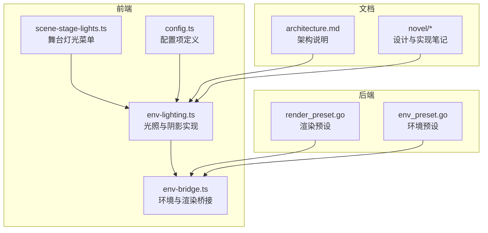
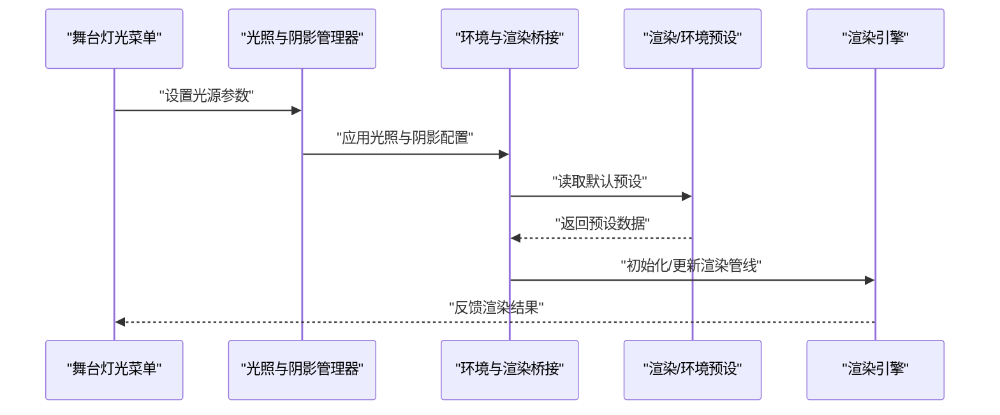
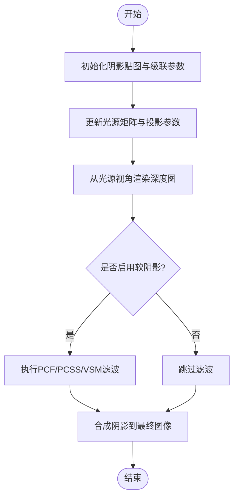
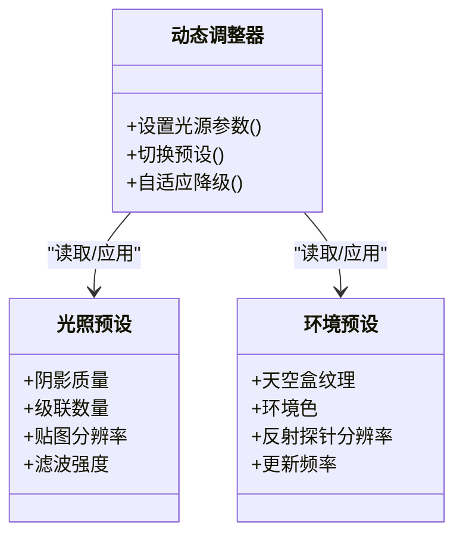
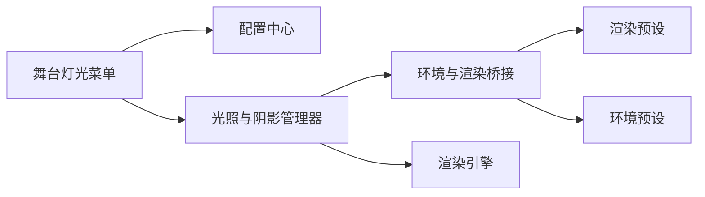

# 光照与阴影

<cite>
**本文引用的文件**   
- [frontend/src/scene/env/env-lighting.ts](file://frontend/src/scene/env/env-lighting.ts)
- [frontend/src/scene/env/env-bridge.ts](file://frontend/src/scene/env/env-bridge.ts)
- [frontend/src/menus/scene-stage-lights.ts](file://frontend/src/menus/scene-stage-lights.ts)
- [frontend/src/core/config.ts](file://frontend/src/core/config.ts)
- [internal/app/render_preset.go](file://internal/app/render_preset.go)
- [internal/app/env_preset.go](file://internal/app/env_preset.go)
- [docs/architecture.md](file://docs/architecture.md)
- [novel/07-环境渲染/03-天光之悟.md](file://novel/07-环境渲染/03-天光之悟.md)
- [novel/10-灯光与阴影/01-调色台.md](file://novel/10-灯光与阴影/01-调色台.md)
- [novel/10-灯光与阴影/02-灯塔的觉醒.md](file://novel/10-灯光与阴影/02-灯塔的觉醒.md)
- [novel/10-灯光与阴影/03-光的七宗罪.md](file://novel/10-灯光与阴影/03-光的七宗罪.md)
- [novel/10-灯光与阴影/04-夕阳的影子.md](file://novel/10-灯光与阴影/04-夕阳的影子.md)
- [novel/10-灯光与阴影/05-双影.md](file://novel/10-灯光与阴影/05-双影.md)
- [novel/10-灯光与阴影/06-三面镜.md](file://novel/10-灯光与阴影/06-三面镜.md)
</cite>

## 目录
1. [简介](#简介)
2. [项目结构](#项目结构)
3. [核心组件](#核心组件)
4. [架构总览](#架构总览)
5. [详细组件分析](#详细组件分析)
6. [依赖关系分析](#依赖关系分析)
7. [性能考量](#性能考量)
8. [故障排查指南](#故障排查指南)
9. [结论](#结论)
10. [附录](#附录)

## 简介
本章节面向希望实现真实感光照效果的开发者，系统性梳理本项目的光照与阴影体系。内容覆盖：
- 光照模型：方向光、点光源、聚光灯与环境光（天空盒/半球光）的实现要点与参数语义
- 阴影映射：阴影贴图生成、级联阴影映射（Cascaded Shadow Maps, CSM）、软阴影算法与优化策略
- 预设系统：光照预设、渲染预设与环境预设的统一管理
- 动态调整：运行时对光照强度、颜色、衰减、阴影质量等参数的实时控制
- 烘焙技术：静态光照与反射探针的离线计算思路与集成方式
- 调试工具：可视化辅助、指标采集与常见问题定位
- 最佳实践：在移动端与桌面端平衡画质与性能的实用建议

## 项目结构
与光照和阴影相关的代码主要分布在以下位置：
- 前端场景层：负责场景内光源创建、更新、阴影配置与渲染管线对接
- 菜单与配置：提供 UI 操作入口与持久化配置项
- 后端预设：提供渲染与环境的默认预设数据
- 文档与小说：记录设计决策、实现细节与经验总结

图表来源
- [frontend/src/scene/env/env-lighting.ts](file://frontend/src/scene/env/env-lighting.ts)
- [frontend/src/scene/env/env-bridge.ts](file://frontend/src/scene/env/env-bridge.ts)
- [frontend/src/menus/scene-stage-lights.ts](file://frontend/src/menus/scene-stage-lights.ts)
- [frontend/src/core/config.ts](file://frontend/src/core/config.ts)
- [internal/app/render_preset.go](file://internal/app/render_preset.go)
- [internal/app/env_preset.go](file://internal/app/env_preset.go)
- [docs/architecture.md](file://docs/architecture.md)
- [novel/10-灯光与阴影/01-调色台.md](file://novel/10-灯光与阴影/01-调色台.md)

章节来源
- [frontend/src/scene/env/env-lighting.ts](file://frontend/src/scene/env/env-lighting.ts)
- [frontend/src/scene/env/env-bridge.ts](file://frontend/src/scene/env/env-bridge.ts)
- [frontend/src/menus/scene-stage-lights.ts](file://frontend/src/menus/scene-stage-lights.ts)
- [frontend/src/core/config.ts](file://frontend/src/core/config.ts)
- [internal/app/render_preset.go](file://internal/app/render_preset.go)
- [internal/app/env_preset.go](file://internal/app/env_preset.go)
- [docs/architecture.md](file://docs/architecture.md)
- [novel/10-灯光与阴影/01-调色台.md](file://novel/10-灯光与阴影/01-调色台.md)

## 核心组件
- 光照与阴影管理器：封装光源生命周期、材质着色器交互、阴影贴图与级联配置
- 环境与渲染桥接：将环境预设与渲染预设注入到引擎中，统一初始化流程
- 舞台灯光菜单：为方向光、点光源、聚光灯与环境光提供可视化编辑能力
- 配置中心：集中定义光照与阴影相关开关、阈值与默认值

章节来源
- [frontend/src/scene/env/env-lighting.ts](file://frontend/src/scene/env/env-lighting.ts)
- [frontend/src/scene/env/env-bridge.ts](file://frontend/src/scene/env/env-bridge.ts)
- [frontend/src/menus/scene-stage-lights.ts](file://frontend/src/menus/scene-stage-lights.ts)
- [frontend/src/core/config.ts](file://frontend/src/core/config.ts)

## 架构总览
整体架构遵循“前端场景层 + 后端预设”的分层模式：
- 前端场景层负责运行时光照与阴影的创建、更新与渲染
- 后端预设提供可配置的初始状态，便于在不同设备与模式下快速切换
- 文档与小说作为知识沉淀，指导实现与调优

图表来源
- [frontend/src/menus/scene-stage-lights.ts](file://frontend/src/menus/scene-stage-lights.ts)
- [frontend/src/scene/env/env-lighting.ts](file://frontend/src/scene/env/env-lighting.ts)
- [frontend/src/scene/env/env-bridge.ts](file://frontend/src/scene/env/env-bridge.ts)
- [internal/app/render_preset.go](file://internal/app/render_preset.go)
- [internal/app/env_preset.go](file://internal/app/env_preset.go)

## 详细组件分析

### 光照模型实现
- 方向光（Directional Light）
  - 用途：模拟太阳光或全局主光源
  - 关键参数：方向向量、强度、颜色、阴影投射开关
  - 典型用法：配合级联阴影映射提升大范围场景阴影质量
- 点光源（Point Light）
  - 用途：局部补光、装饰性光源
  - 关键参数：位置、强度、颜色、衰减半径、衰减曲线
  - 典型用法：小范围高亮物体表面，注意衰减避免过度采样
- 聚光灯（Spot Light）
  - 用途：聚焦照明、舞台效果
  - 关键参数：位置、方向、锥角、边缘软化、强度、颜色、衰减
  - 典型用法：强调主体，结合软阴影增强真实感
- 环境光（Ambient/Hemisphere/Skybox）
  - 用途：基础漫反射填充、天空盒反射与间接光照近似
  - 关键参数：环境色、天空盒纹理、反射探针分辨率与更新频率
  - 典型用法：提升暗部细节，减少明暗对比过强导致的噪点

章节来源
- [frontend/src/scene/env/env-lighting.ts](file://frontend/src/scene/env/env-lighting.ts)
- [frontend/src/scene/env/env-bridge.ts](file://frontend/src/scene/env/env-bridge.ts)
- [frontend/src/menus/scene-stage-lights.ts](file://frontend/src/menus/scene-stage-lights.ts)
- [novel/10-灯光与阴影/02-灯塔的觉醒.md](file://novel/10-灯光与阴影/02-灯塔的觉醒.md)
- [novel/10-灯光与阴影/03-光的七宗罪.md](file://novel/10-灯光与阴影/03-光的七宗罪.md)

### 阴影映射与软阴影
- 阴影贴图（Shadow Mapping）
  - 原理：从光源视角渲染深度图，再在相机视角进行深度比较
  - 关键点：偏移（Bias）、PCF（百分比渐进过滤）、各向异性过滤
- 级联阴影映射（CSM）
  - 原理：将视锥体分段，每段使用独立阴影贴图，近处高分辨率、远处低分辨率
  - 关键点：级联数量、分割策略、级联边界过渡
- 软阴影算法
  - PCF/PCSS：通过多采样与距离相关滤波降低锯齿与硬边
  - VSM/ESM：方差/指数阴影贴图，适合更大范围的软阴影但需处理负值与泄漏
- 阴影优化策略
  - 动态启用：仅对可见且重要的对象开启阴影
  - 分辨率分级：按距离与重要性分配贴图大小
  - 遮挡剔除：基于视锥与包围盒裁剪阴影贡献区域
  - 帧间复用：稳定光源时复用上一帧阴影以减少重算

图表来源
- [frontend/src/scene/env/env-lighting.ts](file://frontend/src/scene/env/env-lighting.ts)
- [frontend/src/scene/env/env-bridge.ts](file://frontend/src/scene/env/env-bridge.ts)
- [novel/10-灯光与阴影/04-夕阳的影子.md](file://novel/10-灯光与阴影/04-夕阳的影子.md)
- [novel/10-灯光与阴影/05-双影.md](file://novel/10-灯光与阴影/05-双影.md)

章节来源
- [frontend/src/scene/env/env-lighting.ts](file://frontend/src/scene/env/env-lighting.ts)
- [frontend/src/scene/env/env-bridge.ts](file://frontend/src/scene/env/env-bridge.ts)
- [novel/10-灯光与阴影/04-夕阳的影子.md](file://novel/10-灯光与阴影/04-夕阳的影子.md)
- [novel/10-灯光与阴影/05-双影.md](file://novel/10-灯光与阴影/05-双影.md)

### 光照预设系统与动态调整
- 预设系统
  - 渲染预设：包含阴影质量、级联数量、贴图分辨率、滤波强度等
  - 环境预设：包含天空盒、环境色、反射探针参数
  - 数据来源：后端预设模块提供默认值，前端根据设备能力与用户偏好选择
- 动态调整
  - 运行时修改光源强度、颜色、衰减、阴影质量
  - 根据帧率与GPU占用自适应降级（如减少级联数、降低贴图分辨率）
  - 支持热重载材质与光照参数，无需重启应用

图表来源
- [internal/app/render_preset.go](file://internal/app/render_preset.go)
- [internal/app/env_preset.go](file://internal/app/env_preset.go)
- [frontend/src/scene/env/env-lighting.ts](file://frontend/src/scene/env/env-lighting.ts)
- [frontend/src/scene/env/env-bridge.ts](file://frontend/src/scene/env/env-bridge.ts)

章节来源
- [internal/app/render_preset.go](file://internal/app/render_preset.go)
- [internal/app/env_preset.go](file://internal/app/env_preset.go)
- [frontend/src/scene/env/env-lighting.ts](file://frontend/src/scene/env/env-lighting.ts)
- [frontend/src/scene/env/env-bridge.ts](file://frontend/src/scene/env/env-bridge.ts)

### 光照烘焙技术
- 静态光照烘焙
  - 将静态几何体的直接光照与间接光照预计算并存储为光照贴图
  - 优点：运行时开销低；缺点：内存占用大、更新成本高
- 反射探针
  - 对静态环境进行立方体贴图采样，用于反射与折射
  - 更新策略：按需更新、增量更新或固定间隔更新
- 混合方案
  - 静态部分烘焙，动态部分实时计算
  - 使用光照探针网格（Light Probe Grid）插值间接光照

章节来源
- [frontend/src/scene/env/env-bridge.ts](file://frontend/src/scene/env/env-bridge.ts)
- [novel/07-环境渲染/03-天光之悟.md](file://novel/07-环境渲染/03-天光之悟.md)

### 光照调试工具与性能分析
- 可视化辅助
  - 显示光源体积、阴影视锥、级联边界
  - 以热力图展示阴影密度与噪声分布
- 指标采集
  - 帧时间、GPU占用、阴影贴图带宽、采样次数
  - 自动记录峰值与平均值，便于回归测试
- 常见问题定位
  - 阴影闪烁：检查Bias与法线偏移
  - 阴影撕裂：调整级联分割与过渡权重
  - 性能瓶颈：识别高代价光源与过大贴图

章节来源
- [frontend/src/scene/env/env-lighting.ts](file://frontend/src/scene/env/env-lighting.ts)
- [frontend/src/menus/scene-stage-lights.ts](file://frontend/src/menus/scene-stage-lights.ts)
- [novel/10-灯光与阴影/06-三面镜.md](file://novel/10-灯光与阴影/06-三面镜.md)

## 依赖关系分析
- 组件耦合
  - 光照与阴影管理器依赖环境与渲染桥接，桥接依赖后端预设
  - 菜单模块通过配置中心访问参数，间接影响光照行为
- 外部依赖
  - 渲染引擎接口：光源类型、阴影贴图、级联配置
  - 资源加载：天空盒、反射探针、光照贴图
- 潜在循环依赖
  - 确保菜单不直接依赖渲染管线，避免反向调用

图表来源
- [frontend/src/menus/scene-stage-lights.ts](file://frontend/src/menus/scene-stage-lights.ts)
- [frontend/src/core/config.ts](file://frontend/src/core/config.ts)
- [frontend/src/scene/env/env-lighting.ts](file://frontend/src/scene/env/env-lighting.ts)
- [frontend/src/scene/env/env-bridge.ts](file://frontend/src/scene/env/env-bridge.ts)
- [internal/app/render_preset.go](file://internal/app/render_preset.go)
- [internal/app/env_preset.go](file://internal/app/env_preset.go)

章节来源
- [frontend/src/menus/scene-stage-lights.ts](file://frontend/src/menus/scene-stage-lights.ts)
- [frontend/src/core/config.ts](file://frontend/src/core/config.ts)
- [frontend/src/scene/env/env-lighting.ts](file://frontend/src/scene/env/env-lighting.ts)
- [frontend/src/scene/env/env-bridge.ts](file://frontend/src/scene/env/env-bridge.ts)
- [internal/app/render_preset.go](file://internal/app/render_preset.go)
- [internal/app/env_preset.go](file://internal/app/env_preset.go)

## 性能考量
- 光源数量与类型
  - 优先使用方向光与少量点/聚光灯，避免过多动态光源
- 阴影质量
  - 合理设置级联数量与贴图分辨率，移动端建议较低分辨率与较少级联
- 滤波与后处理
  - 软阴影会增加采样成本，必要时关闭或降低强度
- 资源管理
  - 及时释放不再使用的光源与阴影贴图，避免内存泄漏
- 自适应策略
  - 根据帧率与GPU负载动态降级，保证流畅体验

[本节为通用指导，不直接分析具体文件]

## 故障排查指南
- 阴影出现条纹或断层
  - 检查阴影贴图分辨率与级联分割是否匹配场景尺度
  - 调整Bias与法线偏移，避免自阴影伪影
- 阴影闪烁或不稳定
  - 确认光源与相机相对运动平滑，避免抖动
  - 使用稳定的投影矩阵与合适的Near/Far平面
- 性能骤降
  - 统计光源贡献与阴影采样次数，定位热点
  - 降低贴图分辨率、减少级联数量或关闭不必要的软阴影
- 环境光异常
  - 检查天空盒纹理格式与尺寸，确保与反射探针一致
  - 验证环境色与材质响应是否符合预期

章节来源
- [frontend/src/scene/env/env-lighting.ts](file://frontend/src/scene/env/env-lighting.ts)
- [frontend/src/scene/env/env-bridge.ts](file://frontend/src/scene/env/env-bridge.ts)
- [frontend/src/menus/scene-stage-lights.ts](file://frontend/src/menus/scene-stage-lights.ts)
- [novel/10-灯光与阴影/06-三面镜.md](file://novel/10-灯光与阴影/06-三面镜.md)

## 结论
本项目的光照与阴影体系在前端场景层与后端预设之间形成清晰分层，既支持高质量实时渲染，也兼顾移动端性能约束。通过合理的阴影映射、软阴影算法与优化策略，以及完善的预设系统与调试工具，开发者可以在不同平台上实现稳定且真实感的光照效果。建议在项目中持续积累调优经验，结合文档与小说中的实践总结，逐步完善光照管线。

[本节为总结性内容，不直接分析具体文件]

## 附录
- 编程示例路径
  - 光源创建与更新：参考光照与阴影管理器
  - 菜单交互与参数绑定：参考舞台灯光菜单
  - 预设加载与应用：参考环境与渲染桥接及后端预设
- 最佳实践清单
  - 明确光源优先级与可见性
  - 使用级联阴影映射提升大范围阴影质量
  - 动态调整阴影质量以适应设备能力
  - 利用烘焙与反射探针降低运行时开销
  - 建立完善的调试与性能监控流程

章节来源
- [frontend/src/scene/env/env-lighting.ts](file://frontend/src/scene/env/env-lighting.ts)
- [frontend/src/menus/scene-stage-lights.ts](file://frontend/src/menus/scene-stage-lights.ts)
- [frontend/src/scene/env/env-bridge.ts](file://frontend/src/scene/env/env-bridge.ts)
- [internal/app/render_preset.go](file://internal/app/render_preset.go)
- [internal/app/env_preset.go](file://internal/app/env_preset.go)
- [docs/architecture.md](file://docs/architecture.md)
- [novel/10-灯光与阴影/01-调色台.md](file://novel/10-灯光与阴影/01-调色台.md)