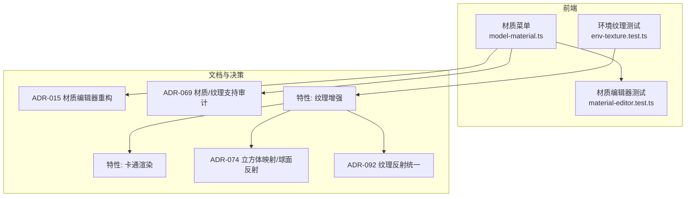
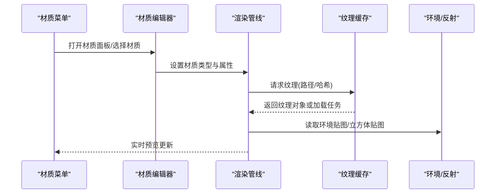
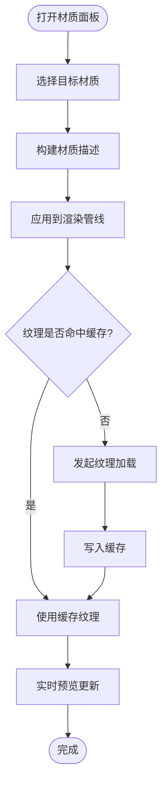
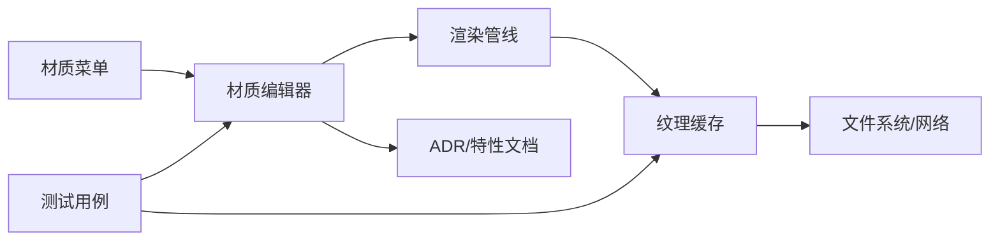

# 材质与纹理系统

<cite>
**本文引用的文件**   
- [adr-015-material-editor-refactor.md](file://docs/adr/adr-015-material-editor-refactor.md)
- [adr-069-material-texture-support-audit.md](file://docs/adr/adr-069-material-texture-support-audit.md)
- [model-material.ts](file://frontend/src/menus/model-material.ts)
- [material-editor.test.ts](file://frontend/src/__tests__/material-editor.test.ts)
- [texture_enhancement.md](file://docs/research/dancexr-zh/features/texture_enhancement.md)
- [toon_shading.md](file://docs/research/dancexr-zh/features/toon_shading.md)
- [material_custom1.md](file://docs/research/dancexr-zh/features/material_custom1.md)
- [material_eyes.md](file://docs/research/dancexr-zh/features/material_eyes.md)
- [material_lips.md](file://docs/research/dancexr-zh/features/material_lips.md)
- [material_opaque.md](file://docs/research/dancexr-zh/features/material_opaque.md)
- [material_transparent.md](file://docs/research/dancexr-zh/features/material_transparent.md)
- [material_global.md](file://docs/research/dancexr-zh/features/material_global.md)
- [specular_map.md](file://docs/research/dancexr-zh/features/specular_map.md)
- [custom_detail_map.md](file://docs/research/dancexr-zh/features/custom_detail_map.md)
- [alternative_textures.md](file://docs/research/dancexr-zh/features/alternative_textures.md)
- [env-texture.test.ts](file://frontend/src/__tests__/scene/env-texture.test.ts)
- [thumbnail-system.md](file://docs/audit/thumbnail-system.md)
- [ADR-074-cubemap-rt-spherical-reflection.md](file://docs/adr/adr-074-cubemap-rt-spherical-reflection.md)
- [ADR-092-unified-texture-reflection.md](file://docs/adr/adr-092-unified-texture-reflection.md)
- [buglog-PMX加载失败-is-not-pmx-file.md](file://docs/buglog/PMX%20加载失败：`is not pmx file`.md)
- [buglog-Shader 404：textureAlphaChecker.vertex.fx.md](file://docs/buglog/Shader%20404：textureAlphaChecker.vertex.fx.md)
- [buglog-纹理不显示：模型无颜色.md](file://docs/buglog/纹理不显示：模型无颜色.md)
</cite>

## 目录
1. [简介](#简介)
2. [项目结构](#项目结构)
3. [核心组件](#核心组件)
4. [架构总览](#架构总览)
5. [详细组件分析](#详细组件分析)
6. [依赖关系分析](#依赖关系分析)
7. [性能考虑](#性能考虑)
8. [故障排查指南](#故障排查指南)
9. [结论](#结论)
10. [附录](#附录)

## 简介
本文件聚焦于材质与纹理系统的整体设计与实现，覆盖以下关键主题：
- 材质编辑器能力：PBR、卡通（Cel）着色、自定义着色器支持
- 纹理加载管线：格式支持、压缩、缓存策略
- 材质属性编辑：实时预览、材质库管理
- 材质编程指南：如何扩展材质类型与效果
- 性能优化与跨平台兼容性建议

## 项目结构
与材质和纹理相关的代码与文档主要分布在以下位置：
- 前端菜单与UI：材质面板入口与交互逻辑
- 测试用例：材质编辑器行为验证、环境纹理相关测试
- ADR与特性文档：材质编辑器重构、材质/纹理支持审计、卡通渲染、反射与纹理统一等设计决策
- 研究特性说明：眼睛、嘴唇、透明/不透明、高光贴图、细节贴图、替代纹理等

图表来源
- [model-material.ts](file://frontend/src/menus/model-material.ts)
- [material-editor.test.ts](file://frontend/src/__tests__/material-editor.test.ts)
- [env-texture.test.ts](file://frontend/src/__tests__/scene/env-texture.test.ts)
- [adr-015-material-editor-refactor.md](file://docs/adr/adr-015-material-editor-refactor.md)
- [adr-069-material-texture-support-audit.md](file://docs/adr/adr-069-material-texture-support-audit.md)
- [texture_enhancement.md](file://docs/research/dancexr-zh/features/texture_enhancement.md)
- [toon_shading.md](file://docs/research/dancexr-zh/features/toon_shading.md)
- [ADR-074-cubemap-rt-spherical-reflection.md](file://docs/adr/adr-074-cubemap-rt-spherical-reflection.md)
- [ADR-092-unified-texture-reflection.md](file://docs/adr/adr-092-unified-texture-reflection.md)

章节来源
- [model-material.ts](file://frontend/src/menus/model-material.ts)
- [material-editor.test.ts](file://frontend/src/__tests__/material-editor.test.ts)
- [env-texture.test.ts](file://frontend/src/__tests__/scene/env-texture.test.ts)
- [adr-015-material-editor-refactor.md](file://docs/adr/adr-015-material-editor-refactor.md)
- [adr-069-material-texture-support-audit.md](file://docs/adr/adr-069-material-texture-support-audit.md)
- [texture_enhancement.md](file://docs/research/dancexr-zh/features/texture_enhancement.md)
- [toon_shading.md](file://docs/research/dancexr-zh/features/toon_shading.md)
- [ADR-074-cubemap-rt-spherical-reflection.md](file://docs/adr/adr-074-cubemap-rt-spherical-reflection.md)
- [ADR-092-unified-texture-reflection.md](file://docs/adr/adr-092-unified-texture-reflection.md)

## 核心组件
- 材质编辑器与菜单
  - 提供材质选择、属性编辑、实时预览与材质库管理能力。
  - 通过菜单模块暴露材质操作入口，并与场景渲染状态联动。
- 材质类型与着色器
  - PBR材质：基于物理的反射、粗糙度、金属度等通道。
  - 卡通材质：轮廓线、色阶、高光控制。
  - 自定义着色器：允许扩展新的材质类型与效果。
- 纹理系统与缓存
  - 纹理加载、格式识别、压缩格式适配与缓存命中策略。
  - 与反射探针、环境贴图、立方体贴图协同工作。
- 材质属性与实时预览
  - 参数化属性在UI中即时生效，驱动着色器uniform更新。
  - 材质库支持批量管理与快速应用。

章节来源
- [model-material.ts](file://frontend/src/menus/model-material.ts)
- [material-editor.test.ts](file://frontend/src/__tests__/material-editor.test.ts)
- [adr-015-material-editor-refactor.md](file://docs/adr/adr-015-material-editor-refactor.md)
- [adr-069-material-texture-support-audit.md](file://docs/adr/adr-069-material-texture-support-audit.md)
- [texture_enhancement.md](file://docs/research/dancexr-zh/features/texture_enhancement.md)
- [toon_shading.md](file://docs/research/dancexr-zh/features/toon_shading.md)
- [ADR-074-cubemap-rt-spherical-reflection.md](file://docs/adr/adr-074-cubemap-rt-spherical-reflection.md)
- [ADR-092-unified-texture-reflection.md](file://docs/adr/adr-092-unified-texture-reflection.md)

## 架构总览
材质与纹理系统在“菜单/编辑器—渲染管线—资源缓存”三层之间协作：
- 菜单层：材质菜单负责用户交互与属性绑定。
- 渲染层：根据材质类型选择对应着色器，并注入纹理与uniform。
- 资源层：纹理加载、压缩格式处理、缓存命中与失效策略。

图表来源
- [model-material.ts](file://frontend/src/menus/model-material.ts)
- [material-editor.test.ts](file://frontend/src/__tests__/material-editor.test.ts)
- [texture_enhancement.md](file://docs/research/dancexr-zh/features/texture_enhancement.md)
- [ADR-074-cubemap-rt-spherical-reflection.md](file://docs/adr/adr-074-cubemap-rt-spherical-reflection.md)
- [ADR-092-unified-texture-reflection.md](file://docs/adr/adr-092-unified-texture-reflection.md)

## 详细组件分析

### 材质编辑器与菜单
- 职责
  - 提供材质列表、材质属性表单、实时预览刷新。
  - 与材质库集成，支持预设与批量应用。
- 关键流程
  - 用户选择材质 → 编辑器构建材质描述 → 渲染管线应用材质 → 纹理从缓存获取 → 预览更新。
- 交互要点
  - 属性变更触发增量更新，避免全量重绘。
  - 对不支持的属性进行降级提示。

图表来源
- [model-material.ts](file://frontend/src/menus/model-material.ts)
- [material-editor.test.ts](file://frontend/src/__tests__/material-editor.test.ts)

章节来源
- [model-material.ts](file://frontend/src/menus/model-material.ts)
- [material-editor.test.ts](file://frontend/src/__tests__/material-editor.test.ts)
- [adr-015-material-editor-refactor.md](file://docs/adr/adr-015-material-editor-refactor.md)

### PBR材质
- 通道与属性
  - 基础色、法线、粗糙度、金属度、透射/次表面散射（可选）。
- 光照模型
  - 基于能量守恒的微表面模型，支持IBL与环境反射。
- 与纹理系统
  - 多通道纹理采样，注意Mipmap与过滤模式。
  - 与反射探针/立方体贴图配合提升真实感。

章节来源
- [texture_enhancement.md](file://docs/research/dancexr-zh/features/texture_enhancement.md)
- [ADR-074-cubemap-rt-spherical-reflection.md](file://docs/adr/adr-074-cubemap-rt-spherical-reflection.md)
- [ADR-092-unified-texture-reflection.md](file://docs/adr/adr-092-unified-texture-reflection.md)

### 卡通材质（Cel Shading）
- 特征
  - 色阶量化、轮廓线、高光形状控制。
- 实现要点
  - 使用阶梯函数或阈值控制明暗分界。
  - 轮廓线可通过背面剔除+偏移或后处理实现。
- 与纹理
  - 可叠加渐变贴图或遮罩以丰富风格。

章节来源
- [toon_shading.md](file://docs/research/dancexr-zh/features/toon_shading.md)
- [texture_enhancement.md](file://docs/research/dancexr-zh/features/texture_enhancement.md)

### 自定义着色器支持
- 扩展点
  - 新增材质类型注册、属性定义、着色器编译与uniform绑定。
- 开发建议
  - 保持属性命名规范，确保UI自动生成行项。
  - 为移动端提供降级路径与开关。

章节来源
- [material_custom1.md](file://docs/research/dancexr-zh/features/material_custom1.md)
- [adr-015-material-editor-refactor.md](file://docs/adr/adr-015-material-editor-refactor.md)

### 特殊材质：眼睛与嘴唇
- 眼睛
  - 高光、湿润感、瞳孔深度模拟。
- 嘴唇
  - 半透明、次表面散射近似、光泽变化。
- 与纹理
  - 使用细节贴图增强微表面质感。

章节来源
- [material_eyes.md](file://docs/research/dancexr-zh/features/material_eyes.md)
- [material_lips.md](file://docs/research/dancexr-zh/features/material_lips.md)
- [custom_detail_map.md](file://docs/research/dancexr-zh/features/custom_detail_map.md)

### 透明与不透明材质
- 不透明
  - 标准PBR流程，Z-Buffer写入。
- 透明
  - 排序策略、混合模式、深度写入控制。
- 性能
  - 减少透明批次，合并材质实例。

章节来源
- [material_opaque.md](file://docs/research/dancexr-zh/features/material_opaque.md)
- [material_transparent.md](file://docs/research/dancexr-zh/features/material_transparent.md)

### 纹理增强与反射统一
- 纹理增强
  - 多分辨率、压缩格式、Mipmap、各向异性过滤。
- 反射统一
  - 将环境反射、立方体贴图、屏幕空间反射统一到纹理接口。
- 替代纹理
  - 运行时切换不同纹理集，用于LOD或风格变体。

章节来源
- [texture_enhancement.md](file://docs/research/dancexr-zh/features/texture_enhancement.md)
- [ADR-092-unified-texture-reflection.md](file://docs/adr/adr-092-unified-texture-reflection.md)
- [ADR-074-cubemap-rt-spherical-reflection.md](file://docs/adr/adr-074-cubemap-rt-spherical-reflection.md)
- [alternative_textures.md](file://docs/research/dancexr-zh/features/alternative_textures.md)

### 高光贴图与细节贴图
- 高光贴图
  - 控制镜面反射强度与分布。
- 细节贴图
  - 叠加高频细节，提升近景真实感。

章节来源
- [specular_map.md](file://docs/research/dancexr-zh/features/specular_map.md)
- [custom_detail_map.md](file://docs/research/dancexr-zh/features/custom_detail_map.md)

## 依赖关系分析
- 菜单与编辑器
  - 材质菜单依赖材质编辑器提供的API；编辑器依赖渲染管线与纹理缓存。
- 渲染与资源
  - 渲染管线依赖纹理缓存与反射资源；纹理缓存依赖文件系统/网络加载。
- 测试与文档
  - 测试用例验证材质编辑器行为与环境纹理加载；文档记录设计决策与特性。

图表来源
- [model-material.ts](file://frontend/src/menus/model-material.ts)
- [material-editor.test.ts](file://frontend/src/__tests__/material-editor.test.ts)
- [env-texture.test.ts](file://frontend/src/__tests__/scene/env-texture.test.ts)
- [adr-015-material-editor-refactor.md](file://docs/adr/adr-015-material-editor-refactor.md)
- [adr-069-material-texture-support-audit.md](file://docs/adr/adr-069-material-texture-support-audit.md)

章节来源
- [model-material.ts](file://frontend/src/menus/model-material.ts)
- [material-editor.test.ts](file://frontend/src/__tests__/material-editor.test.ts)
- [env-texture.test.ts](file://frontend/src/__tests__/scene/env-texture.test.ts)
- [adr-015-material-editor-refactor.md](file://docs/adr/adr-015-material-editor-refactor.md)
- [adr-069-material-texture-support-audit.md](file://docs/adr/adr-069-material-texture-support-audit.md)

## 性能考虑
- 纹理缓存命中率
  - 使用路径/哈希键值，避免重复加载；合理设置过期策略。
- 压缩格式
  - 优先使用GPU原生支持的压缩格式，降低带宽与显存占用。
- 批处理与合批
  - 相同材质实例尽量合批，减少Draw Call。
- 透明渲染
  - 控制透明度排序与混合模式，避免过度overdraw。
- 反射与IBL
  - 使用低分辨率环境贴图或延迟更新反射探针。

[本节为通用指导，无需特定文件引用]

## 故障排查指南
- 纹理不显示/模型无颜色
  - 检查纹理路径与格式支持；确认Mipmap与过滤模式配置。
- Shader 404
  - 校验着色器资源路径与打包输出；确保浏览器/平台能正确解析。
- PMX加载失败
  - 确认文件格式与版本兼容；检查资源完整性。
- 材质属性未生效
  - 检查uniform绑定与属性名一致性；确认UI与渲染同步。

章节来源
- [buglog-纹理不显示：模型无颜色.md](file://docs/buglog/纹理不显示：模型无颜色.md)
- [buglog-Shader 404：textureAlphaChecker.vertex.fx.md](file://docs/buglog/Shader%20404：textureAlphaChecker.vertex.fx.md)
- [buglog-PMX加载失败-is-not-pmx-file.md](file://docs/buglog/PMX%20加载失败：`is not pmx file`.md)

## 结论
材质与纹理系统围绕“编辑器—渲染—资源”三层展开，通过统一的纹理接口与反射机制，支撑PBR、卡通与自定义着色器的多样化需求。结合缓存策略与压缩格式，可在保证视觉质量的同时兼顾性能与跨平台兼容性。持续完善材质库管理与实时预览体验，有助于提升创作效率与最终呈现品质。

[本节为总结性内容，无需特定文件引用]

## 附录
- 材质库与缩略图
  - 材质库管理涉及缩略图生成与缓存，参考缩略图系统文档。
- 环境纹理与反射
  - 环境贴图与反射的统一接口与实现细节，参见相关ADR与特性文档。

章节来源
- [thumbnail-system.md](file://docs/audit/thumbnail-system.md)
- [ADR-092-unified-texture-reflection.md](file://docs/adr/adr-092-unified-texture-reflection.md)
- [ADR-074-cubemap-rt-spherical-reflection.md](file://docs/adr/adr-074-cubemap-rt-spherical-reflection.md)