# 渲染管线

<cite>
**本文引用的文件**   
- [frontend/src/core/render-loop.ts](file://frontend/src/core/render-loop.ts)
- [frontend/src/menus/settings-rendering.ts](file://frontend/src/menus/settings-rendering.ts)
- [frontend/src/menus/scene-render-levels.ts](file://frontend/src/menus/scene-render-levels.ts)
- [frontend/src/menus/scene-render-presets.ts](file://frontend/src/menus/scene-render-presets.ts)
- [frontend/src/menus/render-menu.ts](file://frontend/src/menus/render-menu.ts)
- [frontend/src/scene/render/post-process-manager.ts](file://frontend/src/scene/render/post-process-manager.ts)
- [frontend/src/scene/render/batch-manager.ts](file://frontend/src/scene/render/batch-manager.ts)
- [frontend/src/scene/render/lod-system.ts](file://frontend/src/scene/render/lod-system.ts)
- [frontend/src/scene/render/culling-system.ts](file://frontend/src/scene/render/culling-system.ts)
- [frontend/src/scene/render/resolution-manager.ts](file://frontend/src/scene/render/resolution-manager.ts)
- [frontend/src/scene/render/state-manager.ts](file://frontend/src/scene/render/state-manager.ts)
- [frontend/src/scene/render/texture-cache.ts](file://frontend/src/scene/render/texture-cache.ts)
- [frontend/src/scene/render/custom-pass-registry.ts](file://frontend/src/scene/render/custom-pass-registry.ts)
</cite>

## 目录
1. [简介](#简介)
2. [项目结构](#项目结构)
3. [核心组件](#核心组件)
4. [架构总览](#架构总览)
5. [详细组件分析](#详细组件分析)
6. [依赖关系分析](#依赖关系分析)
7. [性能考量](#性能考量)
8. [故障排查指南](#故障排查指南)
9. [结论](#结论)
10. [附录](#附录)

## 简介
本文件面向基于 Babylon.js 的自定义渲染管线，系统性阐述渲染循环、帧率控制、性能监控与质量配置；深入解析批处理、LOD、视锥剔除、动态分辨率等优化策略；说明渲染状态管理、纹理缓存与内存优化；并提供扩展渲染管线与添加自定义渲染阶段的实践路径。文档同时给出可视化图示与定位到源码文件的“章节来源”，便于读者快速对照实现细节。

## 项目结构
本项目将渲染相关能力集中在前端模块中：
- 渲染循环与生命周期：位于 core 层，负责驱动每帧更新与帧率控制。
- 渲染菜单与设置：提供质量档位、后处理开关、分辨率缩放等用户可配置项。
- 场景渲染子系统：包含后处理管理器、批处理、LOD、剔除、分辨率管理、状态管理与纹理缓存等。

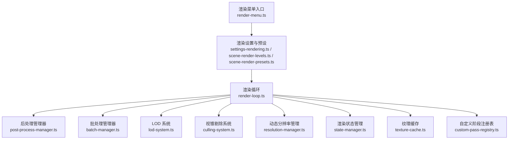

图表来源
- [frontend/src/core/render-loop.ts](file://frontend/src/core/render-loop.ts)
- [frontend/src/menus/settings-rendering.ts](file://frontend/src/menus/settings-rendering.ts)
- [frontend/src/menus/scene-render-levels.ts](file://frontend/src/menus/scene-render-levels.ts)
- [frontend/src/menus/scene-render-presets.ts](file://frontend/src/menus/scene-render-presets.ts)
- [frontend/src/menus/render-menu.ts](file://frontend/src/menus/render-menu.ts)
- [frontend/src/scene/render/post-process-manager.ts](file://frontend/src/scene/render/post-process-manager.ts)
- [frontend/src/scene/render/batch-manager.ts](file://frontend/src/scene/render/batch-manager.ts)
- [frontend/src/scene/render/lod-system.ts](file://frontend/src/scene/render/lod-system.ts)
- [frontend/src/scene/render/culling-system.ts](file://frontend/src/scene/render/culling-system.ts)
- [frontend/src/scene/render/resolution-manager.ts](file://frontend/src/scene/render/resolution-manager.ts)
- [frontend/src/scene/render/state-manager.ts](file://frontend/src/scene/render/state-manager.ts)
- [frontend/src/scene/render/texture-cache.ts](file://frontend/src/scene/render/texture-cache.ts)
- [frontend/src/scene/render/custom-pass-registry.ts](file://frontend/src/scene/render/custom-pass-registry.ts)

章节来源
- [frontend/src/core/render-loop.ts](file://frontend/src/core/render-loop.ts)
- [frontend/src/menus/settings-rendering.ts](file://frontend/src/menus/settings-rendering.ts)
- [frontend/src/menus/scene-render-levels.ts](file://frontend/src/menus/scene-render-levels.ts)
- [frontend/src/menus/scene-render-presets.ts](file://frontend/src/menus/scene-render-presets.ts)
- [frontend/src/menus/render-menu.ts](file://frontend/src/menus/render-menu.ts)
- [frontend/src/scene/render/post-process-manager.ts](file://frontend/src/scene/render/post-process-manager.ts)
- [frontend/src/scene/render/batch-manager.ts](file://frontend/src/scene/render/batch-manager.ts)
- [frontend/src/scene/render/lod-system.ts](file://frontend/src/scene/render/lod-system.ts)
- [frontend/src/scene/render/culling-system.ts](file://frontend/src/scene/render/culling-system.ts)
- [frontend/src/scene/render/resolution-manager.ts](file://frontend/src/scene/render/resolution-manager.ts)
- [frontend/src/scene/render/state-manager.ts](file://frontend/src/scene/render/state-manager.ts)
- [frontend/src/scene/render/texture-cache.ts](file://frontend/src/scene/render/texture-cache.ts)
- [frontend/src/scene/render/custom-pass-registry.ts](file://frontend/src/scene/render/custom-pass-registry.ts)

## 核心组件
- 渲染循环（Render Loop）
  - 职责：驱动每帧更新、执行各子系统回调、统计帧耗时并反馈给 UI。
  - 关键点：帧间隔控制、节流/限帧、异常保护、可插拔的阶段钩子。
- 渲染设置与预设（Settings & Presets）
  - 职责：定义质量档位、后处理开关、分辨率缩放、阴影/反射强度等。
  - 关键点：预设模板、运行时切换、持久化与回退策略。
- 后处理管理器（Post Process Manager）
  - 职责：维护后处理链、按质量档位启用/禁用效果、统一参数注入。
- 批处理管理器（Batch Manager）
  - 职责：合并绘制调用、减少状态切换、提升 GPU 吞吐。
- LOD 系统（Level of Detail）
  - 职责：根据距离/重要性选择模型细节级别，降低三角面数与纹理带宽。
- 视锥剔除系统（Frustum Culling）
  - 职责：剔除不可见对象，减少提交到 GPU 的几何体数量。
- 动态分辨率管理（Resolution Manager）
  - 职责：在目标帧率下自动调整渲染分辨率或后处理强度，维持流畅度。
- 渲染状态管理（State Manager）
  - 职责：集中管理材质/深度/混合/采样等状态，避免冗余切换。
- 纹理缓存（Texture Cache）
  - 职责：复用纹理实例、限制最大占用、LRU 淘汰与按需加载。
- 自定义阶段注册表（Custom Pass Registry）
  - 职责：注册/编排自定义渲染阶段，支持条件启用与参数注入。

章节来源
- [frontend/src/core/render-loop.ts](file://frontend/src/core/render-loop.ts)
- [frontend/src/menus/settings-rendering.ts](file://frontend/src/menus/settings-rendering.ts)
- [frontend/src/menus/scene-render-levels.ts](file://frontend/src/menus/scene-render-levels.ts)
- [frontend/src/menus/scene-render-presets.ts](file://frontend/src/menus/scene-render-presets.ts)
- [frontend/src/menus/render-menu.ts](file://frontend/src/menus/render-menu.ts)
- [frontend/src/scene/render/post-process-manager.ts](file://frontend/src/scene/render/post-process-manager.ts)
- [frontend/src/scene/render/batch-manager.ts](file://frontend/src/scene/render/batch-manager.ts)
- [frontend/src/scene/render/lod-system.ts](file://frontend/src/scene/render/lod-system.ts)
- [frontend/src/scene/render/culling-system.ts](file://frontend/src/scene/render/culling-system.ts)
- [frontend/src/scene/render/resolution-manager.ts](file://frontend/src/scene/render/resolution-manager.ts)
- [frontend/src/scene/render/state-manager.ts](file://frontend/src/scene/render/state-manager.ts)
- [frontend/src/scene/render/texture-cache.ts](file://frontend/src/scene/render/texture-cache.ts)
- [frontend/src/scene/render/custom-pass-registry.ts](file://frontend/src/scene/render/custom-pass-registry.ts)

## 架构总览
下图展示了从渲染循环到各子系统的数据与控制流，以及设置与菜单对运行时的影响。

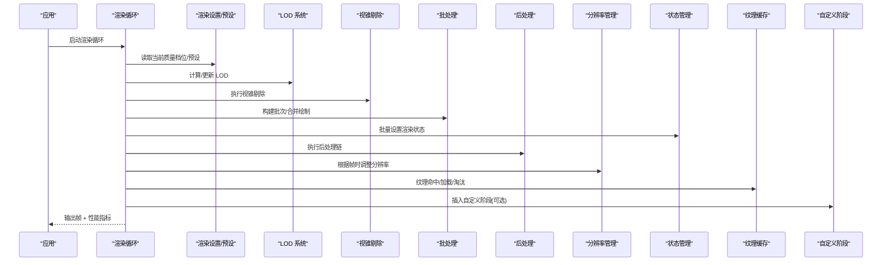

图表来源
- [frontend/src/core/render-loop.ts](file://frontend/src/core/render-loop.ts)
- [frontend/src/menus/settings-rendering.ts](file://frontend/src/menus/settings-rendering.ts)
- [frontend/src/menus/scene-render-presets.ts](file://frontend/src/menus/scene-render-presets.ts)
- [frontend/src/scene/render/lod-system.ts](file://frontend/src/scene/render/lod-system.ts)
- [frontend/src/scene/render/culling-system.ts](file://frontend/src/scene/render/culling-system.ts)
- [frontend/src/scene/render/batch-manager.ts](file://frontend/src/scene/render/batch-manager.ts)
- [frontend/src/scene/render/post-process-manager.ts](file://frontend/src/scene/render/post-process-manager.ts)
- [frontend/src/scene/render/resolution-manager.ts](file://frontend/src/scene/render/resolution-manager.ts)
- [frontend/src/scene/render/state-manager.ts](file://frontend/src/scene/render/state-manager.ts)
- [frontend/src/scene/render/texture-cache.ts](file://frontend/src/scene/render/texture-cache.ts)
- [frontend/src/scene/render/custom-pass-registry.ts](file://frontend/src/scene/render/custom-pass-registry.ts)

## 详细组件分析

### 渲染循环与帧率控制
- 设计要点
  - 使用 requestAnimationFrame 驱动主循环，内部维护帧时间戳与累计耗时。
  - 支持目标帧率上限与最小步长，避免 CPU/GPU 过载。
  - 暴露 per-frame 钩子，供 LOD、剔除、后处理、分辨率管理等子系统订阅。
  - 收集每帧耗时、GPU/CPU 指标，用于动态分辨率与 UI 展示。
- 关键流程
  - 初始化：注册引擎事件、创建/恢复上下文、绑定钩子。
  - 每帧：更新时间 → 执行 LOD/剔除 → 批处理 → 状态同步 → 后处理 → 分辨率自适应 → 输出帧。
  - 退出：清理监听器、释放资源、重置状态。

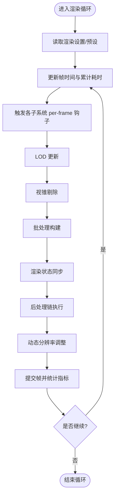

图表来源
- [frontend/src/core/render-loop.ts](file://frontend/src/core/render-loop.ts)

章节来源
- [frontend/src/core/render-loop.ts](file://frontend/src/core/render-loop.ts)

### 质量配置与预设
- 质量档位
  - 低/中/高/超高：分别控制阴影质量、反射/折射、体积云、后处理强度、纹理分辨率上限等。
- 预设模板
  - 内置多套预设，覆盖不同设备与平台（桌面/移动端/VR）。
- 运行时切换
  - 通过菜单或 API 切换，增量更新受影响子系统，避免全量重建。
- 持久化与回退
  - 本地存储用户偏好；若无效则回退至默认预设。

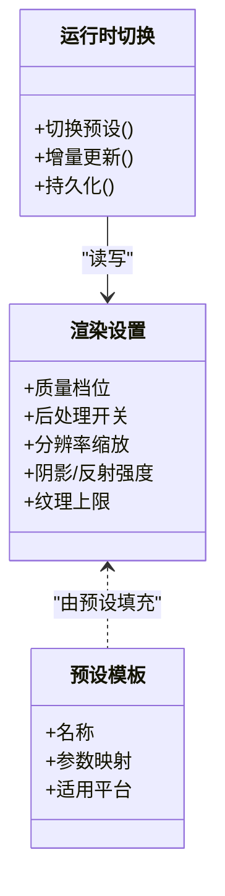

图表来源
- [frontend/src/menus/settings-rendering.ts](file://frontend/src/menus/settings-rendering.ts)
- [frontend/src/menus/scene-render-presets.ts](file://frontend/src/menus/scene-render-presets.ts)

章节来源
- [frontend/src/menus/settings-rendering.ts](file://frontend/src/menus/settings-rendering.ts)
- [frontend/src/menus/scene-render-levels.ts](file://frontend/src/menus/scene-render-levels.ts)
- [frontend/src/menus/scene-render-presets.ts](file://frontend/src/menus/scene-render-presets.ts)
- [frontend/src/menus/render-menu.ts](file://frontend/src/menus/render-menu.ts)

### 后处理链管理
- 职责
  - 维护后处理效果列表、顺序与参数；根据质量档位启用/禁用特定效果。
- 关键点
  - 统一参数注入接口，支持每帧更新。
  - 错误隔离：单个效果失败不影响整条链。
  - 性能提示：记录每个效果的耗时，辅助调优。

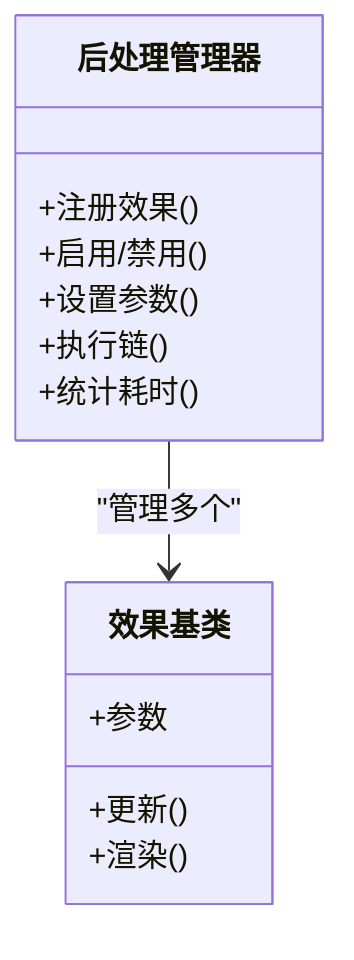

图表来源
- [frontend/src/scene/render/post-process-manager.ts](file://frontend/src/scene/render/post-process-manager.ts)

章节来源
- [frontend/src/scene/render/post-process-manager.ts](file://frontend/src/scene/render/post-process-manager.ts)

### 批处理系统
- 职责
  - 将相同材质/状态的网格合并为批次，减少 draw call 与状态切换。
- 关键点
  - 批次键：材质 ID、纹理集、混合模式、深度写入等。
  - 增量更新：仅重算受影响的批次。
  - 内存友好：及时回收空批次，避免碎片化。

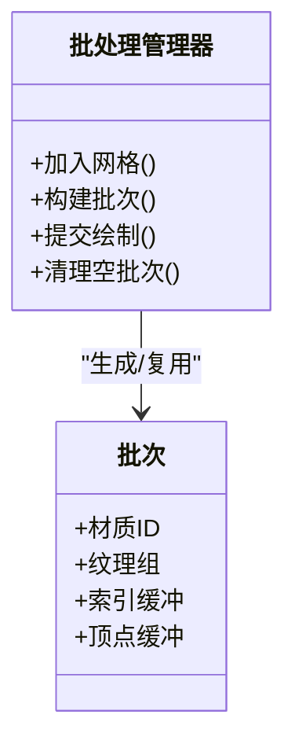

图表来源
- [frontend/src/scene/render/batch-manager.ts](file://frontend/src/scene/render/batch-manager.ts)

章节来源
- [frontend/src/scene/render/batch-manager.ts](file://frontend/src/scene/render/batch-manager.ts)

### LOD 系统
- 职责
  - 依据相机距离、屏幕占比或重要性权重，选择合适细节级别。
- 关键点
  - 多级细节：至少三级（近/中/远），支持平滑过渡。
  - 预计算：提前准备不同级别的网格/纹理。
  - 防抖动：避免频繁切换导致的闪烁。

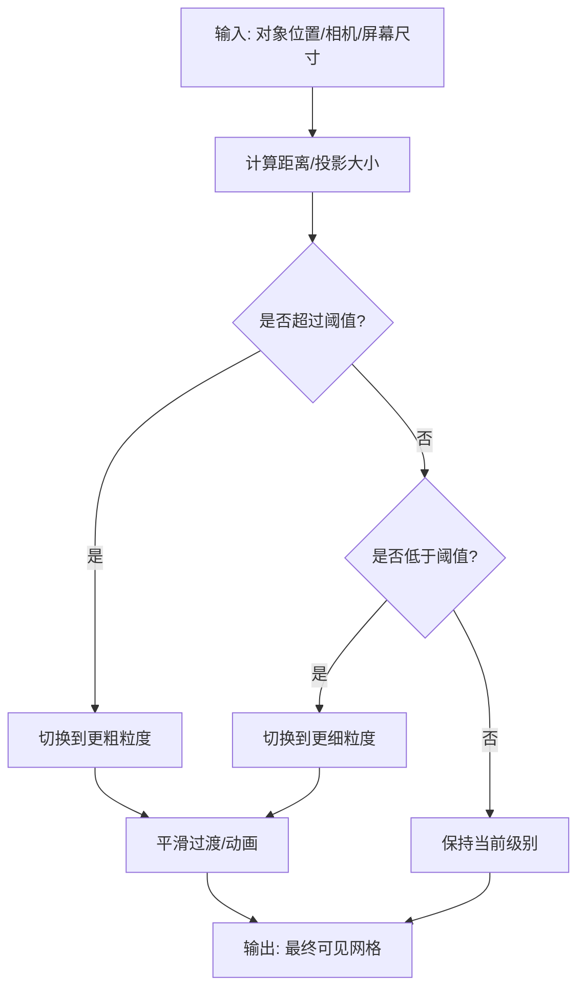

图表来源
- [frontend/src/scene/render/lod-system.ts](file://frontend/src/scene/render/lod-system.ts)

章节来源
- [frontend/src/scene/render/lod-system.ts](file://frontend/src/scene/render/lod-system.ts)

### 视锥剔除系统
- 职责
  - 剔除不在相机视锥内的对象，减少后续管线压力。
- 关键点
  - 包围体：球体/AABB 快速测试。
  - 分层剔除：静态/动态分离，静态可离线预处理。
  - 结果缓存：短时间内复用剔除结果。

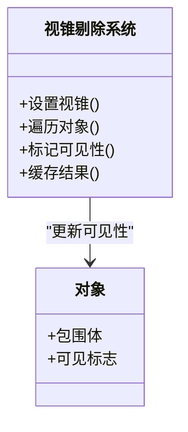

图表来源
- [frontend/src/scene/render/culling-system.ts](file://frontend/src/scene/render/culling-system.ts)

章节来源
- [frontend/src/scene/render/culling-system.ts](file://frontend/src/scene/render/culling-system.ts)

### 动态分辨率管理
- 职责
  - 在目标帧率不达标时，自动降低渲染分辨率或后处理强度，以稳定体验。
- 关键点
  - 目标帧率窗口：滑动平均与阈值判断。
  - 步进策略：渐进式下调/上调，避免震荡。
  - 降级优先级：先降后处理，再降分辨率。

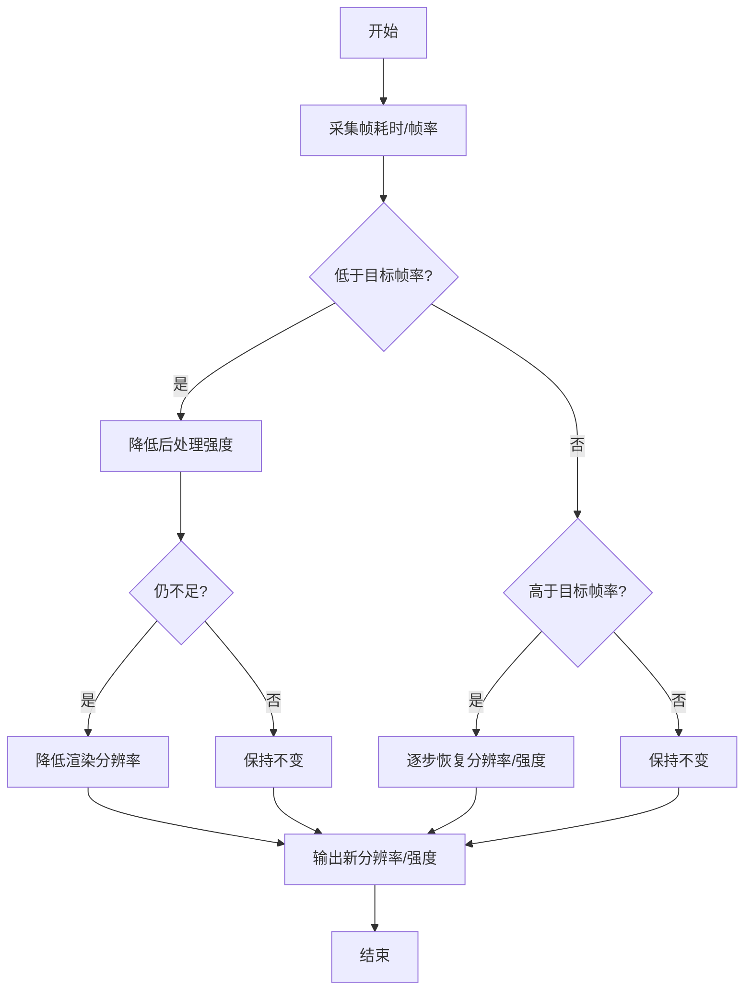

图表来源
- [frontend/src/scene/render/resolution-manager.ts](file://frontend/src/scene/render/resolution-manager.ts)

章节来源
- [frontend/src/scene/render/resolution-manager.ts](file://frontend/src/scene/render/resolution-manager.ts)

### 渲染状态管理
- 职责
  - 集中管理材质、深度、混合、采样等状态，减少冗余切换。
- 关键点
  - 状态快照：在进入/退出复杂阶段时保存/恢复。
  - 批量应用：同批次内共享状态，跨批次最小化变更。
  - 诊断：记录状态切换次数与类型分布。

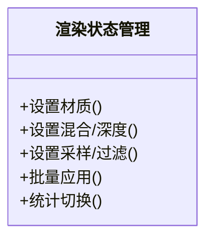

图表来源
- [frontend/src/scene/render/state-manager.ts](file://frontend/src/scene/render/state-manager.ts)

章节来源
- [frontend/src/scene/render/state-manager.ts](file://frontend/src/scene/render/state-manager.ts)

### 纹理缓存机制
- 职责
  - 缓存已加载纹理，避免重复下载与解码；控制内存占用，LRU 淘汰。
- 关键点
  - 键策略：URL/哈希 + 格式 + 尺寸。
  - 生命周期：引用计数 + 超时回收。
  - 并发控制：同一资源并发请求去重。

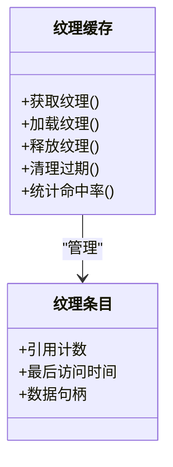

图表来源
- [frontend/src/scene/render/texture-cache.ts](file://frontend/src/scene/render/texture-cache.ts)

章节来源
- [frontend/src/scene/render/texture-cache.ts](file://frontend/src/scene/render/texture-cache.ts)

### 自定义渲染阶段扩展
- 目标
  - 在不侵入核心循环的前提下，插入自定义渲染阶段（如调试线框、热力图、自定义后处理）。
- 步骤
  - 实现阶段接口：包含初始化、每帧更新、渲染回调。
  - 注册阶段：指定执行顺序与条件（质量档位/平台）。
  - 参数注入：通过统一参数通道传入每帧数据。
  - 启停控制：在菜单或运行时开关阶段。

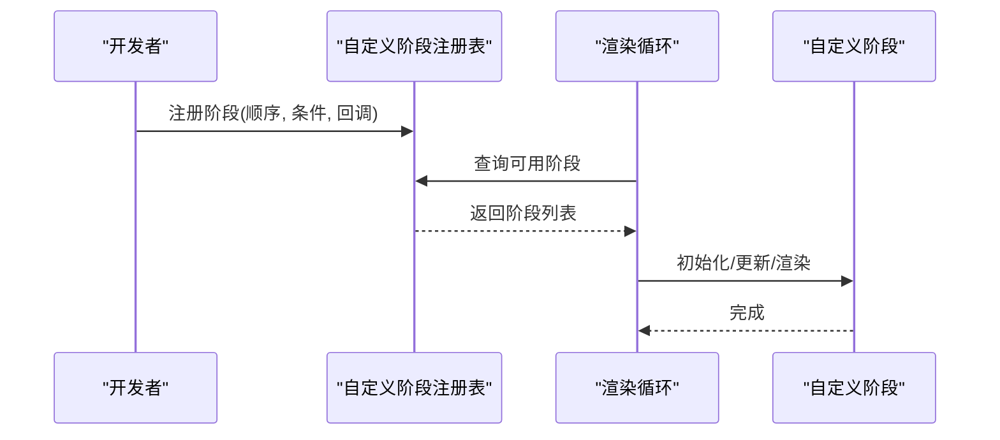

图表来源
- [frontend/src/scene/render/custom-pass-registry.ts](file://frontend/src/scene/render/custom-pass-registry.ts)
- [frontend/src/core/render-loop.ts](file://frontend/src/core/render-loop.ts)

章节来源
- [frontend/src/scene/render/custom-pass-registry.ts](file://frontend/src/scene/render/custom-pass-registry.ts)
- [frontend/src/core/render-loop.ts](file://frontend/src/core/render-loop.ts)

## 依赖关系分析
- 耦合与内聚
  - 渲染循环作为协调者，与各子系统松耦合，通过接口/事件交互。
  - 设置与预设独立于运行时，便于热切换与测试。
- 外部依赖
  - 基于 Babylon.js 的引擎抽象（材质、纹理、后处理、渲染目标等）。
- 潜在环依赖
  - 建议通过注册表与事件总线解耦，避免直接相互引用。

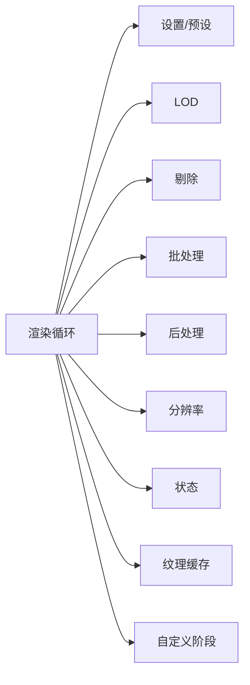

图表来源
- [frontend/src/core/render-loop.ts](file://frontend/src/core/render-loop.ts)
- [frontend/src/menus/settings-rendering.ts](file://frontend/src/menus/settings-rendering.ts)
- [frontend/src/menus/scene-render-presets.ts](file://frontend/src/menus/scene-render-presets.ts)
- [frontend/src/scene/render/lod-system.ts](file://frontend/src/scene/render/lod-system.ts)
- [frontend/src/scene/render/culling-system.ts](file://frontend/src/scene/render/culling-system.ts)
- [frontend/src/scene/render/batch-manager.ts](file://frontend/src/scene/render/batch-manager.ts)
- [frontend/src/scene/render/post-process-manager.ts](file://frontend/src/scene/render/post-process-manager.ts)
- [frontend/src/scene/render/resolution-manager.ts](file://frontend/src/scene/render/resolution-manager.ts)
- [frontend/src/scene/render/state-manager.ts](file://frontend/src/scene/render/state-manager.ts)
- [frontend/src/scene/render/texture-cache.ts](file://frontend/src/scene/render/texture-cache.ts)
- [frontend/src/scene/render/custom-pass-registry.ts](file://frontend/src/scene/render/custom-pass-registry.ts)

章节来源
- [frontend/src/core/render-loop.ts](file://frontend/src/core/render-loop.ts)
- [frontend/src/menus/settings-rendering.ts](file://frontend/src/menus/settings-rendering.ts)
- [frontend/src/menus/scene-render-presets.ts](file://frontend/src/menus/scene-render-presets.ts)
- [frontend/src/scene/render/lod-system.ts](file://frontend/src/scene/render/lod-system.ts)
- [frontend/src/scene/render/culling-system.ts](file://frontend/src/scene/render/culling-system.ts)
- [frontend/src/scene/render/batch-manager.ts](file://frontend/src/scene/render/batch-manager.ts)
- [frontend/src/scene/render/post-process-manager.ts](file://frontend/src/scene/render/post-process-manager.ts)
- [frontend/src/scene/render/resolution-manager.ts](file://frontend/src/scene/render/resolution-manager.ts)
- [frontend/src/scene/render/state-manager.ts](file://frontend/src/scene/render/state-manager.ts)
- [frontend/src/scene/render/texture-cache.ts](file://frontend/src/scene/render/texture-cache.ts)
- [frontend/src/scene/render/custom-pass-registry.ts](file://frontend/src/scene/render/custom-pass-registry.ts)

## 性能考量
- 批处理优先
  - 尽量合并材质与纹理，减少状态切换与 draw call。
- LOD 与剔除
  - 合理设置阈值与层级，避免过度切换；静态对象可离线预处理。
- 后处理分级
  - 低端设备关闭昂贵效果（SSR、体积光等），保留基础增强。
- 动态分辨率
  - 以目标帧率为约束，采用平滑调节策略，避免抖动。
- 纹理缓存
  - 控制最大内存占用，LRU 淘汰，避免峰值内存飙升。
- 状态管理
  - 批量应用状态，记录切换热点，针对性优化。

[本节为通用指导，无需列出具体文件来源]

## 故障排查指南
- 常见问题
  - 掉帧严重：检查后处理链与分辨率自适应策略，确认是否存在昂贵效果未降级。
  - 纹理缺失/闪烁：查看纹理缓存命中率与加载并发，确认键策略是否正确。
  - LOD 闪烁：检查阈值与过渡动画，必要时增加滞后区间。
  - 剔除失效：验证包围体与视锥更新时机，确保与相机同步。
- 定位方法
  - 使用渲染循环输出的每帧指标（CPU/GPU 耗时、draw call、三角形数）。
  - 开启状态切换统计与后处理耗时明细，定位瓶颈。
  - 临时关闭自定义阶段，验证是否为第三方逻辑导致。

章节来源
- [frontend/src/core/render-loop.ts](file://frontend/src/core/render-loop.ts)
- [frontend/src/scene/render/post-process-manager.ts](file://frontend/src/scene/render/post-process-manager.ts)
- [frontend/src/scene/render/texture-cache.ts](file://frontend/src/scene/render/texture-cache.ts)
- [frontend/src/scene/render/lod-system.ts](file://frontend/src/scene/render/lod-system.ts)
- [frontend/src/scene/render/culling-system.ts](file://frontend/src/scene/render/culling-system.ts)
- [frontend/src/scene/render/state-manager.ts](file://frontend/src/scene/render/state-manager.ts)

## 结论
本渲染管线以渲染循环为核心，结合质量预设、后处理、批处理、LOD、剔除、动态分辨率、状态管理与纹理缓存，形成可扩展、可观测、可优化的完整体系。通过注册表机制，开发者可在不侵入核心的前提下添加自定义阶段，满足多样化渲染需求。配合性能指标与调试技巧，可有效定位与解决性能问题，保障在不同设备上的稳定体验。

[本节为总结性内容，无需列出具体文件来源]

## 附录
- 术语
  - 渲染管线：从场景数据到像素输出的全过程。
  - 批处理：合并相似绘制调用以减少开销。
  - LOD：根据距离/重要性选择不同细节级别。
  - 视锥剔除：剔除不可见对象以降低负载。
  - 动态分辨率：根据性能目标自动调整渲染分辨率。
- 参考
  - 渲染菜单与设置：用于理解质量档位与运行时切换方式。
  - 后处理管理器：了解效果链的组织与参数注入。
  - 自定义阶段注册表：学习如何扩展渲染管线。

[本节为补充信息，无需列出具体文件来源]