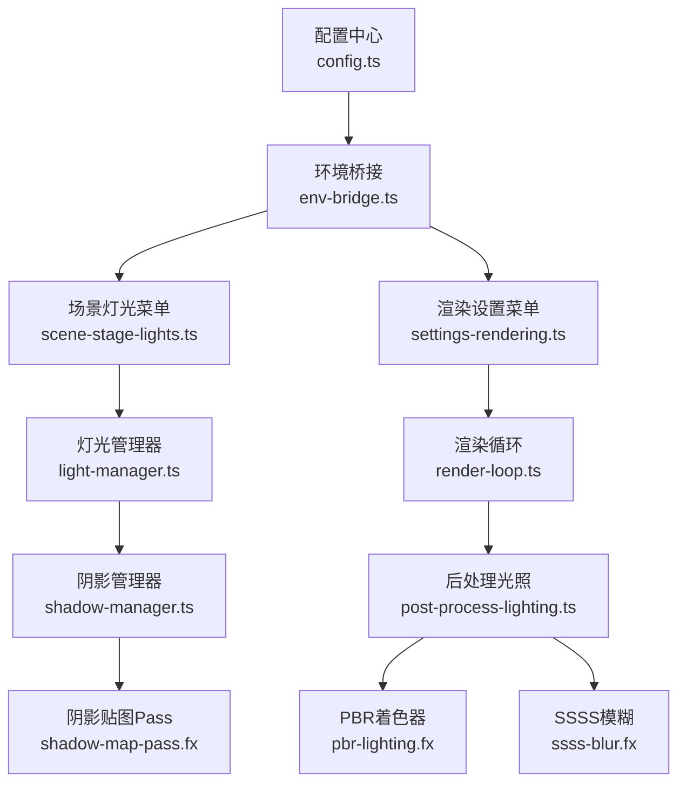
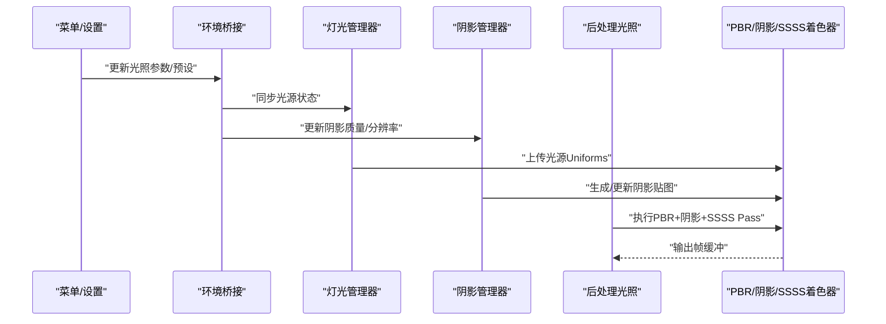
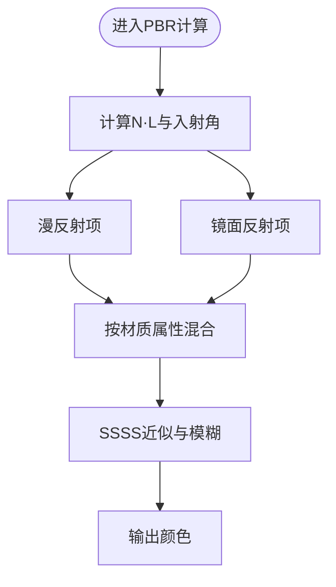
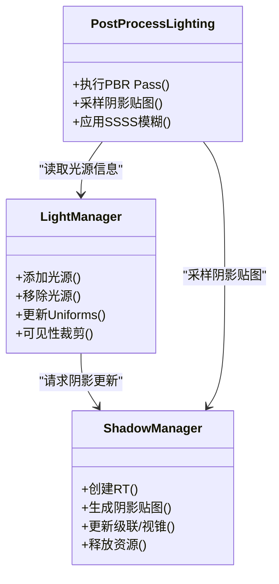
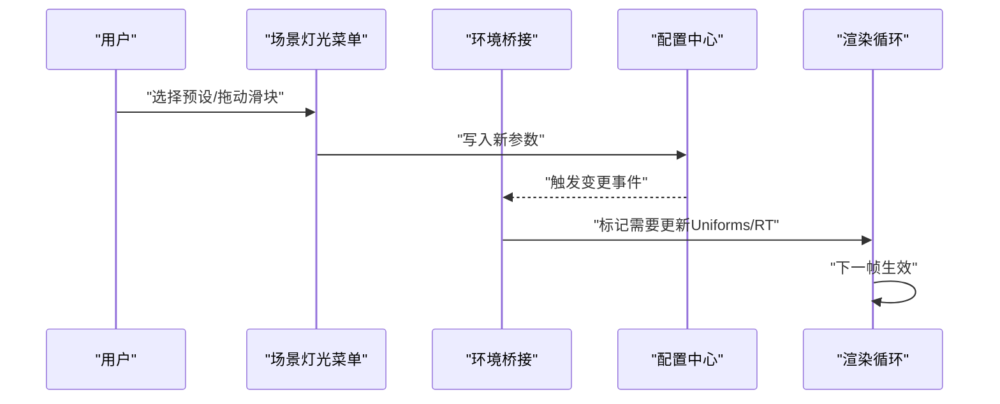
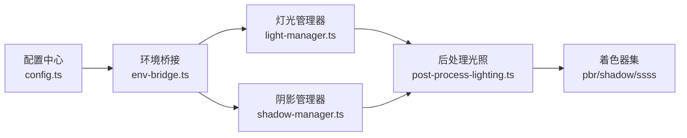

# 光照系统

<cite>
**本文引用的文件**   
- [frontend/src/scene/env/env-lighting.ts](file://frontend/src/scene/env/env-lighting.ts)
- [frontend/src/scene/env/env-skybox.ts](file://frontend/src/scene/env/env-skybox.ts)
- [frontend/src/scene/env/env-bridge.ts](file://frontend/src/scene/env/env-bridge.ts)
- [frontend/src/menus/scene-stage-lights.ts](file://frontend/src/menus/scene-stage-lights.ts)
- [frontend/src/menus/settings-rendering.ts](file://frontend/src/menus/settings-rendering.ts)
- [frontend/src/core/config.ts](file://frontend/src/core/config.ts)
- [frontend/src/core/render-loop.ts](file://frontend/src/core/render-loop.ts)
- [frontend/src/scene/manager/light-manager.ts](file://frontend/src/scene/manager/light-manager.ts)
- [frontend/src/scene/manager/shadow-manager.ts](file://frontend/src/scene/manager/shadow-manager.ts)
- [frontend/src/scene/render/post-process-lighting.ts](file://frontend/src/scene/render/post-process-lighting.ts)
- [frontend/src/scene/env/shaders/pbr-lighting.fx](file://frontend/src/scene/env/shaders/pbr-lighting.fx)
- [frontend/src/scene/env/shaders/shadow-map-pass.fx](file://frontend/src/scene/env/shaders/shadow-map-pass.fx)
- [frontend/src/scene/env/shaders/ssss-blur.fx](file://frontend/src/scene/env/shaders/ssss-blur.fx)
</cite>

## 目录
1. [简介](#简介)
2. [项目结构](#项目结构)
3. [核心组件](#核心组件)
4. [架构总览](#架构总览)
5. [详细组件分析](#详细组件分析)
6. [依赖关系分析](#依赖关系分析)
7. [性能考量](#性能考量)
8. [故障排查指南](#故障排查指南)
9. [结论](#结论)
10. [附录](#附录)

## 简介
本文件面向MikuMikuAR的光照子系统，系统性阐述PBR光照模型（漫反射、镜面反射、次表面散射）的实现思路与数据流；梳理光源类型（方向光、点光源、聚光灯）与阴影映射管线；解释光照预设系统与动态调整机制；对比烘焙与实时光照的性能特征，并给出移动端优化策略；最后提供自定义光照效果接入方法与调试工具使用指南。文档以代码级实现为依据，辅以可视化图示帮助理解。

## 项目结构
光照相关的前端模块主要分布在以下位置：
- 环境/光照桥接与配置：env-bridge.ts、config.ts
- 场景灯光菜单与渲染设置：scene-stage-lights.ts、settings-rendering.ts
- 渲染循环集成：render-loop.ts
- 管理器层：light-manager.ts、shadow-manager.ts
- 后处理与着色器：post-process-lighting.ts、pbr-lighting.fx、shadow-map-pass.fx、ssss-blur.fx

图表来源
- [frontend/src/core/config.ts](file://frontend/src/core/config.ts)
- [frontend/src/scene/env/env-bridge.ts](file://frontend/src/scene/env/env-bridge.ts)
- [frontend/src/menus/scene-stage-lights.ts](file://frontend/src/menus/scene-stage-lights.ts)
- [frontend/src/menus/settings-rendering.ts](file://frontend/src/menus/settings-rendering.ts)
- [frontend/src/core/render-loop.ts](file://frontend/src/core/render-loop.ts)
- [frontend/src/scene/manager/light-manager.ts](file://frontend/src/scene/manager/light-manager.ts)
- [frontend/src/scene/manager/shadow-manager.ts](file://frontend/src/scene/manager/shadow-manager.ts)
- [frontend/src/scene/render/post-process-lighting.ts](file://frontend/src/scene/render/post-process-lighting.ts)
- [frontend/src/scene/env/shaders/pbr-lighting.fx](file://frontend/src/scene/env/shaders/pbr-lighting.fx)
- [frontend/src/scene/env/shaders/shadow-map-pass.fx](file://frontend/src/scene/env/shaders/shadow-map-pass.fx)
- [frontend/src/scene/env/shaders/ssss-blur.fx](file://frontend/src/scene/env/shaders/ssss-blur.fx)

章节来源
- [frontend/src/core/config.ts](file://frontend/src/core/config.ts)
- [frontend/src/scene/env/env-bridge.ts](file://frontend/src/scene/env/env-bridge.ts)
- [frontend/src/menus/scene-stage-lights.ts](file://frontend/src/menus/scene-stage-lights.ts)
- [frontend/src/menus/settings-rendering.ts](file://frontend/src/menus/settings-rendering.ts)
- [frontend/src/core/render-loop.ts](file://frontend/src/core/render-loop.ts)
- [frontend/src/scene/manager/light-manager.ts](file://frontend/src/scene/manager/light-manager.ts)
- [frontend/src/scene/manager/shadow-manager.ts](file://frontend/src/scene/manager/shadow-manager.ts)
- [frontend/src/scene/render/post-process-lighting.ts](file://frontend/src/scene/render/post-process-lighting.ts)
- [frontend/src/scene/env/shaders/pbr-lighting.fx](file://frontend/src/scene/env/shaders/pbr-lighting.fx)
- [frontend/src/scene/env/shaders/shadow-map-pass.fx](file://frontend/src/scene/env/shaders/shadow-map-pass.fx)
- [frontend/src/scene/env/shaders/ssss-blur.fx](file://frontend/src/scene/env/shaders/ssss-blur.fx)

## 核心组件
- 配置中心：集中管理光照质量、阴影分辨率、采样数、SSSS强度等全局参数，供菜单与运行时读取。
- 环境桥接：将上层UI与配置变化同步到渲染侧，负责更新Uniforms、纹理绑定与资源生命周期。
- 灯光管理器：维护场景光源集合（方向光、点光源、聚光灯），计算每帧的可见性、裁剪与批处理。
- 阴影管理器：生成与更新阴影贴图，支持级联/多通道策略，协调深度Pass与采样。
- 后处理光照：在渲染后期阶段融合PBR结果、阴影与SSSS模糊，输出最终光照。
- 着色器：PBR主着色器、阴影贴图Pass、SSSS模糊Pass分别承担不同阶段的数学计算。

章节来源
- [frontend/src/core/config.ts](file://frontend/src/core/config.ts)
- [frontend/src/scene/env/env-bridge.ts](file://frontend/src/scene/env/env-bridge.ts)
- [frontend/src/scene/manager/light-manager.ts](file://frontend/src/scene/manager/light-manager.ts)
- [frontend/src/scene/manager/shadow-manager.ts](file://frontend/src/scene/manager/shadow-manager.ts)
- [frontend/src/scene/render/post-process-lighting.ts](file://frontend/src/scene/render/post-process-lighting.ts)
- [frontend/src/scene/env/shaders/pbr-lighting.fx](file://frontend/src/scene/env/shaders/pbr-lighting.fx)
- [frontend/src/scene/env/shaders/shadow-map-pass.fx](file://frontend/src/scene/env/shaders/shadow-map-pass.fx)
- [frontend/src/scene/env/shaders/ssss-blur.fx](file://frontend/src/scene/env/shaders/ssss-blur.fx)

## 架构总览
整体流程从配置与UI驱动开始，经环境桥接下发至渲染层，由灯光与阴影管理器准备数据，最终在后处理阶段完成PBR合成与SSSS增强。

图表来源
- [frontend/src/menus/scene-stage-lights.ts](file://frontend/src/menus/scene-stage-lights.ts)
- [frontend/src/menus/settings-rendering.ts](file://frontend/src/menus/settings-rendering.ts)
- [frontend/src/scene/env/env-bridge.ts](file://frontend/src/scene/env/env-bridge.ts)
- [frontend/src/scene/manager/light-manager.ts](file://frontend/src/scene/manager/light-manager.ts)
- [frontend/src/scene/manager/shadow-manager.ts](file://frontend/src/scene/manager/shadow-manager.ts)
- [frontend/src/scene/render/post-process-lighting.ts](file://frontend/src/scene/render/post-process-lighting.ts)
- [frontend/src/scene/env/shaders/pbr-lighting.fx](file://frontend/src/scene/env/shaders/pbr-lighting.fx)
- [frontend/src/scene/env/shaders/shadow-map-pass.fx](file://frontend/src/scene/env/shaders/shadow-map-pass.fx)
- [frontend/src/scene/env/shaders/ssss-blur.fx](file://frontend/src/scene/env/shaders/ssss-blur.fx)

## 详细组件分析

### PBR光照模型（漫反射、镜面反射、次表面散射）
- 漫反射：基于法线与入射方向的Lambert或改进模型，结合材质反照率与能量守恒约束。
- 镜面反射：采用微面元分布函数与几何遮蔽项，配合菲涅尔近似，控制高光强度与宽度。
- 次表面散射（SSSS）：通过半透明材质参数与体积散射近似，在边缘处产生柔和透光效果；后处理阶段进行模糊与混合。

图表来源
- [frontend/src/scene/env/shaders/pbr-lighting.fx](file://frontend/src/scene/env/shaders/pbr-lighting.fx)
- [frontend/src/scene/env/shaders/ssss-blur.fx](file://frontend/src/scene/env/shaders/ssss-blur.fx)

章节来源
- [frontend/src/scene/env/shaders/pbr-lighting.fx](file://frontend/src/scene/env/shaders/pbr-lighting.fx)
- [frontend/src/scene/env/shaders/ssss-blur.fx](file://frontend/src/scene/env/shaders/ssss-blur.fx)

### 光源类型与阴影映射
- 方向光：无限远平行光，适合模拟太阳光；阴影通常使用级联阴影贴图（Cascaded Shadow Maps）。
- 点光源：向全空间辐射，阴影可采用立方体贴图或分片策略。
- 聚光灯：锥形照射区域，阴影贴图覆盖投影范围，支持角度与衰减控制。

图表来源
- [frontend/src/scene/manager/light-manager.ts](file://frontend/src/scene/manager/light-manager.ts)
- [frontend/src/scene/manager/shadow-manager.ts](file://frontend/src/scene/manager/shadow-manager.ts)
- [frontend/src/scene/render/post-process-lighting.ts](file://frontend/src/scene/render/post-process-lighting.ts)
- [frontend/src/scene/env/shaders/shadow-map-pass.fx](file://frontend/src/scene/env/shaders/shadow-map-pass.fx)

章节来源
- [frontend/src/scene/manager/light-manager.ts](file://frontend/src/scene/manager/light-manager.ts)
- [frontend/src/scene/manager/shadow-manager.ts](file://frontend/src/scene/manager/shadow-manager.ts)
- [frontend/src/scene/render/post-process-lighting.ts](file://frontend/src/scene/render/post-process-lighting.ts)
- [frontend/src/scene/env/shaders/shadow-map-pass.fx](file://frontend/src/scene/env/shaders/shadow-map-pass.fx)

### 光照预设系统与动态调整
- 预设系统：提供“室内”、“户外”、“舞台”等常用光照配置，一键切换环境亮度、主光方向、阴影质量与SSSS强度。
- 动态调整：运行时通过菜单或API修改参数，环境桥接立即下发至渲染层，避免重建资源。

图表来源
- [frontend/src/menus/scene-stage-lights.ts](file://frontend/src/menus/scene-stage-lights.ts)
- [frontend/src/core/config.ts](file://frontend/src/core/config.ts)
- [frontend/src/scene/env/env-bridge.ts](file://frontend/src/scene/env/env-bridge.ts)
- [frontend/src/core/render-loop.ts](file://frontend/src/core/render-loop.ts)

章节来源
- [frontend/src/menus/scene-stage-lights.ts](file://frontend/src/menus/scene-stage-lights.ts)
- [frontend/src/core/config.ts](file://frontend/src/core/config.ts)
- [frontend/src/scene/env/env-bridge.ts](file://frontend/src/scene/env/env-bridge.ts)
- [frontend/src/core/render-loop.ts](file://frontend/src/core/render-loop.ts)

### 光照烘焙与实时光照对比
- 实时光照：灵活度高，可动态调整光源与材质；成本随光源数量、阴影分辨率与SSSS强度线性增长。
- 光照烘焙：预计算静态光照与阴影贴图，运行时仅采样；适合静态场景，减少GPU压力。
- 混合方案：静态部分烘焙，动态对象使用实时光照与轻量阴影，平衡质量与性能。

[本节为通用指导，不直接分析具体文件]

### 移动端优化策略
- 降低阴影分辨率与级联数，启用PCF软阴影降采样。
- 限制最大光源数量，优先方向光与少量点/聚光灯。
- 关闭或减弱SSSS，改用简化的边缘发光近似。
- 使用较低精度的浮点RT与压缩纹理，减少带宽占用。
- 合并Pass与批处理，减少状态切换。

[本节为通用指导，不直接分析具体文件]

### 自定义光照效果接入方法
- 新增着色器：在shaders目录下扩展PBR或后处理Pass，定义输入纹理与Uniforms。
- 注册管线：在后处理光照中插入新的Pass节点，确保输入/输出纹理正确连接。
- 暴露参数：在配置中心增加开关与滑块，并在环境桥接中同步到Uniforms。
- 测试验证：使用调试工具观察中间缓冲与最终输出，逐步调参。

章节来源
- [frontend/src/scene/render/post-process-lighting.ts](file://frontend/src/scene/render/post-process-lighting.ts)
- [frontend/src/scene/env/shaders/pbr-lighting.fx](file://frontend/src/scene/env/shaders/pbr-lighting.fx)
- [frontend/src/core/config.ts](file://frontend/src/core/config.ts)
- [frontend/src/scene/env/env-bridge.ts](file://frontend/src/scene/env/env-bridge.ts)

### 调试工具使用指南
- 中间缓冲查看：导出各Pass的输出纹理（如PBR基础色、法线、阴影贴图、SSSS模糊结果），用于定位问题。
- 参数快照：记录当前配置与Uniforms值，复现特定光照状态。
- 性能统计：采集每帧耗时与GPU内存占用，评估阴影与SSSS的影响。
- 日志与断点：在环境桥接与渲染循环关键路径打印调用栈与变量。

章节来源
- [frontend/src/core/render-loop.ts](file://frontend/src/core/render-loop.ts)
- [frontend/src/scene/env/env-bridge.ts](file://frontend/src/scene/env/env-bridge.ts)
- [frontend/src/scene/render/post-process-lighting.ts](file://frontend/src/scene/render/post-process-lighting.ts)

## 依赖关系分析
光照系统的依赖集中在配置、桥接、管理器与着色器之间，形成清晰的分层与单向数据流。

图表来源
- [frontend/src/core/config.ts](file://frontend/src/core/config.ts)
- [frontend/src/scene/env/env-bridge.ts](file://frontend/src/scene/env/env-bridge.ts)
- [frontend/src/scene/manager/light-manager.ts](file://frontend/src/scene/manager/light-manager.ts)
- [frontend/src/scene/manager/shadow-manager.ts](file://frontend/src/scene/manager/shadow-manager.ts)
- [frontend/src/scene/render/post-process-lighting.ts](file://frontend/src/scene/render/post-process-lighting.ts)
- [frontend/src/scene/env/shaders/pbr-lighting.fx](file://frontend/src/scene/env/shaders/pbr-lighting.fx)
- [frontend/src/scene/env/shaders/shadow-map-pass.fx](file://frontend/src/scene/env/shaders/shadow-map-pass.fx)
- [frontend/src/scene/env/shaders/ssss-blur.fx](file://frontend/src/scene/env/shaders/ssss-blur.fx)

章节来源
- [frontend/src/core/config.ts](file://frontend/src/core/config.ts)
- [frontend/src/scene/env/env-bridge.ts](file://frontend/src/scene/env/env-bridge.ts)
- [frontend/src/scene/manager/light-manager.ts](file://frontend/src/scene/manager/light-manager.ts)
- [frontend/src/scene/manager/shadow-manager.ts](file://frontend/src/scene/manager/shadow-manager.ts)
- [frontend/src/scene/render/post-process-lighting.ts](file://frontend/src/scene/render/post-process-lighting.ts)
- [frontend/src/scene/env/shaders/pbr-lighting.fx](file://frontend/src/scene/env/shaders/pbr-lighting.fx)
- [frontend/src/scene/env/shaders/shadow-map-pass.fx](file://frontend/src/scene/env/shaders/shadow-map-pass.fx)
- [frontend/src/scene/env/shaders/ssss-blur.fx](file://frontend/src/scene/env/shaders/ssss-blur.fx)

## 性能考量
- 阴影质量：分辨率与级联数对性能影响显著，建议根据目标平台动态调整。
- 光源数量：优先使用方向光，点/聚光灯按需开启，注意衰减半径与可视裁剪。
- SSSS强度：高模糊半径带来明显开销，移动端建议降级或关闭。
- 纹理精度：中等精度RT足以满足多数场景，可降低显存与带宽压力。
- 批处理与合并：减少状态切换与DrawCall，提升吞吐。

[本节为通用指导，不直接分析具体文件]

## 故障排查指南
- 阴影缺失或闪烁：检查阴影贴图尺寸与级联配置，确认光源视锥与近/远裁剪面合理。
- 镜面异常过亮：核对菲涅尔与粗糙度参数，确保能量守恒。
- SSSS过度模糊：降低模糊半径或采样次数，检查材质透射参数。
- 预设切换卡顿：确认环境桥接是否批量更新Uniforms，避免逐帧重建资源。
- 移动端掉帧：降低阴影与SSSS，减少光源数量，启用低精度RT。

章节来源
- [frontend/src/scene/manager/shadow-manager.ts](file://frontend/src/scene/manager/shadow-manager.ts)
- [frontend/src/scene/env/shaders/pbr-lighting.fx](file://frontend/src/scene/env/shaders/pbr-lighting.fx)
- [frontend/src/scene/env/shaders/ssss-blur.fx](file://frontend/src/scene/env/shaders/ssss-blur.fx)
- [frontend/src/scene/env/env-bridge.ts](file://frontend/src/scene/env/env-bridge.ts)

## 结论
本光照系统以分层架构组织，围绕PBR模型、阴影映射与SSSS后处理构建，通过配置与桥接实现灵活的预设与动态调整。针对移动端与复杂场景，提供了明确的优化路径与调试手段。后续可在保持现有接口稳定的前提下，扩展更多材质特性与高级阴影技术。

[本节为总结性内容，不直接分析具体文件]

## 附录
- 术语表
  - PBR：基于物理的渲染（Physically Based Rendering）
  - SSSS：次表面散射（Subsurface Scattering）
  - PCF：百分比接近滤波（Percentage Closer Filtering）
  - RT：渲染目标（Render Target）
- 参考实现路径
  - PBR主计算：[pbr-lighting.fx](file://frontend/src/scene/env/shaders/pbr-lighting.fx)
  - 阴影贴图Pass：[shadow-map-pass.fx](file://frontend/src/scene/env/shaders/shadow-map-pass.fx)
  - SSSS模糊：[ssss-blur.fx](file://frontend/src/scene/env/shaders/ssss-blur.fx)
  - 后处理编排：[post-process-lighting.ts](file://frontend/src/scene/render/post-process-lighting.ts)
  - 灯光与阴影管理：[light-manager.ts](file://frontend/src/scene/manager/light-manager.ts)、[shadow-manager.ts](file://frontend/src/scene/manager/shadow-manager.ts)
  - 配置与桥接：[config.ts](file://frontend/src/core/config.ts)、[env-bridge.ts](file://frontend/src/scene/env/env-bridge.ts)
  - 菜单入口：[scene-stage-lights.ts](file://frontend/src/menus/scene-stage-lights.ts)、[settings-rendering.ts](file://frontend/src/menus/settings-rendering.ts)