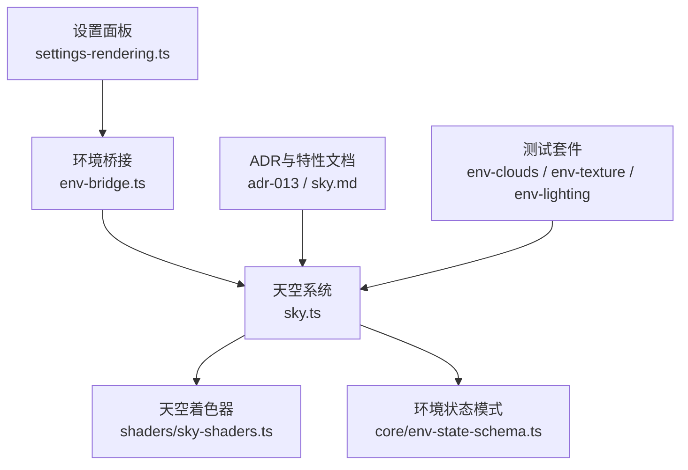
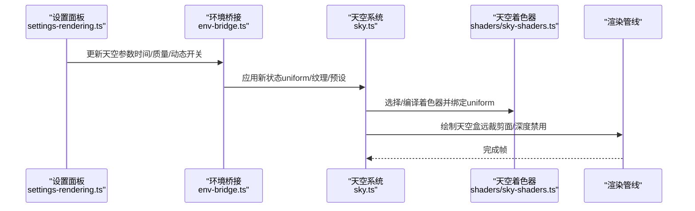
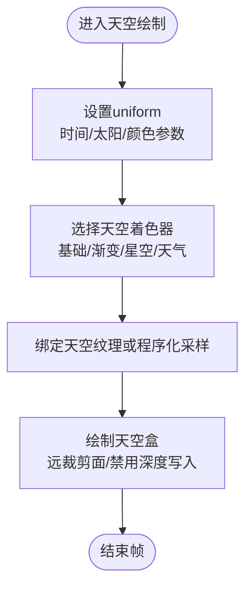
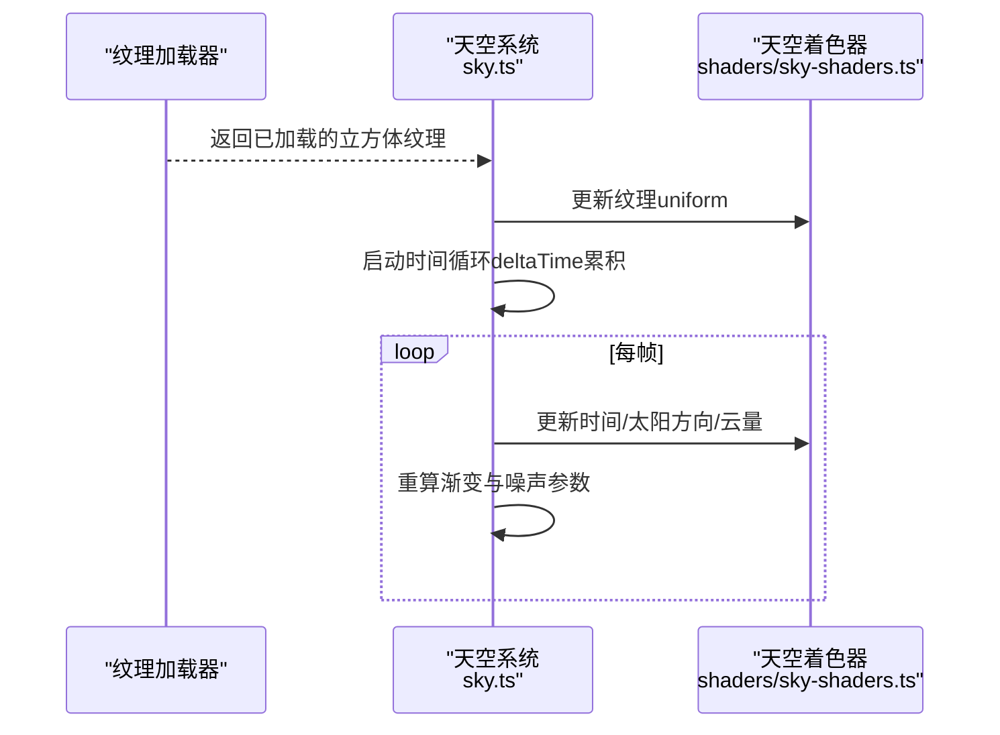
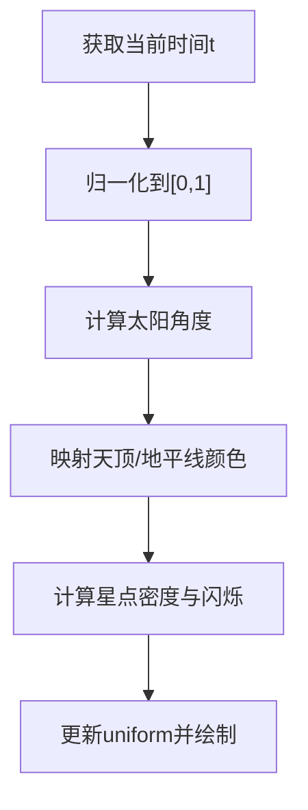
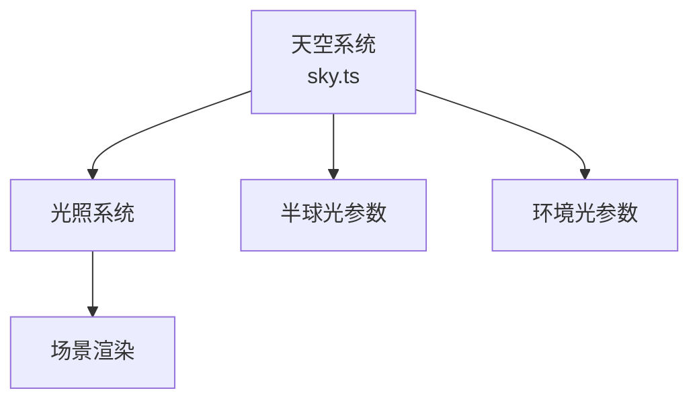
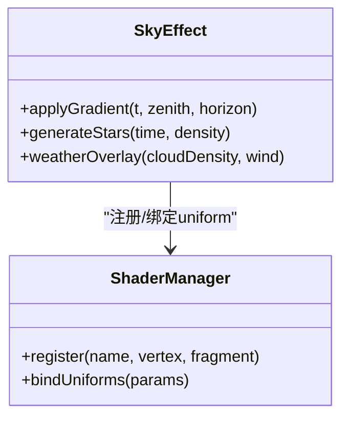
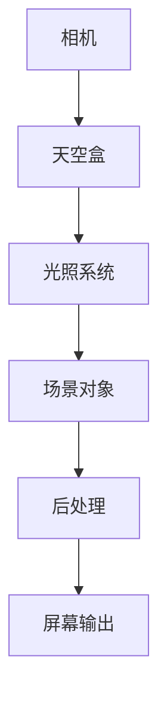
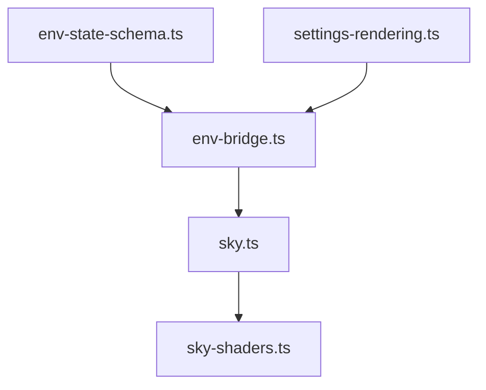

# 天空盒系统

<cite>
**本文引用的文件**   
- [sky.ts](file://frontend/src/scene/env/sky.ts)
- [sky-shaders.ts](file://frontend/src/scene/env/shaders/sky-shaders.ts)
- [env-bridge.ts](file://frontend/src/scene/env/env-bridge.ts)
- [env-state-schema.ts](file://frontend/src/core/env-state-schema.ts)
- [adr-013-skybox-improvement.md](file://docs/adr/adr-013-skybox-improvement.md)
- [sky.md](file://docs/research/dancexr-zh/features/sky.md)
- [env-clouds.test.ts](file://frontend/src/__tests__/scene/env-clouds.test.ts)
- [env-texture.test.ts](file://frontend/src/__tests__/scene/env-texture.test.ts)
- [env-lighting.test.ts](file://frontend/src/__tests__/env-lighting.test.ts)
- [settings-rendering.ts](file://frontend/src/menus/settings-rendering.ts)
</cite>

## 目录
1. [简介](#简介)
2. [项目结构](#项目结构)
3. [核心组件](#核心组件)
4. [架构总览](#架构总览)
5. [详细组件分析](#详细组件分析)
6. [依赖关系分析](#依赖关系分析)
7. [性能考虑](#性能考虑)
8. [故障排查指南](#故障排查指南)
9. [结论](#结论)
10. [附录](#附录)

## 简介
本文件面向MikuMikuAR中的“天空盒系统”，系统性阐述其渲染管线、着色器实现、纹理加载与动态效果、时间变化系统，以及与光照系统的集成方式（半球光与环境光）。同时提供自定义天空盒效果的着色器开发指南（渐变天空、星空、天气相关变化），并给出性能优化与调试方法。文档以代码级事实为依据，辅以可视化图示，帮助读者快速理解与扩展天空盒能力。

## 项目结构
天空盒系统主要位于前端场景环境模块中，围绕“天空”功能组织：
- 运行时逻辑与API封装：sky.ts
- 着色器资源管理：shaders/sky-shaders.ts
- 环境桥接与状态同步：env-bridge.ts
- 环境状态模式定义：core/env-state-schema.ts
- ADR与特性说明：docs/adr/adr-013-skybox-improvement.md、docs/research/dancexr-zh/features/sky.md
- 测试用例：__tests__/scene/env-clouds.test.ts、__tests__/scene/env-texture.test.ts、__tests__/env-lighting.test.ts
- 设置入口：menus/settings-rendering.ts

图表来源
- [sky.ts](file://frontend/src/scene/env/sky.ts)
- [sky-shaders.ts](file://frontend/src/scene/env/shaders/sky-shaders.ts)
- [env-bridge.ts](file://frontend/src/scene/env/env-bridge.ts)
- [env-state-schema.ts](file://frontend/src/core/env-state-schema.ts)
- [adr-013-skybox-improvement.md](file://docs/adr/adr-013-skybox-improvement.md)
- [sky.md](file://docs/research/dancexr-zh/features/sky.md)
- [env-clouds.test.ts](file://frontend/src/__tests__/scene/env-clouds.test.ts)
- [env-texture.test.ts](file://frontend/src/__tests__/scene/env-texture.test.ts)
- [env-lighting.test.ts](file://frontend/src/__tests__/env-lighting.test.ts)
- [settings-rendering.ts](file://frontend/src/menus/settings-rendering.ts)

章节来源
- [sky.ts](file://frontend/src/scene/env/sky.ts)
- [sky-shaders.ts](file://frontend/src/scene/env/shaders/sky-shaders.ts)
- [env-bridge.ts](file://frontend/src/scene/env/env-bridge.ts)
- [env-state-schema.ts](file://frontend/src/core/env-state-schema.ts)
- [adr-013-skybox-improvement.md](file://docs/adr/adr-013-skybox-improvement.md)
- [sky.md](file://docs/research/dancexr-zh/features/sky.md)
- [env-clouds.test.ts](file://frontend/src/__tests__/scene/env-clouds.test.ts)
- [env-texture.test.ts](file://frontend/src/__tests__/scene/env-texture.test.ts)
- [env-lighting.test.ts](file://frontend/src/__tests__/env-lighting.test.ts)
- [settings-rendering.ts](file://frontend/src/menus/settings-rendering.ts)

## 核心组件
- 天空系统（sky.ts）
  - 负责创建与管理天空盒网格、材质与纹理，驱动动态参数更新（如太阳方向、时间、云量等），并与渲染循环交互。
  - 暴露统一接口供上层环境与菜单调用，支持切换预设、应用渐变或程序化效果。
- 天空着色器（shaders/sky-shaders.ts）
  - 集中注册天空相关的顶点与片段着色器，提供基础天空、渐变天空、星空、天气变体等Shader模板。
  - 维护uniform变量映射（如时间、太阳位置、天顶颜色、地平线颜色、云层强度等）。
- 环境桥接（env-bridge.ts）
  - 将高层环境配置转换为天空系统可理解的参数，处理状态变更事件，协调天空与其他环境子系统（云、雾、光照）的联动。
- 环境状态模式（env-state-schema.ts）
  - 定义天空相关字段的数据结构与默认值，确保UI与后端一致的状态契约。
- 设置入口（settings-rendering.ts）
  - 提供天空质量、是否启用动态天空、时间速度等开关与滑块，触发状态更新并回写到环境系统。

章节来源
- [sky.ts](file://frontend/src/scene/env/sky.ts)
- [sky-shaders.ts](file://frontend/src/scene/env/shaders/sky-shaders.ts)
- [env-bridge.ts](file://frontend/src/scene/env/env-bridge.ts)
- [env-state-schema.ts](file://frontend/src/core/env-state-schema.ts)
- [settings-rendering.ts](file://frontend/src/menus/settings-rendering.ts)

## 架构总览
天空盒渲染管线从UI设置到GPU绘制的整体流程如下：

图表来源
- [settings-rendering.ts](file://frontend/src/menus/settings-rendering.ts)
- [env-bridge.ts](file://frontend/src/scene/env/env-bridge.ts)
- [sky.ts](file://frontend/src/scene/env/sky.ts)
- [sky-shaders.ts](file://frontend/src/scene/env/shaders/sky-shaders.ts)

## 详细组件分析

### 天空渲染管线与着色器原理
- 顶点阶段
  - 使用球体或立方体贴图坐标作为输入，输出屏幕空间位置与UV。
  - 关键uniform包括视图矩阵、投影矩阵、时间、太阳方向等。
- 片段阶段
  - 根据UV或法线计算天穹颜色，支持渐变、程序化噪声、星空采样。
  - 结合时间参数实现昼夜过渡、颜色漂移、星点闪烁。
- 深度与剔除
  - 天空盒通常置于最远深度，关闭深度写入以避免遮挡问题；剔除策略为背面剔除或无剔除。

图表来源
- [sky.ts](file://frontend/src/scene/env/sky.ts)
- [sky-shaders.ts](file://frontend/src/scene/env/shaders/sky-shaders.ts)

章节来源
- [sky.ts](file://frontend/src/scene/env/sky.ts)
- [sky-shaders.ts](file://frontend/src/scene/env/shaders/sky-shaders.ts)

### 天空盒纹理加载与动态天空
- 纹理加载
  - 支持立方体贴图与六面贴图格式，提供缓存与异步加载机制。
  - 当切换预设或用户选择新纹理时，进行增量替换与mipmap生成。
- 动态天空
  - 通过时间uniform驱动颜色插值与噪声偏移，实现日出日落、黄昏、夜间等过渡。
  - 可选的云层叠加与风场扰动，提升真实感。

图表来源
- [sky.ts](file://frontend/src/scene/env/sky.ts)
- [sky-shaders.ts](file://frontend/src/scene/env/shaders/sky-shaders.ts)

章节来源
- [sky.ts](file://frontend/src/scene/env/sky.ts)
- [sky-shaders.ts](file://frontend/src/scene/env/shaders/sky-shaders.ts)

### 时间变化系统与昼夜过渡
- 时间模型
  - 采用归一化时间（0~1）表示一天周期，支持加速/减速与暂停。
  - 基于时间计算太阳高度角与方位角，驱动天空颜色与阴影方向。
- 昼夜过渡
  - 使用分段函数或平滑插值表，将时间映射到天顶色、地平线色、散射强度。
  - 夜间增加星点密度与亮度，白天降低星点可见性。

图表来源
- [sky.ts](file://frontend/src/scene/env/sky.ts)
- [sky-shaders.ts](file://frontend/src/scene/env/shaders/sky-shaders.ts)

章节来源
- [sky.ts](file://frontend/src/scene/env/sky.ts)
- [sky-shaders.ts](file://frontend/src/scene/env/shaders/sky-shaders.ts)

### 与光照系统集成（半球光与环境光）
- 半球光
  - 天空盒颜色用于近似环境漫反射，影响全局间接照明。
  - 根据昼夜过渡调整半球光强度与色温，保持场景一致性。
- 环境光
  - 使用天空盒的平均颜色或预积分结果作为环境光贡献，减少过曝或过暗。
- 集成点
  - 环境桥接在状态更新时同步天空参数至光照系统，确保两者同步变化。

图表来源
- [sky.ts](file://frontend/src/scene/env/sky.ts)
- [env-bridge.ts](file://frontend/src/scene/env/env-bridge.ts)

章节来源
- [sky.ts](file://frontend/src/scene/env/sky.ts)
- [env-bridge.ts](file://frontend/src/scene/env/env-bridge.ts)
- [env-lighting.test.ts](file://frontend/src/__tests__/env-lighting.test.ts)

### 自定义天空盒效果开发指南
- 渐变天空
  - 在片段着色器中按高度混合天顶与地平线颜色，加入大气散射项。
  - 通过uniform控制梯度强度与过渡范围。
- 星空效果
  - 使用噪声函数生成随机星点分布，结合时间实现闪烁。
  - 夜间提高星点阈值与亮度，白天降低可见性。
- 天气相关变化
  - 引入云层噪声与厚度uniform，模拟阴天、薄雾、风暴前兆。
  - 结合风场参数使云层缓慢移动，增强动态感。

图表来源
- [sky-shaders.ts](file://frontend/src/scene/env/shaders/sky-shaders.ts)
- [sky.ts](file://frontend/src/scene/env/sky.ts)

章节来源
- [sky-shaders.ts](file://frontend/src/scene/env/shaders/sky-shaders.ts)
- [sky.ts](file://frontend/src/scene/env/sky.ts)

### 概念总览
以下概念图展示天空盒在整体渲染中的作用与交互，不直接对应具体源码文件：

## 依赖关系分析
- 内部依赖
  - sky.ts依赖sky-shaders.ts进行着色器管理与uniform绑定。
  - env-bridge.ts协调sky.ts与光照、云、雾等子系统。
  - env-state-schema.ts为所有模块提供一致的状态契约。
- 外部依赖
  - 纹理加载与GPU资源管理由底层引擎提供。
  - 渲染循环与绘制命令由引擎抽象。

图表来源
- [env-state-schema.ts](file://frontend/src/core/env-state-schema.ts)
- [env-bridge.ts](file://frontend/src/scene/env/env-bridge.ts)
- [sky.ts](file://frontend/src/scene/env/sky.ts)
- [sky-shaders.ts](file://frontend/src/scene/env/shaders/sky-shaders.ts)
- [settings-rendering.ts](file://frontend/src/menus/settings-rendering.ts)

章节来源
- [env-state-schema.ts](file://frontend/src/core/env-state-schema.ts)
- [env-bridge.ts](file://frontend/src/scene/env/env-bridge.ts)
- [sky.ts](file://frontend/src/scene/env/sky.ts)
- [sky-shaders.ts](file://frontend/src/scene/env/shaders/sky-shaders.ts)
- [settings-rendering.ts](file://frontend/src/menus/settings-rendering.ts)

## 性能考虑
- 纹理与资源
  - 复用已加载的天空纹理，避免重复分配；按需生成mipmap。
  - 对高分辨率立方体贴图进行压缩与分级加载。
- 着色器与uniform
  - 合并uniform更新批次，减少状态切换。
  - 使用条件分支简化夜间/白天路径，避免不必要的计算。
- 绘制与裁剪
  - 天空盒置于远裁剪面，禁用深度写入，减少overdraw。
  - 在低质量模式下降低噪声复杂度与星点数量。
- 时间循环
  - 使用固定步长或自适应步长，避免大帧抖动导致的不稳定。

## 故障排查指南
- 常见问题
  - 天空盒未显示：检查深度写入与裁剪面设置。
  - 颜色异常：确认uniform绑定顺序与数据类型。
  - 纹理缺失：验证纹理路径与加载状态。
- 调试技巧
  - 在片段着色器中输出中间变量（如UV、噪声值）辅助定位。
  - 使用日志记录时间步进与太阳角度变化。
- 测试覆盖
  - 参考env-clouds.test.ts、env-texture.test.ts、env-lighting.test.ts中的断言与用例，复现与回归问题。

章节来源
- [env-clouds.test.ts](file://frontend/src/__tests__/scene/env-clouds.test.ts)
- [env-texture.test.ts](file://frontend/src/__tests__/scene/env-texture.test.ts)
- [env-lighting.test.ts](file://frontend/src/__tests__/env-lighting.test.ts)

## 结论
天空盒系统在MikuMikuAR中提供了可扩展、高性能且与光照紧密集成的背景渲染方案。通过清晰的组件划分与统一的着色器管理，开发者可以便捷地实现渐变天空、星空与天气变化等效果。遵循本文的性能建议与调试方法，可在保证视觉质量的同时维持稳定的帧率表现。

## 附录
- 设计决策与演进
  - 参见adr-013-skybox-improvement.md了解天空盒改进的历史与权衡。
- 特性说明
  - 参见sky.md了解天空特性的使用指南与示例。

章节来源
- [adr-013-skybox-improvement.md](file://docs/adr/adr-013-skybox-improvement.md)
- [sky.md](file://docs/research/dancexr-zh/features/sky.md)