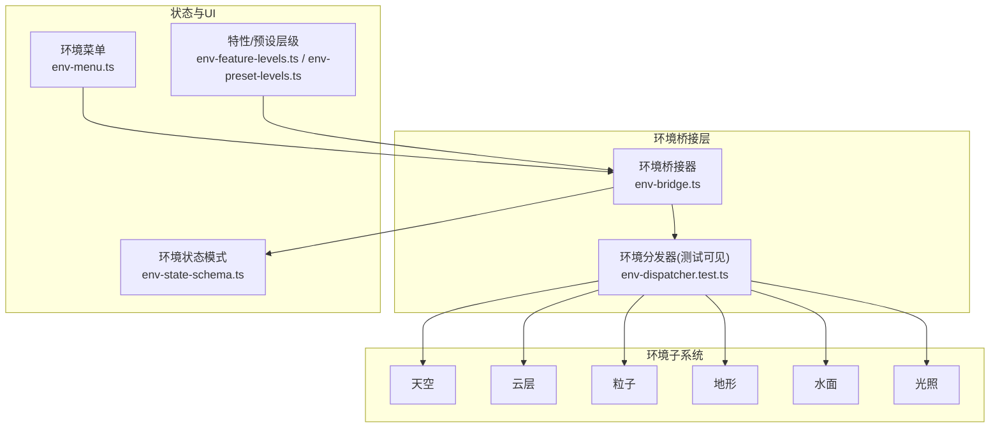
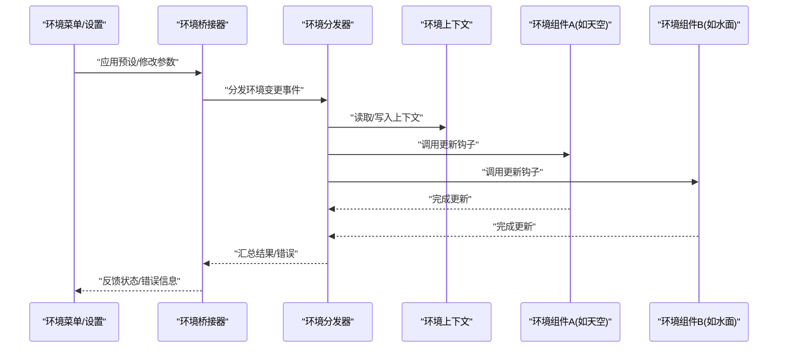
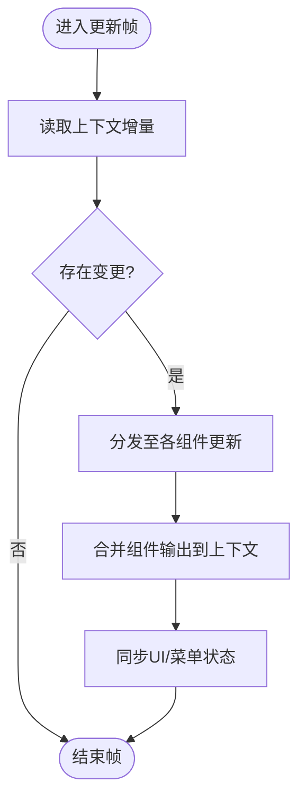
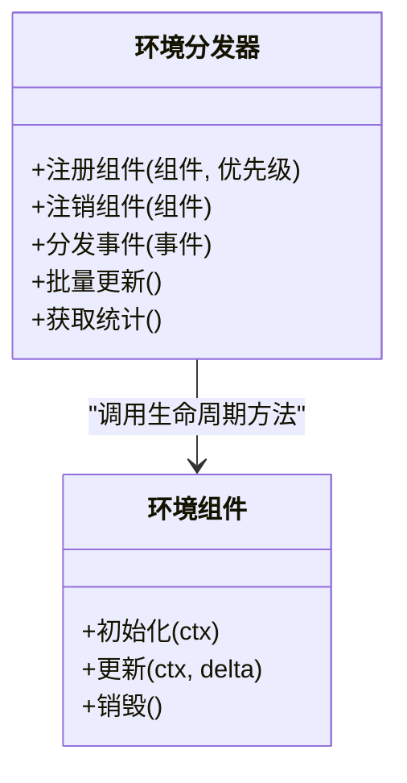
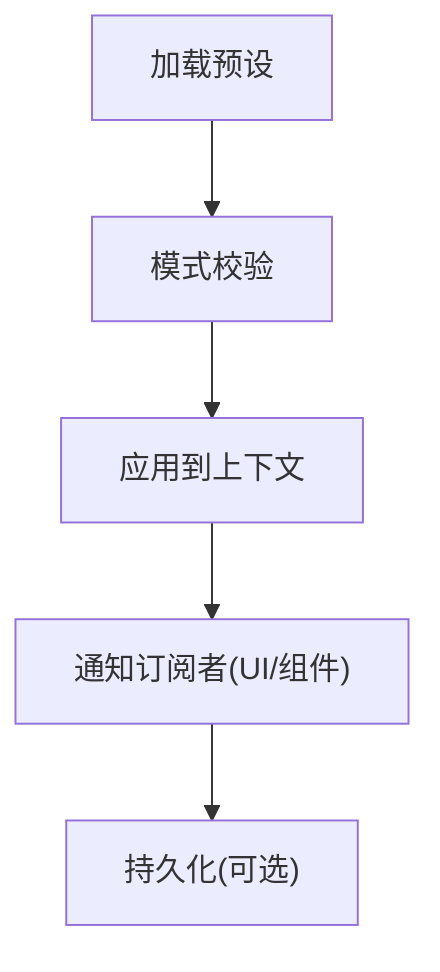
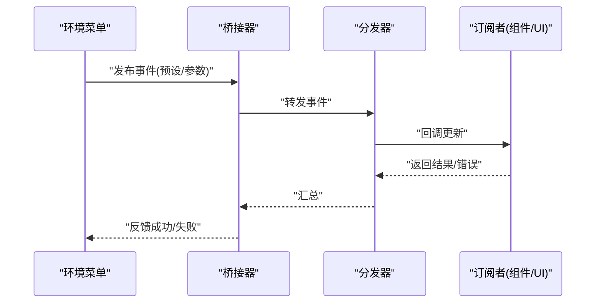
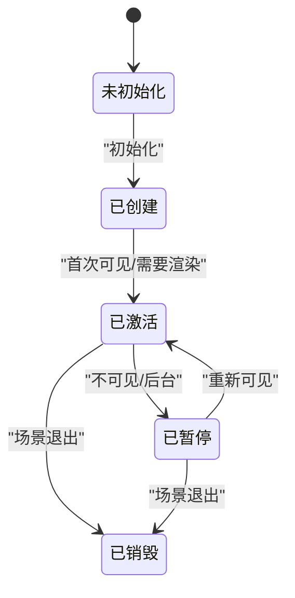
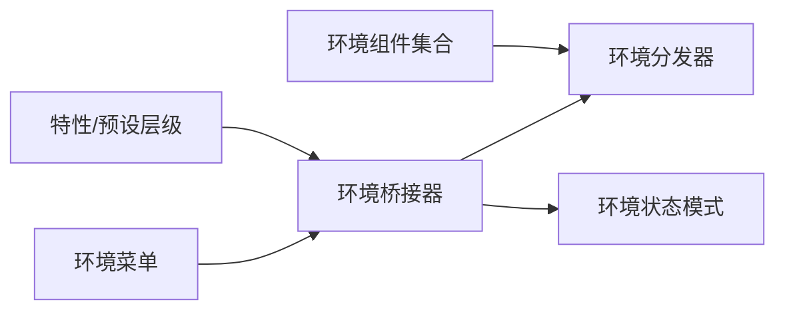

# 环境桥接器

<cite>
**本文引用的文件**   
- [env-bridge.ts](file://frontend/src/scene/env/env-bridge.ts)
- [env-dispatcher.test.ts](file://frontend/src/core/__tests__/core/env-dispatcher.test.ts)
- [env-state-schema.ts](file://frontend/src/core/env-state-schema.ts)
- [env-lighting.test.ts](file://frontend/src/__tests__/env-lighting.test.ts)
- [env-clouds.test.ts](file://frontend/src/__tests__/scene/env-clouds.test.ts)
- [env-particles.test.ts](file://frontend/src/__tests__/scene/env-particles.test.ts)
- [env-terrain.test.ts](file://frontend/src/__tests__/scene/env-terrain.test.ts)
- [env-texture.test.ts](file://frontend/src/__tests__/scene/env-texture.test.ts)
- [env-water.test.ts](file://frontend/src/__tests__/scene/env-water.test.ts)
- [env-impl.test.ts](file://frontend/src/__tests__/scene/env-impl.test.ts)
- [env-menu.ts](file://frontend/src/menus/env-menu.ts)
- [env-feature-levels.ts](file://frontend/src/menus/env-feature-levels.ts)
- [env-preset-levels.ts](file://frontend/src/menus/env-preset-levels.ts)
- [adr-026-environment-system-enhancement.md](file://docs/adr/adr-026-environment-system-enhancement.md)
- [adr-132-env-brightness-unification.md](file://docs/adr/adr-132-env-brightness-unification.md)
- [2026-07-16-env-state-not-restored.md](file://docs/buglog/2026-07-16-env-state-not-restored.md)
</cite>

## 目录
1. [简介](#简介)
2. [项目结构](#项目结构)
3. [核心组件](#核心组件)
4. [架构总览](#架构总览)
5. [详细组件分析](#详细组件分析)
6. [依赖分析](#依赖分析)
7. [性能考虑](#性能考虑)
8. [故障排查指南](#故障排查指南)
9. [结论](#结论)
10. [附录](#附录)

## 简介
本文件聚焦“环境桥接器”的设计与实现，系统性阐述其如何协调环境子系统（天空、云、粒子、地形、水体、光照等）的加载、更新与销毁；解释环境分发器的调度机制、环境上下文管理与状态同步策略；说明事件系统、生命周期管理以及错误处理方案。同时提供环境组件注册与卸载的接口说明、使用模式与示例路径，并给出性能监控与资源管理的最佳实践，帮助开发者快速理解并扩展环境系统。

## 项目结构
围绕环境系统的代码主要分布在以下位置：
- 桥接与调度层：前端场景环境模块中的桥接器与环境分发器
- 状态与配置：环境状态模式定义、菜单与预设层级
- 测试用例：覆盖各环境子系统的行为验证
- ADR 与问题日志：记录架构决策与已知问题的修复线索

图表来源
- [env-bridge.ts:1-200](file://frontend/src/scene/env/env-bridge.ts#L1-L200)
- [env-dispatcher.test.ts:1-200](file://frontend/src/core/__tests__/core/env-dispatcher.test.ts#L1-L200)
- [env-state-schema.ts:1-200](file://frontend/src/core/env-state-schema.ts#L1-L200)
- [env-menu.ts:1-200](file://frontend/src/menus/env-menu.ts#L1-L200)
- [env-feature-levels.ts:1-200](file://frontend/src/menus/env-feature-levels.ts#L1-L200)
- [env-preset-levels.ts:1-200](file://frontend/src/menus/env-preset-levels.ts#L1-L200)

章节来源
- [env-bridge.ts:1-200](file://frontend/src/scene/env/env-bridge.ts#L1-L200)
- [env-dispatcher.test.ts:1-200](file://frontend/src/core/__tests__/core/env-dispatcher.test.ts#L1-L200)
- [env-state-schema.ts:1-200](file://frontend/src/core/env-state-schema.ts#L1-L200)
- [env-menu.ts:1-200](file://frontend/src/menus/env-menu.ts#L1-L200)
- [env-feature-levels.ts:1-200](file://frontend/src/menus/env-feature-levels.ts#L1-L200)
- [env-preset-levels.ts:1-200](file://frontend/src/menus/env-preset-levels.ts#L1-L200)

## 核心组件
- 环境桥接器：作为环境子系统与上层应用（菜单、渲染循环、场景管理器）之间的统一入口，负责初始化、分发更新、状态同步与清理。
- 环境分发器：按帧或事件驱动将全局环境变更广播到已注册的各个环境组件，确保一致性与可观测性。
- 环境上下文：封装当前环境运行期所需的全局数据（如相机、时间、分辨率、平台能力），供各组件读取而不直接耦合。
- 状态模式与校验：通过环境状态模式定义与校验，保证配置与运行时状态的一致性。
- 事件系统：基于统一事件总线，发布订阅环境相关事件（如切换预设、调整亮度、天气变化）。
- 生命周期管理：为每个环境组件提供创建、激活、更新、暂停、销毁的生命周期钩子，由桥接器编排。
- 错误处理：在关键路径进行异常捕获、降级与上报，避免单点失败影响整体体验。

章节来源
- [env-bridge.ts:1-200](file://frontend/src/scene/env/env-bridge.ts#L1-L200)
- [env-dispatcher.test.ts:1-200](file://frontend/src/core/__tests__/core/env-dispatcher.test.ts#L1-L200)
- [env-state-schema.ts:1-200](file://frontend/src/core/env-state-schema.ts#L1-L200)

## 架构总览
下图展示环境桥接器与分发器、环境组件、状态与事件的关系。

图表来源
- [env-bridge.ts:1-200](file://frontend/src/scene/env/env-bridge.ts#L1-L200)
- [env-dispatcher.test.ts:1-200](file://frontend/src/core/__tests__/core/env-dispatcher.test.ts#L1-L200)
- [env-menu.ts:1-200](file://frontend/src/menus/env-menu.ts#L1-L200)

## 详细组件分析

### 环境桥接器
职责
- 统一暴露环境API：注册/卸载组件、应用预设、查询状态、触发更新。
- 编排生命周期：在场景启动时创建组件，在每帧调用更新，在退出时释放资源。
- 维护上下文：聚合相机、时间、分辨率、平台能力等共享数据。
- 错误隔离：对组件异常进行捕获与降级，保障主流程稳定。

关键流程
- 初始化：加载默认预设，构建上下文，注册内置组件。
- 更新循环：从上下文读取增量变化，分发给所有活跃组件。
- 状态同步：将组件输出合并回上下文，供渲染与UI消费。
- 清理：按注册顺序反向销毁，释放纹理、几何体、监听器等。

图表来源
- [env-bridge.ts:1-200](file://frontend/src/scene/env/env-bridge.ts#L1-L200)

章节来源
- [env-bridge.ts:1-200](file://frontend/src/scene/env/env-bridge.ts#L1-L200)

### 环境分发器
职责
- 事件路由：根据事件类型与优先级，将变更定向到对应组件。
- 批处理：合并同帧多次变更，减少重复计算。
- 容错：单个组件失败不影响其他组件更新。

典型行为
- 订阅环境事件源（菜单、预设、外部输入）。
- 维护组件注册表与优先级队列。
- 提供调试钩子（如统计更新耗时、失败次数）。

图表来源
- [env-dispatcher.test.ts:1-200](file://frontend/src/core/__tests__/core/env-dispatcher.test.ts#L1-L200)

章节来源
- [env-dispatcher.test.ts:1-200](file://frontend/src/core/__tests__/core/env-dispatcher.test.ts#L1-L200)

### 环境上下文与状态模式
- 上下文对象：集中保存相机、时间、分辨率、平台能力、渲染目标等，避免组件间隐式耦合。
- 状态模式：以结构化模式描述环境配置与运行时状态，支持校验、序列化与恢复。
- 同步机制：桥接器将组件输出写回上下文，UI与菜单订阅上下文变化以刷新显示。

图表来源
- [env-state-schema.ts:1-200](file://frontend/src/core/env-state-schema.ts#L1-L200)

章节来源
- [env-state-schema.ts:1-200](file://frontend/src/core/env-state-schema.ts#L1-L200)

### 环境事件系统
- 事件类型：预设切换、参数微调、天气突变、设备能力变化等。
- 发布/订阅：桥接器作为发布者，组件与UI作为订阅者。
- 幂等与去抖：对高频事件进行节流与合并，避免抖动与重复计算。

图表来源
- [env-menu.ts:1-200](file://frontend/src/menus/env-menu.ts#L1-L200)
- [env-dispatcher.test.ts:1-200](file://frontend/src/core/__tests__/core/env-dispatcher.test.ts#L1-L200)

章节来源
- [env-menu.ts:1-200](file://frontend/src/menus/env-menu.ts#L1-L200)
- [env-dispatcher.test.ts:1-200](file://frontend/src/core/__tests__/core/env-dispatcher.test.ts#L1-L200)

### 生命周期管理
- 创建：按需实例化组件，注入上下文与依赖。
- 激活：在首帧或首次可见时启用渲染管线。
- 更新：每帧接收增量变化，执行局部计算。
- 暂停：在不可见或后台时降低频率或停止计算。
- 销毁：释放GPU资源、移除监听、断开引用。

图表来源
- [env-bridge.ts:1-200](file://frontend/src/scene/env/env-bridge.ts#L1-L200)

章节来源
- [env-bridge.ts:1-200](file://frontend/src/scene/env/env-bridge.ts#L1-L200)

### 错误处理策略
- 异常捕获：在组件更新前后包裹try/catch，记录堆栈与上下文快照。
- 降级策略：当某组件失败时，跳过该组件并继续其他组件更新。
- 上报与可视化：将错误推送到日志与UI提示，便于定位。
- 恢复机制：对可恢复错误（如资源缺失）尝试重试或回退到默认值。

章节来源
- [env-bridge.ts:1-200](file://frontend/src/scene/env/env-bridge.ts#L1-L200)

### 环境组件注册与卸载API
- 注册组件
  - 作用：向分发器登记一个环境组件及其优先级。
  - 参数：组件实例、优先级、可选初始化选项。
  - 返回值：注册句柄，用于后续注销。
  - 示例路径：[env-dispatcher.test.ts:1-200](file://frontend/src/core/__tests__/core/env-dispatcher.test.ts#L1-L200)
- 注销组件
  - 作用：从分发器移除组件并调用其销毁钩子。
  - 参数：注册句柄或组件标识。
  - 示例路径：[env-dispatcher.test.ts:1-200](file://frontend/src/core/__tests__/core/env-dispatcher.test.ts#L1-L200)
- 应用预设
  - 作用：将预设映射到上下文，触发分发器更新。
  - 参数：预设键或完整配置对象。
  - 示例路径：[env-menu.ts:1-200](file://frontend/src/menus/env-menu.ts#L1-L200)
- 查询状态
  - 作用：读取当前环境上下文快照。
  - 参数：无或字段白名单。
  - 示例路径：[env-state-schema.ts:1-200](file://frontend/src/core/env-state-schema.ts#L1-L200)

使用模式
- 菜单驱动：通过环境菜单选择预设，桥接器应用并分发。
- 动态扩展：第三方组件通过注册API接入，无需修改核心逻辑。
- 条件启用：依据平台能力或用户偏好选择性启用组件。

章节来源
- [env-dispatcher.test.ts:1-200](file://frontend/src/core/__tests__/core/env-dispatcher.test.ts#L1-L200)
- [env-menu.ts:1-200](file://frontend/src/menus/env-menu.ts#L1-L200)
- [env-state-schema.ts:1-200](file://frontend/src/core/env-state-schema.ts#L1-L200)

### 子系统集成与验证
- 天空与光照：受亮度统一策略影响，需遵循新的亮度语义。
  - 参考：[adr-132-env-brightness-unification.md](file://docs/adr/adr-132-env-brightness-unification.md)
- 云层与粒子：关注DOM与渲染一致性，避免重绘风暴。
  - 参考：[env-clouds.test.ts:1-200](file://frontend/src/__tests__/scene/env-clouds.test.ts#L1-L200)、[env-particles.test.ts:1-200](file://frontend/src/__tests__/scene/env-particles.test.ts#L1-L200)
- 地形与水面：注意矩阵与投影一致性，避免错位。
  - 参考：[env-terrain.test.ts:1-200](file://frontend/src/__tests__/scene/env-terrain.test.ts#L1-L200)、[env-water.test.ts:1-200](file://frontend/src/__tests__/scene/env-water.test.ts#L1-L200)
- 纹理与材质：确保资源加载与释放正确，避免泄漏。
  - 参考：[env-texture.test.ts:1-200](file://frontend/src/__tests__/scene/env-texture.test.ts#L1-L200)
- 综合集成：端到端验证环境系统增强后的稳定性。
  - 参考：[adr-026-environment-system-enhancement.md](file://docs/adr/adr-026-environment-system-enhancement.md)、[env-impl.test.ts:1-200](file://frontend/src/__tests__/scene/env-impl.test.ts#L1-L200)

章节来源
- [adr-132-env-brightness-unification.md:1-200](file://docs/adr/adr-132-env-brightness-unification.md#L1-L200)
- [env-clouds.test.ts:1-200](file://frontend/src/__tests__/scene/env-clouds.test.ts#L1-L200)
- [env-particles.test.ts:1-200](file://frontend/src/__tests__/scene/env-particles.test.ts#L1-L200)
- [env-terrain.test.ts:1-200](file://frontend/src/__tests__/scene/env-terrain.test.ts#L1-L200)
- [env-water.test.ts:1-200](file://frontend/src/__tests__/scene/env-water.test.ts#L1-L200)
- [env-texture.test.ts:1-200](file://frontend/src/__tests__/scene/env-texture.test.ts#L1-L200)
- [adr-026-environment-system-enhancement.md:1-200](file://docs/adr/adr-026-environment-system-enhancement.md#L1-L200)
- [env-impl.test.ts:1-200](file://frontend/src/__tests__/scene/env-impl.test.ts#L1-L200)

## 依赖分析
- 内部依赖
  - 环境桥接器依赖环境分发器与状态模式，向上暴露统一API。
  - 菜单与预设层级通过桥接器间接影响环境组件。
- 外部依赖
  - 渲染引擎与平台能力检测，决定组件可用性与质量档位。
- 潜在风险
  - 循环依赖：应避免组件直接依赖桥接器以外的上层模块。
  - 事件风暴：高频事件需做节流与合并。

图表来源
- [env-bridge.ts:1-200](file://frontend/src/scene/env/env-bridge.ts#L1-L200)
- [env-dispatcher.test.ts:1-200](file://frontend/src/core/__tests__/core/env-dispatcher.test.ts#L1-L200)
- [env-state-schema.ts:1-200](file://frontend/src/core/env-state-schema.ts#L1-L200)
- [env-menu.ts:1-200](file://frontend/src/menus/env-menu.ts#L1-L200)
- [env-feature-levels.ts:1-200](file://frontend/src/menus/env-feature-levels.ts#L1-L200)
- [env-preset-levels.ts:1-200](file://frontend/src/menus/env-preset-levels.ts#L1-L200)

章节来源
- [env-bridge.ts:1-200](file://frontend/src/scene/env/env-bridge.ts#L1-L200)
- [env-dispatcher.test.ts:1-200](file://frontend/src/core/__tests__/core/env-dispatcher.test.ts#L1-L200)
- [env-state-schema.ts:1-200](file://frontend/src/core/env-state-schema.ts#L1-L200)
- [env-menu.ts:1-200](file://frontend/src/menus/env-menu.ts#L1-L200)
- [env-feature-levels.ts:1-200](file://frontend/src/menus/env-feature-levels.ts#L1-L200)
- [env-preset-levels.ts:1-200](file://frontend/src/menus/env-preset-levels.ts#L1-L200)

## 性能考虑
- 批处理与合并：同帧内合并多次环境变更，减少分发次数。
- 惰性加载：仅在需要时创建与激活组件，降低冷启动开销。
- 节流与去抖：对高频事件（如鼠标拖拽、滑块）进行节流。
- 资源复用：纹理、几何体、着色器缓存复用，避免频繁分配。
- 质量档位：根据平台能力与电池状态动态调整效果等级。
- 监控指标：统计每帧更新时间、失败率、内存占用峰值，辅助优化。

## 故障排查指南
- 常见问题
  - 环境状态未恢复：检查状态模式校验与持久化逻辑，确认恢复流程是否被中断。
    - 参考：[2026-07-16-env-state-not-restored.md](file://docs/buglog/2026-07-16-env-state-not-restored.md)
  - 亮度不一致：遵循亮度统一策略，确保天空、光照、后处理采用同一基准。
    - 参考：[adr-132-env-brightness-unification.md](file://docs/adr/adr-132-env-brightness-unification.md)
  - 组件泄漏：确认销毁流程是否释放了纹理、监听器与定时器。
- 诊断步骤
  - 打开调试面板，查看分发器统计与错误日志。
  - 逐步禁用组件，定位具体失败点。
  - 对比不同预设下的上下文快照，确认差异来源。

章节来源
- [2026-07-16-env-state-not-restored.md:1-200](file://docs/buglog/2026-07-16-env-state-not-restored.md#L1-L200)
- [adr-132-env-brightness-unification.md:1-200](file://docs/adr/adr-132-env-brightness-unification.md#L1-L200)

## 结论
环境桥接器通过统一的API、清晰的生命周期与健壮的错误处理，将复杂的环境子系统解耦为可插拔组件。配合环境分发器与状态模式，实现了高内聚、低耦合的可扩展架构。建议在新功能开发中优先遵循现有注册/卸载与事件规范，利用预设与层级机制控制特性开关，并通过监控指标持续优化性能与稳定性。

## 附录
- 术语
  - 环境组件：实现特定环境效果的模块（如天空、云、粒子、地形、水面、光照）。
  - 环境上下文：运行时共享数据的集中载体。
  - 环境预设：一组可复用的环境配置。
- 参考文档
  - 环境系统增强决策：[adr-026-environment-system-enhancement.md](file://docs/adr/adr-026-environment-system-enhancement.md)
  - 亮度统一策略：[adr-132-env-brightness-unification.md](file://docs/adr/adr-132-env-brightness-unification.md)