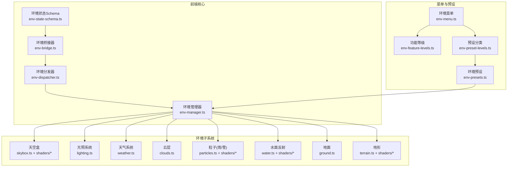
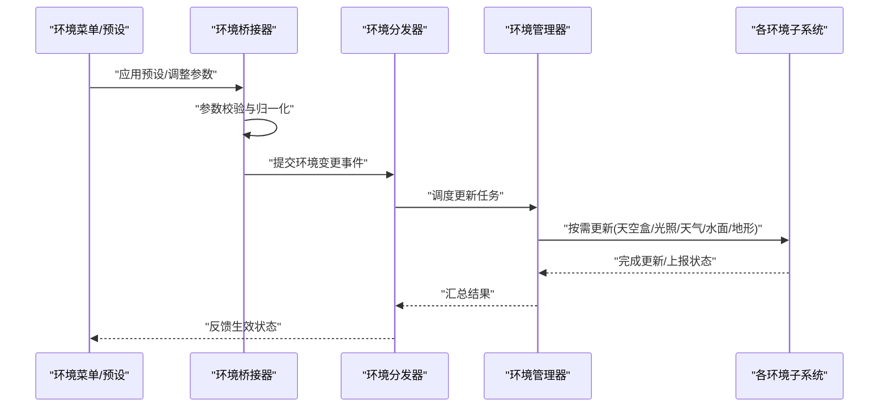
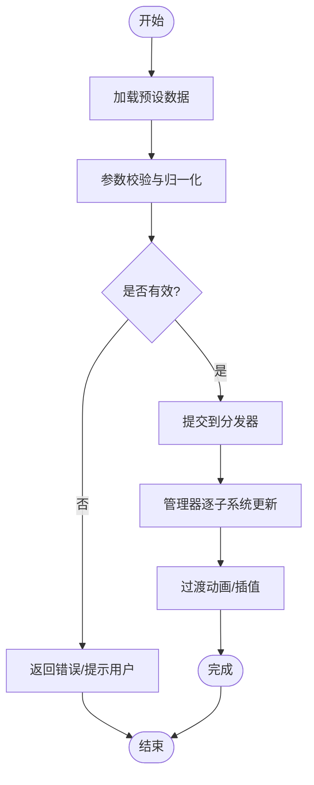
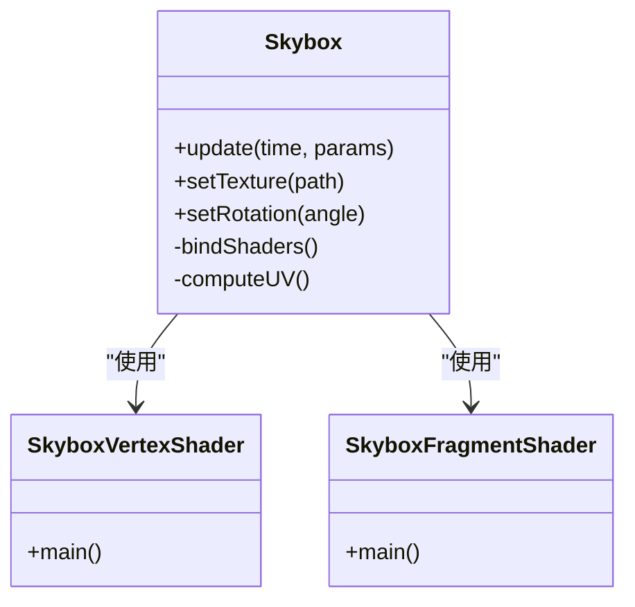
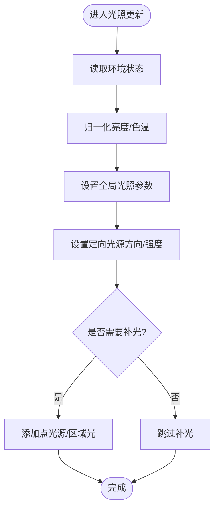
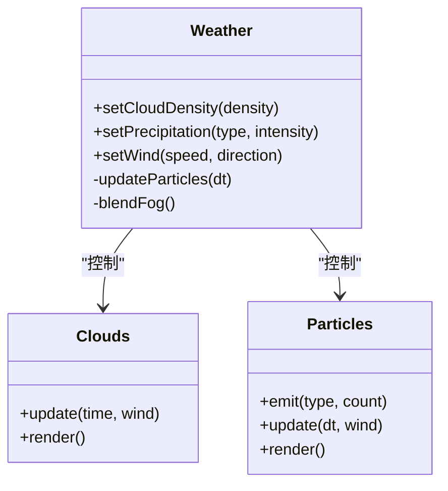
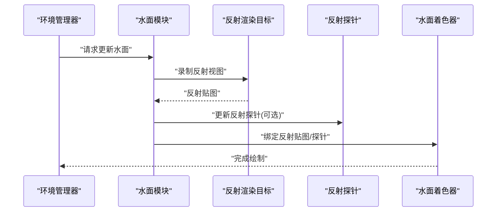
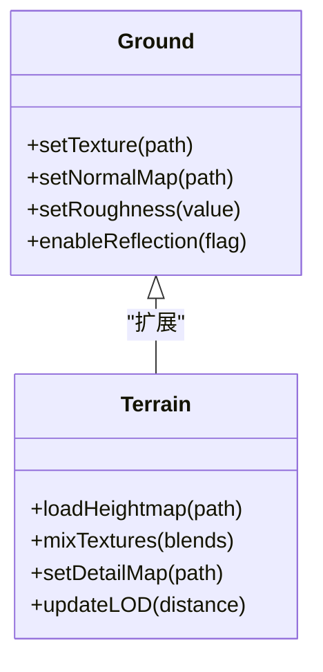
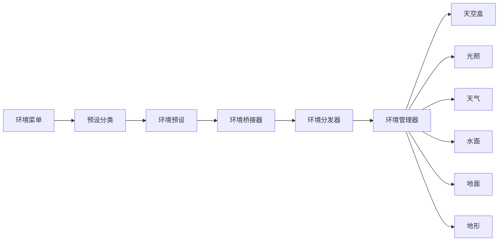

# 环境系统

<cite>
**本文引用的文件**   
- [frontend/src/scene/env/env-bridge.ts](file://frontend/src/scene/env/env-bridge.ts)
- [frontend/src/core/env-state-schema.ts](file://frontend/src/core/env-state-schema.ts)
- [frontend/src/menus/env-menu.ts](file://frontend/src/menus/env-menu.ts)
- [frontend/src/menus/env-feature-levels.ts](file://frontend/src/menus/env-feature-levels.ts)
- [frontend/src/menus/env-preset-levels.ts](file://frontend/src/menus/env-preset-levels.ts)
- [frontend/src/scene/env/shaders/skybox.vertex.fx](file://frontend/src/scene/env/shaders/skybox.vertex.fx)
- [frontend/src/scene/env/shaders/skybox.fragment.fx](file://frontend/src/scene/env/shaders/skybox.fragment.fx)
- [frontend/src/scene/env/shaders/water.vertex.fx](file://frontend/src/scene/env/shaders/water.vertex.fx)
- [frontend/src/scene/env/shaders/water.fragment.fx](file://frontend/src/scene/env/shaders/water.fragment.fx)
- [frontend/src/scene/env/shaders/terrain.vertex.fx](file://frontend/src/scene/env/shaders/terrain.vertex.fx)
- [frontend/src/scene/env/shaders/terrain.fragment.fx](file://frontend/src/scene/env/shaders/terrain.fragment.fx)
- [frontend/src/scene/env/shaders/particles.vertex.fx](file://frontend/src/scene/env/shaders/particles.vertex.fx)
- [frontend/src/scene/env/shaders/particles.fragment.fx](file://frontend/src/scene/env/shaders/particles.fragment.fx)
- [frontend/src/scene/env/lighting.ts](file://frontend/src/scene/env/lighting.ts)
- [frontend/src/scene/env/clouds.ts](file://frontend/src/scene/env/clouds.ts)
- [frontend/src/scene/env/weather.ts](file://frontend/src/scene/env/weather.ts)
- [frontend/src/scene/env/water.ts](file://frontend/src/scene/env/water.ts)
- [frontend/src/scene/env/ground.ts](file://frontend/src/scene/env/ground.ts)
- [frontend/src/scene/env/terrain.ts](file://frontend/src/scene/env/terrain.ts)
- [frontend/src/scene/env/skybox.ts](file://frontend/src/scene/env/skybox.ts)
- [frontend/src/scene/env/particles.ts](file://frontend/src/scene/env/particles.ts)
- [frontend/src/scene/env/env-dispatcher.ts](file://frontend/src/scene/env/env-dispatcher.ts)
- [frontend/src/scene/env/env-manager.ts](file://frontend/src/scene/env/env-manager.ts)
- [frontend/src/scene/env/env-presets.ts](file://frontend/src/scene/env/env-presets.ts)
- [frontend/src/scene/env/performance-monitor.ts](file://frontend/src/scene/env/performance-monitor.ts)
- [frontend/src/scene/env/debug-tools.ts](file://frontend/src/scene/env/debug-tools.ts)
- [docs/adr/adr-026-environment-system-enhancement.md](file://docs/adr/adr-026-environment-system-enhancement.md)
- [docs/adr/adr-120-env-preset-categorized.md](file://docs/adr/adr-120-env-preset-categorized.md)
- [docs/adr/adr-132-env-brightness-unification.md](file://docs/adr/adr-132-env-brightness-unification.md)
- [docs/adr/adr-062-water-reflection-render-target.md](file://docs/adr/adr-062-water-reflection-render-target.md)
- [docs/adr/adr-074-cubemap-rt-spherical-reflection.md](file://docs/adr/adr-074-cubemap-rt-spherical-reflection.md)
- [docs/adr/adr-083-ground-enhancement-expansion.md](file://docs/adr/adr-083-ground-enhancement-expansion.md)
- [docs/adr/adr-092-unified-texture-reflection.md](file://docs/adr/adr-092-unified-texture-reflection.md)
- [docs/adr/adr-038-scene-motion-audit-and-env-fog.md](file://docs/adr/adr-038-scene-motion-audit-and-env-fog.md)
- [docs/adr/adr-013-skybox-improvement.md](file://docs/adr/adr-013-skybox-improvement.md)
- [docs/adr/adr-024-rendering-enhancement-phase2-ssr-reflectionprobe.md](file://docs/adr/adr-024-rendering-enhancement-phase2-ssr-reflectionprobe.md)
- [docs/adr/adr-115-stylized-water-glint-research.md](file://docs/adr/adr-115-stylized-water-glint-research.md)
- [docs/adr/adr-028-wind-system-unification.md](file://docs/adr/adr-028-wind-system-unification.md)
- [docs/audit/2026-07-11-env-impl-terrain-audit.md](file://docs/audit/2026-07-11-env-impl-terrain-audit.md)
- [docs/audit/2026-07-11-env-particles-clouds-audit.md](file://docs/audit/2026-07-11-env-particles-clouds-audit.md)
- [docs/audit/round-4-lighting-props.md](file://docs/audit/round-4-lighting-props.md)
- [docs/audit/round-3-facade-terrain.md](file://docs/audit/round-3-facade-terrain.md)
- [docs/audit/round-2-clouds-particles.md](file://docs/audit/round-2-clouds-particles.md)
- [docs/audit/round-1-water.md](file://docs/audit/round-1-water.md)
- [docs/buglog/2026-07-16-env-state-not-restored.md](file://docs/buglog/2026-07-16-env-state-not-restored.md)
- [docs/buglog/2026-07-17-water-preset-nan-uniform.md](file://docs/buglog/2026-07-17-water-preset-nan-uniform.md)
- [docs/buglog/2026-07-11-env-water-setWorldMatrix.md](file://docs/buglog/2026-07-11-env-water-setWorldMatrix.md)
</cite>

## 目录
1. [简介](#简介)
2. [项目结构](#项目结构)
3. [核心组件](#核心组件)
4. [架构总览](#架构总览)
5. [详细组件分析](#详细组件分析)
6. [依赖分析](#依赖分析)
7. [性能考虑](#性能考虑)
8. [故障排查指南](#故障排查指南)
9. [结论](#结论)
10. [附录](#附录)

## 简介
本文件系统化梳理环境渲染子系统，覆盖环境桥接器、环境分发器与环境状态管理；深入解析天空盒、光照、天气（云、雨、雪）、水面反射、地面与地形等关键组件的实现原理；说明环境预设体系、动态切换流程与性能优化策略；提供着色器代码示例路径与自定义扩展方法；并给出调试工具与性能监控指南，帮助开发者构建高质量3D环境效果。

## 项目结构
环境相关的前端实现主要位于 frontend/src/scene/env 目录，配合 core 层的状态模式与 schema、菜单层的配置与预设入口，以及 ADR/审计文档对设计决策与历史演进进行记录。

图表来源
- [frontend/src/core/env-state-schema.ts](file://frontend/src/core/env-state-schema.ts)
- [frontend/src/scene/env/env-bridge.ts](file://frontend/src/scene/env/env-bridge.ts)
- [frontend/src/scene/env/env-dispatcher.ts](file://frontend/src/scene/env/env-dispatcher.ts)
- [frontend/src/scene/env/env-manager.ts](file://frontend/src/scene/env/env-manager.ts)
- [frontend/src/menus/env-menu.ts](file://frontend/src/menus/env-menu.ts)
- [frontend/src/menus/env-feature-levels.ts](file://frontend/src/menus/env-feature-levels.ts)
- [frontend/src/menus/env-preset-levels.ts](file://frontend/src/menus/env-preset-levels.ts)
- [frontend/src/scene/env/env-presets.ts](file://frontend/src/scene/env/env-presets.ts)
- [frontend/src/scene/env/skybox.ts](file://frontend/src/scene/env/skybox.ts)
- [frontend/src/scene/env/lighting.ts](file://frontend/src/scene/env/lighting.ts)
- [frontend/src/scene/env/weather.ts](file://frontend/src/scene/env/weather.ts)
- [frontend/src/scene/env/clouds.ts](file://frontend/src/scene/env/clouds.ts)
- [frontend/src/scene/env/particles.ts](file://frontend/src/scene/env/particles.ts)
- [frontend/src/scene/env/water.ts](file://frontend/src/scene/env/water.ts)
- [frontend/src/scene/env/ground.ts](file://frontend/src/scene/env/ground.ts)
- [frontend/src/scene/env/terrain.ts](file://frontend/src/scene/env/terrain.ts)

章节来源
- [frontend/src/core/env-state-schema.ts](file://frontend/src/core/env-state-schema.ts)
- [frontend/src/scene/env/env-bridge.ts](file://frontend/src/scene/env/env-bridge.ts)
- [frontend/src/scene/env/env-dispatcher.ts](file://frontend/src/scene/env/env-dispatcher.ts)
- [frontend/src/scene/env/env-manager.ts](file://frontend/src/scene/env/env-manager.ts)
- [frontend/src/menus/env-menu.ts](file://frontend/src/menus/env-menu.ts)
- [frontend/src/menus/env-feature-levels.ts](file://frontend/src/menus/env-feature-levels.ts)
- [frontend/src/menus/env-preset-levels.ts](file://frontend/src/menus/env-preset-levels.ts)
- [frontend/src/scene/env/env-presets.ts](file://frontend/src/scene/env/env-presets.ts)

## 核心组件
- 环境状态 Schema：定义环境参数类型、默认值与校验规则，为 UI 与渲染管线提供统一的数据契约。
- 环境桥接器：将高层 UI/菜单操作转换为环境系统的可执行指令，负责参数归一化与兼容性处理。
- 环境分发器：接收桥接器指令，按优先级与依赖关系调度各子系统的更新。
- 环境管理器：维护各子系统实例生命周期、资源加载与释放、帧循环中的增量更新。

章节来源
- [frontend/src/core/env-state-schema.ts](file://frontend/src/core/env-state-schema.ts)
- [frontend/src/scene/env/env-bridge.ts](file://frontend/src/scene/env/env-bridge.ts)
- [frontend/src/scene/env/env-dispatcher.ts](file://frontend/src/scene/env/env-dispatcher.ts)
- [frontend/src/scene/env/env-manager.ts](file://frontend/src/scene/env/env-manager.ts)

## 架构总览
环境系统采用“状态驱动 + 分层调度”的架构：UI 通过菜单与预设触发变更，桥接器将变更规范化后交由分发器，分发器协调管理器与各子系统完成渲染更新。

图表来源
- [frontend/src/scene/env/env-bridge.ts](file://frontend/src/scene/env/env-bridge.ts)
- [frontend/src/scene/env/env-dispatcher.ts](file://frontend/src/scene/env/env-dispatcher.ts)
- [frontend/src/scene/env/env-manager.ts](file://frontend/src/scene/env/env-manager.ts)
- [frontend/src/menus/env-menu.ts](file://frontend/src/menus/env-menu.ts)
- [frontend/src/scene/env/env-presets.ts](file://frontend/src/scene/env/env-presets.ts)

## 详细组件分析

### 环境状态管理与预设系统
- 状态模型：以 Schema 为中心，集中描述天空盒、光照强度、雾效、天气、水面、地面与地形等参数域。
- 预设分类：通过预设等级与分类组织多套环境方案，支持一键切换与组合叠加。
- 动态切换：在切换过程中进行增量更新与过渡动画，避免跳变与闪烁。

图表来源
- [frontend/src/core/env-state-schema.ts](file://frontend/src/core/env-state-schema.ts)
- [frontend/src/menus/env-preset-levels.ts](file://frontend/src/menus/env-preset-levels.ts)
- [frontend/src/scene/env/env-presets.ts](file://frontend/src/scene/env/env-presets.ts)
- [frontend/src/scene/env/env-dispatcher.ts](file://frontend/src/scene/env/env-dispatcher.ts)
- [frontend/src/scene/env/env-manager.ts](file://frontend/src/scene/env/env-manager.ts)

章节来源
- [frontend/src/core/env-state-schema.ts](file://frontend/src/core/env-state-schema.ts)
- [frontend/src/menus/env-preset-levels.ts](file://frontend/src/menus/env-preset-levels.ts)
- [frontend/src/scene/env/env-presets.ts](file://frontend/src/scene/env/env-presets.ts)
- [docs/adr/adr-120-env-preset-categorized.md](file://docs/adr/adr-120-env-preset-categorized.md)

### 天空盒渲染
- 顶点着色器：计算球面坐标与视口映射，支持旋转与时间驱动的天穹运动。
- 片段着色器：基于法线或高度采样天空纹理，混合昼夜渐变与太阳位置。
- 集成要点：与光照方向一致，避免阴影不一致；支持低质量模式下的简化采样。

图表来源
- [frontend/src/scene/env/skybox.ts](file://frontend/src/scene/env/skybox.ts)
- [frontend/src/scene/env/shaders/skybox.vertex.fx](file://frontend/src/scene/env/shaders/skybox.vertex.fx)
- [frontend/src/scene/env/shaders/skybox.fragment.fx](file://frontend/src/scene/env/shaders/skybox.fragment.fx)
- [docs/adr/adr-013-skybox-improvement.md](file://docs/adr/adr-013-skybox-improvement.md)

章节来源
- [frontend/src/scene/env/skybox.ts](file://frontend/src/scene/env/skybox.ts)
- [frontend/src/scene/env/shaders/skybox.vertex.fx](file://frontend/src/scene/env/shaders/skybox.vertex.fx)
- [frontend/src/scene/env/shaders/skybox.fragment.fx](file://frontend/src/scene/env/shaders/skybox.fragment.fx)
- [docs/adr/adr-013-skybox-improvement.md](file://docs/adr/adr-013-skybox-improvement.md)

### 光照系统
- 全局光照：控制环境光强度、色温与亮度统一策略，确保不同预设下视觉一致性。
- 定向光源：模拟太阳光方向与强度，影响阴影与反射探针。
- 点光源/区域光：用于舞台或室内场景补充照明。

图表来源
- [frontend/src/scene/env/lighting.ts](file://frontend/src/scene/env/lighting.ts)
- [docs/adr/adr-132-env-brightness-unification.md](file://docs/adr/adr-132-env-brightness-unification.md)
- [docs/audit/round-4-lighting-props.md](file://docs/audit/round-4-lighting-props.md)

章节来源
- [frontend/src/scene/env/lighting.ts](file://frontend/src/scene/env/lighting.ts)
- [docs/adr/adr-132-env-brightness-unification.md](file://docs/adr/adr-132-env-brightness-unification.md)
- [docs/audit/round-4-lighting-props.md](file://docs/audit/round-4-lighting-props.md)

### 天气效果（云、雨、雪）
- 云层：体积云或屏幕空间近似，支持密度、厚度与移动速度调节。
- 降水粒子：雨滴与雪花使用 GPU 粒子系统，结合风场与重力模拟。
- 天气联动：根据预设自动调整光照、雾效与能见度。

图表来源
- [frontend/src/scene/env/weather.ts](file://frontend/src/scene/env/weather.ts)
- [frontend/src/scene/env/clouds.ts](file://frontend/src/scene/env/clouds.ts)
- [frontend/src/scene/env/particles.ts](file://frontend/src/scene/env/particles.ts)
- [frontend/src/scene/env/shaders/particles.vertex.fx](file://frontend/src/scene/env/shaders/particles.vertex.fx)
- [frontend/src/scene/env/shaders/particles.fragment.fx](file://frontend/src/scene/env/shaders/particles.fragment.fx)
- [docs/adr/adr-028-wind-system-unification.md](file://docs/adr/adr-028-wind-system-unification.md)
- [docs/audit/2026-07-11-env-particles-clouds-audit.md](file://docs/audit/2026-07-11-env-particles-clouds-audit.md)
- [docs/audit/round-2-clouds-particles.md](file://docs/audit/round-2-clouds-particles.md)

章节来源
- [frontend/src/scene/env/weather.ts](file://frontend/src/scene/env/weather.ts)
- [frontend/src/scene/env/clouds.ts](file://frontend/src/scene/env/clouds.ts)
- [frontend/src/scene/env/particles.ts](file://frontend/src/scene/env/particles.ts)
- [frontend/src/scene/env/shaders/particles.vertex.fx](file://frontend/src/scene/env/shaders/particles.vertex.fx)
- [frontend/src/scene/env/shaders/particles.fragment.fx](file://frontend/src/scene/env/shaders/particles.fragment.fx)
- [docs/adr/adr-028-wind-system-unification.md](file://docs/adr/adr-028-wind-system-unification.md)
- [docs/audit/2026-07-11-env-particles-clouds-audit.md](file://docs/audit/2026-07-11-env-particles-clouds-audit.md)
- [docs/audit/round-2-clouds-particles.md](file://docs/audit/round-2-clouds-particles.md)

### 水面反射
- 反射目标：使用独立渲染目标生成水面反射图像，支持分辨率自适应。
- 反射探针：立方体贴图或球形反射探针，提升非平面反射质量。
- 材质与着色：水波扰动、菲涅尔效应与高光闪烁，支持风格化波光。

图表来源
- [frontend/src/scene/env/water.ts](file://frontend/src/scene/env/water.ts)
- [frontend/src/scene/env/shaders/water.vertex.fx](file://frontend/src/scene/env/shaders/water.vertex.fx)
- [frontend/src/scene/env/shaders/water.fragment.fx](file://frontend/src/scene/env/shaders/water.fragment.fx)
- [docs/adr/adr-062-water-reflection-render-target.md](file://docs/adr/adr-062-water-reflection-render-target.md)
- [docs/adr/adr-074-cubemap-rt-spherical-reflection.md](file://docs/adr/adr-074-cubemap-rt-spherical-reflection.md)
- [docs/adr/adr-092-unified-texture-reflection.md](file://docs/adr/adr-092-unified-texture-reflection.md)
- [docs/adr/adr-024-rendering-enhancement-phase2-ssr-reflectionprobe.md](file://docs/adr/adr-024-rendering-enhancement-phase2-ssr-reflectionprobe.md)
- [docs/adr/adr-115-stylized-water-glint-research.md](file://docs/adr/adr-115-stylized-water-glint-research.md)
- [docs/audit/round-1-water.md](file://docs/audit/round-1-water.md)

章节来源
- [frontend/src/scene/env/water.ts](file://frontend/src/scene/env/water.ts)
- [frontend/src/scene/env/shaders/water.vertex.fx](file://frontend/src/scene/env/shaders/water.vertex.fx)
- [frontend/src/scene/env/shaders/water.fragment.fx](file://frontend/src/scene/env/shaders/water.fragment.fx)
- [docs/adr/adr-062-water-reflection-render-target.md](file://docs/adr/adr-062-water-reflection-render-target.md)
- [docs/adr/adr-074-cubemap-rt-spherical-reflection.md](file://docs/adr/adr-074-cubemap-rt-spherical-reflection.md)
- [docs/adr/adr-092-unified-texture-reflection.md](file://docs/adr/adr-092-unified-texture-reflection.md)
- [docs/adr/adr-024-rendering-enhancement-phase2-ssr-reflectionprobe.md](file://docs/adr/adr-024-rendering-enhancement-phase2-ssr-reflectionprobe.md)
- [docs/adr/adr-115-stylized-water-glint-research.md](file://docs/adr/adr-115-stylized-water-glint-research.md)
- [docs/audit/round-1-water.md](file://docs/audit/round-1-water.md)

### 地面与地形
- 地面：基础平面或网格，支持纹理平铺、法线与粗糙度贴图。
- 地形：基于高度图的三维地形，支持多纹理混合与细节贴图。
- 反射与阴影：地面参与反射与阴影投射，提升整体真实感。

图表来源
- [frontend/src/scene/env/ground.ts](file://frontend/src/scene/env/ground.ts)
- [frontend/src/scene/env/terrain.ts](file://frontend/src/scene/env/terrain.ts)
- [frontend/src/scene/env/shaders/terrain.vertex.fx](file://frontend/src/scene/env/shaders/terrain.vertex.fx)
- [frontend/src/scene/env/shaders/terrain.fragment.fx](file://frontend/src/scene/env/shaders/terrain.fragment.fx)
- [docs/adr/adr-083-ground-enhancement-expansion.md](file://docs/adr/adr-083-ground-enhancement-expansion.md)
- [docs/audit/2026-07-11-env-impl-terrain-audit.md](file://docs/audit/2026-07-11-env-impl-terrain-audit.md)
- [docs/audit/round-3-facade-terrain.md](file://docs/audit/round-3-facade-terrain.md)

章节来源
- [frontend/src/scene/env/ground.ts](file://frontend/src/scene/env/ground.ts)
- [frontend/src/scene/env/terrain.ts](file://frontend/src/scene/env/terrain.ts)
- [frontend/src/scene/env/shaders/terrain.vertex.fx](file://frontend/src/scene/env/shaders/terrain.vertex.fx)
- [frontend/src/scene/env/shaders/terrain.fragment.fx](file://frontend/src/scene/env/shaders/terrain.fragment.fx)
- [docs/adr/adr-083-ground-enhancement-expansion.md](file://docs/adr/adr-083-ground-enhancement-expansion.md)
- [docs/audit/2026-07-11-env-impl-terrain-audit.md](file://docs/audit/2026-07-11-env-impl-terrain-audit.md)
- [docs/audit/round-3-facade-terrain.md](file://docs/audit/round-3-facade-terrain.md)

### 着色器代码示例与自定义扩展
- 天空盒着色器：参考 skybox.vertex.fx 与 skybox.fragment.fx，学习 UV 计算与天空采样。
- 水面着色器：参考 water.vertex.fx 与 water.fragment.fx，了解波纹扰动与菲涅尔反射。
- 地形着色器：参考 terrain.vertex.fx 与 terrain.fragment.fx，掌握高度图与多纹理混合。
- 粒子着色器：参考 particles.vertex.fx 与 particles.fragment.fx，实现雨/雪的 GPU 粒子渲染。
- 自定义扩展：在 env-presets.ts 中新增预设项，并在对应子系统模块中读取新参数进行渲染。

章节来源
- [frontend/src/scene/env/shaders/skybox.vertex.fx](file://frontend/src/scene/env/shaders/skybox.vertex.fx)
- [frontend/src/scene/env/shaders/skybox.fragment.fx](file://frontend/src/scene/env/shaders/skybox.fragment.fx)
- [frontend/src/scene/env/shaders/water.vertex.fx](file://frontend/src/scene/env/shaders/water.vertex.fx)
- [frontend/src/scene/env/shaders/water.fragment.fx](file://frontend/src/scene/env/shaders/water.fragment.fx)
- [frontend/src/scene/env/shaders/terrain.vertex.fx](file://frontend/src/scene/env/shaders/terrain.vertex.fx)
- [frontend/src/scene/env/shaders/terrain.fragment.fx](file://frontend/src/scene/env/shaders/terrain.fragment.fx)
- [frontend/src/scene/env/shaders/particles.vertex.fx](file://frontend/src/scene/env/shaders/particles.vertex.fx)
- [frontend/src/scene/env/shaders/particles.fragment.fx](file://frontend/src/scene/env/shaders/particles.fragment.fx)
- [frontend/src/scene/env/env-presets.ts](file://frontend/src/scene/env/env-presets.ts)

## 依赖分析
环境子系统之间的耦合通过管理器与分发器解耦，菜单与预设作为上层输入，不直接依赖具体渲染实现。

图表来源
- [frontend/src/menus/env-menu.ts](file://frontend/src/menus/env-menu.ts)
- [frontend/src/menus/env-preset-levels.ts](file://frontend/src/menus/env-preset-levels.ts)
- [frontend/src/scene/env/env-presets.ts](file://frontend/src/scene/env/env-presets.ts)
- [frontend/src/scene/env/env-bridge.ts](file://frontend/src/scene/env/env-bridge.ts)
- [frontend/src/scene/env/env-dispatcher.ts](file://frontend/src/scene/env/env-dispatcher.ts)
- [frontend/src/scene/env/env-manager.ts](file://frontend/src/scene/env/env-manager.ts)

章节来源
- [frontend/src/menus/env-menu.ts](file://frontend/src/menus/env-menu.ts)
- [frontend/src/menus/env-preset-levels.ts](file://frontend/src/menus/env-preset-levels.ts)
- [frontend/src/scene/env/env-presets.ts](file://frontend/src/scene/env/env-presets.ts)
- [frontend/src/scene/env/env-bridge.ts](file://frontend/src/scene/env/env-bridge.ts)
- [frontend/src/scene/env/env-dispatcher.ts](file://frontend/src/scene/env/env-dispatcher.ts)
- [frontend/src/scene/env/env-manager.ts](file://frontend/src/scene/env/env-manager.ts)

## 性能考虑
- 反射与探针：合理选择反射目标分辨率与更新频率，必要时降级为静态探针或关闭反射。
- 粒子系统：限制并发粒子数量与发射速率，使用 GPU 加速与批处理减少 CPU 开销。
- 地形与纹理：使用 LOD 与纹理压缩，降低高分辨率纹理带宽压力。
- 雾效与体积云：根据设备能力动态调整采样步数与精度。
- 亮度统一：遵循亮度统一策略，避免在不同预设间出现过曝或欠曝导致的额外后期校正成本。

章节来源
- [docs/adr/adr-062-water-reflection-render-target.md](file://docs/adr/adr-062-water-reflection-render-target.md)
- [docs/adr/adr-074-cubemap-rt-spherical-reflection.md](file://docs/adr/adr-074-cubemap-rt-spherical-reflection.md)
- [docs/adr/adr-083-ground-enhancement-expansion.md](file://docs/adr/adr-083-ground-enhancement-expansion.md)
- [docs/adr/adr-132-env-brightness-unification.md](file://docs/adr/adr-132-env-brightness-unification.md)
- [docs/adr/adr-028-wind-system-unification.md](file://docs/adr/adr-028-wind-system-unification.md)

## 故障排查指南
- 环境状态未恢复：检查状态 Schema 与预设映射是否正确，确认桥接器与分发器的回滚逻辑。
- 水面预设 NaN uniform：验证预设数值边界与着色器输入范围，避免非法浮点数传入。
- 水面矩阵设置异常：检查世界矩阵更新顺序与坐标系一致性。
- 地形与粒子问题：参考审计文档定位渲染管线瓶颈与资源泄漏。

章节来源
- [docs/buglog/2026-07-16-env-state-not-restored.md](file://docs/buglog/2026-07-16-env-state-not-restored.md)
- [docs/buglog/2026-07-17-water-preset-nan-uniform.md](file://docs/buglog/2026-07-17-water-preset-nan-uniform.md)
- [docs/buglog/2026-07-11-env-water-setWorldMatrix.md](file://docs/buglog/2026-07-11-env-water-setWorldMatrix.md)
- [docs/audit/2026-07-11-env-impl-terrain-audit.md](file://docs/audit/2026-07-11-env-impl-terrain-audit.md)
- [docs/audit/2026-07-11-env-particles-clouds-audit.md](file://docs/audit/2026-07-11-env-particles-clouds-audit.md)

## 结论
环境系统通过清晰的状态模型、桥接与分发机制，将复杂的环境渲染需求模块化与可配置化。天空盒、光照、天气、水面、地面与地形各司其职，配合预设系统与性能优化策略，能够在多平台设备上稳定输出高质量的视觉效果。借助调试工具与性能监控，开发者可以快速定位问题并进行精细化调优。

## 附录
- 环境功能等级：通过 env-feature-levels.ts 控制高级特性开关，便于低端设备降级。
- 环境菜单：env-menu.ts 提供可视化操作入口，支持预设快速切换与参数微调。
- 调试工具与性能监控：debug-tools.ts 与 performance-monitor.ts 提供运行时诊断与指标采集。

章节来源
- [frontend/src/menus/env-feature-levels.ts](file://frontend/src/menus/env-feature-levels.ts)
- [frontend/src/menus/env-menu.ts](file://frontend/src/menus/env-menu.ts)
- [frontend/src/scene/env/debug-tools.ts](file://frontend/src/scene/env/debug-tools.ts)
- [frontend/src/scene/env/performance-monitor.ts](file://frontend/src/scene/env/performance-monitor.ts)