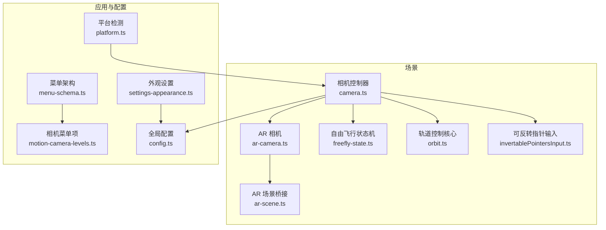
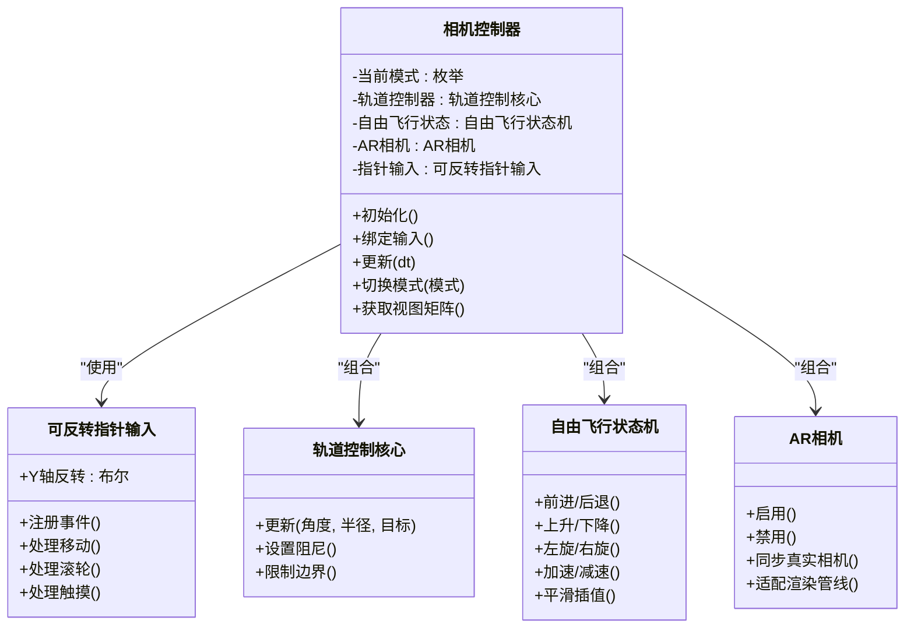
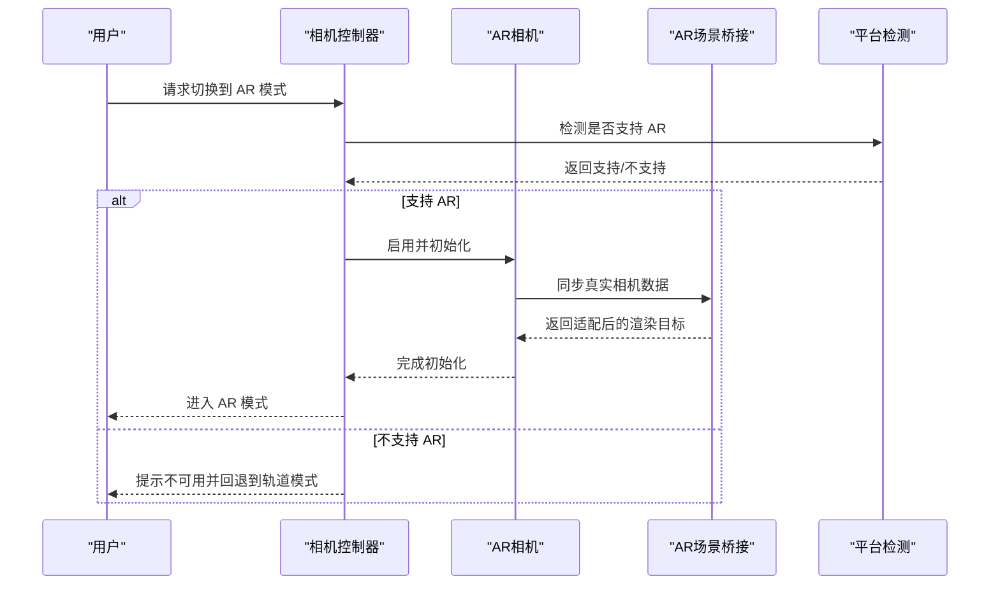
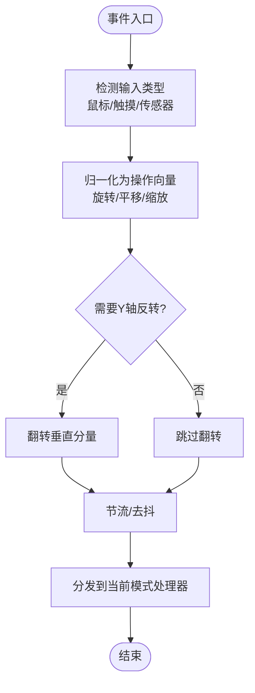
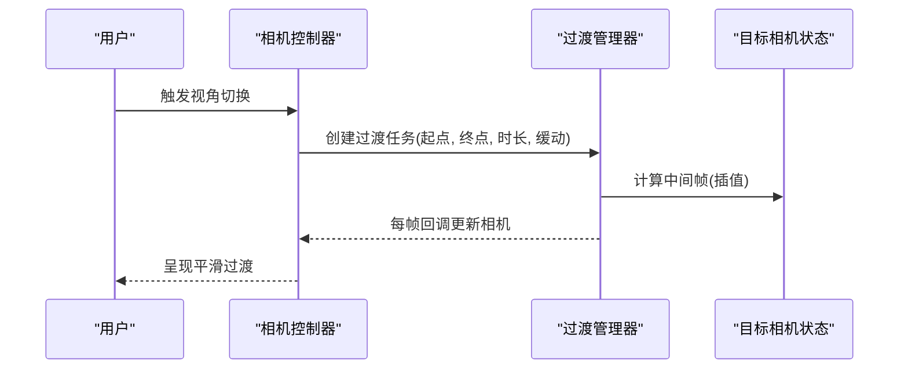
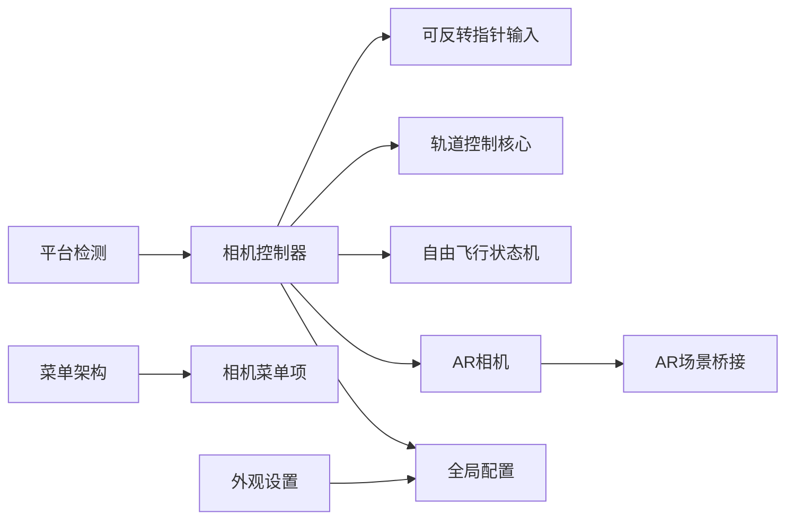

# 相机系统

<cite>
**本文引用的文件**   
- [camera.ts](file://frontend/src/scene/camera/camera.ts)
- [invertablePointersInput.ts](file://frontend/src/scene/camera/invertablePointersInput.ts)
- [ar-camera.ts](file://frontend/src/scene/ar/ar-camera.ts)
- [ar-scene.ts](file://frontend/src/scene/ar/ar-scene.ts)
- [orbit.ts](file://frontend/src/core/orbit.ts)
- [freefly-state.ts](file://frontend/src/core/freefly-state.ts)
- [config.ts](file://frontend/src/config.ts)
- [menu-schema.ts](file://frontend/src/menus/menu-schema.ts)
- [motion-camera-levels.ts](file://frontend/src/menus/motion-camera-levels.ts)
- [settings-appearance.ts](file://frontend/src/menus/settings-appearance.ts)
- [platform.ts](file://frontend/src/core/platform.ts)
- [ADR-055-ar-camera-mode.md](file://docs/adr/adr-055-ar-camera-mode.md)
- [ADR-049-orbit-control-extension.md](file://docs/adr/adr-049-orbit-control-extension.md)
</cite>

## 目录
1. [简介](#简介)
2. [项目结构](#项目结构)
3. [核心组件](#核心组件)
4. [架构总览](#架构总览)
5. [详细组件分析](#详细组件分析)
6. [依赖关系分析](#依赖关系分析)
7. [性能考量](#性能考量)
8. [故障排查指南](#故障排查指南)
9. [结论](#结论)
10. [附录](#附录)

## 简介
本文件面向开发者，系统化梳理 MikuMikuAR 的相机子系统，覆盖轨道相机、自由飞行相机与 AR 相机模式。文档重点包括：
- 相机控制器实现与职责划分
- 输入处理与指针事件管理（含多平台兼容）
- 相机动画、过渡效果与视角切换机制
- 配置文件与自定义相机行为扩展方法
- 调试工具与最佳实践，帮助构建流畅的 3D 导航体验

## 项目结构
相机相关代码主要位于前端源码的 scene/camera 与 core 模块中，AR 相机位于 scene/ar 子目录；菜单与配置层提供相机行为开关与参数入口。

图表来源
- [camera.ts](file://frontend/src/scene/camera/camera.ts)
- [invertablePointersInput.ts](file://frontend/src/scene/camera/invertablePointersInput.ts)
- [orbit.ts](file://frontend/src/core/orbit.ts)
- [freefly-state.ts](file://frontend/src/core/freefly-state.ts)
- [ar-camera.ts](file://frontend/src/scene/ar/ar-camera.ts)
- [ar-scene.ts](file://frontend/src/scene/ar/ar-scene.ts)
- [config.ts](file://frontend/src/config.ts)
- [menu-schema.ts](file://frontend/src/menus/menu-schema.ts)
- [motion-camera-levels.ts](file://frontend/src/menus/motion-camera-levels.ts)
- [settings-appearance.ts](file://frontend/src/menus/settings-appearance.ts)
- [platform.ts](file://frontend/src/core/platform.ts)

章节来源
- [camera.ts](file://frontend/src/scene/camera/camera.ts)
- [invertablePointersInput.ts](file://frontend/src/scene/camera/invertablePointersInput.ts)
- [orbit.ts](file://frontend/src/core/orbit.ts)
- [freefly-state.ts](file://frontend/src/core/freefly-state.ts)
- [ar-camera.ts](file://frontend/src/scene/ar/ar-camera.ts)
- [ar-scene.ts](file://frontend/src/scene/ar/ar-scene.ts)
- [config.ts](file://frontend/src/config.ts)
- [menu-schema.ts](file://frontend/src/menus/menu-schema.ts)
- [motion-camera-levels.ts](file://frontend/src/menus/motion-camera-levels.ts)
- [settings-appearance.ts](file://frontend/src/menus/settings-appearance.ts)
- [platform.ts](file://frontend/src/core/platform.ts)

## 核心组件
- 相机控制器（camera.ts）：统一协调轨道、自由飞行与 AR 三种模式的相机行为，负责生命周期、输入绑定、动画过渡与模式切换。
- 可反转指针输入（invertablePointersInput.ts）：封装指针事件到“旋转/平移/缩放”等抽象操作，支持 Y 轴反转、设备差异与多点触控。
- 轨道控制核心（orbit.ts）：基于球面坐标的轨道运动算法，提供阻尼、边界限制与惯性。
- 自由飞行状态机（freefly-state.ts）：以状态机驱动前后左右、上升下降、加速减速与平滑插值。
- AR 相机（ar-camera.ts）：在 AR 模式下接管或融合真实世界相机数据，处理遮挡、对齐与渲染管线适配。
- AR 场景桥接（ar-scene.ts）：将 AR 相机与场景资源、光照与环境进行集成。
- 配置与菜单（config.ts、menu-schema.ts、motion-camera-levels.ts、settings-appearance.ts）：暴露相机参数、行为开关与 UI 菜单项。
- 平台检测（platform.ts）：识别桌面/移动端/AR 环境，影响输入策略与默认行为。

章节来源
- [camera.ts](file://frontend/src/scene/camera/camera.ts)
- [invertablePointersInput.ts](file://frontend/src/scene/camera/invertablePointersInput.ts)
- [orbit.ts](file://frontend/src/core/orbit.ts)
- [freefly-state.ts](file://frontend/src/core/freefly-state.ts)
- [ar-camera.ts](file://frontend/src/scene/ar/ar-camera.ts)
- [ar-scene.ts](file://frontend/src/scene/ar/ar-scene.ts)
- [config.ts](file://frontend/src/config.ts)
- [menu-schema.ts](file://frontend/src/menus/menu-schema.ts)
- [motion-camera-levels.ts](file://frontend/src/menus/motion-camera-levels.ts)
- [settings-appearance.ts](file://frontend/src/menus/settings-appearance.ts)
- [platform.ts](file://frontend/src/core/platform.ts)

## 架构总览
相机系统采用“控制器 + 输入抽象 + 模式插件”的分层设计。控制器作为中枢，根据当前模式路由输入与更新逻辑；输入抽象屏蔽平台差异；模式插件提供具体行为（轨道/自由飞行/AR）。

图表来源
- [camera.ts](file://frontend/src/scene/camera/camera.ts)
- [invertablePointersInput.ts](file://frontend/src/scene/camera/invertablePointersInput.ts)
- [orbit.ts](file://frontend/src/core/orbit.ts)
- [freefly-state.ts](file://frontend/src/core/freefly-state.ts)
- [ar-camera.ts](file://frontend/src/scene/ar/ar-camera.ts)

## 详细组件分析

### 轨道相机
- 行为特征：围绕目标点做球面旋转，支持阻尼、滚动缩放、边界限制与惯性回弹。
- 输入映射：鼠标拖拽/单指滑动 → 水平/垂直旋转；滚轮/双指捏合 → 半径变化。
- 关键参数：阻尼系数、最小/最大半径、上下限角度、目标点位置。
- 优化建议：对高频输入进行节流与合并，避免抖动；在低帧率下提高阻尼以保持稳定。

章节来源
- [orbit.ts](file://frontend/src/core/orbit.ts)
- [camera.ts](file://frontend/src/scene/camera/camera.ts)
- [ADR-049-orbit-control-extension.md](file://docs/adr/adr-049-orbit-control-extension.md)

### 自由飞行相机
- 行为特征：WASD/方向键移动，鼠标/陀螺仪控制朝向，支持加速与平滑插值。
- 输入映射：键盘/虚拟摇杆 → 位移；鼠标/陀螺仪 → 朝向；Shift/Ctrl → 加速/减速。
- 状态机：包含空闲、移动、旋转、加速等状态，确保过渡自然。
- 碰撞与约束：可选地面贴合、高度限制与速度上限。

章节来源
- [freefly-state.ts](file://frontend/src/core/freefly-state.ts)
- [camera.ts](file://frontend/src/scene/camera/camera.ts)

### AR 相机模式
- 行为特征：在 AR 环境下接入真实相机流，保持模型与现实的尺度与透视一致，必要时叠加虚拟相机控制。
- 集成要点：会话生命周期管理、传感器融合、遮挡处理、渲染目标适配。
- 兼容性：不同平台（Android/iOS/WebXR）的差异通过平台检测与条件分支处理。

图表来源
- [ar-camera.ts](file://frontend/src/scene/ar/ar-camera.ts)
- [ar-scene.ts](file://frontend/src/scene/ar/ar-scene.ts)
- [platform.ts](file://frontend/src/core/platform.ts)
- [camera.ts](file://frontend/src/scene/camera/camera.ts)

章节来源
- [ar-camera.ts](file://frontend/src/scene/ar/ar-camera.ts)
- [ar-scene.ts](file://frontend/src/scene/ar/ar-scene.ts)
- [platform.ts](file://frontend/src/core/platform.ts)
- [ADR-055-ar-camera-mode.md](file://docs/adr/adr-055-ar-camera-mode.md)

### 输入处理与指针事件管理
- 抽象层：将原始指针事件转换为“旋转/平移/缩放”等操作，屏蔽平台差异。
- 多平台兼容：桌面端使用鼠标与滚轮；移动端使用触摸与手势；AR 环境结合传感器。
- Y 轴反转：提供选项以翻转垂直旋转方向，满足不同交互习惯。
- 防抖与节流：对高频事件进行合并与限速，提升稳定性与性能。

图表来源
- [invertablePointersInput.ts](file://frontend/src/scene/camera/invertablePointersInput.ts)
- [camera.ts](file://frontend/src/scene/camera/camera.ts)

章节来源
- [invertablePointersInput.ts](file://frontend/src/scene/camera/invertablePointersInput.ts)
- [camera.ts](file://frontend/src/scene/camera/camera.ts)

### 相机动画、过渡效果与视角切换
- 过渡机制：在模式切换或目标变更时，使用插值与缓动函数平滑过渡，避免跳变。
- 动画队列：支持多个过渡动作排队与优先级控制，保证最终状态正确。
- 视角预设：通过菜单或快捷键快速跳转到常用视角（如正面、俯视、跟随）。

图表来源
- [camera.ts](file://frontend/src/scene/camera/camera.ts)

章节来源
- [camera.ts](file://frontend/src/scene/camera/camera.ts)

### 配置文件与自定义相机行为
- 全局配置（config.ts）：集中管理相机参数（阻尼、速度、边界、Y 轴反转等），支持运行时修改与持久化。
- 菜单架构（menu-schema.ts）：定义相机相关菜单项的结构与校验规则。
- 相机菜单项（motion-camera-levels.ts）：提供视角预设、快捷切换与模式开关。
- 外观设置（settings-appearance.ts）：与相机相关的显示与交互偏好。
- 自定义扩展：通过注册新的模式处理器或输入适配器，在不侵入核心逻辑的前提下扩展相机行为。

章节来源
- [config.ts](file://frontend/src/config.ts)
- [menu-schema.ts](file://frontend/src/menus/menu-schema.ts)
- [motion-camera-levels.ts](file://frontend/src/menus/motion-camera-levels.ts)
- [settings-appearance.ts](file://frontend/src/menus/settings-appearance.ts)

## 依赖关系分析
相机控制器依赖输入抽象与各模式实现；配置与菜单为上层提供参数与交互入口；平台检测决定行为分支。

图表来源
- [camera.ts](file://frontend/src/scene/camera/camera.ts)
- [invertablePointersInput.ts](file://frontend/src/scene/camera/invertablePointersInput.ts)
- [orbit.ts](file://frontend/src/core/orbit.ts)
- [freefly-state.ts](file://frontend/src/core/freefly-state.ts)
- [ar-camera.ts](file://frontend/src/scene/ar/ar-camera.ts)
- [ar-scene.ts](file://frontend/src/scene/ar/ar-scene.ts)
- [config.ts](file://frontend/src/config.ts)
- [menu-schema.ts](file://frontend/src/menus/menu-schema.ts)
- [motion-camera-levels.ts](file://frontend/src/menus/motion-camera-levels.ts)
- [settings-appearance.ts](file://frontend/src/menus/settings-appearance.ts)
- [platform.ts](file://frontend/src/core/platform.ts)

章节来源
- [camera.ts](file://frontend/src/scene/camera/camera.ts)
- [config.ts](file://frontend/src/config.ts)
- [platform.ts](file://frontend/src/core/platform.ts)

## 性能考量
- 输入节流与合并：降低高频事件对主循环的压力，减少不必要的矩阵重算。
- 阻尼与惯性：合理设置阻尼系数，平衡响应速度与稳定性，避免过冲与抖动。
- 几何与渲染：在 AR 模式下尽量减少额外后处理，优先使用原生相机渲染路径。
- 内存与生命周期：及时释放 AR 会话与纹理资源，避免泄漏。
- 跨平台差异：针对移动端与桌面端分别优化输入采样率与动画步长。

[本节为通用指导，不直接分析具体文件]

## 故障排查指南
- 无法切换到 AR 模式：检查平台检测返回值与 AR 会话初始化日志，确认设备与浏览器支持情况。
- 输入无响应：验证指针事件注册是否成功，检查 Y 轴反转与多点触控冲突。
- 视角切换卡顿：调整过渡时长与缓动函数，检查动画队列是否存在阻塞任务。
- 轨道控制异常：核对边界限制与阻尼参数，确认目标点未发生突变。
- 配置未生效：确认配置加载顺序与持久化写入是否成功，检查菜单项与配置的字段映射。

章节来源
- [platform.ts](file://frontend/src/core/platform.ts)
- [invertablePointersInput.ts](file://frontend/src/scene/camera/invertablePointersInput.ts)
- [camera.ts](file://frontend/src/scene/camera/camera.ts)
- [orbit.ts](file://frontend/src/core/orbit.ts)
- [config.ts](file://frontend/src/config.ts)

## 结论
相机系统通过清晰的职责分层与可扩展的模式设计，实现了轨道、自由飞行与 AR 三种模式的统一管理与平滑切换。借助输入抽象与平台检测，系统在多平台上保持一致的交互体验。配合完善的配置与菜单体系，开发者可以快速定制相机行为，并通过调试与性能优化手段获得流畅的 3D 导航体验。

[本节为总结性内容，不直接分析具体文件]

## 附录
- 术语说明：轨道相机、自由飞行相机、AR 相机、指针事件、过渡动画、模式切换。
- 参考 ADR：
  - AR 相机模式决策与设计要点
  - 轨道控制扩展方案与边界处理

章节来源
- [ADR-055-ar-camera-mode.md](file://docs/adr/adr-055-ar-camera-mode.md)
- [ADR-049-orbit-control-extension.md](file://docs/adr/adr-049-orbit-control-extension.md)