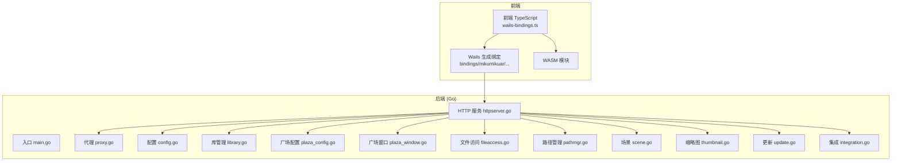
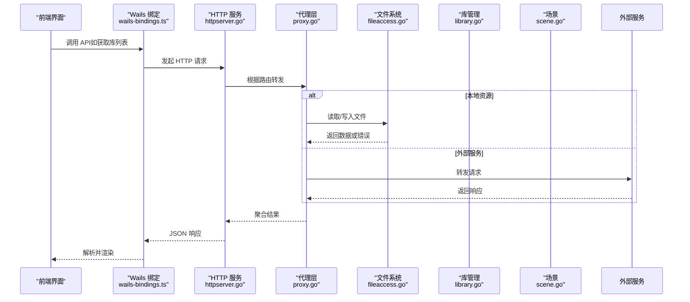
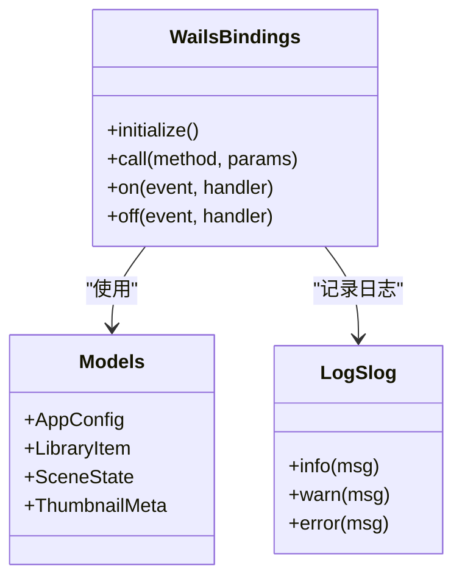
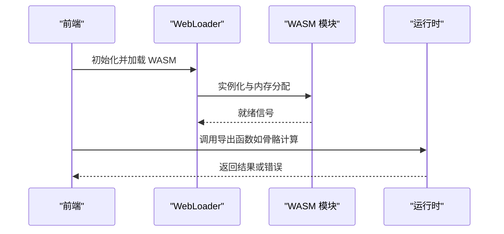
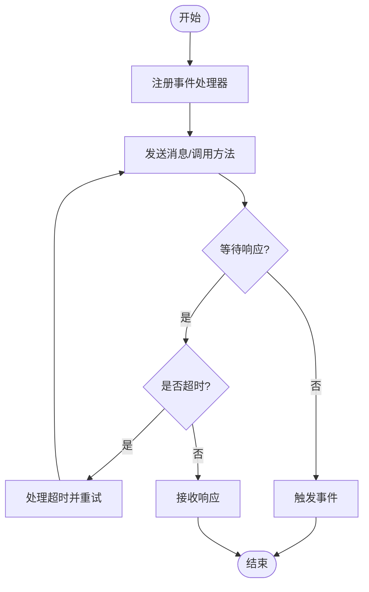
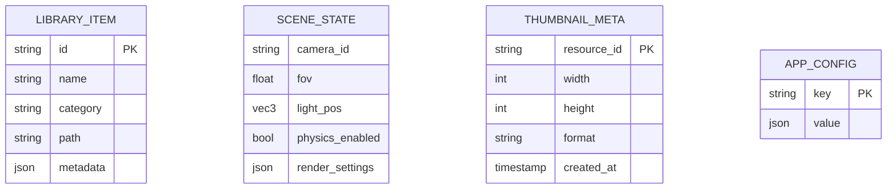
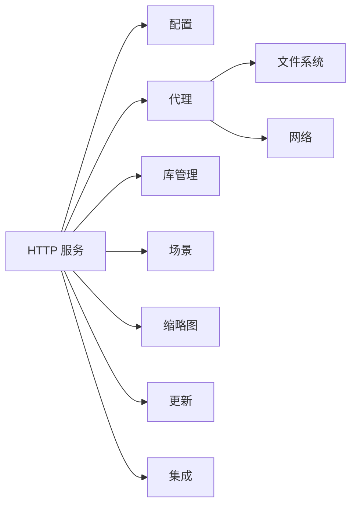

# API 参考

<cite>
**本文引用的文件**   
- [main.go](file://main.go)
- [go.mod](file://go.mod)
- [internal/app/httpserver.go](file://internal/app/httpserver.go)
- [internal/app/proxy.go](file://internal/app/proxy.go)
- [internal/app/config.go](file://internal/app/config.go)
- [internal/app/library.go](file://internal/app/library.go)
- [internal/app/plaza_config.go](file://internal/app/plaza_config.go)
- [internal/app/plaza_window.go](file://internal/app/plaza_window.go)
- [internal/app/fileaccess.go](file://internal/app/fileaccess.go)
- [internal/app/pathmgr.go](file://internal/app/pathmgr.go)
- [internal/app/scene.go](file://internal/app/scene.go)
- [internal/app/thumbnail.go](file://internal/app/thumbnail.go)
- [internal/app/update.go](file://internal/app/update.go)
- [internal/app/integration.go](file://internal/app/integration.go)
- [frontend/src/core/wails-bindings.ts](file://frontend/src/core/wails-bindings.ts)
- [frontend/bindings/mikumikuar/internal/app/index.ts](file://frontend/bindings/mikumikuar/internal/app/index.ts)
- [frontend/bindings/mikumikuar/internal/app/models.ts](file://frontend/bindings/mikumikuar/internal/app/models.ts)
- [frontend/bindings/log/slog/index.ts](file://frontend/bindings/log/slog/index.ts)
- [frontend/bindings/log/slog/models.ts](file://frontend/bindings/log/slog/models.ts)
</cite>

## 目录
1. [简介](#简介)
2. [项目结构](#项目结构)
3. [核心组件](#核心组件)
4. [架构总览](#架构总览)
5. [详细组件分析](#详细组件分析)
6. [依赖分析](#依赖分析)
7. [性能考虑](#性能考虑)
8. [故障排查指南](#故障排查指南)
9. [结论](#结论)
10. [附录](#附录) 

## 简介
本 API 参考文档面向集成者与开发者，系统性梳理 MikuMikuAR 的前端 API、后端（Wails）API、WASM 绑定接口以及进程间通信机制。内容覆盖：
- RESTful API：HTTP 方法、URL 模式、请求/响应模型、认证与错误码
- IPC/Pipe 通信：Wails 事件系统、Go 到 TS 的绑定、消息传递与同步
- WASM 绑定：前端类型定义、调用约定与生命周期
- 配置选项：全局配置、运行时参数、平台差异
- 版本兼容性与迁移指南：向后兼容策略、破坏性变更提示

## 项目结构
本项目采用前后端分离与 Wails 桥接架构：
- 前端（TypeScript/Vite）通过 Wails 生成的绑定访问 Go 后端能力
- 后端（Go）提供 HTTP 服务、文件系统、库管理、场景控制、更新检查等能力
- WASM 模块由前端加载并暴露给业务逻辑使用

图表来源
- [main.go:1-200](file://main.go#L1-L200)
- [internal/app/httpserver.go:1-200](file://internal/app/httpserver.go#L1-L200)
- [internal/app/proxy.go:1-200](file://internal/app/proxy.go#L1-L200)
- [internal/app/config.go:1-200](file://internal/app/config.go#L1-L200)
- [internal/app/library.go:1-200](file://internal/app/library.go#L1-L200)
- [internal/app/plaza_config.go:1-200](file://internal/app/plaza_config.go#L1-L200)
- [internal/app/plaza_window.go:1-200](file://internal/app/plaza_window.go#L1-L200)
- [internal/app/fileaccess.go:1-200](file://internal/app/fileaccess.go#L1-L200)
- [internal/app/pathmgr.go:1-200](file://internal/app/pathmgr.go#L1-L200)
- [internal/app/scene.go:1-200](file://internal/app/scene.go#L1-L200)
- [internal/app/thumbnail.go:1-200](file://internal/app/thumbnail.go#L1-L200)
- [internal/app/update.go:1-200](file://internal/app/update.go#L1-L200)
- [internal/app/integration.go:1-200](file://internal/app/integration.go#L1-L200)

章节来源
- [main.go:1-200](file://main.go#L1-L200)
- [go.mod:1-200](file://go.mod#L1-L200)

## 核心组件
本节概述关键 API 域与职责划分：
- HTTP 服务与路由：统一入口、中间件、跨域与安全头
- 代理层：转发外部请求至目标服务，处理鉴权与重试
- 配置中心：应用配置、环境切换、平台差异化
- 资源与库：模型、材质、动作、预设、缩略图
- 场景与渲染：场景状态、相机、物理、环境
- 更新与集成：自动更新、第三方集成点

章节来源
- [internal/app/httpserver.go:1-200](file://internal/app/httpserver.go#L1-L200)
- [internal/app/proxy.go:1-200](file://internal/app/proxy.go#L1-L200)
- [internal/app/config.go:1-200](file://internal/app/config.go#L1-L200)
- [internal/app/library.go:1-200](file://internal/app/library.go#L1-L200)
- [internal/app/scene.go:1-200](file://internal/app/scene.go#L1-L200)
- [internal/app/thumbnail.go:1-200](file://internal/app/thumbnail.go#L1-L200)
- [internal/app/update.go:1-200](file://internal/app/update.go#L1-L200)
- [internal/app/integration.go:1-200](file://internal/app/integration.go#L1-L200)

## 架构总览
下图展示从前端到后端的完整调用链，包括 Wails 绑定、HTTP 路由、代理转发与资源访问。

图表来源
- [frontend/src/core/wails-bindings.ts:1-200](file://frontend/src/core/wails-bindings.ts#L1-L200)
- [internal/app/httpserver.go:1-200](file://internal/app/httpserver.go#L1-L200)
- [internal/app/proxy.go:1-200](file://internal/app/proxy.go#L1-L200)
- [internal/app/fileaccess.go:1-200](file://internal/app/fileaccess.go#L1-L200)
- [internal/app/library.go:1-200](file://internal/app/library.go#L1-L200)
- [internal/app/scene.go:1-200](file://internal/app/scene.go#L1-L200)

## 详细组件分析

### 前端 API（Wails 绑定）
- 绑定生成位置：frontend/bindings/mikumikuar/internal/app/*
- 前端调用入口：frontend/src/core/wails-bindings.ts
- 日志绑定：frontend/bindings/log/slog/*

要点
- 类型安全：TS 侧通过 bindings 中的 models.ts 与 index.ts 获得强类型约束
- 事件系统：基于 Wails 事件总线，支持异步回调与错误传播
- 生命周期：初始化、销毁、错误恢复在绑定层统一封装

图表来源
- [frontend/src/core/wails-bindings.ts:1-200](file://frontend/src/core/wails-bindings.ts#L1-L200)
- [frontend/bindings/mikumikuar/internal/app/models.ts:1-200](file://frontend/bindings/mikumikuar/internal/app/models.ts#L1-L200)
- [frontend/bindings/log/slog/models.ts:1-200](file://frontend/bindings/log/slog/models.ts#L1-L200)

章节来源
- [frontend/src/core/wails-bindings.ts:1-200](file://frontend/src/core/wails-bindings.ts#L1-L200)
- [frontend/bindings/mikumikuar/internal/app/index.ts:1-200](file://frontend/bindings/mikumikuar/internal/app/index.ts#L1-L200)
- [frontend/bindings/mikumikuar/internal/app/models.ts:1-200](file://frontend/bindings/mikumikuar/internal/app/models.ts#L1-L200)
- [frontend/bindings/log/slog/index.ts:1-200](file://frontend/bindings/log/slog/index.ts#L1-L200)
- [frontend/bindings/log/slog/models.ts:1-200](file://frontend/bindings/log/slog/models.ts#L1-L200)

### 后端 API（HTTP 服务与路由）
- 入口与启动：main.go
- HTTP 服务：internal/app/httpserver.go
- 代理转发：internal/app/proxy.go
- 配置：internal/app/config.go
- 库管理：internal/app/library.go
- 广场配置与窗口：internal/app/plaza_config.go、internal/app/plaza_window.go
- 文件访问：internal/app/fileaccess.go
- 路径管理：internal/app/pathmgr.go
- 场景控制：internal/app/scene.go
- 缩略图：internal/app/thumbnail.go
- 更新检查：internal/app/update.go
- 集成点：internal/app/integration.go

RESTful API 概览（示例）
- 库管理
  - GET /api/library/items
    - 描述：列出库项（模型、材质、动作等）
    - 查询参数：page、pageSize、keyword、category
    - 响应：分页对象，包含 items 数组与元信息
    - 错误码：400（参数无效）、500（内部错误）
  - GET /api/library/items/:id
    - 描述：获取单个库项详情
    - 响应：库项对象
    - 错误码：404（不存在）、500（内部错误）
  - POST /api/library/import
    - 描述：导入资源包（ZIP/文件夹）
    - 请求体：multipart/form-data 或 JSON（含路径）
    - 响应：导入任务 ID 或结果
    - 错误码：400（格式错误）、409（冲突）、500（内部错误）

- 场景控制
  - GET /api/scene/state
    - 描述：获取当前场景状态
    - 响应：场景状态对象（相机、灯光、环境、物理等）
    - 错误码：500（内部错误）
  - PUT /api/scene/state
    - 描述：更新场景状态（幂等）
    - 请求体：场景状态对象
    - 响应：确认或新状态
    - 错误码：400（校验失败）、500（内部错误）

- 缩略图
  - GET /api/thumbnails/:resourceId
    - 描述：获取资源缩略图
    - 响应：图片流或 base64
    - 错误码：404（不存在）、500（内部错误）

- 更新检查
  - GET /api/update/check
    - 描述：检查新版本
    - 响应：可用版本信息与下载链接
    - 错误码：500（网络或解析错误）

认证与权限
- 默认无外部认证；可通过代理层注入鉴权中间件
- 建议为敏感操作添加 Token 校验与速率限制

章节来源
- [main.go:1-200](file://main.go#L1-L200)
- [internal/app/httpserver.go:1-200](file://internal/app/httpserver.go#L1-L200)
- [internal/app/proxy.go:1-200](file://internal/app/proxy.go#L1-L200)
- [internal/app/config.go:1-200](file://internal/app/config.go#L1-L200)
- [internal/app/library.go:1-200](file://internal/app/library.go#L1-L200)
- [internal/app/scene.go:1-200](file://internal/app/scene.go#L1-L200)
- [internal/app/thumbnail.go:1-200](file://internal/app/thumbnail.go#L1-L200)
- [internal/app/update.go:1-200](file://internal/app/update.go#L1-L200)

### WASM 绑定接口
- 前端加载与初始化：frontend/src/web-loader/main.ts
- 类型与模型：frontend/bindings/mikumikuar/internal/app/models.ts
- 调用约定：Promise 风格，错误以异常或错误对象返回

典型流程

图表来源
- [frontend/src/web-loader/main.ts:1-200](file://frontend/src/web-loader/main.ts#L1-L200)
- [frontend/bindings/mikumikuar/internal/app/models.ts:1-200](file://frontend/bindings/mikumikuar/internal/app/models.ts#L1-L200)

章节来源
- [frontend/src/web-loader/main.ts:1-200](file://frontend/src/web-loader/main.ts#L1-L200)
- [frontend/bindings/mikumikuar/internal/app/models.ts:1-200](file://frontend/bindings/mikumikuar/internal/app/models.ts#L1-L200)

### IPC/Pipe 通信（Wails 事件系统）
- 事件发布/订阅：前端通过 wails-bindings.ts 注册事件处理器
- 消息格式：JSON 序列化，包含 event、payload、timestamp
- 进程同步：基于 Promise 的调用-响应模式，超时与重试可配置

图表来源
- [frontend/src/core/wails-bindings.ts:1-200](file://frontend/src/core/wails-bindings.ts#L1-L200)

章节来源
- [frontend/src/core/wails-bindings.ts:1-200](file://frontend/src/core/wails-bindings.ts#L1-L200)

### 配置选项与参数类型
- 全局配置：端口、CORS、日志级别、代理规则
- 运行时参数：平台差异（Android/Desktop）、路径映射、缓存策略
- 类型定义：位于 bindings/models.ts 与 core/types.ts

常见配置键
- server.port：监听端口
- cors.enabled：是否启用 CORS
- log.level：日志级别（debug/info/warn/error）
- proxy.rules：代理规则列表（源域名、目标地址、鉴权）
- paths.library：库根目录
- paths.cache：缓存目录

章节来源
- [internal/app/config.go:1-200](file://internal/app/config.go#L1-L200)
- [frontend/bindings/mikumikuar/internal/app/models.ts:1-200](file://frontend/bindings/mikumikuar/internal/app/models.ts#L1-L200)

### 数据模型说明
- LibraryItem：库项标识、名称、分类、路径、元数据
- SceneState：相机、灯光、环境、物理、渲染设置
- ThumbnailMeta：缩略图尺寸、格式、生成时间
- AppConfig：应用配置集合

图表来源
- [frontend/bindings/mikumikuar/internal/app/models.ts:1-200](file://frontend/bindings/mikumikuar/internal/app/models.ts#L1-L200)

章节来源
- [frontend/bindings/mikumikuar/internal/app/models.ts:1-200](file://frontend/bindings/mikumikuar/internal/app/models.ts#L1-L200)

## 依赖分析
- 模块耦合：HTTP 服务依赖配置、代理、库、场景、缩略图、更新与集成
- 外部依赖：文件系统、网络请求、WASM 运行时
- 循环依赖：应避免在 HTTP 与业务逻辑之间形成环

图表来源
- [internal/app/httpserver.go:1-200](file://internal/app/httpserver.go#L1-L200)
- [internal/app/proxy.go:1-200](file://internal/app/proxy.go#L1-L200)
- [internal/app/config.go:1-200](file://internal/app/config.go#L1-L200)
- [internal/app/library.go:1-200](file://internal/app/library.go#L1-L200)
- [internal/app/scene.go:1-200](file://internal/app/scene.go#L1-L200)
- [internal/app/thumbnail.go:1-200](file://internal/app/thumbnail.go#L1-L200)
- [internal/app/update.go:1-200](file://internal/app/update.go#L1-L200)
- [internal/app/integration.go:1-200](file://internal/app/integration.go#L1-L200)

章节来源
- [internal/app/httpserver.go:1-200](file://internal/app/httpserver.go#L1-L200)
- [internal/app/proxy.go:1-200](file://internal/app/proxy.go#L1-L200)
- [internal/app/config.go:1-200](file://internal/app/config.go#L1-L200)

## 性能考虑
- 缓存策略：缩略图与库索引应启用磁盘与内存两级缓存
- 并发控制：代理层对上游服务进行限流与熔断
- 批处理：批量导入与导出采用分片与进度上报
- 资源清理：场景切换时释放纹理、几何与物理对象

[本节为通用指导，不直接分析具体文件]

## 故障排查指南
- 常见问题
  - 404 资源缺失：检查路径映射与库扫描
  - 500 内部错误：查看后端日志与堆栈
  - CORS 被拦截：确认服务器 CORS 配置与浏览器策略
  - WASM 加载失败：检查构建产物路径与 MIME 类型
- 诊断工具
  - 日志：slog 绑定提供结构化日志
  - 调试：启用 debug 级别，捕获请求/响应体
  - 断点：在代理层与 HTTP 路由处插入断点

章节来源
- [frontend/bindings/log/slog/index.ts:1-200](file://frontend/bindings/log/slog/index.ts#L1-L200)
- [frontend/bindings/log/slog/models.ts:1-200](file://frontend/bindings/log/slog/models.ts#L1-L200)
- [internal/app/proxy.go:1-200](file://internal/app/proxy.go#L1-L200)
- [internal/app/httpserver.go:1-200](file://internal/app/httpserver.go#L1-L200)

## 结论
本 API 参考提供了从前端到后端的完整视图，涵盖 RESTful 接口、IPC 通信、WASM 绑定与配置模型。建议在实际集成中遵循类型契约、错误处理与性能优化最佳实践，并在升级时关注兼容性说明与迁移指南。

[本节为总结，不直接分析具体文件]

## 附录

### 版本兼容性与迁移指南
- 向后兼容
  - 新增字段默认值需稳定
  - 废弃字段保留至少两个主版本
- 破坏性变更
  - 明确标注 breaking change
  - 提供迁移脚本或对照表
- 建议
  - 使用语义化版本
  - 在 API 头部或响应体中包含版本信息

[本节为通用指导，不直接分析具体文件]