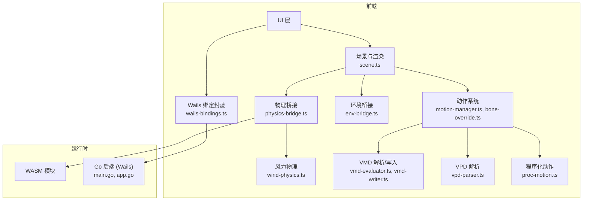
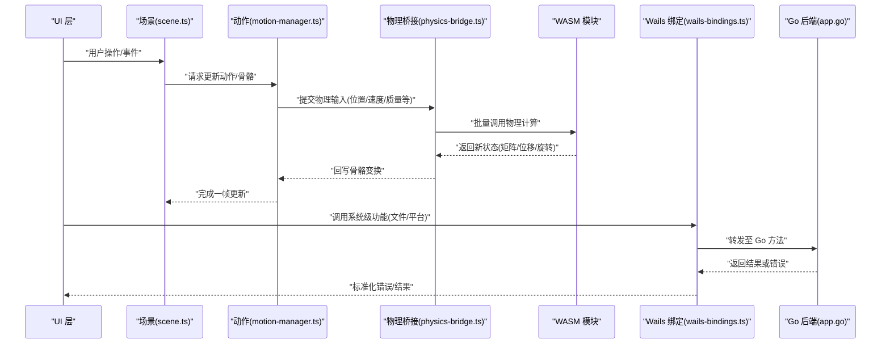
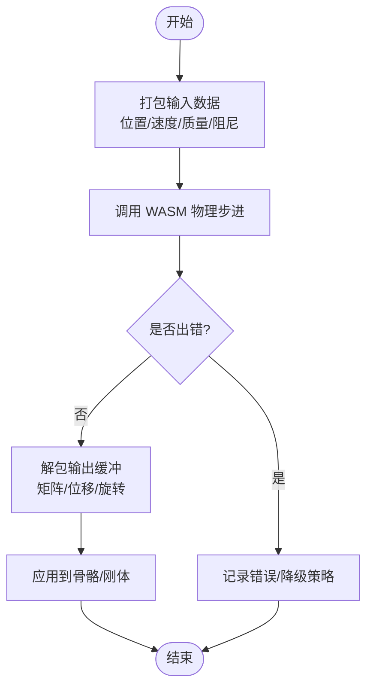
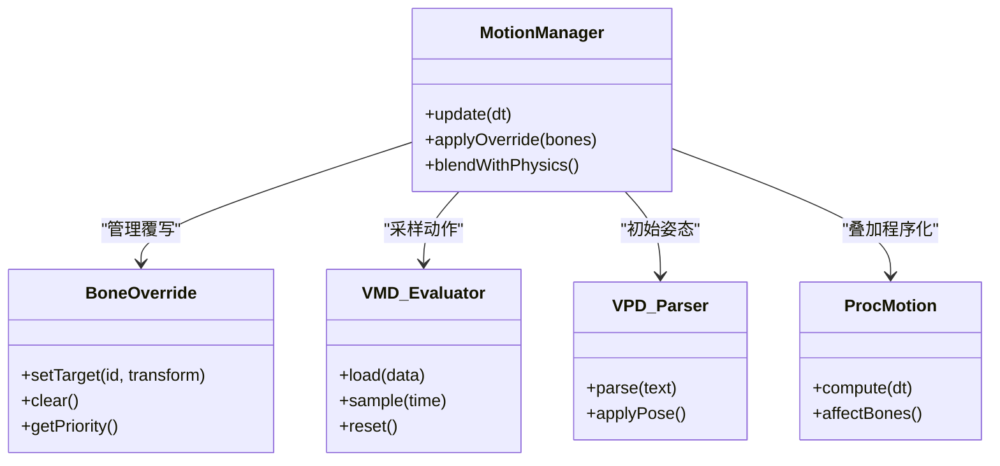
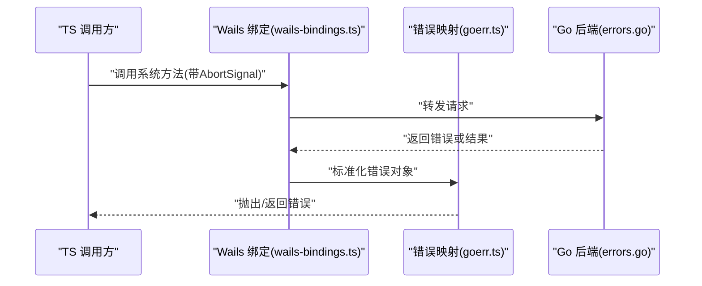
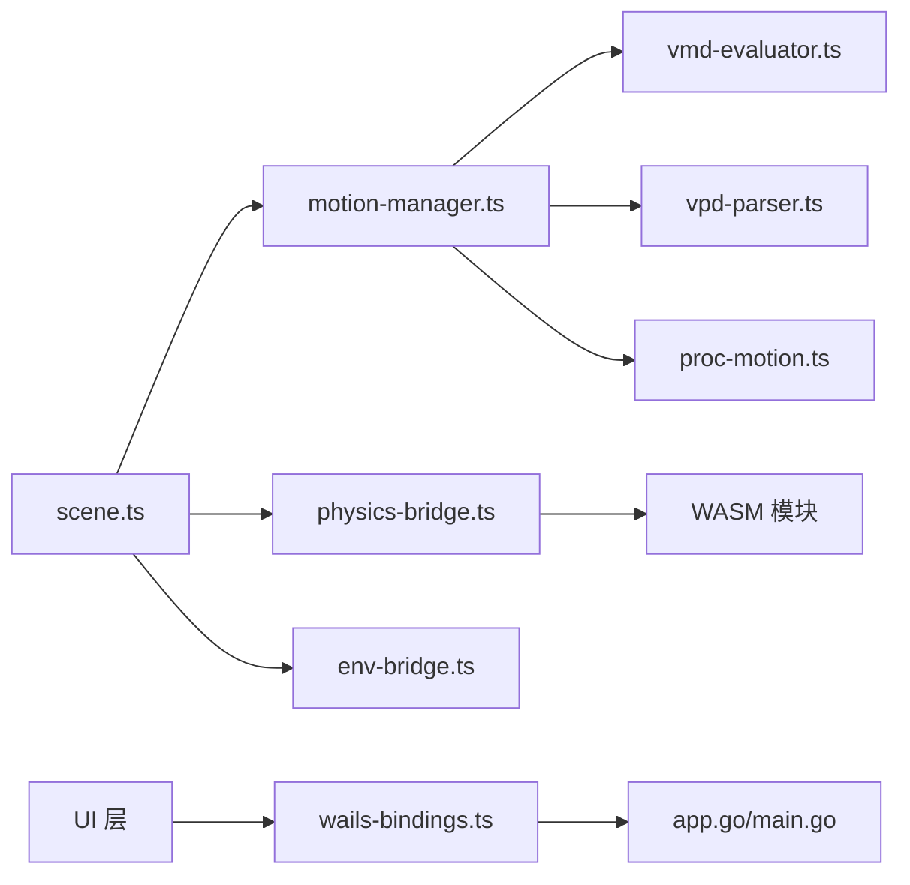

# WASM 绑定接口

<cite>
**本文引用的文件**   
- [main.go](file://main.go)
- [app.go](file://internal/app/app.go)
- [wails-bindings.ts](file://frontend/src/core/wails-bindings.ts)
- [physics-bridge.ts](file://frontend/src/physics/physics-bridge.ts)
- [wind-physics.ts](file://frontend/src/physics/wind-physics.ts)
- [vmd-evaluator.ts](file://frontend/src/motion-algos/vmd-evaluator.ts)
- [vmd-writer.ts](file://frontend/src/motion-algos/vmd-writer.ts)
- [vpd-parser.ts](file://frontend/src/motion-algos/vpd-parser.ts)
- [scene.ts](file://frontend/src/scene/scene.ts)
- [motion-manager.ts](file://frontend/src/scene/motion/motion-manager.ts)
- [bone-override.ts](file://frontend/src/scene/motion/bone-override.ts)
- [proc-motion.ts](file://frontend/src/motion-algos/procedural-motion.ts)
- [env-bridge.ts](file://frontend/src/scene/env/env-bridge.ts)
- [goerr.ts](file://frontend/src/core/i18n/goerr.ts)
- [errors.go](file://internal/util/errors.go)
- [ADR-056-wasm-runtime-motion-layers.md](file://docs/adr/adr-056-wasm-runtime-motion-layers.md)
- [ADR-105-abort-signal-and-async-error-handling.md](file://docs/adr/adr-105-abort-signal-and-async-error-handling.md)
- [ADR-106-timing-audit-and-async-lifecycle.md](file://docs/adr/adr-106-timing-audit-and-async-lifecycle.md)
</cite>

## 目录
1. [简介](#简介)
2. [项目结构](#项目结构)
3. [核心组件](#核心组件)
4. [架构总览](#架构总览)
5. [详细组件分析](#详细组件分析)
6. [依赖关系分析](#依赖关系分析)
7. [性能考虑](#性能考虑)
8. [故障排查指南](#故障排查指南)
9. [结论](#结论)
10. [附录](#附录)

## 简介
本文件为 MikuMikuAR 项目中 WebAssembly（WASM）模块与前端 JavaScript/TypeScript 之间的绑定接口参考文档。内容覆盖物理计算、骨骼动画、VMD 解析等关键能力，说明数据类型映射、内存管理、函数调用方式、参数传递与返回值处理、异步操作与错误传播机制，并提供性能优化建议、调试技巧以及版本兼容性与升级注意事项。

## 项目结构
本项目采用前后端分离的 Wails v3 架构：Go 后端通过 Wails 暴露 API，前端 TypeScript 通过自动生成的绑定进行调用；同时，前端在浏览器环境中加载 WASM 模块以执行高性能计算（如物理、动作评估）。整体结构如下：

图表来源
- [main.go:1-200](file://main.go#L1-L200)
- [app.go:1-200](file://internal/app/app.go#L1-L200)
- [wails-bindings.ts:1-200](file://frontend/src/core/wails-bindings.ts#L1-L200)
- [physics-bridge.ts:1-200](file://frontend/src/physics/physics-bridge.ts#L1-L200)
- [wind-physics.ts:1-200](file://frontend/src/physics/wind-physics.ts#L1-L200)
- [vmd-evaluator.ts:1-200](file://frontend/src/motion-algos/vmd-evaluator.ts#L1-L200)
- [vmd-writer.ts:1-200](file://frontend/src/motion-algos/vmd-writer.ts#L1-L200)
- [vpd-parser.ts:1-200](file://frontend/src/motion-algos/vpd-parser.ts#L1-L200)
- [scene.ts:1-200](file://frontend/src/scene/scene.ts#L1-L200)
- [motion-manager.ts:1-200](file://frontend/src/scene/motion/motion-manager.ts#L1-L200)
- [bone-override.ts:1-200](file://frontend/src/scene/motion/bone-override.ts#L1-L200)
- [proc-motion.ts:1-200](file://frontend/src/motion-algos/procedural-motion.ts#L1-L200)
- [env-bridge.ts:1-200](file://frontend/src/scene/env/env-bridge.ts#L1-L200)

章节来源
- [main.go:1-200](file://main.go#L1-L200)
- [app.go:1-200](file://internal/app/app.go#L1-L200)
- [wails-bindings.ts:1-200](file://frontend/src/core/wails-bindings.ts#L1-L200)

## 核心组件
本节概述与 WASM 绑定相关的前端核心组件及其职责：
- 物理桥接（physics-bridge.ts）：封装对 WASM 物理计算的调用，负责数据拷贝、批处理与结果回写。
- 风力物理（wind-physics.ts）：提供风场影响下的附加物理效果，常与主物理引擎协同。
- 动作系统（motion-manager.ts, bone-override.ts）：协调 VMD/VPD 解析、骨骼覆写与帧更新。
- VMD 解析/写入（vmd-evaluator.ts, vmd-writer.ts）：读取/生成 VMD 动作数据，供 WASM 或 JS 侧使用。
- VPD 解析（vpd-parser.ts）：解析姿态文件，用于初始化或切换模型姿态。
- 程序化动作（proc-motion.ts）：基于规则的程序化骨骼运动，可与 WASM 物理叠加。
- 环境桥接（env-bridge.ts）：与环境子系统交互，可能触发物理或渲染相关的联动。
- Wails 绑定封装（wails-bindings.ts）：统一封装 Wails 调用，包括错误类型转换与异步处理。

章节来源
- [physics-bridge.ts:1-200](file://frontend/src/physics/physics-bridge.ts#L1-L200)
- [wind-physics.ts:1-200](file://frontend/src/physics/wind-physics.ts#L1-L200)
- [motion-manager.ts:1-200](file://frontend/src/scene/motion/motion-manager.ts#L1-L200)
- [bone-override.ts:1-200](file://frontend/src/scene/motion/bone-override.ts#L1-L200)
- [vmd-evaluator.ts:1-200](file://frontend/src/motion-algos/vmd-evaluator.ts#L1-L200)
- [vmd-writer.ts:1-200](file://frontend/src/motion-algos/vmd-writer.ts#L1-L200)
- [vpd-parser.ts:1-200](file://frontend/src/motion-algos/vpd-parser.ts#L1-L200)
- [proc-motion.ts:1-200](file://frontend/src/motion-algos/procedural-motion.ts#L1-L200)
- [env-bridge.ts:1-200](file://frontend/src/scene/env/env-bridge.ts#L1-L200)
- [wails-bindings.ts:1-200](file://frontend/src/core/wails-bindings.ts#L1-L200)

## 架构总览
下图展示从 UI 到 WASM 的完整调用链路，包括错误传播与异步生命周期管理。

图表来源
- [scene.ts:1-200](file://frontend/src/scene/scene.ts#L1-L200)
- [motion-manager.ts:1-200](file://frontend/src/scene/motion/motion-manager.ts#L1-L200)
- [physics-bridge.ts:1-200](file://frontend/src/physics/physics-bridge.ts#L1-L200)
- [wails-bindings.ts:1-200](file://frontend/src/core/wails-bindings.ts#L1-L200)
- [app.go:1-200](file://internal/app/app.go#L1-L200)

## 详细组件分析

### 物理计算接口（WASM 物理）
- 职责：将模型骨骼/刚体参数打包为连续缓冲区，调用 WASM 物理步进，再将结果解包并应用到骨骼矩阵。
- 数据类型映射：
  - 浮点数组：Float32Array/Float64Array 对应 WASM 的 f32/f64 缓冲。
  - 整数索引：Int32Array 表示骨骼 ID、碰撞体索引等。
  - 布尔标志：Uint8Array 位域或单字节标志。
- 内存管理：
  - 优先复用预分配缓冲，避免每帧 GC。
  - 批量提交减少跨边界调用次数。
  - 明确释放或重置 WASM 分配的临时内存（若由前端持有指针）。
- 函数调用方式：
  - 同步批量：一次性传入多帧或多对象的数据块，返回合并后的状态块。
  - 分步回调：按阶段回调（初始化、步进、收尾），便于中断与进度上报。
- 返回值处理：
  - 成功：返回状态码 0 或空错误，附带输出缓冲偏移/长度。
  - 失败：返回非零错误或结构化错误对象，包含错误码与消息。
- 示例路径（不展示代码）：
  - [physics-bridge.ts:1-200](file://frontend/src/physics/physics-bridge.ts#L1-L200)

图表来源
- [physics-bridge.ts:1-200](file://frontend/src/physics/physics-bridge.ts#L1-L200)

章节来源
- [physics-bridge.ts:1-200](file://frontend/src/physics/physics-bridge.ts#L1-L200)

### 风力物理接口
- 职责：在物理基础上叠加风场影响，支持空间分区与时间平滑。
- 数据类型映射：
  - 风向量：Float32Array[x,y,z]。
  - 衰减系数：标量 Float32。
  - 区域掩码：Uint8Array 或位图。
- 性能考虑：
  - 使用网格化风场缓存，降低每帧计算复杂度。
  - 对远端骨骼应用近似衰减，近端精确计算。
- 示例路径：
  - [wind-physics.ts:1-200](file://frontend/src/physics/wind-physics.ts#L1-L200)

章节来源
- [wind-physics.ts:1-200](file://frontend/src/physics/wind-physics.ts#L1-L200)

### 骨骼动画与覆写接口
- 职责：协调 VMD/VPD 解析、程序化动作与 WASM 物理的结果融合，最终输出骨骼矩阵。
- 数据类型映射：
  - 骨骼名称/ID：字符串与整型映射表。
  - 四元数/欧拉角：Float32Array[4]/Float32Array[3]。
  - 时间戳：Float32 秒或整数帧号。
- 覆写语义：
  - 优先级：程序化 > 覆写 > 动作 > 物理。
  - 局部/全局坐标：根据目标骨骼父链决定坐标系。
- 示例路径：
  - [motion-manager.ts:1-200](file://frontend/src/scene/motion/motion-manager.ts#L1-L200)
  - [bone-override.ts:1-200](file://frontend/src/scene/motion/bone-override.ts#L1-L200)

图表来源
- [motion-manager.ts:1-200](file://frontend/src/scene/motion/motion-manager.ts#L1-L200)
- [bone-override.ts:1-200](file://frontend/src/scene/motion/bone-override.ts#L1-L200)
- [vmd-evaluator.ts:1-200](file://frontend/src/motion-algos/vmd-evaluator.ts#L1-L200)
- [vpd-parser.ts:1-200](file://frontend/src/motion-algos/vpd-parser.ts#L1-L200)
- [proc-motion.ts:1-200](file://frontend/src/motion-algos/procedural-motion.ts#L1-L200)

章节来源
- [motion-manager.ts:1-200](file://frontend/src/scene/motion/motion-manager.ts#L1-L200)
- [bone-override.ts:1-200](file://frontend/src/scene/motion/bone-override.ts#L1-L200)
- [vmd-evaluator.ts:1-200](file://frontend/src/motion-algos/vmd-evaluator.ts#L1-L200)
- [vpd-parser.ts:1-200](file://frontend/src/motion-algos/vpd-parser.ts#L1-L200)
- [proc-motion.ts:1-200](file://frontend/src/motion-algos/procedural-motion.ts#L1-L200)

### VMD 解析与写入接口
- 职责：读取/生成 VMD 动作数据，支持时间插值、骨骼过滤与分层播放。
- 数据类型映射：
  - 键值表：{time, boneName, position, rotation, interpolation}。
  - 二进制缓冲：用于高效 I/O。
- 性能考虑：
  - 预解析关键帧，构建时间索引。
  - 增量更新，避免全量重算。
- 示例路径：
  - [vmd-evaluator.ts:1-200](file://frontend/src/motion-algos/vmd-evaluator.ts#L1-L200)
  - [vmd-writer.ts:1-200](file://frontend/src/motion-algos/vmd-writer.ts#L1-L200)

章节来源
- [vmd-evaluator.ts:1-200](file://frontend/src/motion-algos/vmd-evaluator.ts#L1-L200)
- [vmd-writer.ts:1-200](file://frontend/src/motion-algos/vmd-writer.ts#L1-L200)

### VPD 解析接口
- 职责：解析姿态文件，快速设置模型初始姿态或切换预设。
- 数据类型映射：
  - 骨骼名到变换的映射表。
  - 文本/二进制格式兼容。
- 示例路径：
  - [vpd-parser.ts:1-200](file://frontend/src/motion-algos/vpd-parser.ts#L1-L200)

章节来源
- [vpd-parser.ts:1-200](file://frontend/src/motion-algos/vpd-parser.ts#L1-L200)

### 程序化动作接口
- 职责：基于规则生成骨骼运动，常用于待机、呼吸、视线追踪等。
- 数据类型映射：
  - 行为参数：权重、频率、幅度等标量。
  - 目标骨骼集合：ID 列表。
- 与 WASM 物理协作：
  - 先应用程序化动作，再叠加物理扰动，保证稳定性。
- 示例路径：
  - [proc-motion.ts:1-200](file://frontend/src/motion-algos/procedural-motion.ts#L1-L200)

章节来源
- [proc-motion.ts:1-200](file://frontend/src/motion-algos/procedural-motion.ts#L1-L200)

### 环境桥接接口
- 职责：与环境子系统交互，触发物理或渲染联动（如风场、水面反射）。
- 数据类型映射：
  - 环境参数：光照、雾、风等配置对象。
- 示例路径：
  - [env-bridge.ts:1-200](file://frontend/src/scene/env/env-bridge.ts#L1-L200)

章节来源
- [env-bridge.ts:1-200](file://frontend/src/scene/env/env-bridge.ts#L1-L200)

### Wails 绑定封装与错误处理
- 职责：统一封装 Wails 调用，将 Go 错误转换为前端可识别的错误类型，支持 AbortSignal 取消。
- 错误传播：
  - Go 侧抛出结构化错误，前端 goerr.ts 将其映射为带消息与码的对象。
  - 异步调用支持超时与取消信号。
- 示例路径：
  - [wails-bindings.ts:1-200](file://frontend/src/core/wails-bindings.ts#L1-L200)
  - [goerr.ts:1-200](file://frontend/src/core/i18n/goerr.ts#L1-L200)
  - [errors.go:1-200](file://internal/util/errors.go#L1-L200)

图表来源
- [wails-bindings.ts:1-200](file://frontend/src/core/wails-bindings.ts#L1-L200)
- [goerr.ts:1-200](file://frontend/src/core/i18n/goerr.ts#L1-L200)
- [errors.go:1-200](file://internal/util/errors.go#L1-L200)

章节来源
- [wails-bindings.ts:1-200](file://frontend/src/core/wails-bindings.ts#L1-L200)
- [goerr.ts:1-200](file://frontend/src/core/i18n/goerr.ts#L1-L200)
- [errors.go:1-200](file://internal/util/errors.go#L1-L200)

## 依赖关系分析
- 耦合度：
  - 物理桥接与 WASM 强耦合，需严格维护缓冲布局契约。
  - 动作系统与 VMD/VPD 解析松耦合，可通过接口替换实现器。
- 外部依赖：
  - Wails 运行时用于系统级能力（文件、窗口、平台信息）。
  - WASM 模块作为独立二进制，需关注 ABI 稳定。
- 潜在循环依赖：
  - 场景与动作系统双向引用需谨慎，建议使用事件总线或观察者模式解耦。

图表来源
- [scene.ts:1-200](file://frontend/src/scene/scene.ts#L1-L200)
- [motion-manager.ts:1-200](file://frontend/src/scene/motion/motion-manager.ts#L1-L200)
- [vmd-evaluator.ts:1-200](file://frontend/src/motion-algos/vmd-evaluator.ts#L1-L200)
- [vpd-parser.ts:1-200](file://frontend/src/motion-algos/vpd-parser.ts#L1-L200)
- [proc-motion.ts:1-200](file://frontend/src/motion-algos/procedural-motion.ts#L1-L200)
- [physics-bridge.ts:1-200](file://frontend/src/physics/physics-bridge.ts#L1-L200)
- [env-bridge.ts:1-200](file://frontend/src/scene/env/env-bridge.ts#L1-L200)
- [wails-bindings.ts:1-200](file://frontend/src/core/wails-bindings.ts#L1-L200)
- [main.go:1-200](file://main.go#L1-L200)
- [app.go:1-200](file://internal/app/app.go#L1-L200)

章节来源
- [scene.ts:1-200](file://frontend/src/scene/scene.ts#L1-L200)
- [motion-manager.ts:1-200](file://frontend/src/scene/motion/motion-manager.ts#L1-L200)
- [physics-bridge.ts:1-200](file://frontend/src/physics/physics-bridge.ts#L1-L200)
- [wails-bindings.ts:1-200](file://frontend/src/core/wails-bindings.ts#L1-L200)
- [main.go:1-200](file://main.go#L1-L200)
- [app.go:1-200](file://internal/app/app.go#L1-L200)

## 性能考虑
- 批量与复用：
  - 合并多次 WASM 调用为一次批量，减少跨边界开销。
  - 复用 Float32Array/Int32Array 缓冲，避免频繁分配。
- 精度与速度权衡：
  - 物理计算优先使用 f32，必要时对关键骨骼提升为 f64。
- 调度与生命周期：
  - 遵循 ADR-106 的时序审计与异步生命周期规范，确保帧内更新有序。
- 资源清理：
  - 及时释放 WASM 临时内存与未使用的纹理/几何体。
- 监控与基准：
  - 使用 perf.test.ts 类用例建立回归基线，关注峰值与均值。

章节来源
- [ADR-106-timing-audit-and-async-lifecycle.md:1-200](file://docs/adr/adr-106-timing-audit-and-async-lifecycle.md#L1-L200)

## 故障排查指南
- 常见错误：
  - WASM 加载失败（404）：检查 index_bg.wasm 路径与部署。
  - 物理无响应：确认输入缓冲布局与 WASM ABI 一致。
  - VMD 播放无反应：验证关键帧时间与骨骼名称匹配。
- 错误传播：
  - 使用 goerr.ts 统一错误对象，包含错误码与本地化消息。
  - 结合 AbortSignal 取消长时间任务，避免阻塞。
- 调试技巧：
  - 启用日志与断点，记录缓冲大小与偏移。
  - 使用 ADR-105 的异步错误处理最佳实践，捕获并上报上下文。

章节来源
- [goerr.ts:1-200](file://frontend/src/core/i18n/goerr.ts#L1-L200)
- [ADR-105-abort-signal-and-async-error-handling.md:1-200](file://docs/adr/adr-105-abort-signal-and-async-error-handling.md#L1-L200)

## 结论
本参考文档梳理了 WASM 绑定在物理、骨骼动画与 VMD/VPD 解析中的关键接口与数据流。通过严格的类型映射、内存管理与错误传播机制，项目在保持高性能的同时具备良好的可维护性。建议在生产环境持续进行性能回归测试，并遵循 ADR 规范进行异步与生命周期管理。

## 附录

### 数据类型映射速查
- 数值：
  - f32 → Float32Array
  - f64 → Float64Array
  - i32/u32 → Int32Array/Uint32Array
  - u8 → Uint8Array
- 复合：
  - 四元数 → Float32Array[4]
  - 向量 → Float32Array[3]
  - 矩阵 → Float32Array[16]
- 控制：
  - 布尔 → Uint8Array 标志位
  - 枚举 → 整型常量

### 函数调用约定
- 同步批量：
  - 入参：输入缓冲指针/偏移、长度、可选标志。
  - 出参：输出缓冲指针/偏移、长度、状态码。
- 异步：
  - 支持 AbortSignal 取消。
  - 错误通过结构化对象返回，包含错误码与消息。

### 版本兼容性与升级注意
- WASM ABI 变更需同步更新前端缓冲布局与偏移。
- 遵循 ADR-056 的运动层设计，新增层时保持向后兼容。
- 升级前运行端到端测试，确保关键路径无回归。

章节来源
- [ADR-056-wasm-runtime-motion-layers.md:1-200](file://docs/adr/adr-056-wasm-runtime-motion-layers.md#L1-L200)