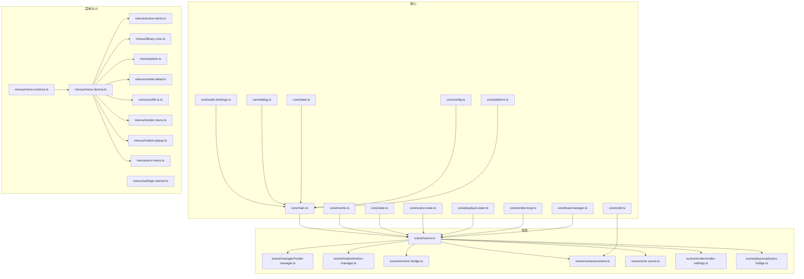
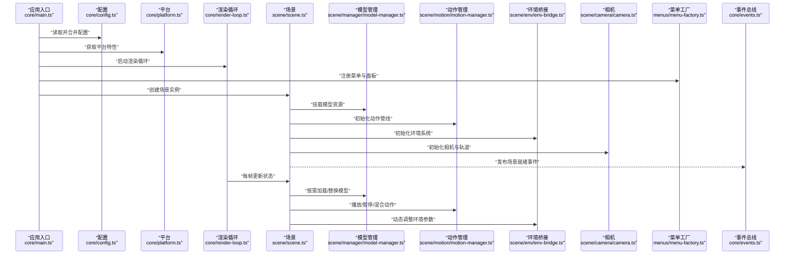
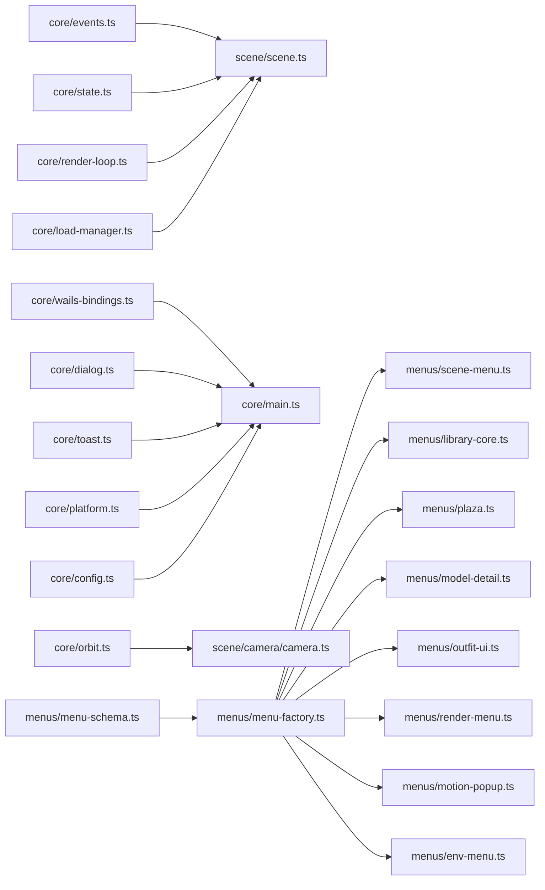

# 前端 API

<cite>
**本文引用的文件**   
- [frontend/src/core/main.ts](file://frontend/src/core/main.ts)
- [frontend/src/core/scene-state.ts](file://frontend/src/core/scene-state.ts)
- [frontend/src/core/playback-state.ts](file://frontend/src/core/playback-state.ts)
- [frontend/src/core/events.ts](file://frontend/src/core/events.ts)
- [frontend/src/core/state.ts](file://frontend/src/core/state.ts)
- [frontend/src/core/config.ts](file://frontend/src/core/config.ts)
- [frontend/src/core/wails-bindings.ts](file://frontend/src/core/wails-bindings.ts)
- [frontend/src/core/dialog.ts](file://frontend/src/core/dialog.ts)
- [frontend/src/core/toast.ts](file://frontend/src/core/toast.ts)
- [frontend/src/core/ui-types.ts](file://frontend/src/core/ui-types.ts)
- [frontend/src/core/ui-helpers.ts](file://frontend/src/core/ui-helpers.ts)
- [frontend/src/core/render-loop.ts](file://frontend/src/core/render-loop.ts)
- [frontend/src/core/load-manager.ts](file://frontend/src/core/load-manager.ts)
- [frontend/src/core/orbit.ts](file://frontend/src/core/orbit.ts)
- [frontend/src/core/platform.ts](file://frontend/src/core/platform.ts)
- [frontend/src/core/i18n/goerr.ts](file://frontend/src/core/i18n/goerr.ts)
- [frontend/src/scene/scene.ts](file://frontend/src/scene/scene.ts)
- [frontend/src/scene/manager/model-manager.ts](file://frontend/src/scene/manager/model-manager.ts)
- [frontend/src/scene/motion/motion-manager.ts](file://frontend/src/scene/motion/motion-manager.ts)
- [frontend/src/scene/env/env-bridge.ts](file://frontend/src/scene/env/env-bridge.ts)
- [frontend/src/scene/camera/camera.ts](file://frontend/src/scene/camera/camera.ts)
- [frontend/src/scene/ar/ar-scene.ts](file://frontend/src/scene/ar/ar-scene.ts)
- [frontend/src/scene/render/render-settings.ts](file://frontend/src/scene/render/render-settings.ts)
- [frontend/src/scene/physics/physics-bridge.ts](file://frontend/src/scene/physics/physics-bridge.ts)
- [frontend/src/menus/menu-schema.ts](file://frontend/src/menus/menu-schema.ts)
- [frontend/src/menus/menu-factory.ts](file://frontend/src/menus/menu-factory.ts)
- [frontend/src/menus/settings-shared.ts](file://frontend/src/menus/settings-shared.ts)
- [frontend/src/menus/scene-menu.ts](file://frontend/src/menus/scene-menu.ts)
- [frontend/src/menus/library-core.ts](file://frontend/src/menus/library-core.ts)
- [frontend/src/menus/plaza.ts](file://frontend/src/menus/plaza.ts)
- [frontend/src/menus/model-detail.ts](file://frontend/src/menus/model-detail.ts)
- [frontend/src/menus/outfit-ui.ts](file://frontend/src/menus/outfit-ui.ts)
- [frontend/src/menus/render-menu.ts](file://frontend/src/menus/render-menu.ts)
- [frontend/src/menus/motion-popup.ts](file://frontend/src/menus/motion-popup.ts)
- [frontend/src/menus/env-menu.ts](file://frontend/src/menus/env-menu.ts)
- [frontend/src/menus/scene-stage-levels.ts](file://frontend/src/menus/scene-stage-levels.ts)
- [frontend/src/menus/scene-physics-levels.ts](file://frontend/src/menus/scene-physics-levels.ts)
- [frontend/src/menus/scene-render-levels.ts](file://frontend/src/menus/scene-render-levels.ts)
- [frontend/src/menus/scene-prop-levels.ts](file://frontend/src/menus/scene-prop-levels.ts)
- [frontend/src/menus/motion-camera-levels.ts](file://frontend/src/menus/motion-camera-levels.ts)
- [frontend/src/menus/motion-cloth-levels.ts](file://frontend/src/menus/motion-cloth-levels.ts)
- [frontend/src/menus/motion-feet-levels.ts](file://frontend/src/menus/motion-feet-levels.ts)
- [frontend/src/menus/motion-gaze-levels.ts](file://frontend/src/menus/motion-gaze-levels.ts)
- [frontend/src/menus/motion-override-levels.ts](file://frontend/src/menus/motion-override-levels.ts)
- [frontend/src/menus/motion-procmotion-levels.ts](file://frontend/src/menus/motion-procmotion-levels.ts)
- [frontend/src/menus/motion-pose-levels.ts](file://frontend/src/menus/motion-pose-levels.ts)
- [frontend/src/menus/preset-list-viewer.ts](file://frontend/src/menus/preset-list-viewer.ts)
- [frontend/src/menus/resource-detail-helpers.ts](file://frontend/src/menus/resource-detail-helpers.ts)
- [frontend/src/menus/scene-stage-lights.ts](file://frontend/src/menus/scene-stage-lights.ts)
- [frontend/src/menus/settings-about.ts](file://frontend/src/menus/settings-about.ts)
- [frontend/src/menus/settings-appearance.ts](file://frontend/src/menus/settings-appearance.ts)
- [frontend/src/menus/settings-audio.ts](file://frontend/src/menus/settings-audio.ts)
- [frontend/src/menus/settings-language.ts](file://frontend/src/menus/settings-language.ts)
- [frontend/src/menus/settings-library.ts](file://frontend/src/menus/settings-library.ts)
- [frontend/src/menus/settings-paths.ts](file://frontend/src/menus/settings-paths.ts)
- [frontend/src/menus/settings-performance.ts](file://frontend/src/menus/settings-performance.ts)
- [frontend/src/menus/settings-rendering.ts](file://frontend/src/menus/settings-rendering.ts)
- [frontend/src/menus/settings-screenshot.ts](file://frontend/src/menus/settings-screenshot.ts)
- [frontend/src/menus/settings-shortcuts.ts](file://frontend/src/menus/settings-shortcuts.ts)
- [frontend/src/menus/settings-software.ts](file://frontend/src/menus/settings-software.ts)
- [frontend/src/menus/settings-targets.ts](file://frontend/src/menus/settings-targets.ts)
- [frontend/src/menus/library-browse.ts](file://frontend/src/menus/library-browse.ts)
- [frontend/src/menus/library-session-store.ts](file://frontend/src/menus/library-session-store.ts)
- [frontend/src/menus/library-setup.ts](file://frontend/src/menus/library-setup.ts)
- [frontend/src/menus/plaza-creators.ts](file://frontend/src/menus/plaza-creators.ts)
- [frontend/src/menus/plaza-sites.ts](file://frontend/src/menus/plaza-sites.ts)
- [frontend/src/menus/env-feature-levels.ts](file://frontend/src/menus/env-feature-levels.ts)
- [frontend/src/menus/env-preset-levels.ts](file://frontend/src/menus/env-preset-levels.ts)
- [frontend/src/menus/model-material.ts](file://frontend/src/menus/model-material.ts)
- [frontend/src/menus/model-preset.ts](file://frontend/src/menus/model-preset.ts)
- [frontend/src/menus/outfit-overlay.ts](file://frontend/src/menus/outfit-overlay.ts)
- [frontend/src/menus/outfit.ts](file://frontend/src/menus/outfit.ts)
- [frontend/src/menus/audio.ts](file://frontend/src/menus/audio.ts)
- [frontend/src/menus/perception-breathing.ts](file://frontend/src/menus/perception-breathing.ts)
- [frontend/src/menus/perception.ts](file://frontend/src/menus/perception.ts)
- [frontend/src/menus/procedural-motion.ts](file://frontend/src/menus/procedural-motion.ts)
- [frontend/src/menus/vmd-evaluator.ts](file://frontend/src/menus/vmd-evaluator.ts)
- [frontend/src/menus/vpd-parser.ts](file://frontend/src/menus/vpd-parser.ts)
- [frontend/src/menus/lipsync-bridge.ts](file://frontend/src/menus/lipsync-bridge.ts)
- [frontend/src/menus/footstep-detect.ts](file://frontend/src/menus/footstep-detect.ts)
- [frontend/src/menus/feet-adjustment-math.ts](file://frontend/src/menus/feet-adjustment-math.ts)
- [frontend/src/menus/proc-motion-autodance.ts](file://frontend/src/menus/proc-motion-autodance.ts)
- [frontend/src/menus/proc-motion-idle.ts](file://frontend/src/menus/proc-motion-idle.ts)
- [frontend/src/menus/proc-motion-shared.ts](file://frontend/src/menus/proc-motion-shared.ts)
- [frontend/src/menus/proc-motion-autodance-bones.ts](file://frontend/src/menus/proc-motion-autodance-bones.ts)
- [frontend/src/menus/proc-motion-autodance-bones-limbs.ts](file://frontend/src/menus/proc-motion-autodance-bones-limbs.ts)
- [frontend/src/menus/proc-motion-autodance-bones-trunk.ts](file://frontend/src/menus/proc-motion-autodance-bones-trunk.ts)
- [frontend/src/menus/proc-motion-autodance-emotion.ts](file://frontend/src/menus/proc-motion-autodance-emotion.ts)
- [frontend/src/menus/beat-detector.ts](file://frontend/src/menus/beat-detector.ts)
- [frontend/src/menus/ground-collision.ts](file://frontend/src/menus/ground-collision.ts)
- [frontend/src/menus/skirt-analyzer.ts](file://frontend/src/menus/skirt-analyzer.ts)
- [frontend/src/menus/virtual-skirt.ts](file://frontend/src/menus/virtual-skirt.ts)
- [frontend/src/menus/material-editor.ts](file://frontend/src/menus/material-editor.ts)
- [frontend/src/menus/model-preset.ts](file://frontend/src/menus/model-preset.ts)
- [frontend/src/menus/pose-preset.ts](file://frontend/src/menus/pose-preset.ts)
- [frontend/src/menus/performance-reflection.ts](file://frontend/src/menus/performance-reflection.ts)
- [frontend/src/menus/planar-reflection.ts](file://frontend/src/menus/planar-reflection.ts)
- [frontend/src/menus/water-preset-repro.ts](file://frontend/src/menus/water-preset-repro.ts)
- [frontend/src/menus/wind-physics.ts](file://frontend/src/menus/wind-physics.ts)
- [frontend/src/menus/bone-override.ts](file://frontend/src/menus/bone-override.ts)
- [frontend/src/menus/env-clouds.ts](file://frontend/src/menus/env-clouds.ts)
- [frontend/src/menus/env-impl.ts](file://frontend/src/menus/env-impl.ts)
- [frontend/src/menus/env-particles.ts](file://frontend/src/menus/env-particles.ts)
- [frontend/src/menus/env-terrain.ts](file://frontend/src/menus/env-terrain.ts)
- [frontend/src/menus/env-texture.ts](file://frontend/src/menus/env-texture.ts)
- [frontend/src/menus/env-water.ts](file://frontend/src/menus/env-water.ts)
- [frontend/src/menus/env-lighting.ts](file://frontend/src/menus/env-lighting.ts)
- [frontend/src/menus/environment-integration.ts](file://frontend/src/menus/environment-integration.ts)
- [frontend/src/menus/fullscreen-overlay.ts](file://frontend/src/menus/fullscreen-overlay.ts)
- [frontend/src/menus/dom.ts](file://frontend/src/menus/dom.ts)
- [frontend/src/menus/utils.ts](file://frontend/src/menus/utils.ts)
- [frontend/src/menus/color-helpers.ts](file://frontend/src/menus/color-helpers.ts)
- [frontend/src/menus/fileservice.ts](file://frontend/src/menus/fileservice.ts)
- [frontend/src/menus/freefly-state.ts](file://frontend/src/menus/freefly-state.ts)
- [frontend/src/menus/icons-bundle.ts](file://frontend/src/menus/icons-bundle.ts)
- [frontend/src/menus/icons.ts](file://frontend/src/menus/icons.ts)
- [frontend/src/menus/init.ts](file://frontend/src/menus/init.ts)
- [frontend/src/menus/library-state.ts](file://frontend/src/menus/library-state.ts)
- [frontend/src/menus/logger.ts](file://frontend/src/menus/logger.ts)
- [frontend/src/menus/main.ts](file://frontend/src/menus/main.ts)
- [frontend/src/menus/observer-handle.ts](file://frontend/src/menus/observer-handle.ts)
- [frontend/src/menus/runtime-mode.ts](file://frontend/src/menus/runtime-mode.ts)
- [frontend/src/menus/shortcut-app.ts](file://frontend/src/menus/shortcut-app.ts)
- [frontend/src/menus/shortcut-registry.ts](file://frontend/src/menus/shortcut-registry.ts)
- [frontend/src/menus/status-bar.ts](file://frontend/src/menus/status-bar.ts)
- [frontend/src/menus/toast.ts](file://frontend/src/menus/toast.ts)
- [frontend/src/menus/types.ts](file://frontend/src/menus/types.ts)
- [frontend/src/menus/ui-advanced-rows.ts](file://frontend/src/menus/ui-advanced-rows.ts)
- [frontend/src/menus/ui-collapsible.ts](file://frontend/src/menus/ui-collapsible.ts)
- [frontend/src/menus/ui-fullscreen-overlay.ts](file://frontend/src/menus/ui-fullscreen-overlay.ts)
- [frontend/src/menus/ui-preset.ts](file://frontend/src/menus/ui-preset.ts)
- [frontend/src/menus/ui-resource-panel.ts](file://frontend/src/menus/ui-resource-panel.ts)
- [frontend/src/menus/ui-rows.ts](file://frontend/src/menus/ui-rows.ts)
- [frontend/src/menus/ui-slide-row.ts](file://frontend/src/menus/ui-slide-row.ts)
- [frontend/src/menus/ui-slider-controller.ts](file://frontend/src/menus/ui-slider-controller.ts)
- [frontend/src/menus/ui-state.ts](file://frontend/src/menus/ui-state.ts)
- [frontend/src/menus/ui-virtual-grid.ts](file://frontend/src/menus/ui-virtual网格.ts)
- [frontend/src/menus/watch-import.ts](file://frontend/src/menus/watch-import.ts)
- [frontend/src/menus/wind-utils.ts](file://frontend/src/menus/wind-utils.ts)
</cite>

## 目录
1. [简介](#简介)
2. [项目结构](#项目结构)
3. [核心组件](#核心组件)
4. [架构总览](#架构总览)
5. [详细组件分析](#详细组件分析)
6. [依赖分析](#依赖分析)
7. [性能考虑](#性能考虑)
8. [故障排查指南](#故障排查指南)
9. [结论](#结论)
10. [附录](#附录)

## 简介
本文件为 MikuMikuAR 前端公共 API 参考，面向二次开发与集成场景。文档覆盖以下能力域：
- 场景管理：场景初始化、资源加载、生命周期与销毁
- 模型操作：模型加载、替换、属性修改、骨骼覆写
- 动画控制：VMD 播放、程序化动作、姿态预设、层与混合
- 环境设置：天空、地面、水体、粒子、光照、反射等
- 用户界面：菜单、面板、弹窗、状态栏、Toast、快捷键
- 事件系统与状态管理：全局事件总线、响应式状态、观察者模式
- 异步处理：Promise 用法、AbortSignal 取消、错误传播

说明：
- 所有接口均以 TypeScript 类型定义为准；若未显式导出类型，请通过源码路径定位实际定义。
- 示例以“代码片段路径”形式给出，避免直接粘贴实现细节。

## 项目结构
前端采用分层组织：
- core：运行时基础设施（渲染循环、配置、事件、状态、平台适配、Wails 绑定）
- scene：场景子系统（相机、环境、物理、渲染、运动、AR、序列化）
- menus：UI 菜单与交互（菜单注册、面板、设置项、库与广场）
- motion-algos：动作算法（VMD 评估、程序化动作、节拍检测、唇语等）
- outfit：换装系统（叠加、音频联动）
- physics：物理桥接（风场、碰撞）

图表来源
- [frontend/src/core/main.ts](file://frontend/src/core/main.ts)
- [frontend/src/core/events.ts](file://frontend/src/core/events.ts)
- [frontend/src/core/state.ts](file://frontend/src/core/state.ts)
- [frontend/src/core/scene-state.ts](file://frontend/src/core/scene-state.ts)
- [frontend/src/core/playback-state.ts](file://frontend/src/core/playback-state.ts)
- [frontend/src/core/render-loop.ts](file://frontend/src/core/render-loop.ts)
- [frontend/src/core/load-manager.ts](file://frontend/src/core/load-manager.ts)
- [frontend/src/core/wails-bindings.ts](file://frontend/src/core/wails-bindings.ts)
- [frontend/src/core/dialog.ts](file://frontend/src/core/dialog.ts)
- [frontend/src/core/toast.ts](file://frontend/src/core/toast.ts)
- [frontend/src/core/config.ts](file://frontend/src/core/config.ts)
- [frontend/src/core/platform.ts](file://frontend/src/core/platform.ts)
- [frontend/src/core/orbit.ts](file://frontend/src/core/orbit.ts)
- [frontend/src/scene/scene.ts](file://frontend/src/scene/scene.ts)
- [frontend/src/scene/manager/model-manager.ts](file://frontend/src/scene/manager/model-manager.ts)
- [frontend/src/scene/motion/motion-manager.ts](file://frontend/src/scene/motion/motion-manager.ts)
- [frontend/src/scene/env/env-bridge.ts](file://frontend/src/scene/env/env-bridge.ts)
- [frontend/src/scene/camera/camera.ts](file://frontend/src/scene/camera/camera.ts)
- [frontend/src/scene/ar/ar-scene.ts](file://frontend/src/scene/ar/ar-scene.ts)
- [frontend/src/scene/render/render-settings.ts](file://frontend/src/scene/render/render-settings.ts)
- [frontend/src/scene/physics/physics-bridge.ts](file://frontend/src/scene/physics/physics-bridge.ts)
- [frontend/src/menus/menu-schema.ts](file://frontend/src/menus/menu-schema.ts)
- [frontend/src/menus/menu-factory.ts](file://frontend/src/menus/menu-factory.ts)
- [frontend/src/menus/scene-menu.ts](file://frontend/src/menus/scene-menu.ts)
- [frontend/src/menus/library-core.ts](file://frontend/src/menus/library-core.ts)
- [frontend/src/menus/plaza.ts](file://frontend/src/menus/plaza.ts)
- [frontend/src/menus/model-detail.ts](file://frontend/src/menus/model-detail.ts)
- [frontend/src/menus/outfit-ui.ts](file://frontend/src/menus/outfit-ui.ts)
- [frontend/src/menus/render-menu.ts](file://frontend/src/menus/render-menu.ts)
- [frontend/src/menus/motion-popup.ts](file://frontend/src/menus/motion-popup.ts)
- [frontend/src/menus/env-menu.ts](file://frontend/src/menus/env-menu.ts)

章节来源
- [frontend/src/core/main.ts](file://frontend/src/core/main.ts)
- [frontend/src/scene/scene.ts](file://frontend/src/scene/scene.ts)
- [frontend/src/menus/menu-schema.ts](file://frontend/src/menus/menu-schema.ts)

## 核心组件
本节概述对外暴露的公共入口与关键子系统，便于快速上手。

- 应用启动与主循环
  - 入口：初始化配置、平台信息、渲染循环、事件总线、菜单注册
  - 渲染循环：帧更新、输入处理、状态同步
  - 参考路径：[frontend/src/core/main.ts](file://frontend/src/core/main.ts)、[frontend/src/core/render-loop.ts](file://frontend/src/core/render-loop.ts)

- 场景管理
  - 场景实例：创建、销毁、序列化/反序列化、资源挂载点
  - 场景状态：当前场景、模型集合、环境状态、相机状态
  - 参考路径：[frontend/src/scene/scene.ts](file://frontend/src/scene/scene.ts)、[frontend/src/core/scene-state.ts](file://frontend/src/core/scene-state.ts)

- 模型操作
  - 模型管理器：加载 PMX/VRM、替换材质、骨骼覆写、可见性/层级
  - 参考路径：[frontend/src/scene/manager/model-manager.ts](file://frontend/src/scene/manager/model-manager.ts)

- 动画控制
  - 动作管理器：VMD 播放、程序化动作、姿态预设、层混合、时间轴控制
  - 参考路径：[frontend/src/scene/motion/motion-manager.ts](file://frontend/src/scene/motion/motion-manager.ts)

- 环境设置
  - 环境桥接：天空、地面、水体、粒子、光照、反射、风场
  - 参考路径：[frontend/src/scene/env/env-bridge.ts](file://frontend/src/scene/env/env-bridge.ts)

- 相机与轨道控制
  - 相机控制器：视角切换、AR 相机、轨道控制
  - 参考路径：[frontend/src/scene/camera/camera.ts](file://frontend/src/scene/camera/camera.ts)、[frontend/src/core/orbit.ts](file://frontend/src/core/orbit.ts)

- UI 与菜单
  - 菜单框架：声明式菜单、工厂注册、面板与设置项
  - 参考路径：[frontend/src/menus/menu-schema.ts](file://frontend/src/menus/menu-schema.ts)、[frontend/src/menus/menu-factory.ts](file://frontend/src/menus/menu-factory.ts)

- 事件系统与状态管理
  - 事件总线：发布/订阅、命名空间、作用域清理
  - 状态管理：响应式状态、观察者句柄、持久化
  - 参考路径：[frontend/src/core/events.ts](file://frontend/src/core/events.ts)、[frontend/src/core/state.ts](file://frontend/src/core/state.ts)

- 异步与错误处理
  - 加载器：统一加载、进度回调、取消信号
  - Wails 绑定：跨进程调用、错误映射
  - 参考路径：[frontend/src/core/load-manager.ts](file://frontend/src/core/load-manager.ts)、[frontend/src/core/wails-bindings.ts](file://frontend/src/core/wails-bindings.ts)、[frontend/src/core/i18n/goerr.ts](file://frontend/src/core/i18n/goerr.ts)

章节来源
- [frontend/src/core/main.ts](file://frontend/src/core/main.ts)
- [frontend/src/core/render-loop.ts](file://frontend/src/core/render-loop.ts)
- [frontend/src/scene/scene.ts](file://frontend/src/scene/scene.ts)
- [frontend/src/core/scene-state.ts](file://frontend/src/core/scene-state.ts)
- [frontend/src/scene/manager/model-manager.ts](file://frontend/src/scene/manager/model-manager.ts)
- [frontend/src/scene/motion/motion-manager.ts](file://frontend/src/scene/motion/motion-manager.ts)
- [frontend/src/scene/env/env-bridge.ts](file://frontend/src/scene/env/env-bridge.ts)
- [frontend/src/scene/camera/camera.ts](file://frontend/src/scene/camera/camera.ts)
- [frontend/src/core/orbit.ts](file://frontend/src/core/orbit.ts)
- [frontend/src/menus/menu-schema.ts](file://frontend/src/menus/menu-schema.ts)
- [frontend/src/menus/menu-factory.ts](file://frontend/src/menus/menu-factory.ts)
- [frontend/src/core/events.ts](file://frontend/src/core/events.ts)
- [frontend/src/core/state.ts](file://frontend/src/core/state.ts)
- [frontend/src/core/load-manager.ts](file://frontend/src/core/load-manager.ts)
- [frontend/src/core/wails-bindings.ts](file://frontend/src/core/wails-bindings.ts)
- [frontend/src/core/i18n/goerr.ts](file://frontend/src/core/i18n/goerr.ts)

## 架构总览
下图展示从应用启动到场景渲染的关键流程，以及各模块间的职责边界。

图表来源
- [frontend/src/core/main.ts](file://frontend/src/core/main.ts)
- [frontend/src/core/config.ts](file://frontend/src/core/config.ts)
- [frontend/src/core/platform.ts](file://frontend/src/core/platform.ts)
- [frontend/src/core/render-loop.ts](file://frontend/src/core/render-loop.ts)
- [frontend/src/scene/scene.ts](file://frontend/src/scene/scene.ts)
- [frontend/src/scene/manager/model-manager.ts](file://frontend/src/scene/manager/model-manager.ts)
- [frontend/src/scene/motion/motion-manager.ts](file://frontend/src/scene/motion/motion-manager.ts)
- [frontend/src/scene/env/env-bridge.ts](file://frontend/src/scene/env/env-bridge.ts)
- [frontend/src/scene/camera/camera.ts](file://frontend/src/scene/camera/camera.ts)
- [frontend/src/menus/menu-factory.ts](file://frontend/src/menus/menu-factory.ts)
- [frontend/src/core/events.ts](file://frontend/src/core/events.ts)

## 详细组件分析

### 场景管理 API
- 职责
  - 提供场景生命周期方法：创建、初始化、销毁、序列化/反序列化
  - 维护场景级状态：模型集合、环境、相机、渲染设置
- 主要能力
  - 场景初始化：根据配置与环境预设构建场景图
  - 资源挂载：模型、纹理、动作、舞台、道具
  - 状态快照：保存/恢复场景状态（含环境、相机、动作层）
- 典型使用模式
  - 场景初始化：在应用启动后创建场景实例并挂载默认资源
  - 场景切换：销毁旧场景，重建新场景，恢复用户偏好
- 异步与错误
  - 资源加载失败时抛出可识别错误，建议结合 AbortSignal 取消长时间任务
  - 建议使用 try/catch 包裹场景初始化与资源加载
- 代码片段路径
  - [frontend/src/scene/scene.ts](file://frontend/src/scene/scene.ts)
  - [frontend/src/core/scene-state.ts](file://frontend/src/core/scene-state.ts)

章节来源
- [frontend/src/scene/scene.ts](file://frontend/src/scene/scene.ts)
- [frontend/src/core/scene-state.ts](file://frontend/src/core/scene-state.ts)

### 模型操作 API
- 职责
  - 统一管理模型加载、替换、属性修改、骨骼覆写、可见性与层级
- 主要能力
  - 加载模型：支持 PMX/VRM，返回模型句柄与元数据
  - 属性修改：位置/旋转/缩放、材质贴图、透明度、阴影
  - 骨骼覆写：按骨骼名或索引设置变换，支持 IK 感知
  - 批量操作：对选中模型集合进行统一变换
- 典型使用模式
  - 模型加载：选择本地文件或库资源，显示加载进度，完成后注入场景
  - 材质编辑：通过材质编辑器修改基础色、法线、粗糙度、金属度
  - 骨骼覆写：用于视线追踪、程序化动作、IK 修正
- 异步与错误
  - 大模型加载耗时，需配合进度回调与取消信号
  - 格式不匹配或缺少纹理时返回具体错误码，便于提示用户
- 代码片段路径
  - [frontend/src/scene/manager/model-manager.ts](file://frontend/src/scene/manager/model-manager.ts)
  - [frontend/src/menus/model-material.ts](file://frontend/src/menus/model-material.ts)
  - [frontend/src/menus/model-detail.ts](file://frontend/src/menus/model-detail.ts)

章节来源
- [frontend/src/scene/manager/model-manager.ts](file://frontend/src/scene/manager/model-manager.ts)
- [frontend/src/menus/model-material.ts](file://frontend/src/menus/model-material.ts)
- [frontend/src/menus/model-detail.ts](file://frontend/src/menus/model-detail.ts)

### 动画控制 API
- 职责
  - 管理 VMD 播放、程序化动作、姿态预设、动作层与混合
- 主要能力
  - 播放控制：开始、暂停、停止、跳转、循环、速度调节
  - 层与混合：多动作叠加、权重控制、优先级
  - 程序化动作：自动舞蹈、呼吸、脚步检测、节拍驱动
  - 姿态预设：一键切换姿势，支持保存/恢复
- 典型使用模式
  - 播放 VMD：选择动作文件，设置循环与速度，监听播放完成事件
  - 程序化动作：启用自动舞蹈，根据节拍调整肢体幅度
  - 姿态切换：在角色待机与表演之间平滑过渡
- 异步与错误
  - 动作解析失败时记录原因（编码、版本、骨骼缺失）
  - 长动作加载建议分片与缓存
- 代码片段路径
  - [frontend/src/scene/motion/motion-manager.ts](file://frontend/src/scene/motion/motion-manager.ts)
  - [frontend/src/menus/motion-popup.ts](file://frontend/src/menus/motion-popup.ts)
  - [frontend/src/menus/proc-motion-autodance.ts](file://frontend/src/menus/proc-motion-autodance.ts)
  - [frontend/src/menus/proc-motion-idle.ts](file://frontend/src/menus/proc-motion-idle.ts)
  - [frontend/src/menus/beat-detector.ts](file://frontend/src/menus/beat-detector.ts)

章节来源
- [frontend/src/scene/motion/motion-manager.ts](file://frontend/src/scene/motion/motion-manager.ts)
- [frontend/src/menus/motion-popup.ts](file://frontend/src/menus/motion-popup.ts)
- [frontend/src/menus/proc-motion-autodance.ts](file://frontend/src/menus/proc-motion-autodance.ts)
- [frontend/src/menus/proc-motion-idle.ts](file://frontend/src/menus/proc-motion-idle.ts)
- [frontend/src/menus/beat-detector.ts](file://frontend/src/menus/beat-detector.ts)

### 环境设置 API
- 职责
  - 统一管理天空、地面、水体、粒子、光照、反射、风场等环境要素
- 主要能力
  - 天空盒/渐变：切换预设、动态时间变化
  - 地面与地形：高度图、反射、无限平面
  - 水体：水面材质、反射探针、波纹
  - 粒子与云：体积云、天气粒子、风场影响
  - 光照：方向光、环境光、阴影质量
- 典型使用模式
  - 环境预设：一键切换白天/黄昏/夜晚
  - 动态调整：实时调节雾浓度、水面反射强度
  - 性能优化：关闭体积云与高保真反射以提升帧率
- 异步与错误
  - 大型纹理加载失败时回退到默认材质
  - 不支持的特性降级处理（如移动端禁用体积云）
- 代码片段路径
  - [frontend/src/scene/env/env-bridge.ts](file://frontend/src/scene/env/env-bridge.ts)
  - [frontend/src/menus/env-menu.ts](file://frontend/src/menus/env-menu.ts)
  - [frontend/src/menus/env-impl.ts](file://frontend/src/menus/env-impl.ts)
  - [frontend/src/menus/env-clouds.ts](file://frontend/src/menus/env-clouds.ts)
  - [frontend/src/menus/env-water.ts](file://frontend/src/menus/env-water.ts)
  - [frontend/src/menus/env-terrain.ts](file://frontend/src/menus/env-terrain.ts)
  - [frontend/src/menus/env-texture.ts](file://frontend/src/menus/env-texture.ts)
  - [frontend/src/menus/env-lighting.ts](file://frontend/src/menus/env-lighting.ts)

章节来源
- [frontend/src/scene/env/env-bridge.ts](file://frontend/src/scene/env/env-bridge.ts)
- [frontend/src/menus/env-menu.ts](file://frontend/src/menus/env-menu.ts)
- [frontend/src/menus/env-impl.ts](file://frontend/src/menus/env-impl.ts)
- [frontend/src/menus/env-clouds.ts](file://frontend/src/menus/env-clouds.ts)
- [frontend/src/menus/env-water.ts](file://frontend/src/menus/env-water.ts)
- [frontend/src/menus/env-terrain.ts](file://frontend/src/menus/env-terrain.ts)
- [frontend/src/menus/env-texture.ts](file://frontend/src/menus/env-texture.ts)
- [frontend/src/menus/env-lighting.ts](file://frontend/src/menus/env-lighting.ts)

### 用户界面 API
- 职责
  - 提供声明式菜单、面板、设置项、弹窗、状态栏、Toast 等 UI 能力
- 主要能力
  - 菜单注册：基于 schema 的菜单树与权限控制
  - 面板与设置：分组、校验、国际化、快捷方式
  - 弹窗与 Toast：文件选择、确认框、消息提示
  - 状态栏：运行模式、FPS、内存占用
- 典型使用模式
  - 自定义面板：注册新的设置页，绑定到场景或模型属性
  - 快捷方式：为常用操作注册键盘快捷键
  - 主题与语言：切换外观与文案
- 异步与错误
  - 菜单加载失败时回退到默认菜单
  - 用户输入校验失败时即时反馈
- 代码片段路径
  - [frontend/src/menus/menu-schema.ts](file://frontend/src/menus/menu-schema.ts)
  - [frontend/src/menus/menu-factory.ts](file://frontend/src/menus/menu-factory.ts)
  - [frontend/src/menus/scene-menu.ts](file://frontend/src/menus/scene-menu.ts)
  - [frontend/src/menus/settings-shared.ts](file://frontend/src/menus/settings-shared.ts)
  - [frontend/src/core/dialog.ts](file://frontend/src/core/dialog.ts)
  - [frontend/src/core/toast.ts](file://frontend/src/core/toast.ts)
  - [frontend/src/core/status-bar.ts](file://frontend/src/core/status-bar.ts)

章节来源
- [frontend/src/menus/menu-schema.ts](file://frontend/src/menus/menu-schema.ts)
- [frontend/src/menus/menu-factory.ts](file://frontend/src/menus/menu-factory.ts)
- [frontend/src/menus/scene-menu.ts](file://frontend/src/menus/scene-menu.ts)
- [frontend/src/menus/settings-shared.ts](file://frontend/src/menus/settings-shared.ts)
- [frontend/src/core/dialog.ts](file://frontend/src/core/dialog.ts)
- [frontend/src/core/toast.ts](file://frontend/src/core/toast.ts)
- [frontend/src/core/status-bar.ts](file://frontend/src/core/status-bar.ts)

### 事件系统与状态管理
- 职责
  - 提供全局事件总线与响应式状态，解耦模块间通信
- 主要能力
  - 事件发布/订阅：命名空间、作用域、一次性监听
  - 状态响应：值变更自动触发回调，支持深度监听
  - 观察者句柄：统一释放，防止内存泄漏
- 典型使用模式
  - 场景事件：场景就绪、模型加载完成、动作播放结束
  - 状态同步：UI 与场景状态双向绑定
- 异步与错误
  - 事件处理器异常不影响其他监听者
  - 状态更新失败时保留旧值并记录日志
- 代码片段路径
  - [frontend/src/core/events.ts](file://frontend/src/core/events.ts)
  - [frontend/src/core/state.ts](file://frontend/src/core/state.ts)
  - [frontend/src/core/observer-handle.ts](file://frontend/src/core/observer-handle.ts)

章节来源
- [frontend/src/core/events.ts](file://frontend/src/core/events.ts)
- [frontend/src/core/state.ts](file://frontend/src/core/state.ts)
- [frontend/src/core/observer-handle.ts](file://frontend/src/core/observer-handle.ts)

### 相机与 AR 模式
- 职责
  - 提供多种相机模式与 AR 场景支持
- 主要能力
  - 轨道相机：鼠标/触摸控制视角
  - 自由飞行：第一人称移动与旋转
  - AR 相机：设备摄像头接入、透视校正
- 典型使用模式
  - 切换相机：在轨道与自由飞行间切换
  - AR 模式：进入 AR 场景，调整相机内参
- 代码片段路径
  - [frontend/src/scene/camera/camera.ts](file://frontend/src/scene/camera/camera.ts)
  - [frontend/src/core/orbit.ts](file://frontend/src/core/orbit.ts)
  - [frontend/src/scene/ar/ar-scene.ts](file://frontend/src/scene/ar/ar-scene.ts)

章节来源
- [frontend/src/scene/camera/camera.ts](file://frontend/src/scene/camera/camera.ts)
- [frontend/src/core/orbit.ts](file://frontend/src/core/orbit.ts)
- [frontend/src/scene/ar/ar-scene.ts](file://frontend/src/scene/ar/ar-scene.ts)

### 渲染与物理
- 职责
  - 管理渲染设置与物理桥接
- 主要能力
  - 渲染设置：抗锯齿、阴影、后处理、反射质量
  - 物理桥接：风场、布料、碰撞、IK 辅助
- 典型使用模式
  - 性能调优：降低阴影分辨率、关闭体积云
  - 物理增强：开启风场与布料模拟
- 代码片段路径
  - [frontend/src/scene/render/render-settings.ts](file://frontend/src/scene/render/render-settings.ts)
  - [frontend/src/scene/physics/physics-bridge.ts](file://frontend/src/scene/physics/physics-bridge.ts)

章节来源
- [frontend/src/scene/render/render-settings.ts](file://frontend/src/scene/render/render-settings.ts)
- [frontend/src/scene/physics/physics-bridge.ts](file://frontend/src/scene/physics/physics-bridge.ts)

## 依赖分析
- 耦合关系
  - 场景强依赖模型、动作、环境、相机子系统
  - 菜单与 UI 通过事件与状态间接访问场景
  - 核心模块（事件、状态、渲染循环）被广泛复用
- 外部依赖
  - Wails 绑定：跨进程调用与错误映射
  - 平台特性：WebGL、AR、文件系统访问
- 潜在风险
  - 循环依赖：通过事件与状态解耦，避免直接引用
  - 资源泄漏：确保观察者句柄与场景销毁时释放

图表来源
- [frontend/src/core/events.ts](file://frontend/src/core/events.ts)
- [frontend/src/core/state.ts](file://frontend/src/core/state.ts)
- [frontend/src/core/render-loop.ts](file://frontend/src/core/render-loop.ts)
- [frontend/src/core/load-manager.ts](file://frontend/src/core/load-manager.ts)
- [frontend/src/core/wails-bindings.ts](file://frontend/src/core/wails-bindings.ts)
- [frontend/src/core/dialog.ts](file://frontend/src/core/dialog.ts)
- [frontend/src/core/toast.ts](file://frontend/src/core/toast.ts)
- [frontend/src/core/platform.ts](file://frontend/src/core/platform.ts)
- [frontend/src/core/config.ts](file://frontend/src/core/config.ts)
- [frontend/src/core/orbit.ts](file://frontend/src/core/orbit.ts)
- [frontend/src/scene/camera/camera.ts](file://frontend/src/scene/camera/camera.ts)
- [frontend/src/scene/scene.ts](file://frontend/src/scene/scene.ts)
- [frontend/src/menus/menu-schema.ts](file://frontend/src/menus/menu-schema.ts)
- [frontend/src/menus/menu-factory.ts](file://frontend/src/menus/menu-factory.ts)
- [frontend/src/menus/scene-menu.ts](file://frontend/src/menus/scene-menu.ts)
- [frontend/src/menus/library-core.ts](file://frontend/src/menus/library-core.ts)
- [frontend/src/menus/plaza.ts](file://frontend/src/menus/plaza.ts)
- [frontend/src/menus/model-detail.ts](file://frontend/src/menus/model-detail.ts)
- [frontend/src/menus/outfit-ui.ts](file://frontend/src/menus/outfit-ui.ts)
- [frontend/src/menus/render-menu.ts](file://frontend/src/menus/render-menu.ts)
- [frontend/src/menus/motion-popup.ts](file://frontend/src/menus/motion-popup.ts)
- [frontend/src/menus/env-menu.ts](file://frontend/src/menus/env-menu.ts)

章节来源
- [frontend/src/core/main.ts](file://frontend/src/core/main.ts)
- [frontend/src/scene/scene.ts](file://frontend/src/scene/scene.ts)
- [frontend/src/menus/menu-schema.ts](file://frontend/src/menus/menu-schema.ts)

## 性能考虑
- 资源加载
  - 使用加载管理器进行并发控制与进度反馈
  - 对大纹理与模型启用压缩与流式加载
- 渲染优化
  - 合理设置阴影分辨率与采样数
  - 关闭不必要的后处理与反射探针
- 动作与物理
  - 减少同时播放的动作数量与层数
  - 在低端设备上禁用体积云与高精度风场
- 内存管理
  - 及时释放不再使用的模型与纹理
  - 确保观察者句柄在销毁时释放

## 故障排查指南
- 常见问题
  - 模型加载失败：检查文件格式、纹理路径、权限
  - 动作无反应：确认骨骼名称一致、动作版本兼容
  - 环境不生效：检查平台特性与降级策略
  - 菜单不显示：确认菜单注册顺序与权限
- 调试建议
  - 使用状态栏查看 FPS 与内存
  - 打开开发者工具查看控制台错误
  - 使用事件总线监听关键节点输出
- 错误处理
  - 统一错误映射：将后端错误转换为前端友好提示
  - 捕获异步异常：避免崩溃，提供重试机制

章节来源
- [frontend/src/core/i18n/goerr.ts](file://frontend/src/core/i18n/goerr.ts)
- [frontend/src/core/wails-bindings.ts](file://frontend/src/core/wails-bindings.ts)
- [frontend/src/core/status-bar.ts](file://frontend/src/core/status-bar.ts)

## 结论
本 API 参考覆盖了场景、模型、动画、环境、UI、事件与状态管理等核心能力。通过声明式菜单与事件/状态解耦，系统具备良好的扩展性与可维护性。建议在集成时遵循异步最佳实践与错误处理规范，并结合性能调优策略以获得稳定体验。

## 附录
- 常见使用模式示例（以路径代替代码）
  - 场景初始化：[frontend/src/scene/scene.ts](file://frontend/src/scene/scene.ts)
  - 模型加载与替换：[frontend/src/scene/manager/model-manager.ts](file://frontend/src/scene/manager/model-manager.ts)
  - 播放 VMD 动作：[frontend/src/scene/motion/motion-manager.ts](file://frontend/src/scene/motion/motion-manager.ts)
  - 环境预设切换：[frontend/src/menus/env-menu.ts](file://frontend/src/menus/env-menu.ts)
  - 注册自定义菜单：[frontend/src/menus/menu-schema.ts](file://frontend/src/menus/menu-schema.ts)
  - 发布/订阅事件：[frontend/src/core/events.ts](file://frontend/src/core/events.ts)
  - 响应式状态更新：[frontend/src/core/state.ts](file://frontend/src/core/state.ts)
  - 异步加载与取消：[frontend/src/core/load-manager.ts](file://frontend/src/core/load-manager.ts)
  - 跨进程调用与错误映射：[frontend/src/core/wails-bindings.ts](file://frontend/src/core/wails-bindings.ts)