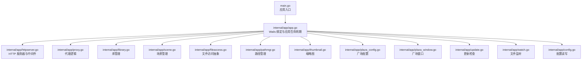
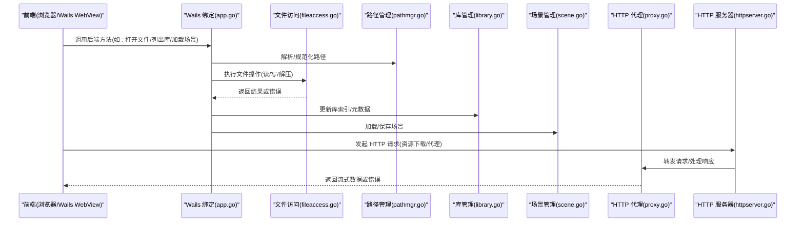
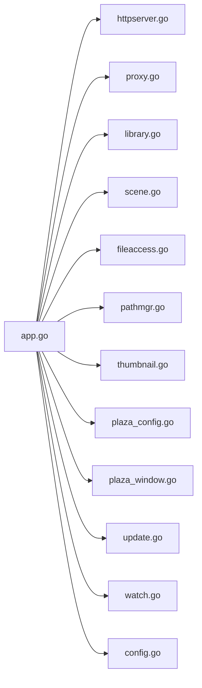

# 后端 API

<cite>
**本文引用的文件**   
- [main.go](file://main.go)
- [app.go](file://internal/app/app.go)
- [httpserver.go](file://internal/app/httpserver.go)
- [proxy.go](file://internal/app/proxy.go)
- [library.go](file://internal/app/library.go)
- [scene.go](file://internal/app/scene.go)
- [fileaccess.go](file://internal/app/fileaccess.go)
- [pathmgr.go](file://internal/app/pathmgr.go)
- [thumbnail.go](file://internal/app/thumbnail.go)
- [plaza_config.go](file://internal/app/plaza_config.go)
- [plaza_window.go](file://internal/app/plaza_window.go)
- [update.go](file://internal/app/update.go)
- [watch.go](file://internal/app/watch.go)
- [config.go](file://internal/app/config.go)
- [errors.go](file://internal/i18nerr/errors.go)
- [errors.go](file://internal/util/errors.go)
</cite>

## 目录
1. [简介](#简介)
2. [项目结构](#项目结构)
3. [核心组件](#核心组件)
4. [架构总览](#架构总览)
5. [详细组件分析](#详细组件分析)
6. [依赖关系分析](#依赖关系分析)
7. [性能与并发](#性能与并发)
8. [故障排查指南](#故障排查指南)
9. [结论](#结论)
10. [附录：API 参考](#附录api-参考)

## 简介
本文件为 Go 后端服务的 API 参考文档，聚焦于通过 Wails v3 暴露给前端的公共接口。该服务主要提供以下能力：
- 文件系统访问（跨平台路径管理、文件读写、ZIP 解压等）
- HTTP 代理服务（用于资源下载与中转）
- 库管理（模型、材质、动作等资源的管理与元数据）
- 场景管理（场景加载、保存、预设）
- 缩略图生成与预览
- 广场配置与窗口控制
- 应用更新检查与下载
- 文件监听与热重载支持
- 全局配置读写

说明：
- 本项目采用 Wails v3 将 Go 方法绑定到前端 TypeScript 类型系统，前端通过生成的绑定调用后端方法。因此“HTTP API”并非传统 REST 风格，而是以函数调用的形式对外暴露。
- 认证与权限：当前仓库未实现基于令牌或会话的鉴权机制；安全边界主要通过沙箱运行环境与路径白名单控制。
- 错误处理：统一使用 i18nerr 与 util/errors 返回结构化错误，便于前端国际化提示与重试策略。

## 项目结构
后端代码位于 internal/app 目录，按功能域拆分多个文件；入口在 main.go，负责初始化 Wails 应用并注册绑定。

图表来源
- [main.go:1-200](file://main.go#L1-L200)
- [app.go:1-200](file://internal/app/app.go#L1-L200)

章节来源
- [main.go:1-200](file://main.go#L1-L200)
- [app.go:1-200](file://internal/app/app.go#L1-L200)

## 核心组件
- 应用与绑定层
  - 负责 Wails 应用初始化、路由/中间件注册、事件总线与生命周期钩子。
  - 关键职责：启动 HTTP 服务器、注册代理、连接库与场景管理器、初始化配置与路径。
- 文件系统与路径管理
  - 抽象跨平台文件访问，封装 ZIP 解压、目录遍历、文件校验等。
  - 路径管理提供规范化、相对路径解析、平台差异适配。
- 库管理与场景管理
  - 库管理：资源索引、元数据读取、缩略图生成、缓存策略。
  - 场景管理：场景序列化/反序列化、状态快照、预设加载与保存。
- HTTP 代理
  - 提供统一的下载代理，支持断点续传、超时控制、CORS 与安全头设置。
- 其他辅助模块
  - 缩略图、广场配置/窗口、更新检查、文件监听、配置读写等。

章节来源
- [app.go:1-200](file://internal/app/app.go#L1-L200)
- [httpserver.go:1-200](file://internal/app/httpserver.go#L1-L200)
- [proxy.go:1-200](file://internal/app/proxy.go#L1-L200)
- [library.go:1-200](file://internal/app/library.go#L1-L200)
- [scene.go:1-200](file://internal/app/scene.go#L1-L200)
- [fileaccess.go:1-200](file://internal/app/fileaccess.go#L1-L200)
- [pathmgr.go:1-200](file://internal/app/pathmgr.go#L1-L200)
- [thumbnail.go:1-200](file://internal/app/thumbnail.go#L1-L200)
- [plaza_config.go:1-200](file://internal/app/plaza_config.go#L1-L200)
- [plaza_window.go:1-200](file://internal/app/plaza_window.go#L1-L200)
- [update.go:1-200](file://internal/app/update.go#L1-L200)
- [watch.go:1-200](file://internal/app/watch.go#L1-L200)
- [config.go:1-200](file://internal/app/config.go#L1-L200)

## 架构总览
下图展示从前端到后端的调用链路，包括绑定层、HTTP 代理、库与场景管理等核心模块。

图表来源
- [app.go:1-200](file://internal/app/app.go#L1-L200)
- [httpserver.go:1-200](file://internal/app/httpserver.go#L1-L200)
- [proxy.go:1-200](file://internal/app/proxy.go#L1-L200)
- [library.go:1-200](file://internal/app/library.go#L1-L200)
- [scene.go:1-200](file://internal/app/scene.go#L1-L200)
- [fileaccess.go:1-200](file://internal/app/fileaccess.go#L1-L200)
- [pathmgr.go:1-200](file://internal/app/pathmgr.go#L1-L200)

## 详细组件分析

### 应用与绑定层 (app.go)
- 职责
  - 初始化 Wails 应用、注册所有后端方法供前端调用。
  - 启动内部 HTTP 服务器、注册中间件（CORS、安全头等）。
  - 注入依赖：路径管理、文件访问、库、场景、缩略图等。
- 关键流程
  - 应用启动：加载配置、初始化日志、创建路径与文件访问实例、启动监听器。
  - 绑定注册：将库、场景、文件、代理等方法注册到 Wails 运行时。
- 并发与错误
  - 使用协程进行异步任务（如缩略图生成、文件监听），注意共享状态加锁。
  - 错误统一包装为 i18nerr，便于前端显示友好消息。

章节来源
- [app.go:1-200](file://internal/app/app.go#L1-L200)

### HTTP 服务器与中间件 (httpserver.go)
- 职责
  - 启动本地 HTTP 服务，提供静态资源与代理端点。
  - 中间件：CORS、请求日志、安全头、限流（可选）。
- 典型端点
  - 代理端点：/proxy/* 转发至目标 URL，支持 Range 头与分块传输。
  - 静态资源：/assets/* 提供内置纹理与字体。
- 安全
  - 限制可代理的目标域名白名单，防止 SSRF。
  - 设置响应头：Cache-Control、X-Content-Type-Options、Referrer-Policy 等。

章节来源
- [httpserver.go:1-200](file://internal/app/httpserver.go#L1-L200)

### HTTP 代理 (proxy.go)
- 职责
  - 作为下载代理，统一处理外部资源获取，屏蔽跨域与网络异常。
- 关键特性
  - 支持断点续传（Range）、超时与重试、Gzip 压缩透传。
  - 对大文件采用流式处理，避免内存峰值过高。
- 错误处理
  - 网络错误、超时、目标不可达时返回标准错误码与消息。

章节来源
- [proxy.go:1-200](file://internal/app/proxy.go#L1-L200)

### 库管理 (library.go)
- 职责
  - 维护资源库索引（模型、材质、动作、场景等），提供浏览、搜索、过滤。
  - 管理缩略图缓存、元数据解析、版本兼容。
- 关键操作
  - 扫描目录、构建索引、增量更新、清理无效条目。
  - 导出/导入库清单，支持标签与分类。
- 并发
  - 扫描与索引构建使用并发 goroutine，配合通道聚合结果。
  - 索引写入采用写时复制与原子替换，保证读多写少场景的性能。

章节来源
- [library.go:1-200](file://internal/app/library.go#L1-L200)

### 场景管理 (scene.go)
- 职责
  - 场景的加载、保存、序列化与反序列化。
  - 场景预设管理：默认场景、用户自定义预设。
- 关键操作
  - 打开场景文件、合并变更、回滚历史、自动备份。
  - 导出为通用格式（JSON/Binary），兼容不同版本。
- 错误处理
  - 文件损坏、版本不兼容、字段缺失等错误均返回明确信息。

章节来源
- [scene.go:1-200](file://internal/app/scene.go#L1-L200)

### 文件系统访问 (fileaccess.go)
- 职责
  - 抽象跨平台文件操作：读/写/删/移动/复制、目录遍历、ZIP 解压。
  - 提供安全校验：路径白名单、扩展名过滤、大小限制。
- 关键特性
  - 支持临时目录隔离、权限检查、软链接解析。
  - 批量操作事务化，失败回滚。
- 并发
  - 文件 IO 使用缓冲与池化，减少系统调用开销。

章节来源
- [fileaccess.go:1-200](file://internal/app/fileaccess.go#L1-L200)

### 路径管理 (pathmgr.go)
- 职责
  - 路径规范化、相对路径解析、平台差异适配（Windows/Android/Desktop）。
  - 提供虚拟根目录映射，便于沙箱与跨进程共享。
- 关键操作
  - Join、Abs、Rel、Normalize、Validate。
  - 动态挂载点管理（库目录、缓存目录、工作区）。

章节来源
- [pathmgr.go:1-200](file://internal/app/pathmgr.go#L1-L200)

### 缩略图 (thumbnail.go)
- 职责
  - 为模型/材质/场景生成缩略图，支持缓存与懒加载。
- 关键特性
  - 异步生成、队列调度、去重与过期策略。
  - 输出多种尺寸，适配 UI 列表与详情面板。

章节来源
- [thumbnail.go:1-200](file://internal/app/thumbnail.go#L1-L200)

### 广场配置与窗口 (plaza_config.go, plaza_window.go)
- 职责
  - 管理广场站点配置、窗口行为（打开/关闭/置顶/最小化）。
- 关键操作
  - 加载站点列表、验证连通性、切换默认站点。
  - 控制窗口生命周期与事件回调。

章节来源
- [plaza_config.go:1-200](file://internal/app/plaza_config.go#L1-L200)
- [plaza_window.go:1-200](file://internal/app/plaza_window.go#L1-L200)

### 更新检查 (update.go)
- 职责
  - 检查新版本、下载补丁、安装引导。
- 关键特性
  - 签名校验、增量更新、回滚机制。
  - 进度回调与中断支持。

章节来源
- [update.go:1-200](file://internal/app/update.go#L1-L200)

### 文件监听 (watch.go)
- 职责
  - 监听库目录变化，触发增量索引更新。
- 关键特性
  - 防抖与批处理、忽略临时文件、跨平台事件源。

章节来源
- [watch.go:1-200](file://internal/app/watch.go#L1-L200)

### 配置读写 (config.go)
- 职责
  - 应用配置持久化、迁移与校验。
- 关键特性
  - 热重载、默认值合并、敏感字段加密存储。

章节来源
- [config.go:1-200](file://internal/app/config.go#L1-L200)

## 依赖关系分析
- 耦合关系
  - app.go 作为中心协调者，依赖各子系统并提供统一绑定。
  - library.go 与 thumbnail.go 存在间接依赖（缩略图生成需访问文件）。
  - proxy.go 与 httpserver.go 紧密耦合，共同提供网络能力。
- 外部依赖
  - Wails v3 运行时、标准库 net/http、archive/zip、os/io 等。
- 潜在循环依赖
  - 通过依赖注入与接口抽象避免循环；若新增模块，建议遵循单向依赖原则。

图表来源
- [app.go:1-200](file://internal/app/app.go#L1-L200)
- [httpserver.go:1-200](file://internal/app/httpserver.go#L1-L200)
- [proxy.go:1-200](file://internal/app/proxy.go#L1-L200)
- [library.go:1-200](file://internal/app/library.go#L1-L200)
- [scene.go:1-200](file://internal/app/scene.go#L1-L200)
- [fileaccess.go:1-200](file://internal/app/fileaccess.go#L1-L200)
- [pathmgr.go:1-200](file://internal/app/pathmgr.go#L1-L200)
- [thumbnail.go:1-200](file://internal/app/thumbnail.go#L1-L200)
- [plaza_config.go:1-200](file://internal/app/plaza_config.go#L1-L200)
- [plaza_window.go:1-200](file://internal/app/plaza_window.go#L1-L200)
- [update.go:1-200](file://internal/app/update.go#L1-L200)
- [watch.go:1-200](file://internal/app/watch.go#L1-L200)
- [config.go:1-200](file://internal/app/config.go#L1-L200)

## 性能与并发
- 并发模型
  - 使用 goroutine 并行处理 IO 密集任务（缩略图、索引构建、文件监听）。
  - 使用 channel 与 worker pool 控制并发度，避免资源耗尽。
- 缓存策略
  - 缩略图与库索引采用磁盘+内存两级缓存，LRU 淘汰。
  - 代理层启用 HTTP 缓存头与条件请求（If-None-Match）。
- 优化建议
  - 批量 IO 合并，减少系统调用次数。
  - 大文件流式处理，避免一次性加载到内存。
  - 定期清理临时文件与过期缓存。

[本节为通用指导，无需源码引用]

## 故障排查指南
- 常见错误类别
  - 文件访问错误：路径不存在、权限不足、磁盘空间不足。
  - 网络错误：代理超时、目标不可达、证书校验失败。
  - 库/场景错误：文件格式损坏、版本不兼容、字段缺失。
- 错误码与消息
  - 统一使用 i18nerr 返回结构化错误，包含 code、message、details。
  - util/errors 提供通用包装与堆栈追踪。
- 调试建议
  - 开启详细日志，记录关键步骤与参数。
  - 使用 watch 模块观察文件变化，定位同步问题。
  - 对代理请求添加请求 ID，便于链路追踪。

章节来源
- [errors.go:1-200](file://internal/i18nerr/errors.go#L1-L200)
- [errors.go:1-200](file://internal/util/errors.go#L1-L200)

## 结论
本后端服务通过 Wails v3 将 Go 能力暴露给前端，形成稳定的跨平台桌面应用。其设计强调模块化与可扩展性，结合并发与缓存策略保障性能。未来可在鉴权、审计与更细粒度的权限控制方面进一步增强。

[本节为总结，无需源码引用]

## 附录：API 参考
以下为通过 Wails 绑定暴露的主要方法族与其语义说明。由于是函数调用而非 REST 端点，此处以“方法族 + 语义”的方式描述，便于前端集成。

- 文件系统访问
  - 方法族：FileAccess
    - 语义：读取/写入/删除/移动/复制文件；遍历目录；ZIP 解压；路径校验。
    - 输入：目标路径、内容字节、选项（是否覆盖、是否递归）。
    - 输出：操作结果、错误信息。
    - 状态码：成功/失败（由 i18nerr 编码）。
    - 示例：参见 [fileaccess.go:1-200](file://internal/app/fileaccess.go#L1-L200)
- 路径管理
  - 方法族：PathManager
    - 语义：路径规范化、相对路径解析、平台适配、虚拟根映射。
    - 输入：原始路径、基准目录。
    - 输出：标准化路径、布尔标志。
    - 示例：参见 [pathmgr.go:1-200](file://internal/app/pathmgr.go#L1-L200)
- 库管理
  - 方法族：Library
    - 语义：扫描目录、构建索引、搜索过滤、导出清单、更新缓存。
    - 输入：根目录、过滤器、分页参数。
    - 输出：资源列表、元数据、统计信息。
    - 示例：参见 [library.go:1-200](file://internal/app/library.go#L1-L200)
- 场景管理
  - 方法族：Scene
    - 语义：加载/保存场景、序列化为 JSON/Binary、应用预设、回滚历史。
    - 输入：场景文件路径、场景对象、预设名称。
    - 输出：场景状态、错误信息。
    - 示例：参见 [scene.go:1-200](file://internal/app/scene.go#L1-L200)
- HTTP 代理
  - 方法族：Proxy
    - 语义：转发请求、处理 Range、流式响应、错误包装。
    - 输入：目标 URL、请求头、超时时间。
    - 输出：响应体流、状态码、错误信息。
    - 示例：参见 [proxy.go:1-200](file://internal/app/proxy.go#L1-L200)
- 缩略图
  - 方法族：Thumbnail
    - 语义：生成缩略图、缓存命中、异步队列。
    - 输入：资源路径、尺寸、格式。
    - 输出：缩略图路径或字节、错误信息。
    - 示例：参见 [thumbnail.go:1-200](file://internal/app/thumbnail.go#L1-L200)
- 广场配置与窗口
  - 方法族：PlazaConfig / PlazaWindow
    - 语义：加载站点配置、控制窗口生命周期。
    - 输入：站点标识、窗口命令。
    - 输出：配置对象、窗口状态。
    - 示例：参见 [plaza_config.go:1-200](file://internal/app/plaza_config.go#L1-L200)、[plaza_window.go:1-200](file://internal/app/plaza_window.go#L1-L200)
- 更新检查
  - 方法族：Update
    - 语义：检查版本、下载补丁、安装引导。
    - 输入：当前版本、渠道标识。
    - 输出：可用版本、下载进度、错误信息。
    - 示例：参见 [update.go:1-200](file://internal/app/update.go#L1-L200)
- 文件监听
  - 方法族：Watch
    - 语义：监听目录变化、触发回调、防抖批处理。
    - 输入：监听路径、事件类型。
    - 输出：事件流、错误信息。
    - 示例：参见 [watch.go:1-200](file://internal/app/watch.go#L1-L200)
- 配置读写
  - 方法族：Config
    - 语义：读取/写入配置、迁移、热重载。
    - 输入：键值对、迁移脚本。
    - 输出：配置对象、错误信息。
    - 示例：参见 [config.go:1-200](file://internal/app/config.go#L1-L200)

认证与权限
- 当前未实现基于令牌或会话的鉴权；安全边界通过路径白名单与沙箱运行环境控制。
- 建议在后续版本引入角色与资源级权限控制，并在绑定层增加鉴权中间件。

错误处理
- 统一使用 i18nerr 返回结构化错误，包含 code、message、details。
- util/errors 提供通用包装与堆栈追踪，便于调试与上报。

并发安全
- 共享状态（索引、缓存）使用互斥锁保护。
- 异步任务通过 worker pool 控制并发度，避免资源竞争。

性能优化
- 流式 IO、批量操作、缓存命中、条件请求、压缩传输。

[本节为参考汇总，具体实现细节请参见对应文件]