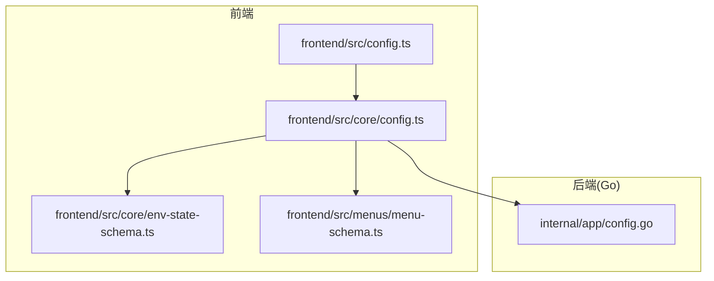
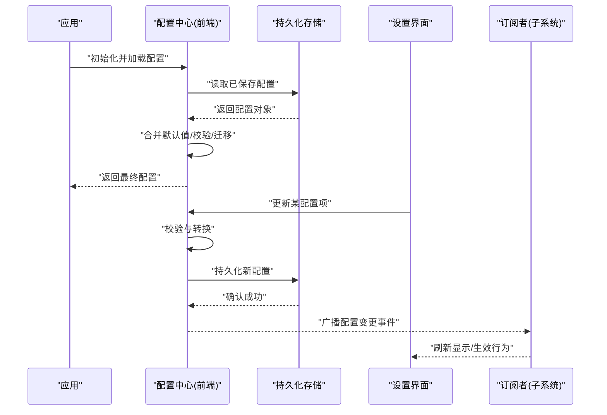
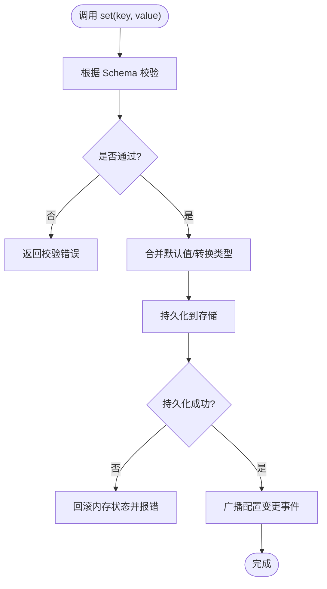
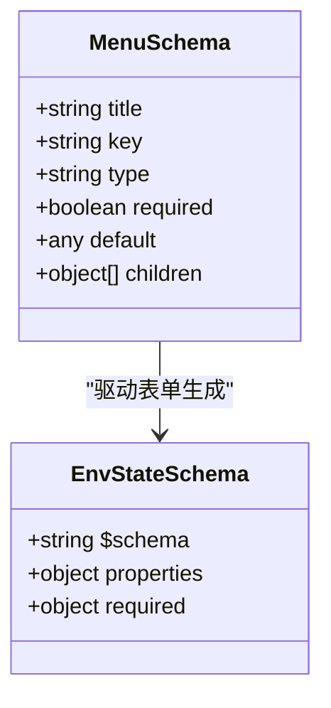
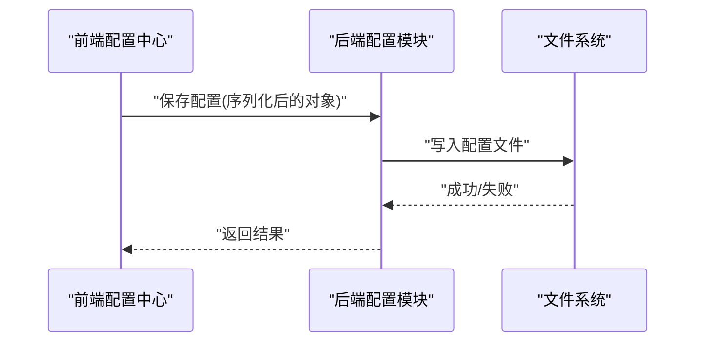
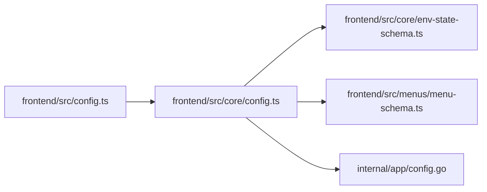

# 配置 API

<cite>
**本文引用的文件**   
- [config.ts](file://frontend/src/config.ts)
- [core/config.ts](file://frontend/src/core/config.ts)
- [core/env-state-schema.ts](file://frontend/src/core/env-state-schema.ts)
- [menus/menu-schema.ts](file://frontend/src/menus/menu-schema.ts)
- [internal/app/config.go](file://internal/app/config.go)
- [ADR-002-writeconfig-split.md](file://docs/adr/adr-002-writeconfig-split.md)
- [ADR-047-config-persistence-coverage.md](file://docs/adr/adr-047-config-persistence-coverage.md)
</cite>

## 目录
1. [简介](#简介)
2. [项目结构](#项目结构)
3. [核心组件](#核心组件)
4. [架构总览](#架构总览)
5. [详细组件分析](#详细组件分析)
6. [依赖关系分析](#依赖关系分析)
7. [性能考量](#性能考量)
8. [故障排查指南](#故障排查指南)
9. [结论](#结论)
10. [附录](#附录)

## 简介
本文件为应用“配置系统”的 API 参考文档，覆盖前端与后端（Go）的配置定义、默认值、校验、持久化、热重载、迁移与版本兼容等。目标读者包括开发者、集成者与高级用户，旨在提供从概念到实现细节的完整说明。

## 项目结构
配置相关代码主要分布在以下位置：
- 前端运行时配置入口与工具：frontend/src/config.ts、frontend/src/core/config.ts
- 环境状态 Schema 与菜单声明式 Schema：frontend/src/core/env-state-schema.ts、frontend/src/menus/menu-schema.ts
- Go 后端配置加载与存储：internal/app/config.go
- 架构决策记录（ADR）关于写配置拆分与持久化覆盖范围：docs/adr/adr-002-writeconfig-split.md、docs/adr/adr-047-config-persistence-coverage.md



图表来源
- [config.ts](file://frontend/src/config.ts)
- [core/config.ts](file://frontend/src/core/config.ts)
- [core/env-state-schema.ts](file://frontend/src/core/env-state-schema.ts)
- [menus/menu-schema.ts](file://frontend/src/menus/menu-schema.ts)
- [internal/app/config.go](file://internal/app/config.go)

章节来源
- [config.ts](file://frontend/src/config.ts)
- [core/config.ts](file://frontend/src/core/config.ts)
- [env-state-schema.ts](file://frontend/src/core/env-state-schema.ts)
- [menu-schema.ts](file://frontend/src/menus/menu-schema.ts)
- [config.go](file://internal/app/config.go)

## 核心组件
- 前端配置入口与工具
  - 负责初始化、合并默认值、暴露读取/写入接口、触发持久化与事件通知。
  - 关键职责：读取本地存储、合并默认配置、校验输入、保存至持久化层、广播变更。
- 环境状态 Schema
  - 以 JSON Schema 形式描述环境相关配置的字段类型、取值范围、必填项与默认值，用于 UI 渲染与数据校验。
- 菜单声明式 Schema
  - 将配置项映射为可渲染的表单控件，驱动设置面板的动态生成与交互。
- 后端配置模块
  - 提供跨平台路径解析、配置文件读写、版本迁移钩子与错误处理。

章节来源
- [core/config.ts](file://frontend/src/core/config.ts)
- [core/env-state-schema.ts](file://frontend/src/core/env-state-schema.ts)
- [menus/menu-schema.ts](file://frontend/src/menus/menu-schema.ts)
- [internal/app/config.go](file://internal/app/config.go)

## 架构总览
配置系统的整体流程如下：
- 启动阶段：加载默认配置 → 读取持久化配置 → 合并并校验 → 初始化 UI 与子系统
- 运行期：UI 修改配置 → 调用配置写入接口 → 校验与转换 → 持久化 → 广播事件 → 订阅者更新
- 迁移与兼容：在加载或写入时执行版本迁移策略，保证旧配置可用



图表来源
- [core/config.ts](file://frontend/src/core/config.ts)
- [internal/app/config.go](file://internal/app/config.go)

## 详细组件分析

### 前端配置中心（核心 API）
- 功能要点
  - 提供统一的 get/set 接口，支持批量更新与选择性更新。
  - 内置校验器，基于 Schema 对输入进行类型与范围检查。
  - 支持默认值合并与回退策略。
  - 触发持久化与事件广播，确保 UI 与子系统一致性。
- 典型方法
  - 获取配置快照
  - 更新单个/多个配置项
  - 重置为默认值
  - 导出/导入配置
  - 监听配置变更事件
- 错误处理
  - 校验失败返回结构化错误信息，包含字段级提示。
  - 持久化失败时回滚内存状态并上报错误。



图表来源
- [core/config.ts](file://frontend/src/core/config.ts)

章节来源
- [core/config.ts](file://frontend/src/core/config.ts)

### 环境状态 Schema（JSON Schema）
- 作用
  - 定义环境相关配置的结构、类型、默认值与约束，作为 UI 渲染与数据校验的依据。
- 内容组织
  - 字段分组、嵌套结构、枚举与数值范围、必填标记、帮助文本与国际化键。
- 使用方式
  - 由配置中心在加载与写入时引用，用于自动校验与生成表单控件。

```mermaid
erDiagram
ENV_CONFIG {
string id
number brightness
boolean shadows
enum sky_preset
object water {
boolean enabled
number roughness
}
}
```

图表来源
- [core/env-state-schema.ts](file://frontend/src/core/env-state-schema.ts)

章节来源
- [core/env-state-schema.ts](file://frontend/src/core/env-state-schema.ts)

### 菜单声明式 Schema（动态 UI）
- 作用
  - 将配置项映射为 UI 控件（滑块、开关、下拉、颜色选择器等），驱动设置面板的自动生成。
- 特性
  - 支持条件可见性、联动禁用、分组与标签页。
  - 与 Schema 协同，确保 UI 与数据模型一致。
- 扩展点
  - 自定义控件适配器、验证规则注入、国际化文案绑定。



图表来源
- [menus/menu-schema.ts](file://frontend/src/menus/menu-schema.ts)
- [core/env-state-schema.ts](file://frontend/src/core/env-state-schema.ts)

章节来源
- [menus/menu-schema.ts](file://frontend/src/menus/menu-schema.ts)

### 后端配置模块（Go）
- 职责
  - 提供跨平台路径解析、配置文件读写、错误封装与日志记录。
  - 作为持久化层的实现之一，供前端调用或 CLI 使用。
- 能力
  - 读取/写入 JSON 配置文件
  - 版本迁移钩子（在加载/写入时执行）
  - 权限与路径安全校验
- 与前端协作
  - 前端通过绑定或 IPC 调用后端持久化能力；或在桌面环境下直接访问文件系统。



图表来源
- [internal/app/config.go](file://internal/app/config.go)

章节来源
- [internal/app/config.go](file://internal/app/config.go)

## 依赖关系分析
- 前端内部依赖
  - config.ts 依赖 core/config.ts 提供的核心 API。
  - core/config.ts 引用 env-state-schema.ts 与 menu-schema.ts 进行校验与 UI 生成。
- 前后端边界
  - 前端通过绑定或 IPC 调用 internal/app/config.go 的持久化能力。
- ADR 指导
  - 写配置拆分与持久化覆盖范围由 ADR 明确，影响配置中心的实现策略。



图表来源
- [config.ts](file://frontend/src/config.ts)
- [core/config.ts](file://frontend/src/core/config.ts)
- [core/env-state-schema.ts](file://frontend/src/core/env-state-schema.ts)
- [menus/menu-schema.ts](file://frontend/src/menus/menu-schema.ts)
- [internal/app/config.go](file://internal/app/config.go)

章节来源
- [config.ts](file://frontend/src/config.ts)
- [core/config.ts](file://frontend/src/core/config.ts)
- [env-state-schema.ts](file://frontend/src/core/env-state-schema.ts)
- [menu-schema.ts](file://frontend/src/menus/menu-schema.ts)
- [config.go](file://internal/app/config.go)

## 性能考量
- 批量更新
  - 优先使用批量更新接口以减少重复校验与持久化开销。
- 懒加载与按需校验
  - 仅在必要时加载大型 Schema 或执行深度校验。
- 事件节流
  - 高频变更场景下对事件广播进行节流，避免 UI 抖动。
- 持久化策略
  - 采用异步写入与失败重试，避免阻塞主线程。

[本节为通用建议，不直接分析具体文件]

## 故障排查指南
- 常见错误
  - 校验失败：检查字段类型、取值范围与必填项。
  - 持久化失败：确认路径权限、磁盘空间与文件格式。
  - 热重载未生效：确认事件订阅是否正确注册。
- 定位步骤
  - 查看配置中心日志与错误堆栈。
  - 对比当前配置与 Schema 的差异。
  - 使用导出/导入功能比对差异。
- 恢复策略
  - 回滚到上次成功持久化的快照。
  - 重置为默认值后逐步恢复。

章节来源
- [core/config.ts](file://frontend/src/core/config.ts)
- [internal/app/config.go](file://internal/app/config.go)

## 结论
本配置系统以前端为核心，结合 JSON Schema 与声明式菜单实现高内聚、低耦合的配置管理。通过统一 API、严格校验与可靠持久化，保障配置的一致性与可维护性。配合 ADR 指导，系统在可扩展性与兼容性方面具备良好基础。

[本节为总结性内容，不直接分析具体文件]

## 附录

### 配置项清单与说明
- 字段命名规范
  - 使用小驼峰命名，层级清晰，避免歧义。
- 类型与范围
  - 字符串、数字、布尔、枚举、对象与数组。
  - 数值型需标注最小/最大值与步长。
- 默认值
  - 所有字段应提供合理默认值，确保首次运行可用。
- 影响范围
  - 标注配置项影响的子系统（如渲染、音频、相机、物理等）。

[本节为通用规范，不直接分析具体文件]

### 配置文件格式与 JSON Schema
- 文件格式
  - JSON，顶层对象，按功能域分组。
- Schema 位置
  - 环境相关配置位于 env-state-schema.ts。
- 校验流程
  - 加载时依据 Schema 校验，写入前再次校验。

章节来源
- [core/env-state-schema.ts](file://frontend/src/core/env-state-schema.ts)

### 配置模板与最佳实践
- 模板
  - 提供最小可用模板与全量模板，便于快速上手。
- 最佳实践
  - 增量更新而非整份替换。
  - 变更前备份现有配置。
  - 使用导出/导入进行团队协作与版本控制。

[本节为通用建议，不直接分析具体文件]

### 热重载与动态更新
- 机制
  - 配置变更后广播事件，订阅者即时响应。
- 适用场景
  - 渲染参数、语言切换、快捷键等无需重启的配置。
- 注意事项
  - 对需要重建资源的配置项，应在事件回调中显式触发重建。

章节来源
- [core/config.ts](file://frontend/src/core/config.ts)

### 迁移与版本兼容
- 策略
  - 在加载或写入时执行迁移脚本，保证旧配置可用。
- 版本标识
  - 配置对象中包含版本号，迁移逻辑据此分支。
- 回滚
  - 迁移失败时保留原配置并记录错误。

章节来源
- [ADR-002-writeconfig-split.md](file://docs/adr/adr-002-writeconfig-split.md)
- [ADR-047-config-persistence-coverage.md](file://docs/adr/adr-047-config-persistence-coverage.md)