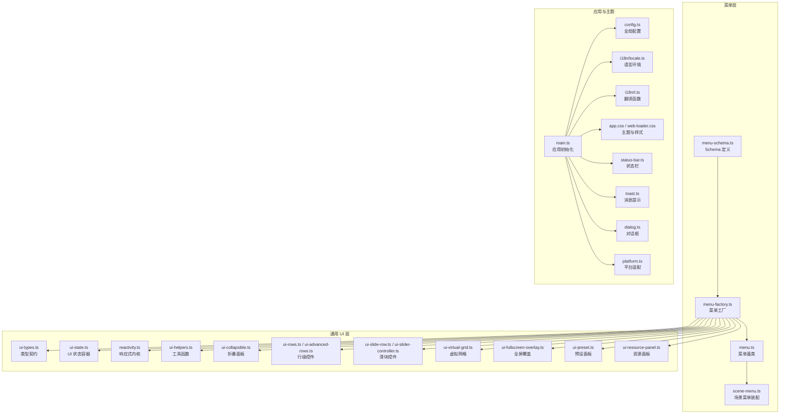
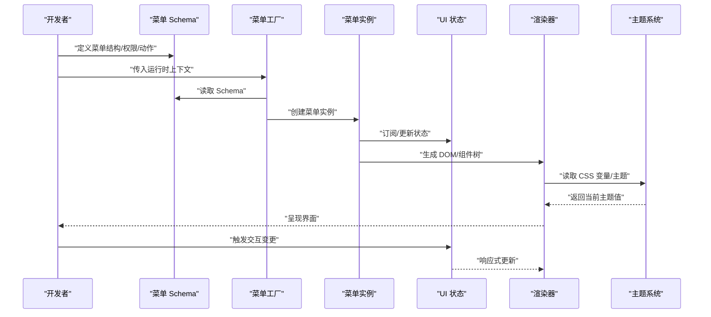
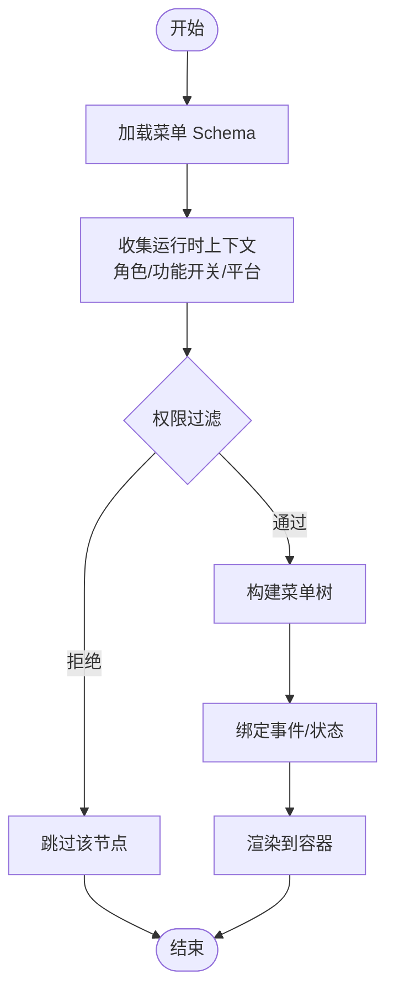
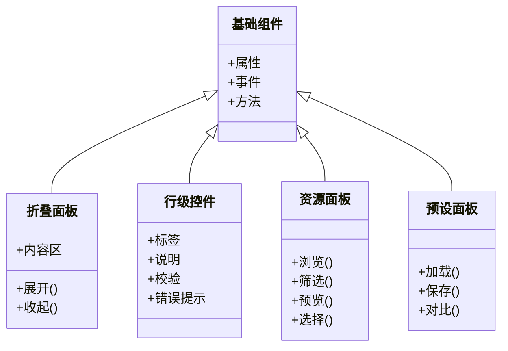
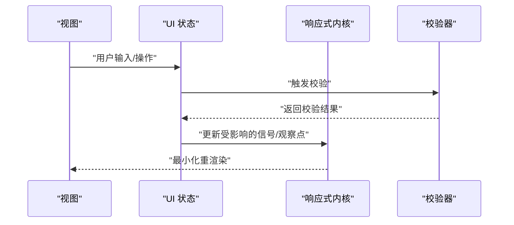
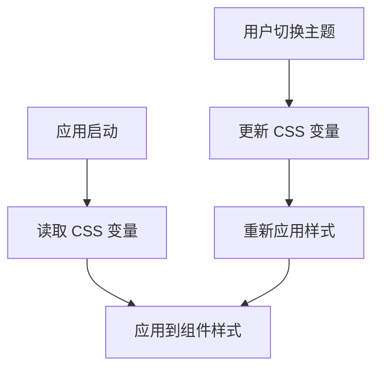
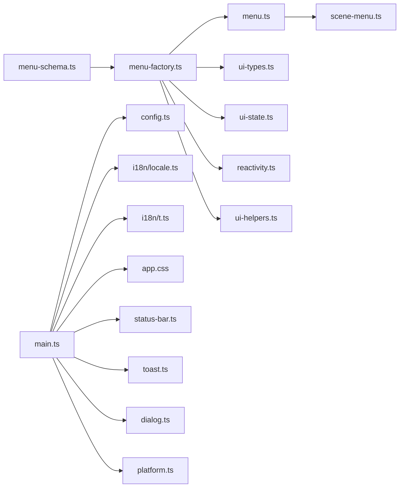

# UI 框架

<cite>
**本文引用的文件**   
- [frontend/src/menus/menu-schema.ts](file://frontend/src/menus/menu-schema.ts)
- [frontend/src/menus/menu-factory.ts](file://frontend/src/menus/menu-factory.ts)
- [frontend/src/menus/menu.ts](file://frontend/src/menus/menu.ts)
- [frontend/src/menus/scene-menu.ts](file://frontend/src/menus/scene-menu.ts)
- [frontend/src/core/ui-types.ts](file://frontend/src/core/ui-types.ts)
- [frontend/src/core/ui-state.ts](file://frontend/src/core/ui-state.ts)
- [frontend/src/core/reactivity.ts](file://frontend/src/core/reactivity.ts)
- [frontend/src/core/ui-helpers.ts](file://frontend/src/core/ui-helpers.ts)
- [frontend/src/core/ui-collapsible.ts](file://frontend/src/core/ui-collapsible.ts)
- [frontend/src/core/ui-slide-row.ts](file://frontend/src/core/ui-slide-row.ts)
- [frontend/src/core/ui-slider-controller.ts](file://frontend/src/core/ui-slider-controller.ts)
- [frontend/src/core/ui-virtual-grid.ts](file://frontend/src/core/ui-virtual网格.ts)
- [frontend/src/core/ui-fullscreen-overlay.ts](file://frontend/src/core/ui-fullscreen-overlay.ts)
- [frontend/src/core/ui-preset.ts](file://frontend/src/core/ui-preset.ts)
- [frontend/src/core/ui-resource-panel.ts](file://frontend/src/core/ui-resource-panel.ts)
- [frontend/src/core/ui-rows.ts](file://frontend/src/core/ui-rows.ts)
- [frontend/src/core/ui-advanced-rows.ts](file://frontend/src/core/ui-advanced-rows.ts)
- [frontend/src/app.css](file://frontend/src/app.css)
- [frontend/src/web-loader/web-loader.css](file://frontend/src/web-loader/web-loader.css)
- [frontend/src/core/i18n/locale.ts](file://frontend/src/core/i18n/locale.ts)
- [frontend/src/core/i18n/t.ts](file://frontend/src/core/i18n/t.ts)
- [frontend/src/config.ts](file://frontend/src/config.ts)
- [frontend/src/core/main.ts](file://frontend/src/core/main.ts)
- [frontend/src/core/status-bar.ts](file://frontend/src/core/status-bar.ts)
- [frontend/src/core/toast.ts](file://frontend/src/core/toast.ts)
- [frontend/src/core/dialog.ts](file://frontend/src/core/dialog.ts)
- [frontend/src/core/platform.ts](file://frontend/src/core/platform.ts)
</cite>

## 目录
1. [简介](#简介)
2. [项目结构](#项目结构)
3. [核心组件](#核心组件)
4. [架构总览](#架构总览)
5. [详细组件分析](#详细组件分析)
6. [依赖分析](#依赖分析)
7. [性能考虑](#性能考虑)
8. [故障排查指南](#故障排查指南)
9. [结论](#结论)
10. [附录](#附录)

## 简介
本文件面向 MikuMikuAR 前端 UI 框架，系统性阐述声明式菜单系统、UI 组件体系、状态管理与数据绑定、主题与样式管理，并提供可操作的实践路径。文档以“从概念到实现”的渐进方式组织，既适合初次接触者快速上手，也便于资深开发者深入理解内部机制。

## 项目结构
前端 UI 相关代码主要位于 frontend/src 下，围绕“菜单（menus）”、“通用 UI 能力（core）”、“应用入口与配置（config/main）”三大块展开：
- 菜单层：基于 Schema 的声明式菜单定义与工厂渲染，支持动态生成与权限控制。
- 通用 UI 层：基础控件、复合控件、布局与交互增强（折叠面板、滑动行、虚拟网格、全屏覆盖等）。
- 状态与响应式：统一的 UI 状态容器、响应式更新、表单校验与数据绑定。
- 主题与国际化：CSS 变量驱动的主题切换、多语言文本注入。

图表来源
- [frontend/src/menus/menu-schema.ts](file://frontend/src/menus/menu-schema.ts)
- [frontend/src/menus/menu-factory.ts](file://frontend/src/menus/menu-factory.ts)
- [frontend/src/menus/menu.ts](file://frontend/src/menus/menu.ts)
- [frontend/src/menus/scene-menu.ts](file://frontend/src/menus/scene-menu.ts)
- [frontend/src/core/ui-types.ts](file://frontend/src/core/ui-types.ts)
- [frontend/src/core/ui-state.ts](file://frontend/src/core/ui-state.ts)
- [frontend/src/core/reactivity.ts](file://frontend/src/core/reactivity.ts)
- [frontend/src/core/ui-helpers.ts](file://frontend/src/core/ui-helpers.ts)
- [frontend/src/core/ui-collapsible.ts](file://frontend/src/core/ui-collapsible.ts)
- [frontend/src/core/ui-rows.ts](file://frontend/src/core/ui-rows.ts)
- [frontend/src/core/ui-advanced-rows.ts](file://frontend/src/core/ui-advanced-rows.ts)
- [frontend/src/core/ui-slide-row.ts](file://frontend/src/core/ui-slide-row.ts)
- [frontend/src/core/ui-slider-controller.ts](file://frontend/src/core/ui-slider-controller.ts)
- [frontend/src/core/ui-virtual-grid.ts](file://frontend/src/core/ui-virtual网格.ts)
- [frontend/src/core/ui-fullscreen-overlay.ts](file://frontend/src/core/ui-fullscreen-overlay.ts)
- [frontend/src/core/ui-preset.ts](file://frontend/src/core/ui-preset.ts)
- [frontend/src/core/ui-resource-panel.ts](file://frontend/src/core/ui-resource-panel.ts)
- [frontend/src/config.ts](file://frontend/src/config.ts)
- [frontend/src/core/main.ts](file://frontend/src/core/main.ts)
- [frontend/src/core/status-bar.ts](file://frontend/src/core/status-bar.ts)
- [frontend/src/core/toast.ts](file://frontend/src/core/toast.ts)
- [frontend/src/core/dialog.ts](file://frontend/src/core/dialog.ts)
- [frontend/src/core/platform.ts](file://frontend/src/core/platform.ts)
- [frontend/src/app.css](file://frontend/src/app.css)
- [frontend/src/web-loader/web-loader.css](file://frontend/src/web-loader/web-loader.css)
- [frontend/src/core/i18n/locale.ts](file://frontend/src/core/i18n/locale.ts)
- [frontend/src/core/i18n/t.ts](file://frontend/src/core/i18n/t.ts)

章节来源
- [frontend/src/menus/menu-schema.ts](file://frontend/src/menus/menu-schema.ts)
- [frontend/src/menus/menu-factory.ts](file://frontend/src/menus/menu-factory.ts)
- [frontend/src/menus/menu.ts](file://frontend/src/menus/menu.ts)
- [frontend/src/menus/scene-menu.ts](file://frontend/src/menus/scene-menu.ts)
- [frontend/src/core/ui-types.ts](file://frontend/src/core/ui-types.ts)
- [frontend/src/core/ui-state.ts](file://frontend/src/core/ui-state.ts)
- [frontend/src/core/reactivity.ts](file://frontend/src/core/reactivity.ts)
- [frontend/src/core/ui-helpers.ts](file://frontend/src/core/ui-helpers.ts)
- [frontend/src/core/ui-collapsible.ts](file://frontend/src/core/ui-collapsible.ts)
- [frontend/src/core/ui-rows.ts](file://frontend/src/core/ui-rows.ts)
- [frontend/src/core/ui-advanced-rows.ts](file://frontend/src/core/ui-advanced-rows.ts)
- [frontend/src/core/ui-slide-row.ts](file://frontend/src/core/ui-slide-row.ts)
- [frontend/src/core/ui-slider-controller.ts](file://frontend/src/core/ui-slider-controller.ts)
- [frontend/src/core/ui-virtual-grid.ts](file://frontend/src/core/ui-virtual网格.ts)
- [frontend/src/core/ui-fullscreen-overlay.ts](file://frontend/src/core/ui-fullscreen-overlay.ts)
- [frontend/src/core/ui-preset.ts](file://frontend/src/core/ui-preset.ts)
- [frontend/src/core/ui-resource-panel.ts](file://frontend/src/core/ui-resource-panel.ts)
- [frontend/src/config.ts](file://frontend/src/config.ts)
- [frontend/src/core/main.ts](file://frontend/src/core/main.ts)
- [frontend/src/core/status-bar.ts](file://frontend/src/core/status-bar.ts)
- [frontend/src/core/toast.ts](file://frontend/src/core/toast.ts)
- [frontend/src/core/dialog.ts](file://frontend/src/core/dialog.ts)
- [frontend/src/core/platform.ts](file://frontend/src/core/platform.ts)
- [frontend/src/app.css](file://frontend/src/app.css)
- [frontend/src/web-loader/web-loader.css](file://frontend/src/web-loader/web-loader.css)
- [frontend/src/core/i18n/locale.ts](file://frontend/src/core/i18n/locale.ts)
- [frontend/src/core/i18n/t.ts](file://frontend/src/core/i18n/t.ts)

## 核心组件
- 声明式菜单系统
  - Schema 定义：通过结构化描述声明菜单项、分组、可见性、权限、子菜单与动作。
  - 动态生成：由菜单工厂根据运行时上下文（用户角色、功能开关、设备特性）将 Schema 转换为实际 UI 节点。
  - 权限控制：在渲染前对菜单项进行鉴权过滤，确保不可见或不可用。
- UI 组件体系
  - 基础组件：按钮、输入、滑块、选择器、列表、网格等。
  - 复合组件：折叠面板、行级控件（含高级行）、资源面板、预设面板等。
  - 自定义控件：基于基础组件组合的可复用业务控件。
- 状态管理与数据绑定
  - 统一 UI 状态容器：集中管理表单、面板、弹窗等状态。
  - 响应式内核：基于观察者模式的最小粒度更新。
  - 表单验证：内置规则引擎与异步校验回调。
- 主题系统与样式管理
  - CSS 变量：通过根节点变量驱动明暗主题、品牌色、间距与圆角。
  - 动态切换：运行时切换主题并即时生效。
  - 响应式设计：媒体查询与弹性布局适配不同屏幕。

章节来源
- [frontend/src/menus/menu-schema.ts](file://frontend/src/menus/menu-schema.ts)
- [frontend/src/menus/menu-factory.ts](file://frontend/src/menus/menu-factory.ts)
- [frontend/src/menus/menu.ts](file://frontend/src/menus/menu.ts)
- [frontend/src/menus/scene-menu.ts](file://frontend/src/menus/scene-menu.ts)
- [frontend/src/core/ui-types.ts](file://frontend/src/core/ui-types.ts)
- [frontend/src/core/ui-state.ts](file://frontend/src/core/ui-state.ts)
- [frontend/src/core/reactivity.ts](file://frontend/src/core/reactivity.ts)
- [frontend/src/core/ui-helpers.ts](file://frontend/src/core/ui-helpers.ts)
- [frontend/src/core/ui-collapsible.ts](file://frontend/src/core/ui-collapsible.ts)
- [frontend/src/core/ui-rows.ts](file://frontend/src/core/ui-rows.ts)
- [frontend/src/core/ui-advanced-rows.ts](file://frontend/src/core/ui-advanced-rows.ts)
- [frontend/src/core/ui-slide-row.ts](file://frontend/src/core/ui-slide-row.ts)
- [frontend/src/core/ui-slider-controller.ts](file://frontend/src/core/ui-slider-controller.ts)
- [frontend/src/core/ui-virtual-grid.ts](file://frontend/src/core/ui-virtual网格.ts)
- [frontend/src/core/ui-fullscreen-overlay.ts](file://frontend/src/core/ui-fullscreen-overlay.ts)
- [frontend/src/core/ui-preset.ts](file://frontend/src/core/ui-preset.ts)
- [frontend/src/core/ui-resource-panel.ts](file://frontend/src/core/ui-resource-panel.ts)
- [frontend/src/app.css](file://frontend/src/app.css)
- [frontend/src/web-loader/web-loader.css](file://frontend/src/web-loader/web-loader.css)

## 架构总览
下图展示从 Schema 到 UI 渲染的关键流程，以及状态与主题的联动关系。

图表来源
- [frontend/src/menus/menu-schema.ts](file://frontend/src/menus/menu-schema.ts)
- [frontend/src/menus/menu-factory.ts](file://frontend/src/menus/menu-factory.ts)
- [frontend/src/menus/menu.ts](file://frontend/src/menus/menu.ts)
- [frontend/src/core/ui-state.ts](file://frontend/src/core/ui-state.ts)
- [frontend/src/core/reactivity.ts](file://frontend/src/core/reactivity.ts)
- [frontend/src/app.css](file://frontend/src/app.css)

## 详细组件分析

### 声明式菜单系统
- 设计要点
  - Schema 作为唯一事实源，描述菜单层级、显示文案、图标、是否启用、权限标识、子菜单与动作回调。
  - 工厂负责解析 Schema、合并运行时上下文（如用户角色、功能开关、平台差异），输出可渲染的菜单树。
  - 权限控制贯穿“可见性”和“可用性”两层：不可见项不渲染；可用但禁用项灰显。
- 关键流程
  - 加载 Schema → 权限过滤 → 构建菜单树 → 绑定事件与状态 → 渲染到目标容器。
- 扩展点
  - 自定义菜单项类型：在工厂中注册新类型的渲染器。
  - 动态条件：在权限判断处接入外部服务或本地配置。
  - 国际化：文案通过 i18n 键名解析，避免硬编码。

图表来源
- [frontend/src/menus/menu-schema.ts](file://frontend/src/menus/menu-schema.ts)
- [frontend/src/menus/menu-factory.ts](file://frontend/src/menus/menu-factory.ts)
- [frontend/src/menus/menu.ts](file://frontend/src/menus/menu.ts)
- [frontend/src/menus/scene-menu.ts](file://frontend/src/menus/scene-menu.ts)

章节来源
- [frontend/src/menus/menu-schema.ts](file://frontend/src/menus/menu-schema.ts)
- [frontend/src/menus/menu-factory.ts](file://frontend/src/menus/menu-factory.ts)
- [frontend/src/menus/menu.ts](file://frontend/src/menus/menu.ts)
- [frontend/src/menus/scene-menu.ts](file://frontend/src/menus/scene-menu.ts)

### UI 组件体系
- 基础组件
  - 输入、滑块、选择器、按钮、列表、网格等，提供一致的 API 与样式契约。
- 复合组件
  - 折叠面板：封装展开/收起逻辑与内容区域。
  - 行级控件：用于参数编辑，支持标签、说明、校验与错误提示。
  - 资源面板：浏览、筛选、预览与选择资源。
  - 预设面板：加载/保存/对比预设。
- 自定义控件
  - 基于基础组件组合的业务控件，遵循统一类型契约与事件协议。

图表来源
- [frontend/src/core/ui-types.ts](file://frontend/src/core/ui-types.ts)
- [frontend/src/core/ui-collapsible.ts](file://frontend/src/core/ui-collapsible.ts)
- [frontend/src/core/ui-rows.ts](file://frontend/src/core/ui-rows.ts)
- [frontend/src/core/ui-advanced-rows.ts](file://frontend/src/core/ui-advanced-rows.ts)
- [frontend/src/core/ui-resource-panel.ts](file://frontend/src/core/ui-resource-panel.ts)
- [frontend/src/core/ui-preset.ts](file://frontend/src/core/ui-preset.ts)

章节来源
- [frontend/src/core/ui-types.ts](file://frontend/src/core/ui-types.ts)
- [frontend/src/core/ui-collapsible.ts](file://frontend/src/core/ui-collapsible.ts)
- [frontend/src/core/ui-rows.ts](file://frontend/src/core/ui-rows.ts)
- [frontend/src/core/ui-advanced-rows.ts](file://frontend/src/core/ui-advanced-rows.ts)
- [frontend/src/core/ui-resource-panel.ts](file://frontend/src/core/ui-resource-panel.ts)
- [frontend/src/core/ui-preset.ts](file://frontend/src/core/ui-preset.ts)

### 状态管理与数据绑定
- 统一 UI 状态容器
  - 集中管理表单、面板、弹窗等状态，提供读写接口与批量更新。
- 响应式内核
  - 基于观察者模式的最小粒度更新，避免全量重绘。
- 表单验证
  - 内置规则（必填、范围、格式等）与自定义异步校验，实时反馈错误信息。
- 数据绑定
  - 双向绑定：视图变化自动同步至模型，模型变更自动刷新视图。
  - 单向绑定：适用于只读展示与计算派生值。

图表来源
- [frontend/src/core/ui-state.ts](file://frontend/src/core/ui-state.ts)
- [frontend/src/core/reactivity.ts](file://frontend/src/core/reactivity.ts)
- [frontend/src/core/ui-helpers.ts](file://frontend/src/core/ui-helpers.ts)

章节来源
- [frontend/src/core/ui-state.ts](file://frontend/src/core/ui-state.ts)
- [frontend/src/core/reactivity.ts](file://frontend/src/core/reactivity.ts)
- [frontend/src/core/ui-helpers.ts](file://frontend/src/core/ui-helpers.ts)

### 主题系统与样式管理
- CSS 变量
  - 使用根节点变量定义颜色、字体、间距、圆角、阴影等，形成主题令牌。
- 动态切换
  - 运行时切换主题类名或变量值，立即应用到所有组件。
- 响应式设计
  - 媒体查询与弹性布局适配桌面、平板、移动端。
- 加载页样式
  - 独立样式文件保证加载阶段体验一致。

图表来源
- [frontend/src/app.css](file://frontend/src/app.css)
- [frontend/src/web-loader/web-loader.css](file://frontend/src/web-loader/web-loader.css)

章节来源
- [frontend/src/app.css](file://frontend/src/app.css)
- [frontend/src/web-loader/web-loader.css](file://frontend/src/web-loader/web-loader.css)

### 实战示例（路径指引）
- 创建自定义菜单
  - 参考菜单 Schema 定义与工厂注册位置，新增菜单项类型与权限策略。
  - 参考场景菜单装配，将新菜单挂载到目标容器。
- 开发 UI 组件
  - 参考基础组件类型契约，实现属性、事件与方法。
  - 参考复合组件（折叠面板、行级控件、资源面板、预设面板）的组合方式。
- 实现复杂交互逻辑
  - 参考状态容器与响应式内核，设计最小更新路径。
  - 参考表单校验与错误提示，完善用户体验。

章节来源
- [frontend/src/menus/menu-schema.ts](file://frontend/src/menus/menu-schema.ts)
- [frontend/src/menus/menu-factory.ts](file://frontend/src/menus/menu-factory.ts)
- [frontend/src/menus/scene-menu.ts](file://frontend/src/menus/scene-menu.ts)
- [frontend/src/core/ui-types.ts](file://frontend/src/core/ui-types.ts)
- [frontend/src/core/ui-collapsible.ts](file://frontend/src/core/ui-collapsible.ts)
- [frontend/src/core/ui-rows.ts](file://frontend/src/core/ui-rows.ts)
- [frontend/src/core/ui-advanced-rows.ts](file://frontend/src/core/ui-advanced-rows.ts)
- [frontend/src/core/ui-resource-panel.ts](file://frontend/src/core/ui-resource-panel.ts)
- [frontend/src/core/ui-preset.ts](file://frontend/src/core/ui-preset.ts)
- [frontend/src/core/ui-state.ts](file://frontend/src/core/ui-state.ts)
- [frontend/src/core/reactivity.ts](file://frontend/src/core/reactivity.ts)

## 依赖分析
- 模块耦合
  - 菜单层依赖类型契约、状态容器、响应式内核与工具函数。
  - 通用 UI 层依赖类型契约与响应式内核，部分组件依赖工具函数。
  - 应用入口依赖配置、国际化、主题与平台适配。
- 外部集成点
  - 平台适配：窗口、对话框、状态栏、Toast 等。
  - 国际化：语言环境与翻译函数。
  - 主题：CSS 变量与样式文件。

图表来源
- [frontend/src/menus/menu-schema.ts](file://frontend/src/menus/menu-schema.ts)
- [frontend/src/menus/menu-factory.ts](file://frontend/src/menus/menu-factory.ts)
- [frontend/src/menus/menu.ts](file://frontend/src/menus/menu.ts)
- [frontend/src/menus/scene-menu.ts](file://frontend/src/menus/scene-menu.ts)
- [frontend/src/core/ui-types.ts](file://frontend/src/core/ui-types.ts)
- [frontend/src/core/ui-state.ts](file://frontend/src/core/ui-state.ts)
- [frontend/src/core/reactivity.ts](file://frontend/src/core/reactivity.ts)
- [frontend/src/core/ui-helpers.ts](file://frontend/src/core/ui-helpers.ts)
- [frontend/src/config.ts](file://frontend/src/config.ts)
- [frontend/src/core/main.ts](file://frontend/src/core/main.ts)
- [frontend/src/core/status-bar.ts](file://frontend/src/core/status-bar.ts)
- [frontend/src/core/toast.ts](file://frontend/src/core/toast.ts)
- [frontend/src/core/dialog.ts](file://frontend/src/core/dialog.ts)
- [frontend/src/core/platform.ts](file://frontend/src/core/platform.ts)
- [frontend/src/app.css](file://frontend/src/app.css)
- [frontend/src/core/i18n/locale.ts](file://frontend/src/core/i18n/locale.ts)
- [frontend/src/core/i18n/t.ts](file://frontend/src/core/i18n/t.ts)

章节来源
- [frontend/src/menus/menu-schema.ts](file://frontend/src/menus/menu-schema.ts)
- [frontend/src/menus/menu-factory.ts](file://frontend/src/menus/menu-factory.ts)
- [frontend/src/menus/menu.ts](file://frontend/src/menus/menu.ts)
- [frontend/src/menus/scene-menu.ts](file://frontend/src/menus/scene-menu.ts)
- [frontend/src/core/ui-types.ts](file://frontend/src/core/ui-types.ts)
- [frontend/src/core/ui-state.ts](file://frontend/src/core/ui-state.ts)
- [frontend/src/core/reactivity.ts](file://frontend/src/core/reactivity.ts)
- [frontend/src/core/ui-helpers.ts](file://frontend/src/core/ui-helpers.ts)
- [frontend/src/config.ts](file://frontend/src/config.ts)
- [frontend/src/core/main.ts](file://frontend/src/core/main.ts)
- [frontend/src/core/status-bar.ts](file://frontend/src/core/status-bar.ts)
- [frontend/src/core/toast.ts](file://frontend/src/core/toast.ts)
- [frontend/src/core/dialog.ts](file://frontend/src/core/dialog.ts)
- [frontend/src/core/platform.ts](file://frontend/src/core/platform.ts)
- [frontend/src/app.css](file://frontend/src/app.css)
- [frontend/src/core/i18n/locale.ts](file://frontend/src/core/i18n/locale.ts)
- [frontend/src/core/i18n/t.ts](file://frontend/src/core/i18n/t.ts)

## 性能考虑
- 菜单渲染
  - 按需渲染：仅渲染可见且可用的菜单项。
  - 懒加载：子菜单或大列表延迟加载。
- 状态更新
  - 细粒度响应式：仅更新受影响节点，避免整树重绘。
  - 批处理：合并多次状态变更，减少渲染次数。
- 列表与网格
  - 虚拟滚动：大数据集采用虚拟网格提升性能。
- 主题切换
  - 批量更新 CSS 变量，避免逐元素样式修改。

[本节为通用指导，无需源码引用]

## 故障排查指南
- 菜单未显示
  - 检查权限过滤逻辑与运行时上下文是否正确注入。
  - 确认 Schema 中的可见性与启用标志。
- 表单校验不生效
  - 确认校验规则已正确绑定，异步校验回调是否返回 Promise。
- 主题切换无效
  - 检查 CSS 变量是否被正确更新，是否存在内联样式覆盖。
- 国际化缺失
  - 确认翻译键存在且语言包已加载。

章节来源
- [frontend/src/menus/menu-factory.ts](file://frontend/src/menus/menu-factory.ts)
- [frontend/src/menus/menu-schema.ts](file://frontend/src/menus/menu-schema.ts)
- [frontend/src/core/ui-state.ts](file://frontend/src/core/ui-state.ts)
- [frontend/src/core/reactivity.ts](file://frontend/src/core/reactivity.ts)
- [frontend/src/app.css](file://frontend/src/app.css)
- [frontend/src/core/i18n/locale.ts](file://frontend/src/core/i18n/locale.ts)
- [frontend/src/core/i18n/t.ts](file://frontend/src/core/i18n/t.ts)

## 结论
本 UI 框架以声明式菜单为核心，结合统一的组件体系、响应式状态管理与 CSS 变量驱动的主题系统，提供了可扩展、可维护的前端交互解决方案。通过合理的权限控制与动态生成机制，菜单能够灵活适应不同用户与场景；组件体系则保证了 UI 的一致性与复用性。未来可在性能优化、无障碍支持与测试覆盖率方面持续改进。

[本节为总结，无需源码引用]

## 附录
- 术语
  - Schema：描述 UI 结构的声明式数据。
  - 工厂：根据 Schema 与上下文生成具体 UI 实例。
  - 响应式：数据变化自动驱动视图更新。
  - 主题：通过变量与样式类控制外观。
- 最佳实践
  - 将菜单文案全部走国际化键名。
  - 将权限判断集中在工厂层，保持组件纯净。
  - 使用虚拟网格渲染大数据集。
  - 通过 CSS 变量统一管理主题令牌。

[本节为补充说明，无需源码引用]