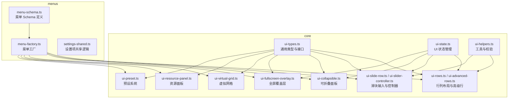
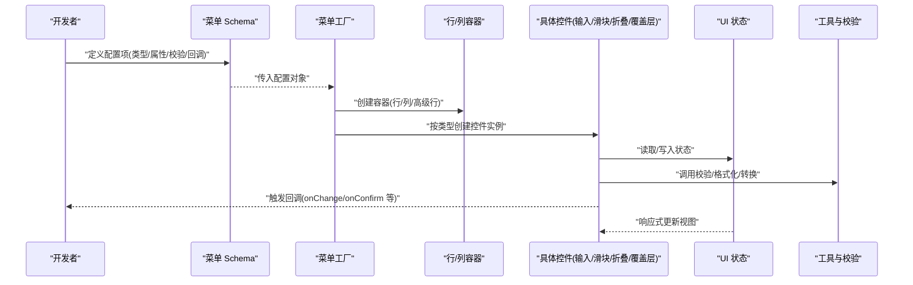
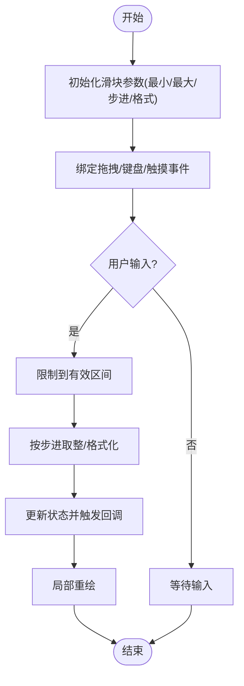
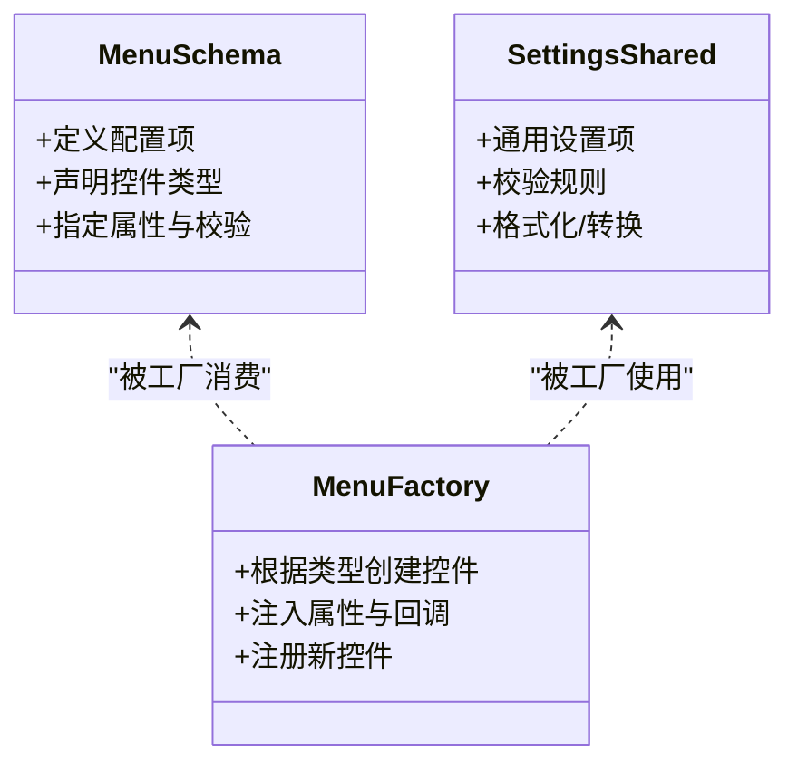
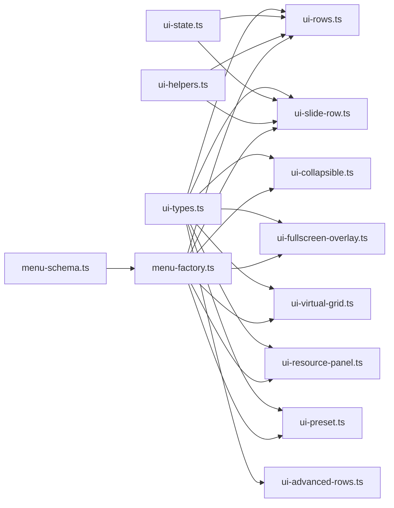

# UI 组件库

<cite>
**本文引用的文件**   
- [frontend/src/core/ui-types.ts](file://frontend/src/core/ui-types.ts)
- [frontend/src/core/ui-state.ts](file://frontend/src/core/ui-state.ts)
- [frontend/src/core/ui-helpers.ts](file://frontend/src/core/ui-helpers.ts)
- [frontend/src/core/ui-rows.ts](file://frontend/src/core/ui-rows.ts)
- [frontend/src/core/ui-advanced-rows.ts](file://frontend/src/core/ui-advanced-rows.ts)
- [frontend/src/core/ui-slide-row.ts](file://frontend/src/core/ui-slide-row.ts)
- [frontend/src/core/ui-slider-controller.ts](file://frontend/src/core/ui-slider-controller.ts)
- [frontend/src/core/ui-collapsible.ts](file://frontend/src/core/ui-collapsible.ts)
- [frontend/src/core/ui-fullscreen-overlay.ts](file://frontend/src/core/ui-fullscreen-overlay.ts)
- [frontend/src/core/ui-preset.ts](file://frontend/src/core/ui-preset.ts)
- [frontend/src/core/ui-virtual-grid.ts](file://frontend/src/core/ui-virtual-grid.ts)
- [frontend/src/core/ui-resource-panel.ts](file://frontend/src/core/ui-resource-panel.ts)
- [frontend/src/menus/menu-schema.ts](file://frontend/src/menus/menu-schema.ts)
- [frontend/src/menus/menu-factory.ts](file://frontend/src/menus/menu-factory.ts)
- [frontend/src/menus/settings-shared.ts](file://frontend/src/menus/settings-shared.ts)
- [frontend/src/app.css](file://frontend/src/app.css)
</cite>

## 目录
1. [简介](#简介)
2. [项目结构](#项目结构)
3. [核心组件](#核心组件)
4. [架构总览](#架构总览)
5. [详细组件分析](#详细组件分析)
6. [依赖关系分析](#依赖关系分析)
7. [性能考虑](#性能考虑)
8. [故障排查指南](#故障排查指南)
9. [结论](#结论)
10. [附录](#附录)

## 简介
本文件面向 UI 组件库的开发者与使用者，系统性梳理基础组件体系、表单控件、样式系统与主题适配、组合模式与属性传递机制，并给出自定义组件、组件通信与复杂交互的实现路径。文档同时提供架构图、时序图与流程图，帮助读者快速理解从声明式菜单到渲染层的数据流与控制流。

## 项目结构
UI 相关代码集中在前端源码 core 与 menus 两个层次：
- core 层：定义通用类型、状态、辅助函数与可复用 UI 构件（行/列布局、滑块、折叠面板、全屏覆盖层、虚拟网格等）。
- menus 层：基于 schema 驱动的菜单与设置界面，负责将业务配置转换为 UI 实例，并通过工厂进行注册与创建。

图表来源
- [frontend/src/core/ui-types.ts](file://frontend/src/core/ui-types.ts)
- [frontend/src/core/ui-state.ts](file://frontend/src/core/ui-state.ts)
- [frontend/src/core/ui-helpers.ts](file://frontend/src/core/ui-helpers.ts)
- [frontend/src/core/ui-rows.ts](file://frontend/src/core/ui-rows.ts)
- [frontend/src/core/ui-advanced-rows.ts](file://frontend/src/core/ui-advanced-rows.ts)
- [frontend/src/core/ui-slide-row.ts](file://frontend/src/core/ui-slide-row.ts)
- [frontend/src/core/ui-slider-controller.ts](file://frontend/src/core/ui-slider-controller.ts)
- [frontend/src/core/ui-collapsible.ts](file://frontend/src/core/ui-collapsible.ts)
- [frontend/src/core/ui-fullscreen-overlay.ts](file://frontend/src/core/ui-fullscreen-overlay.ts)
- [frontend/src/core/ui-virtual-grid.ts](file://frontend/src/core/ui-virtual-grid.ts)
- [frontend/src/core/ui-resource-panel.ts](file://frontend/src/core/ui-resource-panel.ts)
- [frontend/src/core/ui-preset.ts](file://frontend/src/core/ui-preset.ts)
- [frontend/src/menus/menu-schema.ts](file://frontend/src/menus/menu-schema.ts)
- [frontend/src/menus/menu-factory.ts](file://frontend/src/menus/menu-factory.ts)
- [frontend/src/menus/settings-shared.ts](file://frontend/src/menus/settings-shared.ts)

章节来源
- [frontend/src/core/ui-types.ts](file://frontend/src/core/ui-types.ts)
- [frontend/src/core/ui-state.ts](file://frontend/src/core/ui-state.ts)
- [frontend/src/core/ui-helpers.ts](file://frontend/src/core/ui-helpers.ts)
- [frontend/src/core/ui-rows.ts](file://frontend/src/core/ui-rows.ts)
- [frontend/src/core/ui-advanced-rows.ts](file://frontend/src/core/ui-advanced-rows.ts)
- [frontend/src/core/ui-slide-row.ts](file://frontend/src/core/ui-slide-row.ts)
- [frontend/src/core/ui-slider-controller.ts](file://frontend/src/core/ui-slider-controller.ts)
- [frontend/src/core/ui-collapsible.ts](file://frontend/src/core/ui-collapsible.ts)
- [frontend/src/core/ui-fullscreen-overlay.ts](file://frontend/src/core/ui-fullscreen-overlay.ts)
- [frontend/src/core/ui-virtual-grid.ts](file://frontend/src/core/ui-virtual-grid.ts)
- [frontend/src/core/ui-resource-panel.ts](file://frontend/src/core/ui-resource-panel.ts)
- [frontend/src/core/ui-preset.ts](file://frontend/src/core/ui-preset.ts)
- [frontend/src/menus/menu-schema.ts](file://frontend/src/menus/menu-schema.ts)
- [frontend/src/menus/menu-factory.ts](file://frontend/src/menus/menu-factory.ts)
- [frontend/src/menus/settings-shared.ts](file://frontend/src/menus/settings-shared.ts)

## 核心组件
本节聚焦“通用组件接口规范”“组件组合模式”“属性传递机制”，以及“表单组件实现”。

- 通用组件接口规范
  - 通过统一类型定义约束组件的属性、事件与生命周期钩子，确保不同控件在菜单系统中具备一致的契约。
  - 关键入口参考：[frontend/src/core/ui-types.ts](file://frontend/src/core/ui-types.ts)

- 组件组合模式
  - 使用“行/列”容器组合多个控件，形成复杂的表单或配置面板；高级行支持更丰富的布局与嵌套。
  - 关键入口参考：
    - [frontend/src/core/ui-rows.ts](file://frontend/src/core/ui-rows.ts)
    - [frontend/src/core/ui-advanced-rows.ts](file://frontend/src/core/ui-advanced-rows.ts)

- 属性传递机制
  - 基于 schema 驱动，由工厂根据配置动态创建控件实例，并将属性、校验器、回调等透传到具体控件。
  - 关键入口参考：
    - [frontend/src/menus/menu-schema.ts](file://frontend/src/menus/menu-schema.ts)
    - [frontend/src/menus/menu-factory.ts](file://frontend/src/menus/menu-factory.ts)
    - [frontend/src/menus/settings-shared.ts](file://frontend/src/menus/settings-shared.ts)

- 表单组件实现
  - 输入控件：文本、数字、选择等，遵循统一类型与校验流程。
  - 滑块组件：数值范围调节，支持步进、格式化与联动更新。
    - 关键入口参考：
      - [frontend/src/core/ui-slide-row.ts](file://frontend/src/core/ui-slide-row.ts)
      - [frontend/src/core/ui-slider-controller.ts](file://frontend/src/core/ui-slider-controller.ts)
  - 可折叠面板：用于分组展示大量设置项，支持展开/收起状态记忆。
    - 关键入口参考：[frontend/src/core/ui-collapsible.ts](file://frontend/src/core/ui-collapsible.ts)
  - 全屏覆盖层：用于弹窗、预览、确认对话框等需要遮挡主界面的场景。
    - 关键入口参考：[frontend/src/core/ui-fullscreen-overlay.ts](file://frontend/src/core/ui-fullscreen-overlay.ts)

章节来源
- [frontend/src/core/ui-types.ts](file://frontend/src/core/ui-types.ts)
- [frontend/src/core/ui-rows.ts](file://frontend/src/core/ui-rows.ts)
- [frontend/src/core/ui-advanced-rows.ts](file://frontend/src/core/ui-advanced-rows.ts)
- [frontend/src/menus/menu-schema.ts](file://frontend/src/menus/menu-schema.ts)
- [frontend/src/menus/menu-factory.ts](file://frontend/src/menus/menu-factory.ts)
- [frontend/src/menus/settings-shared.ts](file://frontend/src/menus/settings-shared.ts)
- [frontend/src/core/ui-slide-row.ts](file://frontend/src/core/ui-slide-row.ts)
- [frontend/src/core/ui-slider-controller.ts](file://frontend/src/core/ui-slider-controller.ts)
- [frontend/src/core/ui-collapsible.ts](file://frontend/src/core/ui-collapsible.ts)
- [frontend/src/core/ui-fullscreen-overlay.ts](file://frontend/src/core/ui-fullscreen-overlay.ts)

## 架构总览
下图展示了从“菜单 Schema”到“控件实例化”再到“渲染与交互”的整体数据流与控制流。

图表来源
- [frontend/src/menus/menu-schema.ts](file://frontend/src/menus/menu-schema.ts)
- [frontend/src/menus/menu-factory.ts](file://frontend/src/menus/menu-factory.ts)
- [frontend/src/core/ui-rows.ts](file://frontend/src/core/ui-rows.ts)
- [frontend/src/core/ui-advanced-rows.ts](file://frontend/src/core/ui-advanced-rows.ts)
- [frontend/src/core/ui-types.ts](file://frontend/src/core/ui-types.ts)
- [frontend/src/core/ui-state.ts](file://frontend/src/core/ui-state.ts)
- [frontend/src/core/ui-helpers.ts](file://frontend/src/core/ui-helpers.ts)

## 详细组件分析

### 通用类型与接口（ui-types）
- 职责
  - 定义所有 UI 控件的统一属性接口、事件回调、校验器签名、布局描述等。
  - 为工厂与容器提供强类型保障，减少运行时错误。
- 关键点
  - 属性映射：将 schema 字段映射到控件属性。
  - 事件模型：统一的变更、确认、取消等回调约定。
  - 扩展点：允许新增控件类型时保持向后兼容。

章节来源
- [frontend/src/core/ui-types.ts](file://frontend/src/core/ui-types.ts)

### 行/列容器与高级行（ui-rows, ui-advanced-rows）
- 职责
  - 提供基础的行/列布局能力，支持嵌套与对齐。
  - 高级行提供更灵活的排版与条件显示。
- 关键点
  - 组合模式：容器持有子控件列表，递归渲染。
  - 布局策略：根据屏幕宽度与方向自适应排列。
  - 性能：按需渲染与懒加载结合，避免一次性构建大型 DOM。

章节来源
- [frontend/src/core/ui-rows.ts](file://frontend/src/core/ui-rows.ts)
- [frontend/src/core/ui-advanced-rows.ts](file://frontend/src/core/ui-advanced-rows.ts)

### 滑块组件与控制器（ui-slide-row, ui-slider-controller）
- 职责
  - 提供数值范围输入，支持步进、最小/最大值、格式化显示。
  - 控制器封装拖拽、键盘、触摸等交互逻辑。
- 关键点
  - 双向绑定：值变化同步至状态与上游回调。
  - 防抖与节流：高频拖动时降低重绘频率。
  - 精度处理：浮点数舍入与单位换算。

图表来源
- [frontend/src/core/ui-slide-row.ts](file://frontend/src/core/ui-slide-row.ts)
- [frontend/src/core/ui-slider-controller.ts](file://frontend/src/core/ui-slider-controller.ts)

章节来源
- [frontend/src/core/ui-slide-row.ts](file://frontend/src/core/ui-slide-row.ts)
- [frontend/src/core/ui-slider-controller.ts](file://frontend/src/core/ui-slider-controller.ts)

### 可折叠面板（ui-collapsible）
- 职责
  - 将一组控件折叠展示，支持展开/收起状态持久化。
- 关键点
  - 状态机：打开/关闭两种状态，切换时触发子控件可见性更新。
  - 无障碍：键盘导航与焦点管理。
  - 性能：折叠区域按需挂载/卸载。

章节来源
- [frontend/src/core/ui-collapsible.ts](file://frontend/src/core/ui-collapsible.ts)

### 全屏覆盖层（ui-fullscreen-overlay）
- 职责
  - 提供全屏遮罩与内容承载，常用于弹窗、预览、确认对话框。
- 关键点
  - 层级管理：z-index 与焦点陷阱。
  - 退出策略：Esc 键、点击遮罩、返回按钮。
  - 动画过渡：进入/离开的平滑体验。

章节来源
- [frontend/src/core/ui-fullscreen-overlay.ts](file://frontend/src/core/ui-fullscreen-overlay.ts)

### 虚拟网格与资源面板（ui-virtual-grid, ui-resource-panel）
- 职责
  - 虚拟网格对大量条目进行分页/虚拟化渲染，提升滚动性能。
  - 资源面板整合缩略图、筛选、搜索与选择结果。
- 关键点
  - 视口计算：仅渲染可视区域内的节点。
  - 缓存策略：最近访问项缓存，减少重复请求。
  - 选择语义：单选/多选/批量操作。

章节来源
- [frontend/src/core/ui-virtual-grid.ts](file://frontend/src/core/ui-virtual-grid.ts)
- [frontend/src/core/ui-resource-panel.ts](file://frontend/src/core/ui-resource-panel.ts)

### 预设系统（ui-preset）
- 职责
  - 提供预设的 UI 配置模板，便于快速搭建常用面板。
- 关键点
  - 模板解析：将预设转为标准 schema。
  - 覆盖规则：允许局部覆盖默认值。
  - 版本兼容：预设升级时的迁移策略。

章节来源
- [frontend/src/core/ui-preset.ts](file://frontend/src/core/ui-preset.ts)

### 菜单 Schema 与工厂（menu-schema, menu-factory, settings-shared）
- 职责
  - Schema 定义菜单的结构、类型、校验与行为。
  - 工厂根据 Schema 创建具体控件实例，注入属性与回调。
  - 设置共享逻辑封装通用设置项与验证规则。
- 关键点
  - 声明式优先：以数据驱动 UI，减少样板代码。
  - 可扩展：新增控件类型只需在工厂中注册。
  - 一致性：统一校验与错误提示。

图表来源
- [frontend/src/menus/menu-schema.ts](file://frontend/src/menus/menu-schema.ts)
- [frontend/src/menus/menu-factory.ts](file://frontend/src/menus/menu-factory.ts)
- [frontend/src/menus/settings-shared.ts](file://frontend/src/menus/settings-shared.ts)

章节来源
- [frontend/src/menus/menu-schema.ts](file://frontend/src/menus/menu-schema.ts)
- [frontend/src/menus/menu-factory.ts](file://frontend/src/menus/menu-factory.ts)
- [frontend/src/menus/settings-shared.ts](file://frontend/src/menus/settings-shared.ts)

## 依赖关系分析
- 耦合与内聚
  - core 层内部高内聚：类型、状态、工具与控件相互协作，边界清晰。
  - menus 层依赖 core 层提供的控件与类型，保持低耦合。
- 外部依赖
  - 无重型 UI 框架依赖，采用轻量原生 DOM 与 CSS 变量实现主题与响应式。
- 潜在循环依赖
  - 当前未发现循环引用；若新增全局单例需审慎设计。

图表来源
- [frontend/src/core/ui-types.ts](file://frontend/src/core/ui-types.ts)
- [frontend/src/core/ui-state.ts](file://frontend/src/core/ui-state.ts)
- [frontend/src/core/ui-helpers.ts](file://frontend/src/core/ui-helpers.ts)
- [frontend/src/core/ui-rows.ts](file://frontend/src/core/ui-rows.ts)
- [frontend/src/core/ui-advanced-rows.ts](file://frontend/src/core/ui-advanced-rows.ts)
- [frontend/src/core/ui-slide-row.ts](file://frontend/src/core/ui-slide-row.ts)
- [frontend/src/core/ui-collapsible.ts](file://frontend/src/core/ui-collapsible.ts)
- [frontend/src/core/ui-fullscreen-overlay.ts](file://frontend/src/core/ui-fullscreen-overlay.ts)
- [frontend/src/core/ui-virtual-grid.ts](file://frontend/src/core/ui-virtual-grid.ts)
- [frontend/src/core/ui-resource-panel.ts](file://frontend/src/core/ui-resource-panel.ts)
- [frontend/src/core/ui-preset.ts](file://frontend/src/core/ui-preset.ts)
- [frontend/src/menus/menu-schema.ts](file://frontend/src/menus/menu-schema.ts)
- [frontend/src/menus/menu-factory.ts](file://frontend/src/menus/menu-factory.ts)

章节来源
- [frontend/src/core/ui-types.ts](file://frontend/src/core/ui-types.ts)
- [frontend/src/core/ui-state.ts](file://frontend/src/core/ui-state.ts)
- [frontend/src/core/ui-helpers.ts](file://frontend/src/core/ui-helpers.ts)
- [frontend/src/core/ui-rows.ts](file://frontend/src/core/ui-rows.ts)
- [frontend/src/core/ui-advanced-rows.ts](file://frontend/src/core/ui-advanced-rows.ts)
- [frontend/src/core/ui-slide-row.ts](file://frontend/src/core/ui-slide-row.ts)
- [frontend/src/core/ui-collapsible.ts](file://frontend/src/core/ui-collapsible.ts)
- [frontend/src/core/ui-fullscreen-overlay.ts](file://frontend/src/core/ui-fullscreen-overlay.ts)
- [frontend/src/core/ui-virtual-grid.ts](file://frontend/src/core/ui-virtual-grid.ts)
- [frontend/src/core/ui-resource-panel.ts](file://frontend/src/core/ui-resource-panel.ts)
- [frontend/src/core/ui-preset.ts](file://frontend/src/core/ui-preset.ts)
- [frontend/src/menus/menu-schema.ts](file://frontend/src/menus/menu-schema.ts)
- [frontend/src/menus/menu-factory.ts](file://frontend/src/menus/menu-factory.ts)

## 性能考虑
- 渲染优化
  - 虚拟网格仅渲染可视区域，避免长列表卡顿。
  - 折叠面板按需挂载/卸载子树，减少初始渲染成本。
- 交互优化
  - 滑块控制器对高频输入做节流/防抖，降低重绘压力。
  - 局部更新而非全量刷新，利用细粒度状态驱动。
- 内存与资源
  - 及时释放事件监听与定时器，防止泄漏。
  - 图片与缩略图采用懒加载与缓存策略。
- 主题与样式
  - 使用 CSS 变量集中管理颜色、间距、圆角等，减少重排。
  - 响应式断点与媒体查询配合，避免不必要的布局计算。

## 故障排查指南
- 常见问题定位
  - 属性未生效：检查 schema 字段名与控件属性映射是否一致。
  - 校验不触发：确认校验器签名与返回值是否符合约定。
  - 滑块异常：核对最小/最大值、步进与格式化函数。
  - 覆盖层无法关闭：检查 Esc 键与遮罩点击事件绑定。
- 调试建议
  - 在工厂创建阶段打印控件实例与属性，确认注入正确。
  - 在状态变更处添加日志，观察更新链路。
  - 使用浏览器开发者工具检查事件冒泡与焦点顺序。

章节来源
- [frontend/src/menus/menu-factory.ts](file://frontend/src/menus/menu-factory.ts)
- [frontend/src/core/ui-types.ts](file://frontend/src/core/ui-types.ts)
- [frontend/src/core/ui-slide-row.ts](file://frontend/src/core/ui-slide-row.ts)
- [frontend/src/core/ui-fullscreen-overlay.ts](file://frontend/src/core/ui-fullscreen-overlay.ts)

## 结论
本 UI 组件库以“类型先行、schema 驱动、工厂装配”为核心思想，构建了高内聚、低耦合的基础组件体系。通过行/列容器、滑块、折叠面板与全屏覆盖层等常用控件，配合虚拟网格与资源面板，满足复杂场景下的表单与配置需求。样式系统基于 CSS 变量与响应式设计，易于主题定制与多端适配。建议在新增控件时严格遵循统一接口与工厂注册流程，并在交互密集处引入节流/防抖与虚拟化策略，以获得稳定且高性能的用户体验。

## 附录
- 自定义组件开发步骤
  - 在通用类型中声明新的控件类型与属性接口。
  - 在工厂中注册该类型，完成属性注入与回调绑定。
  - 编写控件实现，遵循状态更新与事件触发约定。
  - 在菜单 schema 中使用新类型，验证交互与校验。
- 组件间通信最佳实践
  - 通过状态中心进行跨组件通信，避免直接耦合。
  - 使用回调与事件总线解耦父子组件。
  - 对异步操作增加超时与错误恢复。
- 样式与主题
  - 将颜色、字号、间距等抽象为 CSS 变量，集中管理。
  - 使用媒体查询与弹性布局实现响应式。
  - 主题切换时仅替换变量值，避免大规模重排。