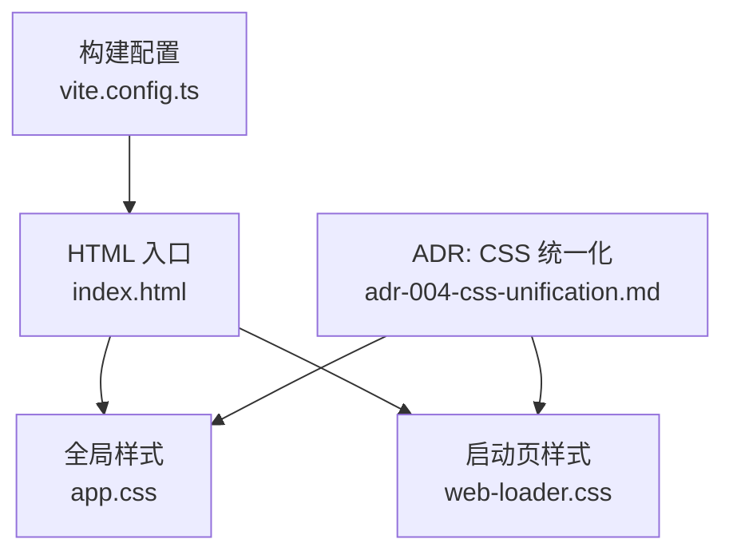
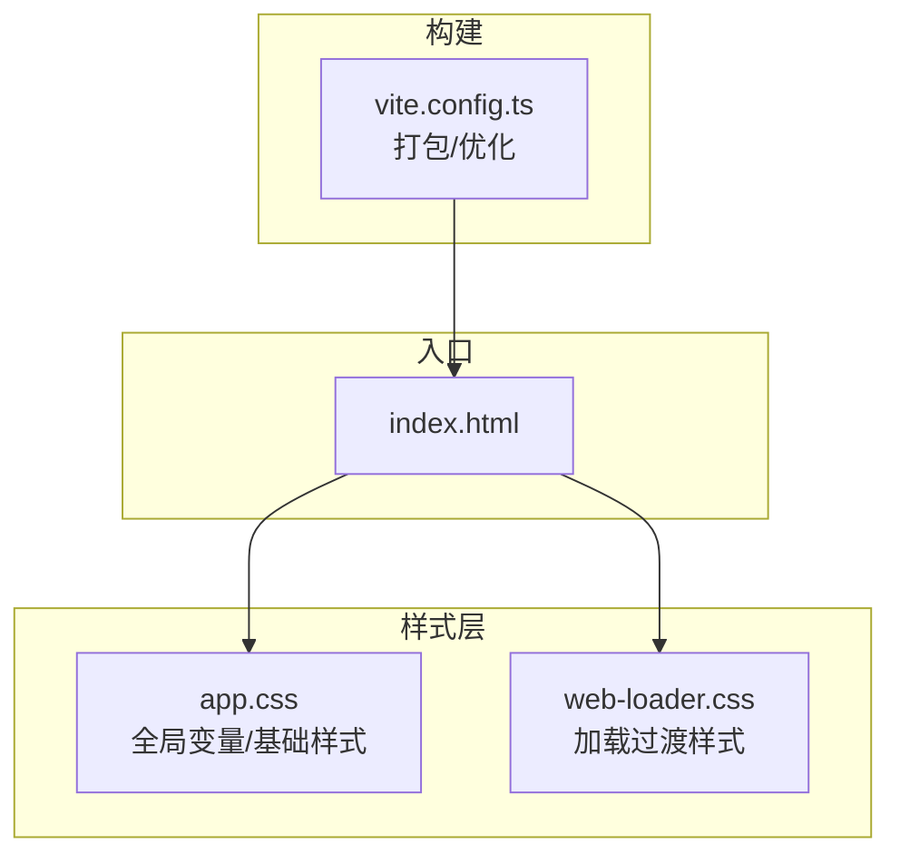
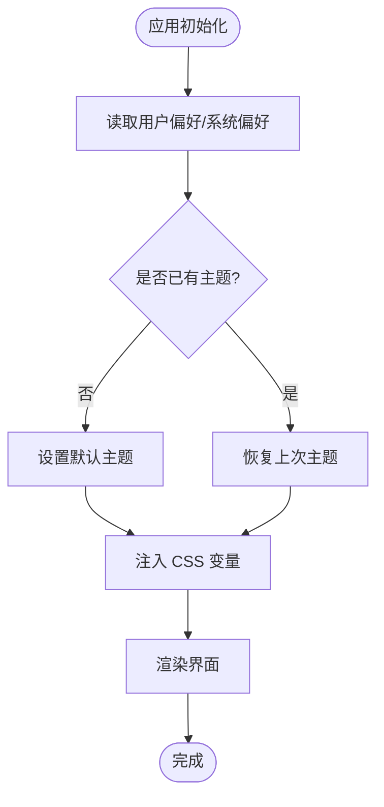
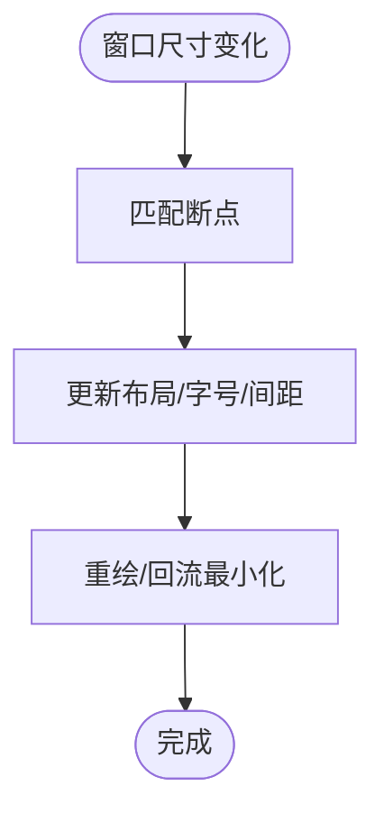
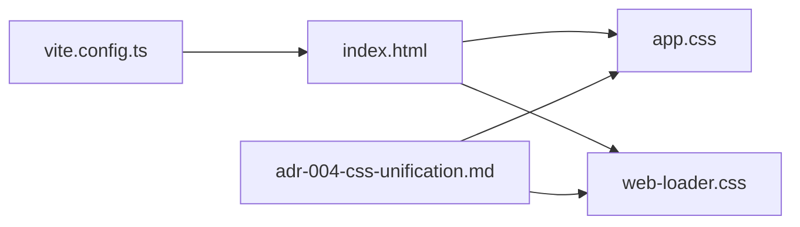

# 主题与样式

<cite>
**本文引用的文件**   
- [app.css](file://frontend/src/app.css)
- [web-loader.css](file://frontend/src/web-loader/web-loader.css)
- [index.html](file://frontend/index.html)
- [vite.config.ts](file://frontend/vite.config.ts)
- [adr-004-css-unification.md](file://docs/adr/adr-004-css-unification.md)
</cite>

## 目录
1. [简介](#简介)
2. [项目结构](#项目结构)
3. [核心组件](#核心组件)
4. [架构总览](#架构总览)
5. [详细组件分析](#详细组件分析)
6. [依赖关系分析](#依赖关系分析)
7. [性能考虑](#性能考虑)
8. [故障排查指南](#故障排查指南)
9. [结论](#结论)
10. [附录](#附录)

## 简介
本章节聚焦前端主题与样式系统，围绕 CSS 架构设计、变量体系、模块化组织、命名约定、主题切换机制（动态加载、颜色方案、字体适配）、响应式断点与布局适配、移动端优化、可复用样式实践、暗色模式实现、性能优化与浏览器兼容性展开。文档同时提供可视化图示与“代码片段路径”以便快速定位源码位置。

## 项目结构
前端样式资源主要位于以下位置：
- 全局样式入口：frontend/src/app.css
- 启动页样式：frontend/src/web-loader/web-loader.css
- HTML 入口：frontend/index.html
- 构建配置：frontend/vite.config.ts
- 统一化决策记录：docs/adr/adr-004-css-unification.md

图表来源
- [index.html](file://frontend/index.html)
- [app.css](file://frontend/src/app.css)
- [web-loader.css](file://frontend/src/web-loader/web-loader.css)
- [vite.config.ts](file://frontend/vite.config.ts)
- [adr-004-css-unification.md](file://docs/adr/adr-004-css-unification.md)

章节来源
- [index.html](file://frontend/index.html)
- [app.css](file://frontend/src/app.css)
- [web-loader.css](file://frontend/src/web-loader/web-loader.css)
- [vite.config.ts](file://frontend/vite.config.ts)
- [adr-004-css-unification.md](file://docs/adr/adr-004-css-unification.md)

## 核心组件
- 全局样式层：负责基础重置、CSS 变量根定义、通用排版与布局基线。
- 启动页样式层：负责应用加载过渡态的视觉呈现与动画。
- 构建与注入：通过 HTML 引入样式，由 Vite 进行打包与优化。
- 设计决策：基于 ADR 对 CSS 统一化的策略与约束。

章节来源
- [app.css](file://frontend/src/app.css)
- [web-loader.css](file://frontend/src/web-loader/web-loader.css)
- [index.html](file://frontend/index.html)
- [vite.config.ts](file://frontend/vite.config.ts)
- [adr-004-css-unification.md](file://docs/adr/adr-004-css-unification.md)

## 架构总览
整体样式架构遵循“单一入口 + 分层样式 + 变量驱动 + 构建优化”的模式：
- 入口层：index.html 引入 app.css 与 web-loader.css。
- 变量层：在 app.css 中集中声明 CSS 自定义属性（变量），作为主题与样式的唯一事实源。
- 模块层：按功能或页面拆分样式文件，通过构建工具聚合。
- 运行时层：通过 JS 切换 data-theme 或类名，配合媒体查询与 prefers-color-scheme 实现主题与响应式。

图表来源
- [index.html](file://frontend/index.html)
- [app.css](file://frontend/src/app.css)
- [web-loader.css](file://frontend/src/web-loader/web-loader.css)
- [vite.config.ts](file://frontend/vite.config.ts)

## 详细组件分析

### 全局样式与变量系统（app.css）
- 职责
  - 定义 CSS 变量根集合，包括颜色、字号、行高、圆角、阴影等。
  - 提供基础重置与排版基线，确保跨组件一致性。
  - 暴露语义化变量（如 --color-primary、--color-bg、--font-base），供业务样式消费。
- 变量体系建议
  - 使用语义化前缀与层级：--color-*、--space-*、--radius-*、--shadow-*、--font-*。
  - 将明/暗两套值以数据主题或媒体查询分组，避免硬编码。
- 示例（代码片段路径）
  - 定义主题变量根与默认值：[app.css](file://frontend/src/app.css)
  - 使用变量到具体 UI 元素：[app.css](file://frontend/src/app.css)

章节来源
- [app.css](file://frontend/src/app.css)

### 启动页样式（web-loader.css）
- 职责
  - 控制应用加载期间的遮罩、骨架屏、进度指示等。
  - 提供最小必要样式，减少首屏闪烁与布局抖动。
- 示例（代码片段路径）
  - 加载容器与关键帧动画：[web-loader.css](file://frontend/src/web-loader/web-loader.css)

章节来源
- [web-loader.css](file://frontend/src/web-loader/web-loader.css)

### HTML 入口与样式注入（index.html）
- 职责
  - 引入全局样式与脚本，挂载应用根节点。
  - 为主题切换预留 data-theme 或 class 钩子。
- 示例（代码片段路径）
  - 引入样式与根节点：[index.html](file://frontend/index.html)

章节来源
- [index.html](file://frontend/index.html)

### 构建与优化（vite.config.ts）
- 职责
  - 管理静态资源处理、CSS 压缩与按需提取。
  - 配置开发/生产环境差异，提升样式加载性能。
- 示例（代码片段路径）
  - 构建选项与插件配置：[vite.config.ts](file://frontend/vite.config.ts)

章节来源
- [vite.config.ts](file://frontend/vite.config.ts)

### 设计决策：CSS 统一化（adr-004-css-unification.md）
- 要点
  - 统一 CSS 规范与变量命名，收敛多套样式风格。
  - 明确主题与样式的边界，推动变量驱动与模块化。
- 示例（代码片段路径）
  - 统一化策略与落地步骤：[adr-004-css-unification.md](file://docs/adr/adr-004-css-unification.md)

章节来源
- [adr-004-css-unification.md](file://docs/adr/adr-004-css-unification.md)

### 主题切换机制（动态加载、颜色方案、字体适配）
- 动态主题加载
  - 通过 JS 切换根节点的 data-theme 或 class，触发 CSS 变量覆盖。
  - 结合本地存储持久化用户选择，并在初始化时恢复。
- 颜色方案管理
  - 优先读取用户偏好 prefers-color-scheme，其次回退到 data-theme。
  - 使用语义化变量，避免在业务样式中直接写死颜色值。
- 字体适配
  - 通过变量 --font-family-* 管理字体栈，支持不同语言与字重。
  - 针对小屏设备提供备用字体与字号缩放。
- 流程图（概念性）

### 响应式设计（断点、布局、移动端优化）
- 断点管理
  - 使用 CSS 变量或媒体查询集中管理断点，保持与设计令牌一致。
- 布局适配
  - 采用弹性布局与网格布局，结合 clamp() 与 min/max 实现流体排版。
- 移动端优化
  - 触控友好的点击区域、滚动条隐藏、视口与缩放策略。
- 流程图（概念性）

### 可复用样式与命名约定
- 命名约定
  - 使用 BEM 或类似约定，保证类名可读性与可维护性。
  - 变量命名遵循语义化前缀，避免重复与歧义。
- 可复用样式
  - 将通用卡片、按钮、表单控件抽象为独立样式块，通过变量定制外观。
- 示例（代码片段路径）
  - 组件级样式与变量消费：[app.css](file://frontend/src/app.css)

章节来源
- [app.css](file://frontend/src/app.css)

### 暗色模式实现
- 实现方式
  - 在根节点添加 data-theme="dark" 或通过媒体查询自动启用。
  - 在暗色主题下覆盖 --color-* 与 --bg-* 等变量，确保对比度与可读性。
- 示例（代码片段路径）
  - 暗色变量覆盖与条件生效：[app.css](file://frontend/src/app.css)

章节来源
- [app.css](file://frontend/src/app.css)

## 依赖关系分析
- 样式依赖
  - index.html 依赖 app.css 与 web-loader.css。
  - vite.config.ts 影响样式打包与输出。
- 设计决策依赖
  - adr-004-css-unification.md 指导样式统一与变量治理。

图表来源
- [index.html](file://frontend/index.html)
- [app.css](file://frontend/src/app.css)
- [web-loader.css](file://frontend/src/web-loader/web-loader.css)
- [vite.config.ts](file://frontend/vite.config.ts)
- [adr-004-css-unification.md](file://docs/adr/adr-004-css-unification.md)

章节来源
- [index.html](file://frontend/index.html)
- [app.css](file://frontend/src/app.css)
- [web-loader.css](file://frontend/src/web-loader/web-loader.css)
- [vite.config.ts](file://frontend/vite.config.ts)
- [adr-004-css-unification.md](file://docs/adr/adr-004-css-unification.md)

## 性能考虑
- 减少重排重绘
  - 批量更新 CSS 变量，避免频繁切换类名导致的布局抖动。
- 资源体积
  - 利用 Vite 的 CSS 压缩与去重；按需引入样式，避免全量加载。
- 首屏体验
  - 启动页样式尽量精简，关键样式内联或预加载，非关键延迟加载。
- 兼容性
  - 对不支持的特性提供降级方案（如 prefers-color-scheme 回退）。

## 故障排查指南
- 主题未生效
  - 检查根节点是否存在正确的 data-theme 或 class。
  - 确认变量覆盖顺序与优先级是否正确。
- 样式冲突
  - 审查 ADR 的统一规范，避免多套命名与变量并存。
- 构建异常
  - 核对 vite.config.ts 的样式处理配置与资源路径。
- 参考路径
  - 变量与覆盖位置：[app.css](file://frontend/src/app.css)
  - 构建配置：[vite.config.ts](file://frontend/vite.config.ts)
  - 统一化策略：[adr-004-css-unification.md](file://docs/adr/adr-004-css-unification.md)

章节来源
- [app.css](file://frontend/src/app.css)
- [vite.config.ts](file://frontend/vite.config.ts)
- [adr-004-css-unification.md](file://docs/adr/adr-004-css-unification.md)

## 结论
本项目的前端样式系统以全局变量为核心，结合统一的构建流程与设计决策，实现了可扩展的主题与响应式能力。通过语义化变量、模块化组织与严格的命名约定，可在不侵入业务逻辑的前提下灵活切换主题、适配多端并保障性能与可维护性。

## 附录
- 代码片段路径索引
  - 全局变量与基础样式：[app.css](file://frontend/src/app.css)
  - 启动页样式：[web-loader.css](file://frontend/src/web-loader/web-loader.css)
  - HTML 入口：[index.html](file://frontend/index.html)
  - 构建配置：[vite.config.ts](file://frontend/vite.config.ts)
  - 统一化策略：[adr-004-css-unification.md](file://docs/adr/adr-004-css-unification.md)