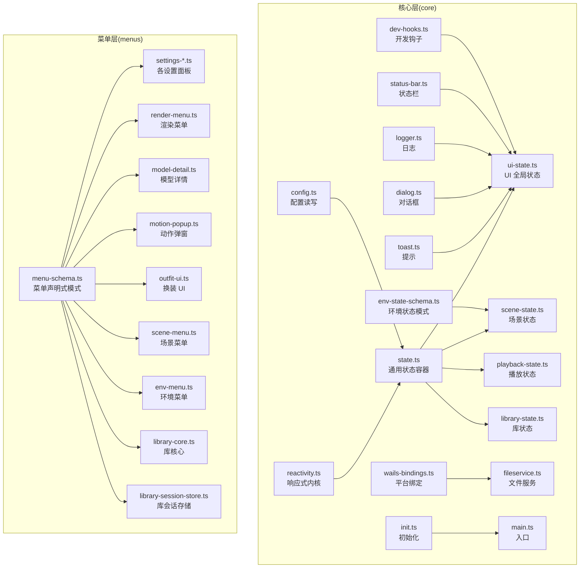
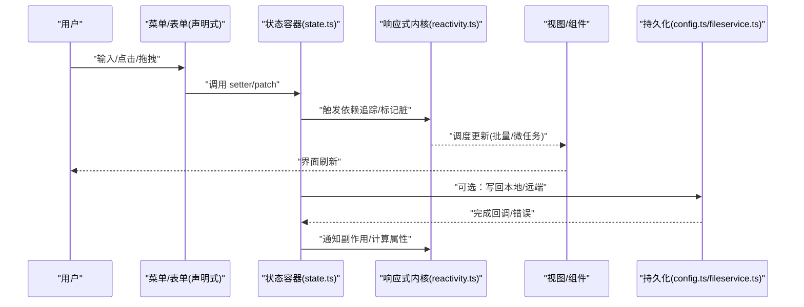
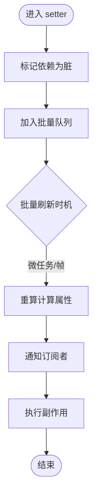
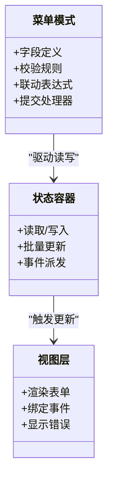
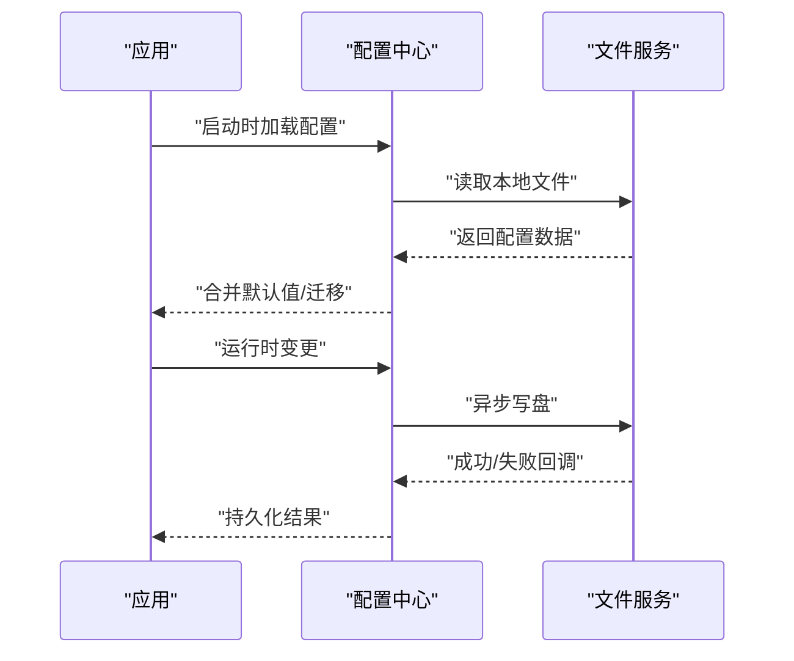
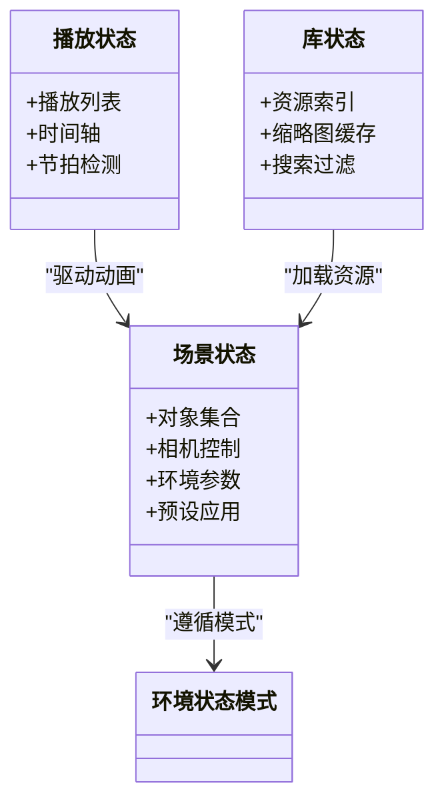
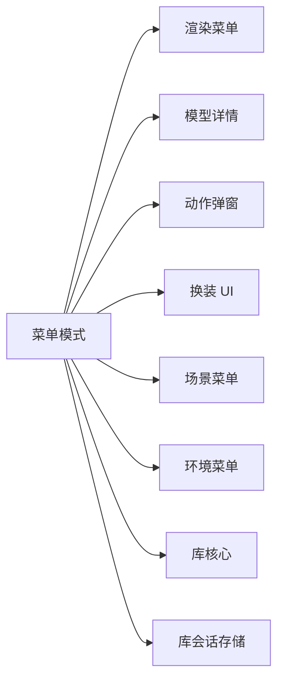
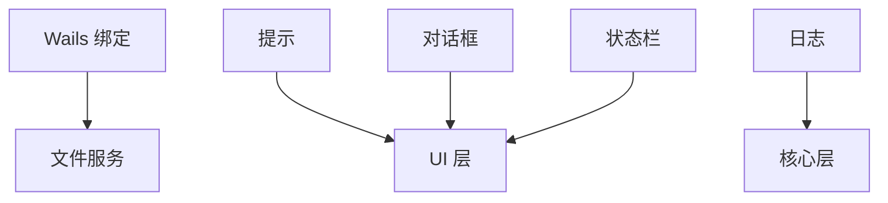
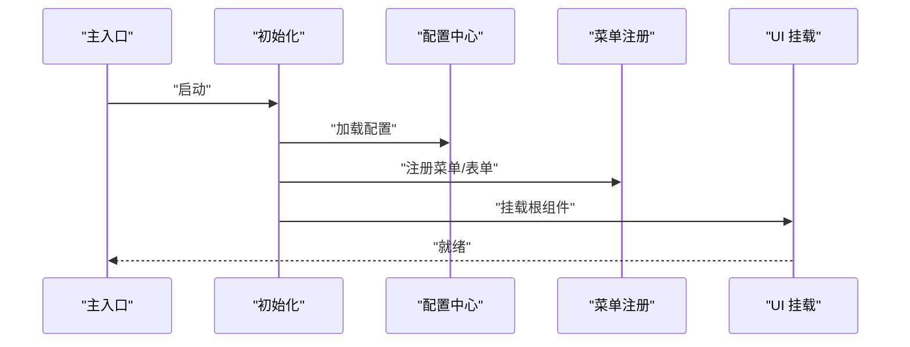
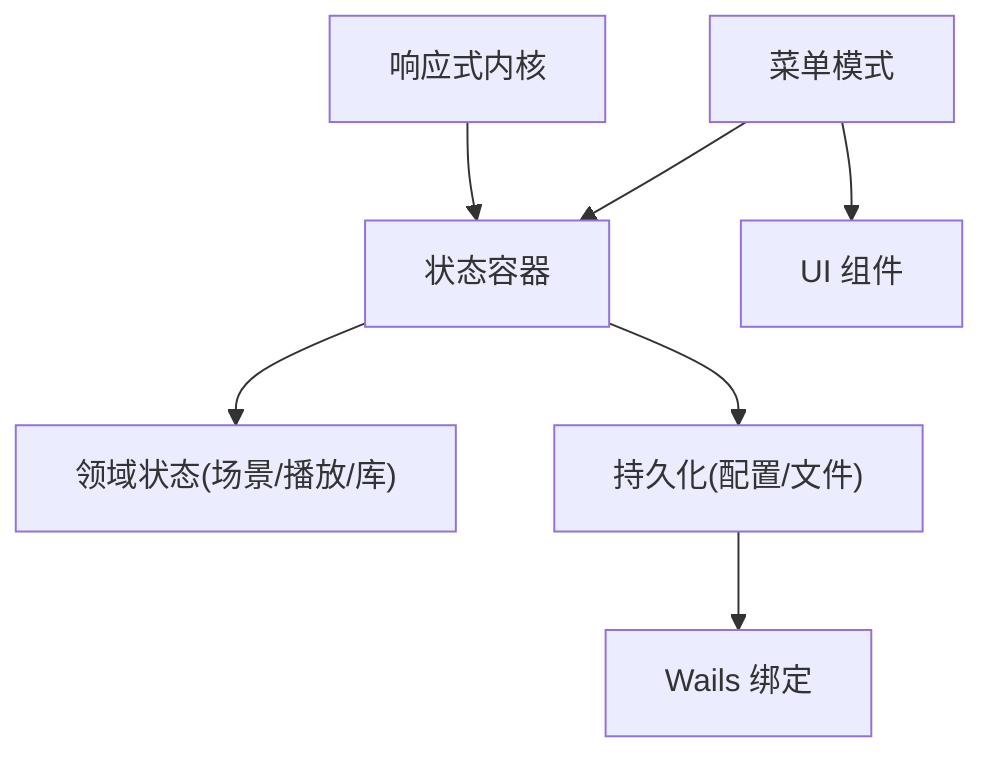

# 状态管理

<cite>
**本文引用的文件**   
- [reactivity.ts](file://frontend/src/core/reactivity.ts)
- [state.ts](file://frontend/src/core/state.ts)
- [ui-state.ts](file://frontend/src/core/ui-state.ts)
- [scene-state.ts](file://frontend/src/core/scene-state.ts)
- [playback-state.ts](file://frontend/src/core/playback-state.ts)
- [library-state.ts](file://frontend/src/core/library-state.ts)
- [config.ts](file://frontend/src/core/config.ts)
- [env-state-schema.ts](file://frontend/src/core/env-state-schema.ts)
- [menu-schema.ts](file://frontend/src/menus/menu-schema.ts)
- [settings-shared.ts](file://frontend/src/menus/settings-shared.ts)
- [settings-appearance.ts](file://frontend/src/menus/settings-appearance.ts)
- [settings-audio.ts](file://frontend/src/menus/settings-audio.ts)
- [settings-performance.ts](file://frontend/src/menus/settings-performance.ts)
- [settings-rendering.ts](file://frontend/src/menus/settings-rendering.ts)
- [settings-screenshot.ts](file://frontend/src/menus/settings-screenshot.ts)
- [settings-shortcuts.ts](file://frontend/src/menus/settings-shortcuts.ts)
- [settings-software.ts](file://frontend/src/menus/settings-software.ts)
- [settings-targets.ts](file://frontend/src/menus/settings-targets.ts)
- [settings-library.ts](file://frontend/src/menus/settings-library.ts)
- [settings-paths.ts](file://frontend/src/menus/settings-paths.ts)
- [settings-language.ts](file://frontend/src/menus/settings-language.ts)
- [settings-about.ts](file://frontend/src/menus/settings-about.ts)
- [render-menu.ts](file://frontend/src/menus/render-menu.ts)
- [model-detail.ts](file://frontend/src/menus/model-detail.ts)
- [motion-popup.ts](file://frontend/src/menus/motion-popup.ts)
- [outfit-ui.ts](file://frontend/src/menus/outfit-ui.ts)
- [scene-menu.ts](file://frontend/src/menus/scene-menu.ts)
- [env-menu.ts](file://frontend/src/menus/env-menu.ts)
- [library-core.ts](file://frontend/src/menus/library-core.ts)
- [library-session-store.ts](file://frontend/src/menus/library-session-store.ts)
- [wails-bindings.ts](file://frontend/src/core/wails-bindings.ts)
- [fileservice.ts](file://frontend/src/core/fileservice.ts)
- [toast.ts](file://frontend/src/core/toast.ts)
- [dialog.ts](file://frontend/src/core/dialog.ts)
- [logger.ts](file://frontend/src/core/logger.ts)
- [status-bar.ts](file://frontend/src/core/status-bar.ts)
- [dev-hooks.ts](file://frontend/src/core/dev-hooks.ts)
- [init.ts](file://frontend/src/core/init.ts)
- [main.ts](file://frontend/src/core/main.ts)
</cite>

## 目录
1. [简介](#简介)
2. [项目结构](#项目结构)
3. [核心组件](#核心组件)
4. [架构总览](#架构总览)
5. [详细组件分析](#详细组件分析)
6. [依赖分析](#依赖分析)
7. [性能考虑](#性能考虑)
8. [故障排查指南](#故障排查指南)
9. [结论](#结论)
10. [附录](#附录)

## 简介
本文件聚焦于前端 UI 状态管理体系，围绕响应式状态、表单状态与持久化三大主题展开：
- 响应式状态系统：基于细粒度订阅与依赖追踪的自动更新机制。
- 表单状态管理：数据绑定、校验规则与错误处理流程。
- 状态持久化策略：本地存储、配置同步与状态恢复。
- 示例与实践：如何创建响应式状态、实现复杂逻辑、处理异步更新。
- 调试与监控：开发期工具与性能观测方法。

## 项目结构
UI 状态相关代码主要分布在 core 与 menus 两个层次：
- core：提供响应式内核、通用状态容器、配置与 I/O 能力。
- menus：面向具体功能域（场景、渲染、库、设置等）的状态与交互编排。

图表来源
- [reactivity.ts:1-200](file://frontend/src/core/reactivity.ts#L1-L200)
- [state.ts:1-200](file://frontend/src/core/state.ts#L1-L200)
- [ui-state.ts:1-200](file://frontend/src/core/ui-state.ts#L1-L200)
- [scene-state.ts:1-200](file://frontend/src/core/scene-state.ts#L1-L200)
- [playback-state.ts:1-200](file://frontend/src/core/playback-state.ts#L1-L200)
- [library-state.ts:1-200](file://frontend/src/core/library-state.ts#L1-L200)
- [config.ts:1-200](file://frontend/src/core/config.ts#L1-L200)
- [env-state-schema.ts:1-200](file://frontend/src/core/env-state-schema.ts#L1-L200)
- [menu-schema.ts:1-200](file://frontend/src/menus/menu-schema.ts#L1-L200)
- [settings-shared.ts:1-200](file://frontend/src/menus/settings-shared.ts#L1-L200)
- [render-menu.ts:1-200](file://frontend/src/menus/render-menu.ts#L1-L200)
- [model-detail.ts:1-200](file://frontend/src/menus/model-detail.ts#L1-L200)
- [motion-popup.ts:1-200](file://frontend/src/menus/motion-popup.ts#L1-L200)
- [outfit-ui.ts:1-200](file://frontend/src/menus/outfit-ui.ts#L1-L200)
- [scene-menu.ts:1-200](file://frontend/src/menus/scene-menu.ts#L1-L200)
- [env-menu.ts:1-200](file://frontend/src/menus/env-menu.ts#L1-L200)
- [library-core.ts:1-200](file://frontend/src/menus/library-core.ts#L1-L200)
- [library-session-store.ts:1-200](file://frontend/src/menus/library-session-store.ts#L1-L200)
- [wails-bindings.ts:1-200](file://frontend/src/core/wails-bindings.ts#L1-L200)
- [fileservice.ts:1-200](file://frontend/src/core/fileservice.ts#L1-L200)
- [toast.ts:1-200](file://frontend/src/core/toast.ts#L1-L200)
- [dialog.ts:1-200](file://frontend/src/core/dialog.ts#L1-L200)
- [logger.ts:1-200](file://frontend/src/core/logger.ts#L1-L200)
- [status-bar.ts:1-200](file://frontend/src/core/status-bar.ts#L1-L200)
- [dev-hooks.ts:1-200](file://frontend/src/core/dev-hooks.ts#L1-L200)
- [init.ts:1-200](file://frontend/src/core/init.ts#L1-L200)
- [main.ts:1-200](file://frontend/src/core/main.ts#L1-L200)

章节来源
- [reactivity.ts:1-200](file://frontend/src/core/reactivity.ts#L1-L200)
- [state.ts:1-200](file://frontend/src/core/state.ts#L1-L200)
- [ui-state.ts:1-200](file://frontend/src/core/ui-state.ts#L1-L200)
- [menu-schema.ts:1-200](file://frontend/src/menus/menu-schema.ts#L1-L200)

## 核心组件
- 响应式内核：提供可观察对象、计算属性与副作用订阅，支持细粒度依赖追踪与批量更新。
- 通用状态容器：封装状态生命周期、变更派发与快照对比，供业务状态复用。
- UI 全局状态：聚合界面可见性、主题、语言、提示与状态栏等跨模块共享信息。
- 领域状态：场景、播放、库等按职责拆分，避免单例膨胀。
- 配置与模式：集中读取/写入配置，结合模式定义保证数据结构一致性。
- 菜单声明式模式：以声明方式描述表单字段、联动与校验，驱动 UI 渲染与行为。

章节来源
- [reactivity.ts:1-200](file://frontend/src/core/reactivity.ts#L1-L200)
- [state.ts:1-200](file://frontend/src/core/state.ts#L1-L200)
- [ui-state.ts:1-200](file://frontend/src/core/ui-state.ts#L1-L200)
- [scene-state.ts:1-200](file://frontend/src/core/scene-state.ts#L1-L200)
- [playback-state.ts:1-200](file://frontend/src/core/playback-state.ts#L1-L200)
- [library-state.ts:1-200](file://frontend/src/core/library-state.ts#L1-L200)
- [config.ts:1-200](file://frontend/src/core/config.ts#L1-L200)
- [env-state-schema.ts:1-200](file://frontend/src/core/env-state-schema.ts#L1-L200)
- [menu-schema.ts:1-200](file://frontend/src/menus/menu-schema.ts#L1-L200)

## 架构总览
下图展示从用户交互到状态更新、再到视图自动更新的完整链路。

图表来源
- [state.ts:1-200](file://frontend/src/core/state.ts#L1-L200)
- [reactivity.ts:1-200](file://frontend/src/core/reactivity.ts#L1-L200)
- [config.ts:1-200](file://frontend/src/core/config.ts#L1-L200)
- [fileservice.ts:1-200](file://frontend/src/core/fileservice.ts#L1-L200)

## 详细组件分析

### 响应式状态系统
- 设计要点
  - 可观察对象：将普通对象转换为可追踪的数据源。
  - 计算属性：声明式派生值，仅在依赖变化时重算。
  - 副作用订阅：在依赖变化后执行副作用（如写盘、网络请求）。
  - 批量更新：合并多次变更，减少重复渲染。
- 关键接口与用法路径
  - 创建可观察对象与计算属性的入口位于响应式内核。
  - 订阅与取消订阅由状态容器统一封装，便于资源清理。
- 复杂度与性能
  - 依赖图构建为 O(n) 级别，更新为增量传播，避免全量重算。
  - 建议将高频更新收敛到最小作用域，降低无效计算。

图表来源
- [reactivity.ts:1-200](file://frontend/src/core/reactivity.ts#L1-L200)
- [state.ts:1-200](file://frontend/src/core/state.ts#L1-L200)

章节来源
- [reactivity.ts:1-200](file://frontend/src/core/reactivity.ts#L1-L200)
- [state.ts:1-200](file://frontend/src/core/state.ts#L1-L200)

### 表单状态管理
- 数据绑定
  - 通过声明式菜单模式定义字段、类型、默认值与联动关系，自动绑定到状态容器。
  - 双向绑定由框架内部维护，修改状态即更新 UI，修改 UI 即回写状态。
- 验证规则
  - 在菜单模式中声明必填、范围、正则等约束；提交前进行全量校验。
  - 错误信息国际化与显示位置由 UI 层统一处理。
- 错误处理
  - 校验失败阻止提交并高亮字段；异步校验（如远程可用性）使用加载态与重试策略。
  - 错误消息通过提示与状态栏反馈给用户。

图表来源
- [menu-schema.ts:1-200](file://frontend/src/menus/menu-schema.ts#L1-L200)
- [state.ts:1-200](file://frontend/src/core/state.ts#L1-L200)

章节来源
- [menu-schema.ts:1-200](file://frontend/src/menus/menu-schema.ts#L1-L200)
- [settings-shared.ts:1-200](file://frontend/src/menus/settings-shared.ts#L1-L200)
- [toast.ts:1-200](file://frontend/src/core/toast.ts#L1-L200)
- [dialog.ts:1-200](file://frontend/src/core/dialog.ts#L1-L200)
- [status-bar.ts:1-200](file://frontend/src/core/status-bar.ts#L1-L200)

### 状态持久化策略
- 本地存储
  - 配置中心负责序列化/反序列化与版本兼容。
  - 文件服务提供跨平台读写能力，适配桌面与移动端。
- 配置同步
  - 状态变更后按需落盘或定时落盘，避免频繁 IO。
  - 多窗口/多标签页可通过事件总线或文件系统锁协调。
- 状态恢复
  - 应用启动时优先加载本地配置，缺失则回退到默认值。
  - 对关键状态提供快照与回滚能力。

图表来源
- [config.ts:1-200](file://frontend/src/core/config.ts#L1-L200)
- [fileservice.ts:1-200](file://frontend/src/core/fileservice.ts#L1-L200)

章节来源
- [config.ts:1-200](file://frontend/src/core/config.ts#L1-L200)
- [fileservice.ts:1-200](file://frontend/src/core/fileservice.ts#L1-L200)

### 领域状态示例：场景、播放与库
- 场景状态
  - 组织场景内对象、相机、灯光与环境参数，提供批量切换与预设应用。
  - 与环境状态模式对齐，确保渲染管线一致性。
- 播放状态
  - 管理播放列表、时间轴、循环与节拍检测，驱动动画与音频同步。
- 库状态
  - 管理资源索引、缩略图缓存、最近访问与搜索过滤。

图表来源
- [scene-state.ts:1-200](file://frontend/src/core/scene-state.ts#L1-L200)
- [playback-state.ts:1-200](file://frontend/src/core/playback-state.ts#L1-L200)
- [library-state.ts:1-200](file://frontend/src/core/library-state.ts#L1-L200)
- [env-state-schema.ts:1-200](file://frontend/src/core/env-state-schema.ts#L1-L200)

章节来源
- [scene-state.ts:1-200](file://frontend/src/core/scene-state.ts#L1-L200)
- [playback-state.ts:1-200](file://frontend/src/core/playback-state.ts#L1-L200)
- [library-state.ts:1-200](file://frontend/src/core/library-state.ts#L1-L200)
- [env-state-schema.ts:1-200](file://frontend/src/core/env-state-schema.ts#L1-L200)

### 菜单与 UI 集成
- 渲染菜单：根据渲染选项生成表单与预览联动。
- 模型详情：展示模型元数据与材质编辑入口。
- 动作弹窗：快速选择与预览动作片段。
- 换装 UI：按分类与标签筛选服装，实时预览。
- 场景菜单：场景级操作与快捷预设。
- 环境菜单：天穹、地面、水体等环境子系统开关与参数。
- 库核心与会话存储：浏览、下载、缓存与会话记忆。

图表来源
- [menu-schema.ts:1-200](file://frontend/src/menus/menu-schema.ts#L1-L200)
- [render-menu.ts:1-200](file://frontend/src/menus/render-menu.ts#L1-L200)
- [model-detail.ts:1-200](file://frontend/src/menus/model-detail.ts#L1-L200)
- [motion-popup.ts:1-200](file://frontend/src/menus/motion-popup.ts#L1-L200)
- [outfit-ui.ts:1-200](file://frontend/src/menus/outfit-ui.ts#L1-L200)
- [scene-menu.ts:1-200](file://frontend/src/menus/scene-menu.ts#L1-L200)
- [env-menu.ts:1-200](file://frontend/src/menus/env-menu.ts#L1-L200)
- [library-core.ts:1-200](file://frontend/src/menus/library-core.ts#L1-L200)
- [library-session-store.ts:1-200](file://frontend/src/menus/library-session-store.ts#L1-L200)

章节来源
- [render-menu.ts:1-200](file://frontend/src/menus/render-menu.ts#L1-L200)
- [model-detail.ts:1-200](file://frontend/src/menus/model-detail.ts#L1-L200)
- [motion-popup.ts:1-200](file://frontend/src/menus/motion-popup.ts#L1-L200)
- [outfit-ui.ts:1-200](file://frontend/src/menus/outfit-ui.ts#L1-L200)
- [scene-menu.ts:1-200](file://frontend/src/menus/scene-menu.ts#L1-L200)
- [env-menu.ts:1-200](file://frontend/src/menus/env-menu.ts#L1-L200)
- [library-core.ts:1-200](file://frontend/src/menus/library-core.ts#L1-L200)
- [library-session-store.ts:1-200](file://frontend/src/menus/library-session-store.ts#L1-L200)

### 平台与 I/O 集成
- Wails 绑定：桥接前端与后端能力（文件、窗口、更新等）。
- 文件服务：抽象跨平台文件读写，屏蔽底层差异。
- 提示与对话框：统一用户反馈通道。
- 日志与状态栏：记录运行信息与用户引导。

图表来源
- [wails-bindings.ts:1-200](file://frontend/src/core/wails-bindings.ts#L1-L200)
- [fileservice.ts:1-200](file://frontend/src/core/fileservice.ts#L1-L200)
- [toast.ts:1-200](file://frontend/src/core/toast.ts#L1-L200)
- [dialog.ts:1-200](file://frontend/src/core/dialog.ts#L1-L200)
- [logger.ts:1-200](file://frontend/src/core/logger.ts#L1-L200)
- [status-bar.ts:1-200](file://frontend/src/core/status-bar.ts#L1-L200)

章节来源
- [wails-bindings.ts:1-200](file://frontend/src/core/wails-bindings.ts#L1-L200)
- [fileservice.ts:1-200](file://frontend/src/core/fileservice.ts#L1-L200)
- [toast.ts:1-200](file://frontend/src/core/toast.ts#L1-L200)
- [dialog.ts:1-200](file://frontend/src/core/dialog.ts#L1-L200)
- [logger.ts:1-200](file://frontend/src/core/logger.ts#L1-L200)
- [status-bar.ts:1-200](file://frontend/src/core/status-bar.ts#L1-L200)

### 初始化与入口
- 初始化流程：加载配置、注册菜单、挂载 UI、启动渲染循环。
- 主入口：组装各模块、注入依赖、暴露调试钩子。

图表来源
- [init.ts:1-200](file://frontend/src/core/init.ts#L1-L200)
- [main.ts:1-200](file://frontend/src/core/main.ts#L1-L200)
- [config.ts:1-200](file://frontend/src/core/config.ts#L1-L200)
- [menu-schema.ts:1-200](file://frontend/src/menus/menu-schema.ts#L1-L200)

章节来源
- [init.ts:1-200](file://frontend/src/core/init.ts#L1-L200)
- [main.ts:1-200](file://frontend/src/core/main.ts#L1-L200)

## 依赖分析
- 耦合与内聚
  - 响应式内核与状态容器低耦合，领域状态仅依赖通用容器。
  - 菜单层通过声明式模式与状态解耦，便于扩展与测试。
- 外部依赖
  - Wails 绑定用于平台能力访问。
  - 文件服务抽象跨平台 IO。
- 潜在循环依赖
  - 通过分层与接口隔离避免循环引用；若出现，应引入事件总线或延迟加载。

图表来源
- [reactivity.ts:1-200](file://frontend/src/core/reactivity.ts#L1-L200)
- [state.ts:1-200](file://frontend/src/core/state.ts#L1-L200)
- [menu-schema.ts:1-200](file://frontend/src/menus/menu-schema.ts#L1-L200)
- [config.ts:1-200](file://frontend/src/core/config.ts#L1-L200)
- [wails-bindings.ts:1-200](file://frontend/src/core/wails-bindings.ts#L1-L200)

章节来源
- [reactivity.ts:1-200](file://frontend/src/core/reactivity.ts#L1-L200)
- [state.ts:1-200](file://frontend/src/core/state.ts#L1-L200)
- [menu-schema.ts:1-200](file://frontend/src/menus/menu-schema.ts#L1-L200)
- [config.ts:1-200](file://frontend/src/core/config.ts#L1-L200)
- [wails-bindings.ts:1-200](file://frontend/src/core/wails-bindings.ts#L1-L200)

## 性能考虑
- 批量更新与节流
  - 将高频输入（滑动条、拖拽）合并为批量更新，减少中间渲染。
- 计算属性缓存
  - 利用计算属性缓存派生值，避免重复计算。
- 懒加载与分页
  - 库与菜单项采用懒加载，首屏只渲染必要内容。
- 渲染优化
  - 大列表虚拟滚动，局部更新而非整表重绘。
- 持久化频率
  - 防抖/节流写盘，避免阻塞主线程。

[本节为通用指导，不直接分析具体文件]

## 故障排查指南
- 常见问题
  - 状态未更新：检查是否通过状态容器 setter 修改，而非直接赋值。
  - 表单校验不生效：确认菜单模式中已声明校验规则且提交前触发。
  - 持久化失败：查看文件权限与路径合法性，关注异步回调错误。
- 调试工具
  - 开发钩子：暴露状态快照、订阅树与变更日志。
  - 日志与状态栏：记录关键路径与异常堆栈。
  - 提示与对话框：辅助定位用户操作上下文。
- 定位步骤
  - 复现问题 -> 打开开发钩子 -> 捕获状态快照 -> 比对变更序列 -> 定位源头。

章节来源
- [dev-hooks.ts:1-200](file://frontend/src/core/dev-hooks.ts#L1-L200)
- [logger.ts:1-200](file://frontend/src/core/logger.ts#L1-L200)
- [status-bar.ts:1-200](file://frontend/src/core/status-bar.ts#L1-L200)
- [toast.ts:1-200](file://frontend/src/core/toast.ts#L1-L200)
- [dialog.ts:1-200](file://frontend/src/core/dialog.ts#L1-L200)

## 结论
本项目的前端状态管理以“响应式内核 + 通用状态容器 + 声明式菜单”为核心，形成清晰的分层与解耦。通过细粒度订阅与批量更新保障性能，借助配置与文件服务实现可靠持久化。配合开发钩子与日志体系，可有效提升可观测性与可维护性。

## 附录
- 最佳实践
  - 始终通过状态容器修改数据，避免绕过响应式。
  - 将复杂逻辑下沉至计算属性或独立函数，保持表单简洁。
  - 持久化采用异步与错误重试，避免阻塞用户交互。
- 参考路径
  - 响应式内核与状态容器：[reactivity.ts](file://frontend/src/core/reactivity.ts), [state.ts](file://frontend/src/core/state.ts)
  - 领域状态：[scene-state.ts](file://frontend/src/core/scene-state.ts), [playback-state.ts](file://frontend/src/core/playback-state.ts), [library-state.ts](file://frontend/src/core/library-state.ts)
  - 配置与持久化：[config.ts](file://frontend/src/core/config.ts), [fileservice.ts](file://frontend/src/core/fileservice.ts)
  - 菜单与表单：[menu-schema.ts](file://frontend/src/menus/menu-schema.ts), [settings-*.ts](file://frontend/src/menus/)
  - 调试与日志：[dev-hooks.ts](file://frontend/src/core/dev-hooks.ts), [logger.ts](file://frontend/src/core/logger.ts)