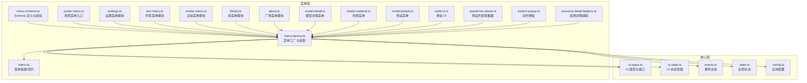
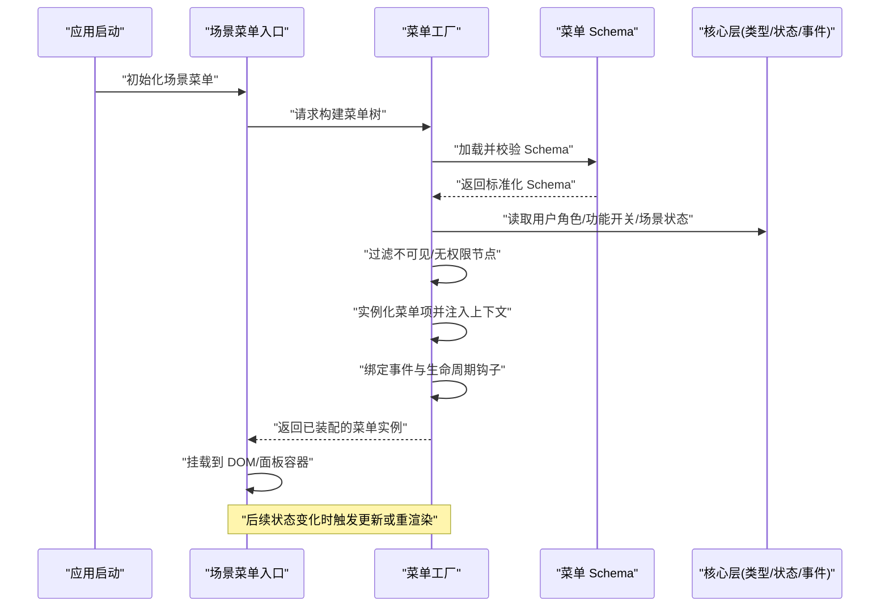
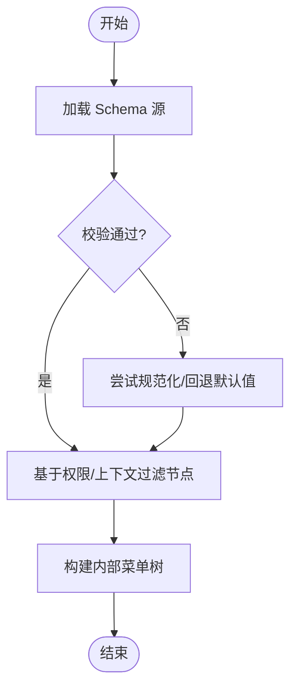
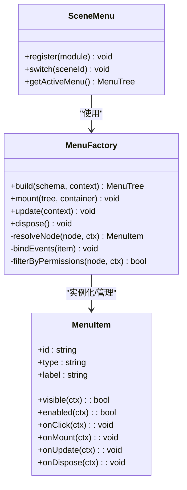
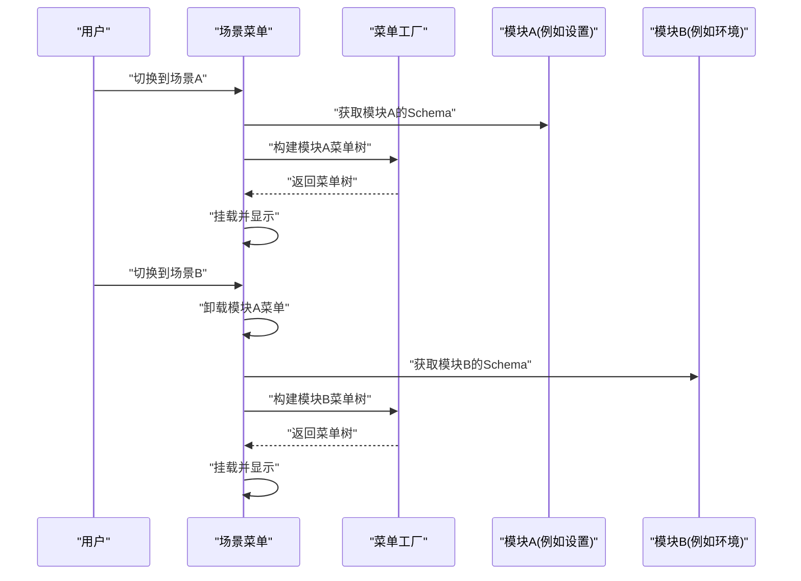
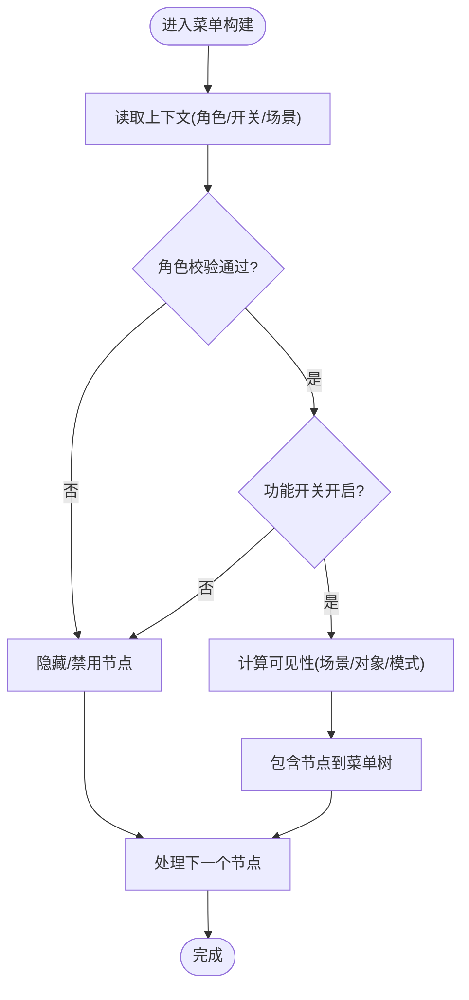
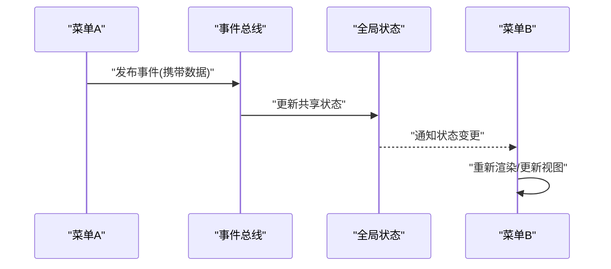
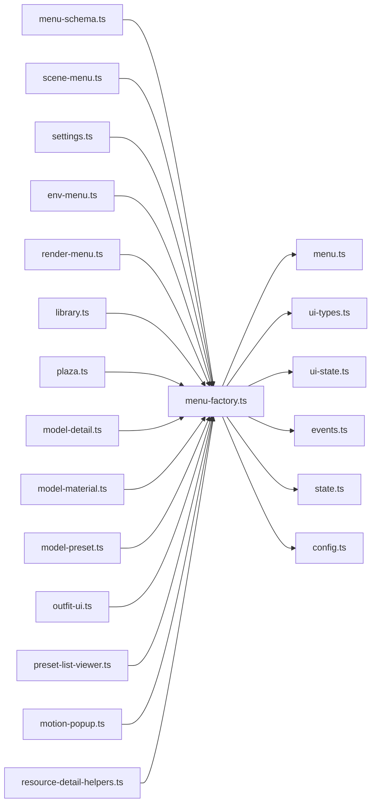

# 菜单系统

<cite>
**本文引用的文件**   
- [frontend/src/menus/menu-schema.ts](file://frontend/src/menus/menu-schema.ts)
- [frontend/src/menus/menu-factory.ts](file://frontend/src/menus/menu-factory.ts)
- [frontend/src/menus/menu.ts](file://frontend/src/menus/menu.ts)
- [frontend/src/menus/scene-menu.ts](file://frontend/src/menus/scene-menu.ts)
- [frontend/src/menus/settings.ts](file://frontend/src/menus/settings.ts)
- [frontend/src/menus/env-menu.ts](file://frontend/src/menus/env-menu.ts)
- [frontend/src/menus/render-menu.ts](file://frontend/src/menus/render-menu.ts)
- [frontend/src/menus/library.ts](file://frontend/src/menus/library.ts)
- [frontend/src/menus/plaza.ts](file://frontend/src/menus/plaza.ts)
- [frontend/src/menus/model-detail.ts](file://frontend/src/menus/model-detail.ts)
- [frontend/src/menus/model-material.ts](file://frontend/src/menus/model-material.ts)
- [frontend/src/menus/model-preset.ts](file://frontend/src/menus/model-preset.ts)
- [frontend/src/menus/outfit-ui.ts](file://frontend/src/menus/outfit-ui.ts)
- [frontend/src/menus/preset-list-viewer.ts](file://frontend/src/menus/preset-list-viewer.ts)
- [frontend/src/menus/motion-popup.ts](file://frontend/src/menus/motion-popup.ts)
- [frontend/src/menus/resource-detail-helpers.ts](file://frontend/src/menus/resource-detail-helpers.ts)
- [frontend/src/core/ui-types.ts](file://frontend/src/core/ui-types.ts)
- [frontend/src/core/ui-state.ts](file://frontend/src/core/ui-state.ts)
- [frontend/src/core/events.ts](file://frontend/src/core/events.ts)
- [frontend/src/core/state.ts](file://frontend/src/core/state.ts)
- [frontend/src/config.ts](file://frontend/src/config.ts)
- [docs/adr/adr-093-menu-declarative-schema.md](file://docs/adr/adr-093-menu-declarative-schema.md)
- [docs/adr/adr-034-menu-unification.md](file://docs/adr/adr-034-menu-unification.md)
</cite>

## 目录
1. [简介](#简介)
2. [项目结构](#项目结构)
3. [核心组件](#核心组件)
4. [架构总览](#架构总览)
5. [详细组件分析](#详细组件分析)
6. [依赖关系分析](#依赖关系分析)
7. [性能考量](#性能考量)
8. [故障排查指南](#故障排查指南)
9. [结论](#结论)
10. [附录](#附录)

## 简介
本文件面向“声明式菜单系统”的完整文档，覆盖以下目标：
- 设计原理与架构：解释声明式菜单 Schema、动态生成机制、层级管理。
- 工厂模式实现：菜单实例化、生命周期管理、事件绑定。
- 权限控制：用户角色验证、功能开关、动态显示控制。
- 实践示例：如何定义菜单 Schema、创建自定义菜单项、实现菜单间通信与状态同步。

该菜单系统采用“Schema 驱动 + 工厂构建”的方式，将 UI 描述与业务逻辑解耦，通过统一的注册与装配流程，在运行时按需渲染、挂载、销毁，并支持基于权限与上下文的动态显隐与交互。

## 项目结构
前端菜单相关代码集中在 frontend/src/menus 目录下，配合 core 层的通用 UI 类型与状态设施，形成“声明式 Schema → 工厂装配 → 运行时渲染”的闭环。

图表来源
- [frontend/src/menus/menu-schema.ts](file://frontend/src/menus/menu-schema.ts)
- [frontend/src/menus/menu-factory.ts](file://frontend/src/menus/menu-factory.ts)
- [frontend/src/menus/menu.ts](file://frontend/src/menus/menu.ts)
- [frontend/src/menus/scene-menu.ts](file://frontend/src/menus/scene-menu.ts)
- [frontend/src/menus/settings.ts](file://frontend/src/menus/settings.ts)
- [frontend/src/menus/env-menu.ts](file://frontend/src/menus/env-menu.ts)
- [frontend/src/menus/render-menu.ts](file://frontend/src/menus/render-menu.ts)
- [frontend/src/menus/library.ts](file://frontend/src/menus/library.ts)
- [frontend/src/menus/plaza.ts](file://frontend/src/menus/plaza.ts)
- [frontend/src/menus/model-detail.ts](file://frontend/src/menus/model-detail.ts)
- [frontend/src/menus/model-material.ts](file://frontend/src/menus/model-material.ts)
- [frontend/src/menus/model-preset.ts](file://frontend/src/menus/model-preset.ts)
- [frontend/src/menus/outfit-ui.ts](file://frontend/src/menus/outfit-ui.ts)
- [frontend/src/menus/preset-list-viewer.ts](file://frontend/src/menus/preset-list-viewer.ts)
- [frontend/src/menus/motion-popup.ts](file://frontend/src/menus/motion-popup.ts)
- [frontend/src/menus/resource-detail-helpers.ts](file://frontend/src/menus/resource-detail-helpers.ts)
- [frontend/src/core/ui-types.ts](file://frontend/src/core/ui-types.ts)
- [frontend/src/core/ui-state.ts](file://frontend/src/core/ui-state.ts)
- [frontend/src/core/events.ts](file://frontend/src/core/events.ts)
- [frontend/src/core/state.ts](file://frontend/src/core/state.ts)
- [frontend/src/config.ts](file://frontend/src/config.ts)

章节来源
- [frontend/src/menus/menu-schema.ts](file://frontend/src/menus/menu-schema.ts)
- [frontend/src/menus/menu-factory.ts](file://frontend/src/menus/menu-factory.ts)
- [frontend/src/menus/menu.ts](file://frontend/src/menus/menu.ts)
- [frontend/src/menus/scene-menu.ts](file://frontend/src/menus/scene-menu.ts)
- [frontend/src/core/ui-types.ts](file://frontend/src/core/ui-types.ts)
- [frontend/src/core/ui-state.ts](file://frontend/src/core/ui-state.ts)
- [frontend/src/core/events.ts](file://frontend/src/core/events.ts)
- [frontend/src/core/state.ts](file://frontend/src/core/state.ts)
- [frontend/src/config.ts](file://frontend/src/config.ts)

## 核心组件
- 菜单 Schema 定义与校验：集中描述菜单节点、分组、可见性条件、权限标识、行为回调等元数据，并提供校验与规范化能力，确保运行时稳定。
- 菜单工厂：负责解析 Schema、实例化具体菜单项、注入上下文（如当前场景、用户角色、功能开关）、建立事件监听、管理生命周期。
- 菜单基类/契约：定义菜单项的统一接口（初始化、渲染、更新、销毁），保证不同菜单模块的可插拔与一致性。
- 场景菜单入口：作为顶层编排者，聚合各子菜单模块，按场景/页面切换进行挂载与卸载。
- 领域菜单模块：设置、环境、渲染、库、广场、模型详情、材质、预设、换装、动作弹窗等，各自提供自身 Schema 与渲染逻辑。
- 核心支撑：UI 类型与接口、UI 状态、事件总线、全局状态与应用配置，为菜单系统提供基础设施。

章节来源
- [frontend/src/menus/menu-schema.ts](file://frontend/src/menus/menu-schema.ts)
- [frontend/src/menus/menu-factory.ts](file://frontend/src/menus/menu-factory.ts)
- [frontend/src/menus/menu.ts](file://frontend/src/menus/menu.ts)
- [frontend/src/menus/scene-menu.ts](file://frontend/src/menus/scene-menu.ts)
- [frontend/src/menus/settings.ts](file://frontend/src/menus/settings.ts)
- [frontend/src/menus/env-menu.ts](file://frontend/src/menus/env-menu.ts)
- [frontend/src/menus/render-menu.ts](file://frontend/src/menus/render-menu.ts)
- [frontend/src/menus/library.ts](file://frontend/src/menus/library.ts)
- [frontend/src/menus/plaza.ts](file://frontend/src/menus/plaza.ts)
- [frontend/src/menus/model-detail.ts](file://frontend/src/menus/model-detail.ts)
- [frontend/src/menus/model-material.ts](file://frontend/src/menus/model-material.ts)
- [frontend/src/menus/model-preset.ts](file://frontend/src/menus/model-preset.ts)
- [frontend/src/menus/outfit-ui.ts](file://frontend/src/menus/outfit-ui.ts)
- [frontend/src/menus/preset-list-viewer.ts](file://frontend/src/menus/preset-list-viewer.ts)
- [frontend/src/menus/motion-popup.ts](file://frontend/src/menus/motion-popup.ts)
- [frontend/src/menus/resource-detail-helpers.ts](file://frontend/src/menus/resource-detail-helpers.ts)
- [frontend/src/core/ui-types.ts](file://frontend/src/core/ui-types.ts)
- [frontend/src/core/ui-state.ts](file://frontend/src/core/ui-state.ts)
- [frontend/src/core/events.ts](file://frontend/src/core/events.ts)
- [frontend/src/core/state.ts](file://frontend/src/core/state.ts)
- [frontend/src/config.ts](file://frontend/src/config.ts)

## 架构总览
声明式菜单系统的核心流程如下：
- 定义 Schema：以结构化方式描述菜单树、字段、交互、权限与可见性。
- 工厂装配：读取 Schema，结合运行时上下文（用户角色、功能开关、场景状态）生成可渲染的菜单实例。
- 生命周期管理：根据页面/场景切换，执行初始化、挂载、更新、销毁。
- 事件与状态：通过事件总线与全局状态，实现跨菜单通信与同步。

图表来源
- [frontend/src/menus/scene-menu.ts](file://frontend/src/menus/scene-menu.ts)
- [frontend/src/menus/menu-factory.ts](file://frontend/src/menus/menu-factory.ts)
- [frontend/src/menus/menu-schema.ts](file://frontend/src/menus/menu-schema.ts)
- [frontend/src/core/ui-types.ts](file://frontend/src/core/ui-types.ts)
- [frontend/src/core/ui-state.ts](file://frontend/src/core/ui-state.ts)
- [frontend/src/core/events.ts](file://frontend/src/core/events.ts)
- [frontend/src/core/state.ts](file://frontend/src/core/state.ts)

## 详细组件分析

### 菜单 Schema 规范与校验
- 职责：定义菜单节点的结构、字段、分组、可见性条件、权限标识、行为回调等；提供校验与规范化能力，避免运行时错误。
- 关键点：
  - 节点类型：根节点、分组、菜单项、分隔符等。
  - 可见性与权限：基于用户角色、功能开关、上下文状态计算是否显示。
  - 行为与回调：点击、悬停、键盘快捷键等事件映射。
  - 国际化与文案：键值引用，便于多语言切换。
  - 校验与容错：缺失必填字段、类型不匹配时的降级策略。

图表来源
- [frontend/src/menus/menu-schema.ts](file://frontend/src/menus/menu-schema.ts)

章节来源
- [frontend/src/menus/menu-schema.ts](file://frontend/src/menus/menu-schema.ts)

### 菜单工厂模式与生命周期
- 职责：解析 Schema、实例化菜单项、注入上下文、建立事件监听、管理生命周期。
- 关键点：
  - 实例化：根据节点类型选择对应渲染器/控制器。
  - 上下文注入：用户角色、功能开关、当前场景、选中对象等。
  - 事件绑定：统一的事件分发与订阅，避免泄漏。
  - 生命周期：init → mount → update → dispose，确保资源释放。
  - 缓存与复用：对静态菜单树进行缓存，减少重复构建成本。

图表来源
- [frontend/src/menus/menu-factory.ts](file://frontend/src/menus/menu-factory.ts)
- [frontend/src/menus/menu.ts](file://frontend/src/menus/menu.ts)
- [frontend/src/menus/scene-menu.ts](file://frontend/src/menus/scene-menu.ts)

章节来源
- [frontend/src/menus/menu-factory.ts](file://frontend/src/menus/menu-factory.ts)
- [frontend/src/menus/menu.ts](file://frontend/src/menus/menu.ts)
- [frontend/src/menus/scene-menu.ts](file://frontend/src/menus/scene-menu.ts)

### 菜单层级管理与场景编排
- 职责：作为顶层编排者，聚合各子菜单模块，按场景/页面切换进行挂载与卸载，维护活跃菜单树。
- 关键点：
  - 模块注册：各菜单模块向场景菜单注册自身 Schema 与行为。
  - 场景切换：清理旧菜单、构建新菜单、恢复焦点与滚动位置。
  - 层级隔离：不同场景的菜单树相互独立，避免状态污染。
  - 懒加载：按需加载大型菜单模块，降低首屏开销。

图表来源
- [frontend/src/menus/scene-menu.ts](file://frontend/src/menus/scene-menu.ts)
- [frontend/src/menus/menu-factory.ts](file://frontend/src/menus/menu-factory.ts)
- [frontend/src/menus/settings.ts](file://frontend/src/menus/settings.ts)
- [frontend/src/menus/env-menu.ts](file://frontend/src/menus/env-menu.ts)

章节来源
- [frontend/src/menus/scene-menu.ts](file://frontend/src/menus/scene-menu.ts)
- [frontend/src/menus/settings.ts](file://frontend/src/menus/settings.ts)
- [frontend/src/menus/env-menu.ts](file://frontend/src/menus/env-menu.ts)

### 权限控制系统
- 职责：基于用户角色、功能开关与上下文状态，动态控制菜单节点的可见性与可用性。
- 关键点：
  - 角色验证：检查用户是否具备所需角色或权限标识。
  - 功能开关：依据配置或运行时特性决定是否启用某功能对应的菜单。
  - 动态显示：结合当前场景、选中对象、编辑模式等上下文，实时计算可见性。
  - 安全边界：后端/前端双重校验，防止越权操作。

图表来源
- [frontend/src/menus/menu-factory.ts](file://frontend/src/menus/menu-factory.ts)
- [frontend/src/core/ui-types.ts](file://frontend/src/core/ui-types.ts)
- [frontend/src/core/ui-state.ts](file://frontend/src/core/ui-state.ts)
- [frontend/src/core/state.ts](file://frontend/src/core/state.ts)
- [frontend/src/config.ts](file://frontend/src/config.ts)

章节来源
- [frontend/src/menus/menu-factory.ts](file://frontend/src/menus/menu-factory.ts)
- [frontend/src/core/ui-types.ts](file://frontend/src/core/ui-types.ts)
- [frontend/src/core/ui-state.ts](file://frontend/src/core/ui-state.ts)
- [frontend/src/core/state.ts](file://frontend/src/core/state.ts)
- [frontend/src/config.ts](file://frontend/src/config.ts)

### 菜单间通信与状态同步
- 职责：通过事件总线与全局状态，实现跨菜单的数据共享与联动更新。
- 关键点：
  - 事件总线：发布/订阅机制，解耦发送方与接收方。
  - 全局状态：集中管理跨菜单共享的状态，变更时触发响应式更新。
  - 局部状态：菜单项自身的状态，避免污染全局。
  - 防抖与节流：高频事件下的性能优化。

图表来源
- [frontend/src/core/events.ts](file://frontend/src/core/events.ts)
- [frontend/src/core/state.ts](file://frontend/src/core/state.ts)
- [frontend/src/menus/menu-factory.ts](file://frontend/src/menus/menu-factory.ts)

章节来源
- [frontend/src/core/events.ts](file://frontend/src/core/events.ts)
- [frontend/src/core/state.ts](file://frontend/src/core/state.ts)
- [frontend/src/menus/menu-factory.ts](file://frontend/src/menus/menu-factory.ts)

### 具体实践示例（路径指引）
- 定义菜单 Schema：参考 Schema 定义与校验模块，了解节点类型、可见性条件、权限标识与回调映射。
  - 参考路径：[frontend/src/menus/menu-schema.ts](file://frontend/src/menus/menu-schema.ts)
- 创建自定义菜单项：在领域菜单模块中实现自己的 Schema 与渲染逻辑，并通过场景菜单注册。
  - 参考路径：
    - [frontend/src/menus/settings.ts](file://frontend/src/menus/settings.ts)
    - [frontend/src/menus/env-menu.ts](file://frontend/src/menus/env-menu.ts)
    - [frontend/src/menus/render-menu.ts](file://frontend/src/menus/render-menu.ts)
    - [frontend/src/menus/library.ts](file://frontend/src/menus/library.ts)
    - [frontend/src/menus/plaza.ts](file://frontend/src/menus/plaza.ts)
    - [frontend/src/menus/model-detail.ts](file://frontend/src/menus/model-detail.ts)
    - [frontend/src/menus/model-material.ts](file://frontend/src/menus/model-material.ts)
    - [frontend/src/menus/model-preset.ts](file://frontend/src/menus/model-preset.ts)
    - [frontend/src/menus/outfit-ui.ts](file://frontend/src/menus/outfit-ui.ts)
    - [frontend/src/menus/preset-list-viewer.ts](file://frontend/src/menus/preset-list-viewer.ts)
    - [frontend/src/menus/motion-popup.ts](file://frontend/src/menus/motion-popup.ts)
    - [frontend/src/menus/resource-detail-helpers.ts](file://frontend/src/menus/resource-detail-helpers.ts)
- 实现菜单间通信与状态同步：使用事件总线与全局状态进行跨菜单数据共享。
  - 参考路径：
    - [frontend/src/core/events.ts](file://frontend/src/core/events.ts)
    - [frontend/src/core/state.ts](file://frontend/src/core/state.ts)
    - [frontend/src/core/ui-state.ts](file://frontend/src/core/ui-state.ts)

章节来源
- [frontend/src/menus/menu-schema.ts](file://frontend/src/menus/menu-schema.ts)
- [frontend/src/menus/settings.ts](file://frontend/src/menus/settings.ts)
- [frontend/src/menus/env-menu.ts](file://frontend/src/menus/env-menu.ts)
- [frontend/src/menus/render-menu.ts](file://frontend/src/menus/render-menu.ts)
- [frontend/src/menus/library.ts](file://frontend/src/menus/library.ts)
- [frontend/src/menus/plaza.ts](file://frontend/src/menus/plaza.ts)
- [frontend/src/menus/model-detail.ts](file://frontend/src/menus/model-detail.ts)
- [frontend/src/menus/model-material.ts](file://frontend/src/menus/model-material.ts)
- [frontend/src/menus/model-preset.ts](file://frontend/src/menus/model-preset.ts)
- [frontend/src/menus/outfit-ui.ts](file://frontend/src/menus/outfit-ui.ts)
- [frontend/src/menus/preset-list-viewer.ts](file://frontend/src/menus/preset-list-viewer.ts)
- [frontend/src/menus/motion-popup.ts](file://frontend/src/menus/motion-popup.ts)
- [frontend/src/menus/resource-detail-helpers.ts](file://frontend/src/menus/resource-detail-helpers.ts)
- [frontend/src/core/events.ts](file://frontend/src/core/events.ts)
- [frontend/src/core/state.ts](file://frontend/src/core/state.ts)
- [frontend/src/core/ui-state.ts](file://frontend/src/core/ui-state.ts)

## 依赖关系分析
菜单系统依赖核心层提供的类型、状态与事件设施，同时各菜单模块之间通过场景菜单进行编排，避免直接耦合。

图表来源
- [frontend/src/menus/menu-schema.ts](file://frontend/src/menus/menu-schema.ts)
- [frontend/src/menus/menu-factory.ts](file://frontend/src/menus/menu-factory.ts)
- [frontend/src/menus/menu.ts](file://frontend/src/menus/menu.ts)
- [frontend/src/menus/scene-menu.ts](file://frontend/src/menus/scene-menu.ts)
- [frontend/src/menus/settings.ts](file://frontend/src/menus/settings.ts)
- [frontend/src/menus/env-menu.ts](file://frontend/src/menus/env-menu.ts)
- [frontend/src/menus/render-menu.ts](file://frontend/src/menus/render-menu.ts)
- [frontend/src/menus/library.ts](file://frontend/src/menus/library.ts)
- [frontend/src/menus/plaza.ts](file://frontend/src/menus/plaza.ts)
- [frontend/src/menus/model-detail.ts](file://frontend/src/menus/model-detail.ts)
- [frontend/src/menus/model-material.ts](file://frontend/src/menus/model-material.ts)
- [frontend/src/menus/model-preset.ts](file://frontend/src/menus/model-preset.ts)
- [frontend/src/menus/outfit-ui.ts](file://frontend/src/menus/outfit-ui.ts)
- [frontend/src/menus/preset-list-viewer.ts](file://frontend/src/menus/preset-list-viewer.ts)
- [frontend/src/menus/motion-popup.ts](file://frontend/src/menus/motion-popup.ts)
- [frontend/src/menus/resource-detail-helpers.ts](file://frontend/src/menus/resource-detail-helpers.ts)
- [frontend/src/core/ui-types.ts](file://frontend/src/core/ui-types.ts)
- [frontend/src/core/ui-state.ts](file://frontend/src/core/ui-state.ts)
- [frontend/src/core/events.ts](file://frontend/src/core/events.ts)
- [frontend/src/core/state.ts](file://frontend/src/core/state.ts)
- [frontend/src/config.ts](file://frontend/src/config.ts)

章节来源
- [frontend/src/menus/menu-schema.ts](file://frontend/src/menus/menu-schema.ts)
- [frontend/src/menus/menu-factory.ts](file://frontend/src/menus/menu-factory.ts)
- [frontend/src/menus/menu.ts](file://frontend/src/menus/menu.ts)
- [frontend/src/menus/scene-menu.ts](file://frontend/src/menus/scene-menu.ts)
- [frontend/src/core/ui-types.ts](file://frontend/src/core/ui-types.ts)
- [frontend/src/core/ui-state.ts](file://frontend/src/core/ui-state.ts)
- [frontend/src/core/events.ts](file://frontend/src/core/events.ts)
- [frontend/src/core/state.ts](file://frontend/src/core/state.ts)
- [frontend/src/config.ts](file://frontend/src/config.ts)

## 性能考量
- 菜单树缓存：对静态部分进行缓存，避免重复构建。
- 懒加载：按需加载大型菜单模块，减少首屏开销。
- 事件去抖/节流：高频交互事件进行限流，避免频繁更新。
- 最小化重渲染：仅更新受影响的菜单节点，避免整树刷新。
- 资源释放：在菜单销毁时及时释放事件监听与 DOM 引用，防止内存泄漏。

## 故障排查指南
- 菜单未显示：检查权限与可见性条件是否正确；确认 Schema 校验是否通过。
- 点击无效：确认事件绑定是否成功；检查回调函数是否存在且参数正确。
- 状态不同步：核对事件发布/订阅是否匹配；检查全局状态更新是否触发响应式更新。
- 性能问题：定位高频事件与重渲染热点；引入缓存与懒加载策略。
- 资源泄漏：在菜单销毁阶段检查事件监听与 DOM 引用是否被清理。

章节来源
- [frontend/src/menus/menu-factory.ts](file://frontend/src/menus/menu-factory.ts)
- [frontend/src/core/events.ts](file://frontend/src/core/events.ts)
- [frontend/src/core/state.ts](file://frontend/src/core/state.ts)

## 结论
本菜单系统通过“声明式 Schema + 工厂装配 + 场景编排”的架构，实现了高内聚、低耦合的菜单管理。权限控制与动态显示确保了安全性与灵活性，事件总线与全局状态提供了可靠的跨菜单通信机制。遵循本文档的设计原则与实践示例，可以快速扩展与维护复杂的菜单体系。

## 附录
- 架构决策记录（ADR）：
  - 菜单统一化：[docs/adr/adr-034-menu-unification.md](file://docs/adr/adr-034-menu-unification.md)
  - 声明式菜单 Schema：[docs/adr/adr-093-menu-declarative-schema.md](file://docs/adr/adr-093-menu-declarative-schema.md)

章节来源
- [docs/adr/adr-034-menu-unification.md](file://docs/adr/adr-034-menu-unification.md)
- [docs/adr/adr-093-menu-declarative-schema.md](file://docs/adr/adr-093-menu-declarative-schema.md)