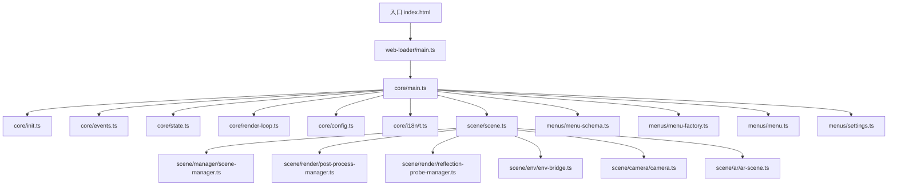
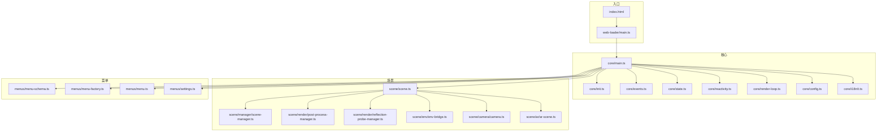
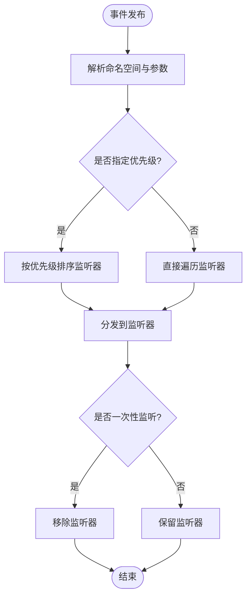
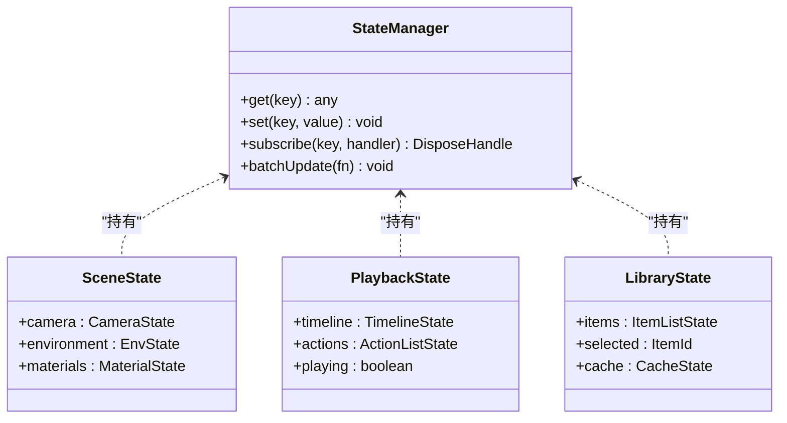
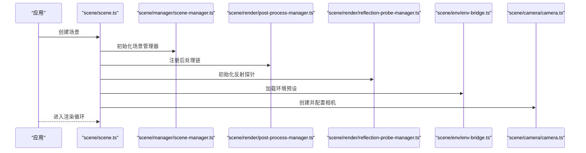
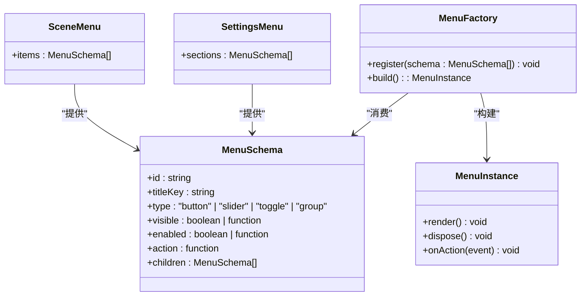
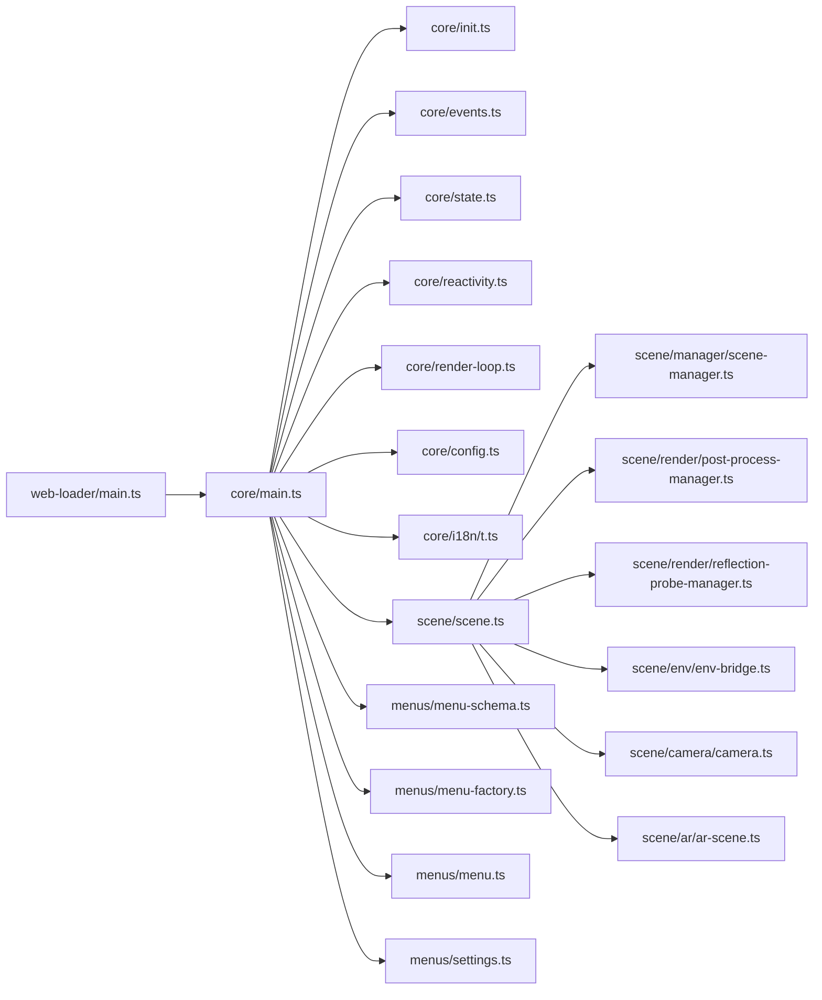

# 前端架构

<cite>
**本文引用的文件**   
- [frontend/src/core/main.ts](file://frontend/src/core/main.ts)
- [frontend/src/core/init.ts](file://frontend/src/core/init.ts)
- [frontend/src/core/events.ts](file://frontend/src/core/events.ts)
- [frontend/src/core/state.ts](file://frontend/src/core/state.ts)
- [frontend/src/core/reactivity.ts](file://frontend/src/core/reactivity.ts)
- [frontend/src/core/scene-state.ts](file://frontend/src/core/scene-state.ts)
- [frontend/src/core/playback-state.ts](file://frontend/src/core/playback-state.ts)
- [frontend/src/core/library-state.ts](file://frontend/src/core/library-state.ts)
- [frontend/src/core/render-loop.ts](file://frontend/src/core/render-loop.ts)
- [frontend/src/core/config.ts](file://frontend/src/core/config.ts)
- [frontend/src/core/i18n/t.ts](file://frontend/src/core/i18n/t.ts)
- [frontend/src/core/i18n/locale.ts](file://frontend/src/core/i18n/locale.ts)
- [frontend/src/menus/menu-schema.ts](file://frontend/src/menus/menu-schema.ts)
- [frontend/src/menus/menu-factory.ts](file://frontend/src/menus/menu-factory.ts)
- [frontend/src/menus/menu.ts](file://frontend/src/menus/menu.ts)
- [frontend/src/menus/settings.ts](file://frontend/src/menus/settings.ts)
- [frontend/src/menus/scene-menu.ts](file://frontend/src/menus/scene-menu.ts)
- [frontend/src/menus/env-menu.ts](file://frontend/src/menus/env-menu.ts)
- [frontend/src/menus/model-detail.ts](file://frontend/src/menus/model-detail.ts)
- [frontend/src/menus/render-menu.ts](file://frontend/src/menus/render-menu.ts)
- [frontend/src/scene/scene.ts](file://frontend/src/scene/scene.ts)
- [frontend/src/scene/manager/scene-manager.ts](file://frontend/src/scene/manager/scene-manager.ts)
- [frontend/src/scene/render/post-process-manager.ts](file://frontend/src/scene/render/post-process-manager.ts)
- [frontend/src/scene/render/reflection-probe-manager.ts](file://frontend/src/scene/render/reflection-probe-manager.ts)
- [frontend/src/scene/env/env-bridge.ts](file://frontend/src/scene/env/env-bridge.ts)
- [frontend/src/scene/camera/camera.ts](file://frontend/src/scene/camera/camera.ts)
- [frontend/src/scene/ar/ar-scene.ts](file://frontend/src/scene/ar/ar-scene.ts)
- [frontend/src/web-loader/main.ts](file://frontend/src/web-loader/main.ts)
- [frontend/index.html](file://frontend/index.html)
</cite>

## 目录
1. [简介](#简介)
2. [项目结构](#项目结构)
3. [核心组件](#核心组件)
4. [架构总览](#架构总览)
5. [详细组件分析](#详细组件分析)
6. [依赖关系分析](#依赖关系分析)
7. [性能考量](#性能考量)
8. [故障排查指南](#故障排查指南)
9. [结论](#结论)
10. [附录](#附录)

## 简介
本文件面向基于 TypeScript 的前端应用，系统性阐述其模块组织、状态管理、事件驱动架构与 Babylon.js 3D 渲染集成方案。文档覆盖声明式菜单系统（注册机制、权限控制、国际化）、资源管理与插件化扩展点设计，并提供可操作的代码路径与使用模式，帮助开发者快速理解并扩展功能。

## 项目结构
前端采用“领域分层 + 模块化”的组织方式：
- core：运行时基础设施（初始化、事件总线、状态、渲染循环、配置、i18n）
- scene：场景与渲染子系统（场景生命周期、相机、环境、后处理、反射探针、AR）
- menus：声明式菜单系统与面板（注册、工厂、权限、国际化）
- web-loader：Web 入口与加载器
- assets/public：静态资源与第三方库



图表来源
- [frontend/index.html:1-200](file://frontend/index.html#L1-L200)
- [frontend/src/web-loader/main.ts:1-200](file://frontend/src/web-loader/main.ts#L1-L200)
- [frontend/src/core/main.ts:1-200](file://frontend/src/core/main.ts#L1-L200)
- [frontend/src/core/init.ts:1-200](file://frontend/src/core/init.ts#L1-L200)
- [frontend/src/core/events.ts:1-200](file://frontend/src/core/events.ts#L1-L200)
- [frontend/src/core/state.ts:1-200](file://frontend/src/core/state.ts#L1-L200)
- [frontend/src/core/render-loop.ts:1-200](file://frontend/src/core/render-loop.ts#L1-L200)
- [frontend/src/core/config.ts:1-200](file://frontend/src/core/config.ts#L1-L200)
- [frontend/src/core/i18n/t.ts:1-200](file://frontend/src/core/i18n/t.ts#L1-L200)
- [frontend/src/scene/scene.ts:1-200](file://frontend/src/scene/scene.ts#L1-L200)
- [frontend/src/scene/manager/scene-manager.ts:1-200](file://frontend/src/scene/manager/scene-manager.ts#L1-L200)
- [frontend/src/scene/render/post-process-manager.ts:1-200](file://frontend/src/scene/render/post-process-manager.ts#L1-L200)
- [frontend/src/scene/render/reflection-probe-manager.ts:1-200](file://frontend/src/scene/render/reflection-probe-manager.ts#L1-L200)
- [frontend/src/scene/env/env-bridge.ts:1-200](file://frontend/src/scene/env/env-bridge.ts#L1-L200)
- [frontend/src/scene/camera/camera.ts:1-200](file://frontend/src/scene/camera/camera.ts#L1-L200)
- [frontend/src/scene/ar/ar-scene.ts:1-200](file://frontend/src/scene/ar/ar-scene.ts#L1-L200)
- [frontend/src/menus/menu-schema.ts:1-200](file://frontend/src/menus/menu-schema.ts#L1-L200)
- [frontend/src/menus/menu-factory.ts:1-200](file://frontend/src/menus/menu-factory.ts#L1-L200)
- [frontend/src/menus/menu.ts:1-200](file://frontend/src/menus/menu.ts#L1-L200)
- [frontend/src/menus/settings.ts:1-200](file://frontend/src/menus/settings.ts#L1-L200)

章节来源
- [frontend/index.html:1-200](file://frontend/index.html#L1-L200)
- [frontend/src/web-loader/main.ts:1-200](file://frontend/src/web-loader/main.ts#L1-L200)
- [frontend/src/core/main.ts:1-200](file://frontend/src/core/main.ts#L1-L200)

## 核心组件
- 启动与初始化
  - 入口由 HTML 引入 loader，loader 负责挂载 DOM、注入样式与脚本，随后调用 core 的 main 进行应用初始化。
  - core/main 负责装配事件总线、状态、配置、i18n、渲染循环与场景管理器，完成全局单例与上下文构建。
  - core/init 提供生命周期钩子与错误边界，确保在异常时仍可降级运行。

- 事件驱动
  - core/events 实现发布/订阅模型，支持命名空间、优先级与一次性监听，贯穿 UI、场景、动作与设置等子系统。

- 状态管理
  - core/state 提供响应式状态容器；core/reactivity 提供细粒度观察与批量更新能力。
  - 业务状态按领域拆分：scene-state（场景）、playback-state（播放）、library-state（素材库），避免单体状态膨胀。

- 渲染循环
  - core/render-loop 封装帧调度、节流与暂停恢复，统一触发场景更新与 UI 刷新。

- 配置与国际化
  - core/config 提供运行时配置读取与热更新。
  - core/i18n/t 与 locale 提供键值翻译与语言切换。

章节来源
- [frontend/src/web-loader/main.ts:1-200](file://frontend/src/web-loader/main.ts#L1-L200)
- [frontend/src/core/main.ts:1-200](file://frontend/src/core/main.ts#L1-L200)
- [frontend/src/core/init.ts:1-200](file://frontend/src/core/init.ts#L1-L200)
- [frontend/src/core/events.ts:1-200](file://frontend/src/core/events.ts#L1-L200)
- [frontend/src/core/state.ts:1-200](file://frontend/src/core/state.ts#L1-L200)
- [frontend/src/core/reactivity.ts:1-200](file://frontend/src/core/reactivity.ts#L1-L200)
- [frontend/src/core/scene-state.ts:1-200](file://frontend/src/core/scene-state.ts#L1-L200)
- [frontend/src/core/playback-state.ts:1-200](file://frontend/src/core/playback-state.ts#L1-L200)
- [frontend/src/core/library-state.ts:1-200](file://frontend/src/core/library-state.ts#L1-L200)
- [frontend/src/core/render-loop.ts:1-200](file://frontend/src/core/render-loop.ts#L1-L200)
- [frontend/src/core/config.ts:1-200](file://frontend/src/core/config.ts#L1-L200)
- [frontend/src/core/i18n/t.ts:1-200](file://frontend/src/core/i18n/t.ts#L1-L200)
- [frontend/src/core/i18n/locale.ts:1-200](file://frontend/src/core/i18n/locale.ts#L1-L200)

## 架构总览
整体采用“入口 -> 核心 -> 场景/菜单”的分层架构。核心负责装配与协调，场景与菜单作为可扩展子系统通过事件与状态进行解耦通信。



图表来源
- [frontend/index.html:1-200](file://frontend/index.html#L1-L200)
- [frontend/src/web-loader/main.ts:1-200](file://frontend/src/web-loader/main.ts#L1-L200)
- [frontend/src/core/main.ts:1-200](file://frontend/src/core/main.ts#L1-L200)
- [frontend/src/core/init.ts:1-200](file://frontend/src/core/init.ts#L1-L200)
- [frontend/src/core/events.ts:1-200](file://frontend/src/core/events.ts#L1-L200)
- [frontend/src/core/state.ts:1-200](file://frontend/src/core/state.ts#L1-L200)
- [frontend/src/core/reactivity.ts:1-200](file://frontend/src/core/reactivity.ts#L1-L200)
- [frontend/src/core/render-loop.ts:1-200](file://frontend/src/core/render-loop.ts#L1-L200)
- [frontend/src/core/config.ts:1-200](file://frontend/src/core/config.ts#L1-L200)
- [frontend/src/core/i18n/t.ts:1-200](file://frontend/src/core/i18n/t.ts#L1-L200)
- [frontend/src/scene/scene.ts:1-200](file://frontend/src/scene/scene.ts#L1-L200)
- [frontend/src/scene/manager/scene-manager.ts:1-200](file://frontend/src/scene/manager/scene-manager.ts#L1-L200)
- [frontend/src/scene/render/post-process-manager.ts:1-200](file://frontend/src/scene/render/post-process-manager.ts#L1-L200)
- [frontend/src/scene/render/reflection-probe-manager.ts:1-200](file://frontend/src/scene/render/reflection-probe-manager.ts#L1-L200)
- [frontend/src/scene/env/env-bridge.ts:1-200](file://frontend/src/scene/env/env-bridge.ts#L1-L200)
- [frontend/src/scene/camera/camera.ts:1-200](file://frontend/src/scene/camera/camera.ts#L1-L200)
- [frontend/src/scene/ar/ar-scene.ts:1-200](file://frontend/src/scene/ar/ar-scene.ts#L1-L200)
- [frontend/src/menus/menu-schema.ts:1-200](file://frontend/src/menus/menu-schema.ts#L1-L200)
- [frontend/src/menus/menu-factory.ts:1-200](file://frontend/src/menus/menu-factory.ts#L1-L200)
- [frontend/src/menus/menu.ts:1-200](file://frontend/src/menus/menu.ts#L1-L200)
- [frontend/src/menus/settings.ts:1-200](file://frontend/src/menus/settings.ts#L1-L200)

## 详细组件分析

### 启动与初始化流程
- 入口 HTML 引入 loader，loader 创建根节点并注入基础样式与脚本。
- core/main 执行以下关键步骤：
  - 初始化 i18n 与配置
  - 注册全局事件总线
  - 构建响应式状态与观察者
  - 启动渲染循环
  - 初始化场景与菜单系统
- core/init 提供 try/catch 包裹与错误上报，保证崩溃不阻断主流程。

```mermaid
sequenceDiagram
participant U as "用户"
participant HTML as "index.html"
participant Loader as "web-loader/main.ts"
participant Core as "core/main.ts"
participant Init as "core/init.ts"
participant Events as "core/events.ts"
participant State as "core/state.ts"
participant Loop as "core/render-loop.ts"
participant Scene as "scene/scene.ts"
participant Menu as "menus/menu.ts"
U->>HTML : 打开页面
HTML->>Loader : 加载并执行
Loader->>Core : 调用初始化入口
Core->>Init : 执行初始化与错误边界
Core->>Events : 注册事件总线
Core->>State : 构建响应式状态
Core->>Loop : 启动渲染循环
Core->>Scene : 创建场景实例
Core->>Menu : 注册菜单与面板
Core-->>U : 应用就绪
```

图表来源
- [frontend/index.html:1-200](file://frontend/index.html#L1-L200)
- [frontend/src/web-loader/main.ts:1-200](file://frontend/src/web-loader/main.ts#L1-L200)
- [frontend/src/core/main.ts:1-200](file://frontend/src/core/main.ts#L1-L200)
- [frontend/src/core/init.ts:1-200](file://frontend/src/core/init.ts#L1-L200)
- [frontend/src/core/events.ts:1-200](file://frontend/src/core/events.ts#L1-L200)
- [frontend/src/core/state.ts:1-200](file://frontend/src/core/state.ts#L1-L200)
- [frontend/src/core/render-loop.ts:1-200](file://frontend/src/core/render-loop.ts#L1-L200)
- [frontend/src/scene/scene.ts:1-200](file://frontend/src/scene/scene.ts#L1-L200)
- [frontend/src/menus/menu.ts:1-200](file://frontend/src/menus/menu.ts#L1-L200)

章节来源
- [frontend/src/web-loader/main.ts:1-200](file://frontend/src/web-loader/main.ts#L1-L200)
- [frontend/src/core/main.ts:1-200](file://frontend/src/core/main.ts#L1-L200)
- [frontend/src/core/init.ts:1-200](file://frontend/src/core/init.ts#L1-L200)

### 事件驱动架构
- 事件总线提供命名空间、优先级与一次性监听能力，用于跨模块通信（如 UI 操作、场景变更、播放控制）。
- 典型事件流：UI 菜单点击 -> 发布命令事件 -> 对应处理器执行业务逻辑 -> 更新状态 -> 渲染循环自动刷新。



图表来源
- [frontend/src/core/events.ts:1-200](file://frontend/src/core/events.ts#L1-L200)

章节来源
- [frontend/src/core/events.ts:1-200](file://frontend/src/core/events.ts#L1-L200)

### 状态管理模式
- 状态容器位于 core/state，结合 core/reactivity 提供细粒度观察与批量更新。
- 业务状态按领域拆分：
  - scene-state：场景相关（相机、环境、材质等）
  - playback-state：播放控制（时间轴、动作列表、播放状态）
  - library-state：素材库（浏览、选择、缓存）
- 推荐模式：
  - 只读视图绑定：UI 仅订阅状态变化
  - 命令式更新：通过事件或方法修改状态，避免直接赋值
  - 批量更新：对高频更新使用批量提交，减少重绘



图表来源
- [frontend/src/core/state.ts:1-200](file://frontend/src/core/state.ts#L1-L200)
- [frontend/src/core/reactivity.ts:1-200](file://frontend/src/core/reactivity.ts#L1-L200)
- [frontend/src/core/scene-state.ts:1-200](file://frontend/src/core/scene-state.ts#L1-L200)
- [frontend/src/core/playback-state.ts:1-200](file://frontend/src/core/playback-state.ts#L1-L200)
- [frontend/src/core/library-state.ts:1-200](file://frontend/src/core/library-state.ts#L1-L200)

章节来源
- [frontend/src/core/state.ts:1-200](file://frontend/src/core/state.ts#L1-L200)
- [frontend/src/core/reactivity.ts:1-200](file://frontend/src/core/reactivity.ts#L1-L200)
- [frontend/src/core/scene-state.ts:1-200](file://frontend/src/core/scene-state.ts#L1-L200)
- [frontend/src/core/playback-state.ts:1-200](file://frontend/src/core/playback-state.ts#L1-L200)
- [frontend/src/core/library-state.ts:1-200](file://frontend/src/core/library-state.ts#L1-L200)

### Babylon.js 3D 渲染集成
- 场景管理
  - scene/scene.ts 负责场景生命周期（创建、销毁、重置）与子系统装配。
  - scene/manager/scene-manager.ts 提供多场景切换、共享资源与内存管理。
- 渲染管线定制
  - scene/render/post-process-manager.ts 统一管理后处理链（SSR、反射探针、色调映射等）。
  - scene/render/reflection-probe-manager.ts 管理反射探针的生成与更新策略。
- 环境与相机
  - scene/env/env-bridge.ts 桥接环境预设与运行时参数。
  - scene/camera/camera.ts 封装相机控制与输入适配。
- AR 模式
  - scene/ar/ar-scene.ts 提供 AR 场景初始化与设备能力检测。



图表来源
- [frontend/src/scene/scene.ts:1-200](file://frontend/src/scene/scene.ts#L1-L200)
- [frontend/src/scene/manager/scene-manager.ts:1-200](file://frontend/src/scene/manager/scene-manager.ts#L1-L200)
- [frontend/src/scene/render/post-process-manager.ts:1-200](file://frontend/src/scene/render/post-process-manager.ts#L1-L200)
- [frontend/src/scene/render/reflection-probe-manager.ts:1-200](file://frontend/src/scene/render/reflection-probe-manager.ts#L1-L200)
- [frontend/src/scene/env/env-bridge.ts:1-200](file://frontend/src/scene/env/env-bridge.ts#L1-L200)
- [frontend/src/scene/camera/camera.ts:1-200](file://frontend/src/scene/camera/camera.ts#L1-L200)

章节来源
- [frontend/src/scene/scene.ts:1-200](file://frontend/src/scene/scene.ts#L1-L200)
- [frontend/src/scene/manager/scene-manager.ts:1-200](file://frontend/src/scene/manager/scene-manager.ts#L1-L200)
- [frontend/src/scene/render/post-process-manager.ts:1-200](file://frontend/src/scene/render/post-process-manager.ts#L1-L200)
- [frontend/src/scene/render/reflection-probe-manager.ts:1-200](file://frontend/src/scene/render/reflection-probe-manager.ts#L1-L200)
- [frontend/src/scene/env/env-bridge.ts:1-200](file://frontend/src/scene/env/env-bridge.ts#L1-L200)
- [frontend/src/scene/camera/camera.ts:1-200](file://frontend/src/scene/camera/camera.ts#L1-L200)
- [frontend/src/scene/ar/ar-scene.ts:1-200](file://frontend/src/scene/ar/ar-scene.ts#L1-L200)

### 声明式菜单系统
- 菜单注册机制
  - menus/menu-schema.ts 定义菜单项的声明式 schema（类型、标题、可见性、权限、回调等）。
  - menus/menu-factory.ts 根据 schema 动态构建菜单实例，支持分组与层级。
  - menus/menu.ts 提供菜单实例的生命周期与交互绑定。
- 权限控制
  - 通过 schema 中的权限字段与运行时角色判断，控制菜单显示与可用状态。
- 国际化支持
  - 菜单标题与描述通过 i18n 键引用，随语言切换实时更新。
- 常用菜单模块
  - settings.ts：设置面板集合
  - scene-menu.ts：场景相关菜单
  - env-menu.ts：环境相关菜单
  - model-detail.ts：模型详情面板
  - render-menu.ts：渲染选项菜单



图表来源
- [frontend/src/menus/menu-schema.ts:1-200](file://frontend/src/menus/menu-schema.ts#L1-L200)
- [frontend/src/menus/menu-factory.ts:1-200](file://frontend/src/menus/menu-factory.ts#L1-L200)
- [frontend/src/menus/menu.ts:1-200](file://frontend/src/menus/menu.ts#L1-L200)
- [frontend/src/menus/settings.ts:1-200](file://frontend/src/menus/settings.ts#L1-L200)
- [frontend/src/menus/scene-menu.ts:1-200](file://frontend/src/menus/scene-menu.ts#L1-L200)
- [frontend/src/menus/env-menu.ts:1-200](file://frontend/src/menus/env-menu.ts#L1-L200)
- [frontend/src/menus/model-detail.ts:1-200](file://frontend/src/menus/model-detail.ts#L1-L200)
- [frontend/src/menus/render-menu.ts:1-200](file://frontend/src/menus/render-menu.ts#L1-L200)

章节来源
- [frontend/src/menus/menu-schema.ts:1-200](file://frontend/src/menus/menu-schema.ts#L1-L200)
- [frontend/src/menus/menu-factory.ts:1-200](file://frontend/src/menus/menu-factory.ts#L1-L200)
- [frontend/src/menus/menu.ts:1-200](file://frontend/src/menus/menu.ts#L1-L200)
- [frontend/src/menus/settings.ts:1-200](file://frontend/src/menus/settings.ts#L1-L200)
- [frontend/src/menus/scene-menu.ts:1-200](file://frontend/src/menus/scene-menu.ts#L1-L200)
- [frontend/src/menus/env-menu.ts:1-200](file://frontend/src/menus/env-menu.ts#L1-L200)
- [frontend/src/menus/model-detail.ts:1-200](file://frontend/src/menus/model-detail.ts#L1-L200)
- [frontend/src/menus/render-menu.ts:1-200](file://frontend/src/menus/render-menu.ts#L1-L200)

### 资源管理系统
- 资源定位与加载
  - 通过 core/config 提供的资源基址与版本信息，统一资源路径解析。
  - 使用浏览器原生 fetch/URL API 或后端代理进行资源下载与缓存。
- 缓存策略
  - 针对纹理、模型与音频实施分级缓存（内存缓存 + 磁盘缓存）。
  - 提供失效与预热接口，保障首屏与切换场景的性能。
- 错误处理与重试
  - 统一的加载失败重试与降级策略，记录诊断日志。

章节来源
- [frontend/src/core/config.ts:1-200](file://frontend/src/core/config.ts#L1-L200)

### 插件架构与扩展点
- 扩展点设计
  - 通过事件总线暴露扩展点（如 onSceneReady、onMenuBuild、onRenderFrame），允许外部插件注入行为。
  - 菜单系统支持动态注册新菜单项，无需修改核心代码。
- 插件生命周期
  - 初始化阶段：注册事件与菜单
  - 运行阶段：监听事件并更新状态
  - 销毁阶段：释放资源与取消监听
- 安全与隔离
  - 插件沙箱限制访问敏感 API，所有扩展需通过白名单校验。

章节来源
- [frontend/src/core/events.ts:1-200](file://frontend/src/core/events.ts#L1-L200)
- [frontend/src/menus/menu-factory.ts:1-200](file://frontend/src/menus/menu-factory.ts#L1-L200)

## 依赖关系分析
- 核心依赖
  - web-loader 依赖 core/main 与 core/init
  - core/main 依赖 events、state、reactivity、render-loop、config、i18n
  - scene 依赖 manager、render、env、camera、ar
  - menus 依赖 schema、factory、menu、settings
- 潜在耦合
  - 场景与渲染子系统存在较强耦合，建议通过接口抽象降低直接依赖
  - 菜单与状态之间通过事件解耦，保持低耦合高内聚



图表来源
- [frontend/src/web-loader/main.ts:1-200](file://frontend/src/web-loader/main.ts#L1-L200)
- [frontend/src/core/main.ts:1-200](file://frontend/src/core/main.ts#L1-L200)
- [frontend/src/core/init.ts:1-200](file://frontend/src/core/init.ts#L1-L200)
- [frontend/src/core/events.ts:1-200](file://frontend/src/core/events.ts#L1-L200)
- [frontend/src/core/state.ts:1-200](file://frontend/src/core/state.ts#L1-L200)
- [frontend/src/core/reactivity.ts:1-200](file://frontend/src/core/reactivity.ts#L1-L200)
- [frontend/src/core/render-loop.ts:1-200](file://frontend/src/core/render-loop.ts#L1-L200)
- [frontend/src/core/config.ts:1-200](file://frontend/src/core/config.ts#L1-L200)
- [frontend/src/core/i18n/t.ts:1-200](file://frontend/src/core/i18n/t.ts#L1-L200)
- [frontend/src/scene/scene.ts:1-200](file://frontend/src/scene/scene.ts#L1-L200)
- [frontend/src/scene/manager/scene-manager.ts:1-200](file://frontend/src/scene/manager/scene-manager.ts#L1-L200)
- [frontend/src/scene/render/post-process-manager.ts:1-200](file://frontend/src/scene/render/post-process-manager.ts#L1-L200)
- [frontend/src/scene/render/reflection-probe-manager.ts:1-200](file://frontend/src/scene/render/reflection-probe-manager.ts#L1-L200)
- [frontend/src/scene/env/env-bridge.ts:1-200](file://frontend/src/scene/env/env-bridge.ts#L1-L200)
- [frontend/src/scene/camera/camera.ts:1-200](file://frontend/src/scene/camera/camera.ts#L1-L200)
- [frontend/src/scene/ar/ar-scene.ts:1-200](file://frontend/src/scene/ar/ar-scene.ts#L1-L200)
- [frontend/src/menus/menu-schema.ts:1-200](file://frontend/src/menus/menu-schema.ts#L1-L200)
- [frontend/src/menus/menu-factory.ts:1-200](file://frontend/src/menus/menu-factory.ts#L1-L200)
- [frontend/src/menus/menu.ts:1-200](file://frontend/src/menus/menu.ts#L1-L200)
- [frontend/src/menus/settings.ts:1-200](file://frontend/src/menus/settings.ts#L1-L200)

章节来源
- [frontend/src/core/main.ts:1-200](file://frontend/src/core/main.ts#L1-L200)
- [frontend/src/scene/scene.ts:1-200](file://frontend/src/scene/scene.ts#L1-L200)
- [frontend/src/menus/menu-factory.ts:1-200](file://frontend/src/menus/menu-factory.ts#L1-L200)

## 性能考量
- 渲染循环优化
  - 使用 requestAnimationFrame 与节流策略，避免不必要的重绘
  - 将高频更新合并为批量提交，减少状态变更次数
- 资源加载优化
  - 预加载关键资源，延迟非关键资源
  - 使用纹理压缩与按需加载，降低内存占用
- 后处理与反射探针
  - 合理设置分辨率与更新频率，避免每帧全量计算
  - 使用增量更新与视锥剔除，减少无效计算
- 事件与状态
  - 避免在事件处理器中执行耗时任务，必要时异步派发
  - 使用一次性监听减少内存泄漏风险

[本节为通用指导，不直接分析具体文件]

## 故障排查指南
- 常见问题
  - 菜单不显示：检查 schema 的 visible/enabled 条件与权限配置
  - 场景黑屏：确认相机、光源与环境预设是否正确初始化
  - 资源 404：核对资源基址与网络代理配置
- 调试技巧
  - 启用 i18n 键缺失检测，避免硬编码文本
  - 使用事件总线日志输出，追踪消息流向
  - 监控渲染循环帧率与内存峰值，定位瓶颈

章节来源
- [frontend/src/core/i18n/t.ts:1-200](file://frontend/src/core/i18n/t.ts#L1-L200)
- [frontend/src/core/events.ts:1-200](file://frontend/src/core/events.ts#L1-L200)
- [frontend/src/core/config.ts:1-200](file://frontend/src/core/config.ts#L1-L200)

## 结论
本前端架构以事件驱动与响应式状态为核心，结合声明式菜单与可扩展的渲染子系统，实现了高内聚、低耦合的可维护体系。通过合理的资源管理与性能优化策略，能够在复杂 3D 场景中保持稳定表现。开发者可基于现有扩展点与安全沙箱，快速添加新功能与插件，提升产品能力与用户体验。

## 附录
- 使用模式示例（路径指引）
  - 注册新菜单项：参考 [menus/menu-schema.ts:1-200](file://frontend/src/menus/menu-schema.ts#L1-L200)、[menus/menu-factory.ts:1-200](file://frontend/src/menus/menu-factory.ts#L1-L200)
  - 监听场景事件：参考 [core/events.ts:1-200](file://frontend/src/core/events.ts#L1-L200)、[scene/scene.ts:1-200](file://frontend/src/scene/scene.ts#L1-L200)
  - 自定义后处理效果：参考 [scene/render/post-process-manager.ts:1-200](file://frontend/src/scene/render/post-process-manager.ts#L1-L200)
  - 切换语言与国际化：参考 [core/i18n/t.ts:1-200](file://frontend/src/core/i18n/t.ts#L1-L200)、[core/i18n/locale.ts:1-200](file://frontend/src/core/i18n/locale.ts#L1-L200)