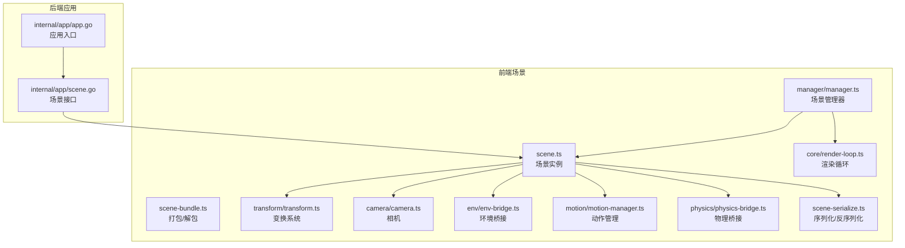
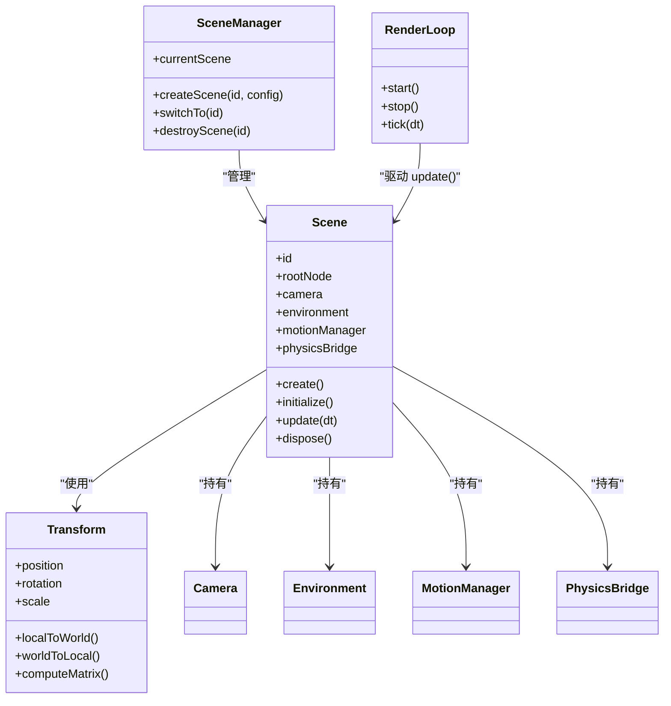
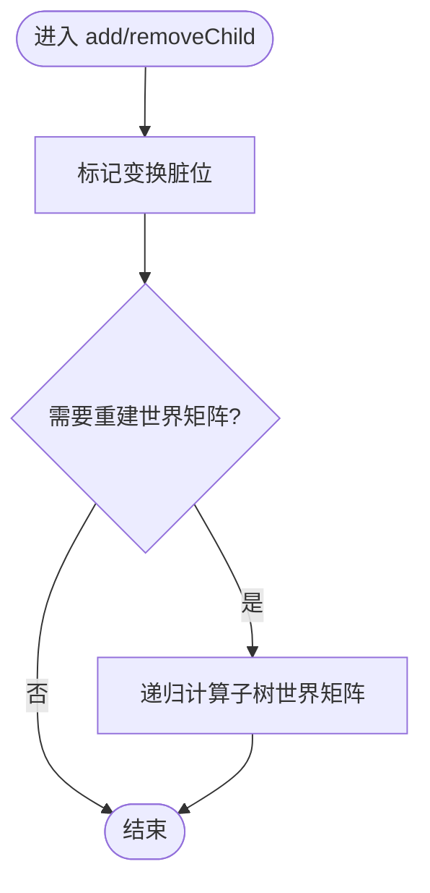
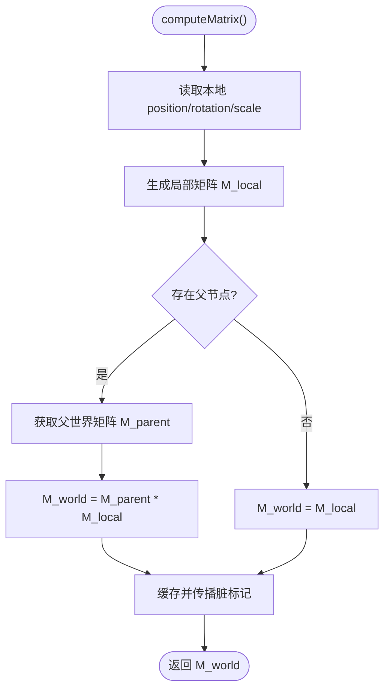
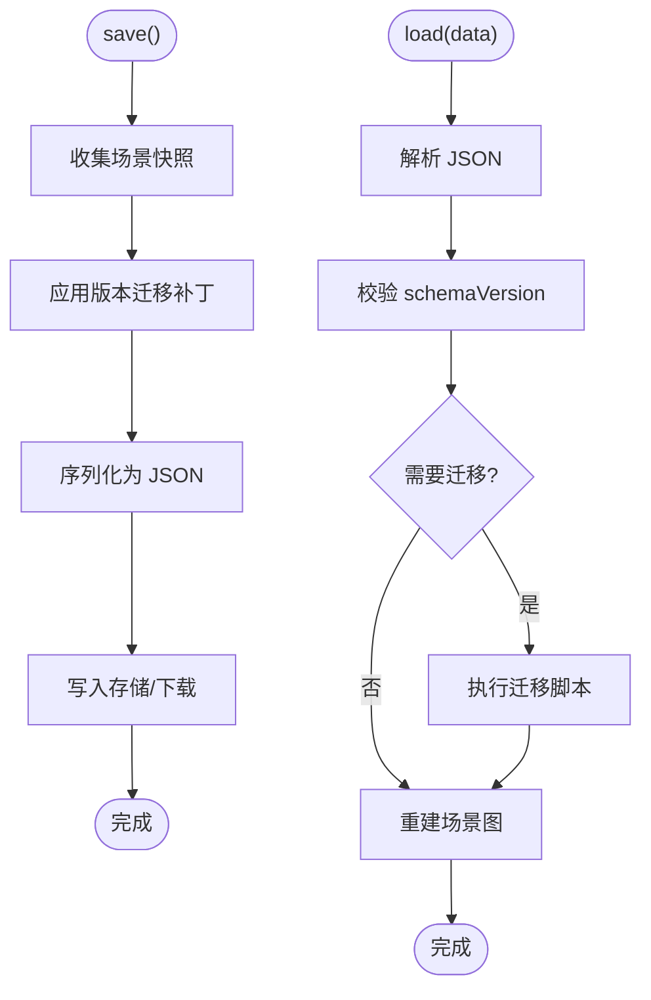
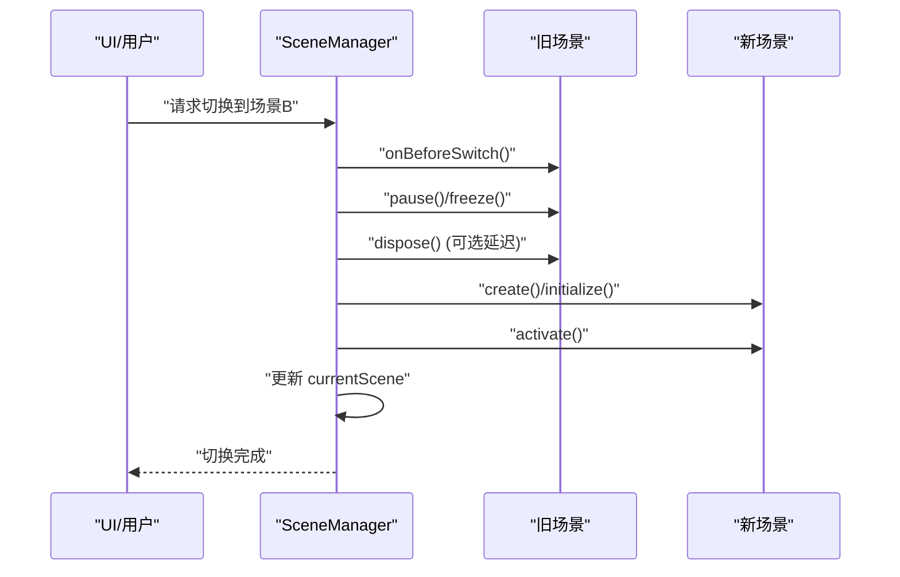
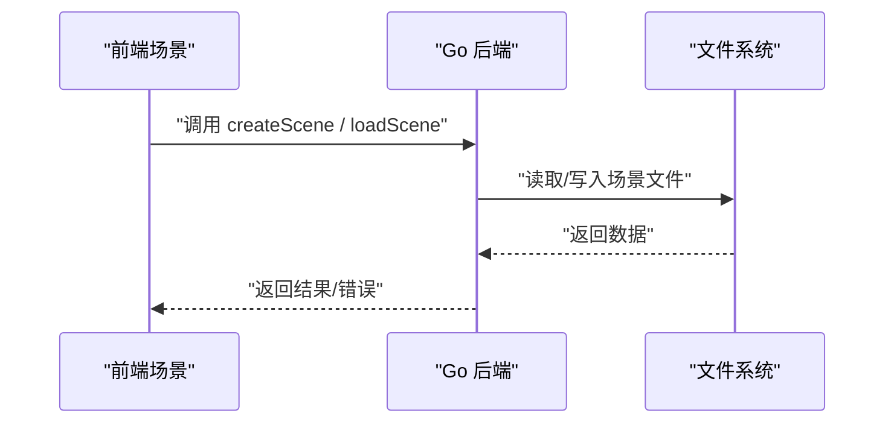
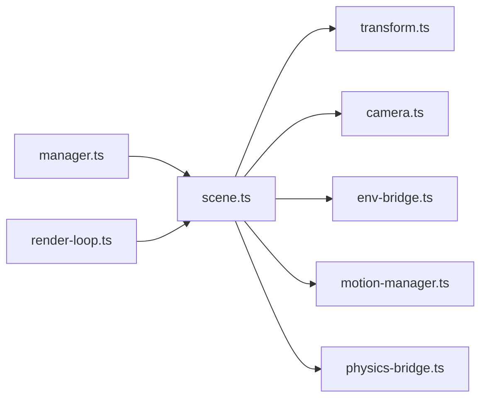

# 场景管理系统

<cite>
**本文引用的文件**   
- [scene.ts](file://frontend/src/scene/scene.ts)
- [scene-bundle.ts](file://frontend/src/scene/scene-bundle.ts)
- [scene-serialize.ts](file://frontend/src/scene/scene-serialize.ts)
- [transform.ts](file://frontend/src/scene/transform/transform.ts)
- [manager.ts](file://frontend/src/scene/manager/manager.ts)
- [camera.ts](file://frontend/src/scene/camera/camera.ts)
- [env-bridge.ts](file://frontend/src/scene/env/env-bridge.ts)
- [physics-bridge.ts](file://frontend/src/physics/physics-bridge.ts)
- [motion-manager.ts](file://frontend/src/scene/motion/motion-manager.ts)
- [render-loop.ts](file://frontend/src/core/render-loop.ts)
- [app.go](file://internal/app/app.go)
- [scene.go](file://internal/app/scene.go)
</cite>

## 目录
1. [简介](#简介)
2. [项目结构](#项目结构)
3. [核心组件](#核心组件)
4. [架构总览](#架构总览)
5. [详细组件分析](#详细组件分析)
6. [依赖分析](#依赖分析)
7. [性能考虑](#性能考虑)
8. [故障排查指南](#故障排查指南)
9. [结论](#结论)
10. [附录](#附录)

## 简介
本文件面向“场景管理系统”，聚焦以下目标：
- 3D 场景生命周期管理：创建、初始化、销毁流程与状态机
- 场景对象模型：场景图结构、节点变换关系、父子层级管理
- 场景序列化机制：保存格式、版本兼容、增量更新策略
- 变换系统实现：坐标变换、矩阵运算、空间转换
- 操作示例：如何操作场景对象、管理场景状态、实现场景切换

## 项目结构
前端场景子系统位于 frontend/src/scene，围绕 scene.ts 构建场景实例，scene-bundle.ts 提供打包/解包能力，scene-serialize.ts 负责持久化。transform 子模块统一变换语义；manager 管理多场景实例；camera、env、motion、physics 等子系统通过桥接或组合接入场景。后端 internal/app 提供应用级场景入口与跨进程交互。



图表来源
- [scene.ts:1-200](file://frontend/src/scene/scene.ts#L1-L200)
- [scene-bundle.ts:1-200](file://frontend/src/scene/scene-bundle.ts#L1-L200)
- [scene-serialize.ts:1-200](file://frontend/src/scene/scene-serialize.ts#L1-L200)
- [transform.ts:1-200](file://frontend/src/scene/transform/transform.ts#L1-L200)
- [manager.ts:1-200](file://frontend/src/scene/manager/manager.ts#L1-L200)
- [camera.ts:1-200](file://frontend/src/scene/camera/camera.ts#L1-L200)
- [env-bridge.ts:1-200](file://frontend/src/scene/env/env-bridge.ts#L1-L200)
- [physics-bridge.ts:1-200](file://frontend/src/physics/physics-bridge.ts#L1-L200)
- [motion-manager.ts:1-200](file://frontend/src/scene/motion/motion-manager.ts#L1-L200)
- [render-loop.ts:1-200](file://frontend/src/core/render-loop.ts#L1-L200)
- [app.go:1-200](file://internal/app/app.go#L1-L200)
- [scene.go:1-200](file://internal/app/scene.go#L1-L200)

章节来源
- [scene.ts:1-200](file://frontend/src/scene/scene.ts#L1-L200)
- [manager.ts:1-200](file://frontend/src/scene/manager/manager.ts#L1-L200)
- [render-loop.ts:1-200](file://frontend/src/core/render-loop.ts#L1-L200)
- [app.go:1-200](file://internal/app/app.go#L1-L200)
- [scene.go:1-200](file://internal/app/scene.go#L1-L200)

## 核心组件
- 场景实例（scene.ts）：封装场景图根节点、资源、子系统（相机、环境、动作、物理）、生命周期钩子、事件总线。
- 场景打包器（scene-bundle.ts）：将场景图、材质、纹理、动画等打包为可传输的中间表示，支持导出/导入。
- 序列化器（scene-serialize.ts）：定义场景数据格式、版本字段、迁移策略，提供 save/load/patch 能力。
- 变换系统（transform.ts）：提供位置/旋转/缩放、局部/世界坐标转换、矩阵合成与缓存。
- 场景管理器（manager.ts）：维护当前活跃场景、切换流程、资源隔离与清理。
- 相机（camera.ts）：绑定到场景，提供视角控制、投影、视口更新。
- 环境桥接（env-bridge.ts）：将天空盒、光照、雾效等环境参数注入场景。
- 动作管理（motion-manager.ts）：驱动骨骼动画、程序化动作、时间线同步。
- 物理桥接（physics-bridge.ts）：将碰撞体、重力、约束与场景节点关联。
- 渲染循环（render-loop.ts）：帧调度、步进、绘制调用编排。

章节来源
- [scene.ts:1-200](file://frontend/src/scene/scene.ts#L1-L200)
- [scene-bundle.ts:1-200](file://frontend/src/scene/scene-bundle.ts#L1-L200)
- [scene-serialize.ts:1-200](file://frontend/src/scene/scene-serialize.ts#L1-L200)
- [transform.ts:1-200](file://frontend/src/scene/transform/transform.ts#L1-L200)
- [manager.ts:1-200](file://frontend/src/scene/manager/manager.ts#L1-L200)
- [camera.ts:1-200](file://frontend/src/scene/camera/camera.ts#L1-L200)
- [env-bridge.ts:1-200](file://frontend/src/scene/env/env-bridge.ts#L1-L200)
- [motion-manager.ts:1-200](file://frontend/src/scene/motion/motion-manager.ts#L1-L200)
- [physics-bridge.ts:1-200](file://frontend/src/physics/physics-bridge.ts#L1-L200)
- [render-loop.ts:1-200](file://frontend/src/core/render-loop.ts#L1-L200)

## 架构总览
场景系统采用“实例 + 管理器 + 子系统”的分层设计。管理器负责多场景实例的创建、激活、切换与销毁；每个场景实例持有场景图根节点与子系统句柄；渲染循环驱动每帧更新。



图表来源
- [scene.ts:1-200](file://frontend/src/scene/scene.ts#L1-L200)
- [manager.ts:1-200](file://frontend/src/scene/manager/manager.ts#L1-L200)
- [transform.ts:1-200](file://frontend/src/scene/transform/transform.ts#L1-L200)
- [camera.ts:1-200](file://frontend/src/scene/camera/camera.ts#L1-L200)
- [env-bridge.ts:1-200](file://frontend/src/scene/env/env-bridge.ts#L1-L200)
- [motion-manager.ts:1-200](file://frontend/src/scene/motion/motion-manager.ts#L1-L200)
- [physics-bridge.ts:1-200](file://frontend/src/physics/physics-bridge.ts#L1-L200)
- [render-loop.ts:1-200](file://frontend/src/core/render-loop.ts#L1-L200)

## 详细组件分析

### 场景生命周期管理
- 创建：分配唯一 ID，构造场景图根节点，注册相机与环境默认值，准备动作与物理上下文。
- 初始化：加载资源（模型、纹理、材质），建立父子层级，计算初始变换，启动必要的监听器。
- 运行：每帧由渲染循环驱动 update(dt)，依次执行逻辑更新、物理步进、动画评估、渲染。
- 销毁：释放资源、断开监听、清空引用，确保无内存泄漏。

```mermaid
sequenceDiagram
participant App as "应用"
participant Manager as "SceneManager"
participant Scene as "Scene"
participant Loop as "RenderLoop"
App->>Manager : "创建场景(config)"
Manager->>Scene : "new Scene(id, config)"
Scene->>Scene : "create()"
Scene->>Scene : "initialize()"
Manager-->>App : "返回场景实例"
App->>Manager : "切换到该场景"
Manager->>Loop : "开始驱动"
Loop->>Scene : "每帧 update(dt)"
Scene->>Scene : "更新逻辑/物理/动画"
App->>Manager : "销毁场景"
Manager->>Scene : "dispose()"
Scene->>Scene : "释放资源/断开监听"
```

图表来源
- [manager.ts:1-200](file://frontend/src/scene/manager/manager.ts#L1-L200)
- [scene.ts:1-200](file://frontend/src/scene/scene.ts#L1-L200)
- [render-loop.ts:1-200](file://frontend/src/core/render-loop.ts#L1-L200)

章节来源
- [scene.ts:1-200](file://frontend/src/scene/scene.ts#L1-L200)
- [manager.ts:1-200](file://frontend/src/scene/manager/manager.ts#L1-L200)
- [render-loop.ts:1-200](file://frontend/src/core/render-loop.ts#L1-L200)

### 场景对象模型与场景图
- 场景图根节点：作为所有对象的父节点，维护全局变换与可见性。
- 节点层次：每个对象节点包含 transform、mesh、material、children 等属性，支持动态增删子节点。
- 父子层级管理：添加/移除子节点时自动更新脏标记，必要时重算世界矩阵。



图表来源
- [scene.ts:1-200](file://frontend/src/scene/scene.ts#L1-L200)
- [transform.ts:1-200](file://frontend/src/scene/transform/transform.ts#L1-L200)

章节来源
- [scene.ts:1-200](file://frontend/src/scene/scene.ts#L1-L200)
- [transform.ts:1-200](file://frontend/src/scene/transform/transform.ts#L1-L200)

### 变换系统实现
- 坐标变换：提供 localToWorld/worldToLocal 方法，基于父链累积矩阵。
- 矩阵运算：封装平移、旋转、缩放矩阵合成，支持四元数与欧拉角互转。
- 空间转换：在相机空间、世界空间、模型空间之间进行向量/点转换。



图表来源
- [transform.ts:1-200](file://frontend/src/scene/transform/transform.ts#L1-L200)

章节来源
- [transform.ts:1-200](file://frontend/src/scene/transform/transform.ts#L1-L200)

### 场景序列化机制
- 保存格式：以 JSON 描述场景图、节点属性、材质/纹理引用、动画片段、环境配置等。
- 版本兼容：在根对象中声明 schemaVersion，加载时根据版本执行迁移脚本。
- 增量更新：对新增字段提供默认值，对废弃字段提供映射规则，避免破坏旧场景。



图表来源
- [scene-serialize.ts:1-200](file://frontend/src/scene/scene-serialize.ts#L1-L200)
- [scene-bundle.ts:1-200](file://frontend/src/scene/scene-bundle.ts#L1-L200)

章节来源
- [scene-serialize.ts:1-200](file://frontend/src/scene/scene-serialize.ts#L1-L200)
- [scene-bundle.ts:1-200](file://frontend/src/scene/scene-bundle.ts#L1-L200)

### 场景切换与状态管理
- 切换流程：暂停旧场景、保存必要状态、释放旧资源、创建新场景、恢复相机与输入焦点。
- 状态管理：通过 manager 维护 currentScene，并提供 onBeforeSwitch/onAfterSwitch 钩子。
- 错误处理：切换失败回滚到上一场景，记录诊断信息。



图表来源
- [manager.ts:1-200](file://frontend/src/scene/manager/manager.ts#L1-L200)
- [scene.ts:1-200](file://frontend/src/scene/scene.ts#L1-L200)

章节来源
- [manager.ts:1-200](file://frontend/src/scene/manager/manager.ts#L1-L200)
- [scene.ts:1-200](file://frontend/src/scene/scene.ts#L1-L200)

### 与后端应用的集成
- 应用入口（app.go）：初始化 Wails 运行时、挂载前端、暴露场景相关 API。
- 场景接口（scene.go）：定义前后端共享的场景操作契约，如创建、加载、保存、销毁。



图表来源
- [app.go:1-200](file://internal/app/app.go#L1-L200)
- [scene.go:1-200](file://internal/app/scene.go#L1-L200)

章节来源
- [app.go:1-200](file://internal/app/app.go#L1-L200)
- [scene.go:1-200](file://internal/app/scene.go#L1-L200)

## 依赖分析
- 内聚性：scene.ts 聚合各子系统，职责清晰；transform.ts 专注数学与矩阵，耦合度低。
- 耦合关系：manager 与 render-loop 强耦合于场景生命周期；scene 与 camera/env/motion/physics 松耦合通过接口/桥接。
- 外部依赖：WASM 物理、WebGL/Babylon 渲染管线通过桥接层隔离。



图表来源
- [manager.ts:1-200](file://frontend/src/scene/manager/manager.ts#L1-L200)
- [scene.ts:1-200](file://frontend/src/scene/scene.ts#L1-L200)
- [transform.ts:1-200](file://frontend/src/scene/transform/transform.ts#L1-L200)
- [camera.ts:1-200](file://frontend/src/scene/camera/camera.ts#L1-L200)
- [env-bridge.ts:1-200](file://frontend/src/scene/env/env-bridge.ts#L1-L200)
- [motion-manager.ts:1-200](file://frontend/src/scene/motion/motion-manager.ts#L1-L200)
- [physics-bridge.ts:1-200](file://frontend/src/physics/physics-bridge.ts#L1-L200)
- [render-loop.ts:1-200](file://frontend/src/core/render-loop.ts#L1-L200)

章节来源
- [manager.ts:1-200](file://frontend/src/scene/manager/manager.ts#L1-L200)
- [scene.ts:1-200](file://frontend/src/scene/scene.ts#L1-L200)
- [render-loop.ts:1-200](file://frontend/src/core/render-loop.ts#L1-L200)

## 性能考虑
- 变换缓存：对世界矩阵进行缓存与脏标记，仅在局部变换变化时重算。
- 批量更新：合并多次父子变更，减少矩阵重算次数。
- 异步加载：模型/纹理按需加载，避免主线程阻塞。
- 物理步进：固定步长与插值，降低抖动与掉帧风险。
- 渲染优化：剔除不可见节点、合并批次、减少状态切换。

[本节为通用指导，不直接分析具体文件]

## 故障排查指南
- 场景未显示：检查根节点可见性与相机视锥裁剪；确认材质/纹理已加载。
- 变换异常：验证父子层级是否完整，局部/世界坐标转换是否正确。
- 序列化失败：核对 schemaVersion 与字段映射，查看迁移日志。
- 切换卡顿：评估资源大小与加载策略，启用预加载与流式加载。
- 物理不稳定：调整时间步长、阻尼与碰撞体尺寸。

章节来源
- [scene-serialize.ts:1-200](file://frontend/src/scene/scene-serialize.ts#L1-L200)
- [transform.ts:1-200](file://frontend/src/scene/transform/transform.ts#L1-L200)
- [manager.ts:1-200](file://frontend/src/scene/manager/manager.ts#L1-L200)

## 结论
场景管理系统通过清晰的实例与分层架构，实现了从创建到销毁的全生命周期管理；变换系统与序列化机制为场景编辑与持久化提供了坚实基础；管理器与渲染循环协同保证稳定的运行时体验。建议持续完善版本迁移策略与资源加载管线，以提升可扩展性与性能。

[本节为总结，不直接分析具体文件]

## 附录
- 常用操作路径参考：
  - 创建场景：参见 [scene.ts](file://frontend/src/scene/scene.ts)
  - 场景打包/解包：参见 [scene-bundle.ts](file://frontend/src/scene/scene-bundle.ts)
  - 场景保存/加载：参见 [scene-serialize.ts](file://frontend/src/scene/scene-serialize.ts)
  - 变换与矩阵：参见 [transform.ts](file://frontend/src/scene/transform/transform.ts)
  - 场景切换：参见 [manager.ts](file://frontend/src/scene/manager/manager.ts)
  - 相机控制：参见 [camera.ts](file://frontend/src/scene/camera/camera.ts)
  - 环境设置：参见 [env-bridge.ts](file://frontend/src/scene/env/env-bridge.ts)
  - 动作播放：参见 [motion-manager.ts](file://frontend/src/scene/motion/motion-manager.ts)
  - 物理交互：参见 [physics-bridge.ts](file://frontend/src/physics/physics-bridge.ts)
  - 渲染驱动：参见 [render-loop.ts](file://frontend/src/core/render-loop.ts)
  - 后端集成：参见 [app.go](file://internal/app/app.go)、[scene.go](file://internal/app/scene.go)