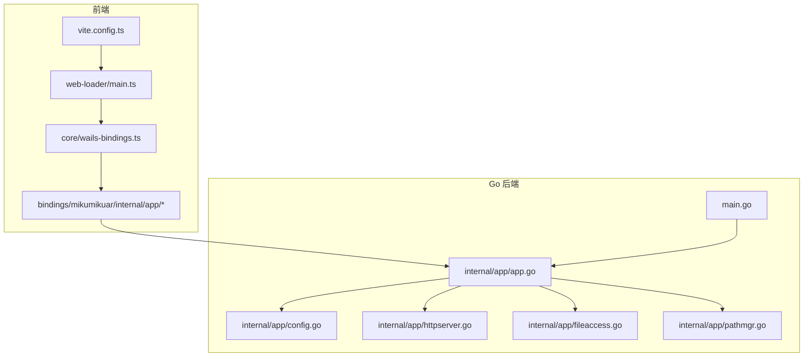
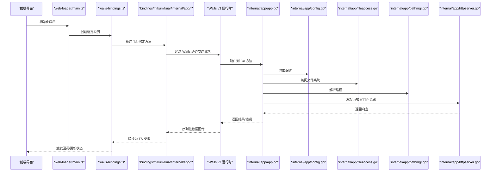
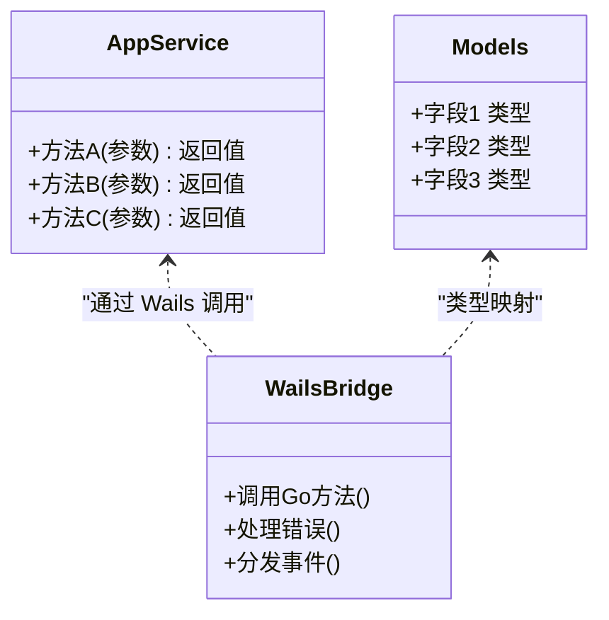
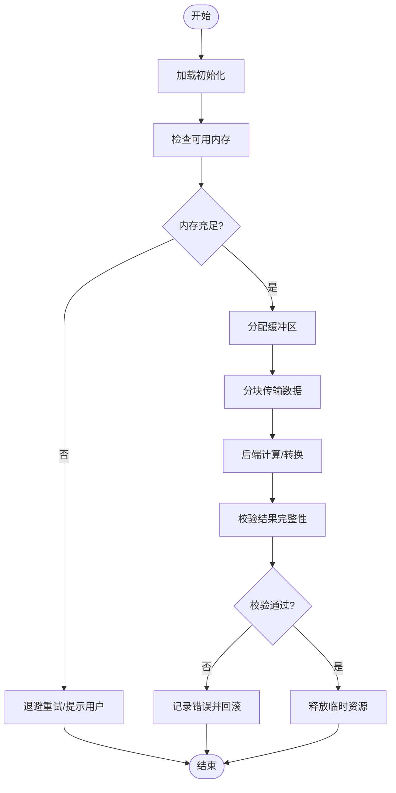
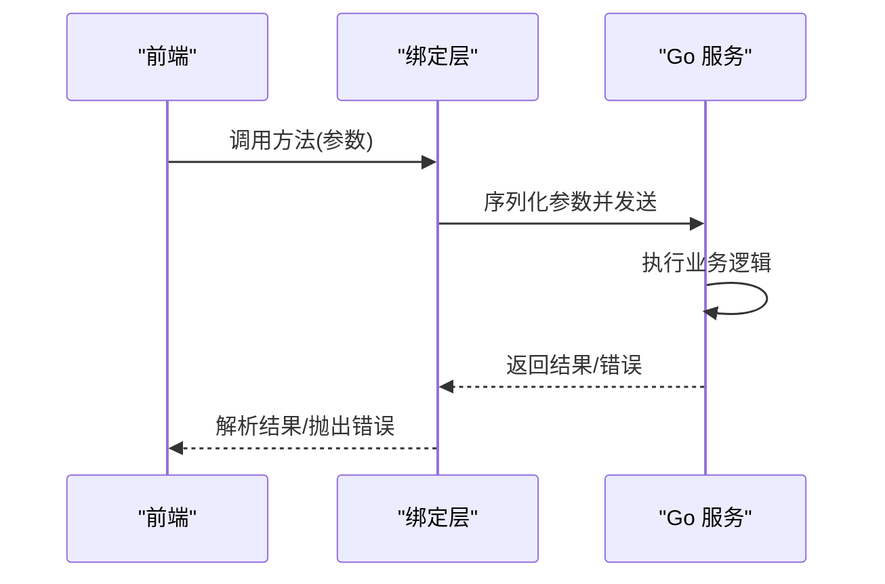
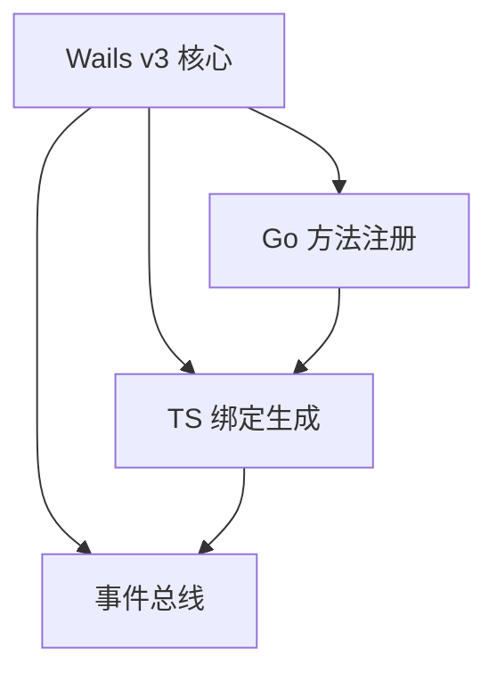
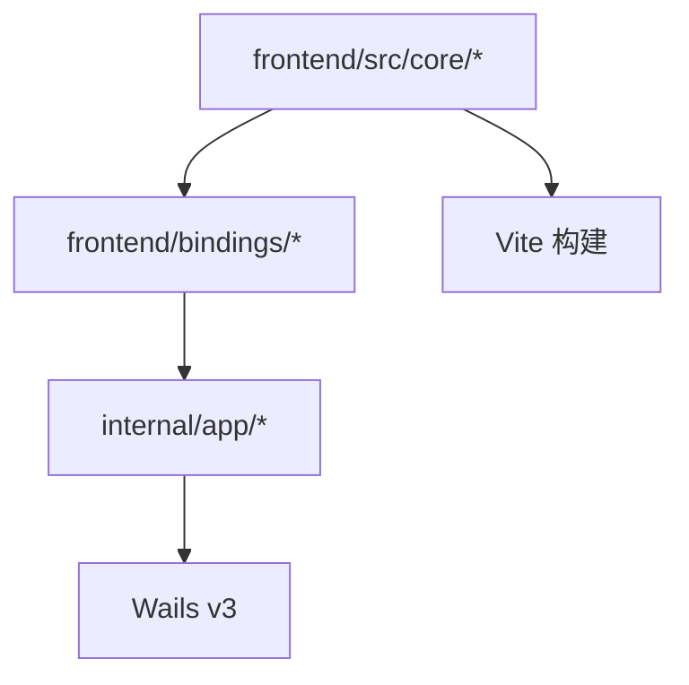

# WASM 集成框架

<cite>
**本文引用的文件**   
- [main.go](file://main.go)
- [go.mod](file://go.mod)
- [frontend/src/core/wails-bindings.ts](file://frontend/src/core/wails-bindings.ts)
- [frontend/bindings/mikumikuar/internal/app/index.ts](file://frontend/bindings/mikumikuar/internal/app/index.ts)
- [frontend/bindings/mikumikuar/internal/app/models.ts](file://frontend/bindings/mikumikuar/internal/app/models.ts)
- [frontend/bindings/mikumikuar/internal/app/app.ts](file://frontend/bindings/mikumikuar/internal/app/app.ts)
- [internal/app/app.go](file://internal/app/app.go)
- [internal/app/config.go](file://internal/app/config.go)
- [internal/app/httpserver.go](file://internal/app/httpserver.go)
- [internal/app/fileaccess.go](file://internal/app/fileaccess.go)
- [internal/app/pathmgr.go](file://internal/app/pathmgr.go)
- [frontend/src/web-loader/main.ts](file://frontend/src/web-loader/main.ts)
- [frontend/vite.config.ts](file://frontend/vite.config.ts)
- [scripts/build-android-so.ps1](file://scripts/build-android-so.ps1)
- [scripts/build-linux.sh](file://scripts/build-linux.sh)
- [scripts/build-darwin.sh](file://scripts/build-darwin.sh)
- [scripts/build-ios.sh](file://scripts/build-ios.sh)
- [docs/research/Wails v3-binding.md](file://docs/research/Wails v3-binding.md)
- [docs/research/Wails v3-architecture.md](file://docs/research/Wails v3-architecture.md)
- [docs/buglog/WASM 404：index_bg.wasm 无法加载.md](file://docs/buglog/WASM 404：index_bg.wasm 无法加载.md)
</cite>

## 目录
1. [简介](#简介)
2. [项目结构](#项目结构)
3. [核心组件](#核心组件)
4. [架构总览](#架构总览)
5. [详细组件分析](#详细组件分析)
6. [依赖关系分析](#依赖关系分析)
7. [性能考量](#性能考量)
8. [故障排查指南](#故障排查指南)
9. [结论](#结论)
10. [附录](#附录)

## 简介
本文件面向在 WebAssembly（WASM）与前端应用之间进行集成的开发者，系统性阐述以下主题：
- 编译配置与运行时加载流程
- 内存管理策略与大数据传输方案
- Go 到 JavaScript 的绑定生成机制、类型映射、异步调用与错误传播
- Wails v3 绑定系统的工作原理与使用方式
- 可被前端调用的 Go 函数编写范式、高性能计算模块设计
- 调试技巧与性能分析方法

## 项目结构
本项目采用前后端分离的组织方式：
- 前端位于 frontend 目录，包含 TypeScript 源码、构建配置与生成的绑定代码。
- Go 后端位于 internal 目录，提供业务逻辑与平台能力，并通过 Wails v3 暴露给前端。
- 根目录 main.go 为应用入口，负责初始化 Wails 应用并注册服务。
- 文档 docs/research 中包含对 Wails v3 架构与绑定的研究总结。

图表来源
- [frontend/src/web-loader/main.ts](file://frontend/src/web-loader/main.ts)
- [frontend/src/core/wails-bindings.ts](file://frontend/src/core/wails-bindings.ts)
- [frontend/bindings/mikumikuar/internal/app/index.ts](file://frontend/bindings/mikumikuar/internal/app/index.ts)
- [frontend/bindings/mikumikuar/internal/app/models.ts](file://frontend/bindings/mikumikuar/internal/app/models.ts)
- [frontend/bindings/mikumikuar/internal/app/app.ts](file://frontend/bindings/mikumikuar/internal/app/app.ts)
- [main.go](file://main.go)
- [internal/app/app.go](file://internal/app/app.go)
- [internal/app/config.go](file://internal/app/config.go)
- [internal/app/httpserver.go](file://internal/app/httpserver.go)
- [internal/app/fileaccess.go](file://internal/app/fileaccess.go)
- [internal/app/pathmgr.go](file://internal/app/pathmgr.go)
- [frontend/vite.config.ts](file://frontend/vite.config.ts)

章节来源
- [main.go](file://main.go)
- [frontend/src/web-loader/main.ts](file://frontend/src/web-loader/main.ts)
- [frontend/src/core/wails-bindings.ts](file://frontend/src/core/wails-bindings.ts)
- [frontend/bindings/mikumikuar/internal/app/index.ts](file://frontend/bindings/mikumikuar/internal/app/index.ts)
- [frontend/bindings/mikumikuar/internal/app/models.ts](file://frontend/bindings/mikumikuar/internal/app/models.ts)
- [frontend/bindings/mikumikuar/internal/app/app.ts](file://frontend/bindings/mikumikuar/internal/app/app.ts)
- [internal/app/app.go](file://internal/app/app.go)
- [internal/app/config.go](file://internal/app/config.go)
- [internal/app/httpserver.go](file://internal/app/httpserver.go)
- [internal/app/fileaccess.go](file://internal/app/fileaccess.go)
- [internal/app/pathmgr.go](file://internal/app/pathmgr.go)
- [frontend/vite.config.ts](file://frontend/vite.config.ts)

## 核心组件
- 应用入口与初始化
  - 根入口 main.go 负责创建并启动 Wails 应用，注册必要的服务与路由。
  - internal/app/app.go 实现应用级服务与对外暴露的方法，供前端通过绑定调用。
- 配置与资源访问
  - internal/app/config.go 提供配置读取与默认值处理。
  - internal/app/fileaccess.go 封装跨平台文件访问能力。
  - internal/app/pathmgr.go 管理路径解析与规范化。
- HTTP 服务
  - internal/app/httpserver.go 提供内部 HTTP 服务，用于静态资源或 API 转发。
- 前端绑定与加载
  - frontend/src/web-loader/main.ts 作为前端加载器，负责初始化渲染环境与生命周期。
  - frontend/src/core/wails-bindings.ts 封装 Wails 绑定调用细节，统一错误与事件处理。
  - frontend/bindings/mikumikuar/internal/app/* 由工具链自动生成，将 Go 方法映射为 TypeScript 接口。
- 构建与打包
  - frontend/vite.config.ts 定义前端构建行为，包括资源输出与开发服务器配置。
  - scripts 下脚本支持多平台构建（Android、Linux、Darwin、iOS）。

章节来源
- [main.go](file://main.go)
- [internal/app/app.go](file://internal/app/app.go)
- [internal/app/config.go](file://internal/app/config.go)
- [internal/app/fileaccess.go](file://internal/app/fileaccess.go)
- [internal/app/pathmgr.go](file://internal/app/pathmgr.go)
- [internal/app/httpserver.go](file://internal/app/httpserver.go)
- [frontend/src/web-loader/main.ts](file://frontend/src/web-loader/main.ts)
- [frontend/src/core/wails-bindings.ts](file://frontend/src/core/wails-bindings.ts)
- [frontend/bindings/mikumikuar/internal/app/index.ts](file://frontend/bindings/mikumikuar/internal/app/index.ts)
- [frontend/bindings/mikumikuar/internal/app/models.ts](file://frontend/bindings/mikumikuar/internal/app/models.ts)
- [frontend/bindings/mikumikuar/internal/app/app.ts](file://frontend/bindings/mikumikuar/internal/app/app.ts)
- [frontend/vite.config.ts](file://frontend/vite.config.ts)
- [scripts/build-android-so.ps1](file://scripts/build-android-so.ps1)
- [scripts/build-linux.sh](file://scripts/build-linux.sh)
- [scripts/build-darwin.sh](file://scripts/build-darwin.sh)
- [scripts/build-ios.sh](file://scripts/build-ios.sh)

## 架构总览
下图展示了从前端调用到 Go 后端执行的整体流程，以及 Wails v3 在其中的桥接作用。

图表来源
- [frontend/src/web-loader/main.ts](file://frontend/src/web-loader/main.ts)
- [frontend/src/core/wails-bindings.ts](file://frontend/src/core/wails-bindings.ts)
- [frontend/bindings/mikumikuar/internal/app/index.ts](file://frontend/bindings/mikumikuar/internal/app/index.ts)
- [frontend/bindings/mikumikuar/internal/app/models.ts](file://frontend/bindings/mikumikuar/internal/app/models.ts)
- [frontend/bindings/mikumikuar/internal/app/app.ts](file://frontend/bindings/mikumikuar/internal/app/app.ts)
- [internal/app/app.go](file://internal/app/app.go)
- [internal/app/config.go](file://internal/app/config.go)
- [internal/app/fileaccess.go](file://internal/app/fileaccess.go)
- [internal/app/pathmgr.go](file://internal/app/pathmgr.go)
- [internal/app/httpserver.go](file://internal/app/httpserver.go)

## 详细组件分析

### 组件 A：Wails v3 绑定系统与类型映射
- 绑定生成机制
  - 前端 bindings 目录下的 TypeScript 文件由工具链根据 Go 导出方法自动生成，形成与 Go 方法一一对应的 TS 接口。
  - models.ts 中定义了数据结构映射，确保 Go 结构与 JS 对象之间的字段一致。
- 类型映射规则
  - 基本类型：string、number、boolean 直接映射。
  - 复合类型：struct 映射为对象；slice/array 映射为数组；map 映射为对象。
  - 指针与可选字段：通过 null/undefined 表示缺失值。
- 异步调用与错误传播
  - Go 方法返回 (result, error)，绑定层将其转换为 Promise 或回调形式。
  - 错误对象包含消息与堆栈信息，便于前端定位问题。
- 事件系统
  - 通过 Wails 事件总线实现双向通信，前端订阅事件，Go 侧发布事件。

图表来源
- [frontend/bindings/mikumikuar/internal/app/app.ts](file://frontend/bindings/mikumikuar/internal/app/app.ts)
- [frontend/bindings/mikumikuar/internal/app/models.ts](file://frontend/bindings/mikumikuar/internal/app/models.ts)
- [frontend/src/core/wails-bindings.ts](file://frontend/src/core/wails-bindings.ts)
- [internal/app/app.go](file://internal/app/app.go)

章节来源
- [frontend/bindings/mikumikuar/internal/app/index.ts](file://frontend/bindings/mikumikuar/internal/app/index.ts)
- [frontend/bindings/mikumikuar/internal/app/models.ts](file://frontend/bindings/mikumikuar/internal/app/models.ts)
- [frontend/bindings/mikumikuar/internal/app/app.ts](file://frontend/bindings/mikumikuar/internal/app/app.ts)
- [frontend/src/core/wails-bindings.ts](file://frontend/src/core/wails-bindings.ts)
- [internal/app/app.go](file://internal/app/app.go)
- [docs/research/Wails v3-binding.md](file://docs/research/Wails v3-binding.md)

### 组件 B：运行时加载与内存管理
- 运行时加载流程
  - web-loader/main.ts 负责初始化渲染上下文与资源加载。
  - vite.config.ts 控制构建产物输出路径与资源优化策略。
- 内存管理策略
  - 大数据传输优先使用 ArrayBuffer/SharedArrayBuffer，避免 JSON 序列化开销。
  - 分块传输与流式处理，降低峰值内存占用。
  - 及时释放不再使用的视图与纹理引用，防止内存泄漏。
- 高性能计算模块
  - 将 CPU 密集任务下沉至 Go 后端，通过绑定以二进制缓冲传递数据。
  - 利用 SIMD 指令集与并行算法提升吞吐。

图表来源
- [frontend/src/web-loader/main.ts](file://frontend/src/web-loader/main.ts)
- [frontend/vite.config.ts](file://frontend/vite.config.ts)
- [frontend/src/core/wails-bindings.ts](file://frontend/src/core/wails-bindings.ts)

章节来源
- [frontend/src/web-loader/main.ts](file://frontend/src/web-loader/main.ts)
- [frontend/vite.config.ts](file://frontend/vite.config.ts)
- [frontend/src/core/wails-bindings.ts](file://frontend/src/core/wails-bindings.ts)

### 组件 C：Go 到 JavaScript 的绑定生成机制
- 类型映射
  - Go struct 与 TS interface 保持字段名与类型一致。
  - 复杂嵌套结构需显式声明模型，避免隐式转换导致的数据丢失。
- 异步调用
  - Go 方法返回 error 时，绑定层抛出异常；成功时返回 Promise 结果。
  - 长耗时操作建议返回进度事件，前端可实时更新 UI。
- 错误传播
  - 错误对象包含消息、代码与堆栈，便于前端展示与日志上报。
  - 建议在 Go 侧统一错误包装，提高可读性与可维护性。

图表来源
- [frontend/src/core/wails-bindings.ts](file://frontend/src/core/wails-bindings.ts)
- [frontend/bindings/mikumikuar/internal/app/app.ts](file://frontend/bindings/mikumikuar/internal/app/app.ts)
- [internal/app/app.go](file://internal/app/app.go)

章节来源
- [frontend/src/core/wails-bindings.ts](file://frontend/src/core/wails-bindings.ts)
- [frontend/bindings/mikumikuar/internal/app/app.ts](file://frontend/bindings/mikumikuar/internal/app/app.ts)
- [internal/app/app.go](file://internal/app/app.go)

### 组件 D：Wails v3 框架绑定系统工作原理
- 架构要点
  - Wails v3 提供统一的桥接层，自动注册 Go 方法与前端 TS 接口。
  - 事件总线支持跨语言事件发布与订阅。
- 使用方式
  - 在 Go 中导出方法，并在 app.go 中注册到 Wails 应用。
  - 前端通过生成的绑定文件调用方法，无需手动维护协议。
- 最佳实践
  - 将业务逻辑集中在 internal/app 包，保持接口稳定。
  - 使用 models.ts 明确数据结构，避免版本升级时的兼容问题。

图表来源
- [docs/research/Wails v3-architecture.md](file://docs/research/Wails v3-architecture.md)
- [docs/research/Wails v3-binding.md](file://docs/research/Wails v3-binding.md)
- [internal/app/app.go](file://internal/app/app.go)
- [frontend/bindings/mikumikuar/internal/app/index.ts](file://frontend/bindings/mikumikuar/internal/app/index.ts)

章节来源
- [docs/research/Wails v3-architecture.md](file://docs/research/Wails v3-architecture.md)
- [docs/research/Wails v3-binding.md](file://docs/research/Wails v3-binding.md)
- [internal/app/app.go](file://internal/app/app.go)
- [frontend/bindings/mikumikuar/internal/app/index.ts](file://frontend/bindings/mikumikuar/internal/app/index.ts)

## 依赖关系分析
- 模块耦合
  - 前端绑定层与 Go 服务强耦合，需保持接口稳定。
  - 配置与文件系统访问解耦，便于测试与替换实现。
- 外部依赖
  - Wails v3 运行时提供桥接能力。
  - Vite 构建工具链影响资源加载与优化策略。
- 潜在循环依赖
  - 避免在 Go 服务中直接导入前端绑定，保持单向依赖。

图表来源
- [frontend/src/core/wails-bindings.ts](file://frontend/src/core/wails-bindings.ts)
- [frontend/bindings/mikumikuar/internal/app/index.ts](file://frontend/bindings/mikumikuar/internal/app/index.ts)
- [internal/app/app.go](file://internal/app/app.go)
- [frontend/vite.config.ts](file://frontend/vite.config.ts)

章节来源
- [frontend/src/core/wails-bindings.ts](file://frontend/src/core/wails-bindings.ts)
- [frontend/bindings/mikumikuar/internal/app/index.ts](file://frontend/bindings/mikumikuar/internal/app/index.ts)
- [internal/app/app.go](file://internal/app/app.go)
- [frontend/vite.config.ts](file://frontend/vite.config.ts)

## 性能考量
- 数据传输优化
  - 使用二进制缓冲减少序列化开销。
  - 分块传输与增量更新，避免大对象一次性拷贝。
- 计算密集型任务
  - 将算法下沉至 Go 后端，利用其并发与 SIMD 能力。
  - 前端仅负责 UI 与交互，保持主线程流畅。
- 内存监控
  - 定期检测内存使用趋势，设置阈值告警。
  - 及时释放不再使用的资源，防止累积增长。

[本节为通用指导，不直接分析具体文件]

## 故障排查指南
- WASM 加载失败
  - 常见现象：index_bg.wasm 404 错误。
  - 排查步骤：检查构建输出路径、静态资源服务器配置、浏览器缓存。
- 绑定调用异常
  - 检查 Go 方法是否已正确注册。
  - 确认前端绑定文件是否为最新生成。
- 内存溢出
  - 监控浏览器性能面板，定位大对象分配点。
  - 优化数据传输策略，避免重复拷贝。

章节来源
- [docs/buglog/WASM 404：index_bg.wasm 无法加载.md](file://docs/buglog/WASM 404：index_bg.wasm 无法加载.md)

## 结论
本项目通过 Wails v3 实现了高效的 Go 与前端集成，结合 WASM 技术提升了计算性能与用户体验。通过合理的内存管理与数据传输策略，确保了在大场景下的稳定性与流畅性。未来可进一步优化绑定生成流程与错误处理机制，提升开发效率与可维护性。

[本节为总结性内容，不直接分析具体文件]

## 附录
- 构建脚本参考
  - Android: scripts/build-android-so.ps1
  - Linux: scripts/build-linux.sh
  - Darwin: scripts/build-darwin.sh
  - iOS: scripts/build-ios.sh
- 依赖管理
  - go.mod 与 go.sum 管理 Go 依赖版本。
  - package.json 与 package-lock.json 管理前端依赖。

章节来源
- [scripts/build-android-so.ps1](file://scripts/build-android-so.ps1)
- [scripts/build-linux.sh](file://scripts/build-linux.sh)
- [scripts/build-darwin.sh](file://scripts/build-darwin.sh)
- [scripts/build-ios.sh](file://scripts/build-ios.sh)
- [go.mod](file://go.mod)