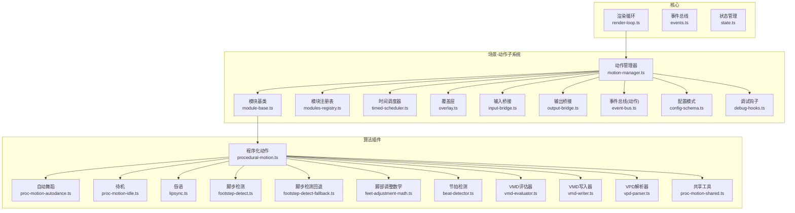
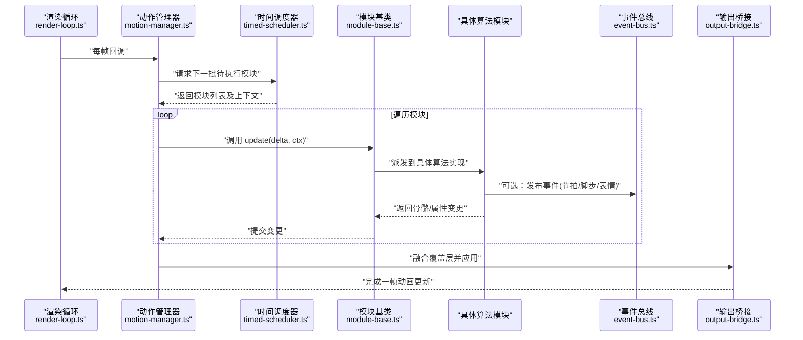
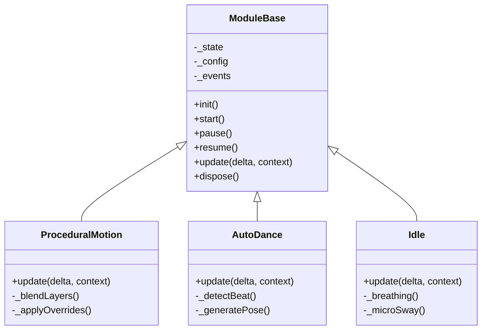
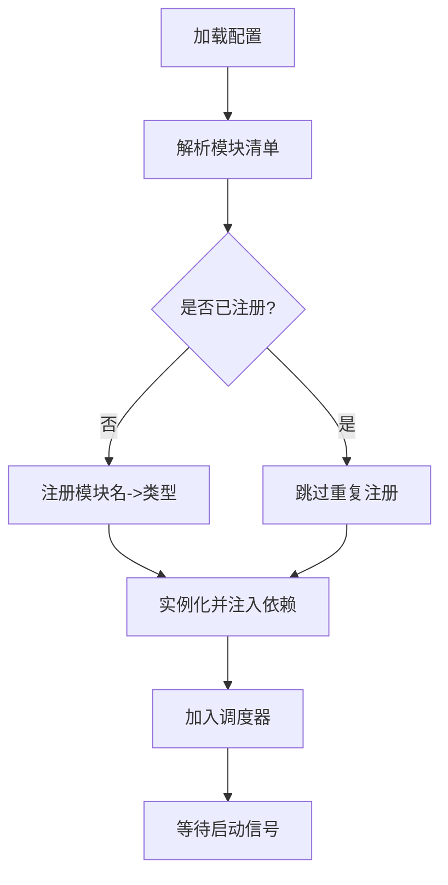
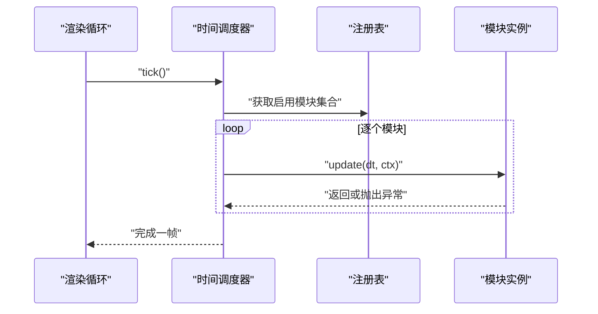
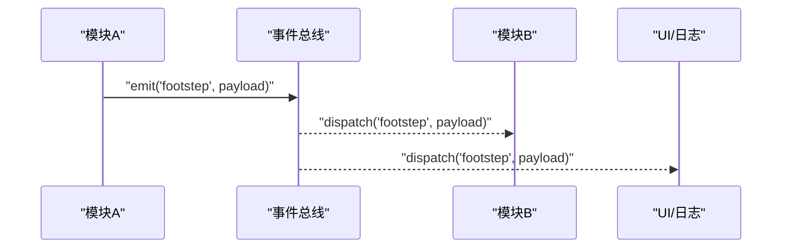
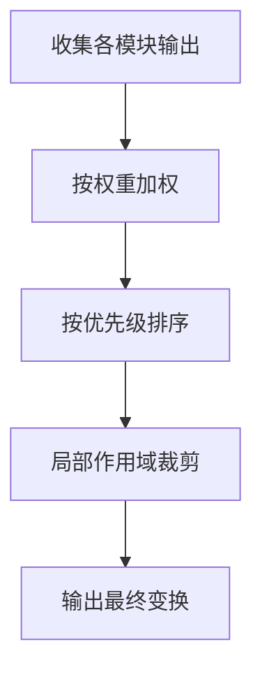
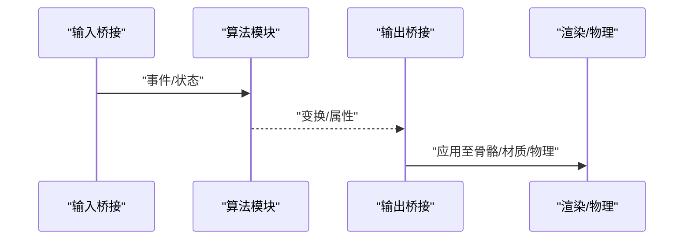
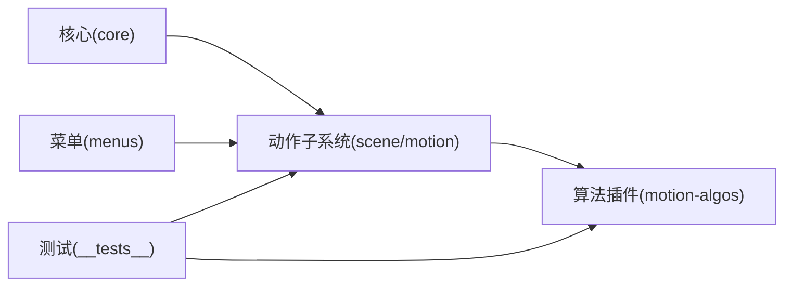

# 动画插件系统

<cite>
**本文引用的文件**   
- [程序化动作架构决策](file://docs/adr/adr-021-procedural-motion.md)
- [动作算法重命名决策](file://docs/adr/adr-042-motion-algos-rename.md)
- [骨骼覆写与IK感知决策](file://docs/adr/adr-122-ik-aware-bone-override.md)
- [计算覆写语义决策](file://docs/adr/adr-123-compute-override-semantics.md)
- [每模型叠加动作决策](file://docs/adr/adr-144-per-model-overlay-motion.md)
- [WASM运行时动作层决策](file://docs/adr/adr-056-wasm-runtime-motion-layers.md)
- [观察者注册表决策](file://docs/adr/adr-139-observer-registry.md)
- [状态拆分决策](file://docs/adr/adr-141-state-split.md)
- [带状态装饰器决策](file://docs/adr/adr-142-with-status.md)
- [主流程拆分决策](file://docs/adr/adr-102-main-ts-split.md)
- [时序审计与异步生命周期](file://docs/adr/adr-106-timing-audit-and-async-lifecycle.md)
- [动画重定向器决策](file://docs/adr/adr-108-animation-retargeter.md)
- [高级骨骼系统决策](file://docs/adr/adr-061-advanced-bone-systems.md)
- [程序化动作桥接测试](file://frontend/src/__tests__/proc-motion-bridge.test.ts)
- [程序化动作测试](file://frontend/src/__tests__/procedural-motion.test.ts)
- [动作模块注册表测试](file://frontend/src/__tests__/motion-modules-registry.test.ts)
- [动作模块定时调度测试](file://frontend/src/__tests__/motion-modules-timed.test.ts)
- [动作数学测试](file://frontend/src/__tests__/motion-math.test.ts)
- [动作历史测试](file://frontend/src/__tests__/motion-history.test.ts)
- [骨骼覆写测试](file://frontend/src/__tests__/bone-override.test.ts)
- [节拍检测器](file://frontend/src/motion-algos/beat-detector.ts)
- [脚部调整数学](file://frontend/src/motion-algos/feet-adjustment-math.ts)
- [脚步检测回退实现](file://frontend/src/motion-algos/footstep-detect-fallback.ts)
- [脚步检测](file://frontend/src/motion-algos/footstep-detect.ts)
- [唇语同步](file://frontend/src/motion-algos/lipsync.ts)
- [自动舞蹈-肢体骨骼](file://frontend/src/motion-algos/proc-motion-autodance-bones-limbs.ts)
- [自动舞蹈-躯干骨骼](file://frontend/src/motion-algos/proc-motion-autodance-bones-trunk.ts)
- [自动舞蹈-骨骼](file://frontend/src/motion-algos/proc-motion-autodance-bones.ts)
- [自动舞蹈-情绪](file://frontend/src/motion-algos/proc-motion-autodance-emotion.ts)
- [自动舞蹈](file://frontend/src/motion-algos/proc-motion-autodance.ts)
- [待机动作](file://frontend/src/motion-algos/proc-motion-idle.ts)
- [程序化动作共享工具](file://frontend/src/motion-algos/proc-motion-shared.ts)
- [程序化动作](file://frontend/src/motion-algos/procedural-motion.ts)
- [VMD评估器](file://frontend/src/motion-algos/vmd-evaluator.ts)
- [VMD写入器](file://frontend/src/motion-algos/vmd-writer.ts)
- [VPD解析器](file://frontend/src/motion-algos/vpd-parser.ts)
- [场景-动作-管理器](file://frontend/src/scene/motion/motion-manager.ts)
- [场景-动作-模块基类](file://frontend/src/scene/motion/module-base.ts)
- [场景-动作-模块注册表](file://frontend/src/scene/motion/modules-registry.ts)
- [场景-动作-时间调度](file://frontend/src/scene/motion/timed-scheduler.ts)
- [场景-动作-历史](file://frontend/src/scene/motion/history.ts)
- [场景-动作-覆盖层](file://frontend/src/scene/motion/overlay.ts)
- [场景-动作-输入桥接](file://frontend/src/scene/motion/input-bridge.ts)
- [场景-动作-输出桥接](file://frontend/src/scene/motion/output-bridge.ts)
- [场景-动作-事件总线](file://frontend/src/scene/motion/event-bus.ts)
- [场景-动作-配置模式](file://frontend/src/scene/motion/config-schema.ts)
- [场景-动作-调试钩子](file://frontend/src/scene/motion/debug-hooks.ts)
- [核心-渲染循环](file://frontend/src/core/render-loop.ts)
- [核心-事件总线](file://frontend/src/core/events.ts)
- [核心-状态管理](file://frontend/src/core/state.ts)
- [核心-初始化入口](file://frontend/src/core/init.ts)
- [菜单-程序化动作层级](file://frontend/src/menus/motion-procmotion-levels.ts)
</cite>

## 目录
1. [简介](#简介)
2. [项目结构](#项目结构)
3. [核心组件](#核心组件)
4. [架构总览](#架构总览)
5. [详细组件分析](#详细组件分析)
6. [依赖分析](#依赖分析)
7. [性能考虑](#性能考虑)
8. [故障排查指南](#故障排查指南)
9. [结论](#结论)
10. [附录](#附录)

## 简介
本文件面向“程序化动画插件系统”的开发者与维护者，系统性阐述以下主题：
- 程序化动画模块的架构设计：ModuleBase 基类、模块注册机制、生命周期管理
- 动画算法插件接口规范：update 方法、参数配置、状态管理
- 模块依赖注入与事件通信机制
- 自定义动画算法开发示例：基础骨骼变换、复杂物理模拟、与现有动画系统集成
- 性能优化策略与调试技巧

本系统采用“模块化+可插拔”的设计，通过统一的 ModuleBase 抽象定义动画算法的生命周期与数据契约；通过注册表集中管理模块实例；通过时间调度器驱动 update 调用；通过事件总线与依赖注入实现松耦合通信。

## 项目结构
程序化动画相关代码主要分布在以下目录：
- 前端核心与运行期基础设施：core/*（渲染循环、事件、状态）
- 场景动作子系统：scene/motion/*（模块基类、注册表、调度、历史、覆盖层、桥接、事件、配置、调试）
- 算法插件：motion-algos/*（节拍检测、脚部调整、脚步检测、唇语、自动舞蹈、待机、VMD/VPD 工具等）
- 菜单集成：menus/motion-procmotion-levels.ts（UI 暴露控制项）
- 测试用例：__tests__/motion-* 与 procedural-motion*.ts（验证注册、调度、数学、历史、桥接等）

图表来源
- [核心-渲染循环](file://frontend/src/core/render-loop.ts)
- [核心-事件总线](file://frontend/src/core/events.ts)
- [核心-状态管理](file://frontend/src/core/state.ts)
- [场景-动作-管理器](file://frontend/src/scene/motion/motion-manager.ts)
- [场景-动作-模块基类](file://frontend/src/scene/motion/module-base.ts)
- [场景-动作-模块注册表](file://frontend/src/scene/motion/modules-registry.ts)
- [场景-动作-时间调度](file://frontend/src/scene/motion/timed-scheduler.ts)
- [场景-动作-覆盖层](file://frontend/src/scene/motion/overlay.ts)
- [场景-动作-输入桥接](file://frontend/src/scene/motion/input-bridge.ts)
- [场景-动作-输出桥接](file://frontend/src/scene/motion/output-bridge.ts)
- [场景-动作-事件总线](file://frontend/src/scene/motion/event-bus.ts)
- [场景-动作-配置模式](file://frontend/src/scene/motion/config-schema.ts)
- [场景-动作-调试钩子](file://frontend/src/scene/motion/debug-hooks.ts)
- [程序化动作](file://frontend/src/motion-algos/procedural-motion.ts)
- [自动舞蹈](file://frontend/src/motion-algos/proc-motion-autodance.ts)
- [待机动作](file://frontend/src/motion-algos/proc-motion-idle.ts)
- [唇语同步](file://frontend/src/motion-algos/lipsync.ts)
- [脚步检测](file://frontend/src/motion-algos/footstep-detect.ts)
- [脚步检测回退实现](file://frontend/src/motion-algos/footstep-detect-fallback.ts)
- [脚部调整数学](file://frontend/src/motion-algos/feet-adjustment-math.ts)
- [节拍检测器](file://frontend/src/motion-algos/beat-detector.ts)
- [VMD评估器](file://frontend/src/motion-algos/vmd-evaluator.ts)
- [VMD写入器](file://frontend/src/motion-algos/vmd-writer.ts)
- [VPD解析器](file://frontend/src/motion-algos/vpd-parser.ts)
- [程序化动作共享工具](file://frontend/src/motion-algos/proc-motion-shared.ts)

章节来源
- [程序化动作架构决策](file://docs/adr/adr-021-procedural-motion.md)
- [动作算法重命名决策](file://docs/adr/adr-042-motion-algos-rename.md)
- [WASM运行时动作层决策](file://docs/adr/adr-056-wasm-runtime-motion-layers.md)
- [主流程拆分决策](file://docs/adr/adr-102-main-ts-split.md)

## 核心组件
本节聚焦程序化动画系统的核心构件及其职责边界：
- 模块基类 ModuleBase：定义统一生命周期与数据契约，提供默认实现与扩展点
- 模块注册表 ModulesRegistry：集中管理模块声明、实例化、启停与销毁
- 时间调度器 TimedScheduler：按帧或固定步长驱动各模块 update
- 动作管理器 MotionManager：编排模块组合、覆盖层融合、输入输出桥接
- 事件总线 EventBus：模块间解耦通信
- 配置模式 ConfigSchema：对模块参数进行校验与默认值合并
- 调试钩子 DebugHooks：为开发期提供断点、采样、可视化辅助

关键要点
- 所有动画算法需继承 ModuleBase，实现 update(delta, context) 以产出骨骼/属性变更
- 模块通过注册表以“名称-类型”映射方式被发现与实例化
- 调度器保证在渲染循环中稳定调用 update，避免阻塞主线程
- 覆盖层支持多模块结果融合，解决同一目标属性的冲突
- 事件总线用于跨模块广播（如节拍、脚步落地、表情触发）
- 配置模式确保 UI 与算法参数一致，并提供热更新能力

章节来源
- [场景-动作-模块基类](file://frontend/src/scene/motion/module-base.ts)
- [场景-动作-模块注册表](file://frontend/src/scene/motion/modules-registry.ts)
- [场景-动作-时间调度](file://frontend/src/scene/motion/timed-scheduler.ts)
- [场景-动作-管理器](file://frontend/src/scene/motion/motion-manager.ts)
- [场景-动作-事件总线](file://frontend/src/scene/motion/event-bus.ts)
- [场景-动作-配置模式](file://frontend/src/scene/motion/config-schema.ts)
- [场景-动作-调试钩子](file://frontend/src/scene/motion/debug-hooks.ts)

## 架构总览
下图展示从渲染循环到具体算法插件的完整调用链与数据流。

图表来源
- [核心-渲染循环](file://frontend/src/core/render-loop.ts)
- [场景-动作-管理器](file://frontend/src/scene/motion/motion-manager.ts)
- [场景-动作-时间调度](file://frontend/src/scene/motion/timed-scheduler.ts)
- [场景-动作-模块基类](file://frontend/src/scene/motion/module-base.ts)
- [场景-动作-事件总线](file://frontend/src/scene/motion/event-bus.ts)
- [场景-动作-输出桥接](file://frontend/src/scene/motion/output-bridge.ts)

## 详细组件分析

### 模块基类 ModuleBase 与生命周期
ModuleBase 定义了动画算法的统一契约，包括：
- 生命周期钩子：init、start、pause、resume、dispose
- 每帧更新：update(delta, context)
- 状态持有：内部状态对象，供算法读写
- 配置访问：读取当前生效的配置快照
- 事件发布：通过内置事件通道向其他模块广播
- 资源清理：释放引用、取消订阅、重置缓存

典型使用方式
- 继承 ModuleBase，实现 update 逻辑，按需重写其他钩子
- 在 init/start 中建立必要引用（如骨骼句柄、相机、物理引擎接口）
- 在 dispose 中清理闭包与监听器，避免内存泄漏

图表来源
- [场景-动作-模块基类](file://frontend/src/scene/motion/module-base.ts)
- [程序化动作](file://frontend/src/motion-algos/procedural-motion.ts)
- [自动舞蹈](file://frontend/src/motion-algos/proc-motion-autodance.ts)
- [待机动作](file://frontend/src/motion-algos/proc-motion-idle.ts)

章节来源
- [场景-动作-模块基类](file://frontend/src/scene/motion/module-base.ts)
- [程序化动作](file://frontend/src/motion-algos/procedural-motion.ts)
- [自动舞蹈](file://frontend/src/motion-algos/proc-motion-autodance.ts)
- [待机动作](file://frontend/src/motion-algos/proc-motion-idle.ts)

### 模块注册机制与依赖注入
ModulesRegistry 负责：
- 维护“模块名 -> 模块类型”的映射
- 根据配置动态实例化模块，注入依赖（如场景、相机、物理、事件总线）
- 提供启用/禁用/重启能力
- 与配置模式联动，校验模块参数

依赖注入要点
- 构造时注入公共服务：事件总线、状态、配置、桥接器
- 模块内部通过依赖获取外部能力，避免直接耦合
- 支持可选依赖，未提供则降级处理

图表来源
- [场景-动作-模块注册表](file://frontend/src/scene/motion/modules-registry.ts)
- [场景-动作-配置模式](file://frontend/src/scene/motion/config-schema.ts)
- [场景-动作-时间调度](file://frontend/src/scene/motion/timed-scheduler.ts)

章节来源
- [场景-动作-模块注册表](file://frontend/src/scene/motion/modules-registry.ts)
- [场景-动作-配置模式](file://frontend/src/scene/motion/config-schema.ts)
- [动作模块注册表测试](file://frontend/src/__tests__/motion-modules-registry.test.ts)

### 时间调度与生命周期管理
TimedScheduler 保证：
- 基于固定步长或自适应步长的 update 调用
- 模块优先级与分组执行
- 暂停/恢复/停止的全局控制
- 异常隔离，单个模块错误不影响整体

生命周期管理
- 全局 start/pause/resume/dispose 由管理器协调
- 每个模块可在自身钩子中做细粒度控制
- 与渲染循环紧密配合，避免掉帧

图表来源
- [场景-动作-时间调度](file://frontend/src/scene/motion/timed-scheduler.ts)
- [场景-动作-模块注册表](file://frontend/src/scene/motion/modules-registry.ts)
- [核心-渲染循环](file://frontend/src/core/render-loop.ts)

章节来源
- [场景-动作-时间调度](file://frontend/src/scene/motion/timed-scheduler.ts)
- [动作模块定时调度测试](file://frontend/src/__tests__/motion-modules-timed.test.ts)

### 事件通信机制
EventBus 提供：
- 发布/订阅模型，支持命名空间与过滤
- 同步与异步事件派发
- 事件节流与去抖
- 与 UI/日志/遥测的解耦接入

典型事件
- 节拍到达、脚步落地、表情变化、模块状态切换
- 自定义业务事件（如“开始舞蹈”、“切换待机”）

图表来源
- [场景-动作-事件总线](file://frontend/src/scene/motion/event-bus.ts)
- [核心-事件总线](file://frontend/src/core/events.ts)

章节来源
- [场景-动作-事件总线](file://frontend/src/scene/motion/event-bus.ts)
- [核心-事件总线](file://frontend/src/core/events.ts)
- [观察者注册表决策](file://docs/adr/adr-139-observer-registry.md)

### 覆盖层与融合策略
Overlay 负责：
- 多模块对同一目标的修改合并
- 权重与优先级控制
- 局部覆盖（仅影响指定骨骼/属性）
- 与 IK/骨骼覆写协同工作

图表来源
- [场景-动作-覆盖层](file://frontend/src/scene/motion/overlay.ts)
- [骨骼覆写与IK感知决策](file://docs/adr/adr-122-ik-aware-bone-override.md)
- [计算覆写语义决策](file://docs/adr/adr-123-compute-override-semantics.md)

章节来源
- [场景-动作-覆盖层](file://frontend/src/scene/motion/overlay.ts)
- [骨骼覆写与IK感知决策](file://docs/adr/adr-122-ik-aware-bone-override.md)
- [计算覆写语义决策](file://docs/adr/adr-123-compute-override-semantics.md)

### 输入/输出桥接
InputBridge 与 OutputBridge 分别承担：
- 输入：将外部输入（键盘、鼠标、手势、音频节拍）转换为模块可读的事件/状态
- 输出：将模块产生的变换应用到骨骼/材质/物理体，并与渲染管线对接

图表来源
- [场景-动作-输入桥接](file://frontend/src/scene/motion/input-bridge.ts)
- [场景-动作-输出桥接](file://frontend/src/scene/motion/output-bridge.ts)

章节来源
- [场景-动作-输入桥接](file://frontend/src/scene/motion/input-bridge.ts)
- [场景-动作-输出桥接](file://frontend/src/scene/motion/output-bridge.ts)

### 配置模式与参数校验
ConfigSchema 提供：
- 模块参数的 JSON Schema 描述
- 默认值合并与类型转换
- 运行时热更新与回滚
- 与 UI 表单双向绑定

章节来源
- [场景-动作-配置模式](file://frontend/src/scene/motion/config-schema.ts)
- [菜单-程序化动作层级](file://frontend/src/menus/motion-procmotion-levels.ts)

### 调试钩子与可视化
DebugHooks 提供：
- 断点与采样
- 模块级统计（耗时、调用次数）
- 可视化标记（骨骼位置、事件轨迹）
- 与日志/遥测集成

章节来源
- [场景-动作-调试钩子](file://frontend/src/scene/motion/debug-hooks.ts)

## 依赖分析
程序化动画子系统与核心、算法插件之间的依赖关系如下：

图表来源
- [核心-渲染循环](file://frontend/src/core/render-loop.ts)
- [核心-事件总线](file://frontend/src/core/events.ts)
- [核心-状态管理](file://frontend/src/core/state.ts)
- [场景-动作-管理器](file://frontend/src/scene/motion/motion-manager.ts)
- [程序化动作](file://frontend/src/motion-algos/procedural-motion.ts)
- [菜单-程序化动作层级](file://frontend/src/menus/motion-procmotion-levels.ts)
- [程序化动作桥接测试](file://frontend/src/__tests__/proc-motion-bridge.test.ts)
- [程序化动作测试](file://frontend/src/__tests__/procedural-motion.test.ts)

章节来源
- [程序化动作架构决策](file://docs/adr/adr-021-procedural-motion.md)
- [动作算法重命名决策](file://docs/adr/adr-042-motion-algos-rename.md)
- [WASM运行时动作层决策](file://docs/adr/adr-056-wasm-runtime-motion-layers.md)

## 性能考虑
- 批量更新：尽量合并多次骨骼写入，减少矩阵重建开销
- 增量计算：利用上一帧状态，避免全量重算
- 事件节流：高频事件（如节拍、脚步）进行节流/去抖
- 分层融合：仅在必要时启用覆盖层，降低融合成本
- 异步与分片：复杂物理模拟拆分为多帧执行
- 缓存复用：重用中间向量/矩阵对象，减少 GC 压力
- 测量与回归：使用调试钩子采集耗时，结合性能测试定位瓶颈

[本节为通用指导，不直接分析具体文件]

## 故障排查指南
常见问题与定位步骤
- 模块未执行：检查注册表是否正确注册、调度器是否启用、模块是否被禁用
- 参数无效：查看配置模式校验错误信息，确认默认值合并是否生效
- 事件丢失：确认事件总线订阅是否建立、命名空间是否匹配、是否存在节流导致丢弃
- 覆盖冲突：检查覆盖层权重与优先级设置，确认局部作用域是否正确
- 性能抖动：使用调试钩子统计模块耗时，定位热点路径

参考测试用例
- 模块注册与生命周期：[动作模块注册表测试](file://frontend/src/__tests__/motion-modules-registry.test.ts)
- 定时调度行为：[动作模块定时调度测试](file://frontend/src/__tests__/motion-modules-timed.test.ts)
- 数学与历史：[动作数学测试](file://frontend/src/__tests__/motion-math.test.ts)、[动作历史测试](file://frontend/src/__tests__/motion-history.test.ts)
- 桥接与集成：[程序化动作桥接测试](file://frontend/src/__tests__/proc-motion-bridge.test.ts)、[程序化动作测试](file://frontend/src/__tests__/procedural-motion.test.ts)
- 骨骼覆写：[骨骼覆写测试](file://frontend/src/__tests__/bone-override.test.ts)

章节来源
- [动作模块注册表测试](file://frontend/src/__tests__/motion-modules-registry.test.ts)
- [动作模块定时调度测试](file://frontend/src/__tests__/motion-modules-timed.test.ts)
- [动作数学测试](file://frontend/src/__tests__/motion-math.test.ts)
- [动作历史测试](file://frontend/src/__tests__/motion-history.test.ts)
- [程序化动作桥接测试](file://frontend/src/__tests__/proc-motion-bridge.test.ts)
- [程序化动作测试](file://frontend/src/__tests__/procedural-motion.test.ts)
- [骨骼覆写测试](file://frontend/src/__tests__/bone-override.test.ts)

## 结论
本系统通过 ModuleBase 统一契约、注册表集中管理、时间调度驱动、事件总线解耦以及覆盖层融合，构建了可扩展的程序化动画插件体系。开发者只需关注算法实现，即可快速集成到现有动画管线中。配合配置模式与调试钩子，可实现高可用、高性能与易维护的动作系统。

[本节为总结性内容，不直接分析具体文件]

## 附录

### 自定义动画算法开发示例（概念说明）
- 基础骨骼变换
  - 继承 ModuleBase，实现 update 中对目标骨骼的旋转/位移增量计算
  - 使用事件总线发布“骨骼更新”以便 UI 或其他模块响应
  - 通过配置模式暴露强度、频率、相位等参数
- 复杂物理模拟
  - 在 update 中调用物理接口，计算软体/布料/绳索形变
  - 使用覆盖层将结果应用到对应网格或骨骼
  - 注意分帧与节流，避免卡顿
- 与现有动画系统集成
  - 通过输出桥接将变换写入骨骼/材质/物理体
  - 与 IK/骨骼覆写协同，遵循覆盖语义与优先级
  - 使用历史模块记录关键帧，便于回放与调试

[本节为概念性说明，不直接分析具体文件]

### 关键算法插件概览
- 节拍检测：根据音频能量或外部节拍信号生成节奏事件
- 脚部调整与脚步检测：根据地面碰撞与运动状态调整脚部姿态与触地事件
- 唇语同步：依据音频波形或音素序列驱动口型
- 自动舞蹈：综合节拍、情绪与身体部位生成连贯舞蹈动作
- 待机动作：呼吸、微摆等自然待机效果
- VMD/VPD 工具：评估与写入标准格式，便于与外部工具链互通

章节来源
- [节拍检测器](file://frontend/src/motion-algos/beat-detector.ts)
- [脚部调整数学](file://frontend/src/motion-algos/feet-adjustment-math.ts)
- [脚步检测](file://frontend/src/motion-algos/footstep-detect.ts)
- [脚步检测回退实现](file://frontend/src/motion-algos/footstep-detect-fallback.ts)
- [唇语同步](file://frontend/src/motion-algos/lipsync.ts)
- [自动舞蹈](file://frontend/src/motion-algos/proc-motion-autodance.ts)
- [自动舞蹈-骨骼](file://frontend/src/motion-algos/proc-motion-autodance-bones.ts)
- [自动舞蹈-肢体骨骼](file://frontend/src/motion-algos/proc-motion-autodance-bones-limbs.ts)
- [自动舞蹈-躯干骨骼](file://frontend/src/motion-algos/proc-motion-autodance-bones-trunk.ts)
- [自动舞蹈-情绪](file://frontend/src/motion-algos/proc-motion-autodance-emotion.ts)
- [待机动作](file://frontend/src/motion-algos/proc-motion-idle.ts)
- [程序化动作共享工具](file://frontend/src/motion-algos/proc-motion-shared.ts)
- [VMD评估器](file://frontend/src/motion-algos/vmd-evaluator.ts)
- [VMD写入器](file://frontend/src/motion-algos/vmd-writer.ts)
- [VPD解析器](file://frontend/src/motion-algos/vpd-parser.ts)

### 相关架构决策摘要
- 程序化动作总体设计与分层
- 动作算法目录与命名规范
- WASM 运行时动作层与性能权衡
- 每模型叠加动作与覆盖语义
- 观察者注册表与事件模型
- 状态拆分与带状态装饰器
- 主流程拆分与时序/异步生命周期
- 动画重定向与高级骨骼系统

章节来源
- [程序化动作架构决策](file://docs/adr/adr-021-procedural-motion.md)
- [动作算法重命名决策](file://docs/adr/adr-042-motion-algos-rename.md)
- [WASM运行时动作层决策](file://docs/adr/adr-056-wasm-runtime-motion-layers.md)
- [每模型叠加动作决策](file://docs/adr/adr-144-per-model-overlay-motion.md)
- [观察者注册表决策](file://docs/adr/adr-139-observer-registry.md)
- [状态拆分决策](file://docs/adr/adr-141-state-split.md)
- [带状态装饰器决策](file://docs/adr/adr-142-with-status.md)
- [主流程拆分决策](file://docs/adr/adr-102-main-ts-split.md)
- [时序审计与异步生命周期](file://docs/adr/adr-106-timing-audit-and-async-lifecycle.md)
- [动画重定向器决策](file://docs/adr/adr-108-animation-retargeter.md)
- [高级骨骼系统决策](file://docs/adr/adr-061-advanced-bone-systems.md)