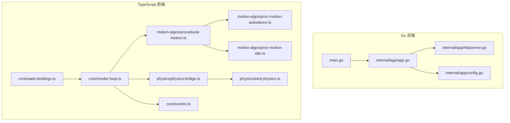
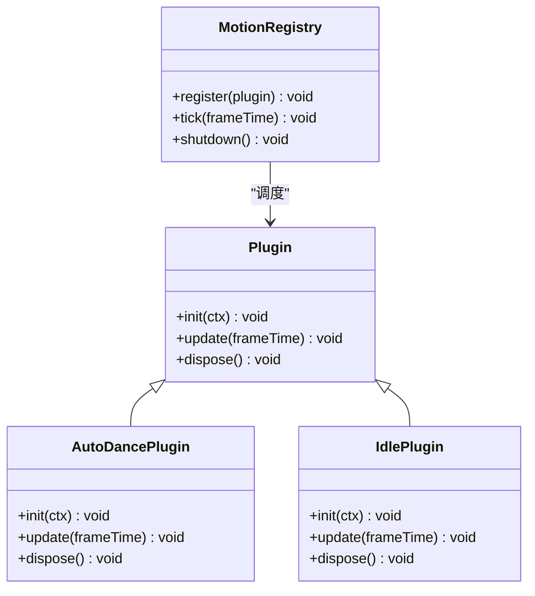
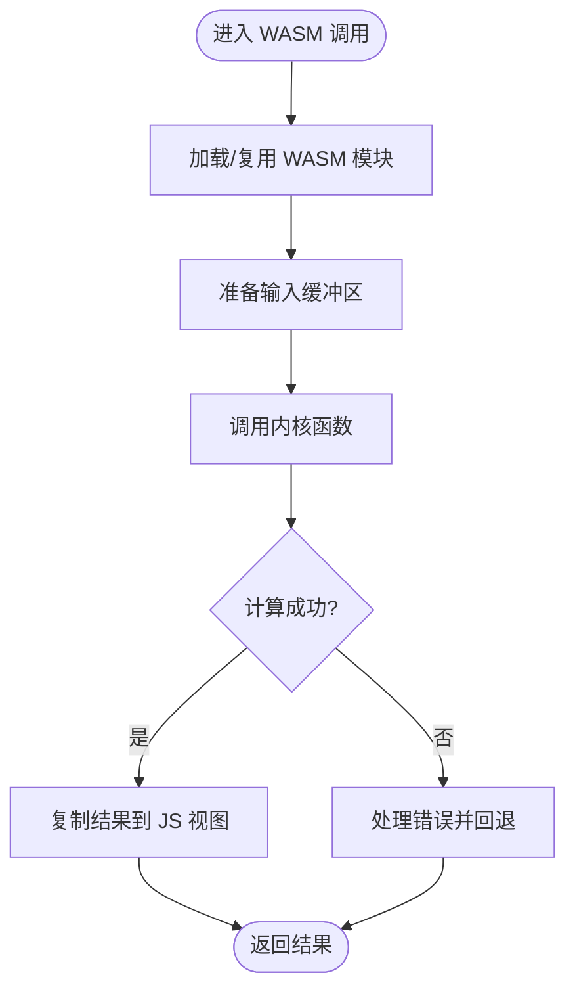
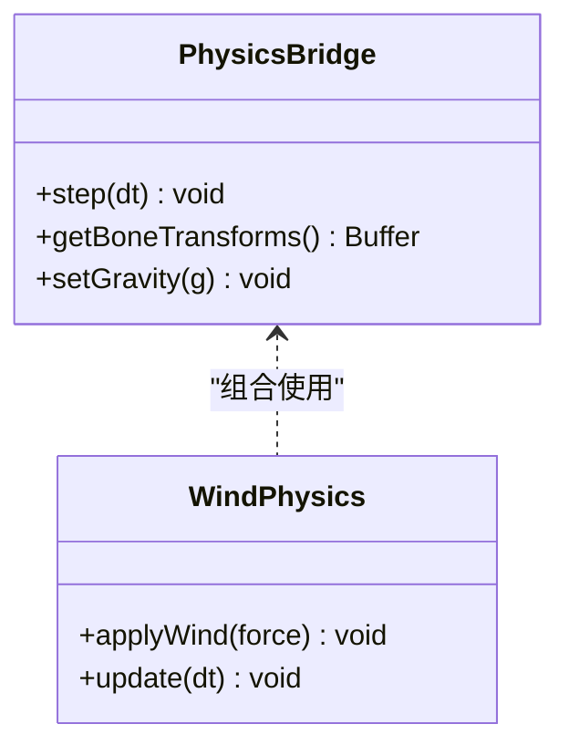
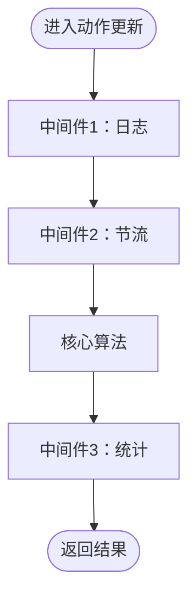
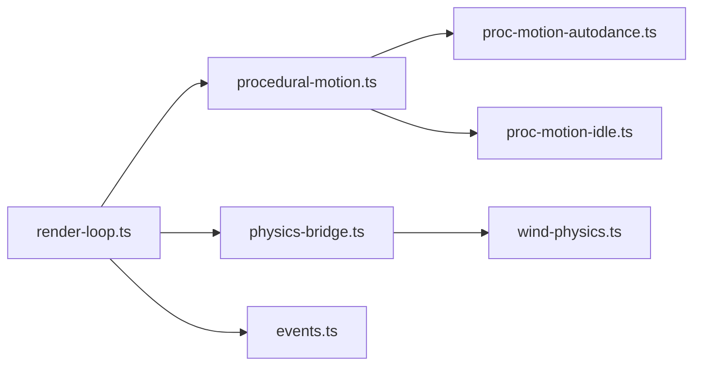

# 插件架构

<cite>
**本文引用的文件**   
- [main.go](file://main.go)
- [app.go](file://internal/app/app.go)
- [httpserver.go](file://internal/app/httpserver.go)
- [config.go](file://internal/app/config.go)
- [wails-bindings.ts](file://frontend/src/core/wails-bindings.ts)
- [render-loop.ts](file://frontend/src/core/render-loop.ts)
- [events.ts](file://frontend/src/core/events.ts)
- [motion-modules-registry.test.ts](file://frontend/src/__tests__/scene/motion-modules-registry.test.ts)
- [procedural-motion.ts](file://frontend/src/motion-algos/procedural-motion.ts)
- [proc-motion-autodance.ts](file://frontend/src/motion-algos/proc-motion-autodance.ts)
- [proc-motion-idle.ts](file://frontend/src/motion-algos/proc-motion-idle.ts)
- [physics-bridge.ts](file://frontend/src/physics/physics-bridge.ts)
- [wind-physics.ts](file://frontend/src/physics/wind-physics.ts)
- [adr-056-wasm-runtime-motion-layers.md](file://docs/adr/adr-056-wasm-runtime-motion-layers.md)
- [adr-108-animation-retargeter.md](file://docs/adr/adr-108-animation-retargeter.md)
- [adr-139-observer-registry.md](file://docs/adr/adr-139-observer-registry.md)
- [adr-142-with-status.md](file://docs/adr/adr-142-with-status.md)
</cite>

## 目录
1. [引言](#引言)
2. [项目结构](#项目结构)
3. [核心组件](#核心组件)
4. [架构总览](#架构总览)
5. [详细组件分析](#详细组件分析)
6. [依赖分析](#依赖分析)
7. [性能考虑](#性能考虑)
8. [故障排查指南](#故障排查指南)
9. [结论](#结论)
10. [附录](#附录)

## 引言
本文件面向希望扩展 MikuMikuAR 的开发者，系统化阐述插件架构的设计原则与实现要点。内容覆盖：
- 插件接口定义、生命周期管理、依赖注入机制
- 动画算法插件：程序化动画模块注册、WASM 集成、性能优化策略
- 物理引擎插件：WASM 绑定、内存管理、跨语言通信
- 扩展点设计：钩子系统、中间件模式、事件扩展
- 自定义开发示例：如何编写自定义动画算法、集成第三方物理引擎、实现插件间通信

## 项目结构
仓库采用前后端分离与模块化组织：
- Go 后端（Wails v3）负责应用启动、HTTP 服务、资源访问、平台能力桥接
- TypeScript 前端负责渲染循环、场景、动作系统、UI、与 WASM 交互
- ADR 文档记录关键架构决策，包括运行时运动层、观察者注册表、状态包装等



图表来源
- [main.go:1-20](file://main.go#L1-L20)
- [app.go:1-40](file://internal/app/app.go#L1-L40)
- [httpserver.go:1-40](file://internal/app/httpserver.go#L1-L40)
- [config.go:1-40](file://internal/app/config.go#L1-L40)
- [wails-bindings.ts:1-40](file://frontend/src/core/wails-bindings.ts#L1-L40)
- [render-loop.ts:1-40](file://frontend/src/core/render-loop.ts#L1-L40)
- [events.ts:1-40](file://frontend/src/core/events.ts#L1-L40)
- [procedural-motion.ts:1-40](file://frontend/src/motion-algos/procedural-motion.ts#L1-L40)
- [proc-motion-autodance.ts:1-40](file://frontend/src/motion-algos/proc-motion-autodance.ts#L1-L40)
- [proc-motion-idle.ts:1-40](file://frontend/src/motion-algos/proc-motion-idle.ts#L1-L40)
- [physics-bridge.ts:1-40](file://frontend/src/physics/physics-bridge.ts#L1-L40)
- [wind-physics.ts:1-40](file://frontend/src/physics/wind-physics.ts#L1-L40)

章节来源
- [main.go:1-20](file://main.go#L1-L20)
- [app.go:1-40](file://internal/app/app.go#L1-L40)
- [httpserver.go:1-40](file://internal/app/httpserver.go#L1-L40)
- [config.go:1-40](file://internal/app/config.go#L1-L40)
- [wails-bindings.ts:1-40](file://frontend/src/core/wails-bindings.ts#L1-L40)
- [render-loop.ts:1-40](file://frontend/src/core/render-loop.ts#L1-L40)
- [events.ts:1-40](file://frontend/src/core/events.ts#L1-L40)
- [procedural-motion.ts:1-40](file://frontend/src/motion-algos/procedural-motion.ts#L1-L40)
- [proc-motion-autodance.ts:1-40](file://frontend/src/motion-algos/proc-motion-autodance.ts#L1-L40)
- [proc-motion-idle.ts:1-40](file://frontend/src/motion-algos/proc-motion-idle.ts#L1-L40)
- [physics-bridge.ts:1-40](file://frontend/src/physics/physics-bridge.ts#L1-L40)
- [wind-physics.ts:1-40](file://frontend/src/physics/wind-physics.ts#L1-L40)

## 核心组件
本节聚焦插件体系的关键构件与职责边界：
- 应用入口与配置：负责初始化 Wails 应用、加载配置、启动 HTTP 服务
- 前端运行时：渲染循环驱动帧更新，事件总线提供解耦通信
- 动作系统：程序化动画模块注册中心，统一调度各算法插件
- 物理桥接：封装 WASM 物理引擎调用，提供内存与跨语言通信抽象

章节来源
- [app.go:1-40](file://internal/app/app.go#L1-L40)
- [httpserver.go:1-40](file://internal/app/httpserver.go#L1-L40)
- [config.go:1-40](file://internal/app/config.go#L1-L40)
- [wails-bindings.ts:1-40](file://frontend/src/core/wails-bindings.ts#L1-L40)
- [render-loop.ts:1-40](file://frontend/src/core/render-loop.ts#L1-L40)
- [events.ts:1-40](file://frontend/src/core/events.ts#L1-L40)
- [procedural-motion.ts:1-40](file://frontend/src/motion-algos/procedural-motion.ts#L1-L40)
- [physics-bridge.ts:1-40](file://frontend/src/physics/physics-bridge.ts#L1-L40)

## 架构总览
整体架构遵循“插件即模块”的原则：
- 插件通过标准接口暴露能力，由注册中心在运行时发现并装配
- 渲染循环作为时间源，按帧触发各插件的 update 钩子
- 事件总线用于插件间松耦合通信；WASM 作为高性能计算单元被桥接
- 配置与状态通过集中式管理，支持热切换与持久化

```mermaid
sequenceDiagram
participant App as "应用入口<br/>main.go / app.go"
participant FE as "前端运行时<br/>wails-bindings.ts"
participant Loop as "渲染循环<br/>render-loop.ts"
participant Motion as "动作注册中心<br/>procedural-motion.ts"
participant AlgoA as "算法插件A<br/>proc-motion-autodance.ts"
participant AlgoB as "算法插件B<br/>proc-motion-idle.ts"
participant Phys as "物理桥接<br/>physics-bridge.ts"
participant WASM as "WASM 物理引擎"
App->>FE : 初始化应用与配置
FE->>Loop : 启动渲染循环
Loop->>Motion : 每帧请求动作更新
Motion->>AlgoA : 调用插件A.update()
Motion->>AlgoB : 调用插件B.update()
Loop->>Phys : 请求物理步进
Phys->>WASM : 调用 WASM 函数
WASM-->>Phys : 返回骨骼/碰撞结果
Phys-->>Loop : 写入场景变换
```

图表来源
- [main.go:1-20](file://main.go#L1-L20)
- [app.go:1-40](file://internal/app/app.go#L1-L40)
- [wails-bindings.ts:1-40](file://frontend/src/core/wails-bindings.ts#L1-L40)
- [render-loop.ts:1-40](file://frontend/src/core/render-loop.ts#L1-L40)
- [procedural-motion.ts:1-40](file://frontend/src/motion-algos/procedural-motion.ts#L1-L40)
- [proc-motion-autodance.ts:1-40](file://frontend/src/motion-algos/proc-motion-autodance.ts#L1-L40)
- [proc-motion-idle.ts:1-40](file://frontend/src/motion-algos/proc-motion-idle.ts#L1-L40)
- [physics-bridge.ts:1-40](file://frontend/src/physics/physics-bridge.ts#L1-L40)

## 详细组件分析

### 插件接口与生命周期
- 插件接口定义
  - 统一的初始化、更新、销毁方法签名，确保注册中心可一致调度
  - 可选的配置对象与上下文注入，便于插件读取外部资源与共享状态
- 生命周期管理
  - 启动阶段：注册中心收集插件元数据，完成依赖解析与实例化
  - 运行阶段：渲染循环按帧调用 update；事件总线分发跨插件消息
  - 关闭阶段：有序释放资源，避免内存泄漏
- 依赖注入机制
  - 基于声明式依赖列表，由容器在构造时注入所需服务（如配置、事件总线、WASM 桥）
  - 支持可选依赖与降级策略，提升插件健壮性

章节来源
- [procedural-motion.ts:1-40](file://frontend/src/motion-algos/procedural-motion.ts#L1-L40)
- [events.ts:1-40](file://frontend/src/core/events.ts#L1-L40)
- [wails-bindings.ts:1-40](file://frontend/src/core/wails-bindings.ts#L1-L40)
- [adr-139-observer-registry.md](file://docs/adr/adr-139-observer-registry.md)
- [adr-142-with-status.md](file://docs/adr/adr-142-with-status.md)

#### 类图（插件接口与典型实现）


图表来源
- [procedural-motion.ts:1-40](file://frontend/src/motion-algos/procedural-motion.ts#L1-L40)
- [proc-motion-autodance.ts:1-40](file://frontend/src/motion-algos/proc-motion-autodance.ts#L1-L40)
- [proc-motion-idle.ts:1-40](file://frontend/src/motion-algos/proc-motion-idle.ts#L1-L40)

### 动画算法插件：程序化动画模块注册
- 模块注册
  - 注册中心维护插件清单，支持按名称或标签筛选
  - 测试用例验证注册、查找与执行流程的正确性
- 算法插件示例
  - 自动舞蹈算法：根据节拍与骨骼层级生成动作
  - 待机算法：提供自然呼吸与微动效果
- 与渲染循环集成
  - 每帧由渲染循环驱动，动作注册中心依次调用各插件 update
- 与事件系统协作
  - 通过事件总线订阅/发布动作相关事件，实现与其他模块联动

章节来源
- [motion-modules-registry.test.ts:1-40](file://frontend/src/__tests__/scene/motion-modules-registry.test.ts#L1-L40)
- [procedural-motion.ts:1-40](file://frontend/src/motion-algos/procedural-motion.ts#L1-L40)
- [proc-motion-autodance.ts:1-40](file://frontend/src/motion-algos/proc-motion-autodance.ts#L1-L40)
- [proc-motion-idle.ts:1-40](file://frontend/src/motion-algos/proc-motion-idle.ts#L1-L40)
- [events.ts:1-40](file://frontend/src/core/events.ts#L1-L40)

#### 序列图（动作插件调用链）
```mermaid
sequenceDiagram
participant Loop as "渲染循环"
participant Reg as "动作注册中心"
participant AD as "自动舞蹈插件"
participant ID as "待机插件"
Loop->>Reg : tick(frameTime)
Reg->>AD : update(frameTime)
Reg->>ID : update(frameTime)
AD-->>Reg : 输出骨骼变换
ID-->>Reg : 输出骨骼变换
Reg-->>Loop : 合并结果
```

图表来源
- [render-loop.ts:1-40](file://frontend/src/core/render-loop.ts#L1-L40)
- [procedural-motion.ts:1-40](file://frontend/src/motion-algos/procedural-motion.ts#L1-L40)
- [proc-motion-autodance.ts:1-40](file://frontend/src/motion-algos/proc-motion-autodance.ts#L1-L40)
- [proc-motion-idle.ts:1-40](file://frontend/src/motion-algos/proc-motion-idle.ts#L1-L40)

### WASM 集成与运行时运动层
- 运行时运动层
  - 将运动计算卸载到 WASM，提高 CPU 密集型任务性能
  - 提供类型安全的 JS/WASM 互操作层，减少序列化开销
- 集成要点
  - 模块加载与初始化：按需加载、错误回退
  - 内存布局约定：固定缓冲区、零拷贝传输
  - 错误传播：异常从 WASM 抛出至 JS 层并转换为友好错误

章节来源
- [adr-056-wasm-runtime-motion-layers.md](file://docs/adr/adr-056-wasm-runtime-motion-layers.md)

#### 流程图（WASM 运动计算）


图表来源
- [adr-056-wasm-runtime-motion-layers.md](file://docs/adr/adr-056-wasm-runtime-motion-layers.md)

### 物理引擎插件：WASM 绑定、内存管理与跨语言通信
- WASM 绑定
  - 通过桥接层暴露稳定的 API，屏蔽底层实现差异
  - 支持多物理引擎并存，运行时选择
- 内存管理
  - 使用共享内存或缓冲池，避免频繁分配
  - 明确所有权与生命周期，防止越界与泄漏
- 跨语言通信
  - 事件与回调机制通知物理步进完成
  - 批量数据传输降低调用次数

章节来源
- [physics-bridge.ts:1-40](file://frontend/src/physics/physics-bridge.ts#L1-L40)
- [wind-physics.ts:1-40](file://frontend/src/physics/wind-physics.ts#L1-L40)

#### 类图（物理桥接与风场物理）


图表来源
- [physics-bridge.ts:1-40](file://frontend/src/physics/physics-bridge.ts#L1-L40)
- [wind-physics.ts:1-40](file://frontend/src/physics/wind-physics.ts#L1-L40)

### 扩展点设计：钩子、中间件与事件扩展
- 钩子系统
  - 在关键路径插入钩子（如动作合成前、物理步进后），允许插件修改行为
- 中间件模式
  - 对动作更新链路进行切面处理（如日志、节流、统计）
- 事件扩展
  - 基于观察者注册表，插件可订阅/发布领域事件，实现解耦通信

章节来源
- [adr-139-observer-registry.md](file://docs/adr/adr-139-observer-registry.md)
- [events.ts:1-40](file://frontend/src/core/events.ts#L1-L40)

#### 流程图（中间件链）


[此图为概念示意，不直接映射具体源码文件]

### 自定义开发示例

#### 示例一：开发自定义动画算法插件
- 步骤
  - 实现标准插件接口（init/update/dispose）
  - 在注册中心注册插件，指定优先级与标签
  - 在 update 中计算骨骼变换并写回场景
- 参考路径
  - 插件接口与注册中心：[procedural-motion.ts:1-40](file://frontend/src/motion-algos/procedural-motion.ts#L1-L40)
  - 已有算法参考：[proc-motion-autodance.ts:1-40](file://frontend/src/motion-algos/proc-motion-autodance.ts#L1-L40)、[proc-motion-idle.ts:1-40](file://frontend/src/motion-algos/proc-motion-idle.ts#L1-L40)
  - 注册测试用例：[motion-modules-registry.test.ts:1-40](file://frontend/src/__tests__/scene/motion-modules-registry.test.ts#L1-L40)

章节来源
- [procedural-motion.ts:1-40](file://frontend/src/motion-algos/procedural-motion.ts#L1-L40)
- [proc-motion-autodance.ts:1-40](file://frontend/src/motion-algos/proc-motion-autodance.ts#L1-L40)
- [proc-motion-idle.ts:1-40](file://frontend/src/motion-algos/proc-motion-idle.ts#L1-L40)
- [motion-modules-registry.test.ts:1-40](file://frontend/src/__tests__/scene/motion-modules-registry.test.ts#L1-L40)

#### 示例二：集成第三方物理引擎（WASM）
- 步骤
  - 在桥接层新增引擎适配器，实现 step/get/set 等 API
  - 管理 WASM 模块生命周期与共享内存
  - 在渲染循环中调用物理桥接，获取结果并应用到模型
- 参考路径
  - 物理桥接：[physics-bridge.ts:1-40](file://frontend/src/physics/physics-bridge.ts#L1-L40)
  - 风场物理示例：[wind-physics.ts:1-40](file://frontend/src/physics/wind-physics.ts#L1-L40)

章节来源
- [physics-bridge.ts:1-40](file://frontend/src/physics/physics-bridge.ts#L1-L40)
- [wind-physics.ts:1-40](file://frontend/src/physics/wind-physics.ts#L1-L40)

#### 示例三：实现插件间通信
- 步骤
  - 使用事件总线发布/订阅领域事件（如“动作开始/结束”、“物理步进完成”）
  - 在钩子或中间件中监听事件，触发副作用（如 UI 更新、日志记录）
- 参考路径
  - 事件总线：[events.ts:1-40](file://frontend/src/core/events.ts#L1-L40)
  - 观察者注册表 ADR：[adr-139-observer-registry.md](file://docs/adr/adr-139-observer-registry.md)

章节来源
- [events.ts:1-40](file://frontend/src/core/events.ts#L1-L40)
- [adr-139-observer-registry.md](file://docs/adr/adr-139-observer-registry.md)

## 依赖分析
- 组件耦合
  - 渲染循环依赖动作注册中心与物理桥接，形成主控制流
  - 动作注册中心依赖具体算法插件，保持低耦合
  - 物理桥接依赖 WASM 引擎，通过稳定 API 隔离实现差异
- 外部依赖
  - Wails 运行时提供应用壳与平台能力
  - WASM 模块提供高性能计算内核



图表来源
- [render-loop.ts:1-40](file://frontend/src/core/render-loop.ts#L1-L40)
- [procedural-motion.ts:1-40](file://frontend/src/motion-algos/procedural-motion.ts#L1-L40)
- [proc-motion-autodance.ts:1-40](file://frontend/src/motion-algos/proc-motion-autodance.ts#L1-L40)
- [proc-motion-idle.ts:1-40](file://frontend/src/motion-algos/proc-motion-idle.ts#L1-L40)
- [physics-bridge.ts:1-40](file://frontend/src/physics/physics-bridge.ts#L1-L40)
- [wind-physics.ts:1-40](file://frontend/src/physics/wind-physics.ts#L1-L40)
- [events.ts:1-40](file://frontend/src/core/events.ts#L1-L40)

章节来源
- [render-loop.ts:1-40](file://frontend/src/core/render-loop.ts#L1-L40)
- [procedural-motion.ts:1-40](file://frontend/src/motion-algos/procedural-motion.ts#L1-L40)
- [physics-bridge.ts:1-40](file://frontend/src/physics/physics-bridge.ts#L1-L40)

## 性能考虑
- 批处理与零拷贝
  - 在 WASM 与 JS 之间使用共享缓冲，减少数据复制
- 按需加载与懒初始化
  - 插件与 WASM 模块按需加载，降低首屏成本
- 节流与去抖
  - 对高频事件与中间件进行节流，避免阻塞渲染循环
- 并行与分片
  - 将独立计算任务拆分，利用 Web Worker 或 WASM 线程（若可用）

[本节为通用指导，不直接分析具体文件]

## 故障排查指南
- WASM 加载失败
  - 检查模块路径与网络可达性，确认构建产物存在
  - 查看浏览器控制台错误栈，定位初始化失败点
- 动作无响应
  - 确认插件已正确注册且未被禁用
  - 检查事件是否被正确发布与订阅
- 两套物理引擎并存导致性能下降
  - 评估引擎选择策略，避免同时启用高负载引擎
- 常见错误日志位置
  - 应用日志与错误上报通道

章节来源
- [adr-108-animation-retargeter.md](file://docs/adr/adr-108-animation-retargeter.md)

## 结论
本插件架构以“接口标准化、生命周期清晰、依赖注入可控、事件解耦”为核心原则，结合 WASM 的高性能计算能力，实现了可扩展的动作系统与物理引擎集成。通过注册中心、中间件与钩子，开发者可以低成本地添加新算法与引擎，并通过事件总线实现模块间协作。建议在实际项目中遵循本文档的规范与最佳实践，持续优化性能与可维护性。

## 附录
- 术语
  - 插件：具备标准接口的功能模块
  - 注册中心：负责发现、装配与调度插件的组件
  - 中间件：对核心流程进行切面处理的组件
  - 钩子：在关键路径插入的可插拔逻辑
- 参考 ADR
  - 运行时运动层：[adr-056-wasm-runtime-motion-layers.md](file://docs/adr/adr-056-wasm-runtime-motion-layers.md)
  - 动画重定向：[adr-108-animation-retargeter.md](file://docs/adr/adr-108-animation-retargeter.md)
  - 观察者注册表：[adr-139-observer-registry.md](file://docs/adr/adr-139-observer-registry.md)
  - 状态包装：[adr-142-with-status.md](file://docs/adr/adr-142-with-status.md)