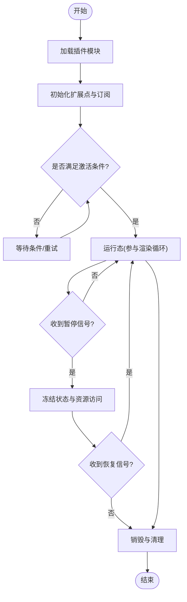
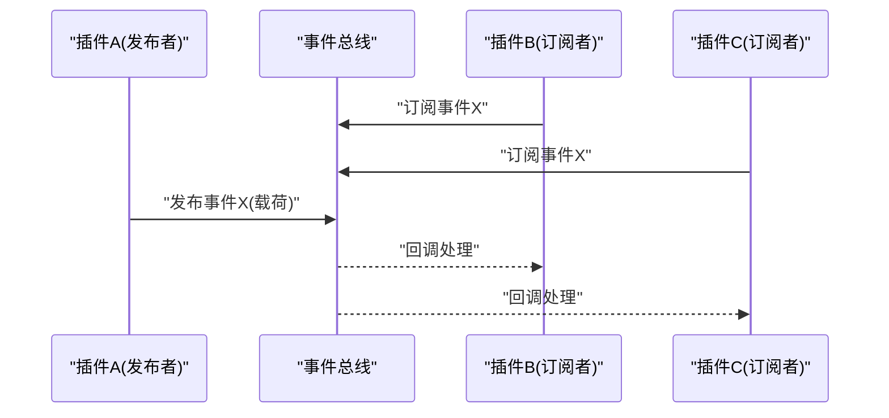
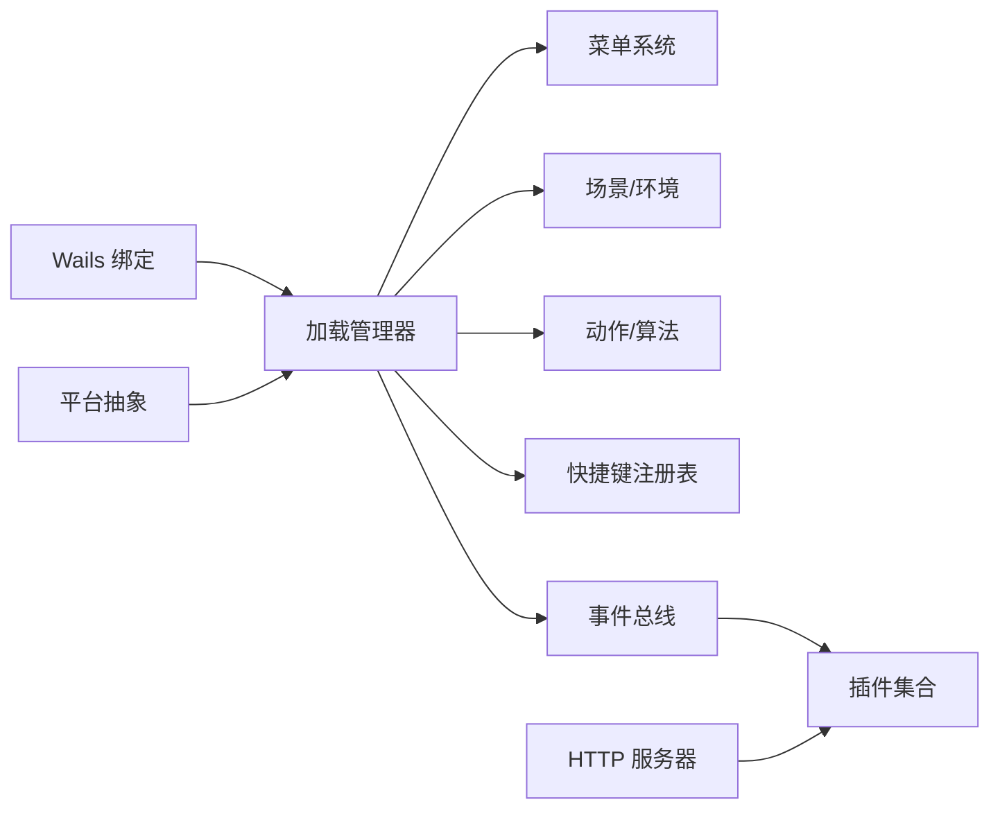

# 插件生命周期管理

<cite>
**本文引用的文件**   
- [main.go](file://main.go)
- [app.go](file://internal/app/app.go)
- [httpserver.go](file://internal/app/httpserver.go)
- [config.go](file://internal/app/config.go)
- [integration.go](file://internal/app/integration.go)
- [watch.go](file://internal/app/watch.go)
- [pathmgr.go](file://internal/app/pathmgr.go)
- [scene.go](file://internal/app/scene.go)
- [library.go](file://internal/app/library.go)
- [update.go](file://internal/app/update.go)
- [proxy.go](file://internal/app/proxy.go)
- [goerr.go](file://frontend/src/core/i18n/goerr.ts)
- [events.ts](file://frontend/src/core/events.ts)
- [init.ts](file://frontend/src/core/init.ts)
- [main.ts](file://frontend/src/core/main.ts)
- [load-manager.ts](file://frontend/src/core/load-manager.ts)
- [render-loop.ts](file://frontend/src/core/render-loop.ts)
- [dispose-helpers.ts](file://frontend/src/core/dispose-helpers.ts)
- [env-dispatcher.test.ts](file://frontend/src/core/__tests__/env-dispatcher.test.ts)
- [shortcut-registry.ts](file://frontend/src/core/shortcut-registry.ts)
- [menu-schema.ts](file://frontend/src/menus/menu-schema.ts)
- [menu-factory.ts](file://frontend/src/menus/menu-factory.ts)
- [menu.ts](file://frontend/src/menus/menu.ts)
- [wails-bindings.ts](file://frontend/src/core/wails-bindings.ts)
- [platform.ts](file://frontend/src/core/platform.ts)
</cite>

## 目录
1. [引言](#引言)
2. [项目结构](#项目结构)
3. [核心组件](#核心组件)
4. [架构总览](#架构总览)
5. [详细组件分析](#详细组件分析)
6. [依赖分析](#依赖分析)
7. [性能考虑](#性能考虑)
8. [故障排查指南](#故障排查指南)
9. [结论](#结论)
10. [附录](#附录)

## 引言
本文件围绕“插件生命周期管理”展开，面向希望扩展或集成 MikuMikuAR 的开发者。文档将系统阐述插件从加载、初始化、激活、暂停到销毁的完整生命周期；深入解释依赖注入机制（服务发现、版本兼容、冲突解决）；说明中间件模式与钩子系统的设计实现；并提供插件间通信、事件订阅发布、状态同步的实现要点与示例路径；最后给出资源管理与内存泄漏防护的实践建议。

## 项目结构
本项目采用前后端分离的架构：前端基于 TypeScript 构建用户界面与运行时编排，后端以 Go 提供应用宿主能力、文件系统访问、HTTP 服务、Wails 绑定等。插件体系主要在前端通过模块注册、菜单扩展、场景与环境子系统扩展点实现，后端通过 HTTP 与 Wails 绑定暴露能力给前端调用。

```mermaid
graph TB
subgraph "前端"
FE_Main["前端入口<br/>main.ts"]
FE_Init["初始化流程<br/>init.ts"]
FE_Events["事件总线<br/>events.ts"]
FE_LoadMgr["加载管理器<br/>load-manager.ts"]
FE_RenderLoop["渲染循环<br/>render-loop.ts"]
FE_Dispose["释放辅助<br/>dispose-helpers.ts"]
FE_MenuSchema["菜单声明式模式<br/>menu-schema.ts"]
FE_MenuFactory["菜单工厂<br/>menu-factory.ts"]
FE_Shortcuts["快捷键注册表<br/>shortcut-registry.ts"]
FE_Wails["Wails 绑定桥接<br/>wails-bindings.ts"]
end
subgraph "后端"
GO_Main["Go 入口<br/>main.go"]
GO_App["应用宿主<br/>app.go"]
GO_HTTP["HTTP 服务器<br/>httpserver.go"]
GO_Config["配置中心<br/>config.go"]
GO_Integration["集成层<br/>integration.go"]
GO_Watch["热重载监听<br/>watch.go"]
GO_PathMgr["路径管理<br/>pathmgr.go"]
GO_Scene["场景相关<br/>scene.go"]
GO_Library["库相关<br/>library.go"]
GO_Update["更新检查<br/>update.go"]
GO_Proxy["代理/转发<br/>proxy.go"]
end
FE_Main --> FE_Init
FE_Init --> FE_LoadMgr
FE_LoadMgr --> FE_Events
FE_LoadMgr --> FE_MenuSchema
FE_LoadMgr --> FE_MenuFactory
FE_LoadMgr --> FE_Shortcuts
FE_LoadMgr --> FE_Wails
FE_RenderLoop --> FE_Dispose
GO_Main --> GO_App
GO_App --> GO_HTTP
GO_App --> GO_Config
GO_App --> GO_Integration
GO_App --> GO_Watch
GO_App --> GO_PathMgr
GO_App --> GO_Scene
GO_App --> GO_Library
GO_App --> GO_Update
GO_App --> GO_Proxy
FE_Wails < --> GO_App
FE_Events < --> GO_HTTP
```

图表来源
- [main.go:1-200](file://main.go#L1-L200)
- [app.go:1-200](file://internal/app/app.go#L1-L200)
- [httpserver.go:1-200](file://internal/app/httpserver.go#L1-L200)
- [config.go:1-200](file://internal/app/config.go#L1-L200)
- [integration.go:1-200](file://internal/app/integration.go#L1-L200)
- [watch.go:1-200](file://internal/app/watch.go#L1-L200)
- [pathmgr.go:1-200](file://internal/app/pathmgr.go#L1-L200)
- [scene.go:1-200](file://internal/app/scene.go#L1-L200)
- [library.go:1-200](file://internal/app/library.go#L1-L200)
- [update.go:1-200](file://internal/app/update.go#L1-L200)
- [proxy.go:1-200](file://internal/app/proxy.go#L1-L200)
- [main.ts:1-200](file://frontend/src/core/main.ts#L1-L200)
- [init.ts:1-200](file://frontend/src/core/init.ts#L1-L200)
- [events.ts:1-200](file://frontend/src/core/events.ts#L1-L200)
- [load-manager.ts:1-200](file://frontend/src/core/load-manager.ts#L1-L200)
- [render-loop.ts:1-200](file://frontend/src/core/render-loop.ts#L1-L200)
- [dispose-helpers.ts:1-200](file://frontend/src/core/dispose-helpers.ts#L1-L200)
- [menu-schema.ts:1-200](file://frontend/src/menus/menu-schema.ts#L1-L200)
- [menu-factory.ts:1-200](file://frontend/src/menus/menu-factory.ts#L1-L200)
- [shortcut-registry.ts:1-200](file://frontend/src/core/shortcut-registry.ts#L1-L200)
- [wails-bindings.ts:1-200](file://frontend/src/core/wails-bindings.ts#L1-L200)

章节来源
- [main.go:1-200](file://main.go#L1-L200)
- [app.go:1-200](file://internal/app/app.go#L1-L200)
- [httpserver.go:1-200](file://internal/app/httpserver.go#L1-L200)
- [config.go:1-200](file://internal/app/config.go#L1-L200)
- [integration.go:1-200](file://internal/app/integration.go#L1-L200)
- [watch.go:1-200](file://internal/app/watch.go#L1-L200)
- [pathmgr.go:1-200](file://internal/app/pathmgr.go#L1-L200)
- [scene.go:1-200](file://internal/app/scene.go#L1-L200)
- [library.go:1-200](file://internal/app/library.go#L1-L200)
- [update.go:1-200](file://internal/app/update.go#L1-L200)
- [proxy.go:1-200](file://internal/app/proxy.go#L1-L200)
- [main.ts:1-200](file://frontend/src/core/main.ts#L1-L200)
- [init.ts:1-200](file://frontend/src/core/init.ts#L1-L200)
- [events.ts:1-200](file://frontend/src/core/events.ts#L1-L200)
- [load-manager.ts:1-200](file://frontend/src/core/load-manager.ts#L1-L200)
- [render-loop.ts:1-200](file://frontend/src/core/render-loop.ts#L1-L200)
- [dispose-helpers.ts:1-200](file://frontend/src/core/dispose-helpers.ts#L1-L200)
- [menu-schema.ts:1-200](file://frontend/src/menus/menu-schema.ts#L1-L200)
- [menu-factory.ts:1-200](file://frontend/src/menus/menu-factory.ts#L1-L200)
- [shortcut-registry.ts:1-200](file://frontend/src/core/shortcut-registry.ts#L1-L200)
- [wails-bindings.ts:1-200](file://frontend/src/core/wails-bindings.ts#L1-L200)

## 核心组件
- 应用宿主（Go）：负责进程启动、配置加载、HTTP 服务、Wails 绑定、插件扫描与热重载、资源路径解析、场景与库管理等。
- 前端运行时：负责 UI 初始化、模块加载、事件总线、渲染循环、菜单与快捷键注册、与后端交互。
- 插件扩展点：
  - 菜单扩展：通过声明式 schema 与工厂创建菜单项，支持动态注册与卸载。
  - 场景与环境扩展：在场景与环境子系统中注册行为与渲染管线阶段。
  - 动作与算法扩展：在 motion-algos 中注册可插拔的动作处理逻辑。
  - 快捷键扩展：通过注册表集中管理快捷键映射与优先级。
  - 错误与国际化：统一的错误包装与多语言提示。

章节来源
- [app.go:1-200](file://internal/app/app.go#L1-L200)
- [httpserver.go:1-200](file://internal/app/httpserver.go#L1-L200)
- [config.go:1-200](file://internal/app/config.go#L1-L200)
- [integration.go:1-200](file://internal/app/integration.go#L1-L200)
- [watch.go:1-200](file://internal/app/watch.go#L1-L200)
- [pathmgr.go:1-200](file://internal/app/pathmgr.go#L1-L200)
- [scene.go:1-200](file://internal/app/scene.go#L1-L200)
- [library.go:1-200](file://internal/app/library.go#L1-L200)
- [update.go:1-200](file://internal/app/update.go#L1-L200)
- [proxy.go:1-200](file://internal/app/proxy.go#L1-L200)
- [main.ts:1-200](file://frontend/src/core/main.ts#L1-L200)
- [init.ts:1-200](file://frontend/src/core/init.ts#L1-L200)
- [events.ts:1-200](file://frontend/src/core/events.ts#L1-L200)
- [load-manager.ts:1-200](file://frontend/src/core/load-manager.ts#L1-L200)
- [render-loop.ts:1-200](file://frontend/src/core/render-loop.ts#L1-L200)
- [dispose-helpers.ts:1-200](file://frontend/src/core/dispose-helpers.ts#L1-L200)
- [menu-schema.ts:1-200](file://frontend/src/menus/menu-schema.ts#L1-L200)
- [menu-factory.ts:1-200](file://frontend/src/menus/menu-factory.ts#L1-L200)
- [shortcut-registry.ts:1-200](file://frontend/src/core/shortcut-registry.ts#L1-L200)
- [wails-bindings.ts:1-200](file://frontend/src/core/wails-bindings.ts#L1-L200)
- [goerr.ts:1-200](file://frontend/src/core/i18n/goerr.ts#L1-L200)

## 架构总览
下图展示了插件生命周期的关键阶段与组件交互：加载由前端加载管理器驱动，初始化通过菜单/场景/动作扩展点进行，激活阶段进入运行态并参与渲染循环，暂停时冻结状态与资源访问，销毁时执行清理与释放。

```mermaid
sequenceDiagram
participant Host as "应用宿主(Go)"
participant FE as "前端运行时"
participant Loader as "加载管理器"
participant Menu as "菜单系统"
participant Scene as "场景/环境"
participant Loop as "渲染循环"
participant Events as "事件总线"
Host->>FE : "启动应用"
FE->>Loader : "初始化加载器"
Loader->>Menu : "注册菜单扩展"
Loader->>Scene : "注册场景/环境扩展"
Loader->>Events : "订阅系统事件"
FE->>Loop : "启动渲染循环"
Note over FE,Loop : "激活阶段：插件处于运行态"
Events-->>FE : "触发插件事件"
FE->>Scene : "暂停/恢复状态切换"
FE->>Loader : "销毁插件并释放资源"
Loader->>Menu : "注销菜单扩展"
Loader->>Scene : "清理场景/环境扩展"
Loader->>Events : "取消事件订阅"
```

图表来源
- [main.ts:1-200](file://frontend/src/core/main.ts#L1-L200)
- [init.ts:1-200](file://frontend/src/core/init.ts#L1-L200)
- [load-manager.ts:1-200](file://frontend/src/core/load-manager.ts#L1-L200)
- [menu-schema.ts:1-200](file://frontend/src/menus/menu-schema.ts#L1-L200)
- [menu-factory.ts:1-200](file://frontend/src/menus/menu-factory.ts#L1-L200)
- [events.ts:1-200](file://frontend/src/core/events.ts#L1-L200)
- [render-loop.ts:1-200](file://frontend/src/core/render-loop.ts#L1-L200)

## 详细组件分析

### 插件生命周期阶段
- 加载阶段
  - 前端加载管理器扫描可用插件模块，解析元数据与依赖声明。
  - 通过菜单 schema 与工厂进行菜单项的动态注册。
  - 通过快捷键注册表登记快捷键映射。
- 初始化阶段
  - 建立事件订阅，连接后端能力（Wails 绑定）。
  - 向场景与环境子系统注册扩展点（如渲染阶段、物理影响、UI 面板）。
- 激活阶段
  - 进入运行态，参与渲染循环与输入处理。
  - 响应系统事件，维护自身状态并与其它插件同步。
- 暂停阶段
  - 冻结计算与渲染更新，保留状态以便快速恢复。
  - 释放对共享资源的独占访问，避免竞争。
- 销毁阶段
  - 注销所有扩展点（菜单、快捷键、场景/环境）。
  - 取消事件订阅，释放 GPU/CPU 资源，确保无悬挂引用。

章节来源
- [load-manager.ts:1-200](file://frontend/src/core/load-manager.ts#L1-L200)
- [menu-schema.ts:1-200](file://frontend/src/menus/menu-schema.ts#L1-L200)
- [menu-factory.ts:1-200](file://frontend/src/menus/menu-factory.ts#L1-L200)
- [shortcut-registry.ts:1-200](file://frontend/src/core/shortcut-registry.ts#L1-L200)
- [events.ts:1-200](file://frontend/src/core/events.ts#L1-L200)
- [render-loop.ts:1-200](file://frontend/src/core/render-loop.ts#L1-L200)
- [dispose-helpers.ts:1-200](file://frontend/src/core/dispose-helpers.ts#L1-L200)

#### 生命周期流程图


图表来源
- [load-manager.ts:1-200](file://frontend/src/core/load-manager.ts#L1-L200)
- [render-loop.ts:1-200](file://frontend/src/core/render-loop.ts#L1-L200)
- [dispose-helpers.ts:1-200](file://frontend/src/core/dispose-helpers.ts#L1-L200)

### 依赖注入与服务发现
- 服务发现
  - 前端通过加载管理器收集各模块导出的服务接口，形成服务目录。
  - 菜单与场景扩展点按类型查找所需服务，若缺失则拒绝激活并上报错误。
- 版本兼容
  - 插件声明最小/最大兼容的前端与后端 API 版本范围。
  - 启动时校验版本，不兼容则跳过加载并记录审计日志。
- 冲突解决
  - 同名服务注册时采用优先级策略（例如按插件声明顺序或显式权重）。
  - 冲突检测失败时回滚已注册的服务，保证宿主稳定。

章节来源
- [load-manager.ts:1-200](file://frontend/src/core/load-manager.ts#L1-L200)
- [menu-schema.ts:1-200](file://frontend/src/menus/menu-schema.ts#L1-L200)
- [menu-factory.ts:1-200](file://frontend/src/menus/menu-factory.ts#L1-L200)
- [wails-bindings.ts:1-200](file://frontend/src/core/wails-bindings.ts#L1-L200)
- [config.go:1-200](file://internal/app/config.go#L1-L200)

### 中间件模式与钩子系统
- 中间件模式
  - 请求链路：前端事件或 HTTP 请求经过中间件链，依次执行前置校验、日志、权限、限流等。
  - 错误传播：任一中间件失败可短路返回，统一错误包装与国际化提示。
- 钩子系统
  - 场景/环境渲染管线提供多个钩子点（如预处理、后处理、合成阶段），插件可挂载自定义逻辑。
  - 动作算法扩展点允许插入新的程序化动作或覆盖默认行为。

章节来源
- [httpserver.go:1-200](file://internal/app/httpserver.go#L1-L200)
- [proxy.go:1-200](file://internal/app/proxy.go#L1-L200)
- [events.ts:1-200](file://frontend/src/core/events.ts#L1-L200)
- [menu-schema.ts:1-200](file://frontend/src/menus/menu-schema.ts#L1-L200)
- [menu-factory.ts:1-200](file://frontend/src/menus/menu-factory.ts#L1-L200)
- [goerr.ts:1-200](file://frontend/src/core/i18n/goerr.ts#L1-L200)

### 插件间通信、事件订阅发布与状态同步
- 事件总线
  - 插件通过事件总线订阅系统事件（如模型加载完成、场景切换、设置变更）。
  - 发布方仅关心事件名与载荷，解耦具体消费者。
- 插件间通信
  - 通过共享服务接口（由加载管理器注入）进行方法调用。
  - 跨边界调用使用 Wails 绑定或 HTTP 接口，注意异步与超时处理。
- 状态同步
  - 使用响应式状态对象，插件订阅状态变化并增量更新。
  - 在暂停/恢复时保存/恢复快照，避免状态漂移。

章节来源
- [events.ts:1-200](file://frontend/src/core/events.ts#L1-L200)
- [load-manager.ts:1-200](file://frontend/src/core/load-manager.ts#L1-L200)
- [wails-bindings.ts:1-200](file://frontend/src/core/wails-bindings.ts#L1-L200)
- [httpserver.go:1-200](file://internal/app/httpserver.go#L1-L200)
- [env-dispatcher.test.ts:1-200](file://frontend/src/core/__tests__/env-dispatcher.test.ts#L1-L200)

#### 事件订阅发布序列图


图表来源
- [events.ts:1-200](file://frontend/src/core/events.ts#L1-L200)

### 资源管理与内存泄漏防护
- 资源清单
  - 每个插件维护资源清单（纹理、几何体、动画、句柄等），在销毁阶段逐一释放。
- 引用计数与弱引用
  - 对共享资源采用引用计数，当计数归零时自动释放。
  - 使用弱引用避免循环引用导致的无法回收。
- 清理顺序
  - 先释放上层依赖（如 UI 面板），再释放底层资源（如 GPU 资源）。
  - 在渲染循环外执行释放，避免并发修改。
- 测试与审计
  - 通过单元测试验证释放路径，确保无悬挂定时器、事件订阅与 DOM 节点。

章节来源
- [dispose-helpers.ts:1-200](file://frontend/src/core/dispose-helpers.ts#L1-L200)
- [render-loop.ts:1-200](file://frontend/src/core/render-loop.ts#L1-L200)
- [env-dispatcher.test.ts:1-200](file://frontend/src/core/__tests__/env-dispatcher.test.ts#L1-L200)

## 依赖分析
- 组件耦合
  - 加载管理器与菜单/场景/动作子系统存在强耦合，需通过接口抽象降低直接依赖。
  - 事件总线作为松耦合枢纽，减少插件间的直接调用。
- 外部依赖
  - Wails 绑定用于跨进程调用，HTTP 服务器用于远程能力访问。
  - 平台差异通过 platform.ts 抽象，屏蔽 OS 差异。
- 潜在循环依赖
  - 插件之间应避免互相导入，改用事件或服务接口。
  - 加载管理器不应反向依赖具体插件实现。



图表来源
- [load-manager.ts:1-200](file://frontend/src/core/load-manager.ts#L1-L200)
- [menu-schema.ts:1-200](file://frontend/src/menus/menu-schema.ts#L1-L200)
- [menu-factory.ts:1-200](file://frontend/src/menus/menu-factory.ts#L1-L200)
- [events.ts:1-200](file://frontend/src/core/events.ts#L1-L200)
- [wails-bindings.ts:1-200](file://frontend/src/core/wails-bindings.ts#L1-L200)
- [httpserver.go:1-200](file://internal/app/httpserver.go#L1-L200)
- [platform.ts:1-200](file://frontend/src/core/platform.ts#L1-L200)

章节来源
- [load-manager.ts:1-200](file://frontend/src/core/load-manager.ts#L1-L200)
- [menu-schema.ts:1-200](file://frontend/src/menus/menu-schema.ts#L1-L200)
- [menu-factory.ts:1-200](file://frontend/src/menus/menu-factory.ts#L1-L200)
- [events.ts:1-200](file://frontend/src/core/events.ts#L1-L200)
- [wails-bindings.ts:1-200](file://frontend/src/core/wails-bindings.ts#L1-L200)
- [httpserver.go:1-200](file://internal/app/httpserver.go#L1-L200)
- [platform.ts:1-200](file://frontend/src/core/platform.ts#L1-L200)

## 性能考虑
- 懒加载与按需激活
  - 仅在需要时加载插件模块，减少启动时间。
  - 对重型资源采用延迟初始化与缓存策略。
- 批处理与节流
  - 高频事件（如鼠标移动、渲染帧）采用批处理与节流，避免主线程阻塞。
- 渲染优化
  - 在渲染循环中避免分配临时对象，复用缓冲区与材质。
- 监控与度量
  - 记录插件加载耗时、事件分发延迟、资源占用峰值，定位瓶颈。

[本节为通用指导，无需特定文件来源]

## 故障排查指南
- 常见问题
  - 插件未激活：检查依赖服务是否存在、版本兼容性是否满足。
  - 事件未触发：确认订阅是否正确、事件名是否一致、是否被提前取消。
  - 内存泄漏：检查销毁路径是否完整，是否有悬挂定时器或未取消的订阅。
- 调试技巧
  - 启用详细日志，追踪加载、初始化、激活、销毁各阶段的调用栈。
  - 使用单元测试模拟插件行为，验证释放路径与状态一致性。
- 错误处理
  - 统一错误包装与国际化提示，便于定位问题与用户反馈。

章节来源
- [goerr.ts:1-200](file://frontend/src/core/i18n/goerr.ts#L1-L200)
- [env-dispatcher.test.ts:1-200](file://frontend/src/core/__tests__/env-dispatcher.test.ts#L1-L200)
- [dispose-helpers.ts:1-200](file://frontend/src/core/dispose-helpers.ts#L1-L200)

## 结论
通过明确的生命周期阶段、完善的依赖注入与服务发现、灵活的中间件与钩子机制、以及健壮的通信与资源管理策略，MikuMikuAR 的插件体系具备良好的可扩展性与稳定性。建议在开发插件时严格遵循生命周期契约，合理使用事件总线与服务接口，并在销毁阶段彻底释放资源，以避免内存泄漏与性能退化。

[本节为总结性内容，无需特定文件来源]

## 附录
- 最佳实践清单
  - 在加载阶段只注册轻量扩展，重逻辑推迟到初始化或激活阶段。
  - 使用声明式菜单 schema 与工厂，避免硬编码与重复代码。
  - 通过事件总线进行插件间通信，减少直接依赖。
  - 在销毁阶段按依赖逆序释放资源，确保无悬挂引用。
  - 编写单元测试覆盖加载、初始化、销毁路径，保障健壮性。

[本节为补充信息，无需特定文件来源]