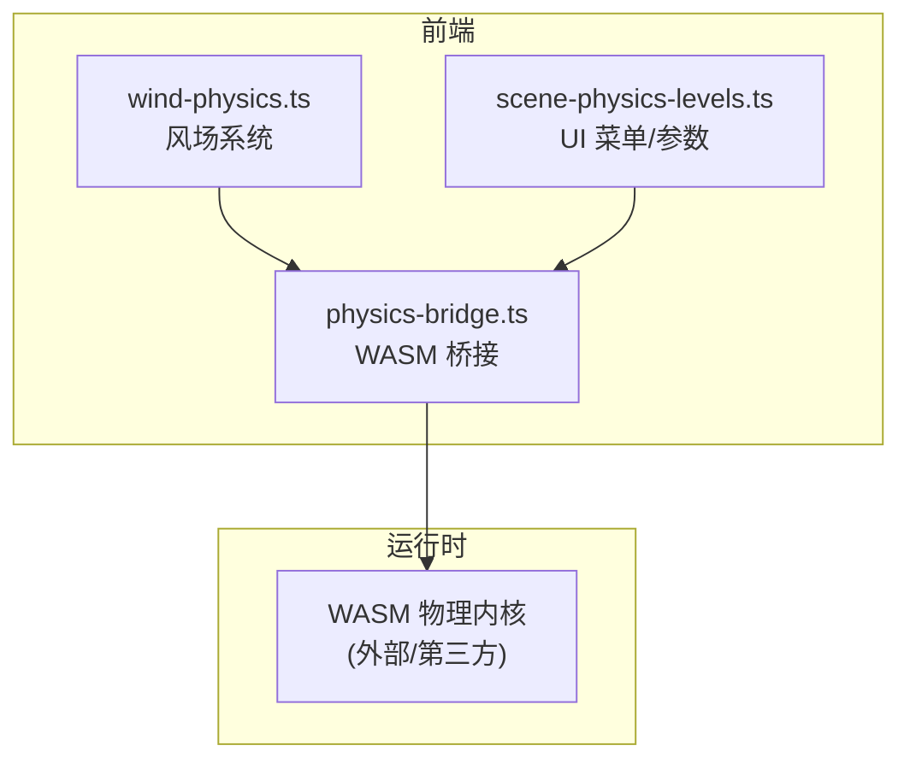
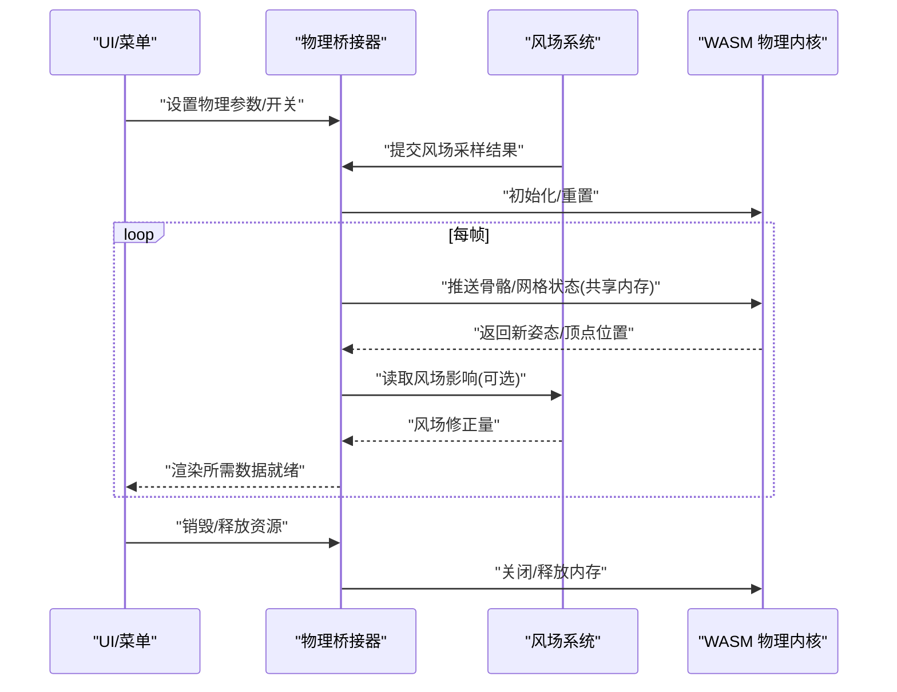
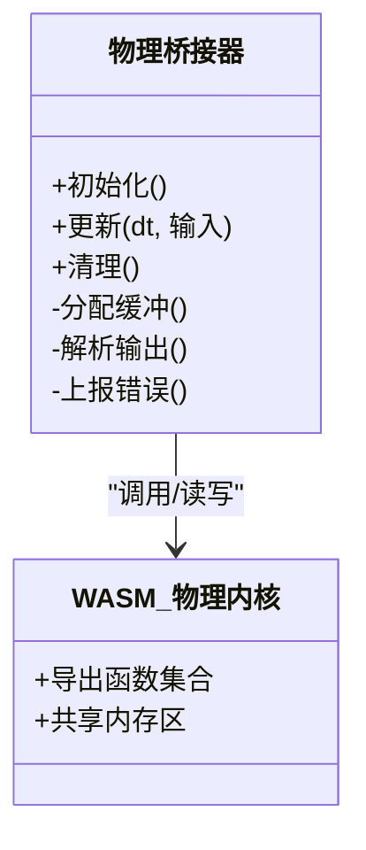
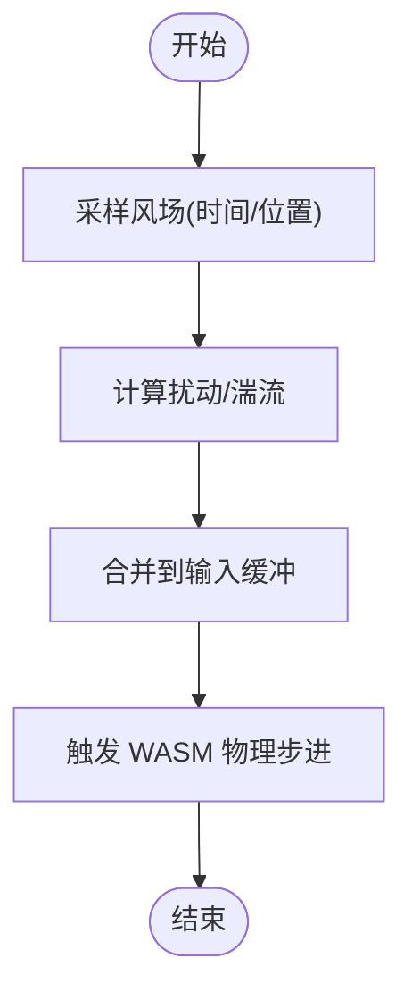
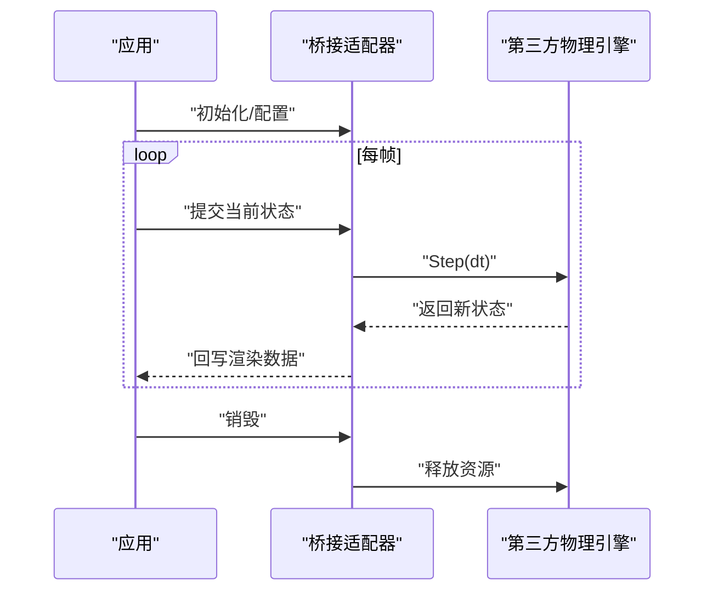
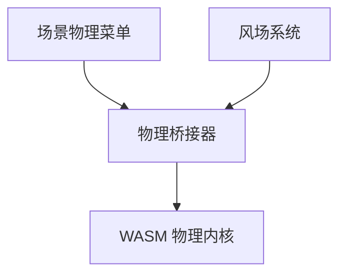

# 物理引擎插件

<cite>
**本文引用的文件**   
- [physics-bridge.ts](file://frontend/src/physics/physics-bridge.ts)
- [wind-physics.ts](file://frontend/src/physics/wind-physics.ts)
- [scene-physics-levels.ts](file://frontend/src/menus/scene-physics-levels.ts)
- [adr-028-wind-system-unification.md](file://docs/adr/adr-028-wind-system-unification.md)
- [adr-056-wasm-runtime-motion-layers.md](file://docs/adr/adr-056-wasm-runtime-motion-layers.md)
- [adr-077-plaza-cookie-relay.md](file://docs/adr/adr-077-plaza-cookie-relay.md)
- [buglog-两套物理引擎并存性能差3至5倍.md](file://docs/buglog/两套物理引擎并存性能差3至5倍.md)
- [research-wind-affect-wasm-physics.md](file://docs/research/wind-affect-wasm-physics.md)
</cite>

## 目录
1. [简介](#简介)
2. [项目结构](#项目结构)
3. [核心组件](#核心组件)
4. [架构总览](#架构总览)
5. [详细组件分析](#详细组件分析)
6. [依赖分析](#依赖分析)
7. [性能考虑](#性能考虑)
8. [故障排查指南](#故障排查指南)
9. [结论](#结论)
10. [附录](#附录)

## 简介
本文件面向“物理引擎插件”的构建与集成，聚焦于 WASM 物理计算桥接架构、Go 与 JavaScript 的双向通信、内存数据交换、错误处理机制；并详细说明物理引擎插件接口定义（初始化、更新循环、资源清理）、风场系统与布料物理的实现原理。同时提供第三方物理引擎集成、自定义物理效果实现与性能优化的实践建议，以及跨平台兼容性与调试方法。

## 项目结构
本项目在 Web 前端侧通过 TypeScript 模块组织物理相关能力：
- 物理桥接层：负责与 WASM 运行时交互、数据序列化/反序列化、生命周期管理
- 风场系统：统一风场输入、时间步进、对骨骼/布料的扰动
- 菜单配置：暴露物理参数到 UI，驱动运行时行为

图表来源
- [physics-bridge.ts:1-200](file://frontend/src/physics/physics-bridge.ts#L1-L200)
- [wind-physics.ts:1-200](file://frontend/src/physics/wind-physics.ts#L1-L200)
- [scene-physics-levels.ts:1-200](file://frontend/src/menus/scene-physics-levels.ts#L1-L200)

章节来源
- [physics-bridge.ts:1-200](file://frontend/src/physics/physics-bridge.ts#L1-L200)
- [wind-physics.ts:1-200](file://frontend/src/physics/wind-physics.ts#L1-L200)
- [scene-physics-levels.ts:1-200](file://frontend/src/menus/scene-physics-levels.ts#L1-L200)

## 核心组件
- 物理桥接器（WASM Bridge）
  - 职责：加载/初始化 WASM 实例、分配共享内存、建立 Go/JS 调用通道、帧级同步、错误上报与恢复
  - 关键流程：创建上下文 → 分配缓冲 → 注册回调 → 每帧推送状态 → 拉取结果 → 释放资源
- 风场系统（Wind System）
  - 职责：维护全局风场向量场、噪声/湍流模型、时间步进、对骨骼/布料施加力或位移
  - 关键流程：采样风场 → 计算扰动 → 写入目标缓冲区 → 触发 WASM 物理步进
- 菜单与参数（Scene Physics Levels）
  - 职责：将物理参数（重力、阻尼、风强等）暴露给 UI，监听变更并下发到桥接层

章节来源
- [physics-bridge.ts:1-200](file://frontend/src/physics/physics-bridge.ts#L1-L200)
- [wind-physics.ts:1-200](file://frontend/src/physics/wind-physics.ts#L1-L200)
- [scene-physics-levels.ts:1-200](file://frontend/src/menus/scene-physics-levels.ts#L1-L200)

## 架构总览
下图展示从 UI 到 WASM 的物理计算链路，包括双向通信与内存数据交换路径。

图表来源
- [physics-bridge.ts:1-200](file://frontend/src/physics/physics-bridge.ts#L1-L200)
- [wind-physics.ts:1-200](file://frontend/src/physics/wind-physics.ts#L1-L200)

## 详细组件分析

### 物理桥接器（WASM Bridge）
- 设计要点
  - 生命周期：init → update → dispose，严格对应 WASM 实例与内存区域
  - 数据交换：使用共享内存或结构化拷贝，避免频繁 GC
  - 错误处理：捕获异常、降级策略、可观测日志
- 典型调用链
  - 初始化：加载 WASM → 分配缓冲 → 注册回调
  - 更新：打包输入 → 调用导出函数 → 解析输出 → 回写渲染
  - 清理：释放缓冲 → 卸载实例 → 注销事件

图表来源
- [physics-bridge.ts:1-200](file://frontend/src/physics/physics-bridge.ts#L1-L200)

章节来源
- [physics-bridge.ts:1-200](file://frontend/src/physics/physics-bridge.ts#L1-L200)

### 风场系统（Wind System）
- 设计要点
  - 统一风场协议：世界空间向量场，支持时变与空间噪声
  - 与物理耦合：在每帧前注入风场扰动，或直接作为外力参与求解
  - 性能优化：分块采样、LOD、缓存最近采样点
- 与桥接器的协作
  - 风场系统产出“风场修正量”，由桥接器合并后推入 WASM

图表来源
- [wind-physics.ts:1-200](file://frontend/src/physics/wind-physics.ts#L1-L200)

章节来源
- [wind-physics.ts:1-200](file://frontend/src/physics/wind-physics.ts#L1-L200)

### 菜单与参数（Scene Physics Levels）
- 职责
  - 暴露物理参数（如重力、阻尼、风强、布料刚度等）
  - 监听用户操作，实时下发到桥接器
- 与桥接器的关系
  - 仅作为控制面，不直接参与计算

图表来源
- [scene-physics-levels.ts:1-200](file://frontend/src/menus/scene-physics-levels.ts#L1-L200)

章节来源
- [scene-physics-levels.ts:1-200](file://frontend/src/menus/scene-physics-levels.ts#L1-L200)

### 概念性概览
以下图示为通用“第三方物理引擎集成”的概念流程，便于理解整体思路。

[此图为概念流程，不对应具体源码文件]

## 依赖分析
- 内部依赖
  - 物理桥接器依赖风场系统提供的风场扰动
  - 菜单层依赖桥接器暴露的参数接口
- 外部依赖
  - WASM 物理内核（可为自研或第三方）
  - 浏览器/平台环境（WebAssembly、SharedArrayBuffer 等）

图表来源
- [physics-bridge.ts:1-200](file://frontend/src/physics/physics-bridge.ts#L1-L200)
- [wind-physics.ts:1-200](file://frontend/src/physics/wind-physics.ts#L1-L200)
- [scene-physics-levels.ts:1-200](file://frontend/src/menus/scene-physics-levels.ts#L1-L200)

章节来源
- [physics-bridge.ts:1-200](file://frontend/src/physics/physics-bridge.ts#L1-L200)
- [wind-physics.ts:1-200](file://frontend/src/physics/wind-physics.ts#L1-L200)
- [scene-physics-levels.ts:1-200](file://frontend/src/menus/scene-physics-levels.ts#L1-L200)

## 性能考虑
- 减少跨语言边界调用次数：批量打包输入/输出，降低调用开销
- 使用零拷贝或最小拷贝策略：优先共享内存，必要时结构化拷贝
- 风场采样优化：空间/时间插值、缓存最近采样、按需细化
- 并行化：利用多线程 WASM（如 SharedArrayBuffer），注意线程安全与同步
- 避免 GC 抖动：复用缓冲对象、池化临时数组
- 多引擎并存时的取舍：避免在同一帧内同时运行两套完整物理栈，必要时按子系统拆分

章节来源
- [adr-056-wasm-runtime-motion-layers.md:1-200](file://docs/adr/adr-056-wasm-runtime-motion-layers.md#L1-L200)
- [buglog-两套物理引擎并存性能差3至5倍.md:1-200](file://docs/buglog/两套物理引擎并存性能差3至5倍.md#L1-L200)

## 故障排查指南
- 常见问题定位
  - WASM 加载失败：检查资源路径、CORS/COEP 配置、浏览器兼容性
  - 内存泄漏：确认每帧缓冲是否复用、dispose 是否被调用
  - 风场异常：验证风场强度范围、时间步长、采样坐标一致性
  - 双引擎冲突：确认是否同时启用两套物理栈导致竞争
- 诊断手段
  - 开启详细日志，记录关键阶段耗时与错误码
  - 使用浏览器开发者工具的性能面板，观察主线程阻塞与内存峰值
  - 针对风场问题，可视化风场向量场进行对比验证

章节来源
- [adr-077-plaza-cookie-relay.md:1-200](file://docs/adr/adr-077-plaza-cookie-relay.md#L1-L200)
- [research-wind-affect-wasm-physics.md:1-200](file://docs/research/wind-affect-wasm-physics.md#L1-L200)

## 结论
通过将物理计算下沉到 WASM 并在桥接层做好数据编排与生命周期管理，可在保持前端灵活性的同时获得高性能与可扩展性。风场系统作为统一的扰动源，能无缝接入多种物理后端。遵循上述架构与实践，可有效提升稳定性与性能，并为后续引入更多物理效果奠定基础。

## 附录
- 术语
  - WASM：WebAssembly，用于高性能计算的沙箱执行环境
  - 共享内存：跨语言/线程间高效数据交换的内存区域
  - 风场：随时间与空间变化的向量场，用于模拟空气流动对物体的作用
- 参考文档
  - 风场统一方案决策记录
  - WASM 运行时运动层设计
  - 风场对 WASM 物理的影响研究

章节来源
- [adr-028-wind-system-unification.md:1-200](file://docs/adr/adr-028-wind-system-unification.md#L1-L200)
- [adr-056-wasm-runtime-motion-layers.md:1-200](file://docs/adr/adr-056-wasm-runtime-motion-layers.md#L1-L200)
- [research-wind-affect-wasm-physics.md:1-200](file://docs/research/wind-affect-wasm-physics.md#L1-L200)