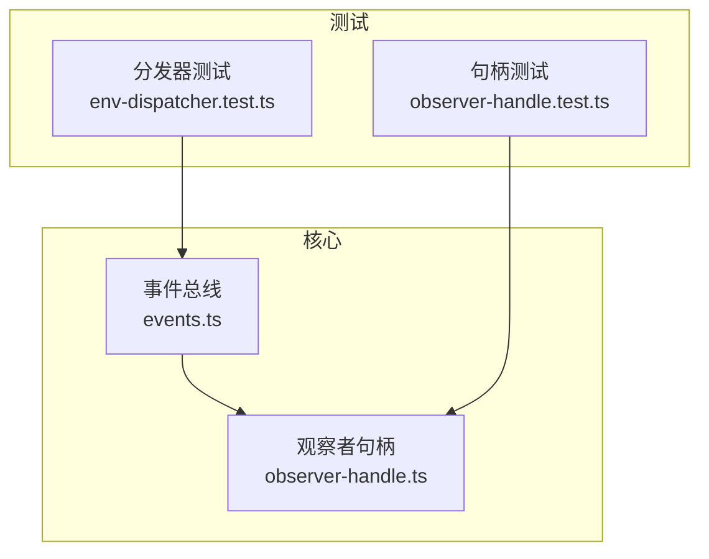
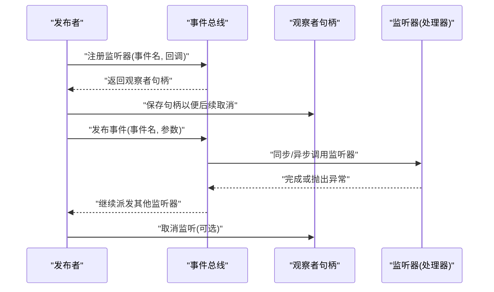
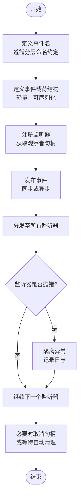
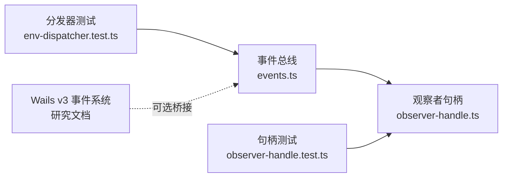

# 事件系统

<cite>
**本文引用的文件**   
- [events.ts](file://frontend/src/core/events.ts)
- [observer-handle.ts](file://frontend/src/core/observer-handle.ts)
- [env-dispatcher.test.ts](file://frontend/src/core/__tests__/env-dispatcher.test.ts)
- [observer-handle.test.ts](file://frontend/src/core/__tests__/observer-handle.test.ts)
- [ADR-139-observer-registry.md](file://docs/adr/adr-139-observer-registry.md)
- [Wails v3-events system.md](file://docs/research/Wails%20v3-events%20system.md)
</cite>

## 目录
1. [简介](#简介)
2. [项目结构](#项目结构)
3. [核心组件](#核心组件)
4. [架构总览](#架构总览)
5. [详细组件分析](#详细组件分析)
6. [依赖分析](#依赖分析)
7. [性能考虑](#性能考虑)
8. [故障排查指南](#故障排查指南)
9. [结论](#结论)
10. [附录](#附录)

## 简介
本文件围绕前端事件系统的实现，系统化阐述事件驱动架构的设计与落地：事件总线、事件类型定义、发布订阅模式、观察者句柄管理与自动清理机制、异步处理策略、命名约定与参数传递规范，以及性能与调试实践。文档同时提供可操作的示例路径，帮助读者快速上手扩展新事件与处理器。

## 项目结构
事件系统位于前端核心模块中，主要包含以下职责划分：
- 事件总线与分发器：负责事件的注册、发布、注销与调度
- 观察者句柄：封装监听器的生命周期管理，支持自动清理
- 测试用例：覆盖分发流程与句柄清理行为，保障稳定性

图表来源
- [events.ts](file://frontend/src/core/events.ts)
- [observer-handle.ts](file://frontend/src/core/observer-handle.ts)
- [env-dispatcher.test.ts](file://frontend/src/core/__tests__/env-dispatcher.test.ts)
- [observer-handle.test.ts](file://frontend/src/core/__tests__/observer-handle.test.ts)

章节来源
- [events.ts](file://frontend/src/core/events.ts)
- [observer-handle.ts](file://frontend/src/core/observer-handle.ts)
- [env-dispatcher.test.ts](file://frontend/src/core/__tests__/env-dispatcher.test.ts)
- [observer-handle.test.ts](file://frontend/src/core/__tests__/observer-handle.test.ts)

## 核心组件
- 事件总线（Event Bus）
  - 职责：维护事件名到监听器集合的映射；提供注册、发布、注销能力；支持一次性监听与批量注销。
  - 关键特性：线程安全调用包装、错误隔离、可选的异步派发。
- 观察者句柄（Observer Handle）
  - 职责：封装对某个监听器的引用，暴露取消方法；在对象销毁或作用域结束时自动释放，防止内存泄漏。
  - 关键特性：幂等取消、组合多个句柄的统一清理接口。
- 测试套件
  - 覆盖事件分发顺序、异常隔离、重复注册与注销、句柄自动清理等行为。

章节来源
- [events.ts](file://frontend/src/core/events.ts)
- [observer-handle.ts](file://frontend/src/core/observer-handle.ts)
- [env-dispatcher.test.ts](file://frontend/src/core/__tests__/env-dispatcher.test.ts)
- [observer-handle.test.ts](file://frontend/src/core/__tests__/observer-handle.test.ts)

## 架构总览
事件系统采用“发布-订阅”模型，结合“观察者句柄”的生命周期管理，形成松耦合的通信通道。典型交互如下：

图表来源
- [events.ts](file://frontend/src/core/events.ts)
- [observer-handle.ts](file://frontend/src/core/observer-handle.ts)

## 详细组件分析

### 事件总线（Event Bus）
- 设计要点
  - 事件名作为键，值为监听器列表；支持一次性监听标记。
  - 发布时遍历监听器并调用，捕获异常避免单个处理器影响整体。
  - 提供统一注销入口，按事件名或全部清空。
- 使用建议
  - 将事件名集中管理，遵循统一的命名约定（见后文）。
  - 对耗时操作使用异步派发，避免阻塞主循环。
- 参考实现位置
  - [事件总线实现](file://frontend/src/core/events.ts)

章节来源
- [events.ts](file://frontend/src/core/events.ts)

### 观察者句柄（Observer Handle）
- 设计要点
  - 每个注册返回一个句柄，持有对监听器与总线的弱引用。
  - 提供取消方法，支持多次调用且幂等。
  - 可在对象析构或作用域结束时批量取消，避免悬挂引用导致内存泄漏。
- 使用建议
  - 将句柄保存在拥有者对象上，并在其销毁时统一清理。
  - 组合多个句柄为集合，提供一键释放。
- 参考实现位置
  - [观察者句柄实现](file://frontend/src/core/observer-handle.ts)

章节来源
- [observer-handle.ts](file://frontend/src/core/observer-handle.ts)

### 事件类型与命名约定
- 命名约定
  - 采用“模块.子域.动作”的分层命名，如“scene.model.loaded”、“motion.playback.started”。
  - 动词建议使用过去式表示已完成状态，或使用进行时表示进行中。
- 参数约定
  - 事件载荷以单一对象形式传递，字段语义清晰、可序列化。
  - 对于大对象或频繁触发的事件，优先传递轻量标识符，由监听器按需拉取数据。
- 参考约定与设计决策
  - [观察者注册与生命周期 ADR](file://docs/adr/adr-139-observer-registry.md)

章节来源
- [ADR-139-observer-registry.md](file://docs/adr/adr-139-observer-registry.md)

### 发布订阅与异步处理
- 同步派发
  - 适用于轻量、高频但执行时间极短的处理逻辑。
- 异步派发
  - 适用于 I/O、计算密集或需要解耦时序的场景。
  - 注意异常边界与错误上报，避免未捕获 Promise 拒绝。
- 参考实现位置
  - [事件总线实现](file://frontend/src/core/events.ts)

章节来源
- [events.ts](file://frontend/src/core/events.ts)

### 观察者模式的实现与自动清理
- 观察句柄管理
  - 注册即返回句柄，持有监听器引用与取消能力。
  - 支持批量句柄聚合，统一释放。
- 自动清理机制
  - 在对象销毁钩子中调用句柄取消，确保无悬挂引用。
  - 测试覆盖重复取消、空句柄等边界情况。
- 参考实现位置
  - [观察者句柄实现](file://frontend/src/core/observer-handle.ts)
  - [句柄测试](file://frontend/src/core/__tests__/observer-handle.test.ts)

章节来源
- [observer-handle.ts](file://frontend/src/core/observer-handle.ts)
- [observer-handle.test.ts](file://frontend/src/core/__tests__/observer-handle.test.ts)

### 事件命名与参数传递流程图

图表来源
- [events.ts](file://frontend/src/core/events.ts)
- [observer-handle.ts](file://frontend/src/core/observer-handle.ts)

## 依赖分析
- 内部依赖
  - 事件总线依赖观察者句柄进行生命周期管理。
  - 测试用例分别验证分发与句柄行为，保证契约稳定。
- 外部集成
  - 若需与 Wails 后端事件桥接，可参考 Wails v3 事件系统文档进行适配。

图表来源
- [events.ts](file://frontend/src/core/events.ts)
- [observer-handle.ts](file://frontend/src/core/observer-handle.ts)
- [env-dispatcher.test.ts](file://frontend/src/core/__tests__/env-dispatcher.test.ts)
- [observer-handle.test.ts](file://frontend/src/core/__tests__/observer-handle.test.ts)
- [Wails v3-events system.md](file://docs/research/Wails%20v3-events%20system.md)

章节来源
- [events.ts](file://frontend/src/core/events.ts)
- [observer-handle.ts](file://frontend/src/core/observer-handle.ts)
- [env-dispatcher.test.ts](file://frontend/src/core/__tests__/env-dispatcher.test.ts)
- [observer-handle.test.ts](file://frontend/src/core/__tests__/observer-handle.test.ts)
- [Wails v3-events system.md](file://docs/research/Wails%20v3-events%20system.md)

## 性能考虑
- 事件名索引
  - 使用字符串哈希表存储监听器集合，查找与插入均为 O(1)。
- 监听器数量控制
  - 避免在同一事件上注册过多监听器；必要时合并处理逻辑。
- 异步派发
  - 对耗时任务使用异步派发，降低主循环阻塞风险。
- 异常隔离
  - 单个监听器异常不应影响其他监听器；通过 try/catch 包裹。
- 内存管理
  - 及时取消不再需要的句柄；在对象销毁时统一清理。
- 参考实现位置
  - [事件总线实现](file://frontend/src/core/events.ts)
  - [观察者句柄实现](file://frontend/src/core/observer-handle.ts)

章节来源
- [events.ts](file://frontend/src/core/events.ts)
- [observer-handle.ts](file://frontend/src/core/observer-handle.ts)

## 故障排查指南
- 常见问题
  - 事件未触发：检查事件名是否一致、监听器是否正确注册、是否存在重复注销。
  - 监听器不生效：确认句柄未被提前取消；检查作用域生命周期。
  - 内存泄漏：未取消句柄或存在循环引用；在对象销毁处显式清理。
  - 异步错误丢失：Promise 拒绝未捕获；为异步监听器添加错误处理。
- 定位技巧
  - 在发布前后增加日志，打印事件名与参数摘要。
  - 使用测试用例复现问题，逐步缩小范围。
- 参考实现与用例
  - [分发器测试](file://frontend/src/core/__tests__/env-dispatcher.test.ts)
  - [句柄测试](file://frontend/src/core/__tests__/observer-handle.test.ts)

章节来源
- [env-dispatcher.test.ts](file://frontend/src/core/__tests__/env-dispatcher.test.ts)
- [observer-handle.test.ts](file://frontend/src/core/__tests__/observer-handle.test.ts)

## 结论
事件系统通过“事件总线 + 观察者句柄”的组合，实现了高内聚、低耦合的通信机制。合理的命名约定、参数设计与异步策略，配合完善的句柄清理与测试覆盖，能够显著提升系统的可维护性与稳定性。建议在新增功能时严格遵循既有约定，并补充相应测试用例。

## 附录

### 如何定义新事件类型
- 步骤
  - 在事件名常量集中新增条目，遵循“模块.子域.动作”的命名约定。
  - 定义事件载荷结构，保持轻量与可序列化。
  - 在合适的时机发布事件，传入载荷对象。
- 参考位置
  - [事件总线实现](file://frontend/src/core/events.ts)
  - [观察者注册与生命周期 ADR](file://docs/adr/adr-139-observer-registry.md)

章节来源
- [events.ts](file://frontend/src/core/events.ts)
- [ADR-139-observer-registry.md](file://docs/adr/adr-139-observer-registry.md)

### 如何实现事件处理器
- 步骤
  - 编写监听器函数，接收事件载荷。
  - 在初始化阶段注册监听器，保存返回的观察者句柄。
  - 在适当时机取消监听器，或在对象销毁时统一清理。
- 参考位置
  - [事件总线实现](file://frontend/src/core/events.ts)
  - [观察者句柄实现](file://frontend/src/core/observer-handle.ts)

章节来源
- [events.ts](file://frontend/src/core/events.ts)
- [observer-handle.ts](file://frontend/src/core/observer-handle.ts)

### 如何使用观察者模式
- 步骤
  - 注册监听器并获得句柄。
  - 在对象生命周期结束时调用句柄取消方法。
  - 如需批量清理，聚合多个句柄并提供统一释放接口。
- 参考位置
  - [观察者句柄实现](file://frontend/src/core/observer-handle.ts)
  - [句柄测试](file://frontend/src/core/__tests__/observer-handle.test.ts)

章节来源
- [observer-handle.ts](file://frontend/src/core/observer-handle.ts)
- [observer-handle.test.ts](file://frontend/src/core/__tests__/observer-handle.test.ts)

### 与 Wails 后端事件桥接（可选）
- 说明
  - 若需要将前端事件系统与 Wails 后端事件打通，可参考 Wails v3 事件系统文档进行适配。
- 参考位置
  - [Wails v3 事件系统](file://docs/research/Wails%20v3-events%20system.md)

章节来源
- [Wails v3-events system.md](file://docs/research/Wails%20v3-events%20system.md)