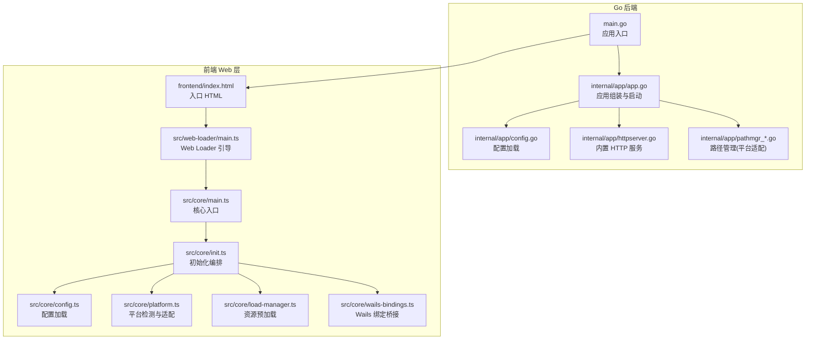
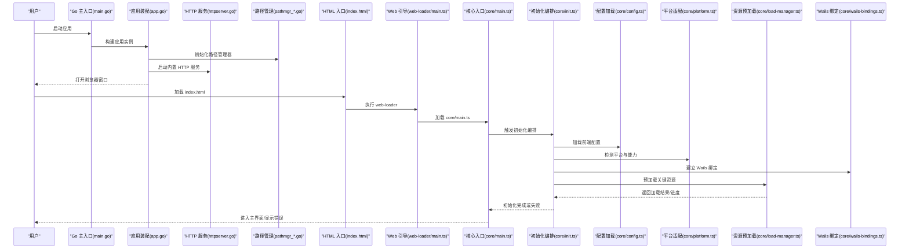
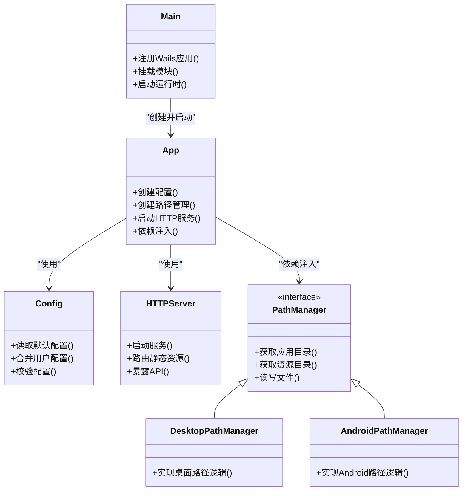
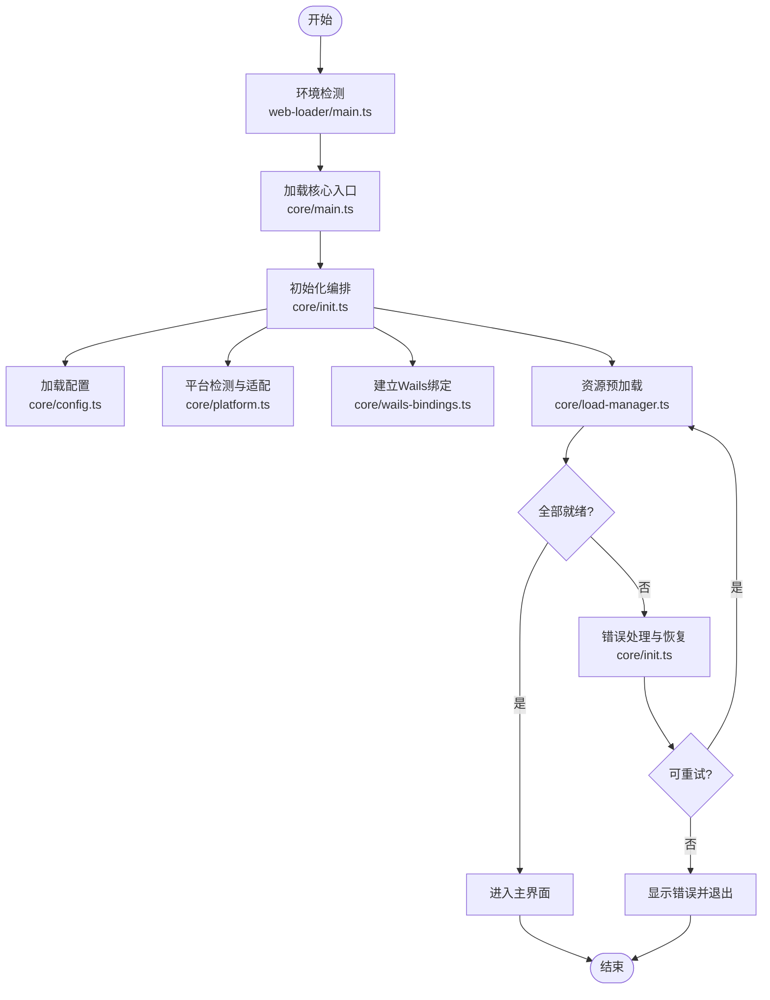
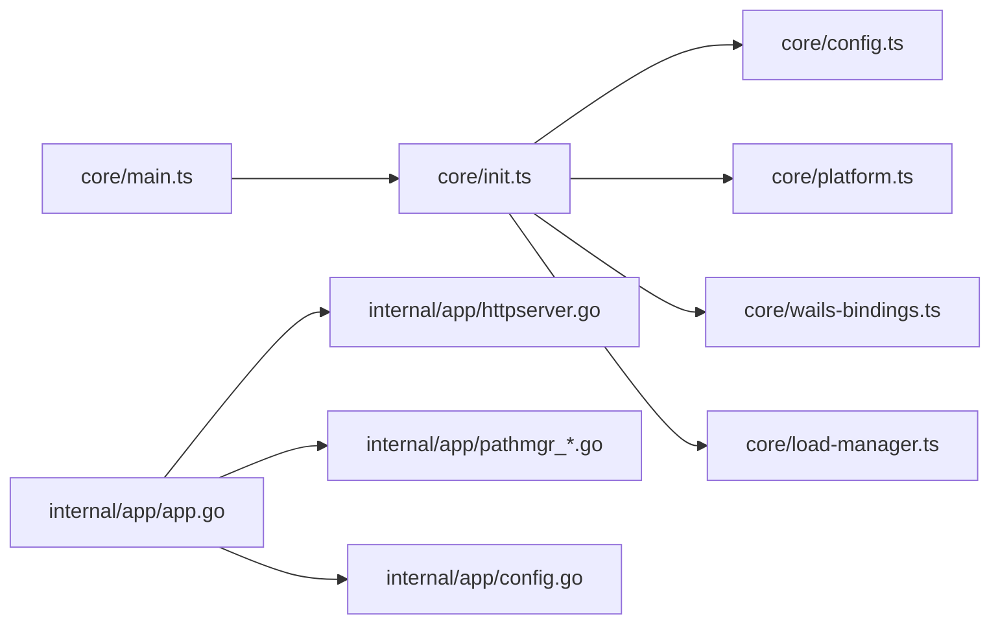

# 应用初始化流程

<cite>
**本文引用的文件**   
- [main.go](file://main.go)
- [app.go](file://internal/app/app.go)
- [config.go](file://internal/app/config.go)
- [httpserver.go](file://internal/app/httpserver.go)
- [pathmgr_desktop.go](file://internal/app/pathmgr_desktop.go)
- [pathmgr_android.go](file://internal/app/pathmgr_android.go)
- [index.html](file://frontend/index.html)
- [web-loader.ts](file://frontend/src/web-loader/main.ts)
- [core-main.ts](file://frontend/src/core/main.ts)
- [core-init.ts](file://frontend/src/core/init.ts)
- [core-config.ts](file://frontend/src/core/config.ts)
- [core-platform.ts](file://frontend/src/core/platform.ts)
- [core-load-manager.ts](file://frontend/src/core/load-manager.ts)
- [core-wails-bindings.ts](file://frontend/src/core/wails-bindings.ts)
- [ADR-102-main-ts-split.md](file://docs/adr/adr-102-main-ts-split.md)
- [ADR-105-abort-signal-and-async-error-handling.md](file://docs/adr/adr-105-abort-signal-and-async-error-handling.md)
- [ADR-106-timing-audit-and-async-lifecycle.md](file://docs/adr/adr-106-timing-audit-and-async-lifecycle.md)
</cite>

## 目录
1. [简介](#简介)
2. [项目结构](#项目结构)
3. [核心组件](#核心组件)
4. [架构总览](#架构总览)
5. [详细组件分析](#详细组件分析)
6. [依赖关系分析](#依赖关系分析)
7. [性能考量](#性能考量)
8. [故障排查指南](#故障排查指南)
9. [结论](#结论)
10. [附录](#附录)

## 简介
本文件聚焦于应用的启动与初始化流程，覆盖从 Go 后端主入口到前端资源加载、模块装配、依赖注入、配置与环境检测、平台适配、资源预加载，以及错误处理与异常恢复的完整链路。文档同时提供可操作的扩展指南：如何新增初始化阶段、如何处理初始化失败、如何实现条件初始化逻辑。

## 项目结构
本项目采用前后端分离的桌面/移动端混合架构：
- Go 后端负责应用生命周期、文件系统访问、HTTP 服务、路径管理、Wails 绑定等。
- 前端基于 Wails v3 运行，通过 web-loader 引导页面，再进入核心初始化流程（core/main.ts），最终完成场景与 UI 的装配。

图表来源
- [main.go:1-200](file://main.go#L1-L200)
- [app.go:1-200](file://internal/app/app.go#L1-L200)
- [config.go:1-200](file://internal/app/config.go#L1-L200)
- [httpserver.go:1-200](file://internal/app/httpserver.go#L1-L200)
- [pathmgr_desktop.go:1-200](file://internal/app/pathmgr_desktop.go#L1-L200)
- [pathmgr_android.go:1-200](file://internal/app/pathmgr_android.go#L1-L200)
- [index.html:1-200](file://frontend/index.html#L1-L200)
- [web-loader.ts:1-200](file://frontend/src/web-loader/main.ts#L1-L200)
- [core-main.ts:1-200](file://frontend/src/core/main.ts#L1-L200)
- [core-init.ts:1-200](file://frontend/src/core/init.ts#L1-L200)
- [core-config.ts:1-200](file://frontend/src/core/config.ts#L1-L200)
- [core-platform.ts:1-200](file://frontend/src/core/platform.ts#L1-L200)
- [core-load-manager.ts:1-200](file://frontend/src/core/load-manager.ts#L1-L200)
- [core-wails-bindings.ts:1-200](file://frontend/src/core/wails-bindings.ts#L1-L200)

章节来源
- [main.go:1-200](file://main.go#L1-L200)
- [app.go:1-200](file://internal/app/app.go#L1-L200)
- [index.html:1-200](file://frontend/index.html#L1-L200)
- [web-loader.ts:1-200](file://frontend/src/web-loader/main.ts#L1-L200)
- [core-main.ts:1-200](file://frontend/src/core/main.ts#L1-L200)

## 核心组件
- Go 后端入口与装配
  - main.go：注册 Wails 应用、挂载内部模块、启动运行时。
  - internal/app/app.go：应用装配器，负责创建并组合各子系统（配置、HTTP、路径管理等）。
  - internal/app/config.go：读取配置文件、合并默认值、校验必填项。
  - internal/app/httpserver.go：提供静态资源与 API 能力，供前端加载。
  - internal/app/pathmgr_*.go：跨平台路径管理（桌面/Android），为后续资源定位提供基础。

- 前端引导与核心初始化
  - frontend/index.html：页面入口，引入 web-loader。
  - src/web-loader/main.ts：轻量引导器，负责环境探测、脚本动态加载、错误兜底。
  - src/core/main.ts：核心入口，协调初始化阶段、依赖注入、渲染循环与事件系统。
  - src/core/init.ts：初始化编排器，定义阶段顺序、并行/串行策略、错误传播。
  - src/core/config.ts：前端配置加载（含本地缓存、网络回退、版本兼容）。
  - src/core/platform.ts：平台检测与特性开关（如 AR、WebGL 能力）。
  - src/core/load-manager.ts：资源预加载（模型、纹理、音频、WASM 等），支持进度与取消。
  - src/core/wails-bindings.ts：Wails 绑定桥接，暴露后端能力给前端调用。

章节来源
- [app.go:1-200](file://internal/app/app.go#L1-L200)
- [config.go:1-200](file://internal/app/config.go#L1-L200)
- [httpserver.go:1-200](file://internal/app/httpserver.go#L1-L200)
- [pathmgr_desktop.go:1-200](file://internal/app/pathmgr_desktop.go#L1-L200)
- [pathmgr_android.go:1-200](file://internal/app/pathmgr_android.go#L1-L200)
- [web-loader.ts:1-200](file://frontend/src/web-loader/main.ts#L1-L200)
- [core-main.ts:1-200](file://frontend/src/core/main.ts#L1-L200)
- [core-init.ts:1-200](file://frontend/src/core/init.ts#L1-L200)
- [core-config.ts:1-200](file://frontend/src/core/config.ts#L1-L200)
- [core-platform.ts:1-200](file://frontend/src/core/platform.ts#L1-L200)
- [core-load-manager.ts:1-200](file://frontend/src/core/load-manager.ts#L1-L200)
- [core-wails-bindings.ts:1-200](file://frontend/src/core/wails-bindings.ts#L1-L200)

## 架构总览
下图展示了从 Go 后端到前端初始化的端到端时序，包括配置加载、环境检测、平台适配、资源预加载与依赖注入的关键步骤。

图表来源
- [main.go:1-200](file://main.go#L1-L200)
- [app.go:1-200](file://internal/app/app.go#L1-L200)
- [httpserver.go:1-200](file://internal/app/httpserver.go#L1-L200)
- [pathmgr_desktop.go:1-200](file://internal/app/pathmgr_desktop.go#L1-L200)
- [pathmgr_android.go:1-200](file://internal/app/pathmgr_android.go#L1-L200)
- [index.html:1-200](file://frontend/index.html#L1-L200)
- [web-loader.ts:1-200](file://frontend/src/web-loader/main.ts#L1-L200)
- [core-main.ts:1-200](file://frontend/src/core/main.ts#L1-L200)
- [core-init.ts:1-200](file://frontend/src/core/init.ts#L1-L200)
- [core-config.ts:1-200](file://frontend/src/core/config.ts#L1-L200)
- [core-platform.ts:1-200](file://frontend/src/core/platform.ts#L1-L200)
- [core-load-manager.ts:1-200](file://frontend/src/core/load-manager.ts#L1-L200)
- [core-wails-bindings.ts:1-200](file://frontend/src/core/wails-bindings.ts#L1-L200)

## 详细组件分析

### Go 后端启动与装配
- 主入口 main.go
  - 注册 Wails 应用、挂载内部模块、设置窗口与菜单、启动运行时。
- 应用装配 app.go
  - 创建配置、路径管理、HTTP 服务等子系统，并进行依赖注入。
- 配置加载 config.go
  - 读取默认配置与用户配置，进行合并与校验，提供统一配置接口。
- HTTP 服务 httpserver.go
  - 提供静态资源与 API，确保前端能正确加载资源与数据。
- 路径管理 pathmgr_*.go
  - 根据平台选择实现（桌面/Android），抽象出统一的文件与目录访问接口。

图表来源
- [main.go:1-200](file://main.go#L1-L200)
- [app.go:1-200](file://internal/app/app.go#L1-L200)
- [config.go:1-200](file://internal/app/config.go#L1-L200)
- [httpserver.go:1-200](file://internal/app/httpserver.go#L1-L200)
- [pathmgr_desktop.go:1-200](file://internal/app/pathmgr_desktop.go#L1-L200)
- [pathmgr_android.go:1-200](file://internal/app/pathmgr_android.go#L1-L200)

章节来源
- [main.go:1-200](file://main.go#L1-L200)
- [app.go:1-200](file://internal/app/app.go#L1-L200)
- [config.go:1-200](file://internal/app/config.go#L1-L200)
- [httpserver.go:1-200](file://internal/app/httpserver.go#L1-L200)
- [pathmgr_desktop.go:1-200](file://internal/app/pathmgr_desktop.go#L1-L200)
- [pathmgr_android.go:1-200](file://internal/app/pathmgr_android.go#L1-L200)

### 前端引导与核心初始化
- 入口 HTML 与 Web 引导
  - index.html 引入 web-loader，后者负责环境探测、脚本动态加载与错误兜底。
- 核心入口 core/main.ts
  - 协调初始化阶段、依赖注入、渲染循环与事件系统。
- 初始化编排 core/init.ts
  - 定义阶段顺序、并行/串行策略、错误传播与重试机制。
- 配置加载 core/config.ts
  - 前端配置加载（含本地缓存、网络回退、版本兼容）。
- 平台适配 core/platform.ts
  - 平台检测与特性开关（如 AR、WebGL 能力）。
- 资源预加载 core/load-manager.ts
  - 资源预加载（模型、纹理、音频、WASM 等），支持进度与取消。
- Wails 绑定 core/wails-bindings.ts
  - 暴露后端能力给前端调用。

图表来源
- [index.html:1-200](file://frontend/index.html#L1-L200)
- [web-loader.ts:1-200](file://frontend/src/web-loader/main.ts#L1-L200)
- [core-main.ts:1-200](file://frontend/src/core/main.ts#L1-L200)
- [core-init.ts:1-200](file://frontend/src/core/init.ts#L1-L200)
- [core-config.ts:1-200](file://frontend/src/core/config.ts#L1-L200)
- [core-platform.ts:1-200](file://frontend/src/core/platform.ts#L1-L200)
- [core-load-manager.ts:1-200](file://frontend/src/core/load-manager.ts#L1-L200)
- [core-wails-bindings.ts:1-200](file://frontend/src/core/wails-bindings.ts#L1-L200)

章节来源
- [index.html:1-200](file://frontend/index.html#L1-L200)
- [web-loader.ts:1-200](file://frontend/src/web-loader/main.ts#L1-L200)
- [core-main.ts:1-200](file://frontend/src/core/main.ts#L1-L200)
- [core-init.ts:1-200](file://frontend/src/core/init.ts#L1-L200)
- [core-config.ts:1-200](file://frontend/src/core/config.ts#L1-L200)
- [core-platform.ts:1-200](file://frontend/src/core/platform.ts#L1-L200)
- [core-load-manager.ts:1-200](file://frontend/src/core/load-manager.ts#L1-L200)
- [core-wails-bindings.ts:1-200](file://frontend/src/core/wails-bindings.ts#L1-L200)

### 初始化阶段详解
- 配置加载
  - 后端：读取默认与用户配置，合并并校验；前端：加载本地缓存与远程配置，进行版本兼容与降级。
- 环境检测
  - 前端：检测 WebGL、AR 能力、浏览器特性；后端：检查运行时环境与依赖。
- 平台适配
  - 路径管理：桌面/Android 差异处理；前端：平台特性开关与 UI 适配。
- 资源预加载
  - 模型、纹理、音频、WASM 等资源按优先级与依赖关系加载，支持进度回调与取消。
- 依赖注入
  - 通过装配器将配置、路径管理、HTTP 服务、Wails 绑定等注入到各子系统。

章节来源
- [config.go:1-200](file://internal/app/config.go#L1-L200)
- [core-config.ts:1-200](file://frontend/src/core/config.ts#L1-L200)
- [platform.ts:1-200](file://frontend/src/core/platform.ts#L1-L200)
- [load-manager.ts:1-200](file://frontend/src/core/load-manager.ts#L1-L200)
- [app.go:1-200](file://internal/app/app.go#L1-L200)

### 错误处理与异常恢复
- 异步错误处理
  - 采用 AbortSignal 与 Promise 组合，支持超时与取消，避免悬挂任务。
- 初始化失败恢复
  - 在编排器中捕获错误，提供重试、降级与用户提示；对不可恢复错误进行日志记录与上报。
- 资源加载失败
  - 支持回退策略（如离线包、CDN 回退）、断点续传与增量更新。

章节来源
- [ADR-105-abort-signal-and-async-error-handling.md:1-200](file://docs/adr/adr-105-abort-signal-and-async-error-handling.md#L1-L200)
- [core-init.ts:1-200](file://frontend/src/core/init.ts#L1-L200)
- [core-load-manager.ts:1-200](file://frontend/src/core/load-manager.ts#L1-L200)

### 自定义初始化流程示例
- 添加新的初始化阶段
  - 在初始化编排器中注册新阶段，定义其依赖与执行顺序，并在错误处理中纳入重试与降级策略。
- 处理初始化失败的情况
  - 在阶段内捕获异常，记录上下文信息，返回结构化错误以便上层统一处理。
- 实现条件初始化逻辑
  - 基于平台检测与能力开关，动态启用或跳过特定阶段，减少不必要的开销。

章节来源
- [core-init.ts:1-200](file://frontend/src/core/init.ts#L1-L200)
- [core-platform.ts:1-200](file://frontend/src/core/platform.ts#L1-L200)
- [ADR-106-timing-audit-and-async-lifecycle.md:1-200](file://docs/adr/adr-106-timing-audit-and-async-lifecycle.md#L1-L200)

## 依赖关系分析
- 组件耦合与内聚
  - 后端通过装配器集中管理依赖注入，提高内聚性；前端通过编排器解耦初始化阶段，降低耦合。
- 直接/间接依赖
  - 核心入口依赖配置、平台、绑定与资源加载；HTTP 服务与路径管理为其他模块提供基础设施。
- 外部依赖与集成点
  - Wails 运行时、浏览器 API、文件系统访问、网络请求等。
- 接口契约与实现细节
  - 路径管理接口在不同平台有不同实现；Wails 绑定提供稳定的前后端通信契约。

图表来源
- [core-main.ts:1-200](file://frontend/src/core/main.ts#L1-L200)
- [core-init.ts:1-200](file://frontend/src/core/init.ts#L1-L200)
- [core-config.ts:1-200](file://frontend/src/core/config.ts#L1-L200)
- [core-platform.ts:1-200](file://frontend/src/core/platform.ts#L1-L200)
- [core-wails-bindings.ts:1-200](file://frontend/src/core/wails-bindings.ts#L1-L200)
- [core-load-manager.ts:1-200](file://frontend/src/core/load-manager.ts#L1-L200)
- [app.go:1-200](file://internal/app/app.go#L1-L200)
- [httpserver.go:1-200](file://internal/app/httpserver.go#L1-L200)
- [pathmgr_desktop.go:1-200](file://internal/app/pathmgr_desktop.go#L1-L200)
- [pathmgr_android.go:1-200](file://internal/app/pathmgr_android.go#L1-L200)
- [config.go:1-200](file://internal/app/config.go#L1-L200)

章节来源
- [core-main.ts:1-200](file://frontend/src/core/main.ts#L1-L200)
- [core-init.ts:1-200](file://frontend/src/core/init.ts#L1-L200)
- [app.go:1-200](file://internal/app/app.go#L1-L200)

## 性能考量
- 并行与串行策略
  - 资源预加载按依赖关系分组，尽可能并行以提升首屏速度。
- 延迟加载与按需加载
  - 非关键资源延后加载，减少初始内存占用。
- 缓存与增量更新
  - 利用本地缓存与增量更新策略，降低重复下载与解析成本。
- 监控与度量
  - 在关键阶段埋点，收集耗时与错误率，指导优化。

[本节为通用指导，不直接分析具体文件]

## 故障排查指南
- 常见问题定位
  - 配置加载失败：检查默认配置与用户配置合并逻辑，确认必填项是否缺失。
  - 平台检测异常：确认平台特性开关是否正确设置，必要时降级功能。
  - 资源预加载失败：检查网络连通性与 CDN 可用性，验证资源路径与权限。
- 日志与上报
  - 在初始化各阶段记录结构化日志，包含错误码、堆栈与上下文信息。
- 恢复策略
  - 对可重试错误实施指数退避重试；对不可恢复错误提供用户友好的提示与退出流程。

章节来源
- [core-init.ts:1-200](file://frontend/src/core/init.ts#L1-L200)
- [core-load-manager.ts:1-200](file://frontend/src/core/load-manager.ts#L1-L200)
- [ADR-105-abort-signal-and-async-error-handling.md:1-200](file://docs/adr/adr-105-abort-signal-and-async-error-handling.md#L1-L200)

## 结论
本文件系统化梳理了应用的启动与初始化流程，涵盖后端装配、前端引导、配置与环境检测、平台适配、资源预加载与依赖注入，并提供了错误处理与异常恢复的策略。通过模块化与编排化设计，应用具备良好的可扩展性与可维护性，便于后续新增初始化阶段与条件逻辑。

[本节为总结性内容，不直接分析具体文件]

## 附录
- 相关设计决策记录
  - 主入口拆分：参见 ADR-102，解释为何将 main.ts 拆分为更细粒度的模块。
  - 异步错误处理：参见 ADR-105，阐述 AbortSignal 的使用与最佳实践。
  - 生命周期与时序审计：参见 ADR-106，总结初始化阶段的时序与优化建议。

章节来源
- [ADR-102-main-ts-split.md:1-200](file://docs/adr/adr-102-main-ts-split.md#L1-L200)
- [ADR-105-abort-signal-and-async-error-handling.md:1-200](file://docs/adr/adr-105-abort-signal-and-async-error-handling.md#L1-L200)
- [ADR-106-timing-audit-and-async-lifecycle.md:1-200](file://docs/adr/adr-106-timing-audit-and-async-lifecycle.md#L1-L200)