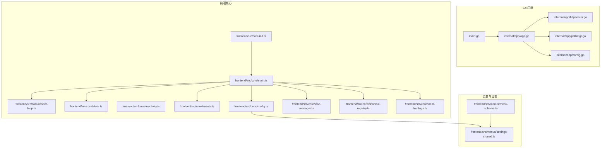
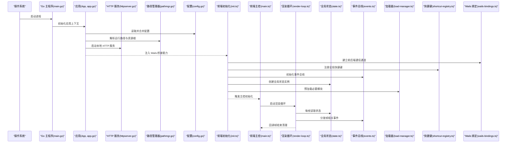
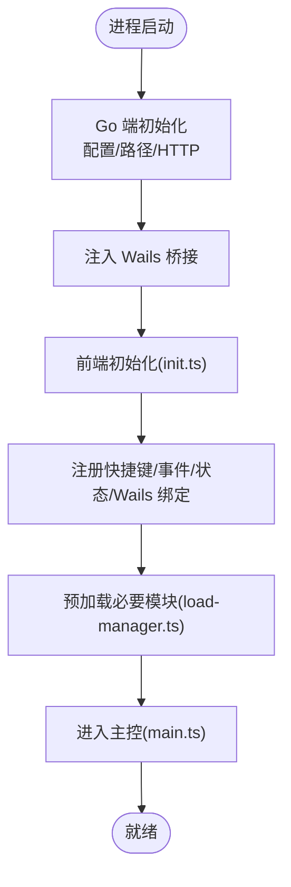
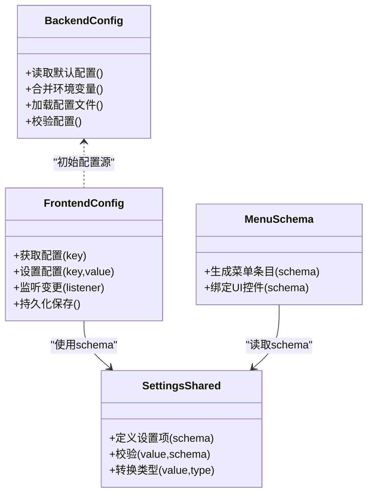
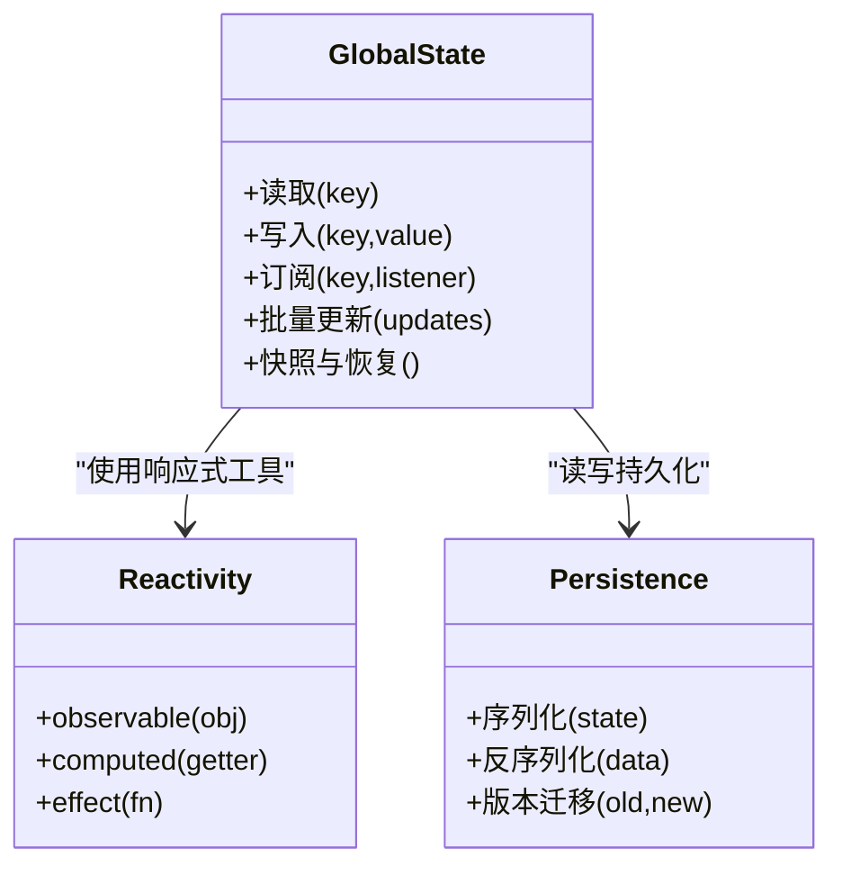
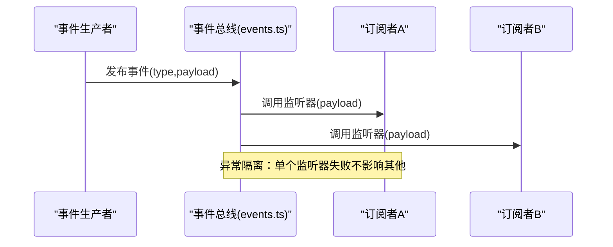
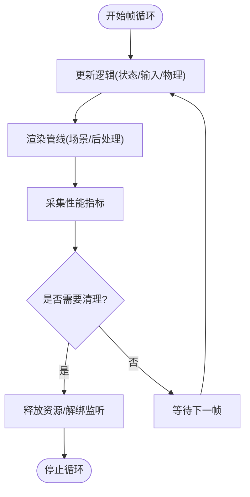
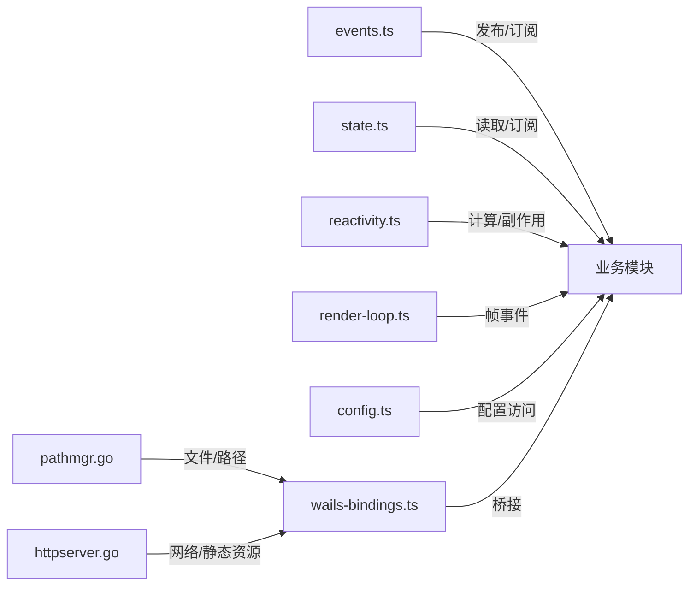

# 核心基础设施

<cite>
**本文引用的文件**   
- [main.go](file://main.go)
- [frontend/src/core/init.ts](file://frontend/src/core/init.ts)
- [frontend/src/core/main.ts](file://frontend/src/core/main.ts)
- [frontend/src/core/render-loop.ts](file://frontend/src/core/render-loop.ts)
- [frontend/src/core/state.ts](file://frontend/src/core/state.ts)
- [frontend/src/core/reactivity.ts](file://frontend/src/core/reactivity.ts)
- [frontend/src/core/events.ts](file://frontend/src/core/events.ts)
- [frontend/src/core/config.ts](file://frontend/src/core/config.ts)
- [frontend/src/core/load-manager.ts](file://frontend/src/core/load-manager.ts)
- [frontend/src/core/shortcut-registry.ts](file://frontend/src/core/shortcut-registry.ts)
- [frontend/src/core/wails-bindings.ts](file://frontend/src/core/wails-bindings.ts)
- [internal/app/app.go](file://internal/app/app.go)
- [internal/app/config.go](file://internal/app/config.go)
- [internal/app/httpserver.go](file://internal/app/httpserver.go)
- [internal/app/pathmgr.go](file://internal/app/pathmgr.go)
- [frontend/src/menus/menu-schema.ts](file://frontend/src/menus/menu-schema.ts)
- [frontend/src/menus/settings-shared.ts](file://frontend/src/menus/settings-shared.ts)
</cite>

## 目录
1. [简介](#简介)
2. [项目结构](#项目结构)
3. [核心组件](#核心组件)
4. [架构总览](#架构总览)
5. [详细组件分析](#详细组件分析)
6. [依赖关系分析](#依赖关系分析)
7. [性能考量](#性能考量)
8. [故障排查指南](#故障排查指南)
9. [结论](#结论)
10. [附录](#附录)

## 简介
本文件聚焦于应用的核心基础设施，围绕以下目标展开：
- 应用初始化流程与模块加载机制
- 配置管理系统（前端与后端协同）
- 状态管理模式（全局状态、响应式数据绑定、持久化策略）
- 事件驱动架构（事件总线、类型定义、监听与分发）
- 渲染循环管理（帧率控制、性能监控、资源清理）
- 扩展点示例（自定义事件处理、状态订阅模式、配置选项使用）

## 项目结构
核心基础设施主要分布在以下位置：
- Go 后端入口与平台能力：main.go、internal/app/*
- 前端核心：frontend/src/core/*
- 菜单与设置：frontend/src/menus/*

图表来源
- [main.go:1-200](file://main.go#L1-L200)
- [internal/app/app.go:1-200](file://internal/app/app.go#L1-L200)
- [internal/app/httpserver.go:1-200](file://internal/app/httpserver.go#L1-L200)
- [internal/app/pathmgr.go:1-200](file://internal/app/pathmgr.go#L1-L200)
- [internal/app/config.go:1-200](file://internal/app/config.go#L1-L200)
- [frontend/src/core/init.ts:1-200](file://frontend/src/core/init.ts#L1-L200)
- [frontend/src/core/main.ts:1-200](file://frontend/src/core/main.ts#L1-L200)
- [frontend/src/core/render-loop.ts:1-200](file://frontend/src/core/render-loop.ts#L1-L200)
- [frontend/src/core/state.ts:1-200](file://frontend/src/core/state.ts#L1-L200)
- [frontend/src/core/reactivity.ts:1-200](file://frontend/src/core/reactivity.ts#L1-L200)
- [frontend/src/core/events.ts:1-200](file://frontend/src/core/events.ts#L1-L200)
- [frontend/src/core/config.ts:1-200](file://frontend/src/core/config.ts#L1-L200)
- [frontend/src/core/load-manager.ts:1-200](file://frontend/src/core/load-manager.ts#L1-L200)
- [frontend/src/core/shortcut-registry.ts:1-200](file://frontend/src/core/shortcut-registry.ts#L1-L200)
- [frontend/src/core/wails-bindings.ts:1-200](file://frontend/src/core/wails-bindings.ts#L1-L200)
- [frontend/src/menus/menu-schema.ts:1-200](file://frontend/src/menus/menu-schema.ts#L1-L200)
- [frontend/src/menus/settings-shared.ts:1-200](file://frontend/src/menus/settings-shared.ts#L1-L200)

章节来源
- [main.go:1-200](file://main.go#L1-L200)
- [internal/app/app.go:1-200](file://internal/app/app.go#L1-L200)
- [frontend/src/core/init.ts:1-200](file://frontend/src/core/init.ts#L1-L200)
- [frontend/src/core/main.ts:1-200](file://frontend/src/core/main.ts#L1-L200)

## 核心组件
本节概述关键基础设施的职责边界与协作方式。

- 应用启动与生命周期
  - Go 端负责进程启动、HTTP 服务、路径管理、配置加载等；通过 Wails 绑定暴露给前端。
  - 前端 init.ts 完成运行时环境探测、日志、国际化、快捷键注册、Wails 绑定初始化等；随后进入 main.ts 编排各子系统。

- 渲染循环
  - render-loop.ts 提供帧调度、帧率控制、性能统计与资源清理钩子，供场景与 UI 更新消费。

- 状态管理与响应式
  - state.ts 提供全局状态容器与变更通知；reactivity.ts 提供细粒度响应式工具（如可观察属性、计算值、副作用）。

- 事件系统
  - events.ts 实现轻量事件总线，支持类型化事件、订阅/发布、一次性监听与批量分发。

- 配置管理
  - 前端 config.ts 与后端 internal/app/config.go 共同维护应用配置；settings-shared.ts 提供通用设置项定义与校验；menu-schema.ts 将设置映射为菜单条目。

- 模块加载
  - load-manager.ts 统一异步资源加载、进度与错误上报；shortcut-registry.ts 集中注册快捷键，避免冲突。

章节来源
- [frontend/src/core/init.ts:1-200](file://frontend/src/core/init.ts#L1-L200)
- [frontend/src/core/main.ts:1-200](file://frontend/src/core/main.ts#L1-L200)
- [frontend/src/core/render-loop.ts:1-200](file://frontend/src/core/render-loop.ts#L1-L200)
- [frontend/src/core/state.ts:1-200](file://frontend/src/core/state.ts#L1-L200)
- [frontend/src/core/reactivity.ts:1-200](file://frontend/src/core/reactivity.ts#L1-L200)
- [frontend/src/core/events.ts:1-200](file://frontend/src/core/events.ts#L1-L200)
- [frontend/src/core/config.ts:1-200](file://frontend/src/core/config.ts#L1-L200)
- [frontend/src/core/load-manager.ts:1-200](file://frontend/src/core/load-manager.ts#L1-L200)
- [frontend/src/core/shortcut-registry.ts:1-200](file://frontend/src/core/shortcut-registry.ts#L1-L200)
- [internal/app/config.go:1-200](file://internal/app/config.go#L1-L200)
- [frontend/src/menus/menu-schema.ts:1-200](file://frontend/src/menus/menu-schema.ts#L1-L200)
- [frontend/src/menus/settings-shared.ts:1-200](file://frontend/src/menus/settings-shared.ts#L1-L200)

## 架构总览
下图展示前后端在启动阶段的关键交互与职责划分。

图表来源
- [main.go:1-200](file://main.go#L1-L200)
- [internal/app/app.go:1-200](file://internal/app/app.go#L1-L200)
- [internal/app/httpserver.go:1-200](file://internal/app/httpserver.go#L1-L200)
- [internal/app/pathmgr.go:1-200](file://internal/app/pathmgr.go#L1-L200)
- [internal/app/config.go:1-200](file://internal/app/config.go#L1-L200)
- [frontend/src/core/init.ts:1-200](file://frontend/src/core/init.ts#L1-L200)
- [frontend/src/core/main.ts:1-200](file://frontend/src/core/main.ts#L1-L200)
- [frontend/src/core/render-loop.ts:1-200](file://frontend/src/core/render-loop.ts#L1-L200)
- [frontend/src/core/state.ts:1-200](file://frontend/src/core/state.ts#L1-L200)
- [frontend/src/core/events.ts:1-200](file://frontend/src/core/events.ts#L1-L200)
- [frontend/src/core/load-manager.ts:1-200](file://frontend/src/core/load-manager.ts#L1-L200)
- [frontend/src/core/shortcut-registry.ts:1-200](file://frontend/src/core/shortcut-registry.ts#L1-L200)
- [frontend/src/core/wails-bindings.ts:1-200](file://frontend/src/core/wails-bindings.ts#L1-L200)

## 详细组件分析

### 应用初始化流程与模块加载
- 启动顺序
  - Go 端完成配置、路径、HTTP 服务后，将桥接能力注入前端。
  - 前端 init.ts 执行环境探测、日志、国际化、快捷键、事件总线、全局状态、Wails 绑定初始化，然后调用 main.ts 进行业务子系统装配。
- 模块加载
  - load-manager.ts 提供统一的异步加载接口，支持进度回调、错误聚合与取消信号。
  - shortcut-registry.ts 在初始化阶段注册快捷键，避免重复与冲突。

图表来源
- [main.go:1-200](file://main.go#L1-L200)
- [internal/app/app.go:1-200](file://internal/app/app.go#L1-L200)
- [internal/app/config.go:1-200](file://internal/app/config.go#L1-L200)
- [internal/app/httpserver.go:1-200](file://internal/app/httpserver.go#L1-L200)
- [internal/app/pathmgr.go:1-200](file://internal/app/pathmgr.go#L1-L200)
- [frontend/src/core/init.ts:1-200](file://frontend/src/core/init.ts#L1-L200)
- [frontend/src/core/main.ts:1-200](file://frontend/src/core/main.ts#L1-L200)
- [frontend/src/core/load-manager.ts:1-200](file://frontend/src/core/load-manager.ts#L1-L200)
- [frontend/src/core/shortcut-registry.ts:1-200](file://frontend/src/core/shortcut-registry.ts#L1-L200)
- [frontend/src/core/wails-bindings.ts:1-200](file://frontend/src/core/wails-bindings.ts#L1-L200)

章节来源
- [frontend/src/core/init.ts:1-200](file://frontend/src/core/init.ts#L1-L200)
- [frontend/src/core/main.ts:1-200](file://frontend/src/core/main.ts#L1-L200)
- [frontend/src/core/load-manager.ts:1-200](file://frontend/src/core/load-manager.ts#L1-L200)
- [frontend/src/core/shortcut-registry.ts:1-200](file://frontend/src/core/shortcut-registry.ts#L1-L200)
- [frontend/src/core/wails-bindings.ts:1-200](file://frontend/src/core/wails-bindings.ts#L1-L200)

### 配置管理系统
- 设计要点
  - 后端 internal/app/config.go 负责默认配置、环境变量覆盖、配置文件合并与校验。
  - 前端 frontend/src/core/config.ts 提供运行时配置访问、热更新与持久化策略。
  - settings-shared.ts 定义通用设置项的键名、类型、默认值与校验规则。
  - menu-schema.ts 将设置项声明为菜单条目，驱动 UI 渲染与双向绑定。
- 典型流程
  - 启动时从后端拉取基础配置，前端根据用户偏好与环境差异进行覆盖。
  - 用户修改设置后，前端写入持久化存储，并通过事件或回调同步到后端。

图表来源
- [internal/app/config.go:1-200](file://internal/app/config.go#L1-L200)
- [frontend/src/core/config.ts:1-200](file://frontend/src/core/config.ts#L1-L200)
- [frontend/src/menus/settings-shared.ts:1-200](file://frontend/src/menus/settings-shared.ts#L1-L200)
- [frontend/src/menus/menu-schema.ts:1-200](file://frontend/src/menus/menu-schema.ts#L1-L200)

章节来源
- [internal/app/config.go:1-200](file://internal/app/config.go#L1-L200)
- [frontend/src/core/config.ts:1-200](file://frontend/src/core/config.ts#L1-L200)
- [frontend/src/menus/settings-shared.ts:1-200](file://frontend/src/menus/settings-shared.ts#L1-L200)
- [frontend/src/menus/menu-schema.ts:1-200](file://frontend/src/menus/menu-schema.ts#L1-L200)

### 状态管理模式
- 全局状态
  - state.ts 提供单一状态容器、增量更新与观察者通知，确保跨模块共享一致视图。
- 响应式数据绑定
  - reactivity.ts 提供可观察对象、计算属性与副作用，减少手动刷新逻辑。
- 状态持久化
  - 结合 config.ts 的持久化能力，将关键状态序列化到本地存储，并在下次启动时恢复。

图表来源
- [frontend/src/core/state.ts:1-200](file://frontend/src/core/state.ts#L1-L200)
- [frontend/src/core/reactivity.ts:1-200](file://frontend/src/core/reactivity.ts#L1-L200)
- [frontend/src/core/config.ts:1-200](file://frontend/src/core/config.ts#L1-L200)

章节来源
- [frontend/src/core/state.ts:1-200](file://frontend/src/core/state.ts#L1-L200)
- [frontend/src/core/reactivity.ts:1-200](file://frontend/src/core/reactivity.ts#L1-L200)
- [frontend/src/core/config.ts:1-200](file://frontend/src/core/config.ts#L1-L200)

### 事件驱动架构
- 事件总线
  - events.ts 提供类型化事件注册、订阅、一次性监听与批量分发，支持错误隔离与调试输出。
- 事件类型定义
  - 建议按领域划分命名空间（如 scene、motion、render），并在类型文件中集中声明。
- 监听与分发
  - 模块在初始化时注册监听器，在需要时通过总线发布事件；渲染循环也可作为事件生产者。

图表来源
- [frontend/src/core/events.ts:1-200](file://frontend/src/core/events.ts#L1-L200)

章节来源
- [frontend/src/core/events.ts:1-200](file://frontend/src/core/events.ts#L1-L200)

### 渲染循环管理
- 帧率控制
  - render-loop.ts 基于 requestAnimationFrame 或定时器实现稳定帧率，支持目标 FPS 与自适应降频。
- 性能监控
  - 记录每帧耗时、绘制调用次数、内存峰值，并提供采样导出。
- 资源清理
  - 在停止或切换场景时，统一释放纹理、几何体、动画与监听器，防止泄漏。

图表来源
- [frontend/src/core/render-loop.ts:1-200](file://frontend/src/core/render-loop.ts#L1-L200)

章节来源
- [frontend/src/core/render-loop.ts:1-200](file://frontend/src/core/render-loop.ts#L1-L200)

### 扩展点与示例
以下为常见扩展方式的指引（以“代码片段路径”形式给出，便于快速定位实现位置）：
- 自定义事件处理
  - 定义事件类型与载荷：[frontend/src/core/events.ts:1-200](file://frontend/src/core/events.ts#L1-L200)
  - 在模块中注册监听器并发布事件：[frontend/src/core/events.ts:1-200](file://frontend/src/core/events.ts#L1-L200)
- 状态订阅模式
  - 使用全局状态订阅与批量更新：[frontend/src/core/state.ts:1-200](file://frontend/src/core/state.ts#L1-L200)
  - 使用响应式计算与副作用：[frontend/src/core/reactivity.ts:1-200](file://frontend/src/core/reactivity.ts#L1-L200)
- 配置选项的使用
  - 读取与监听配置变化：[frontend/src/core/config.ts:1-200](file://frontend/src/core/config.ts#L1-L200)
  - 定义设置项 schema 与校验：[frontend/src/menus/settings-shared.ts:1-200](file://frontend/src/menus/settings-shared.ts#L1-L200)
  - 将设置映射为菜单条目：[frontend/src/menus/menu-schema.ts:1-200](file://frontend/src/menus/menu-schema.ts#L1-L200)

章节来源
- [frontend/src/core/events.ts:1-200](file://frontend/src/core/events.ts#L1-L200)
- [frontend/src/core/state.ts:1-200](file://frontend/src/core/state.ts#L1-L200)
- [frontend/src/core/reactivity.ts:1-200](file://frontend/src/core/reactivity.ts#L1-L200)
- [frontend/src/core/config.ts:1-200](file://frontend/src/core/config.ts#L1-L200)
- [frontend/src/menus/settings-shared.ts:1-200](file://frontend/src/menus/settings-shared.ts#L1-L200)
- [frontend/src/menus/menu-schema.ts:1-200](file://frontend/src/menus/menu-schema.ts#L1-L200)

## 依赖关系分析
核心模块之间的耦合与内聚情况如下：
- 低耦合高内聚
  - 事件总线独立于业务模块，仅通过类型契约交互。
  - 渲染循环只依赖状态与事件，不直接感知具体业务。
- 外部依赖
  - Wails 绑定用于前后端通信，应集中在 wails-bindings.ts 中封装。
  - 文件系统与网络请求由后端 pathmgr 与 httpserver 提供，前端通过桥接调用。

图表来源
- [frontend/src/core/events.ts:1-200](file://frontend/src/core/events.ts#L1-L200)
- [frontend/src/core/state.ts:1-200](file://frontend/src/core/state.ts#L1-L200)
- [frontend/src/core/reactivity.ts:1-200](file://frontend/src/core/reactivity.ts#L1-L200)
- [frontend/src/core/render-loop.ts:1-200](file://frontend/src/core/render-loop.ts#L1-L200)
- [frontend/src/core/config.ts:1-200](file://frontend/src/core/config.ts#L1-L200)
- [frontend/src/core/wails-bindings.ts:1-200](file://frontend/src/core/wails-bindings.ts#L1-L200)
- [internal/app/pathmgr.go:1-200](file://internal/app/pathmgr.go#L1-L200)
- [internal/app/httpserver.go:1-200](file://internal/app/httpserver.go#L1-L200)

章节来源
- [frontend/src/core/events.ts:1-200](file://frontend/src/core/events.ts#L1-L200)
- [frontend/src/core/state.ts:1-200](file://frontend/src/core/state.ts#L1-L200)
- [frontend/src/core/reactivity.ts:1-200](file://frontend/src/core/reactivity.ts#L1-L200)
- [frontend/src/core/render-loop.ts:1-200](file://frontend/src/core/render-loop.ts#L1-L200)
- [frontend/src/core/config.ts:1-200](file://frontend/src/core/config.ts#L1-L200)
- [frontend/src/core/wails-bindings.ts:1-200](file://frontend/src/core/wails-bindings.ts#L1-L200)
- [internal/app/pathmgr.go:1-200](file://internal/app/pathmgr.go#L1-L200)
- [internal/app/httpserver.go:1-200](file://internal/app/httpserver.go#L1-L200)

## 性能考量
- 渲染循环
  - 采用固定步长或可变步长的时间积分策略，避免抖动；在高负载下自动降低目标 FPS。
  - 对昂贵操作进行节流与批处理，减少每帧分配与 GC 压力。
- 状态与响应式
  - 使用计算属性缓存结果，避免重复计算；仅在必要时触发副作用。
  - 批量更新状态以减少观察者风暴。
- 资源管理
  - 在场景切换或退出时统一释放 GPU 资源与 DOM 监听器，避免内存泄漏。
  - 对大资源采用懒加载与分块加载，配合进度反馈提升用户体验。

## 故障排查指南
- 常见问题定位
  - 事件未触发：检查事件类型是否一致、监听器是否被提前移除、是否存在异常隔离导致的中断。
  - 状态不同步：确认是否使用了正确的订阅 API，是否存在竞态条件或未批量的多次写入。
  - 配置未生效：核对后端默认值与前端覆盖顺序，检查持久化存储的版本兼容性。
  - 渲染卡顿：查看每帧耗时与绘制调用数，定位热点模块；检查是否有未释放的资源。
- 调试建议
  - 启用事件与状态变更的调试输出，限制范围以避免噪音。
  - 使用性能面板记录关键路径，对比优化前后的指标。

章节来源
- [frontend/src/core/events.ts:1-200](file://frontend/src/core/events.ts#L1-L200)
- [frontend/src/core/state.ts:1-200](file://frontend/src/core/state.ts#L1-L200)
- [frontend/src/core/config.ts:1-200](file://frontend/src/core/config.ts#L1-L200)
- [frontend/src/core/render-loop.ts:1-200](file://frontend/src/core/render-loop.ts#L1-L200)

## 结论
本基础设施通过清晰的职责划分与松耦合设计，实现了稳定的应用启动、可靠的配置管理、高效的状态与事件模型以及可控的渲染循环。借助统一的加载与快捷键注册机制，开发者可以便捷地扩展功能并保持系统一致性。建议在后续迭代中持续完善类型定义、性能埋点与错误诊断能力，进一步提升系统的可维护性与可扩展性。

## 附录
- 术语
  - 事件总线：集中式消息分发机制，用于模块间解耦通信。
  - 响应式：当数据变化时自动触发依赖更新的能力。
  - 渲染循环：周期性执行更新与绘制的核心循环。
- 参考文件
  - 后端入口与配置：[main.go:1-200](file://main.go#L1-L200)、[internal/app/config.go:1-200](file://internal/app/config.go#L1-L200)
  - 前端核心：[frontend/src/core/init.ts:1-200](file://frontend/src/core/init.ts#L1-L200)、[frontend/src/core/main.ts:1-200](file://frontend/src/core/main.ts#L1-L200)
  - 渲染与状态：[frontend/src/core/render-loop.ts:1-200](file://frontend/src/core/render-loop.ts#L1-L200)、[frontend/src/core/state.ts:1-200](file://frontend/src/core/state.ts#L1-L200)
  - 事件与配置：[frontend/src/core/events.ts:1-200](file://frontend/src/core/events.ts#L1-L200)、[frontend/src/core/config.ts:1-200](file://frontend/src/core/config.ts#L1-L200)
  - 菜单与设置：[frontend/src/menus/menu-schema.ts:1-200](file://frontend/src/menus/menu-schema.ts#L1-L200)、[frontend/src/menus/settings-shared.ts:1-200](file://frontend/src/menus/settings-shared.ts#L1-L200)