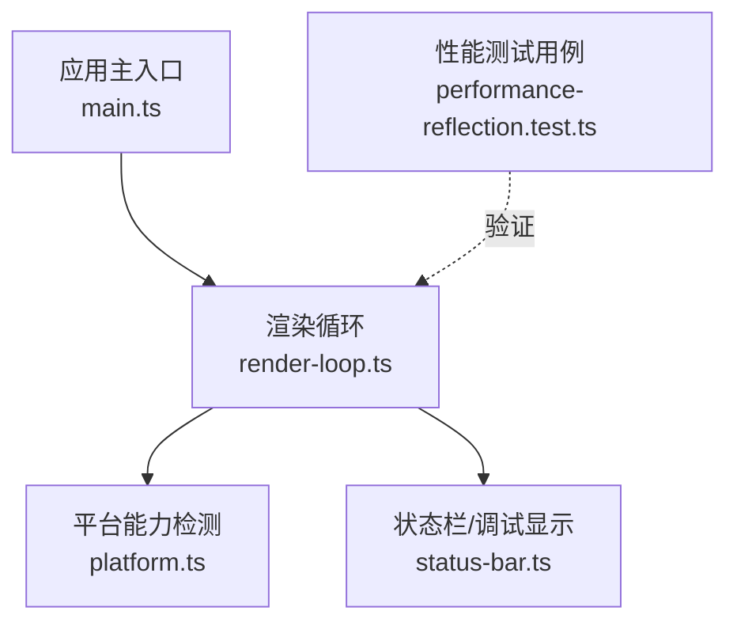
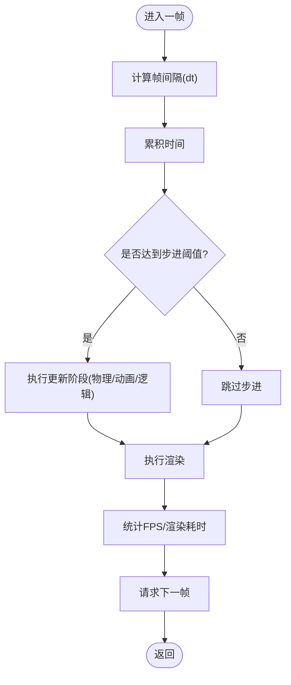
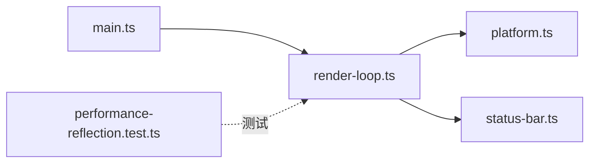

# 渲染循环管理

<cite>
**本文引用的文件**   
- [render-loop.ts](file://frontend/src/core/render-loop.ts)
- [main.ts](file://frontend/src/core/main.ts)
- [platform.ts](file://frontend/src/core/platform.ts)
- [status-bar.ts](file://frontend/src/core/status-bar.ts)
- [performance-reflection.test.ts](file://frontend/src/__tests__/scene/performance-reflection.test.ts)
</cite>

## 目录
1. [简介](#简介)
2. [项目结构](#项目结构)
3. [核心组件](#核心组件)
4. [架构总览](#架构总览)
5. [详细组件分析](#详细组件分析)
6. [依赖分析](#依赖分析)
7. [性能考量](#性能考量)
8. [故障排查指南](#故障排查指南)
9. [结论](#结论)
10. [附录](#附录)

## 简介
本文件聚焦于“渲染循环管理”的实现与使用，围绕以下目标展开：
- 帧率控制、渲染调度与性能监控机制
- 渲染循环的生命周期（启动、暂停、停止、销毁）
- 统计信息收集（FPS、内存使用、渲染耗时）
- 集成方式与自定义渲染逻辑示例
- 与浏览器 API 的集成及跨平台兼容性处理

## 项目结构
渲染循环位于前端核心模块中，负责驱动每帧更新与绘制。其关键位置如下：
- 渲染循环实现：frontend/src/core/render-loop.ts
- 应用主入口与生命周期协调：frontend/src/core/main.ts
- 平台能力检测与适配：frontend/src/core/platform.ts
- 状态栏/调试信息显示：frontend/src/core/status-bar.ts
- 性能相关测试用例：frontend/src/__tests__/scene/performance-reflection.test.ts



图表来源
- [main.ts](file://frontend/src/core/main.ts)
- [render-loop.ts](file://frontend/src/core/render-loop.ts)
- [platform.ts](file://frontend/src/core/platform.ts)
- [status-bar.ts](file://frontend/src/core/status-bar.ts)
- [performance-reflection.test.ts](file://frontend/src/__tests__/scene/performance-reflection.test.ts)

章节来源
- [render-loop.ts](file://frontend/src/core/render-loop.ts)
- [main.ts](file://frontend/src/core/main.ts)
- [platform.ts](file://frontend/src/core/platform.ts)
- [status-bar.ts](file://frontend/src/core/status-bar.ts)
- [performance-reflection.test.ts](file://frontend/src/__tests__/scene/performance-reflection.test.ts)

## 核心组件
- 渲染循环（RenderLoop）
  - 职责：统一调度每帧的更新与渲染；提供启动/暂停/停止/销毁等生命周期方法；采集并暴露性能指标（FPS、渲染耗时等）。
  - 关键点：基于 requestAnimationFrame 的帧驱动；支持固定步长或自适应步长策略；可挂接多阶段回调（如物理更新、动画、渲染后处理等）。
- 平台适配（Platform）
  - 职责：检测浏览器能力（如 rAF 可用性、高精度计时、内存 API），为渲染循环提供运行时环境判断与降级策略。
- 状态栏/调试显示（StatusBar）
  - 职责：展示 FPS、渲染耗时等统计信息，便于开发与调试。
- 应用主入口（Main）
  - 职责：初始化渲染循环、注册生命周期钩子、在合适时机触发启动/停止。

章节来源
- [render-loop.ts](file://frontend/src/core/render-loop.ts)
- [platform.ts](file://frontend/src/core/platform.ts)
- [status-bar.ts](file://frontend/src/core/status-bar.ts)
- [main.ts](file://frontend/src/core/main.ts)

## 架构总览
渲染循环作为“时间引擎”，将输入事件、系统时钟与渲染管线解耦，形成稳定的帧驱动模型。

```mermaid
sequenceDiagram
participant App as "应用主入口<br/>main.ts"
participant Loop as "渲染循环<br/>render-loop.ts"
participant Plat as "平台能力<br/>platform.ts"
participant UI as "状态栏/调试<br/>status-bar.ts"
participant Engine as "渲染后端(外部)"
App->>Loop : "创建实例并注册回调"
App->>Plat : "检测能力(rAF/计时/内存)"
App->>Loop : "启动(start)"
Loop->>Plat : "请求下一帧(requestAnimationFrame)"
Plat-->>Loop : "回调进入下一帧"
Loop->>Loop : "计算dt/累积时间/步进"
Loop->>Engine : "执行更新与渲染"
Loop->>UI : "上报FPS/渲染耗时"
App->>Loop : "暂停(pause)/恢复(resume)"
App->>Loop : "停止(stop)/销毁(dispose)"
```

图表来源
- [main.ts](file://frontend/src/core/main.ts)
- [render-loop.ts](file://frontend/src/core/render-loop.ts)
- [platform.ts](file://frontend/src/core/platform.ts)
- [status-bar.ts](file://frontend/src/core/status-bar.ts)

## 详细组件分析

### 渲染循环（RenderLoop）
- 设计要点
  - 帧驱动：以 requestAnimationFrame 为基准，避免阻塞主线程。
  - 时间步进：维护累计时间与固定步长，保证物理/动画稳定性。
  - 阶段回调：支持在每帧内按阶段调用（如 preUpdate、update、postUpdate、render）。
  - 性能采集：记录每帧开始/结束时间，计算 FPS 与渲染耗时。
  - 生命周期：start/pause/resume/stop/dispose 等方法确保资源安全释放。
- 典型流程
  - 启动：注册 rAF 回调，初始化计时器与统计缓冲。
  - 每帧：计算 dt -> 累积时间 -> 步进更新 -> 执行渲染 -> 统计上报。
  - 停止/销毁：取消 rAF、清空回调、释放引用，防止内存泄漏。



图表来源
- [render-loop.ts](file://frontend/src/core/render-loop.ts)

章节来源
- [render-loop.ts](file://frontend/src/core/render-loop.ts)

### 平台能力检测（Platform）
- 职责
  - 检测 requestAnimationFrame 是否存在与兼容性。
  - 检测高精度计时 API（用于更精确的 FPS/耗时统计）。
  - 检测内存 API（Performance.memory）以获取内存使用量（若可用）。
- 行为
  - 当某些 API 不可用时，提供降级方案（例如回退到 Date.now 计时、禁用内存统计等）。

章节来源
- [platform.ts](file://frontend/src/core/platform.ts)

### 状态栏/调试显示（StatusBar）
- 职责
  - 接收来自渲染循环的统计信息（FPS、渲染耗时、可选内存占用）。
  - 在 UI 上实时刷新，辅助开发者定位性能瓶颈。
- 交互
  - 通过事件或回调接口接收数据，避免紧耦合。

章节来源
- [status-bar.ts](file://frontend/src/core/status-bar.ts)

### 应用主入口（Main）
- 职责
  - 初始化渲染循环实例，注入平台能力检测结果。
  - 注册必要的生命周期钩子（如窗口尺寸变化、可见性变化）。
  - 在应用启动时调用 start，在退出前调用 stop/dispose。

章节来源
- [main.ts](file://frontend/src/core/main.ts)

### 性能测试用例（performance-reflection.test.ts）
- 作用
  - 验证渲染循环在不同场景下的行为（如高负载、低帧率、频繁切换可见性等）。
  - 断言 FPS 范围、渲染耗时上限、内存增长趋势等。
- 建议
  - 新增功能时应补充对应用例，确保回归稳定。

章节来源
- [performance-reflection.test.ts](file://frontend/src/__tests__/scene/performance-reflection.test.ts)

## 依赖分析
渲染循环对平台能力与 UI 显示存在弱依赖，整体耦合度较低，便于替换与扩展。



图表来源
- [main.ts](file://frontend/src/core/main.ts)
- [render-loop.ts](file://frontend/src/core/render-loop.ts)
- [platform.ts](file://frontend/src/core/platform.ts)
- [status-bar.ts](file://frontend/src/core/status-bar.ts)
- [performance-reflection.test.ts](file://frontend/src/__tests__/scene/performance-reflection.test.ts)

章节来源
- [main.ts](file://frontend/src/core/main.ts)
- [render-loop.ts](file://frontend/src/core/render-loop.ts)
- [platform.ts](file://frontend/src/core/platform.ts)
- [status-bar.ts](file://frontend/src/core/status-bar.ts)
- [performance-reflection.test.ts](file://frontend/src/__tests__/scene/performance-reflection.test.ts)

## 性能考量
- 帧率控制
  - 优先使用 requestAnimationFrame，避免手动节流导致的掉帧。
  - 采用固定步长或自适应步长策略，平衡稳定性与流畅度。
- 渲染调度
  - 将昂贵操作拆分到多个阶段，避免单帧过长。
  - 对非关键路径进行延迟或按需执行。
- 性能监控
  - 使用高精度计时统计每帧耗时，结合 FPS 滑动平均观察趋势。
  - 在支持环境下读取内存 API，监控峰值与增长斜率。
- 优化建议
  - 减少每帧分配对象，复用缓冲区。
  - 合并渲染批次，降低状态切换开销。
  - 对大场景使用视锥剔除与 LOD。

[本节为通用指导，不直接分析具体文件]

## 故障排查指南
- 现象：FPS 波动剧烈或持续偏低
  - 检查是否有同步阻塞操作插入到渲染回调中。
  - 确认固定步长设置是否合理，避免过小的 dt 导致过多步进。
- 现象：内存持续增长
  - 检查是否在每帧创建大量临时对象或未释放引用。
  - 在 dispose 中确认已取消 rAF 并清空回调列表。
- 现象：页面不可见时仍在渲染
  - 监听 visibilitychange 并在隐藏时暂停循环，恢复时再启动。
- 现象：移动端掉帧严重
  - 降低分辨率或关闭重型后处理。
  - 使用平台能力检测，针对低端设备启用降级策略。

章节来源
- [render-loop.ts](file://frontend/src/core/render-loop.ts)
- [platform.ts](file://frontend/src/core/platform.ts)
- [status-bar.ts](file://frontend/src/core/status-bar.ts)

## 结论
渲染循环通过统一的帧驱动与生命周期管理，将时间步进、渲染调度与性能监控有机结合。借助平台能力检测与状态栏反馈，开发者可在不同环境与负载下获得一致且可控的渲染体验。建议在业务层仅关注“每帧该做什么”，而将“何时做、如何做”交由渲染循环统一管理，从而提升代码的可维护性与性能表现。

[本节为总结性内容，不直接分析具体文件]

## 附录

### 集成步骤（概念性说明）
- 初始化
  - 在主入口创建渲染循环实例，传入平台能力检测结果。
  - 注册每帧回调（更新/渲染阶段）。
- 启动与停止
  - 在应用就绪后调用启动方法；在退出或卸载前调用停止/销毁。
- 自定义渲染逻辑
  - 在更新阶段执行逻辑与动画；在渲染阶段提交绘制命令。
- 性能监控
  - 订阅渲染循环的统计事件或在状态栏中查看实时指标。
- 跨平台兼容
  - 利用平台能力检测自动选择最优实现；必要时提供降级路径。

[本节为概念性说明，不直接分析具体文件]