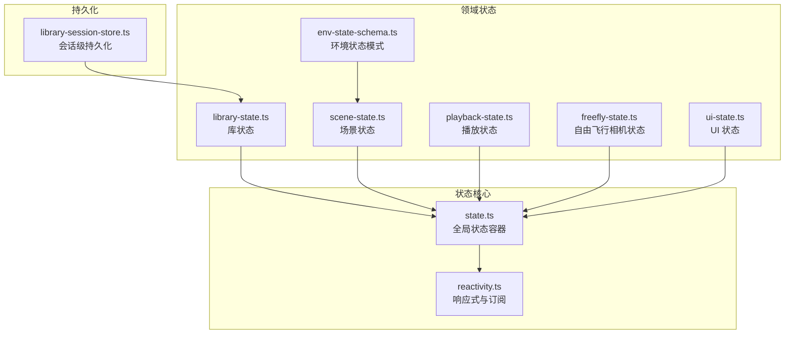
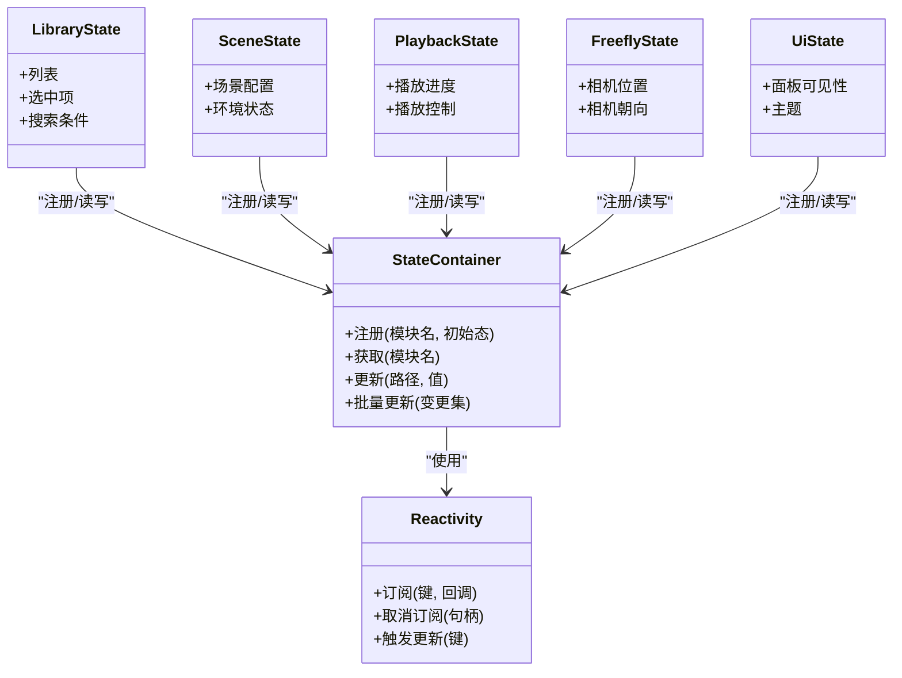
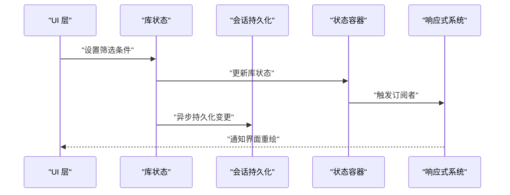
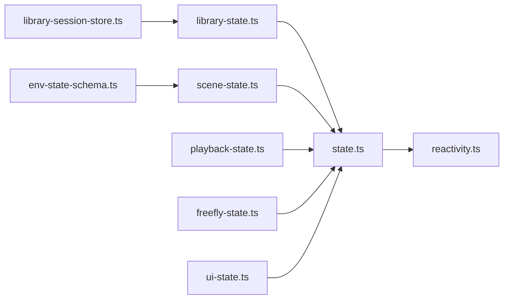

# 状态管理系统

<cite>
**本文引用的文件**   
- [frontend/src/core/state.ts](file://frontend/src/core/state.ts)
- [frontend/src/core/reactivity.ts](file://frontend/src/core/reactivity.ts)
- [frontend/src/core/library-state.ts](file://frontend/src/core/library-state.ts)
- [frontend/src/core/scene-state.ts](file://frontend/src/core/scene-state.ts)
- [frontend/src/core/playback-state.ts](file://frontend/src/core/playback-state.ts)
- [frontend/src/core/freefly-state.ts](file://frontend/src/core/freefly-state.ts)
- [frontend/src/core/env-state-schema.ts](file://frontend/src/core/env-state-schema.ts)
- [frontend/src/core/ui-state.ts](file://frontend/src/core/ui-state.ts)
- [frontend/src/menus/library-session-store.ts](file://frontend/src/menus/library-session-store.ts)
- [frontend/src/__tests__/env-state.test.ts](file://frontend/src/__tests__/env-state.test.ts)
</cite>

## 目录
1. [简介](#简介)
2. [项目结构](#项目结构)
3. [核心组件](#核心组件)
4. [架构总览](#架构总览)
5. [详细组件分析](#详细组件分析)
6. [依赖关系分析](#依赖关系分析)
7. [性能考量](#性能考量)
8. [故障排查指南](#故障排查指南)
9. [结论](#结论)
10. [附录](#附录)

## 简介
本文件系统性梳理前端状态管理子系统，围绕全局状态管理模式展开，涵盖：
- 状态定义与响应式数据绑定
- 状态更新机制与计算属性
- 模块职责划分（库状态、场景状态、播放状态等）
- 持久化策略（本地存储、状态同步、版本迁移）
- 新增状态模块的创建范式、订阅变化与计算属性实现
- 性能优化策略与最佳实践

## 项目结构
状态相关代码集中在 frontend/src/core 目录，按领域拆分多个状态模块；UI 层通过统一入口访问状态。关键文件如下：
- 基础能力：state.ts、reactivity.ts
- 领域状态：library-state.ts、scene-state.ts、playback-state.ts、freefly-state.ts、ui-state.ts
- 环境状态模式：env-state-schema.ts
- 会话级持久化：menus/library-session-store.ts
- 测试用例：__tests__/env-state.test.ts

图表来源
- [frontend/src/core/state.ts](file://frontend/src/core/state.ts)
- [frontend/src/core/reactivity.ts](file://frontend/src/core/reactivity.ts)
- [frontend/src/core/library-state.ts](file://frontend/src/core/library-state.ts)
- [frontend/src/core/scene-state.ts](file://frontend/src/core/scene-state.ts)
- [frontend/src/core/playback-state.ts](file://frontend/src/core/playback-state.ts)
- [frontend/src/core/freefly-state.ts](file://frontend/src/core/freefly-state.ts)
- [frontend/src/core/ui-state.ts](file://frontend/src/core/ui-state.ts)
- [frontend/src/core/env-state-schema.ts](file://frontend/src/core/env-state-schema.ts)
- [frontend/src/menus/library-session-store.ts](file://frontend/src/menus/library-session-store.ts)

章节来源
- [frontend/src/core/state.ts](file://frontend/src/core/state.ts)
- [frontend/src/core/reactivity.ts](file://frontend/src/core/reactivity.ts)
- [frontend/src/core/library-state.ts](file://frontend/src/core/library-state.ts)
- [frontend/src/core/scene-state.ts](file://frontend/src/core/scene-state.ts)
- [frontend/src/core/playback-state.ts](file://frontend/src/core/playback-state.ts)
- [frontend/src/core/freefly-state.ts](file://frontend/src/core/freefly-state.ts)
- [frontend/src/core/ui-state.ts](file://frontend/src/core/ui-state.ts)
- [frontend/src/core/env-state-schema.ts](file://frontend/src/core/env-state-schema.ts)
- [frontend/src/menus/library-session-store.ts](file://frontend/src/menus/library-session-store.ts)

## 核心组件
- 全局状态容器：提供统一的注册、读取、写入与批量更新接口，作为各模块状态的宿主。
- 响应式系统：基于观察者/发布订阅模型，支持细粒度订阅与批量通知，驱动 UI 与副作用逻辑。
- 领域状态模块：按业务域组织状态与行为，保持高内聚低耦合。
- 模式校验：为复杂状态（如环境状态）提供模式定义与校验，保障数据结构一致性。
- 持久化：在合适时机将状态落盘或从磁盘恢复，并处理版本迁移。

章节来源
- [frontend/src/core/state.ts](file://frontend/src/core/state.ts)
- [frontend/src/core/reactivity.ts](file://frontend/src/core/reactivity.ts)
- [frontend/src/core/env-state-schema.ts](file://frontend/src/core/env-state-schema.ts)

## 架构总览
状态管理采用“集中式容器 + 模块化状态 + 响应式订阅”的架构。各模块向容器注册自身状态，并通过响应式系统对外暴露可订阅的数据源。UI 与业务逻辑以声明式方式订阅所需字段，避免直接耦合具体模块。

图表来源
- [frontend/src/core/state.ts](file://frontend/src/core/state.ts)
- [frontend/src/core/reactivity.ts](file://frontend/src/core/reactivity.ts)
- [frontend/src/core/library-state.ts](file://frontend/src/core/library-state.ts)
- [frontend/src/core/scene-state.ts](file://frontend/src/core/scene-state.ts)
- [frontend/src/core/playback-state.ts](file://frontend/src/core/playback-state.ts)
- [frontend/src/core/freefly-state.ts](file://frontend/src/core/freefly-state.ts)
- [frontend/src/core/ui-state.ts](file://frontend/src/core/ui-state.ts)

## 详细组件分析

### 全局状态容器（state.ts）
- 职责
  - 维护所有已注册的状态模块
  - 提供原子更新与批量更新
  - 与响应式系统集成，确保变更传播
- 关键点
  - 模块命名空间隔离，避免键冲突
  - 支持嵌套路径更新，减少对象重建
  - 提供调试钩子（可选），便于追踪变更来源

章节来源
- [frontend/src/core/state.ts](file://frontend/src/core/state.ts)

### 响应式系统（reactivity.ts）
- 职责
  - 提供订阅/取消订阅能力
  - 对状态变更进行细粒度派发
  - 支持批量合并与节流（视实现而定）
- 关键点
  - 订阅句柄用于安全取消，防止内存泄漏
  - 变更事件携带旧值与新值，便于审计与回滚
  - 与 UI 渲染管线解耦，避免阻塞主线程

章节来源
- [frontend/src/core/reactivity.ts](file://frontend/src/core/reactivity.ts)

### 库状态（library-state.ts）
- 职责
  - 管理资源库的列表、筛选、排序与选中项
  - 与库菜单交互，驱动浏览与选择流程
- 典型操作
  - 加载/刷新列表
  - 设置搜索条件与分页
  - 切换选中项并广播变更
- 与其他模块的关系
  - 被场景状态引用以加载资源
  - 被 UI 状态驱动展示

章节来源
- [frontend/src/core/library-state.ts](file://frontend/src/core/library-state.ts)

### 场景状态（scene-state.ts）
- 职责
  - 管理场景整体配置与环境状态
  - 协调环境、灯光、地面、水体等子系统
- 典型操作
  - 应用预设/保存当前场景
  - 切换环境模式与参数
- 模式约束
  - 环境状态遵循 env-state-schema.ts 的模式定义，保证序列化与迁移兼容

章节来源
- [frontend/src/core/scene-state.ts](file://frontend/src/core/scene-state.ts)
- [frontend/src/core/env-state-schema.ts](file://frontend/src/core/env-state-schema.ts)

### 播放状态（playback-state.ts）
- 职责
  - 管理动作播放进度、循环、暂停/继续、时间轴控制
  - 与音频总线、物理引擎、骨骼系统联动
- 典型操作
  - 开始/停止/跳转
  - 设置播放速率与混合权重
- 与 UI 的协作
  - 驱动播放控件、进度条、节拍指示

章节来源
- [frontend/src/core/playback-state.ts](file://frontend/src/core/playback-state.ts)

### 自由飞行相机状态（freefly-state.ts）
- 职责
  - 管理自由飞行相机的位置、朝向、速度、惯性等
- 典型操作
  - 输入驱动更新
  - 重置到默认视角
- 与场景状态的关系
  - 受场景边界、碰撞体影响（由场景状态提供）

章节来源
- [frontend/src/core/freefly-state.ts](file://frontend/src/core/freefly-state.ts)

### UI 状态（ui-state.ts）
- 职责
  - 管理面板可见性、主题、布局偏好等
- 典型操作
  - 切换面板开关
  - 记录用户偏好
- 与持久化的关系
  - 可将部分 UI 偏好持久化到本地存储

章节来源
- [frontend/src/core/ui-state.ts](file://frontend/src/core/ui-state.ts)

### 环境状态模式（env-state-schema.ts）
- 职责
  - 定义环境状态的数据结构与校验规则
  - 为序列化/反序列化与版本迁移提供依据
- 关键点
  - 字段类型、必填性、枚举值范围
  - 兼容旧版本的降级策略

章节来源
- [frontend/src/core/env-state-schema.ts](file://frontend/src/core/env-state-schema.ts)

### 会话级持久化（library-session-store.ts）
- 职责
  - 在会话生命周期内缓存库状态，提升二次打开体验
  - 与后端/文件系统交互，完成读写与错误恢复
- 关键点
  - 增量同步与去抖写入
  - 失败重试与降级策略

章节来源
- [frontend/src/menus/library-session-store.ts](file://frontend/src/menus/library-session-store.ts)

### 状态更新时序（示例）
以下序列图展示了“用户修改库筛选条件 → 列表刷新”的典型调用链。

图表来源
- [frontend/src/core/library-state.ts](file://frontend/src/core/library-state.ts)
- [frontend/src/core/state.ts](file://frontend/src/core/state.ts)
- [frontend/src/core/reactivity.ts](file://frontend/src/core/reactivity.ts)
- [frontend/src/menus/library-session-store.ts](file://frontend/src/menus/library-session-store.ts)

## 依赖关系分析
- 低耦合：各模块仅依赖状态容器与响应式系统，不直接互相引用，降低循环依赖风险。
- 明确边界：环境状态通过模式文件约束，场景状态负责组合与协调。
- 外部集成点：持久化模块与文件系统/后端交互，需考虑网络与权限异常。

图表来源
- [frontend/src/core/state.ts](file://frontend/src/core/state.ts)
- [frontend/src/core/reactivity.ts](file://frontend/src/core/reactivity.ts)
- [frontend/src/core/library-state.ts](file://frontend/src/core/library-state.ts)
- [frontend/src/core/scene-state.ts](file://frontend/src/core/scene-state.ts)
- [frontend/src/core/playback-state.ts](file://frontend/src/core/playback-state.ts)
- [frontend/src/core/freefly-state.ts](file://frontend/src/core/freefly-state.ts)
- [frontend/src/core/ui-state.ts](file://frontend/src/core/ui-state.ts)
- [frontend/src/core/env-state-schema.ts](file://frontend/src/core/env-state-schema.ts)
- [frontend/src/menus/library-session-store.ts](file://frontend/src/menus/library-session-store.ts)

## 性能考量
- 细粒度订阅：仅订阅必要字段，避免整树重算。
- 批量更新：合并多次变更，减少通知次数。
- 惰性计算：对派生数据使用计算属性，按需求值。
- 防抖/节流：高频输入（如拖拽、滚动）结合防抖/节流，降低渲染压力。
- 大对象浅比较：优先更新局部字段而非替换整个对象。
- 卸载清理：及时取消订阅，避免内存泄漏。

[本节为通用指导，无需源码引用]

## 故障排查指南
- 常见问题
  - 状态未更新：检查是否通过容器提供的更新接口，而非直接赋值。
  - 重复订阅：确认订阅句柄正确取消，避免重复回调。
  - 持久化失败：查看网络/权限错误，启用降级策略与重试。
  - 模式不兼容：升级时注意版本迁移，必要时提供默认值。
- 定位方法
  - 利用响应式系统的变更日志定位问题来源
  - 针对环境状态，使用模式校验快速发现非法字段
  - 使用单元测试覆盖关键路径，回归验证

章节来源
- [frontend/src/__tests__/env-state.test.ts](file://frontend/src/__tests__/env-state.test.ts)

## 结论
该状态管理系统以集中式容器为核心，结合响应式订阅与模块化设计，实现了清晰的数据流与良好的扩展性。通过模式校验与会话级持久化，保障了数据一致性与用户体验。遵循本文的最佳实践，可在保持高性能的同时，稳步演进功能。

[本节为总结性内容，无需源码引用]

## 附录

### 如何创建新的状态模块（步骤清单）
- 定义初始状态与类型
- 在状态容器中注册模块
- 暴露必要的更新方法与只读访问器
- 在需要处订阅状态变化
- 如需持久化，接入持久化模块并在合适时机落盘
- 编写单测覆盖关键路径

章节来源
- [frontend/src/core/state.ts](file://frontend/src/core/state.ts)
- [frontend/src/core/reactivity.ts](file://frontend/src/core/reactivity.ts)
- [frontend/src/menus/library-session-store.ts](file://frontend/src/menus/library-session-store.ts)

### 订阅状态变化的最佳实践
- 使用最小粒度的键订阅，避免全量监听
- 在组件/模块销毁时取消订阅
- 对高频更新做防抖/节流
- 使用计算属性派生数据，减少重复逻辑

章节来源
- [frontend/src/core/reactivity.ts](file://frontend/src/core/reactivity.ts)

### 实现状态计算属性的建议
- 将纯函数形式的派生逻辑封装为计算属性
- 依赖最小集合，避免隐式依赖
- 对昂贵计算结果做缓存与失效策略

章节来源
- [frontend/src/core/reactivity.ts](file://frontend/src/core/reactivity.ts)

### 状态持久化与版本迁移要点
- 区分会话级与长期持久化策略
- 写入前进行模式校验与降级处理
- 迁移脚本应幂等且可回滚
- 失败时保留最近可用快照

章节来源
- [frontend/src/menus/library-session-store.ts](file://frontend/src/menus/library-session-store.ts)
- [frontend/src/core/env-state-schema.ts](file://frontend/src/core/env-state-schema.ts)