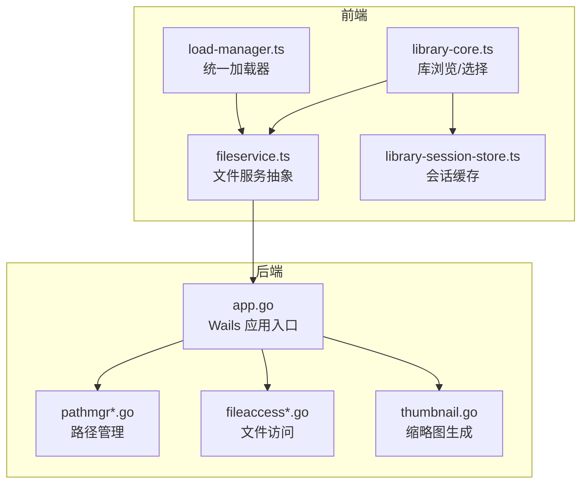
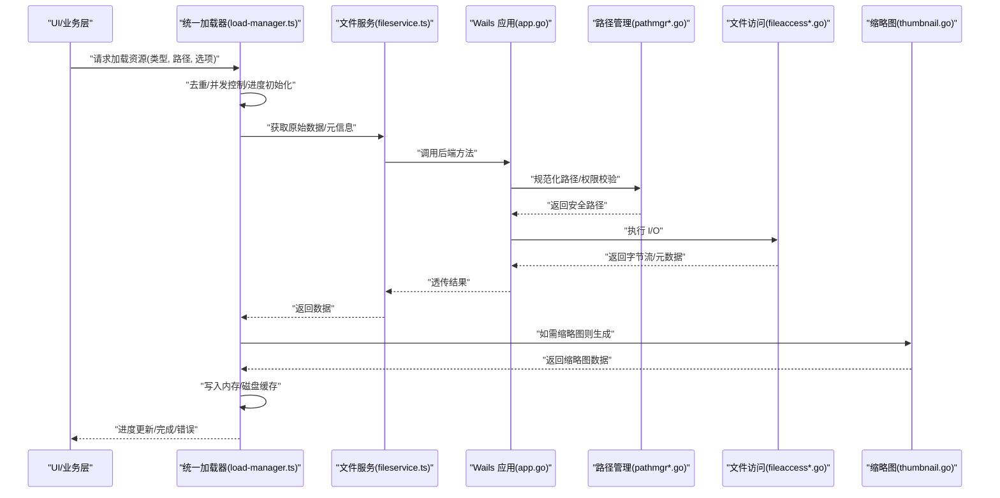
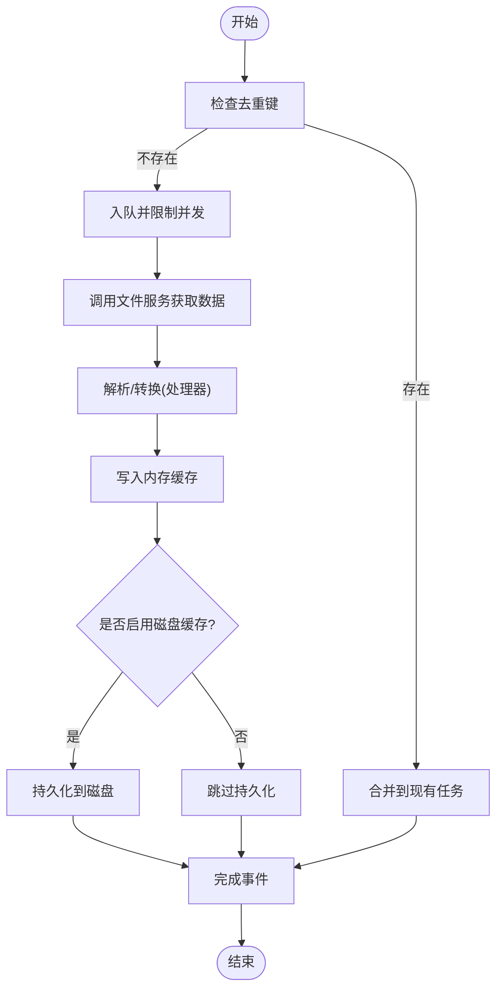
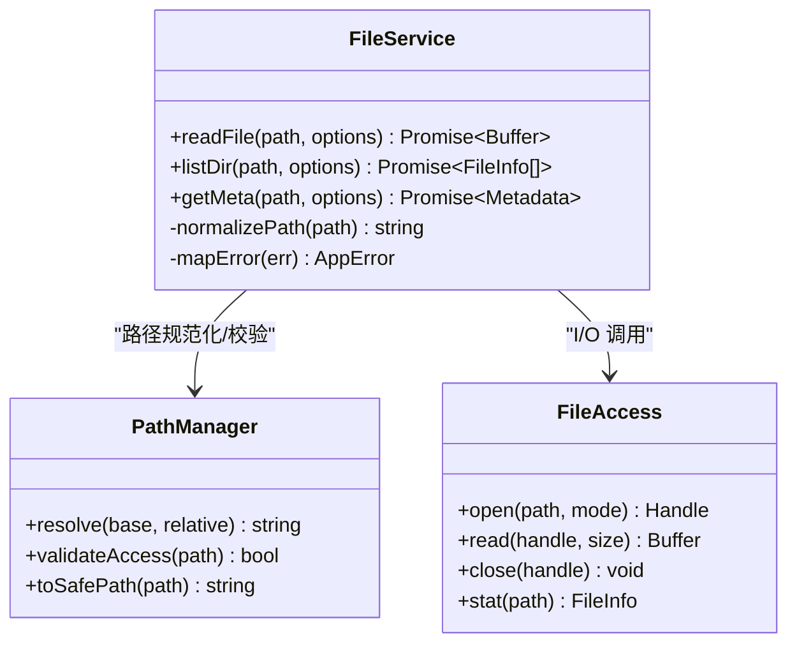
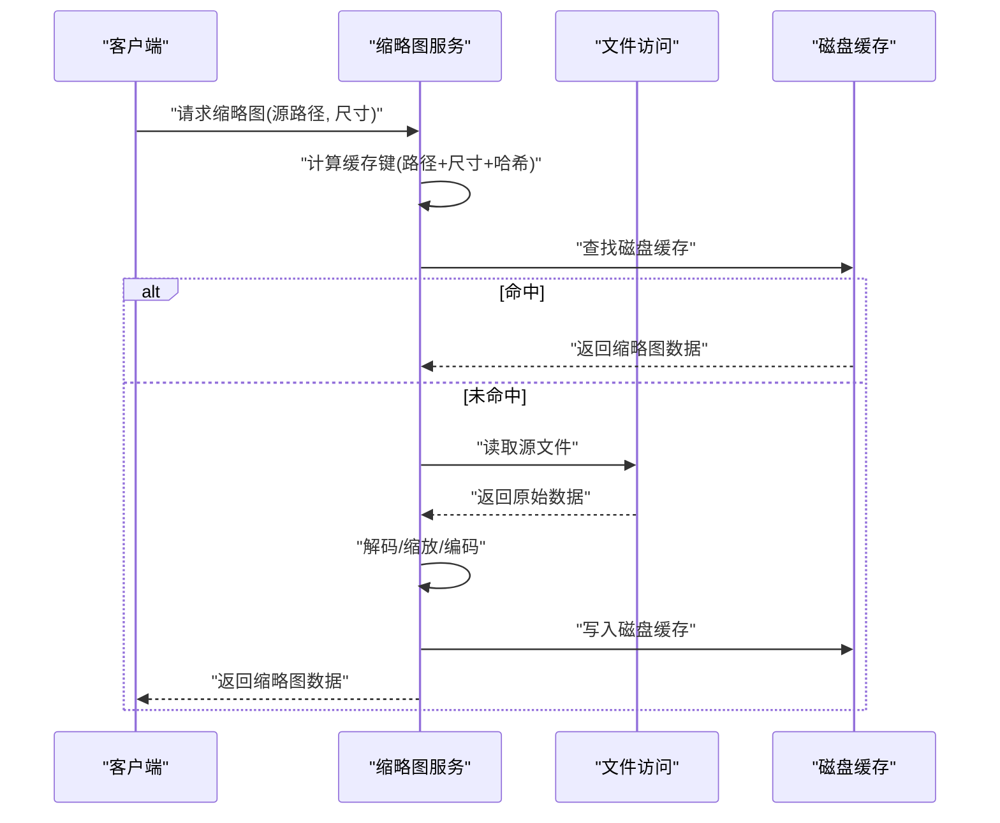
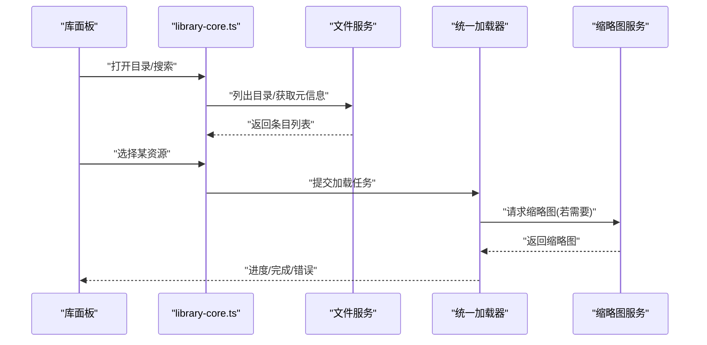
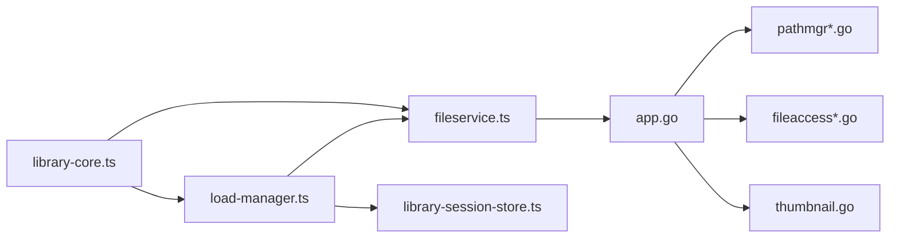

# 资源管理系统

<cite>
**本文引用的文件**   
- [main.go](file://main.go)
- [app.go](file://internal/app/app.go)
- [pathmgr.go](file://internal/app/pathmgr.go)
- [pathmgr_desktop.go](file://internal/app/pathmgr_desktop.go)
- [pathmgr_android.go](file://internal/app/pathmgr_android.go)
- [fileaccess.go](file://internal/app/fileaccess.go)
- [fileaccess_desktop.go](file://internal/app/fileaccess_desktop.go)
- [fileaccess_android.go](file://internal/app/fileaccess_android.go)
- [thumbnail.go](file://internal/app/thumbnail.go)
- [thumbnail.go](file://internal/thumbnail/thumbnail.go)
- [load-manager.ts](file://frontend/src/core/load-manager.ts)
- [fileservice.ts](file://frontend/src/core/fileservice.ts)
- [library-core.ts](file://frontend/src/menus/library-core.ts)
- [library-session-store.ts](file://frontend/src/menus/library-session-store.ts)
- [ADR-045-unified-loading.md](file://docs/adr/adr-045-unified-loading.md)
- [ADR-131-resource-browse-selection-outcome.md](file://docs/adr/adr-131-resource-browse-selection-outcome.md)
- [ADR-105-abort-signal-and-async-error-handling.md](file://docs/adr/adr-105-abort-signal-and-async-error-handling.md)
- [ADR-095-path-normalization-consolidation.md](file://docs/adr/adr-095-path-normalization-consolidation.md)
- [ADR-058-basenameFallbackFS.md](file://docs/adr/adr-058-basenameFallbackFS.md)
- [ADR-082-ci-cross-tag-cache-warm.md](file://docs/adr/adr-082-ci-cross-tag-cache-warm.md)
- [buglog-thumbnail-cache-miss.md](file://docs/buglog/2026-07-17-thumbnail-cache-miss.md)
</cite>

## 目录
1. [简介](#简介)
2. [项目结构](#项目结构)
3. [核心组件](#核心组件)
4. [架构总览](#架构总览)
5. [详细组件分析](#详细组件分析)
6. [依赖关系分析](#依赖关系分析)
7. [性能考量](#性能考量)
8. [故障排查指南](#故障排查指南)
9. [结论](#结论)
10. [附录](#附录)

## 简介
本文件面向“资源管理系统”的完整文档，聚焦以下目标：
- 资源加载管线：异步加载策略、进度跟踪、错误处理机制
- 资源缓存系统：内存缓存、磁盘缓存、失效策略
- 缩略图生成与管理：捕获、格式转换、存储优化
- 文件服务抽象层：跨平台访问、路径管理、权限控制
- 使用示例：如何加载外部资源、管理生命周期、实现自定义处理器

该子系统横跨前端（TypeScript）与后端（Go），通过 Wails 绑定进行通信。前端负责 UI 交互、任务编排与状态展示；后端提供文件系统、路径解析、缩略图生成等能力。

## 项目结构
资源相关代码主要分布在如下位置：
- 前端核心：
  - 加载管理器：统一加载入口、并发控制、进度与取消
  - 文件服务：封装对后端的文件访问调用
  - 库模块：浏览、选择、会话持久化、缩略图流式渲染
- 后端核心：
  - 路径管理：跨平台路径规范化与根目录映射
  - 文件访问：跨平台 I/O、权限与安全边界
  - 缩略图：图片解码、缩放、编码与缓存落盘
- ADR 与审计文档：记录设计决策、问题复盘与演进方向

图示来源
- [load-manager.ts:1-200](file://frontend/src/core/load-manager.ts#L1-L200)
- [fileservice.ts:1-200](file://frontend/src/core/fileservice.ts#L1-L200)
- [library-core.ts:1-200](file://frontend/src/menus/library-core.ts#L1-L200)
- [library-session-store.ts:1-200](file://frontend/src/menus/library-session-store.ts#L1-L200)
- [pathmgr.go:1-200](file://internal/app/pathmgr.go#L1-L200)
- [fileaccess.go:1-200](file://internal/app/fileaccess.go#L1-L200)
- [thumbnail.go:1-200](file://internal/app/thumbnail.go#L1-L200)
- [app.go:1-200](file://internal/app/app.go#L1-L200)

章节来源
- [load-manager.ts:1-200](file://frontend/src/core/load-manager.ts#L1-L200)
- [fileservice.ts:1-200](file://frontend/src/core/fileservice.ts#L1-L200)
- [library-core.ts:1-200](file://frontend/src/menus/library-core.ts#L1-L200)
- [library-session-store.ts:1-200](file://frontend/src/menus/library-session-store.ts#L1-L200)
- [pathmgr.go:1-200](file://internal/app/pathmgr.go#L1-L200)
- [fileaccess.go:1-200](file://internal/app/fileaccess.go#L1-L200)
- [thumbnail.go:1-200](file://internal/app/thumbnail.go#L1-L200)
- [app.go:1-200](file://internal/app/app.go#L1-L200)

## 核心组件
- 统一加载器（前端）
  - 职责：统一发起资源加载请求，支持并发上限、任务去重、进度回调、取消信号
  - 关键特性：AbortSignal 集成、错误分类与重试策略、可插拔处理器注册
- 文件服务（前端）
  - 职责：封装对 Go 后端的文件读取、列表、元数据查询等调用
  - 关键特性：路径规范化、跨域与权限错误提示、重试与降级
- 路径管理（后端）
  - 职责：跨平台路径解析、根目录映射、安全白名单校验
  - 关键特性：规范化、basename 回退、平台差异适配
- 文件访问（后端）
  - 职责：实际 I/O 操作，包含只读模式、权限检查、异常包装
  - 关键特性：平台差异化实现、错误码标准化
- 缩略图（后端）
  - 职责：从模型或纹理中生成预览图，支持尺寸裁剪、格式转换、缓存落盘
  - 关键特性：缓存键计算、并发安全、失败回退

章节来源
- [load-manager.ts:1-200](file://frontend/src/core/load-manager.ts#L1-L200)
- [fileservice.ts:1-200](file://frontend/src/core/fileservice.ts#L1-L200)
- [pathmgr.go:1-200](file://internal/app/pathmgr.go#L1-L200)
- [fileaccess.go:1-200](file://internal/app/fileaccess.go#L1-L200)
- [thumbnail.go:1-200](file://internal/app/thumbnail.go#L1-L200)

## 架构总览
资源加载管线由前端统一调度，后端提供底层能力。整体流程包括：
- 前端发起加载请求（含 URL/路径、类型、选项）
- 加载器根据类型路由到具体处理器（如模型、纹理、音频、缩略图）
- 处理器通过文件服务访问后端，必要时触发缩略图生成
- 结果进入内存缓存，并可选择写入磁盘缓存
- 进度事件与错误事件通过事件总线通知 UI

图示来源
- [load-manager.ts:1-200](file://frontend/src/core/load-manager.ts#L1-L200)
- [fileservice.ts:1-200](file://frontend/src/core/fileservice.ts#L1-L200)
- [app.go:1-200](file://internal/app/app.go#L1-200)
- [pathmgr.go:1-200](file://internal/app/pathmgr.go#L1-200)
- [fileaccess.go:1-200](file://internal/app/fileaccess.go#L1-200)
- [thumbnail.go:1-200](file://internal/app/thumbnail.go#L1-200)

## 详细组件分析

### 统一加载器（前端）
- 设计要点
  - 任务队列与并发上限：避免一次性过多 I/O 导致卡顿
  - 任务去重：相同 key 的请求合并，减少重复网络/磁盘访问
  - 进度跟踪：按阶段上报（开始、下载/读取、解析、缓存、完成）
  - 错误处理：区分网络/权限/解析错误，支持重试与降级
  - 取消机制：基于 AbortSignal 的中断与清理
- 典型用法
  - 注册处理器：为不同资源类型注册解析与缓存逻辑
  - 启动加载：传入资源标识与选项，订阅进度与结果
  - 生命周期管理：在页面卸载时取消未完成任务，释放资源

图示来源
- [load-manager.ts:1-200](file://frontend/src/core/load-manager.ts#L1-L200)
- [fileservice.ts:1-200](file://frontend/src/core/fileservice.ts#L1-L200)

章节来源
- [load-manager.ts:1-200](file://frontend/src/core/load-manager.ts#L1-L200)
- [fileservice.ts:1-200](file://frontend/src/core/fileservice.ts#L1-L200)
- [ADR-045-unified-loading.md:1-200](file://docs/adr/adr-045-unified-loading.md#L1-L200)
- [ADR-105-abort-signal-and-async-error-handling.md:1-200](file://docs/adr/adr-105-abort-signal-and-async-error-handling.md#L1-L200)

### 文件服务抽象层（前端）
- 职责
  - 封装对后端方法的调用（读取文件、列出目录、获取元数据）
  - 统一错误映射与用户友好提示
  - 路径规范化与安全检查
- 跨平台与权限
  - 通过后端 pathmgr 与 fileaccess 屏蔽平台差异
  - 权限不足时给出明确提示与降级方案（例如仅显示名称）

图示来源
- [fileservice.ts:1-200](file://frontend/src/core/fileservice.ts#L1-L200)
- [pathmgr.go:1-200](file://internal/app/pathmgr.go#L1-L200)
- [fileaccess.go:1-200](file://internal/app/fileaccess.go#L1-L200)

章节来源
- [fileservice.ts:1-200](file://frontend/src/core/fileservice.ts#L1-L200)
- [pathmgr.go:1-200](file://internal/app/pathmgr.go#L1-L200)
- [pathmgr_desktop.go:1-200](file://internal/app/pathmgr_desktop.go#L1-L200)
- [pathmgr_android.go:1-200](file://internal/app/pathmgr_android.go#L1-L200)
- [fileaccess.go:1-200](file://internal/app/fileaccess.go#L1-L200)
- [fileaccess_desktop.go:1-200](file://internal/app/fileaccess_desktop.go#L1-L200)
- [fileaccess_android.go:1-200](file://internal/app/fileaccess_android.go#L1-L200)
- [ADR-095-path-normalization-consolidation.md:1-200](file://docs/adr/adr-095-path-normalization-consolidation.md#L1-L200)
- [ADR-058-basenameFallbackFS.md:1-200](file://docs/adr/adr-058-basenameFallbackFS.md#L1-L200)

### 缩略图生成与管理（后端）
- 生成流程
  - 输入：模型文件或纹理文件路径
  - 处理：解码图像、按比例缩放、裁剪中心区域、编码为 Web 友好格式
  - 输出：缩略图二进制数据与元信息（尺寸、格式）
- 缓存策略
  - 内存缓存：进程内 Map，按缩略图键快速命中
  - 磁盘缓存：持久化到本地目录，重启后可复用
  - 失效策略：基于源文件哈希或时间戳变化触发重建
- 并发与健壮性
  - 并发安全：读写锁保护缓存
  - 失败回退：当解码失败时返回占位图或空数据，避免阻塞主流程

图示来源
- [thumbnail.go:1-200](file://internal/app/thumbnail.go#L1-L200)
- [thumbnail.go:1-200](file://internal/thumbnail/thumbnail.go#L1-L200)
- [fileaccess.go:1-200](file://internal/app/fileaccess.go#L1-L200)

章节来源
- [thumbnail.go:1-200](file://internal/app/thumbnail.go#L1-L200)
- [thumbnail.go:1-200](file://internal/thumbnail/thumbnail.go#L1-L200)
- [buglog-thumbnail-cache-miss.md:1-200](file://docs/buglog/2026-07-17-thumbnail-cache-miss.md#L1-L200)

### 库浏览与选择（前端）
- 功能要点
  - 浏览目录树、过滤与搜索
  - 选择资源后触发加载管线
  - 会话级缓存：最近浏览项、选中项状态
- 与缩略图的协作
  - 列表渲染时按需拉取缩略图，支持懒加载与预取
  - 缩略图缺失时的占位策略

图示来源
- [library-core.ts:1-200](file://frontend/src/menus/library-core.ts#L1-L200)
- [fileservice.ts:1-200](file://frontend/src/core/fileservice.ts#L1-L200)
- [load-manager.ts:1-200](file://frontend/src/core/load-manager.ts#L1-L200)
- [thumbnail.go:1-200](file://internal/app/thumbnail.go#L1-L200)

章节来源
- [library-core.ts:1-200](file://frontend/src/menus/library-core.ts#L1-L200)
- [library-session-store.ts:1-200](file://frontend/src/menus/library-session-store.ts#L1-L200)
- [ADR-131-resource-browse-selection-outcome.md:1-200](file://docs/adr/adr-131-resource-browse-selection-outcome.md#L1-L200)

## 依赖关系分析
- 前端内部依赖
  - load-manager.ts 依赖 fileservice.ts 与 library-session-store.ts
  - library-core.ts 依赖 fileservice.ts 与 load-manager.ts
- 前后端耦合点
  - fileservice.ts 通过 Wails 绑定调用 app.go 暴露的方法
  - app.go 组合 pathmgr 与 fileaccess，提供统一的 I/O 接口
  - thumbnail.go 作为独立服务被上层调用

图示来源
- [load-manager.ts:1-200](file://frontend/src/core/load-manager.ts#L1-L200)
- [fileservice.ts:1-200](file://frontend/src/core/fileservice.ts#L1-L200)
- [library-core.ts:1-200](file://frontend/src/menus/library-core.ts#L1-L200)
- [library-session-store.ts:1-200](file://frontend/src/menus/library-session-store.ts#L1-L200)
- [app.go:1-200](file://internal/app/app.go#L1-200)
- [pathmgr.go:1-200](file://internal/app/pathmgr.go#L1-L200)
- [fileaccess.go:1-200](file://internal/app/fileaccess.go#L1-L200)
- [thumbnail.go:1-200](file://internal/app/thumbnail.go#L1-L200)

章节来源
- [load-manager.ts:1-200](file://frontend/src/core/load-manager.ts#L1-L200)
- [fileservice.ts:1-200](file://frontend/src/core/fileservice.ts#L1-L200)
- [library-core.ts:1-200](file://frontend/src/menus/library-core.ts#L1-L200)
- [library-session-store.ts:1-200](file://frontend/src/menus/library-session-store.ts#L1-L200)
- [app.go:1-200](file://internal/app/app.go#L1-200)
- [pathmgr.go:1-200](file://internal/app/pathmgr.go#L1-L200)
- [fileaccess.go:1-200](file://internal/app/fileaccess.go#L1-L200)
- [thumbnail.go:1-200](file://internal/app/thumbnail.go#L1-L200)

## 性能考量
- 并发与限流
  - 合理设置最大并发数，避免 I/O 风暴
  - 对大文件采用分块读取与流式处理
- 缓存命中率
  - 提高内存缓存命中率，减少重复解析
  - 磁盘缓存键稳定，确保跨进程/重启可用
- 缩略图优化
  - 选择合适的尺寸与格式，平衡清晰度与体积
  - 批量生成时采用批处理与去重
- 错误恢复
  - 对临时错误（网络抖动、权限变更）实施指数退避重试
  - 对不可恢复错误快速失败，避免长时间阻塞

[本节为通用指导，不直接分析具体文件]

## 故障排查指南
- 缩略图缓存未命中
  - 现象：首次加载慢，后续仍频繁重建
  - 排查：确认缓存键是否包含源文件哈希；检查磁盘缓存目录权限
  - 参考：[缩略图缓存未命中问题日志:1-200](file://docs/buglog/2026-07-17-thumbnail-cache-miss.md#L1-L200)
- 路径解析异常
  - 现象：跨平台路径不一致或无法访问
  - 排查：检查 pathmgr 的规范化逻辑与 basename 回退策略
  - 参考：[路径规范化整合 ADR:1-200](file://docs/adr/adr-095-path-normalization-consolidation.md#L1-L200)、[basename 回退 ADR:1-200](file://docs/adr/adr-058-basenameFallbackFS.md#L1-L200)
- 异步错误与取消
  - 现象：任务中断后残留状态或泄漏
  - 排查：确认 AbortSignal 传播与清理逻辑
  - 参考：[取消信号与异步错误处理 ADR:1-200](file://docs/adr/adr-105-abort-signal-and-async-error-handling.md#L1-L200)
- 资源浏览与选择
  - 现象：选择后无响应或加载失败
  - 排查：核对库选择结果处理与加载管线衔接
  - 参考：[资源浏览选择结果 ADR:1-200](file://docs/adr/adr-131-resource-browse-selection-outcome.md#L1-L200)

章节来源
- [buglog-thumbnail-cache-miss.md:1-200](file://docs/buglog/2026-07-17-thumbnail-cache-miss.md#L1-L200)
- [ADR-095-path-normalization-consolidation.md:1-200](file://docs/adr/adr-095-path-normalization-consolidation.md#L1-L200)
- [ADR-058-basenameFallbackFS.md:1-200](file://docs/adr/adr-058-basenameFallbackFS.md#L1-L200)
- [ADR-105-abort-signal-and-async-error-handling.md:1-200](file://docs/adr/adr-105-abort-signal-and-async-error-handling.md#L1-L200)
- [ADR-131-resource-browse-selection-outcome.md:1-200](file://docs/adr/adr-131-resource-browse-selection-outcome.md#L1-L200)

## 结论
资源管理系统通过“前端统一加载器 + 后端文件/路径/缩略图服务”的分层架构，实现了高内聚、低耦合的资源访问与处理。其关键优势在于：
- 统一的加载入口与可插拔处理器，便于扩展新资源类型
- 完善的缓存体系（内存+磁盘）提升性能与用户体验
- 跨平台路径与文件访问抽象，增强稳定性与可移植性
- 明确的错误处理与取消机制，保障系统健壮性

建议后续持续优化：
- 引入更细粒度的缓存失效策略（如基于标签/版本）
- 增加缩略图生成的后台任务队列与优先级
- 完善监控与指标采集，量化命中率与延迟

[本节为总结性内容，不直接分析具体文件]

## 附录

### 使用示例（以路径引用代替代码片段）
- 加载外部资源
  - 参考：[统一加载器:1-200](file://frontend/src/core/load-manager.ts#L1-L200)、[文件服务:1-200](file://frontend/src/core/fileservice.ts#L1-L200)
- 管理资源生命周期
  - 参考：[统一加载器:1-200](file://frontend/src/core/load-manager.ts#L1-L200)、[取消信号与异步错误处理 ADR:1-200](file://docs/adr/adr-105-abort-signal-and-async-error-handling.md#L1-L200)
- 实现自定义资源处理器
  - 参考：[统一加载器:1-200](file://frontend/src/core/load-manager.ts#L1-L200)、[库核心:1-200](file://frontend/src/menus/library-core.ts#L1-L200)

[本节为指引性内容，不直接分析具体文件]