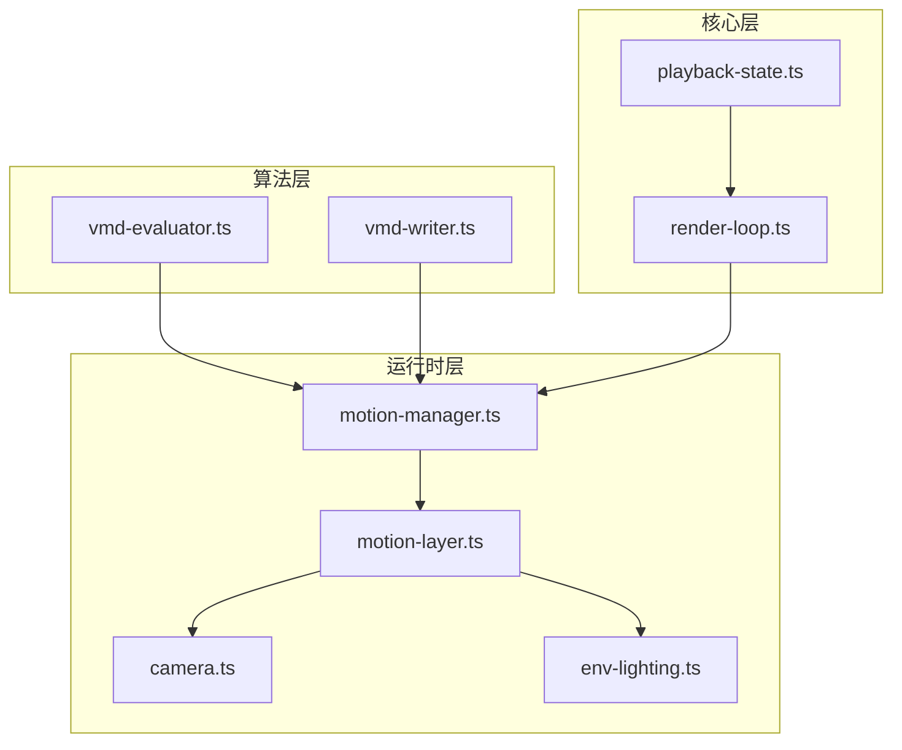
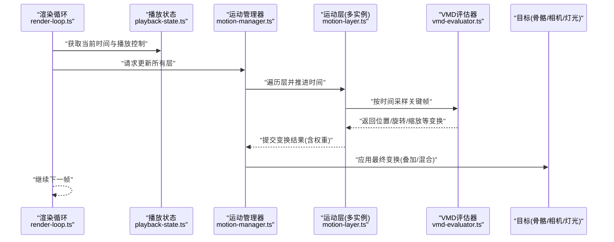
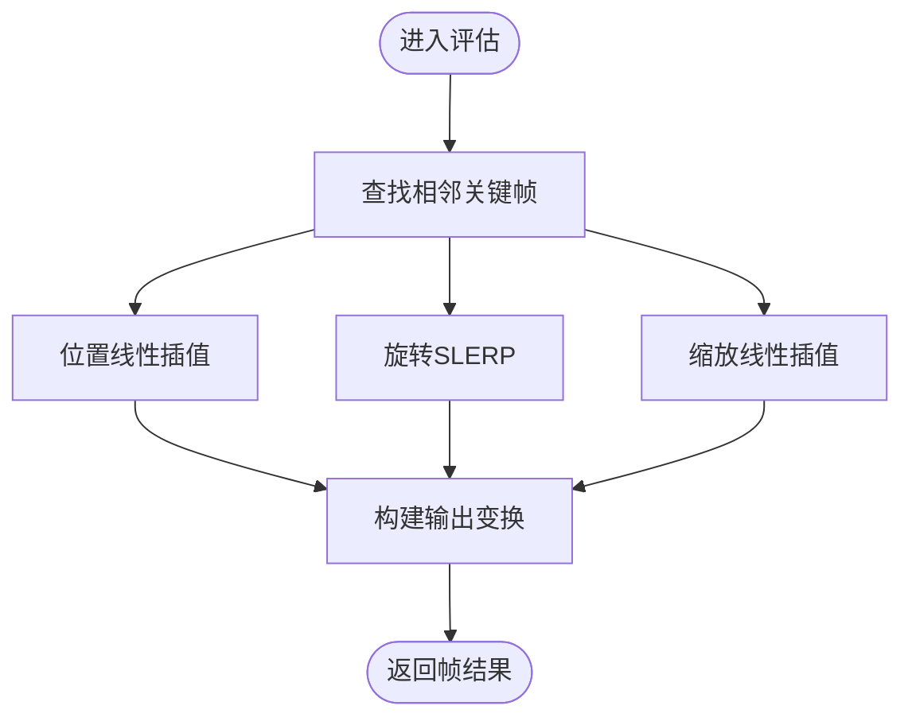
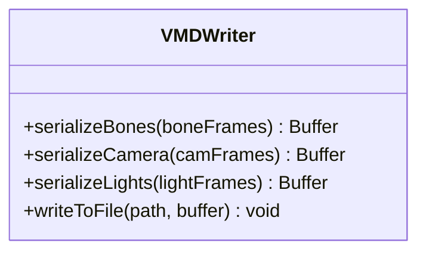
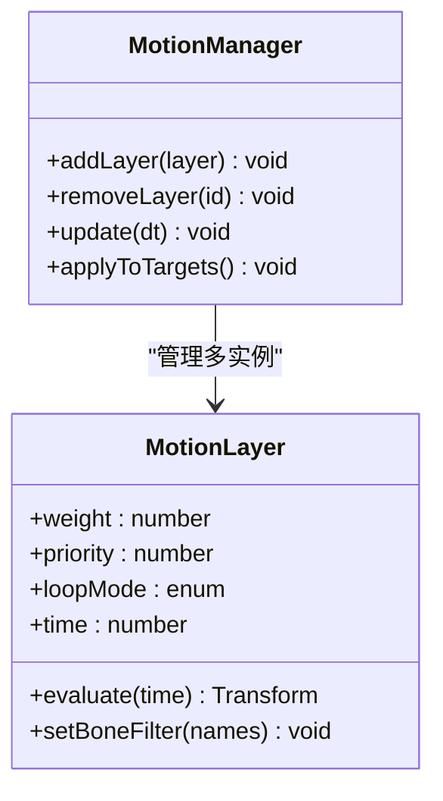
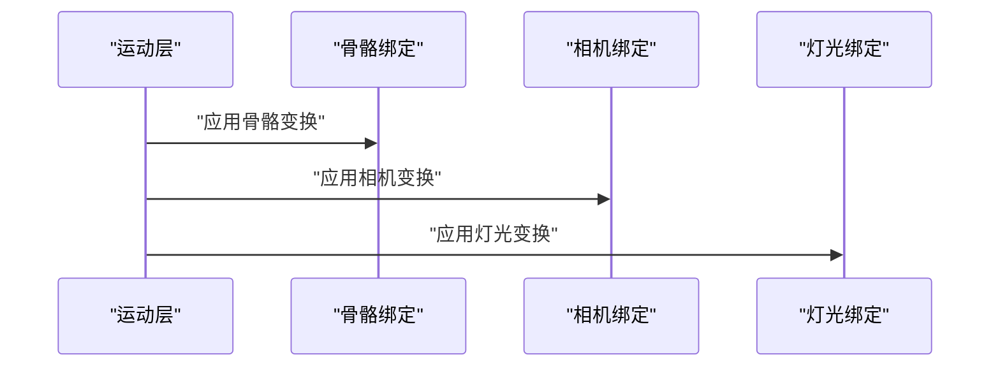
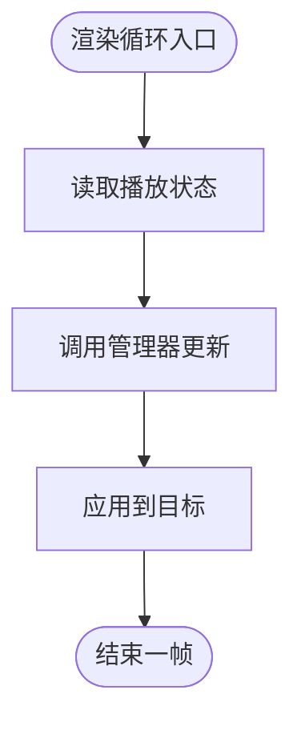
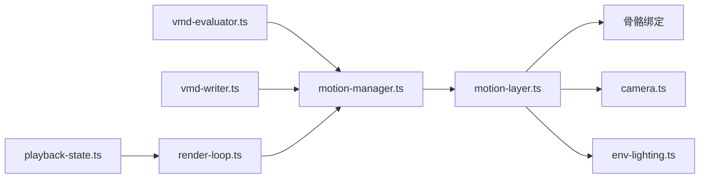

# VMD 动画播放

<cite>
**本文引用的文件**   
- [vmd-evaluator.ts](file://frontend/src/motion-algos/vmd-evaluator.ts)
- [vmd-writer.ts](file://frontend/src/motion-algos/vmd-writer.ts)
- [motion-manager.ts](file://frontend/src/scene/motion/motion-manager.ts)
- [motion-layer.ts](file://frontend/src/scene/motion/motion-layer.ts)
- [camera.ts](file://frontend/src/scene/camera/camera.ts)
- [env-lighting.ts](file://frontend/src/scene/env/env-lighting.ts)
- [playback-state.ts](file://frontend/src/core/playback-state.ts)
- [render-loop.ts](file://frontend/src/core/render-loop.ts)
- [ADR-051-vmd-layers-bonefilter.md](file://docs/adr/adr-051-vmd-layers-bonefilter.md)
- [ADR-056-wasm-runtime-motion-layers.md](file://docs/adr/adr-056-wasm-runtime-motion-layers.md)
- [buglog-VMD 播放无反应.md](file://docs/buglog/VMD 播放无反应.md)
</cite>

## 目录
1. [简介](#简介)
2. [项目结构](#项目结构)
3. [核心组件](#核心组件)
4. [架构总览](#架构总览)
5. [详细组件分析](#详细组件分析)
6. [依赖关系分析](#依赖关系分析)
7. [性能考虑](#性能考虑)
8. [故障排查指南](#故障排查指南)
9. [结论](#结论)
10. [附录](#附录)

## 简介
本文件面向需要理解与扩展 MikuMikuAR 中 VMD 动画播放系统的开发者与维护者，系统性阐述：
- VMD 文件格式解析与关键帧数据结构（骨骼、相机、灯光）
- 动画评估器实现原理（时间插值、位置/旋转/缩放计算、循环与暂停）
- VMD 层叠加机制（混合权重、优先级、实时切换）
- VMD 写入能力（序列化与导出）
- 使用示例（加载、播放、控制）与性能优化建议
- 常见问题定位与解决方案

## 项目结构
VMD 相关代码主要位于前端 TypeScript 模块中，围绕“评估器—管理层—渲染循环”的三层组织方式展开：
- motion-algos：算法与数据读写（评估器、写入器）
- scene/motion：运行时管理（管理器、层、绑定到模型/相机/灯光）
- core：全局播放状态与渲染驱动

图表来源
- [vmd-evaluator.ts](file://frontend/src/motion-algos/vmd-evaluator.ts)
- [vmd-writer.ts](file://frontend/src/motion-algos/vmd-writer.ts)
- [motion-manager.ts](file://frontend/src/scene/motion/motion-manager.ts)
- [motion-layer.ts](file://frontend/src/scene/motion/motion-layer.ts)
- [camera.ts](file://frontend/src/scene/camera/camera.ts)
- [env-lighting.ts](file://frontend/src/scene/env/env-lighting.ts)
- [playback-state.ts](file://frontend/src/core/playback-state.ts)
- [render-loop.ts](file://frontend/src/core/render-loop.ts)

章节来源
- [vmd-evaluator.ts](file://frontend/src/motion-algos/vmd-evaluator.ts)
- [vmd-writer.ts](file://frontend/src/motion-algos/vmd-writer.ts)
- [motion-manager.ts](file://frontend/src/scene/motion/motion-manager.ts)
- [motion-layer.ts](file://frontend/src/scene/motion/motion-layer.ts)
- [camera.ts](file://frontend/src/scene/camera/camera.ts)
- [env-lighting.ts](file://frontend/src/scene/env/env-lighting.ts)
- [playback-state.ts](file://frontend/src/core/playback-state.ts)
- [render-loop.ts](file://frontend/src/core/render-loop.ts)

## 核心组件
- VMD 评估器：负责将 VMD 关键帧序列转换为每帧的变换输出（位置、旋转、缩放），并支持相机与灯光的关键帧。
- VMD 写入器：将内存中的动画数据序列化为 VMD 格式，用于导出或持久化。
- 运动管理器：协调多个 VMD 层的生命周期、播放状态、时间推进与结果合成。
- 运动层：封装单个 VMD 实例的播放参数（权重、优先级、循环模式、过滤规则）。
- 目标绑定：将评估结果应用到具体对象（模型骨骼、相机、灯光）。
- 播放状态与渲染循环：提供全局时间源、播放控制（播放/暂停/跳转）与逐帧更新调度。

章节来源
- [vmd-evaluator.ts](file://frontend/src/motion-algos/vmd-evaluator.ts)
- [vmd-writer.ts](file://frontend/src/motion-algos/vmd-writer.ts)
- [motion-manager.ts](file://frontend/src/scene/motion/motion-manager.ts)
- [motion-layer.ts](file://frontend/src/scene/motion/motion-layer.ts)
- [camera.ts](file://frontend/src/scene/camera/camera.ts)
- [env-lighting.ts](file://frontend/src/scene/env/env-lighting.ts)
- [playback-state.ts](file://frontend/src/core/playback-state.ts)
- [render-loop.ts](file://frontend/src/core/render-loop.ts)

## 架构总览
下图展示了从渲染循环到 VMD 评估、再到目标应用的整体时序与数据流。

图表来源
- [render-loop.ts](file://frontend/src/core/render-loop.ts)
- [playback-state.ts](file://frontend/src/core/playback-state.ts)
- [motion-manager.ts](file://frontend/src/scene/motion/motion-manager.ts)
- [motion-layer.ts](file://frontend/src/scene/motion/motion-layer.ts)
- [vmd-evaluator.ts](file://frontend/src/motion-algos/vmd-evaluator.ts)
- [camera.ts](file://frontend/src/scene/camera/camera.ts)
- [env-lighting.ts](file://frontend/src/scene/env/env-lighting.ts)

## 详细组件分析

### VMD 评估器（骨骼/相机/灯光）
- 关键帧数据结构
  - 骨骼关键帧：包含时间戳、名称、位置、四元数旋转、缩放等字段；同一骨骼可有多条关键帧。
  - 相机关键帧：包含时间戳、视角位置、注视点、FOV、投影类型等。
  - 灯光关键帧：包含时间戳、颜色、强度、方向/位置等。
- 时间插值算法
  - 线性插值：对位置与缩放采用线性插值。
  - 球面线性插值（SLERP）：对旋转采用四元数 SLERP，保证最短路径与单位长度。
  - 边界处理：超出首尾关键帧时可选择保持端点或循环回绕。
- 输出规范
  - 每帧输出统一的变换矩阵或分解后的位置/旋转/缩放三元组，供上层合成。
- 错误与健壮性
  - 缺失关键帧时的默认行为（零向量/单位四元数）。
  - 无效时间戳或重复时间戳的处理策略。

图表来源
- [vmd-evaluator.ts](file://frontend/src/motion-algos/vmd-evaluator.ts)

章节来源
- [vmd-evaluator.ts](file://frontend/src/motion-algos/vmd-evaluator.ts)

### VMD 写入器（序列化与导出）
- 功能要点
  - 将内存中的骨骼/相机/灯光关键帧序列按 VMD 二进制布局序列化。
  - 支持批量导出与增量更新。
- 注意事项
  - 字节序与编码（Shift-JIS 名称字段）需严格遵循格式规范。
  - 数值精度与舍入策略影响文件大小与回放一致性。
  - 导出前进行去重与排序，确保时间单调递增。

图表来源
- [vmd-writer.ts](file://frontend/src/motion-algos/vmd-writer.ts)

章节来源
- [vmd-writer.ts](file://frontend/src/motion-algos/vmd-writer.ts)

### 运动管理器与运动层（叠加、权重、优先级、切换）
- 层模型
  - 每个层对应一个 VMD 实例，拥有独立的时间轴、权重与优先级。
  - 支持按骨骼名过滤（BoneFilter），减少无关计算。
- 叠加与混合
  - 同帧内多层结果按权重加权求和，再合并到目标对象。
  - 优先级高的层可在冲突场景下覆盖低优先级层的结果（例如头部表情 vs 全身动作）。
- 实时切换
  - 在播放过程中动态替换层或调整权重，平滑过渡避免突变。
- 循环与暂停
  - 支持循环模式（单次/无限循环）、暂停/恢复、时间跳转。

图表来源
- [motion-manager.ts](file://frontend/src/scene/motion/motion-manager.ts)
- [motion-layer.ts](file://frontend/src/scene/motion/motion-layer.ts)

章节来源
- [motion-manager.ts](file://frontend/src/scene/motion/motion-manager.ts)
- [motion-layer.ts](file://frontend/src/scene/motion/motion-layer.ts)
- [ADR-051-vmd-layers-bonefilter.md](file://docs/adr/adr-051-vmd-layers-bonefilter.md)
- [ADR-056-wasm-runtime-motion-layers.md](file://docs/adr/adr-056-wasm-runtime-motion-layers.md)

### 目标绑定（模型骨骼、相机、灯光）
- 模型骨骼
  - 将评估得到的位置/旋转/缩放应用到 PMX 模型的骨骼节点。
- 相机
  - 根据相机关键帧更新视图矩阵与投影参数。
- 灯光
  - 根据灯光关键帧更新光源属性（颜色、强度、方向/位置）。

图表来源
- [camera.ts](file://frontend/src/scene/camera/camera.ts)
- [env-lighting.ts](file://frontend/src/scene/env/env-lighting.ts)

章节来源
- [camera.ts](file://frontend/src/scene/camera/camera.ts)
- [env-lighting.ts](file://frontend/src/scene/env/env-lighting.ts)

### 播放状态与渲染循环
- 播放状态
  - 维护全局时间、播放/暂停标志、速度倍率、循环模式等。
- 渲染循环
  - 每帧读取播放状态，驱动运动管理器更新，并将结果应用到目标。

图表来源
- [playback-state.ts](file://frontend/src/core/playback-state.ts)
- [render-loop.ts](file://frontend/src/core/render-loop.ts)

章节来源
- [playback-state.ts](file://frontend/src/core/playback-state.ts)
- [render-loop.ts](file://frontend/src/core/render-loop.ts)

## 依赖关系分析
- 耦合关系
  - 评估器与写入器为纯算法模块，低耦合、高内聚。
  - 管理器与层负责编排与状态，依赖评估器输出。
  - 目标绑定模块仅消费变换结果，便于替换不同后端（WASM/原生）。
- 外部依赖
  - 数学库（四元数、矩阵运算）由底层引擎或自实现提供。
  - I/O 操作通过平台抽象访问文件系统。

图表来源
- [vmd-evaluator.ts](file://frontend/src/motion-algos/vmd-evaluator.ts)
- [vmd-writer.ts](file://frontend/src/motion-algos/vmd-writer.ts)
- [motion-manager.ts](file://frontend/src/scene/motion/motion-manager.ts)
- [motion-layer.ts](file://frontend/src/scene/motion/motion-layer.ts)
- [camera.ts](file://frontend/src/scene/camera/camera.ts)
- [env-lighting.ts](file://frontend/src/scene/env/env-lighting.ts)
- [playback-state.ts](file://frontend/src/core/playback-state.ts)
- [render-loop.ts](file://frontend/src/core/render-loop.ts)

章节来源
- [vmd-evaluator.ts](file://frontend/src/motion-algos/vmd-evaluator.ts)
- [vmd-writer.ts](file://frontend/src/motion-algos/vmd-writer.ts)
- [motion-manager.ts](file://frontend/src/scene/motion/motion-manager.ts)
- [motion-layer.ts](file://frontend/src/scene/motion/motion-layer.ts)
- [camera.ts](file://frontend/src/scene/camera/camera.ts)
- [env-lighting.ts](file://frontend/src/scene/env/env-lighting.ts)
- [playback-state.ts](file://frontend/src/core/playback-state.ts)
- [render-loop.ts](file://frontend/src/core/render-loop.ts)

## 性能考虑
- 关键帧缓存与二分查找
  - 对每根骨骼/相机/灯光建立有序索引，利用二分查找快速定位相邻关键帧。
- 批处理与向量化
  - 将同帧的多层结果合并计算，减少分支与函数调用开销。
- 骨骼过滤
  - 使用 BoneFilter 仅评估受影响的骨骼，降低无用计算。
- 层级权重裁剪
  - 当某层权重接近零时跳过其评估，避免浪费 CPU/GPU。
- 异步与分片
  - 大文件解析与写入采用分块/异步策略，避免主线程阻塞。
- 数值稳定性
  - 旋转插值使用单位四元数归一化，防止漂移。

[本节为通用指导，不直接分析具体文件]

## 故障排查指南
- 症状：VMD 播放无反应
  - 可能原因
    - 未正确初始化播放状态或渲染循环未触发更新。
    - 层未添加到管理器或未设置有效权重。
    - 关键帧时间范围与当前播放时间不匹配。
  - 排查步骤
    - 检查播放状态是否处于“播放”且时间轴在推进。
    - 确认管理器已注册层且权重大于零。
    - 打印最近一次评估输出的时间戳与关键帧边界。
- 常见修复
  - 在加载完成后显式启动播放。
  - 为层设置合适的循环模式与初始时间。
  - 校验文件名编码与骨骼名一致。

章节来源
- [buglog-VMD 播放无反应.md](file://docs/buglog/VMD 播放无反应.md)

## 结论
VMD 动画播放系统以“评估器—管理层—目标绑定”的分层架构实现，具备可扩展的层叠加机制与灵活的播放控制。通过合理的插值算法、权重混合与骨骼过滤，能够在保证质量的同时获得良好的性能表现。写入器提供了完整的导出能力，便于内容创作与版本管理。

[本节为总结性内容，不直接分析具体文件]

## 附录

### 使用示例（加载、播放、控制）
- 加载 VMD
  - 使用评估器解析文件，生成骨骼/相机/灯光关键帧集合。
- 创建层并加入管理器
  - 设置权重、优先级、循环模式与骨骼过滤。
- 播放控制
  - 通过播放状态设置播放/暂停、速度与跳转。
- 绑定目标
  - 将层结果应用到模型骨骼、相机与灯光。

章节来源
- [vmd-evaluator.ts](file://frontend/src/motion-algos/vmd-evaluator.ts)
- [motion-manager.ts](file://frontend/src/scene/motion/motion-manager.ts)
- [motion-layer.ts](file://frontend/src/scene/motion/motion-layer.ts)
- [playback-state.ts](file://frontend/src/core/playback-state.ts)
- [render-loop.ts](file://frontend/src/core/render-loop.ts)

### 最佳实践
- 合理拆分长动画为多个层，按需启用，降低单帧压力。
- 对高频更新的相机/灯光关键帧进行采样降频或平滑处理。
- 导出前对关键帧去重与排序，减小文件体积。
- 使用 BoneFilter 精确限定作用域，避免全局广播式更新。

[本节为通用指导，不直接分析具体文件]