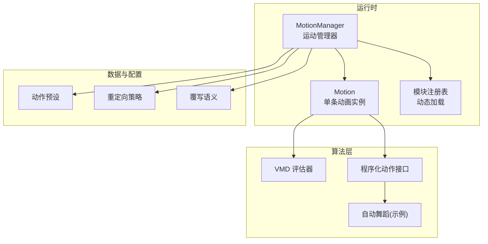
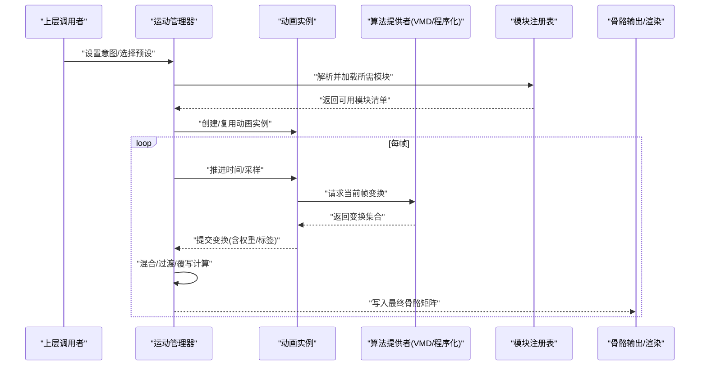
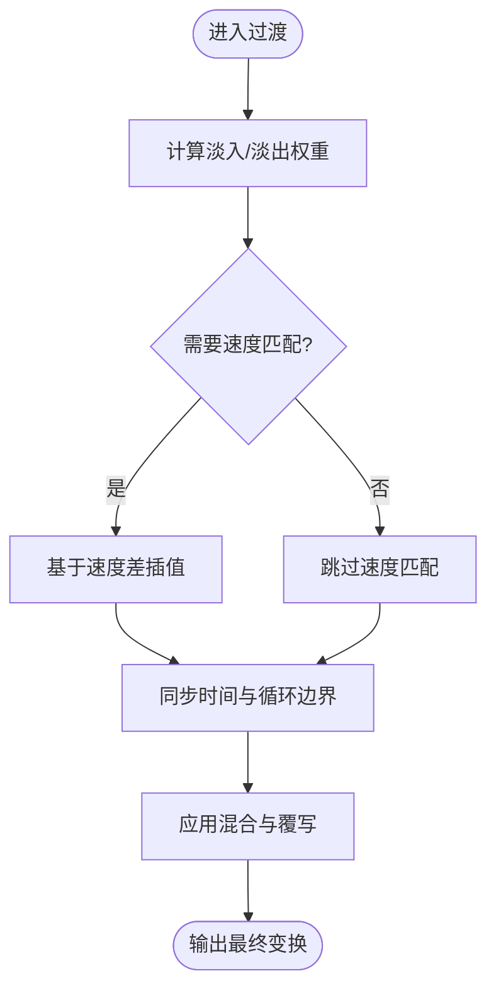
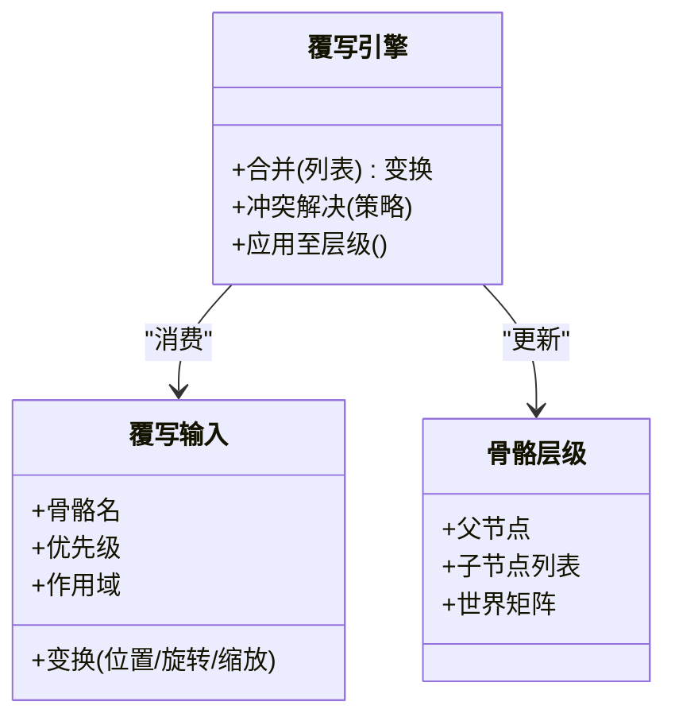
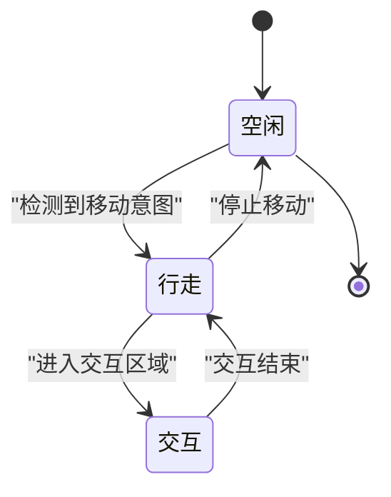
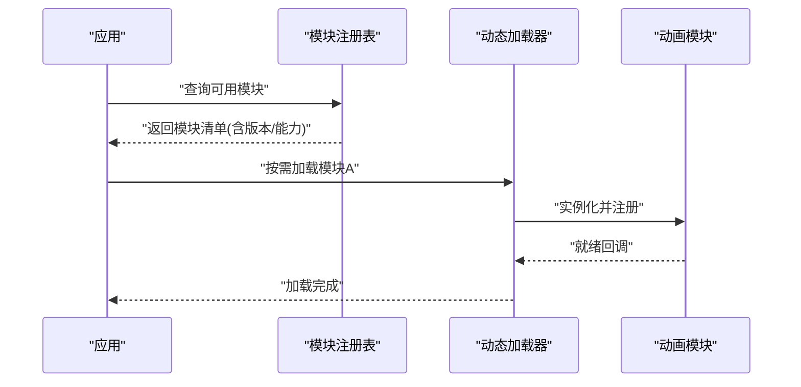
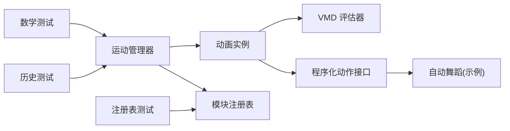

# 动画混合与过渡

<cite>
**本文引用的文件**   
- [motion.ts](file://frontend/src/scene/motion/motion.ts)
- [motion-manager.ts](file://frontend/src/scene/motion/motion-manager.ts)
- [vmd-evaluator.ts](file://frontend/src/motion-algos/vmd-evaluator.ts)
- [procedural-motion.ts](file://frontend/src/motion-algos/procedural-motion.ts)
- [proc-motion-autodance.ts](file://frontend/src/motion-algos/proc-motion-autodance.ts)
- [motion-modules-registry.test.ts](file://frontend/src/scene/__tests__/motion-modules-registry.test.ts)
- [motion-history.test.ts](file://frontend/src/scene/__tests__/motion-history.test.ts)
- [motion-math.test.ts](file://frontend/src/scene/__tests__/motion-math.test.ts)
- [adr-108-animation-retargeter.md](file://docs/adr/adr-108-animation-retargeter.md)
- [adr-123-compute-override-semantics.md](file://docs/adr/adr-123-compute-override-semantics.md)
- [adr-145-motion-presets.md](file://docs/adr/adr-145-motion-presets.md)
</cite>

## 目录
1. [简介](#简介)
2. [项目结构](#项目结构)
3. [核心组件](#核心组件)
4. [架构总览](#架构总览)
5. [详细组件分析](#详细组件分析)
6. [依赖关系分析](#依赖关系分析)
7. [性能考量](#性能考量)
8. [故障排查指南](#故障排查指南)
9. [结论](#结论)
10. [附录](#附录)

## 简介
本文件聚焦于动画混合与过渡系统，围绕多动画源混合、过渡控制、骨骼覆写、意图系统与模块注册发现机制展开。文档面向不同技术背景的读者，提供从高层概念到代码级实现的渐进式说明，并给出可视化图示与可操作的实现路径指引（以源码路径替代具体代码片段）。

## 项目结构
动画相关能力主要分布在以下位置：
- 运行时驱动与管理：前端场景运动子系统
- 算法层：VMD 评估、程序化动作、自动舞蹈等
- 测试与回归：覆盖历史回放、数学工具、模块注册等
- ADR 设计决策：重定向、覆写语义、预设体系等

图表来源
- [motion-manager.ts](file://frontend/src/scene/motion/motion-manager.ts)
- [motion.ts](file://frontend/src/scene/motion/motion.ts)
- [vmd-evaluator.ts](file://frontend/src/motion-algos/vmd-evaluator.ts)
- [procedural-motion.ts](file://frontend/src/motion-algos/procedural-motion.ts)
- [proc-motion-autodance.ts](file://frontend/src/motion-algos/proc-motion-autodance.ts)
- [adr-108-animation-retargeter.md](file://docs/adr/adr-108-animation-retargeter.md)
- [adr-123-compute-override-semantics.md](file://docs/adr/adr-123-compute-override-semantics.md)
- [adr-145-motion-presets.md](file://docs/adr/adr-145-motion-presets.md)

章节来源
- [motion-manager.ts](file://frontend/src/scene/motion/motion-manager.ts)
- [motion.ts](file://frontend/src/scene/motion/motion.ts)
- [vmd-evaluator.ts](file://frontend/src/motion-algos/vmd-evaluator.ts)
- [procedural-motion.ts](file://frontend/src/motion-algos/procedural-motion.ts)
- [proc-motion-autodance.ts](file://frontend/src/motion-algos/proc-motion-autodance.ts)
- [adr-108-animation-retargeter.md](file://docs/adr/adr-108-animation-retargeter.md)
- [adr-123-compute-override-semantics.md](file://docs/adr/adr-123-compute-override-semantics.md)
- [adr-145-motion-presets.md](file://docs/adr/adr-145-motion-presets.md)

## 核心组件
- 运动管理器：负责动画生命周期、播放状态机、混合权重与过渡调度、骨骼输出合并。
- 动画实例：封装单一动画源的采样、时间推进、插值与输出。
- 算法提供者：VMD 评估器将关键帧数据转换为每帧的骨骼变换；程序化动作接口允许自定义生成逻辑。
- 模块注册表：集中管理动画模块的发现、加载与版本兼容，支持插件式扩展。
- 预设与重定向：通过预设快速组合行为，借助重定向策略适配不同骨架拓扑。
- 覆写语义：定义局部变换覆盖、层级继承与冲突解决规则。

章节来源
- [motion-manager.ts](file://frontend/src/scene/motion/motion-manager.ts)
- [motion.ts](file://frontend/src/scene/motion/motion.ts)
- [vmd-evaluator.ts](file://frontend/src/motion-algos/vmd-evaluator.ts)
- [procedural-motion.ts](file://frontend/src/motion-algos/procedural-motion.ts)
- [motion-modules-registry.test.ts](file://frontend/src/scene/__tests__/motion-modules-registry.test.ts)
- [adr-108-animation-retargeter.md](file://docs/adr/adr-108-animation-retargeter.md)
- [adr-123-compute-override-semantics.md](file://docs/adr/adr-123-compute-override-semantics.md)
- [adr-145-motion-presets.md](file://docs/adr/adr-145-motion-presets.md)

## 架构总览
下图展示从高层意图到最终骨骼输出的端到端流程，包括混合、过渡与覆写阶段。

图表来源
- [motion-manager.ts](file://frontend/src/scene/motion/motion-manager.ts)
- [motion.ts](file://frontend/src/scene/motion/motion.ts)
- [vmd-evaluator.ts](file://frontend/src/motion-algos/vmd-evaluator.ts)
- [procedural-motion.ts](file://frontend/src/motion-algos/procedural-motion.ts)
- [motion-modules-registry.test.ts](file://frontend/src/scene/__tests__/motion-modules-registry.test.ts)

## 详细组件分析

### 多动画源混合算法
- 线性插值(LERP)：对位置、缩放等向量型属性按权重进行加权平均，适用于平滑过渡与连续变化。
- 球面线性插值(SLERP)：对四元数旋转进行球面插值，避免万向节锁与角度跳变，适合姿态融合。
- 加权平均：在多个动画源同时贡献时，依据优先级或语义权重聚合结果，确保骨骼一致性。

建议实现要点
- 为每个骨骼输出携带类型标记（位置/旋转/缩放）与权重，由统一混合器按类型选择 LERP 或 SLERP。
- 引入“目标速度匹配”因子，使过渡期间角速度与位移速度更自然。
- 对缺失键或空贡献的骨骼，采用回退策略（保持上一帧或默认姿态）。

章节来源
- [motion.ts](file://frontend/src/scene/motion/motion.ts)
- [motion-manager.ts](file://frontend/src/scene/motion/motion-manager.ts)
- [motion-math.test.ts](file://frontend/src/scene/__tests__/motion-math.test.ts)

### 动画过渡机制
- 淡入淡出：通过时间窗口的平滑曲线（如缓动函数）调整权重，避免突变。
- 速度匹配：在切换动画时，根据前后段的速度差异插入中间态，减少抖动。
- 状态同步：保证混合过程中全局时间、循环边界与事件触发的一致性。

图表来源
- [motion-manager.ts](file://frontend/src/scene/motion/motion-manager.ts)
- [motion.ts](file://frontend/src/scene/motion/motion.ts)

章节来源
- [motion-manager.ts](file://frontend/src/scene/motion/motion-manager.ts)
- [motion.ts](file://frontend/src/scene/motion/motion.ts)
- [motion-history.test.ts](file://frontend/src/scene/__tests__/motion-history.test.ts)

### 骨骼覆写系统
- 局部变换覆盖：针对指定骨骼直接注入变换，常用于视线追踪、脚部贴合等。
- 层级继承：覆写需考虑父子层级关系，子节点相对父节点的变换应正确传播。
- 冲突解决：当多处覆写同一骨骼时，依据优先级、作用域与语义标签决定最终结果。

图表来源
- [adr-123-compute-override-semantics.md](file://docs/adr/adr-123-compute-override-semantics.md)

章节来源
- [adr-123-compute-override-semantics.md](file://docs/adr/adr-123-compute-override-semantics.md)

### 动画意图系统
- 高层语义映射：将“待机/行走/交互”等意图映射到具体动画组合与参数。
- 状态机管理：维护意图状态转换条件、停留时长与退出约束。
- 平滑过渡：在状态切换时自动插入过渡段，结合速度匹配与权重曲线。

图表来源
- [adr-145-motion-presets.md](file://docs/adr/adr-145-motion-presets.md)

章节来源
- [adr-145-motion-presets.md](file://docs/adr/adr-145-motion-presets.md)

### 模块注册与发现机制
- 插件架构：动画模块以统一接口暴露，便于热插拔与按需加载。
- 动态加载：根据意图或预设解析所需模块，避免全量初始化开销。
- 版本兼容：注册表记录模块版本与能力集，确保运行时兼容性检查。

图表来源
- [motion-modules-registry.test.ts](file://frontend/src/scene/__tests__/motion-modules-registry.test.ts)

章节来源
- [motion-modules-registry.test.ts](file://frontend/src/scene/__tests__/motion-modules-registry.test.ts)

### 自定义动画混合效果与过渡逻辑（实现路径）
- 新增混合策略：在混合器中注册新的插值方法（例如带阻尼的旋转插值），并在类型分发处接入。
- 自定义过渡曲线：在过渡阶段替换缓动函数，实现非线性淡入淡出或节拍对齐。
- 扩展覆写语义：在覆写引擎中添加新冲突解决策略（如最近邻优先、空间衰减）。
- 集成到意图系统：在状态机中为新混合/过渡策略添加入口与参数绑定。

参考路径
- 混合与过渡主流程：[motion-manager.ts](file://frontend/src/scene/motion/motion-manager.ts)、[motion.ts](file://frontend/src/scene/motion/motion.ts)
- 数学工具与回归用例：[motion-math.test.ts](file://frontend/src/scene/__tests__/motion-math.test.ts)
- 历史回放与状态同步：[motion-history.test.ts](file://frontend/src/scene/__tests__/motion-history.test.ts)
- 模块注册与发现：[motion-modules-registry.test.ts](file://frontend/src/scene/__tests__/motion-modules-registry.test.ts)

章节来源
- [motion-manager.ts](file://frontend/src/scene/motion/motion-manager.ts)
- [motion.ts](file://frontend/src/scene/motion/motion.ts)
- [motion-math.test.ts](file://frontend/src/scene/__tests__/motion-math.test.ts)
- [motion-history.test.ts](file://frontend/src/scene/__tests__/motion-history.test.ts)
- [motion-modules-registry.test.ts](file://frontend/src/scene/__tests__/motion-modules-registry.test.ts)

## 依赖关系分析
- 运动管理器依赖动画实例与算法提供者，并通过注册表获取外部模块。
- 算法提供者之间解耦，通过统一接口交换变换数据。
- 测试文件验证数学工具、历史回放与注册表行为，保障稳定性。

图表来源
- [motion-manager.ts](file://frontend/src/scene/motion/motion-manager.ts)
- [motion.ts](file://frontend/src/scene/motion/motion.ts)
- [vmd-evaluator.ts](file://frontend/src/motion-algos/vmd-evaluator.ts)
- [procedural-motion.ts](file://frontend/src/motion-algos/procedural-motion.ts)
- [proc-motion-autodance.ts](file://frontend/src/motion-algos/proc-motion-autodance.ts)
- [motion-math.test.ts](file://frontend/src/scene/__tests__/motion-math.test.ts)
- [motion-history.test.ts](file://frontend/src/scene/__tests__/motion-history.test.ts)
- [motion-modules-registry.test.ts](file://frontend/src/scene/__tests__/motion-modules-registry.test.ts)

章节来源
- [motion-manager.ts](file://frontend/src/scene/motion/motion-manager.ts)
- [motion.ts](file://frontend/src/scene/motion/motion.ts)
- [vmd-evaluator.ts](file://frontend/src/motion-algos/vmd-evaluator.ts)
- [procedural-motion.ts](file://frontend/src/motion-algos/procedural-motion.ts)
- [proc-motion-autodance.ts](file://frontend/src/motion-algos/proc-motion-autodance.ts)
- [motion-math.test.ts](file://frontend/src/scene/__tests__/motion-math.test.ts)
- [motion-history.test.ts](file://frontend/src/scene/__tests__/motion-history.test.ts)
- [motion-modules-registry.test.ts](file://frontend/src/scene/__tests__/motion-modules-registry.test.ts)

## 性能考量
- 批量更新：尽量在同一帧内合并骨骼变换写入，减少 GPU/CPU 同步开销。
- 惰性加载：仅加载当前意图所需的动画模块，降低启动与内存占用。
- 缓存重用：对常用过渡曲线与混合权重进行缓存，避免重复计算。
- 数值稳定：SLERP 与角度插值需处理接近零向量与奇异点，防止抖动与 NaN。

## 故障排查指南
- 过渡抖动：检查速度匹配是否启用、过渡曲线是否过陡、权重切换是否平滑。
- 骨骼错位：确认覆写优先级与作用域是否正确，父子层级传播是否符合预期。
- 模块未加载：查看注册表日志，确认模块版本与能力集是否满足需求。
- 历史回放异常：核对时间推进与循环边界处理，确保状态同步一致。

章节来源
- [motion-manager.ts](file://frontend/src/scene/motion/motion-manager.ts)
- [motion.ts](file://frontend/src/scene/motion/motion.ts)
- [motion-history.test.ts](file://frontend/src/scene/__tests__/motion-history.test.ts)
- [motion-modules-registry.test.ts](file://frontend/src/scene/__tests__/motion-modules-registry.test.ts)

## 结论
本系统通过统一的混合器、灵活的过渡机制、清晰的覆写语义与可扩展的模块注册，实现了高质量的多动画源融合与平滑过渡。配合预设与重定向策略，可在不同骨架与场景中保持一致的行为表现。未来可进一步引入节拍驱动与自适应过渡，提升表现力与鲁棒性。

## 附录
- 重定向策略：用于在不同骨架拓扑间映射骨骼与关节，确保动画可移植性。
- 动作预设：将常见意图与参数组合打包，简化上层调用与调试。

章节来源
- [adr-108-animation-retargeter.md](file://docs/adr/adr-108-animation-retargeter.md)
- [adr-145-motion-presets.md](file://docs/adr/adr-145-motion-presets.md)