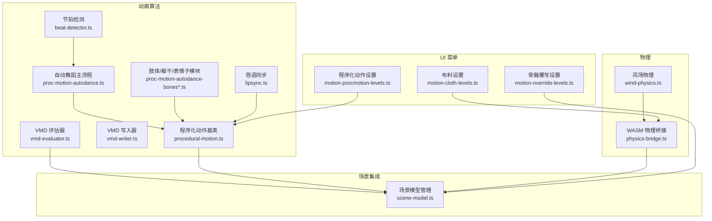
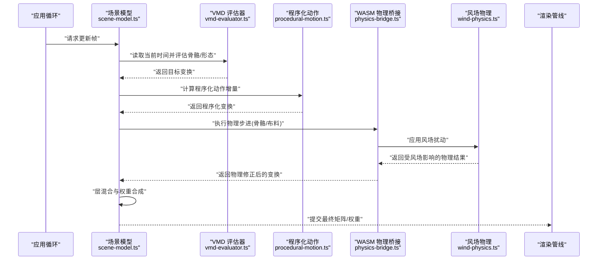
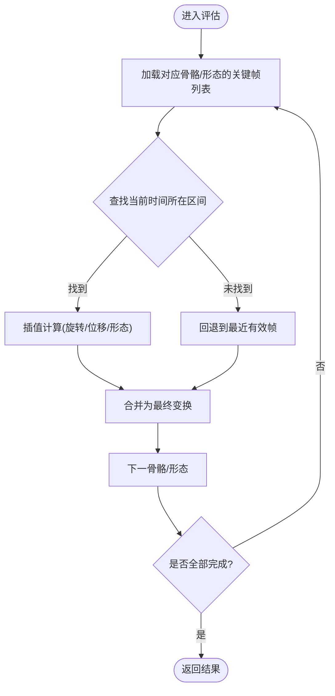
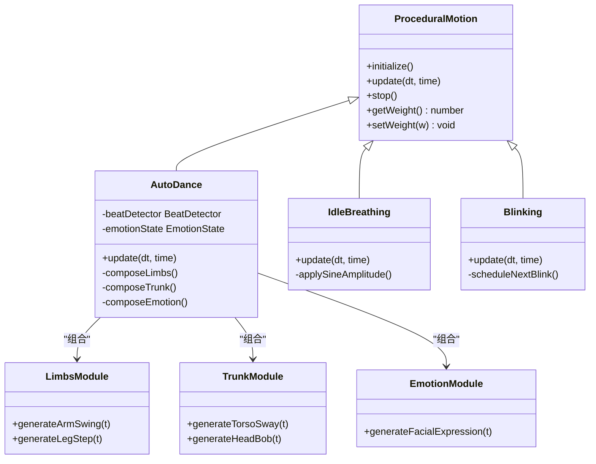
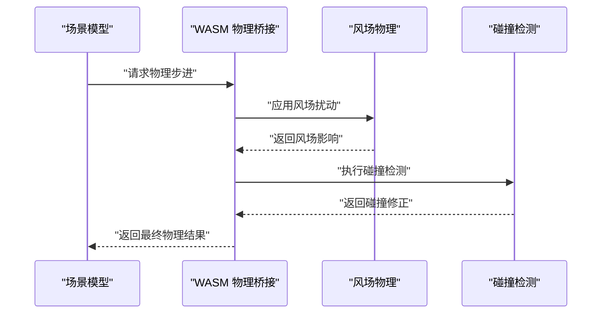
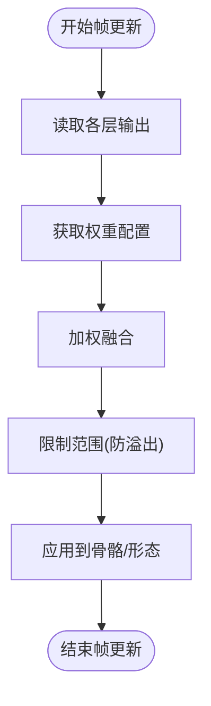
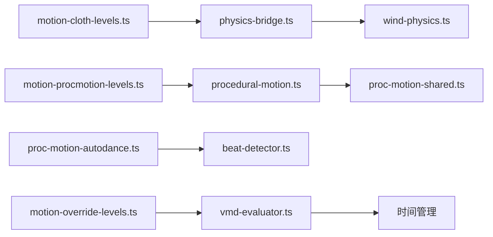

# 动画系统

<cite>
**本文引用的文件**   
- [vmd-evaluator.ts](file://frontend/src/motion-algos/vmd-evaluator.ts)
- [vmd-writer.ts](file://frontend/src/motion-algos/vmd-writer.ts)
- [procedural-motion.ts](file://frontend/src/motion-algos/procedural-motion.ts)
- [proc-motion-autodance.ts](file://frontend/src/motion-algos/proc-motion-autodance.ts)
- [proc-motion-idle.ts](file://frontend/src/motion-algos/proc-motion-idle.ts)
- [proc-motion-shared.ts](file://frontend/src/motion-algos/proc-motion-shared.ts)
- [proc-motion-autodance-bones.ts](file://frontend/src/motion-algos/proc-motion-autodance-bones.ts)
- [proc-motion-autodance-bones-limbs.ts](file://frontend/src/motion-algos/proc-motion-autodance-bones-limbs.ts)
- [proc-motion-autodance-bones-trunk.ts](file://frontend/src/motion-algos/proc-motion-autodance-bones-trunk.ts)
- [proc-motion-autodance-emotion.ts](file://frontend/src/motion-algos/proc-motion-autodance-emotion.ts)
- [beat-detector.ts](file://frontend/src/motion-algos/beat-detector.ts)
- [lipsync.ts](file://frontend/src/motion-algos/lipsync.ts)
- [physics-bridge.ts](file://frontend/src/physics/physics-bridge.ts)
- [wind-physics.ts](file://frontend/src/physics/wind-physics.ts)
- [motion-cloth-levels.ts](file://frontend/src/menus/motion-cloth-levels.ts)
- [motion-procmotion-levels.ts](file://frontend/src/menus/motion-procmotion-levels.ts)
- [motion-override-levels.ts](file://frontend/src/menus/motion-override-levels.ts)
- [scene-model.ts](file://frontend/src/scene/manager/scene-model.ts)
- [perception-breathing.test.ts](file://frontend/src/__tests__/perception-breathing.test.ts)
- [vmd-evaluator.test.ts](file://frontend/src/__tests__/vmd-evaluator.test.ts)
- [wasm-layers-blender.test.ts](file://frontend/src/__tests__/wasm-layers-blender.test.ts)
- [ADR-021-程序化动作.md](file://docs/adr/adr-021-procedural-motion.md)
- [ADR-056-WASM运行时与动作层.md](file://docs/adr/adr-056-wasm-runtime-motion-layers.md)
- [ADR-042-动作算法重命名.md](file://docs/adr/adr-042-motion-algos-rename.md)
- [buglog-VMD播放无反应.md](file://docs/buglog/VMD播放无反应.md)
</cite>

## 目录
1. [简介](#简介)
2. [项目结构](#项目结构)
3. [核心组件](#核心组件)
4. [架构总览](#架构总览)
5. [详细组件分析](#详细组件分析)
6. [依赖关系分析](#依赖关系分析)
7. [性能考量](#性能考量)
8. [故障排查指南](#故障排查指南)
9. [结论](#结论)
10. [附录](#附录)

## 简介
本文件系统性梳理 MikuMikuAR 的动画子系统，覆盖以下关键能力：
- VMD 动画格式的解析、回放与回写（含关键帧插值、骨骼变换计算）
- 动画混合与过渡（多层叠加、权重控制、实时调整）
- 程序化动画（自动舞蹈、呼吸、眨眼等 AI 驱动生成）
- 骨骼物理模拟（WASM 物理、布料物理、碰撞检测）
- 创作工具与自定义算法开发指南（含示例路径与优化建议）

## 项目结构
动画相关代码主要分布在以下模块：
- motion-algos：VMD 评估器、写入器、程序化动作算法、节拍检测、唇语同步
- physics：WASM 物理桥接、风场物理
- menus：运动面板菜单项（布料、程序化动作、覆写）
- scene/manager：场景模型集成（加载、更新、渲染前准备）
- __tests__：单元测试与回归测试（VMD、WASM 层、程序化动作）
- docs/adr：架构决策记录（程序化动作、WASM 运行时与动作层、算法重命名）

图表来源
- [vmd-evaluator.ts:1-200](file://frontend/src/motion-algos/vmd-evaluator.ts#L1-L200)
- [vmd-writer.ts:1-200](file://frontend/src/motion-algos/vmd-writer.ts#L1-L200)
- [procedural-motion.ts:1-200](file://frontend/src/motion-algos/procedural-motion.ts#L1-L200)
- [proc-motion-autodance.ts:1-200](file://frontend/src/motion-algos/proc-motion-autodance.ts#L1-L200)
- [proc-motion-autodance-bones.ts:1-200](file://frontend/src/motion-algos/proc-motion-autodance-bones.ts#L1-L200)
- [proc-motion-autodance-bones-limbs.ts:1-200](file://frontend/src/motion-algos/proc-motion-autodance-bones-limbs.ts#L1-L200)
- [proc-motion-autodance-bones-trunk.ts:1-200](file://frontend/src/motion-algos/proc-motion-autodance-bones-trunk.ts#L1-L200)
- [proc-motion-autodance-emotion.ts:1-200](file://frontend/src/motion-algos/proc-motion-autodance-emotion.ts#L1-L200)
- [beat-detector.ts:1-200](file://frontend/src/motion-algos/beat-detector.ts#L1-L200)
- [lipsync.ts:1-200](file://frontend/src/motion-algos/lipsync.ts#L1-L200)
- [physics-bridge.ts:1-200](file://frontend/src/physics/physics-bridge.ts#L1-L200)
- [wind-physics.ts:1-200](file://frontend/src/physics/wind-physics.ts#L1-L200)
- [motion-cloth-levels.ts:1-200](file://frontend/src/menus/motion-cloth-levels.ts#L1-L200)
- [motion-procmotion-levels.ts:1-200](file://frontend/src/menus/motion-procmotion-levels.ts#L1-L200)
- [motion-override-levels.ts:1-200](file://frontend/src/menus/motion-override-levels.ts#L1-L200)
- [scene-model.ts:1-200](file://frontend/src/scene/manager/scene-model.ts#L1-L200)

章节来源
- [vmd-evaluator.ts:1-200](file://frontend/src/motion-algos/vmd-evaluator.ts#L1-L200)
- [procedural-motion.ts:1-200](file://frontend/src/motion-algos/procedural-motion.ts#L1-L200)
- [physics-bridge.ts:1-200](file://frontend/src/physics/physics-bridge.ts#L1-L200)
- [motion-cloth-levels.ts:1-200](file://frontend/src/menus/motion-cloth-levels.ts#L1-L200)
- [motion-procmotion-levels.ts:1-200](file://frontend/src/menus/motion-procmotion-levels.ts#L1-L200)
- [motion-override-levels.ts:1-200](file://frontend/src/menus/motion-override-levels.ts#L1-L200)
- [scene-model.ts:1-200](file://frontend/src/scene/manager/scene-model.ts#L1-L200)

## 核心组件
- VMD 评估器：负责解析 VMD 关键帧数据，按时间采样并输出骨骼旋转/位移、形态变形等目标。支持多通道插值与批量批处理。
- VMD 写入器：将运行时生成的骨骼/形态变化序列序列化回 VMD 格式，便于导出或回放。
- 程序化动作框架：提供统一的动作生命周期接口，支持“自动舞蹈”、“待机呼吸”、“眨眼”等算法组合与切换。
- WASM 物理桥接：封装 WASM 物理引擎调用，提供骨骼/布料物理步进、风场影响、碰撞体交互。
- 风场物理：基于全局风场参数对布料/悬挂物施加扰动，增强动态效果。
- 菜单集成：为布料、程序化动作、骨骼覆写提供 UI 配置入口，支持运行时热调参。

章节来源
- [vmd-evaluator.ts:1-200](file://frontend/src/motion-algos/vmd-evaluator.ts#L1-L200)
- [vmd-writer.ts:1-200](file://frontend/src/motion-algos/vmd-writer.ts#L1-L200)
- [procedural-motion.ts:1-200](file://frontend/src/motion-algos/procedural-motion.ts#L1-L200)
- [physics-bridge.ts:1-200](file://frontend/src/physics/physics-bridge.ts#L1-L200)
- [wind-physics.ts:1-200](file://frontend/src/physics/wind-physics.ts#L1-L200)
- [motion-cloth-levels.ts:1-200](file://frontend/src/menus/motion-cloth-levels.ts#L1-L200)
- [motion-procmotion-levels.ts:1-200](file://frontend/src/menus/motion-procmotion-levels.ts#L1-L200)
- [motion-override-levels.ts:1-200](file://frontend/src/menus/motion-override-levels.ts#L1-L200)

## 架构总览
动画系统在每帧执行时，遵循如下流水线：
- 输入：VMD 关键帧、程序化动作状态、物理参数、用户输入
- 处理：VMD 评估 → 程序化动作生成 → 物理步进 → 层混合与权重合成
- 输出：最终骨骼矩阵/形态权重，提交给渲染管线

图表来源
- [scene-model.ts:1-200](file://frontend/src/scene/manager/scene-model.ts#L1-L200)
- [vmd-evaluator.ts:1-200](file://frontend/src/motion-algos/vmd-evaluator.ts#L1-L200)
- [procedural-motion.ts:1-200](file://frontend/src/motion-algos/procedural-motion.ts#L1-L200)
- [physics-bridge.ts:1-200](file://frontend/src/physics/physics-bridge.ts#L1-L200)
- [wind-physics.ts:1-200](file://frontend/src/physics/wind-physics.ts#L1-L200)

## 详细组件分析

### VMD 解析与回放
- 关键帧插值：根据时间戳在相邻关键帧之间进行线性/样条插值，确保平滑过渡。
- 骨骼变换计算：将旋转与位移分别插值后合并为最终矩阵；形态权重按时间曲线插值。
- 批量批处理：对大量骨骼/形态进行向量化批处理，减少函数调用开销。
- 错误边界：缺失关键帧或时间越界时回退到最近有效帧，避免崩溃。

图表来源
- [vmd-evaluator.ts:1-200](file://frontend/src/motion-algos/vmd-evaluator.ts#L1-L200)

章节来源
- [vmd-evaluator.ts:1-200](file://frontend/src/motion-algos/vmd-evaluator.ts#L1-L200)
- [vmd-evaluator.test.ts:1-200](file://frontend/src/__tests__/vmd-evaluator.test.ts#L1-L200)

### VMD 写入器
- 序列化：将运行时产生的骨骼/形态变化序列化为 VMD 标准格式。
- 压缩与去抖：去除冗余关键帧，降低文件大小。
- 校验：写入前后进行一致性校验，防止损坏。

章节来源
- [vmd-writer.ts:1-200](file://frontend/src/motion-algos/vmd-writer.ts#L1-L200)

### 程序化动画框架与自动舞蹈
- 统一接口：所有程序化动作实现相同生命周期（初始化、更新、停止）。
- 自动舞蹈：基于节拍检测与情绪状态，组合肢体/躯干/表情子模块生成连贯动作。
- 待机呼吸：低幅度正弦波叠加，模拟自然呼吸节奏。
- 眨眼动画：周期性眼睑闭合，结合随机间隔增加真实感。

图表来源
- [procedural-motion.ts:1-200](file://frontend/src/motion-algos/procedural-motion.ts#L1-L200)
- [proc-motion-autodance.ts:1-200](file://frontend/src/motion-algos/proc-motion-autodance.ts#L1-L200)
- [proc-motion-autodance-bones-limbs.ts:1-200](file://frontend/src/motion-algos/proc-motion-autodance-bones-limbs.ts#L1-L200)
- [proc-motion-autodance-bones-trunk.ts:1-200](file://frontend/src/motion-algos/proc-motion-autodance-bones-trunk.ts#L1-L200)
- [proc-motion-autodance-emotion.ts:1-200](file://frontend/src/motion-algos/proc-motion-autodance-emotion.ts#L1-L200)
- [proc-motion-idle.ts:1-200](file://frontend/src/motion-algos/proc-motion-idle.ts#L1-L200)
- [beat-detector.ts:1-200](file://frontend/src/motion-algos/beat-detector.ts#L1-L200)

章节来源
- [procedural-motion.ts:1-200](file://frontend/src/motion-algos/procedural-motion.ts#L1-L200)
- [proc-motion-autodance.ts:1-200](file://frontend/src/motion-algos/proc-motion-autodance.ts#L1-L200)
- [proc-motion-autodance-bones.ts:1-200](file://frontend/src/motion-algos/proc-motion-autodance-bones.ts#L1-L200)
- [proc-motion-autodance-bones-limbs.ts:1-200](file://frontend/src/motion-algos/proc-motion-autodance-bones-limbs.ts#L1-L200)
- [proc-motion-autodance-bones-trunk.ts:1-200](file://frontend/src/motion-algos/proc-motion-autodance-bones-trunk.ts#L1-L200)
- [proc-motion-autodance-emotion.ts:1-200](file://frontend/src/motion-algos/proc-motion-autodance-emotion.ts#L1-L200)
- [proc-motion-idle.ts:1-200](file://frontend/src/motion-algos/proc-motion-idle.ts#L1-L200)
- [proc-motion-shared.ts:1-200](file://frontend/src/motion-algos/proc-motion-shared.ts#L1-L200)
- [beat-detector.ts:1-200](file://frontend/src/motion-algos/beat-detector.ts#L1-L200)
- [perception-breathing.test.ts:1-200](file://frontend/src/__tests__/perception-breathing.test.ts#L1-L200)

### 骨骼物理与布料物理（WASM）
- WASM 物理桥接：封装 WASM 模块调用，提供物理步进、约束求解、碰撞检测。
- 风场物理：将风场向量作用于布料节点，产生飘动效果。
- 碰撞体：为关键部位添加简单碰撞体，避免穿透。

图表来源
- [physics-bridge.ts:1-200](file://frontend/src/physics/physics-bridge.ts#L1-L200)
- [wind-physics.ts:1-200](file://frontend/src/physics/wind-physics.ts#L1-L200)

章节来源
- [physics-bridge.ts:1-200](file://frontend/src/physics/physics-bridge.ts#L1-L200)
- [wind-physics.ts:1-200](file://frontend/src/physics/wind-physics.ts#L1-L200)
- [motion-cloth-levels.ts:1-200](file://frontend/src/menus/motion-cloth-levels.ts#L1-L200)

### 动画层叠加与权重控制
- 层定义：VMD 层、程序化动作层、物理修正层、骨骼覆写层。
- 权重合成：按优先级与权重系数对各层输出进行加权融合。
- 实时调整：通过菜单或 API 动态修改权重，无需重启。

图表来源
- [motion-override-levels.ts:1-200](file://frontend/src/menus/motion-override-levels.ts#L1-L200)
- [motion-procmotion-levels.ts:1-200](file://frontend/src/menus/motion-procmotion-levels.ts#L1-L200)
- [motion-cloth-levels.ts:1-200](file://frontend/src/menus/motion-cloth-levels.ts#L1-L200)

章节来源
- [motion-override-levels.ts:1-200](file://frontend/src/menus/motion-override-levels.ts#L1-L200)
- [motion-procmotion-levels.ts:1-200](file://frontend/src/menus/motion-procmotion-levels.ts#L1-L200)
- [motion-cloth-levels.ts:1-200](file://frontend/src/menus/motion-cloth-levels.ts#L1-L200)

### 唇语同步
- 音素映射：将音频特征映射到口型形状。
- 平滑过渡：使用缓动函数避免突变。
- 与程序化动作协同：在自动舞蹈中保持自然口型。

章节来源
- [lipsync.ts:1-200](file://frontend/src/motion-algos/lipsync.ts#L1-L200)

## 依赖关系分析
- 内部依赖：
  - VMD 评估器依赖时间管理与内存池（用于批处理）
  - 程序化动作依赖节拍检测与共享数学库
  - WASM 物理桥接依赖风场物理与碰撞检测
- 外部依赖：
  - WASM 模块（物理引擎）
  - 音频库（用于节拍检测与唇语）

图表来源
- [vmd-evaluator.ts:1-200](file://frontend/src/motion-algos/vmd-evaluator.ts#L1-L200)
- [procedural-motion.ts:1-200](file://frontend/src/motion-algos/procedural-motion.ts#L1-L200)
- [proc-motion-autodance.ts:1-200](file://frontend/src/motion-algos/proc-motion-autodance.ts#L1-L200)
- [beat-detector.ts:1-200](file://frontend/src/motion-algos/beat-detector.ts#L1-L200)
- [physics-bridge.ts:1-200](file://frontend/src/physics/physics-bridge.ts#L1-L200)
- [wind-physics.ts:1-200](file://frontend/src/physics/wind-physics.ts#L1-L200)
- [motion-cloth-levels.ts:1-200](file://frontend/src/menus/motion-cloth-levels.ts#L1-L200)
- [motion-procmotion-levels.ts:1-200](file://frontend/src/menus/motion-procmotion-levels.ts#L1-L200)
- [motion-override-levels.ts:1-200](file://frontend/src/menus/motion-override-levels.ts#L1-L200)

章节来源
- [vmd-evaluator.ts:1-200](file://frontend/src/motion-algos/vmd-evaluator.ts#L1-L200)
- [procedural-motion.ts:1-200](file://frontend/src/motion-algos/procedural-motion.ts#L1-L200)
- [physics-bridge.ts:1-200](file://frontend/src/physics/physics-bridge.ts#L1-L200)
- [motion-cloth-levels.ts:1-200](file://frontend/src/menus/motion-cloth-levels.ts#L1-L200)
- [motion-procmotion-levels.ts:1-200](file://frontend/src/menus/motion-procmotion-levels.ts#L1-L200)
- [motion-override-levels.ts:1-200](file://frontend/src/menus/motion-override-levels.ts#L1-L200)

## 性能考量
- 批处理与向量化：对骨骼/形态评估采用批量操作，减少 JS/WASM 边界调用次数。
- 缓存与复用：重用中间缓冲区，避免频繁分配内存。
- 自适应步长：根据设备性能动态调整物理步长与采样率。
- 延迟加载：按需加载程序化动作模块，降低初始负载。
- 监控与降级：在性能瓶颈时自动关闭高成本特性（如高精度风场）。

[本节为通用指导，不直接分析具体文件]

## 故障排查指南
- VMD 播放无反应：检查关键帧时间戳是否连续、是否存在无效路径或空数据。
- WASM 模块加载失败：确认 index_bg.wasm 等资源路径正确且可访问。
- 两套物理引擎并存导致性能差：统一物理后端，移除冗余实现。
- 程序化动作无效：确认动作层已启用且权重非零，检查骨骼名称匹配。

章节来源
- [buglog-VMD播放无反应.md:1-200](file://docs/buglog/VMD播放无反应.md#L1-L200)

## 结论
本动画系统以 VMD 为核心数据载体，结合程序化动作与 WASM 物理，实现了从解析、生成到演算的完整闭环。通过分层叠加与权重控制，系统具备高度的可扩展性与实时可调性。未来可在物理精度、AI 行为多样性与跨平台性能方面持续优化。

## 附录

### 开发指南：自定义程序化动作
- 步骤：
  1. 继承程序化动作基类，实现 update 生命周期。
  2. 在 auto-dance 组合模块中注册新动作。
  3. 通过菜单或 API 暴露权重控制。
- 参考路径：
  - [procedural-motion.ts:1-200](file://frontend/src/motion-algos/procedural-motion.ts#L1-L200)
  - [proc-motion-autodance.ts:1-200](file://frontend/src/motion-algos/proc-motion-autodance.ts#L1-L200)
  - [motion-procmotion-levels.ts:1-200](file://frontend/src/menus/motion-procmotion-levels.ts#L1-L200)

### 开发指南：扩展 VMD 评估器
- 步骤：
  1. 新增骨骼/形态类型支持。
  2. 实现插值策略与批处理逻辑。
  3. 编写单元测试验证边界条件。
- 参考路径：
  - [vmd-evaluator.ts:1-200](file://frontend/src/motion-algos/vmd-evaluator.ts#L1-L200)
  - [vmd-evaluator.test.ts:1-200](file://frontend/src/__tests__/vmd-evaluator.test.ts#L1-L200)

### 开发指南：接入 WASM 物理
- 步骤：
  1. 在物理桥接中注册新的物理对象类型。
  2. 实现风场/碰撞回调。
  3. 通过布料菜单暴露参数。
- 参考路径：
  - [physics-bridge.ts:1-200](file://frontend/src/physics/physics-bridge.ts#L1-L200)
  - [wind-physics.ts:1-200](file://frontend/src/physics/wind-physics.ts#L1-L200)
  - [motion-cloth-levels.ts:1-200](file://frontend/src/menus/motion-cloth-levels.ts#L1-L200)

### 架构决策参考
- 程序化动作设计原则与演进
- WASM 运行时与动作层整合方案
- 动作算法模块重命名与组织

章节来源
- [ADR-021-程序化动作.md:1-200](file://docs/adr/adr-021-procedural-motion.md#L1-L200)
- [ADR-056-WASM运行时与动作层.md:1-200](file://docs/adr/adr-056-wasm-runtime-motion-layers.md#L1-L200)
- [ADR-042-动作算法重命名.md:1-200](file://docs/adr/adr-042-motion-algos-rename.md#L1-L200)