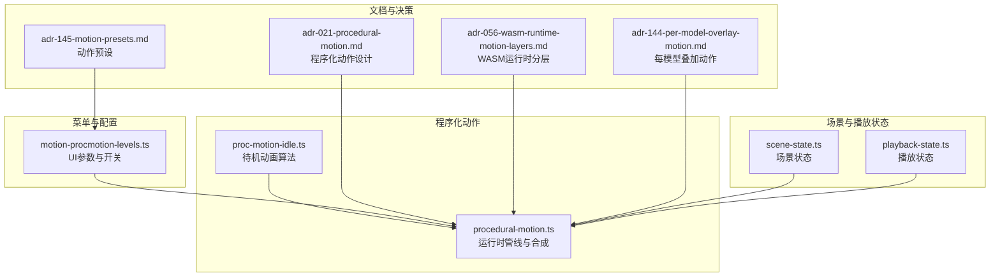
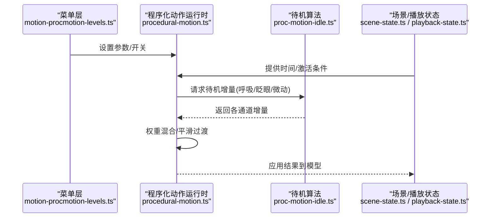
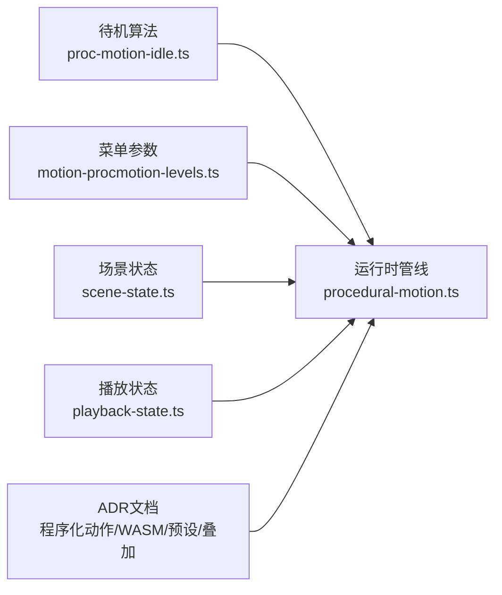

# 待机动画系统

<cite>
**本文引用的文件**   
- [proc-motion-idle.ts](file://frontend/src/motion-algos/proc-motion-idle.ts)
- [procedural-motion.ts](file://frontend/src/motion-algos/procedural-motion.ts)
- [perception-breathing.test.ts](file://frontend/src/__tests__/perception-breathing.test.ts)
- [motion-procmotion-levels.ts](file://frontend/src/menus/motion-procmotion-levels.ts)
- [adr-021-procedural-motion.md](file://docs/adr/adr-021-procedural-motion.md)
- [adr-056-wasm-runtime-motion-layers.md](file://docs/adr/adr-056-wasm-runtime-motion-layers.md)
- [adr-145-motion-presets.md](file://docs/adr/adr-145-motion-presets.md)
- [adr-144-per-model-overlay-motion.md](file://docs/adr/adr-144-per-model-overlay-motion.md)
- [scene-state.ts](file://frontend/src/core/scene-state.ts)
- [playback-state.ts](file://frontend/src/core/playback-state.ts)
</cite>

## 目录
1. [简介](#简介)
2. [项目结构](#项目结构)
3. [核心组件](#核心组件)
4. [架构总览](#架构总览)
5. [详细组件分析](#详细组件分析)
6. [依赖关系分析](#依赖关系分析)
7. [性能考虑](#性能考虑)
8. [故障排查指南](#故障排查指南)
9. [结论](#结论)
10. [附录](#附录)

## 简介
本文件面向“待机动画系统”的实现与使用，聚焦自然待机动画的生成算法、状态管理、感知驱动行为以及参数调节方法。内容覆盖：
- 基础循环动画：呼吸、眨眼、身体微动等
- 待机状态管理：切换条件、过渡效果、持续时间控制
- 感知驱动行为：视线追踪对头部朝向的影响、环境感知对姿态调整的作用
- 参数调节：强度、频率、个性化定制
- 扩展指南：如何新增待机动画并集成感知系统

## 项目结构
待机动画系统位于前端程序化动作（Procedural Motion）子系统中，核心实现集中在 motion-algos 目录，并通过菜单层暴露可调参数；测试用例验证呼吸等感知驱动的待机行为。

图表来源
- [proc-motion-idle.ts](file://frontend/src/motion-algos/proc-motion-idle.ts)
- [procedural-motion.ts](file://frontend/src/motion-algos/procedural-motion.ts)
- [motion-procmotion-levels.ts](file://frontend/src/menus/motion-procmotion-levels.ts)
- [adr-021-procedural-motion.md](file://docs/adr/adr-021-procedural-motion.md)
- [adr-056-wasm-runtime-motion-layers.md](file://docs/adr/adr-056-wasm-runtime-motion-layers.md)
- [adr-145-motion-presets.md](file://docs/adr/adr-145-motion-presets.md)
- [adr-144-per-model-overlay-motion.md](file://docs/adr/adr-144-per-model-overlay-motion.md)
- [scene-state.ts](file://frontend/src/core/scene-state.ts)
- [playback-state.ts](file://frontend/src/core/playback-state.ts)

章节来源
- [proc-motion-idle.ts](file://frontend/src/motion-algos/proc-motion-idle.ts)
- [procedural-motion.ts](file://frontend/src/motion-algos/procedural-motion.ts)
- [motion-procmotion-levels.ts](file://frontend/src/menus/motion-procmotion-levels.ts)
- [adr-021-procedural-motion.md](file://docs/adr/adr-021-procedural-motion.md)
- [adr-056-wasm-runtime-motion-layers.md](file://docs/adr/adr-056-wasm-runtime-motion-layers.md)
- [adr-145-motion-presets.md](file://docs/adr/adr-145-motion-presets.md)
- [adr-144-per-model-overlay-motion.md](file://docs/adr/adr-144-per-model-overlay-motion.md)
- [scene-state.ts](file://frontend/src/core/scene-state.ts)
- [playback-state.ts](file://frontend/src/core/playback-state.ts)

## 核心组件
- 待机动画算法模块：提供呼吸、眨眼、身体微动等基础循环动画的生成逻辑，输出骨骼或变换增量，供运行时合成。
- 程序化动作运行时：负责将多路程序化动作按权重与优先级进行混合，应用至目标模型的骨骼或变换。
- 菜单与参数层：暴露强度、频率、个性化选项等参数，支持在运行时动态调节。
- 状态与上下文：场景与播放状态为待机动画提供时间基准、激活条件与生命周期管理。

章节来源
- [proc-motion-idle.ts](file://frontend/src/motion-algos/proc-motion-idle.ts)
- [procedural-motion.ts](file://frontend/src/motion-algos/procedural-motion.ts)
- [motion-procmotion-levels.ts](file://frontend/src/menus/motion-procmotion-levels.ts)
- [scene-state.ts](file://frontend/src/core/scene-state.ts)
- [playback-state.ts](file://frontend/src/core/playback-state.ts)

## 架构总览
待机动画系统采用“算法 + 运行时管线 + UI参数 + 状态上下文”的分层架构。算法层产出增量，运行时层负责混合与应用，UI层提供可观测可调的参数，状态层决定何时启用与切换。

图表来源
- [motion-procmotion-levels.ts](file://frontend/src/menus/motion-procmotion-levels.ts)
- [procedural-motion.ts](file://frontend/src/motion-algos/procedural-motion.ts)
- [proc-motion-idle.ts](file://frontend/src/motion-algos/proc-motion-idle.ts)
- [scene-state.ts](file://frontend/src/core/scene-state.ts)
- [playback-state.ts](file://frontend/src/core/playback-state.ts)

## 详细组件分析

### 待机算法：呼吸、眨眼、身体微动
- 呼吸效果：基于正弦或类正弦曲线，以较低频率驱动胸腔/肩部的缩放或位移，形成自然的起伏节奏。
- 眨眼动画：周期性闭合与开启，通常通过眼睑或眼部相关骨骼的旋转/形变实现，具备随机间隔以避免机械感。
- 身体微动：小幅度重心偏移与关节微调，增加“活体感”，避免完全静止。

这些算法共同构成待机动画的基础循环，输出为骨骼或变换增量，供运行时混合。

章节来源
- [proc-motion-idle.ts](file://frontend/src/motion-algos/proc-motion-idle.ts)

### 运行时管线：混合与过渡
- 多路叠加：将呼吸、眨眼、微动等多路增量按权重叠加，支持独立开关与强度控制。
- 平滑过渡：对权重变化与参数切换引入插值，避免突变。
- 时间同步：依据全局时间或局部节拍，确保不同动画的频率协调一致。

章节来源
- [procedural-motion.ts](file://frontend/src/motion-algos/procedural-motion.ts)

### 菜单与参数：强度、频率、个性化
- 强度控制：针对呼吸、眨眼、微动分别提供强度滑块，便于用户按需调节。
- 频率控制：调整呼吸周期、眨眼间隔等，影响动画节奏。
- 个性化选项：如是否启用随机抖动、微动范围限制等，提升多样性。

章节来源
- [motion-procmotion-levels.ts](file://frontend/src/menus/motion-procmotion-levels.ts)

### 状态管理：切换条件、过渡与持续时间
- 激活条件：当无主动作播放且满足特定场景状态时进入待机。
- 过渡效果：从其他动作切换到待机时，通过权重渐变实现平滑过渡。
- 持续时间控制：待机可无限持续，也可受外部事件打断。

章节来源
- [scene-state.ts](file://frontend/src/core/scene-state.ts)
- [playback-state.ts](file://frontend/src/core/playback-state.ts)

### 感知驱动：视线追踪与环境感知
- 视线追踪：根据摄像头或输入设备提供的注视方向，驱动头部朝向与眼球转动，增强交互真实感。
- 环境感知：结合光照、风向、地面碰撞等信息，对姿态与微动进行自适应调整，使角色更贴合环境。

章节来源
- [perception-breathing.test.ts](file://frontend/src/__tests__/perception-breathing.test.ts)

### 设计与决策参考
- 程序化动作总体设计：涵盖分层、模块化与可扩展性原则。
- WASM运行时分层：明确动作计算与渲染分离，提高性能与可移植性。
- 动作预设与每模型叠加：支持快速配置与差异化表现。

章节来源
- [adr-021-procedural-motion.md](file://docs/adr/adr-021-procedural-motion.md)
- [adr-056-wasm-runtime-motion-layers.md](file://docs/adr/adr-056-wasm-runtime-motion-layers.md)
- [adr-145-motion-presets.md](file://docs/adr/adr-145-motion-presets.md)
- [adr-144-per-model-overlay-motion.md](file://docs/adr/adr-144-per-model-overlay-motion.md)

## 依赖关系分析
待机动画系统的依赖关系如下：
- 算法层依赖运行时管线进行混合与应用
- 菜单层向运行时注入参数与开关
- 状态层提供时间与激活条件
- 文档与决策指导架构演进与最佳实践

图表来源
- [proc-motion-idle.ts](file://frontend/src/motion-algos/proc-motion-idle.ts)
- [procedural-motion.ts](file://frontend/src/motion-algos/procedural-motion.ts)
- [motion-procmotion-levels.ts](file://frontend/src/menus/motion-procmotion-levels.ts)
- [scene-state.ts](file://frontend/src/core/scene-state.ts)
- [playback-state.ts](file://frontend/src/core/playback-state.ts)
- [adr-021-procedural-motion.md](file://docs/adr/adr-021-procedural-motion.md)
- [adr-056-wasm-runtime-motion-layers.md](file://docs/adr/adr-056-wasm-runtime-motion-layers.md)
- [adr-145-motion-presets.md](file://docs/adr/adr-145-motion-presets.md)
- [adr-144-per-model-overlay-motion.md](file://docs/adr/adr-144-per-model-overlay-motion.md)

章节来源
- [proc-motion-idle.ts](file://frontend/src/motion-algos/proc-motion-idle.ts)
- [procedural-motion.ts](file://frontend/src/motion-algos/procedural-motion.ts)
- [motion-procmotion-levels.ts](file://frontend/src/menus/motion-procmotion-levels.ts)
- [scene-state.ts](file://frontend/src/core/scene-state.ts)
- [playback-state.ts](file://frontend/src/core/playback-state.ts)
- [adr-021-procedural-motion.md](file://docs/adr/adr-021-procedural-motion.md)
- [adr-056-wasm-runtime-motion-layers.md](file://docs/adr/adr-056-wasm-runtime-motion-layers.md)
- [adr-145-motion-presets.md](file://docs/adr/adr-145-motion-presets.md)
- [adr-144-per-model-overlay-motion.md](file://docs/adr/adr-144-per-model-overlay-motion.md)

## 性能考虑
- 算法复杂度：待机动画多为低阶三角函数与线性插值，计算开销较小，适合高频更新。
- 混合策略：合理设置权重与过渡时长，避免频繁重算导致的抖动。
- 分层执行：利用WASM运行时分层，将动作计算与渲染解耦，降低主线程压力。
- 资源复用：共享时间源与噪声种子，减少重复计算与内存分配。

[本节为通用性能建议，不直接分析具体文件]

## 故障排查指南
- 待机未生效：检查场景与播放状态是否正确触发待机条件，确认菜单开关与强度参数。
- 动画突兀：查看过渡权重与插值设置，确保切换平滑。
- 呼吸异常：核对频率与强度参数，必要时参考呼吸测试用例定位问题。
- 视线追踪无效：确认感知数据源可用，检查头部朝向映射与权重。

章节来源
- [perception-breathing.test.ts](file://frontend/src/__tests__/perception-breathing.test.ts)
- [motion-procmotion-levels.ts](file://frontend/src/menus/motion-procmotion-levels.ts)
- [scene-state.ts](file://frontend/src/core/scene-state.ts)
- [playback-state.ts](file://frontend/src/core/playback-state.ts)

## 结论
待机动画系统通过模块化算法与灵活的运行时管线，实现了自然、可控且可感知的待机表现。借助菜单参数与状态管理，开发者与用户可以轻松调节强度、频率与个性化选项，并在需要时扩展新的待机效果。

[本节为总结性内容，不直接分析具体文件]

## 附录

### 参数调节指南
- 强度控制：分别调节呼吸、眨眼、微动的强度，以获得更自然或更夸张的效果。
- 频率控制：调整呼吸周期与眨眼间隔，匹配角色性格或场景氛围。
- 个性化选项：启用随机抖动、限制微动范围，提升多样性与稳定性。

章节来源
- [motion-procmotion-levels.ts](file://frontend/src/menus/motion-procmotion-levels.ts)

### 新增待机动画与集成感知系统
- 新增待机效果：在待机算法模块中定义新的增量生成逻辑，遵循现有接口约定，输出骨骼或变换增量。
- 接入运行时：在运行时管线中注册新通道，设置默认权重与过渡策略。
- 暴露参数：在菜单层添加对应参数项，支持运行时调节。
- 集成感知：读取感知数据（如视线方向），将其映射到头部或眼部骨骼，参与混合计算。

章节来源
- [proc-motion-idle.ts](file://frontend/src/motion-algos/proc-motion-idle.ts)
- [procedural-motion.ts](file://frontend/src/motion-algos/procedural-motion.ts)
- [motion-procmotion-levels.ts](file://frontend/src/menus/motion-procmotion-levels.ts)
- [perception-breathing.test.ts](file://frontend/src/__tests__/perception-breathing.test.ts)