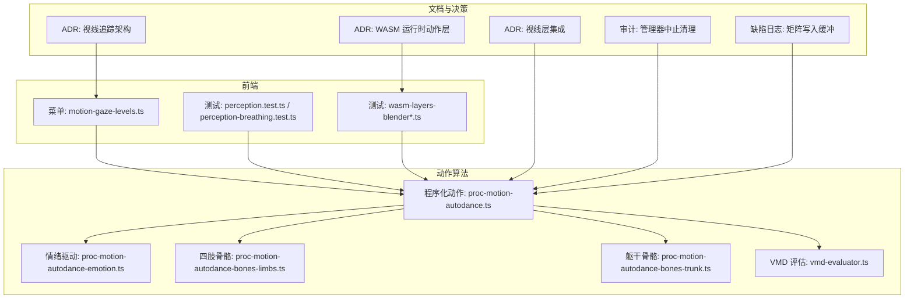
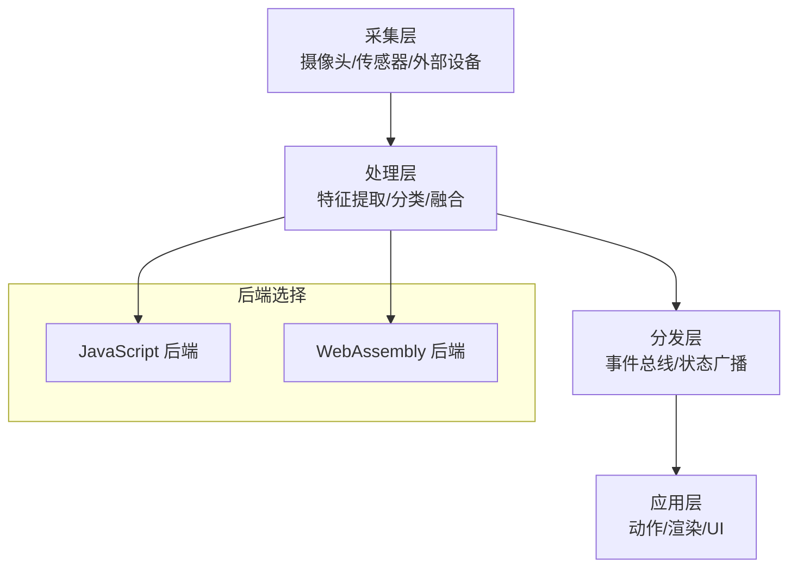
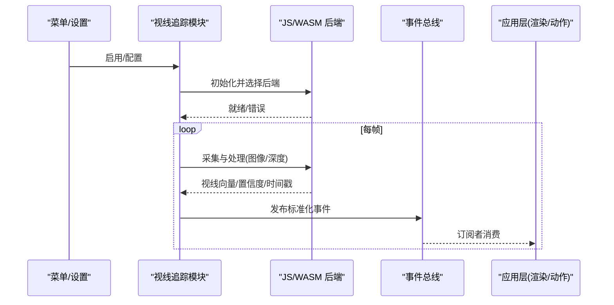
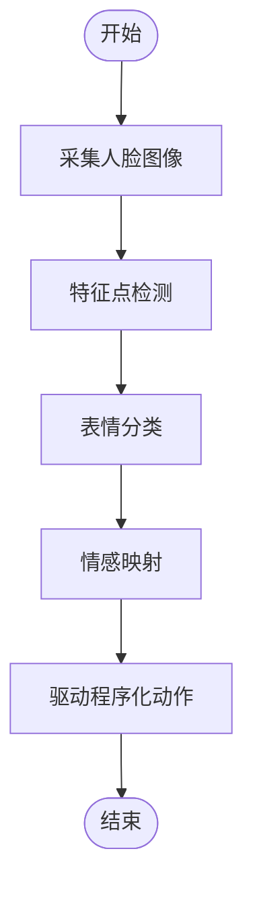
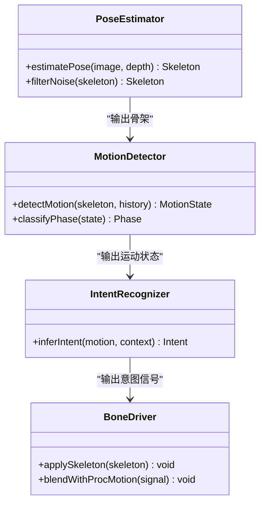
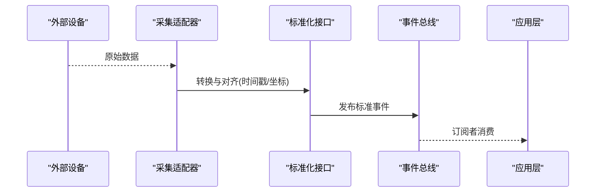
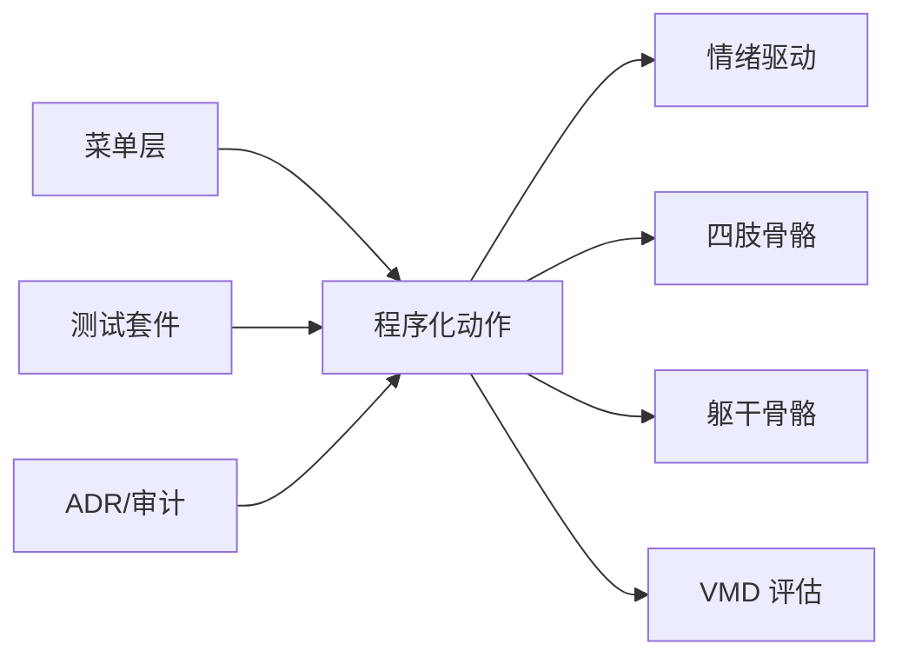

# 感知系统集成

<cite>
**本文引用的文件**   
- [adr-016-gaze-tracking-architecture.md](file://docs/adr/adr-016-gaze-tracking-architecture.md)
- [adr-053-gaze-layer-integration.md](file://docs/adr/adr-053-gaze-layer-integration.md)
- [adr-056-wasm-runtime-motion-layers.md](file://docs/adr/adr-056-wasm-runtime-motion-layers.md)
- [adr-087-plaza-browser-experience.md](file://docs/adr/adr-087-plaza-browser-experience.md)
- [adr-109-ar-audit-resolution-and-deferral.md](file://docs/adr/adr-109-ar-audit-resolution-and-deferral.md)
- [2026-07-16-outfit-audit-mesh-leak.md](file://docs/audit/2026-07-16-outfit-audit-mesh-leak.md)
- [2026-07-16-manager-audit-abort-cleanup.md](file://docs/audit/2026-07-16-manager-audit-abort-cleanup.md)
- [2026-07-11-perception-writeMatToBuffer.md](file://docs/buglog/2026-07-11-perception-writeMatToBuffer.md)
- [perception.test.ts](file://frontend/src/__tests__/perception.test.ts)
- [perception-breathing.test.ts](file://frontend/src/__tests__/perception-breathing.test.ts)
- [motion-gaze-levels.ts](file://frontend/src/menus/motion-gaze-levels.ts)
- [proc-motion-autodance-emotion.ts](file://frontend/src/motion-algos/proc-motion-autodance-emotion.ts)
- [proc-motion-autodance-bones-limbs.ts](file://frontend/src/motion-algos/proc-motion-autodance-bones-limbs.ts)
- [proc-motion-autodance-bones-trunk.ts](file://frontend/src/motion-algos/proc-motion-autodance-bones-trunk.ts)
- [proc-motion-autodance.ts](file://frontend/src/motion-algos/proc-motion-autodance.ts)
- [vmd-evaluator.ts](file://frontend/src/motion-algos/vmd-evaluator.ts)
- [wasm-layers-blender.test.ts](file://frontend/src/__tests__/wasm-layers-blender.test.ts)
- [wasm-layers-blender.perf.test.ts](file://frontend/src/__tests__/wasm-layers-blender.perf.test.ts)
</cite>

## 目录
1. [简介](#简介)
2. [项目结构](#项目结构)
3. [核心组件](#核心组件)
4. [架构总览](#架构总览)
5. [详细组件分析](#详细组件分析)
6. [依赖分析](#依赖分析)
7. [性能考虑](#性能考虑)
8. [故障排查指南](#故障排查指南)
9. [结论](#结论)
10. [附录](#附录)

## 简介
本文件面向“感知系统”的集成与使用，聚焦以下目标：
- 数据收集、处理与分发机制的整体设计
- 视线追踪功能的实现路径与后端选择策略（JavaScript 与 WebAssembly）
- 表情识别算法的关键流程（面部特征点检测、表情分类、情感映射）
- 肢体状态感知（姿势估计、运动检测、意图识别）
- 感知数据的标准化接口（数据格式、时间戳同步、精度控制）
- 外部感知设备接入与数据流处理的集成示例

为保证可追溯性，文档在涉及具体代码或决策时提供“章节来源”，并在可视化图中给出“图示来源”。

## 项目结构
感知相关能力主要分布在以下位置：
- 前端菜单层：用于暴露感知开关与参数（如视线追踪层级配置）
- 动作算法层：程序化动作与情绪驱动、肢体骨骼联动等
- 测试用例：覆盖感知模块行为、呼吸模拟、WASM 层性能与正确性
- ADR 与审计文档：记录视线追踪架构、AR 分辨率与延迟优化、WASM 运行时分层等关键决策

**图示来源**
- [motion-gaze-levels.ts](file://frontend/src/menus/motion-gaze-levels.ts)
- [proc-motion-autodance.ts](file://frontend/src/motion-algos/proc-motion-autodance.ts)
- [proc-motion-autodance-emotion.ts](file://frontend/src/motion-algos/proc-motion-autodance-emotion.ts)
- [proc-motion-autodance-bones-limbs.ts](file://frontend/src/motion-algos/proc-motion-autodance-bones-limbs.ts)
- [proc-motion-autodance-bones-trunk.ts](file://frontend/src/motion-algos/proc-motion-autodance-bones-trunk.ts)
- [vmd-evaluator.ts](file://frontend/src/motion-algos/vmd-evaluator.ts)
- [perception.test.ts](file://frontend/src/__tests__/perception.test.ts)
- [perception-breathing.test.ts](file://frontend/src/__tests__/perception-breathing.test.ts)
- [wasm-layers-blender.test.ts](file://frontend/src/__tests__/wasm-layers-blender.test.ts)
- [wasm-layers-blender.perf.test.ts](file://frontend/src/__tests__/wasm-layers-blender.perf.test.ts)
- [adr-016-gaze-tracking-architecture.md](file://docs/adr/adr-016-gaze-tracking-architecture.md)
- [adr-053-gaze-layer-integration.md](file://docs/adr/adr-053-gaze-layer-integration.md)
- [adr-056-wasm-runtime-motion-layers.md](file://docs/adr/adr-056-wasm-runtime-motion-layers.md)
- [2026-07-16-manager-audit-abort-cleanup.md](file://docs/audit/2026-07-16-manager-audit-abort-cleanup.md)
- [2026-07-11-perception-writeMatToBuffer.md](file://docs/buglog/2026-07-11-perception-writeMatToBuffer.md)

**章节来源**
- [adr-016-gaze-tracking-architecture.md](file://docs/adr/adr-016-gaze-tracking-architecture.md)
- [adr-053-gaze-layer-integration.md](file://docs/adr/adr-053-gaze-layer-integration.md)
- [adr-056-wasm-runtime-motion-layers.md](file://docs/adr/adr-056-wasm-runtime-motion-layers.md)
- [motion-gaze-levels.ts](file://frontend/src/menus/motion-gaze-levels.ts)
- [proc-motion-autodance.ts](file://frontend/src/motion-algos/proc-motion-autodance.ts)
- [proc-motion-autodance-emotion.ts](file://frontend/src/motion-algos/proc-motion-autodance-emotion.ts)
- [proc-motion-autodance-bones-limbs.ts](file://frontend/src/motion-algos/proc-motion-autodance-bones-limbs.ts)
- [proc-motion-autodance-bones-trunk.ts](file://frontend/src/motion-algos/proc-motion-autodance-bones-trunk.ts)
- [vmd-evaluator.ts](file://frontend/src/motion-algos/vmd-evaluator.ts)
- [perception.test.ts](file://frontend/src/__tests__/perception.test.ts)
- [perception-breathing.test.ts](file://frontend/src/__tests__/perception-breathing.test.ts)
- [wasm-layers-blender.test.ts](file://frontend/src/__tests__/wasm-layers-blender.test.ts)
- [wasm-layers-blender.perf.test.ts](file://frontend/src/__tests__/wasm-layers-blender.perf.test.ts)

## 核心组件
- 菜单与配置入口
  - 通过菜单层级暴露感知能力开关与参数，便于用户快速启用/调整视线追踪等特性。
- 程序化动作与情绪驱动
  - 以情绪为输入，驱动四肢与躯干骨骼的联动，形成自然的微动作与姿态变化。
- 测试与验证
  - 针对感知模块的行为、呼吸模拟、WASM 层性能与稳定性进行回归与基准测试。
- 架构决策与审计
  - 通过 ADR 明确视线追踪架构、WASM 运行时分层；通过审计与缺陷日志指导问题定位与修复。

**章节来源**
- [motion-gaze-levels.ts](file://frontend/src/menus/motion-gaze-levels.ts)
- [proc-motion-autodance.ts](file://frontend/src/motion-algos/proc-motion-autodance.ts)
- [proc-motion-autodance-emotion.ts](file://frontend/src/motion-algos/proc-motion-autodance-emotion.ts)
- [proc-motion-autodance-bones-limbs.ts](file://frontend/src/motion-algos/proc-motion-autodance-bones-limbs.ts)
- [proc-motion-autodance-bones-trunk.ts](file://frontend/src/motion-algos/proc-motion-autodance-bones-trunk.ts)
- [perception.test.ts](file://frontend/src/__tests__/perception.test.ts)
- [perception-breathing.test.ts](file://frontend/src/__tests__/perception-breathing.test.ts)
- [wasm-layers-blender.test.ts](file://frontend/src/__tests__/wasm-layers-blender.test.ts)
- [wasm-layers-blender.perf.test.ts](file://frontend/src/__tests__/wasm-layers-blender.perf.test.ts)
- [adr-016-gaze-tracking-architecture.md](file://docs/adr/adr-016-gaze-tracking-architecture.md)
- [adr-053-gaze-layer-integration.md](file://docs/adr/adr-053-gaze-layer-integration.md)
- [adr-056-wasm-runtime-motion-layers.md](file://docs/adr/adr-056-wasm-runtime-motion-layers.md)

## 架构总览
感知系统采用“采集—处理—分发—应用”的分层架构：
- 采集层：负责从摄像头、传感器或外部设备获取原始数据（图像、深度、IMU 等），并进行初步清洗与对齐。
- 处理层：执行特征提取（如面部关键点、人体骨架）、分类与融合（表情、姿态、情绪）。
- 分发层：将标准化后的感知事件与状态广播至动作系统与渲染管线。
- 应用层：基于感知结果驱动角色动画、UI 反馈与环境交互。

[此图为概念性架构图，不直接映射具体源码文件]

## 详细组件分析

### 视线追踪子系统
- 架构决策
  - 通过 ADR 明确视线追踪的架构边界、数据流向与集成点，确保与渲染层和动作层的解耦。
  - 引入“视线层”的概念，将视线向量、注视点与置信度作为统一输出，供上层消费。
- 后端差异与选择策略
  - JavaScript 后端：适合快速迭代与调试，易于集成浏览器 API，但在复杂计算场景下性能受限。
  - WebAssembly 后端：适合高吞吐与低延迟的计算密集型任务（如关键点检测、姿态估计），需关注加载与初始化开销。
  - 选择策略：根据设备能力、平台限制与实时性要求动态切换后端；在低端设备上回退到 JS 后端，在高配设备上优先 WASM。
- 集成要点
  - 菜单中提供“视线追踪”开关与参数调节，便于用户按需启用。
  - 输出数据包含时间戳、坐标系、置信度，确保与渲染帧同步。

**图示来源**
- [adr-016-gaze-tracking-architecture.md](file://docs/adr/adr-016-gaze-tracking-architecture.md)
- [adr-053-gaze-layer-integration.md](file://docs/adr/adr-053-gaze-layer-integration.md)
- [motion-gaze-levels.ts](file://frontend/src/menus/motion-gaze-levels.ts)

**章节来源**
- [adr-016-gaze-tracking-architecture.md](file://docs/adr/adr-016-gaze-tracking-architecture.md)
- [adr-053-gaze-layer-integration.md](file://docs/adr/adr-053-gaze-layer-integration.md)
- [motion-gaze-levels.ts](file://frontend/src/menus/motion-gaze-levels.ts)

### 表情识别算法
- 关键流程
  - 面部特征点检测：从图像中提取关键点坐标与质量指标。
  - 表情分类：基于关键点几何关系与时序信息判断基础表情类别。
  - 情感映射：将分类结果映射到情绪维度（如愉悦、惊讶、平静），驱动程序化动作。
- 与程序化动作的耦合
  - 情绪信号进入程序化动作系统，影响四肢与躯干的微动幅度与频率，增强自然感。
- 集成建议
  - 对低算力设备采用轻量模型或降采样输入；对高算力设备启用更高分辨率与多帧融合。
  - 输出包含时间戳与置信度，避免抖动与误触发。

[此图为概念流程图，不直接映射具体源码文件]

**章节来源**
- [proc-motion-autodance-emotion.ts](file://frontend/src/motion-algos/proc-motion-autodance-emotion.ts)
- [proc-motion-autodance.ts](file://frontend/src/motion-algos/proc-motion-autodance.ts)

### 肢体状态感知
- 姿势估计
  - 从图像或深度数据中估计人体骨架关节位置，输出关节坐标、可见性与置信度。
- 运动检测
  - 基于骨架时序差分与速度阈值判定动作阶段（静止、抬手、迈步等）。
- 意图识别
  - 结合上下文与历史轨迹推断意图（如准备说话、看向某处、准备移动），为上层提供高层语义。
- 与动作系统的整合
  - 将肢体状态转换为骨骼驱动信号，配合程序化动作生成连贯行为。

[此图为概念类图，不直接映射具体源码文件]

**章节来源**
- [proc-motion-autodance-bones-limbs.ts](file://frontend/src/motion-algos/proc-motion-autodance-bones-limbs.ts)
- [proc-motion-autodance-bones-trunk.ts](file://frontend/src/motion-algos/proc-motion-autodance-bones-trunk.ts)
- [proc-motion-autodance.ts](file://frontend/src/motion-algos/proc-motion-autodance.ts)

### 感知数据标准化接口
- 数据格式定义
  - 统一事件结构：包含类型、时间戳、源设备、坐标系、数值与置信度字段。
  - 支持批量事件与增量更新两种模式，兼顾吞吐与实时性。
- 时间戳同步
  - 所有感知事件携带高精度时间戳，并与渲染帧时间对齐，必要时进行时序插值。
- 精度控制
  - 提供平滑滤波与阈值抑制，降低噪声与抖动；允许按设备能力调整精度档位。
- 集成示例（步骤说明）
  - 初始化感知模块并选择后端（JS/WASM）。
  - 订阅标准化事件总线，接收视线、表情、姿态等事件。
  - 在每帧回调中读取最新状态，应用到角色骨骼或 UI。
  - 当检测到异常或设备断开时，自动降级或提示用户。

[此图为概念序列图，不直接映射具体源码文件]

**章节来源**
- [vmd-evaluator.ts](file://frontend/src/motion-algos/vmd-evaluator.ts)
- [perception.test.ts](file://frontend/src/__tests__/perception.test.ts)
- [perception-breathing.test.ts](file://frontend/src/__tests__/perception-breathing.test.ts)

## 依赖分析
- 模块内聚与耦合
  - 菜单层仅负责配置暴露，逻辑集中在动作算法与感知模块，保持低耦合。
  - 程序化动作模块内部通过情绪与骨骼子模块协作，职责清晰。
- 外部依赖与集成点
  - 浏览器 API（摄像头、媒体流）与可能的 WASM 运行时。
  - 事件总线与渲染管线作为通用集成点。
- 潜在循环依赖
  - 通过分层与事件总线避免直接双向引用，降低循环风险。

**图示来源**
- [motion-gaze-levels.ts](file://frontend/src/menus/motion-gaze-levels.ts)
- [proc-motion-autodance.ts](file://frontend/src/motion-algos/proc-motion-autodance.ts)
- [proc-motion-autodance-emotion.ts](file://frontend/src/motion-algos/proc-motion-autodance-emotion.ts)
- [proc-motion-autodance-bones-limbs.ts](file://frontend/src/motion-algos/proc-motion-autodance-bones-limbs.ts)
- [proc-motion-autodance-bones-trunk.ts](file://frontend/src/motion-algos/proc-motion-autodance-bones-trunk.ts)
- [vmd-evaluator.ts](file://frontend/src/motion-algos/vmd-evaluator.ts)
- [perception.test.ts](file://frontend/src/__tests__/perception.test.ts)
- [perception-breathing.test.ts](file://frontend/src/__tests__/perception-breathing.test.ts)

**章节来源**
- [motion-gaze-levels.ts](file://frontend/src/menus/motion-gaze-levels.ts)
- [proc-motion-autodance.ts](file://frontend/src/motion-algos/proc-motion-autodance.ts)
- [proc-motion-autodance-emotion.ts](file://frontend/src/motion-algos/proc-motion-autodance-emotion.ts)
- [proc-motion-autodance-bones-limbs.ts](file://frontend/src/motion-algos/proc-motion-autodance-bones-limbs.ts)
- [proc-motion-autodance-bones-trunk.ts](file://frontend/src/motion-algos/proc-motion-autodance-bones-trunk.ts)
- [vmd-evaluator.ts](file://frontend/src/motion-algos/vmd-evaluator.ts)
- [perception.test.ts](file://frontend/src/__tests__/perception.test.ts)
- [perception-breathing.test.ts](file://frontend/src/__tests__/perception-breathing.test.ts)

## 性能考虑
- 后端选择
  - 在高性能设备上优先使用 WASM 后端以降低延迟；在低端设备上回退到 JS 后端以保证可用性。
- 资源管理
  - 及时释放摄像头流与中间缓冲区，避免内存泄漏；遵循审计建议的中止与清理流程。
- 渲染同步
  - 将感知事件与渲染帧对齐，减少抖动；必要时采用插值与平滑滤波。
- 基准与回归
  - 使用性能测试与回归测试持续监控关键路径的性能变化。

**章节来源**
- [adr-056-wasm-runtime-motion-layers.md](file://docs/adr/adr-056-wasm-runtime-motion-layers.md)
- [2026-07-16-manager-audit-abort-cleanup.md](file://docs/audit/2026-07-16-manager-audit-abort-cleanup.md)
- [wasm-layers-blender.perf.test.ts](file://frontend/src/__tests__/wasm-layers-blender.perf.test.ts)

## 故障排查指南
- 常见问题定位
  - 矩阵写入缓冲异常：检查感知模块向渲染缓冲写入的矩阵索引与长度是否匹配。
  - 管理器中止与清理：确认在会话结束或设备断开时是否正确释放资源。
  - AR 分辨率与延迟：在移动端注意分辨率与帧率的平衡，必要时延迟非关键路径。
- 诊断步骤
  - 启用日志与断点，观察事件总线上的感知事件是否按时到达。
  - 对比 JS 与 WASM 后端的输出一致性，定位后端特定问题。
  - 使用测试用例复现问题，逐步缩小范围。

**章节来源**
- [2026-07-11-perception-writeMatToBuffer.md](file://docs/buglog/2026-07-11-perception-writeMatToBuffer.md)
- [2026-07-16-manager-audit-abort-cleanup.md](file://docs/audit/2026-07-16-manager-audit-abort-cleanup.md)
- [adr-109-ar-audit-resolution-and-deferral.md](file://docs/adr/adr-109-ar-audit-resolution-and-deferral.md)
- [2026-07-16-outfit-audit-mesh-leak.md](file://docs/audit/2026-07-16-outfit-audit-mesh-leak.md)

## 结论
感知系统通过清晰的层次划分与标准化接口，实现了从数据采集到动作驱动的完整闭环。视线追踪、表情识别与肢体状态感知共同提升了角色的自然表现力。在后端选择上，依据设备能力与实时性需求灵活切换 JS 与 WASM，兼顾性能与兼容性。通过测试与审计保障稳定性，并通过文档化的集成步骤帮助开发者快速落地。

## 附录
- 集成清单
  - 在菜单中启用“视线追踪”并配置参数。
  - 初始化感知模块并订阅事件总线。
  - 在每帧回调中读取最新感知状态并应用到角色。
  - 处理设备异常与资源释放，确保健壮性。
- 参考文档
  - 视线追踪架构与层集成决策
  - WASM 运行时动作层设计
  - 浏览器体验与 AR 分辨率优化

**章节来源**
- [adr-016-gaze-tracking-architecture.md](file://docs/adr/adr-016-gaze-tracking-architecture.md)
- [adr-053-gaze-layer-integration.md](file://docs/adr/adr-053-gaze-layer-integration.md)
- [adr-056-wasm-runtime-motion-layers.md](file://docs/adr/adr-056-wasm-runtime-motion-layers.md)
- [adr-087-plaza-browser-experience.md](file://docs/adr/adr-087-plaza-browser-experience.md)
- [adr-109-ar-audit-resolution-and-deferral.md](file://docs/adr/adr-109-ar-audit-resolution-and-deferral.md)