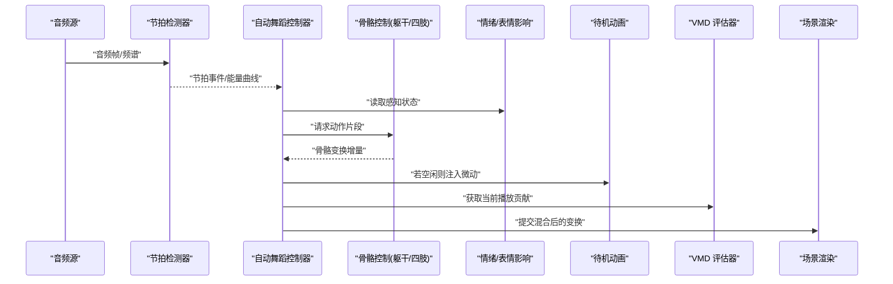
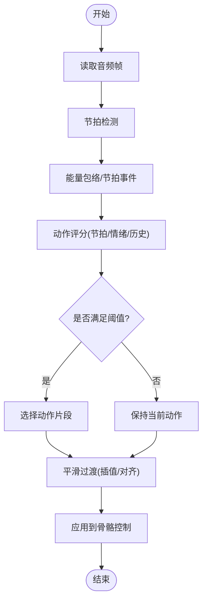
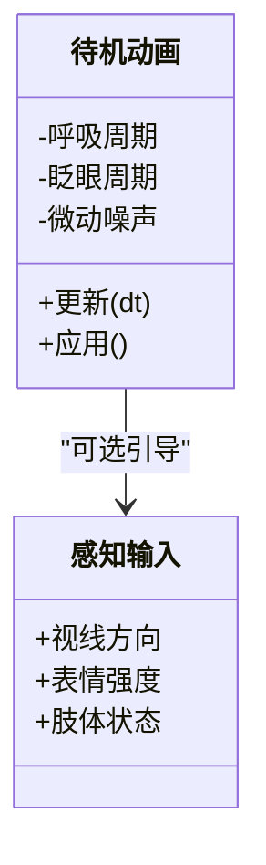
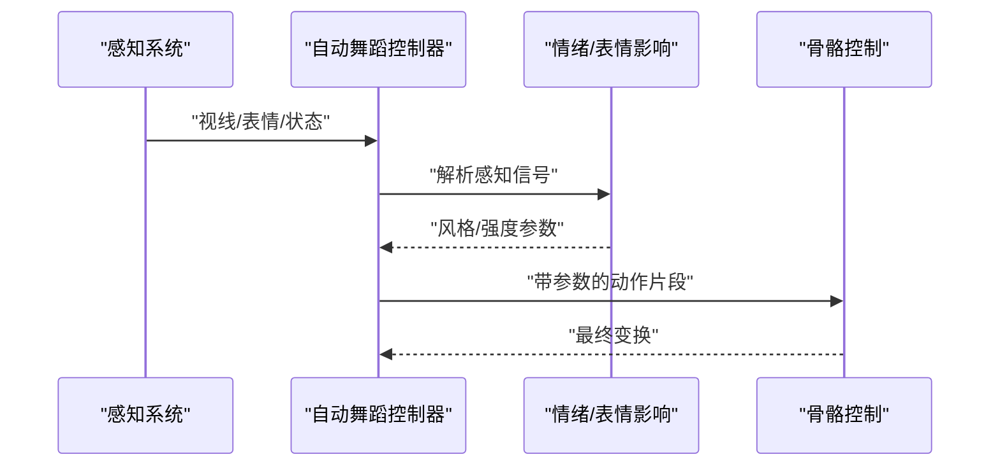
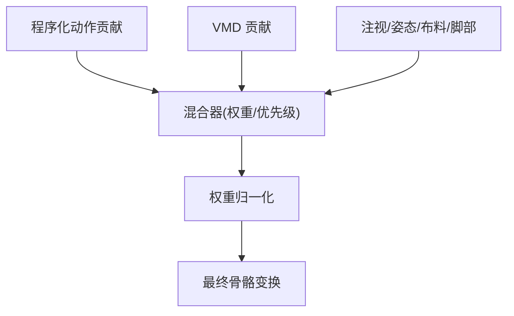
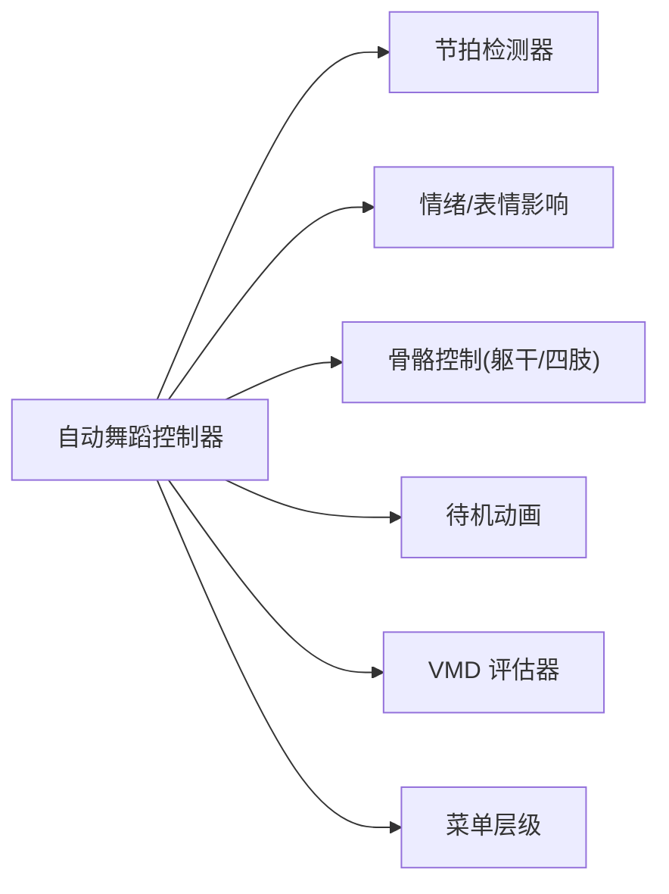

# 程序化动画

<cite>
**本文引用的文件**   
- [adr-021-procedural-motion.md](file://docs/adr/adr-021-procedural-motion.md)
- [adr-042-motion-algos-rename.md](file://docs/adr/adr-042-motion-algos-rename.md)
- [adr-056-wasm-runtime-motion-layers.md](file://docs/adr/adr-056-wasm-runtime-motion-layers.md)
- [adr-053-gaze-layer-integration.md](file://docs/adr/adr-053-gaze-layer-integration.md)
- [adr-108-animation-retargeter.md](file://docs/adr/adr-108-animation-retargeter.md)
- [proc-motion-autodance.ts](file://frontend/src/motion-algos/proc-motion-autodance.ts)
- [proc-motion-autodance-bones.ts](file://frontend/src/motion-algos/proc-motion-autodance-bones.ts)
- [proc-motion-autodance-bones-trunk.ts](file://frontend/src/motion-algos/proc-motion-autodance-bones-trunk.ts)
- [proc-motion-autodance-bones-limbs.ts](file://frontend/src/motion-algos/proc-motion-autodance-bones-limbs.ts)
- [proc-motion-autodance-emotion.ts](file://frontend/src/motion-algos/proc-motion-autodance-emotion.ts)
- [proc-motion-idle.ts](file://frontend/src/motion-algos/proc-motion-idle.ts)
- [beat-detector.ts](file://frontend/src/motion-algos/beat-detector.ts)
- [procedural-motion.ts](file://frontend/src/motion-algos/procedural-motion.ts)
- [vmd-evaluator.ts](file://frontend/src/motion-algos/vmd-evaluator.ts)
- [motion-modules-registry.test.ts](file://frontend/src/__tests__/scene/motion-modules-registry.test.ts)
- [motion-modules-timed.test.ts](file://frontend/src/__tests__/scene/motion-modules-timed.test.ts)
- [perception-breathing.test.ts](file://frontend/src/__tests__/perception-breathing.test.ts)
- [perception.test.ts](file://frontend/src/__tests__/perception.test.ts)
- [motion-procmotion-levels.ts](file://frontend/src/menus/motion-procmotion-levels.ts)
- [motion-override-levels.ts](file://frontend/src/menus/motion-override-levels.ts)
- [motion-gaze-levels.ts](file://frontend/src/menus/motion-gaze-levels.ts)
- [motion-pose-levels.ts](file://frontend/src/menus/motion-pose-levels.ts)
- [motion-camera-levels.ts](file://frontend/src/menus/motion-camera-levels.ts)
- [motion-cloth-levels.ts](file://frontend/src/menus/motion-cloth-levels.ts)
- [motion-feet-levels.ts](file://frontend/src/menus/motion-feet-levels.ts)
- [autodance.md](file://docs/research/dancexr-zh/features/autodance.md)
- [autodance3.md](file://docs/research/dancexr-zh/features/autodance3.md)
- [music_timing.md](file://docs/research/dancexr-zh/features/music_timing.md)
- [lifelike_motions.md](file://docs/research/dancexr-zh/features/lifelike_motions.md)
- [lip-sync.md](file://docs/superpowers/plans/2026-07-10-perception-lip-sync.md)
- [micro-expression.md](file://docs/superpowers/plans/2026-07-10-perception-micro-expression.md)
- [balance-sway.md](file://docs/superpowers/plans/2026-07-10-perception-balance-sway.md)
</cite>

## 目录
1. [简介](#简介)
2. [项目结构](#项目结构)
3. [核心组件](#核心组件)
4. [架构总览](#架构总览)
5. [详细组件分析](#详细组件分析)
6. [依赖关系分析](#依赖关系分析)
7. [性能考量](#性能考量)
8. [故障排查指南](#故障排查指南)
9. [结论](#结论)
10. [附录](#附录)

## 简介
本文件面向“程序化动画系统”的完整说明，覆盖以下目标：
- AI 驱动的动画生成算法：自动舞蹈系统的音乐节奏检测、动作选择与过渡逻辑。
- 待机动画实现：呼吸、眨眼、身体微动等自然动作的生成方法。
- 感知系统集成：视线追踪、表情识别、肢体状态对动画的影响。
- 程序化动画与 VMD 动画的混合机制：权重分配、优先级处理与冲突解决。
- 自定义程序化动画开发指南：算法设计模式、参数调节方法与性能优化策略，并给出具体代码示例路径。

## 项目结构
程序化动画相关能力主要分布在以下位置：
- motion-algos：算法层（节拍检测、程序化动作模块、VMD 评估器）
- menus：UI 菜单层级（程序化动作、注视、姿态、布料、脚部、相机等）
- research/superpowers：特性设计与计划文档（自动舞蹈、音乐时序、拟真动作、感知计划）
- tests：单元测试覆盖（节拍检测、程序化动作、感知呼吸等）

```mermaid
graph TB
subgraph "算法层"
PD["节拍检测<br/>beat-detector.ts"]
PM["程序化动作基类<br/>procedural-motion.ts"]
AD["自动舞蹈主控制器<br/>proc-motion-autodance.ts"]
AB["骨骼控制-躯干<br/>proc-motion-autodance-bones-trunk.ts"]
AL["骨骼控制-四肢<br/>proc-motion-autodance-bones-limbs.ts"]
AE["情绪/表情影响<br/>proc-motion-autodance-emotion.ts"]
IDLE["待机动画<br/>proc-motion-idle.ts"]
VE["VMD 评估器<br/>vmd-evaluator.ts"]
end
subgraph "UI 菜单层级"
MPC["程序化动作层级<br/>motion-procmotion-levels.ts"]
MO["覆写层级<br/>motion-override-levels.ts"]
MG["注视层级<br/>motion-gaze-levels.ts"]
MP["姿态层级<br/>motion-pose-levels.ts"]
MC["相机层级<br/>motion-camera-levels.ts"]
ML["布料层级<br/>motion-cloth-levels.ts"]
MF["脚部层级<br/>motion-feet-levels.ts"]
end
subgraph "测试与文档"
T1["模块注册测试<br/>motion-modules-registry.test.ts"]
T2["定时调度测试<br/>motion-modules-timed.test.ts"]
T3["节拍检测测试<br/>beat-detector.test.ts"]
T4["感知呼吸测试<br/>perception-breathing.test.ts"]
ADR1["ADR: 程序化动作<br/>adr-021-procedural-motion.md"]
ADR2["ADR: 运行时运动层级<br/>adr-056-wasm-runtime-motion-layers.md"]
ADR3["ADR: 注视层集成<br/>adr-053-gaze-layer-integration.md"]
ADR4["ADR: 重定向器<br/>adr-108-animation-retargeter.md"]
DOC1["自动舞蹈特性<br/>autodance.md / autodance3.md"]
DOC2["音乐时序<br/>music_timing.md"]
DOC3["拟真动作<br/>lifelike_motions.md"]
PLAN1["唇语计划<br/>lip-sync.md"]
PLAN2["微表情计划<br/>micro-expression.md"]
PLAN3["平衡摇摆计划<br/>balance-sway.md"]
end
PD --> AD
PM --> AD
AD --> AB
AD --> AL
AD --> AE
PM --> IDLE
VE --> AD
MPC --> AD
MO --> AD
MG --> AD
MP --> AD
MC --> AD
ML --> AD
MF --> AD
T1 --> AD
T2 --> AD
T3 --> PD
T4 --> IDLE
ADR1 --> AD
ADR2 --> AD
ADR3 --> MG
ADR4 --> VE
DOC1 --> AD
DOC2 --> PD
DOC3 --> IDLE
PLAN1 --> AE
PLAN2 --> AE
PLAN3 --> IDLE
```

图表来源
- [proc-motion-autodance.ts](file://frontend/src/motion-algos/proc-motion-autodance.ts)
- [proc-motion-autodance-bones-trunk.ts](file://frontend/src/motion-algos/proc-motion-autodance-bones-trunk.ts)
- [proc-motion-autodance-bones-limbs.ts](file://frontend/src/motion-algos/proc-motion-autodance-bones-limbs.ts)
- [proc-motion-autodance-emotion.ts](file://frontend/src/motion-algos/proc-motion-autodance-emotion.ts)
- [proc-motion-idle.ts](file://frontend/src/motion-algos/proc-motion-idle.ts)
- [beat-detector.ts](file://frontend/src/motion-algos/beat-detector.ts)
- [procedural-motion.ts](file://frontend/src/motion-algos/procedural-motion.ts)
- [vmd-evaluator.ts](file://frontend/src/motion-algos/vmd-evaluator.ts)
- [motion-procmotion-levels.ts](file://frontend/src/menus/motion-procmotion-levels.ts)
- [motion-override-levels.ts](file://frontend/src/menus/motion-override-levels.ts)
- [motion-gaze-levels.ts](file://frontend/src/menus/motion-gaze-levels.ts)
- [motion-pose-levels.ts](file://frontend/src/menus/motion-pose-levels.ts)
- [motion-camera-levels.ts](file://frontend/src/menus/motion-camera-levels.ts)
- [motion-cloth-levels.ts](file://frontend/src/menus/motion-cloth-levels.ts)
- [motion-feet-levels.ts](file://frontend/src/menus/motion-feet-levels.ts)
- [motion-modules-registry.test.ts](file://frontend/src/__tests__/scene/motion-modules-registry.test.ts)
- [motion-modules-timed.test.ts](file://frontend/src/__tests__/scene/motion-modules-timed.test.ts)
- [beat-detector.test.ts](file://frontend/src/__tests__/beat-detector.test.ts)
- [perception-breathing.test.ts](file://frontend/src/__tests__/perception-breathing.test.ts)
- [adr-021-procedural-motion.md](file://docs/adr/adr-021-procedural-motion.md)
- [adr-056-wasm-runtime-motion-layers.md](file://docs/adr/adr-056-wasm-runtime-motion-layers.md)
- [adr-053-gaze-layer-integration.md](file://docs/adr/adr-053-gaze-layer-integration.md)
- [adr-108-animation-retargeter.md](file://docs/adr/adr-108-animation-retargeter.md)
- [autodance.md](file://docs/research/dancexr-zh/features/autodance.md)
- [autodance3.md](file://docs/research/dancexr-zh/features/autodance3.md)
- [music_timing.md](file://docs/research/dancexr-zh/features/music_timing.md)
- [lifelike_motions.md](file://docs/research/dancexr-zh/features/lifelike_motions.md)
- [lip-sync.md](file://docs/superpowers/plans/2026-07-10-perception-lip-sync.md)
- [micro-expression.md](file://docs/superpowers/plans/2026-07-10-perception-micro-expression.md)
- [balance-sway.md](file://docs/superpowers/plans/2026-07-10-perception-balance-sway.md)

章节来源
- [adr-021-procedural-motion.md](file://docs/adr/adr-021-procedural-motion.md)
- [adr-056-wasm-runtime-motion-layers.md](file://docs/adr/adr-056-wasm-runtime-motion-layers.md)
- [adr-053-gaze-layer-integration.md](file://docs/adr/adr-053-gaze-layer-integration.md)
- [adr-108-animation-retargeter.md](file://docs/adr/adr-108-animation-retargeter.md)

## 核心组件
- 节拍检测器：从音频流中提取节拍信息，为自动舞蹈提供时间基准。
- 程序化动作基类：定义统一的动作生命周期、输入输出接口与调度方式。
- 自动舞蹈控制器：整合节拍、动作库、情绪与骨骼控制，负责动作选择与过渡。
- 骨骼控制子模块：按躯干与四肢拆分，降低耦合度，便于扩展与调试。
- 情绪/表情影响：将感知结果映射到动作强度与风格。
- 待机动画：在空闲状态下生成呼吸、眨眼、微动等自然行为。
- VMD 评估器：将 VMD 关键帧数据转换为可叠加的变换贡献，用于混合。

章节来源
- [beat-detector.ts](file://frontend/src/motion-algos/beat-detector.ts)
- [procedural-motion.ts](file://frontend/src/motion-algos/procedural-motion.ts)
- [proc-motion-autodance.ts](file://frontend/src/motion-algos/proc-motion-autodance.ts)
- [proc-motion-autodance-bones-trunk.ts](file://frontend/src/motion-algos/proc-motion-autodance-bones-trunk.ts)
- [proc-motion-autodance-bones-limbs.ts](file://frontend/src/motion-algos/proc-motion-autodance-bones-limbs.ts)
- [proc-motion-autodance-emotion.ts](file://frontend/src/motion-algos/proc-motion-autodance-emotion.ts)
- [proc-motion-idle.ts](file://frontend/src/motion-algos/proc-motion-idle.ts)
- [vmd-evaluator.ts](file://frontend/src/motion-algos/vmd-evaluator.ts)

## 架构总览
程序化动画采用“分层 + 模块化”的架构：
- 输入层：音频节拍、感知信号（视线、表情、肢体状态）、用户配置。
- 决策层：自动舞蹈控制器根据节拍与上下文选择动作，管理过渡。
- 执行层：骨骼控制子模块计算最终骨骼变换；待机动画在空闲时注入微动。
- 混合层：与 VMD 动画进行权重混合，遵循优先级与冲突消解规则。
- UI 层：通过菜单层级暴露开关、权重与参数，支持运行时调整。

图表来源
- [beat-detector.ts](file://frontend/src/motion-algos/beat-detector.ts)
- [proc-motion-autodance.ts](file://frontend/src/motion-algos/proc-motion-autodance.ts)
- [proc-motion-autodance-bones-trunk.ts](file://frontend/src/motion-algos/proc-motion-autodance-bones-trunk.ts)
- [proc-motion-autodance-bones-limbs.ts](file://frontend/src/motion-algos/proc-motion-autodance-bones-limbs.ts)
- [proc-motion-autodance-emotion.ts](file://frontend/src/motion-algos/proc-motion-autodance-emotion.ts)
- [proc-motion-idle.ts](file://frontend/src/motion-algos/proc-motion-idle.ts)
- [vmd-evaluator.ts](file://frontend/src/motion-algos/vmd-evaluator.ts)

## 详细组件分析

### 自动舞蹈系统（AI 驱动的动作生成）
- 音乐节奏检测：基于音频能量与频域特征估计节拍点，输出节拍事件序列与能量包络，供控制器对齐动作。
- 动作选择：依据节拍密度、能量峰值、情绪标签与历史动作库，使用评分函数选择候选动作。
- 过渡逻辑：在动作切换时采用平滑插值与节拍对齐，避免突变；支持跨段落的渐入渐出。
- 情绪/表情影响：将感知到的表情强度映射为动作幅度、速度或风格偏移。

图表来源
- [beat-detector.ts](file://frontend/src/motion-algos/beat-detector.ts)
- [proc-motion-autodance.ts](file://frontend/src/motion-algos/proc-motion-autodance.ts)
- [proc-motion-autodance-bones-trunk.ts](file://frontend/src/motion-algos/proc-motion-autodance-bones-trunk.ts)
- [proc-motion-autodance-bones-limbs.ts](file://frontend/src/motion-algos/proc-motion-autodance-bones-limbs.ts)
- [proc-motion-autodance-emotion.ts](file://frontend/src/motion-algos/proc-motion-autodance-emotion.ts)

章节来源
- [autodance.md](file://docs/research/dancexr-zh/features/autodance.md)
- [autodance3.md](file://docs/research/dancexr-zh/features/autodance3.md)
- [music_timing.md](file://docs/research/dancexr-zh/features/music_timing.md)
- [proc-motion-autodance.ts](file://frontend/src/motion-algos/proc-motion-autodance.ts)
- [proc-motion-autodance-bones-trunk.ts](file://frontend/src/motion-algos/proc-motion-autodance-bones-trunk.ts)
- [proc-motion-autodance-bones-limbs.ts](file://frontend/src/motion-algos/proc-motion-autodance-bones-limbs.ts)
- [proc-motion-autodance-emotion.ts](file://frontend/src/motion-algos/proc-motion-autodance-emotion.ts)
- [beat-detector.ts](file://frontend/src/motion-algos/beat-detector.ts)

### 待机动画（呼吸、眨眼、微动）
- 呼吸效果：以低频正弦调制胸腔/肩部位移与缩放，模拟自然呼吸节律。
- 眨眼动画：周期性眼睑开合，结合随机间隔增加真实感。
- 身体微动：小幅度重心偏移与关节微调，避免僵硬静止。
- 触发条件：当无主动作或低活动状态时启用，并可被感知（如视线方向）轻微引导。

图表来源
- [proc-motion-idle.ts](file://frontend/src/motion-algos/proc-motion-idle.ts)
- [perception-breathing.test.ts](file://frontend/src/__tests__/perception-breathing.test.ts)
- [perception.test.ts](file://frontend/src/__tests__/perception.test.ts)

章节来源
- [lifelike_motions.md](file://docs/research/dancexr-zh/features/lifelike_motions.md)
- [proc-motion-idle.ts](file://frontend/src/motion-algos/proc-motion-idle.ts)
- [perception-breathing.test.ts](file://frontend/src/__tests__/perception-breathing.test.ts)
- [perception.test.ts](file://frontend/src/__tests__/perception.test.ts)

### 感知系统集成（视线、表情、肢体状态）
- 视线追踪：将视线方向作为注意力焦点，影响头部/眼部朝向与待机微动方向。
- 表情识别：将表情强度映射为动作幅度、速度或风格偏移（如兴奋增强舞蹈力度）。
- 肢体状态：根据站立/行走/交互等状态切换动作库与权重。
- 集成点：通过菜单层级与程序化动作控制器对接，确保实时可调。

图表来源
- [adr-053-gaze-layer-integration.md](file://docs/adr/adr-053-gaze-layer-integration.md)
- [lip-sync.md](file://docs/superpowers/plans/2026-07-10-perception-lip-sync.md)
- [micro-expression.md](file://docs/superpowers/plans/2026-07-10-perception-micro-expression.md)
- [balance-sway.md](file://docs/superpowers/plans/2026-07-10-perception-balance-sway.md)
- [proc-motion-autodance-emotion.ts](file://frontend/src/motion-algos/proc-motion-autodance-emotion.ts)
- [motion-gaze-levels.ts](file://frontend/src/menus/motion-gaze-levels.ts)

章节来源
- [adr-053-gaze-layer-integration.md](file://docs/adr/adr-053-gaze-layer-integration.md)
- [lip-sync.md](file://docs/superpowers/plans/2026-07-10-perception-lip-sync.md)
- [micro-expression.md](file://docs/superpowers/plans/2026-07-10-perception-micro-expression.md)
- [balance-sway.md](file://docs/superpowers/plans/2026-07-10-perception-balance-sway.md)
- [motion-gaze-levels.ts](file://frontend/src/menus/motion-gaze-levels.ts)
- [proc-motion-autodance-emotion.ts](file://frontend/src/motion-algos/proc-motion-autodance-emotion.ts)

### 程序化动画与 VMD 的混合机制
- 权重分配：为程序化动作与 VMD 贡献分别设置权重，支持运行时调整。
- 优先级处理：高优先级层（如注视、姿态）可覆盖低优先级层的局部变换。
- 冲突解决：当多源同时写入同一骨骼时，按层级顺序与权重归一化合并。
- 重定向适配：借助重定向器将不同模型的骨骼映射到统一空间，提升兼容性。

图表来源
- [vmd-evaluator.ts](file://frontend/src/motion-algos/vmd-evaluator.ts)
- [adr-108-animation-retargeter.md](file://docs/adr/adr-108-animation-retargeter.md)
- [adr-056-wasm-runtime-motion-layers.md](file://docs/adr/adr-056-wasm-runtime-motion-layers.md)
- [motion-override-levels.ts](file://frontend/src/menus/motion-override-levels.ts)
- [motion-gaze-levels.ts](file://frontend/src/menus/motion-gaze-levels.ts)
- [motion-pose-levels.ts](file://frontend/src/menus/motion-pose-levels.ts)
- [motion-cloth-levels.ts](file://frontend/src/menus/motion-cloth-levels.ts)
- [motion-feet-levels.ts](file://frontend/src/menus/motion-feet-levels.ts)

章节来源
- [adr-056-wasm-runtime-motion-layers.md](file://docs/adr/adr-056-wasm-runtime-motion-layers.md)
- [adr-108-animation-retargeter.md](file://docs/adr/adr-108-animation-retargeter.md)
- [vmd-evaluator.ts](file://frontend/src/motion-algos/vmd-evaluator.ts)
- [motion-override-levels.ts](file://frontend/src/menus/motion-override-levels.ts)
- [motion-gaze-levels.ts](file://frontend/src/menus/motion-gaze-levels.ts)
- [motion-pose-levels.ts](file://frontend/src/menus/motion-pose-levels.ts)
- [motion-cloth-levels.ts](file://frontend/src/menus/motion-cloth-levels.ts)
- [motion-feet-levels.ts](file://frontend/src/menus/motion-feet-levels.ts)

### 自定义程序化动画开发指南
- 设计模式：
  - 继承程序化动作基类，实现生命周期钩子（初始化、更新、释放）。
  - 使用输入抽象（节拍、感知、配置）与输出抽象（骨骼变换增量）。
  - 将复杂逻辑拆分为子模块（如躯干、四肢、表情），提高可维护性。
- 参数调节：
  - 通过菜单层级暴露关键参数（强度、频率、范围），支持运行时热调。
  - 引入平滑与限制函数，防止极端值导致抖动或穿模。
- 性能优化：
  - 批量计算与缓存中间结果，减少每帧重复开销。
  - 按需启用模块（空闲/活跃状态），降低 CPU/GPU 压力。
  - 使用轻量数学运算与近似替代高精度计算。
- 代码示例路径（参考现有实现）：
  - 新动作模块骨架：[procedural-motion.ts](file://frontend/src/motion-algos/procedural-motion.ts)
  - 自动舞蹈主流程：[proc-motion-autodance.ts](file://frontend/src/motion-algos/proc-motion-autodance.ts)
  - 躯干/四肢控制：[proc-motion-autodance-bones-trunk.ts](file://frontend/src/motion-algos/proc-motion-autodance-bones-trunk.ts)、[proc-motion-autodance-bones-limbs.ts](file://frontend/src/motion-algos/proc-motion-autodance-bones-limbs.ts)
  - 待机动画模板：[proc-motion-idle.ts](file://frontend/src/motion-algos/proc-motion-idle.ts)
  - 节拍检测接入：[beat-detector.ts](file://frontend/src/motion-algos/beat-detector.ts)
  - 菜单层级注册：[motion-procmotion-levels.ts](file://frontend/src/menus/motion-procmotion-levels.ts)

章节来源
- [procedural-motion.ts](file://frontend/src/motion-algos/procedural-motion.ts)
- [proc-motion-autodance.ts](file://frontend/src/motion-algos/proc-motion-autodance.ts)
- [proc-motion-autodance-bones-trunk.ts](file://frontend/src/motion-algos/proc-motion-autodance-bones-trunk.ts)
- [proc-motion-autodance-bones-limbs.ts](file://frontend/src/motion-algos/proc-motion-autodance-bones-limbs.ts)
- [proc-motion-idle.ts](file://frontend/src/motion-algos/proc-motion-idle.ts)
- [beat-detector.ts](file://frontend/src/motion-algos/beat-detector.ts)
- [motion-procmotion-levels.ts](file://frontend/src/menus/motion-procmotion-levels.ts)

## 依赖关系分析
- 模块内聚与耦合：
  - 自动舞蹈控制器聚合节拍、情绪与骨骼控制，职责清晰但耦合较高，建议通过接口隔离。
  - 待机动画相对独立，易于替换与扩展。
- 外部依赖与集成点：
  - 音频源与节拍检测器为外部输入，需保证稳定与容错。
  - 菜单层级为运行时配置入口，需与控制器双向同步。
- 潜在循环依赖：
  - 控制器与情绪模块应避免直接相互引用，可通过事件总线或回调解耦。

图表来源
- [proc-motion-autodance.ts](file://frontend/src/motion-algos/proc-motion-autodance.ts)
- [beat-detector.ts](file://frontend/src/motion-algos/beat-detector.ts)
- [proc-motion-autodance-emotion.ts](file://frontend/src/motion-algos/proc-motion-autodance-emotion.ts)
- [proc-motion-autodance-bones-trunk.ts](file://frontend/src/motion-algos/proc-motion-autodance-bones-trunk.ts)
- [proc-motion-autodance-bones-limbs.ts](file://frontend/src/motion-algos/proc-motion-autodance-bones-limbs.ts)
- [proc-motion-idle.ts](file://frontend/src/motion-algos/proc-motion-idle.ts)
- [vmd-evaluator.ts](file://frontend/src/motion-algos/vmd-evaluator.ts)
- [motion-procmotion-levels.ts](file://frontend/src/menus/motion-procmotion-levels.ts)

章节来源
- [proc-motion-autodance.ts](file://frontend/src/motion-algos/proc-motion-autodance.ts)
- [motion-procmotion-levels.ts](file://frontend/src/menus/motion-procmotion-levels.ts)

## 性能考量
- 节拍检测：在高频音频下采用降采样与窗口化，降低 FFT 成本。
- 动作选择：预计算评分表与缓存最近候选，减少每帧决策开销。
- 骨骼控制：批量矩阵运算与最小必要更新，避免全量广播。
- 待机动画：使用低频率更新与惰性计算，仅在必要时刷新。
- 混合阶段：权重归一化与裁剪，防止数值溢出与抖动。

## 故障排查指南
- 程序化动作无效：检查模块注册与层级开关，确认权重未为零或被覆盖。
- 节拍错位：验证音频源与节拍检测器的时间戳对齐，检查能量阈值。
- 过渡突变：调整插值速度与节拍对齐窗口，避免强切。
- 混合冲突：查看各层级优先级与权重，确保归一化正确。
- 感知异常：确认视线/表情/状态输入有效，必要时降级至默认行为。

章节来源
- [motion-modules-registry.test.ts](file://frontend/src/__tests__/scene/motion-modules-registry.test.ts)
- [motion-modules-timed.test.ts](file://frontend/src/__tests__/scene/motion-modules-timed.test.ts)
- [beat-detector.test.ts](file://frontend/src/__tests__/beat-detector.test.ts)
- [perception-breathing.test.ts](file://frontend/src/__tests__/perception-breathing.test.ts)

## 结论
程序化动画系统通过模块化与分层设计，实现了从音频节拍到骨骼变换的端到端生成链路。自动舞蹈、待机动画与感知集成共同构建了自然的角色表现；与 VMD 的混合机制确保了与既有动画资产的兼容与扩展。通过合理的参数调节与性能优化，可在不同设备上获得稳定且生动的动画体验。

## 附录
- 相关 ADR 与设计文档：
  - [程序化动作 ADR](file://docs/adr/adr-021-procedural-motion.md)
  - [运行时运动层级 ADR](file://docs/adr/adr-056-wasm-runtime-motion-layers.md)
  - [注视层集成 ADR](file://docs/adr/adr-053-gaze-layer-integration.md)
  - [动画重定向器 ADR](file://docs/adr/adr-108-animation-retargeter.md)
- 特性与研究文档：
  - [自动舞蹈特性](file://docs/research/dancexr-zh/features/autodance.md)
  - [自动舞蹈 v3](file://docs/research/dancexr-zh/features/autodance3.md)
  - [音乐时序](file://docs/research/dancexr-zh/features/music_timing.md)
  - [拟真动作](file://docs/research/dancexr-zh/features/lifelike_motions.md)
- 感知计划：
  - [唇语计划](file://docs/superpowers/plans/2026-07-10-perception-lip-sync.md)
  - [微表情计划](file://docs/superpowers/plans/2026-07-10-perception-micro-expression.md)
  - [平衡摇摆计划](file://docs/superpowers/plans/2026-07-10-perception-balance-sway.md)