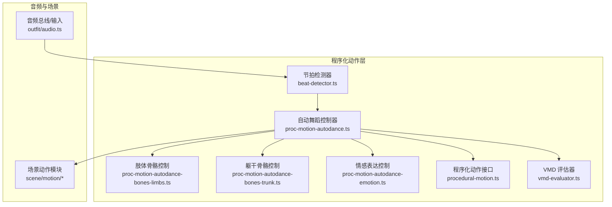
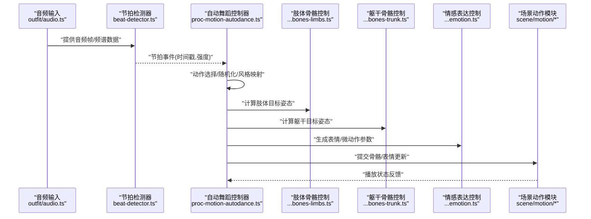
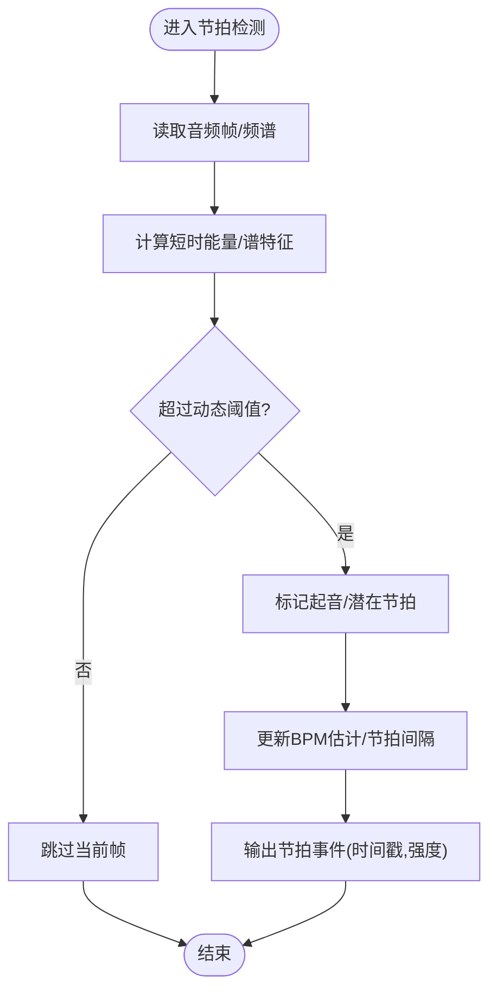
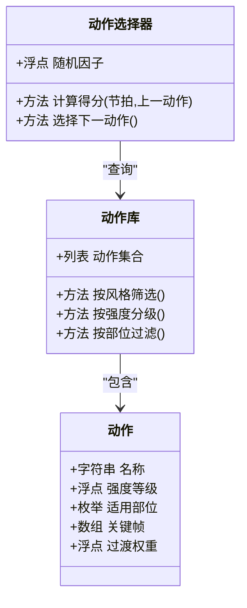
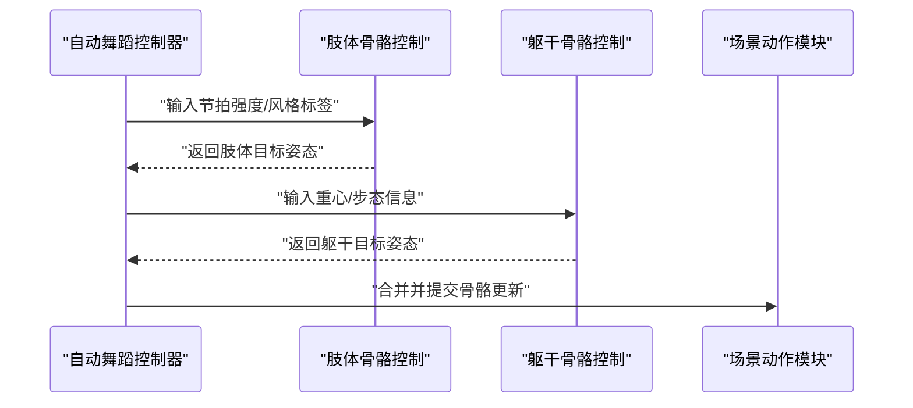
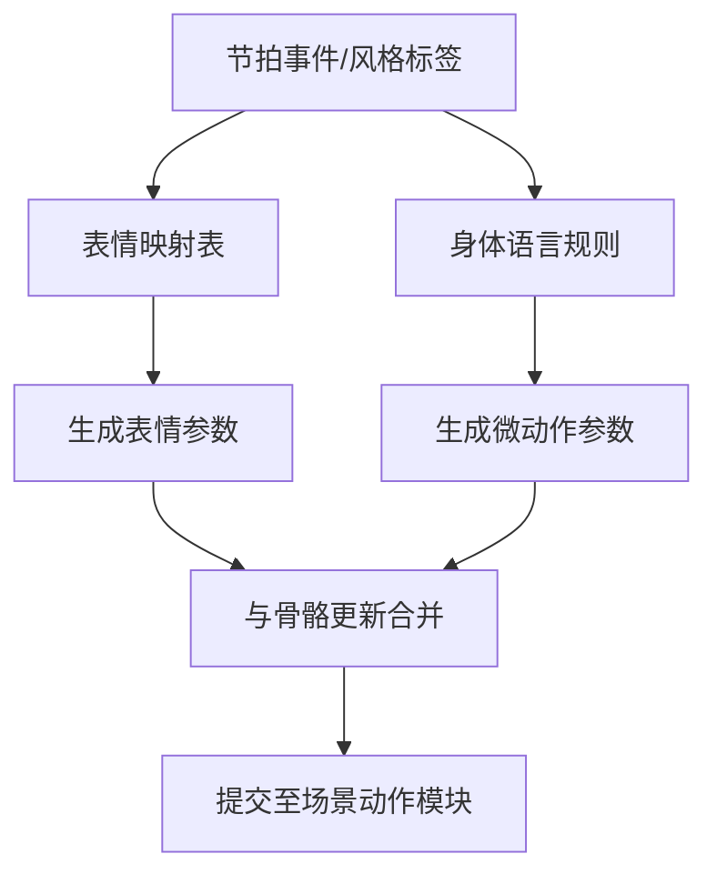
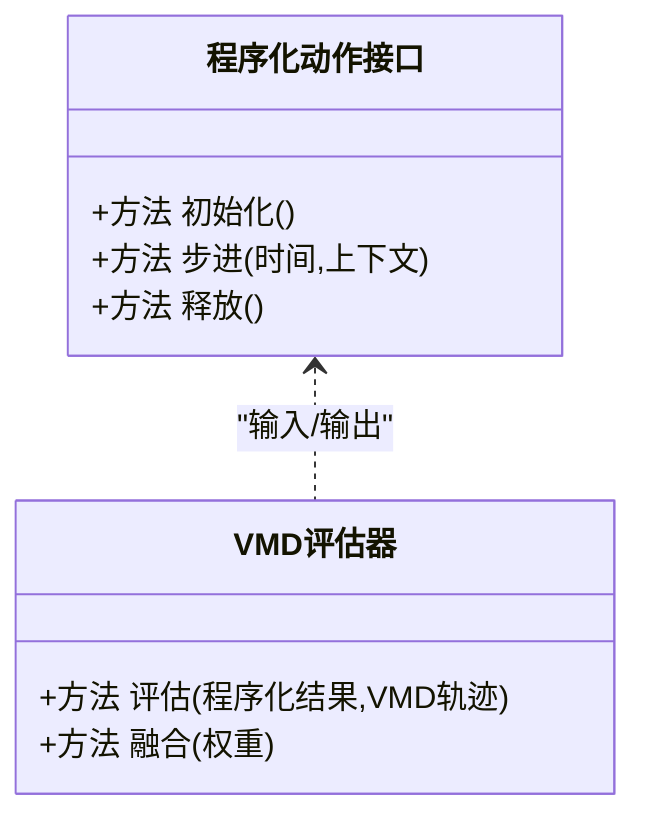
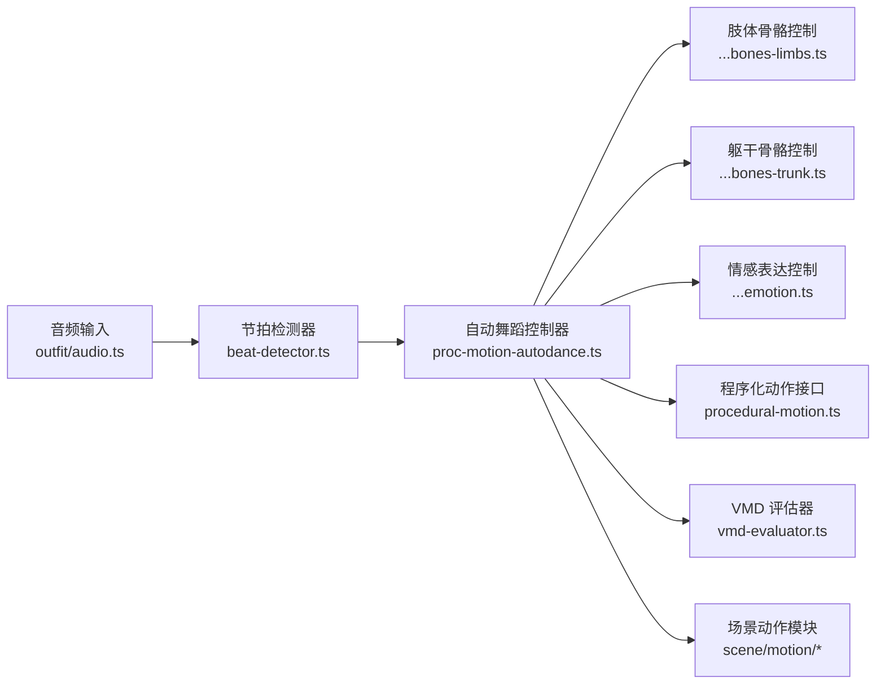

# 自动舞蹈系统

<cite>
**本文引用的文件**   
- [proc-motion-autodance.ts](file://frontend/src/motion-algos/proc-motion-autodance.ts)
- [beat-detector.ts](file://frontend/src/motion-algos/beat-detector.ts)
- [proc-motion-autodance-bones-limbs.ts](file://frontend/src/motion-algos/proc-motion-autodance-bones-limbs.ts)
- [proc-motion-autodance-bones-trunk.ts](file://frontend/src/motion-algos/proc-motion-autodance-bones-trunk.ts)
- [proc-motion-autodance-emotion.ts](file://frontend/src/motion-algos/proc-motion-autodance-emotion.ts)
- [procedural-motion.ts](file://frontend/src/motion-algos/procedural-motion.ts)
- [vmd-evaluator.ts](file://frontend/src/motion-algos/vmd-evaluator.ts)
- [audio.ts](file://frontend/src/outfit/audio.ts)
- [perception.test.ts](file://frontend/src/__tests__/perception.test.ts)
- [beat-detector.test.ts](file://frontend/src/__tests__/beat-detector.test.ts)
- [motion-modules-timed.test.ts](file://frontend/src/__tests__/scene/motion-modules-timed.test.ts)
- [adr-043-dancexr-gap-analysis.md](file://docs/adr/adr-043-dancexr-gap-analysis.md)
- [adr-021-procedural-motion.md](file://docs/adr/adr-021-procedural-motion.md)
- [features/autodance.md](file://docs/research/dancexr-zh/features/autodance.md)
- [features/music_timing.md](file://docs/research/dancexr-zh/features/music_timing.md)
</cite>

## 目录
1. [简介](#简介)
2. [项目结构](#项目结构)
3. [核心组件](#核心组件)
4. [架构总览](#架构总览)
5. [详细组件分析](#详细组件分析)
6. [依赖关系分析](#依赖关系分析)
7. [性能考量](#性能考量)
8. [故障排查指南](#故障排查指南)
9. [结论](#结论)
10. [附录](#附录)

## 简介
本文件面向“自动舞蹈系统”的开发者与使用者，系统性阐述以下能力：
- 音乐节奏检测算法：音频分析、节拍识别与节奏同步机制
- 动作选择策略：舞蹈动作库组织、动作匹配与随机化控制
- 骨骼控制系统：肢体（limbs）与躯干（trunk）独立控制逻辑
- 情感表达系统：面部表情与身体语言增强表现力
- 自定义舞蹈动作开发：动作定义格式、参数配置与性能优化建议
- 实践示例：如何添加新动作与调整节奏检测参数

## 项目结构
自动舞蹈系统位于前端 TypeScript 模块中，围绕“程序化动作”框架组织。关键目录与职责如下：
- motion-algos：程序化动作算法与工具（节拍检测、VMD 评估、情绪驱动、骨骼控制等）
- scene/motion：场景级动作播放与调度（与 VMD 回放集成）
- outfit/audio：音频总线与音频输入桥接
- docs/research/dancexr-zh/features：功能说明文档（自动舞蹈、音乐时间对齐等）

图表来源
- [proc-motion-autodance.ts](file://frontend/src/motion-algos/proc-motion-autodance.ts)
- [beat-detector.ts](file://frontend/src/motion-algos/beat-detector.ts)
- [proc-motion-autodance-bones-limbs.ts](file://frontend/src/motion-algos/proc-motion-autodance-bones-limbs.ts)
- [proc-motion-autodance-bones-trunk.ts](file://frontend/src/motion-algos/proc-motion-autodance-bones-trunk.ts)
- [proc-motion-autodance-emotion.ts](file://frontend/src/motion-algos/proc-motion-autodance-emotion.ts)
- [procedural-motion.ts](file://frontend/src/motion-algos/procedural-motion.ts)
- [vmd-evaluator.ts](file://frontend/src/motion-algos/vmd-evaluator.ts)
- [audio.ts](file://frontend/src/outfit/audio.ts)

章节来源
- [adr-021-procedural-motion.md](file://docs/adr/adr-021-procedural-motion.md)
- [features/autodance.md](file://docs/research/dancexr-zh/features/autodance.md)
- [features/music_timing.md](file://docs/research/dancexr-zh/features/music_timing.md)

## 核心组件
- 自动舞蹈控制器：协调节拍事件、动作选择、骨骼与表情更新，并驱动场景动作播放
- 节拍检测器：对音频流进行能量/频谱分析，输出节拍触发信号与时间戳
- 肢体/躯干骨骼控制器：分别计算四肢与躯干的旋转/位移，保证自然过渡与稳定性
- 情感表达控制器：基于节拍强度与风格标签生成面部表情与微动作
- 程序化动作接口：统一动作生命周期（初始化、步进、释放），便于扩展
- VMD 评估器：将程序化结果与 VMD 动画融合或作为参考轨迹

章节来源
- [proc-motion-autodance.ts](file://frontend/src/motion-algos/proc-motion-autodance.ts)
- [beat-detector.ts](file://frontend/src/motion-algos/beat-detector.ts)
- [proc-motion-autodance-bones-limbs.ts](file://frontend/src/motion-algos/proc-motion-autodance-bones-limbs.ts)
- [proc-motion-autodance-bones-trunk.ts](file://frontend/src/motion-algos/proc-motion-autodance-bones-trunk.ts)
- [proc-motion-autodance-emotion.ts](file://frontend/src/motion-algos/proc-motion-autodance-emotion.ts)
- [procedural-motion.ts](file://frontend/src/motion-algos/procedural-motion.ts)
- [vmd-evaluator.ts](file://frontend/src/motion-algos/vmd-evaluator.ts)

## 架构总览
自动舞蹈系统采用“感知-决策-执行”的分层架构：
- 感知层：音频输入与节拍检测
- 决策层：动作选择与风格/情感映射
- 执行层：骨骼控制与表情驱动，最终写入场景动作管线

图表来源
- [audio.ts](file://frontend/src/outfit/audio.ts)
- [beat-detector.ts](file://frontend/src/motion-algos/beat-detector.ts)
- [proc-motion-autodance.ts](file://frontend/src/motion-algos/proc-motion-autodance.ts)
- [proc-motion-autodance-bones-limbs.ts](file://frontend/src/motion-algos/proc-motion-autodance-bones-limbs.ts)
- [proc-motion-autodance-bones-trunk.ts](file://frontend/src/motion-algos/proc-motion-autodance-bones-trunk.ts)
- [proc-motion-autodance-emotion.ts](file://frontend/src/motion-algos/proc-motion-autodance-emotion.ts)

## 详细组件分析

### 节拍检测与节奏同步
- 音频分析：从音频输入获取时域/频域特征，计算短时能量与谱质心，用于强拍/弱拍区分
- 节拍识别：使用自适应阈值与过零率辅助，结合历史节拍间隔估计 BPM，输出节拍事件
- 节奏同步：将节拍事件转换为时间轴上的相位，驱动动作切换与插值平滑

图表来源
- [beat-detector.ts](file://frontend/src/motion-algos/beat-detector.ts)
- [audio.ts](file://frontend/src/outfit/audio.ts)

章节来源
- [beat-detector.ts](file://frontend/src/motion-algos/beat-detector.ts)
- [audio.ts](file://frontend/src/outfit/audio.ts)
- [beat-detector.test.ts](file://frontend/src/__tests__/beat-detector.test.ts)

### 动作选择策略与动作库
- 动作库组织：按风格、强度、时长、适用部位（上肢/下肢/全身）分类；每个动作包含起始姿态、关键帧序列、过渡权重与约束
- 动作匹配：依据节拍强度、BPM、上一动作类型与随机化种子，计算候选得分
- 随机化控制：通过可配置的随机因子与抖动范围，避免重复单调，同时保持风格一致性

图表来源
- [proc-motion-autodance.ts](file://frontend/src/motion-algos/proc-motion-autodance.ts)

章节来源
- [proc-motion-autodance.ts](file://frontend/src/motion-algos/proc-motion-autodance.ts)
- [motion-modules-timed.test.ts](file://frontend/src/__tests__/scene/motion-modules-timed.test.ts)

### 骨骼控制系统（肢体与躯干）
- 肢体控制：针对左右臂、左右腿分别计算目标旋转与位置偏移，考虑关节限制与碰撞避让
- 躯干控制：负责脊柱/骨盆/肩带的整体姿态，确保重心稳定与上下半身协调
- 平滑与约束：使用插值与阻尼降低突变，应用角度/速度上限防止越界

图表来源
- [proc-motion-autodance-bones-limbs.ts](file://frontend/src/motion-algos/proc-motion-autodance-bones-limbs.ts)
- [proc-motion-autodance-bones-trunk.ts](file://frontend/src/motion-algos/proc-motion-autodance-bones-trunk.ts)
- [proc-motion-autodance.ts](file://frontend/src/motion-algos/proc-motion-autodance.ts)

章节来源
- [proc-motion-autodance-bones-limbs.ts](file://frontend/src/motion-algos/proc-motion-autodance-bones-limbs.ts)
- [proc-motion-autodance-bones-trunk.ts](file://frontend/src/motion-algos/proc-motion-autodance-bones-trunk.ts)
- [proc-motion-autodance.ts](file://frontend/src/motion-algos/proc-motion-autodance.ts)

### 情感表达系统
- 表情驱动：根据节拍强度与风格标签映射到面部形态（如微笑、惊讶、专注）
- 身体语言：加入头部微动、肩部轻摆、呼吸起伏等细节，提升真实感
- 与动作协同：表情与肢体/躯干动作在时间轴上对齐，避免冲突

图表来源
- [proc-motion-autodance-emotion.ts](file://frontend/src/motion-algos/proc-motion-autodance-emotion.ts)
- [proc-motion-autodance.ts](file://frontend/src/motion-algos/proc-motion-autodance.ts)

章节来源
- [proc-motion-autodance-emotion.ts](file://frontend/src/motion-algos/proc-motion-autodance-emotion.ts)
- [perception.test.ts](file://frontend/src/__tests__/perception.test.ts)

### 程序化动作接口与 VMD 集成
- 程序化动作接口：定义初始化、每帧步进、资源释放等方法，确保生命周期一致
- VMD 评估器：将程序化生成的姿态与 VMD 动画进行融合或对比，支持混合播放与回写

图表来源
- [procedural-motion.ts](file://frontend/src/motion-algos/procedural-motion.ts)
- [vmd-evaluator.ts](file://frontend/src/motion-algos/vmd-evaluator.ts)

章节来源
- [procedural-motion.ts](file://frontend/src/motion-algos/procedural-motion.ts)
- [vmd-evaluator.ts](file://frontend/src/motion-algos/vmd-evaluator.ts)

## 依赖关系分析
- 低耦合：节拍检测与动作选择解耦，便于替换不同音频源或节拍算法
- 高内聚：肢体/躯干控制各自封装，减少相互干扰
- 外部依赖：音频输入来自 outfit/audio；场景动作模块负责渲染与播放

图表来源
- [audio.ts](file://frontend/src/outfit/audio.ts)
- [beat-detector.ts](file://frontend/src/motion-algos/beat-detector.ts)
- [proc-motion-autodance.ts](file://frontend/src/motion-algos/proc-motion-autodance.ts)
- [proc-motion-autodance-bones-limbs.ts](file://frontend/src/motion-algos/proc-motion-autodance-bones-limbs.ts)
- [proc-motion-autodance-bones-trunk.ts](file://frontend/src/motion-algos/proc-motion-autodance-bones-trunk.ts)
- [proc-motion-autodance-emotion.ts](file://frontend/src/motion-algos/proc-motion-autodance-emotion.ts)
- [procedural-motion.ts](file://frontend/src/motion-algos/procedural-motion.ts)
- [vmd-evaluator.ts](file://frontend/src/motion-algos/vmd-evaluator.ts)

章节来源
- [adr-043-dancexr-gap-analysis.md](file://docs/adr/adr-043-dancexr-gap-analysis.md)
- [adr-021-procedural-motion.md](file://docs/adr/adr-021-procedural-motion.md)

## 性能考量
- 节拍检测：采用滑动窗口与增量统计，避免全量重算；合理设置采样率与帧长以平衡精度与延迟
- 动作选择：预计算候选动作评分缓存，减少每帧开销；随机化使用轻量伪随机数生成器
- 骨骼控制：批量更新矩阵，减少对象分配；使用插值与限幅避免高频抖动
- 情感表达：表情参数与身体语言合并为单次提交，降低渲染批次
- VMD 融合：按需评估，仅在关键帧或变化较大时触发

[本节为通用指导，不直接分析具体文件]

## 故障排查指南
- 节拍漏检/误检：检查音频输入质量、阈值与BPM估计窗口；参考节拍检测测试用例定位问题
- 动作卡顿/跳变：确认肢体/躯干控制是否施加了合理的平滑与约束；检查动作过渡权重
- 表情与动作冲突：调整表情与身体语言的优先级与时间对齐；观察情感表达控制器的输出
- 性能下降：监控每帧节拍检测与动作选择的耗时；必要时降低采样率或简化评分函数

章节来源
- [beat-detector.test.ts](file://frontend/src/__tests__/beat-detector.test.ts)
- [perception.test.ts](file://frontend/src/__tests__/perception.test.ts)
- [motion-modules-timed.test.ts](file://frontend/src/__tests__/scene/motion-modules-timed.test.ts)

## 结论
自动舞蹈系统通过清晰的感知-决策-执行分层，实现了稳健的节奏同步与自然的舞蹈表现。模块化设计使得节拍算法、动作库与骨骼控制易于扩展与维护。配合情感表达与 VMD 融合，可在不同风格与设备上获得一致的体验。

[本节为总结性内容，不直接分析具体文件]

## 附录

### 自定义舞蹈动作开发指南
- 动作定义格式
  - 元数据：名称、风格、强度等级、适用部位、时长
  - 关键帧序列：时间戳、骨骼局部变换（旋转/平移）、表情参数
  - 过渡权重：与相邻动作的衔接系数
  - 约束：关节角度上限、速度限制、碰撞避让区域
- 参数配置
  - 节拍检测：阈值、BPM估计窗口、过零率权重
  - 动作选择：随机因子、风格偏好、强度分布
  - 骨骼控制：平滑系数、阻尼、限幅阈值
  - 情感表达：表情映射表、微动作幅度、呼吸频率
- 性能优化建议
  - 预计算与缓存：动作评分、关键帧插值表
  - 批处理：骨骼与表情一次性提交
  - 降级策略：低端设备降低采样率与复杂度

章节来源
- [proc-motion-autodance.ts](file://frontend/src/motion-algos/proc-motion-autodance.ts)
- [beat-detector.ts](file://frontend/src/motion-algos/beat-detector.ts)
- [proc-motion-autodance-bones-limbs.ts](file://frontend/src/motion-algos/proc-motion-autodance-bones-limbs.ts)
- [proc-motion-autodance-bones-trunk.ts](file://frontend/src/motion-algos/proc-motion-autodance-bones-trunk.ts)
- [proc-motion-autodance-emotion.ts](file://frontend/src/motion-algos/proc-motion-autodance-emotion.ts)
- [vmd-evaluator.ts](file://frontend/src/motion-algos/vmd-evaluator.ts)

### 代码示例路径（添加新动作与调整节拍参数）
- 添加新舞蹈动作
  - 在动作库中注册新动作元数据与关键帧序列
  - 在动作选择器中为新动作配置风格与强度权重
  - 在肢体/躯干控制器中验证目标姿态与约束
  - 参考路径：
    - [动作库与选择器](file://frontend/src/motion-algos/proc-motion-autodance.ts)
    - [肢体骨骼控制](file://frontend/src/motion-algos/proc-motion-autodance-bones-limbs.ts)
    - [躯干骨骼控制](file://frontend/src/motion-algos/proc-motion-autodance-bones-trunk.ts)
- 修改节拍检测参数
  - 调整阈值与BPM估计窗口，观察节拍事件输出
  - 参考路径：
    - [节拍检测器](file://frontend/src/motion-algos/beat-detector.ts)
    - [节拍检测测试](file://frontend/src/__tests__/beat-detector.test.ts)

章节来源
- [proc-motion-autodance.ts](file://frontend/src/motion-algos/proc-motion-autodance.ts)
- [proc-motion-autodance-bones-limbs.ts](file://frontend/src/motion-algos/proc-motion-autodance-bones-limbs.ts)
- [proc-motion-autodance-bones-trunk.ts](file://frontend/src/motion-algos/proc-motion-autodance-bones-trunk.ts)
- [beat-detector.ts](file://frontend/src/motion-algos/beat-detector.ts)
- [beat-detector.test.ts](file://frontend/src/__tests__/beat-detector.test.ts)