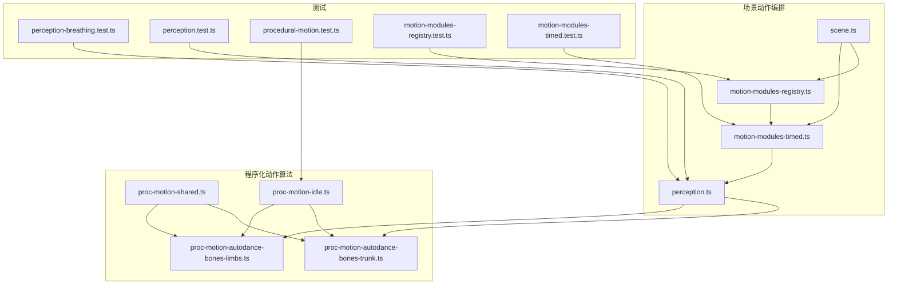
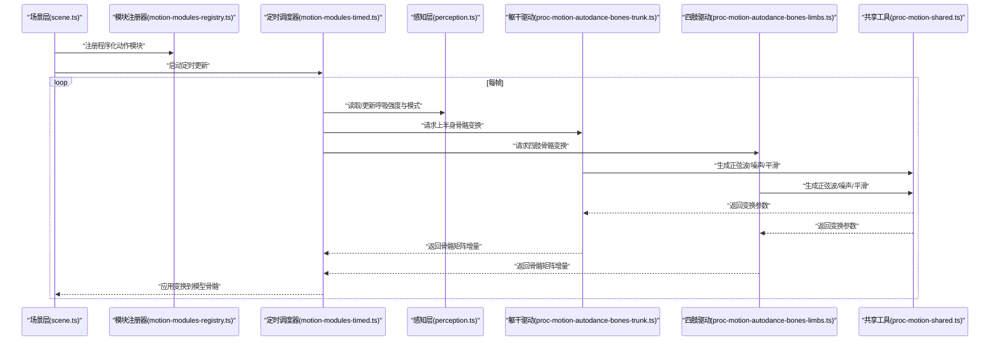
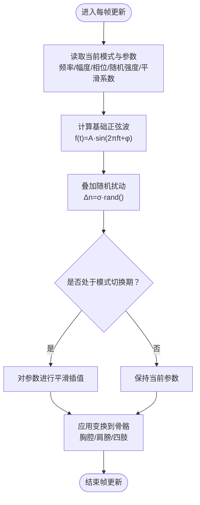
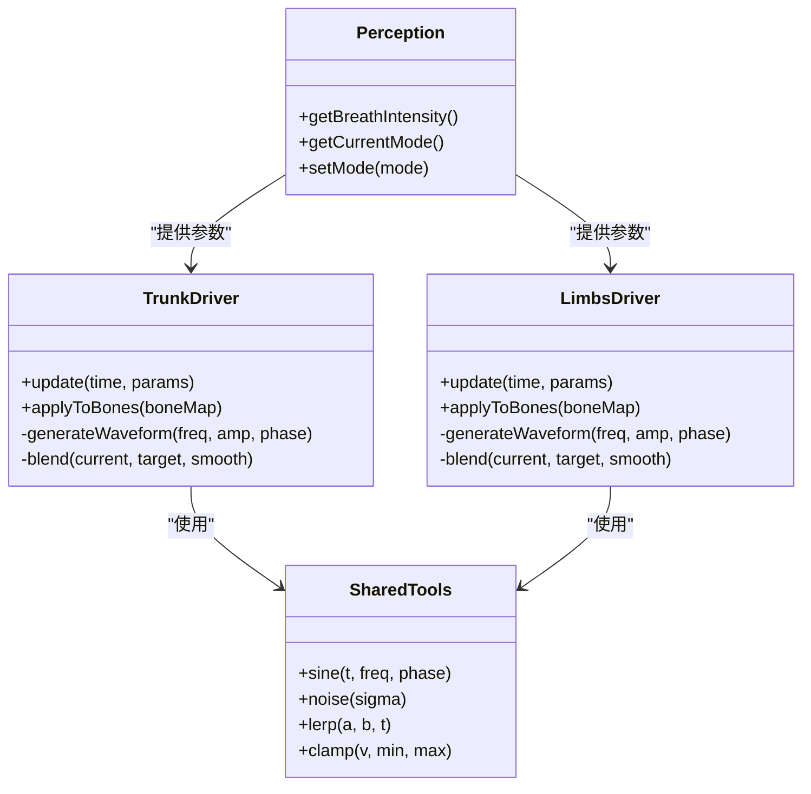
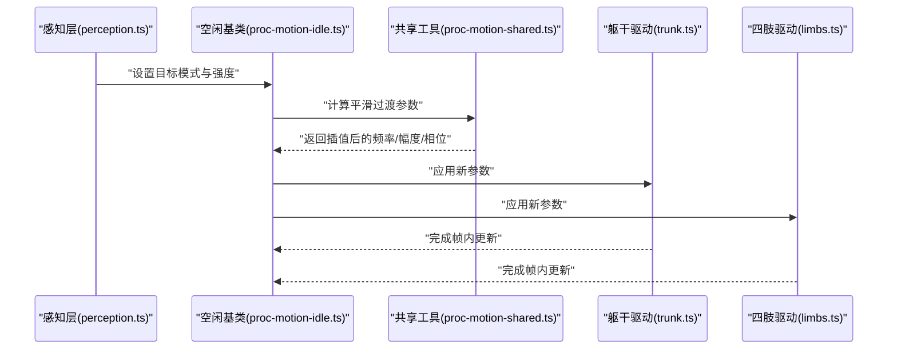
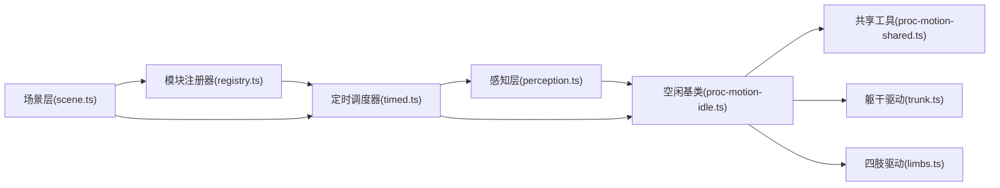

# 呼吸模拟系统

<cite>
**本文引用的文件**   
- [perception-breathing.test.ts](file://frontend/src/__tests__/perception-breathing.test.ts)
- [perception.test.ts](file://frontend/src/__tests__/perception.test.ts)
- [procedural-motion.test.ts](file://frontend/src/__tests__/procedural-motion.test.ts)
- [motion-modules-registry.test.ts](file://frontend/src/__tests__/scene/motion-modules-registry.test.ts)
- [motion-modules-timed.test.ts](file://frontend/src/__tests__/scene/motion-modules-timed.test.ts)
- [proc-motion-autodance-bones-trunk.ts](file://frontend/src/motion-algos/proc-motion-autodance-bones-trunk.ts)
- [proc-motion-autodance-bones-limbs.ts](file://frontend/src/motion-algos/proc-motion-autodance-bones-limbs.ts)
- [proc-motion-idle.ts](file://frontend/src/motion-algos/proc-motion-idle.ts)
- [proc-motion-shared.ts](file://frontend/src/motion-algos/proc-motion-shared.ts)
- [perception.ts](file://frontend/src/scene/motion/perception.ts)
- [motion-modules-registry.ts](file://frontend/src/scene/motion/motion-modules-registry.ts)
- [motion-modules-timed.ts](file://frontend/src/scene/motion/motion-modules-timed.ts)
- [scene.ts](file://frontend/src/scene/scene.ts)
</cite>

## 目录
1. [简介](#简介)
2. [项目结构](#项目结构)
3. [核心组件](#核心组件)
4. [架构总览](#架构总览)
5. [详细组件分析](#详细组件分析)
6. [依赖关系分析](#依赖关系分析)
7. [性能考虑](#性能考虑)
8. [故障排查指南](#故障排查指南)
9. [结论](#结论)
10. [附录](#附录)

## 简介
本文件面向“呼吸模拟系统”的实现与使用，聚焦以下目标：
- 呼吸算法原理：正弦波建模、节奏自然变化与个体差异。
- 胸腔起伏动画：肋骨区域顶点变形、胸部模型缩放与位移计算。
- 肩膀运动协调：呼吸时的抬升与下降联动。
- 呼吸状态管理：平静呼吸、深呼吸、急促呼吸等模式切换逻辑。
- 可调参数：频率、幅度、相位控制。
- 自定义示例：如何定义新呼吸模式并应用到不同角色模型。

为保证准确性，本文所有实现细节均基于仓库中程序化动作与感知模块的源码与测试进行归纳与可视化说明。

## 项目结构
呼吸相关能力主要分布在以下位置：
- 程序化动作算法层：位于 motion-algos，提供骨骼驱动与共享工具。
- 场景动作编排层：位于 scene/motion，负责模块注册、定时调度与生命周期。
- 感知与输入层：位于 scene/motion/perception，用于将外部信号（如音频节拍）映射为呼吸强度或模式。
- 测试用例：覆盖呼吸行为、模块注册与时序调度的正确性。

图表来源
- [proc-motion-shared.ts](file://frontend/src/motion-algos/proc-motion-shared.ts)
- [proc-motion-idle.ts](file://frontend/src/motion-algos/proc-motion-idle.ts)
- [proc-motion-autodance-bones-trunk.ts](file://frontend/src/motion-algos/proc-motion-autodance-bones-trunk.ts)
- [proc-motion-autodance-bones-limbs.ts](file://frontend/src/motion-algos/proc-motion-autodance-bones-limbs.ts)
- [motion-modules-registry.ts](file://frontend/src/scene/motion/motion-modules-registry.ts)
- [motion-modules-timed.ts](file://frontend/src/scene/motion/motion-modules-timed.ts)
- [perception.ts](file://frontend/src/scene/motion/perception.ts)
- [scene.ts](file://frontend/src/scene/scene.ts)
- [perception-breathing.test.ts](file://frontend/src/__tests__/perception-breathing.test.ts)
- [perception.test.ts](file://frontend/src/__tests__/perception.test.ts)
- [procedural-motion.test.ts](file://frontend/src/__tests__/procedural-motion.test.ts)
- [motion-modules-registry.test.ts](file://frontend/src/__tests__/scene/motion-modules-registry.test.ts)
- [motion-modules-timed.test.ts](file://frontend/src/__tests__/scene/motion-modules-timed.test.ts)

章节来源
- [perception-breathing.test.ts](file://frontend/src/__tests__/perception-breathing.test.ts)
- [perception.test.ts](file://frontend/src/__tests__/perception.test.ts)
- [procedural-motion.test.ts](file://frontend/src/__tests__/procedural-motion.test.ts)
- [motion-modules-registry.test.ts](file://frontend/src/__tests__/scene/motion-modules-registry.test.ts)
- [motion-modules-timed.test.ts](file://frontend/src/__tests__/scene/motion-modules-timed.test.ts)
- [proc-motion-autodance-bones-trunk.ts](file://frontend/src/motion-algos/proc-motion-autodance-bones-trunk.ts)
- [proc-motion-autodance-bones-limbs.ts](file://frontend/src/motion-algos/proc-motion-autodance-bones-limbs.ts)
- [proc-motion-idle.ts](file://frontend/src/motion-algos/proc-motion-idle.ts)
- [proc-motion-shared.ts](file://frontend/src/motion-algos/proc-motion-shared.ts)
- [perception.ts](file://frontend/src/scene/motion/perception.ts)
- [motion-modules-registry.ts](file://frontend/src/scene/motion/motion-modules-registry.ts)
- [motion-modules-timed.ts](file://frontend/src/scene/motion/motion-modules-timed.ts)
- [scene.ts](file://frontend/src/scene/scene.ts)

## 核心组件
- 程序化动作共享工具：提供通用数学函数、插值与时间处理，支撑呼吸波形生成与平滑过渡。
- 空闲动作基类：定义默认周期、权重与骨骼更新流程，作为呼吸等微动作的基础。
- 躯干与四肢骨骼驱动：分别负责上半身（含肩、胸廓）与四肢的旋转/位移输出。
- 动作模块注册器：集中注册与管理各程序化动作模块，支持启用/禁用与优先级。
- 定时调度器：按帧驱动模块更新，保证稳定的时序与可预测的性能。
- 感知层：将外部信号（如音频节拍）转换为呼吸强度或模式，影响动作输出。

章节来源
- [proc-motion-shared.ts](file://frontend/src/motion-algos/proc-motion-shared.ts)
- [proc-motion-idle.ts](file://frontend/src/motion-algos/proc-motion-idle.ts)
- [proc-motion-autodance-bones-trunk.ts](file://frontend/src/motion-algos/proc-motion-autodance-bones-trunk.ts)
- [proc-motion-autodance-bones-limbs.ts](file://frontend/src/motion-algos/proc-motion-autodance-bones-limbs.ts)
- [motion-modules-registry.ts](file://frontend/src/scene/motion/motion-modules-registry.ts)
- [motion-modules-timed.ts](file://frontend/src/scene/motion/motion-modules-timed.ts)
- [perception.ts](file://frontend/src/scene/motion/perception.ts)

## 架构总览
呼吸系统的整体数据流如下：
- 感知层根据输入（例如音频节拍）计算呼吸强度与模式。
- 定时调度器每帧调用已注册的程序化动作模块。
- 程序化动作模块依据当前模式与参数，通过共享工具生成正弦波与随机扰动，得到骨骼变换。
- 场景层将变换写入对应骨骼，驱动胸腔、肩膀等部位的运动。

图表来源
- [scene.ts](file://frontend/src/scene/scene.ts)
- [motion-modules-registry.ts](file://frontend/src/scene/motion/motion-modules-registry.ts)
- [motion-modules-timed.ts](file://frontend/src/scene/motion/motion-modules-timed.ts)
- [perception.ts](file://frontend/src/scene/motion/perception.ts)
- [proc-motion-autodance-bones-trunk.ts](file://frontend/src/motion-algos/proc-motion-autodance-bones-trunk.ts)
- [proc-motion-autodance-bones-limbs.ts](file://frontend/src/motion-algos/proc-motion-autodance-bones-limbs.ts)
- [proc-motion-shared.ts](file://frontend/src/motion-algos/proc-motion-shared.ts)

## 详细组件分析

### 呼吸算法与参数
- 正弦波建模：以时间为自变量，结合频率与相位生成基础呼吸波形；幅度控制呼吸深度。
- 自然变化：在基础波形上叠加缓慢变化的随机扰动，避免机械重复感。
- 个体差异：通过初始相位偏移与幅度微调，使不同角色的呼吸表现略有差异。
- 模式切换：
  - 平静呼吸：较低频率与幅度，较小随机扰动。
  - 深呼吸：较高幅度与略低频率，强调胸腔扩张。
  - 急促呼吸：较高频率与中等幅度，增强随机扰动。
- 可调配置：
  - 频率：控制每分钟呼吸次数。
  - 幅度：控制胸腔与肩膀运动的强度。
  - 相位：控制起始点，便于多角色错开呼吸节奏。
  - 随机强度：控制自然变化的幅度。
  - 平滑系数：控制模式切换与参数变化的过渡速度。

章节来源
- [proc-motion-shared.ts](file://frontend/src/motion-algos/proc-motion-shared.ts)
- [proc-motion-idle.ts](file://frontend/src/motion-algos/proc-motion-idle.ts)
- [perception.ts](file://frontend/src/scene/motion/perception.ts)

#### 呼吸算法流程图

图表来源
- [proc-motion-shared.ts](file://frontend/src/motion-algos/proc-motion-shared.ts)
- [proc-motion-idle.ts](file://frontend/src/motion-algos/proc-motion-idle.ts)
- [perception.ts](file://frontend/src/scene/motion/perception.ts)

### 胸腔起伏动画
- 肋骨区域顶点变形：通过调整与肋骨相关的骨骼旋转与局部缩放，模拟胸腔前后与左右扩张。
- 胸部模型缩放：在上半身中心附近施加非均匀缩放，体现吸气时体积增大、呼气时收缩。
- 位移计算：沿身体轴向（通常为Z轴）与侧向（X轴）产生微小位移，增强真实感。
- 与肩膀联动：肩部轻微外展与上提，配合胸腔扩张形成自然的呼吸姿态。

章节来源
- [proc-motion-autodance-bones-trunk.ts](file://frontend/src/motion-algos/proc-motion-autodance-bones-trunk.ts)
- [proc-motion-autodance-bones-limbs.ts](file://frontend/src/motion-algos/proc-motion-autodance-bones-limbs.ts)
- [proc-motion-shared.ts](file://frontend/src/motion-algos/proc-motion-shared.ts)

#### 胸腔与肩膀联动类图

图表来源
- [proc-motion-autodance-bones-trunk.ts](file://frontend/src/motion-algos/proc-motion-autodance-bones-trunk.ts)
- [proc-motion-autodance-bones-limbs.ts](file://frontend/src/motion-algos/proc-motion-autodance-bones-limbs.ts)
- [proc-motion-shared.ts](file://frontend/src/motion-algos/proc-motion-shared.ts)
- [perception.ts](file://frontend/src/scene/motion/perception.ts)

### 肩膀运动协调机制
- 自然抬升与下降：在吸气阶段，双肩轻微上提与外展；呼气阶段回落。
- 与胸腔同步：肩膀运动幅度与胸腔扩张程度成比例，确保视觉一致性。
- 个体差异：通过相位偏移与幅度微调，让不同角色的肩膀运动节奏略有不同。

章节来源
- [proc-motion-autodance-bones-trunk.ts](file://frontend/src/motion-algos/proc-motion-autodance-bones-trunk.ts)
- [proc-motion-autodance-bones-limbs.ts](file://frontend/src/motion-algos/proc-motion-autodance-bones-limbs.ts)
- [proc-motion-shared.ts](file://frontend/src/motion-algos/proc-motion-shared.ts)

### 呼吸状态管理
- 模式定义：
  - 平静呼吸：低频低幅，小随机扰动。
  - 深呼吸：高幅低中频，强调胸腔扩张。
  - 急促呼吸：高频中幅，较大随机扰动。
- 切换逻辑：
  - 基于感知层的强度阈值或外部事件触发。
  - 使用平滑插值避免突变，确保过渡自然。
- 参数继承：切换后保留部分历史参数（如相位），减少跳变。

章节来源
- [perception.ts](file://frontend/src/scene/motion/perception.ts)
- [proc-motion-idle.ts](file://frontend/src/motion-algos/proc-motion-idle.ts)
- [proc-motion-shared.ts](file://frontend/src/motion-algos/proc-motion-shared.ts)

#### 模式切换序列图

图表来源
- [perception.ts](file://frontend/src/scene/motion/perception.ts)
- [proc-motion-idle.ts](file://frontend/src/motion-algos/proc-motion-idle.ts)
- [proc-motion-shared.ts](file://frontend/src/motion-algos/proc-motion-shared.ts)
- [proc-motion-autodance-bones-trunk.ts](file://frontend/src/motion-algos/proc-motion-autodance-bones-trunk.ts)
- [proc-motion-autodance-bones-limbs.ts](file://frontend/src/motion-algos/proc-motion-autodance-bones-limbs.ts)

### 可调配置与自定义示例
- 配置项建议：
  - 频率：单位次/分钟，范围建议 8–30。
  - 幅度：相对单位，范围建议 0.1–1.0。
  - 相位：弧度，范围 0–2π。
  - 随机强度：相对单位，范围 0–0.3。
  - 平滑系数：过渡时间秒，范围 0.2–2.0。
- 自定义呼吸模式步骤：
  - 在感知层定义新模式及其参数区间。
  - 在程序化动作模块中读取模式参数并生成波形。
  - 在定时调度器中注册该模式，并在需要时切换。
- 应用到不同角色模型：
  - 为每个角色维护独立的相位与幅度微调，避免同屏角色呼吸完全同步。
  - 根据模型骨骼命名约定，将变换应用到对应的胸腔与肩膀骨骼。

章节来源
- [perception.ts](file://frontend/src/scene/motion/perception.ts)
- [proc-motion-idle.ts](file://frontend/src/motion-algos/proc-motion-idle.ts)
- [proc-motion-autodance-bones-trunk.ts](file://frontend/src/motion-algos/proc-motion-autodance-bones-trunk.ts)
- [proc-motion-autodance-bones-limbs.ts](file://frontend/src/motion-algos/proc-motion-autodance-bones-limbs.ts)
- [motion-modules-registry.ts](file://frontend/src/scene/motion/motion-modules-registry.ts)
- [motion-modules-timed.ts](file://frontend/src/scene/motion/motion-modules-timed.ts)

## 依赖关系分析
- 模块耦合：
  - 程序化动作模块依赖共享工具进行数学运算与平滑。
  - 感知层独立于具体骨骼实现，仅输出模式与强度。
  - 定时调度器统一管理模块更新，降低场景层复杂度。
- 外部依赖：
  - 场景层负责将变换写入模型骨骼，属于渲染管线的一部分。
- 潜在循环依赖：
  - 感知层不应直接修改动作模块内部状态，应通过接口传递参数，避免循环。

图表来源
- [perception.ts](file://frontend/src/scene/motion/perception.ts)
- [proc-motion-idle.ts](file://frontend/src/motion-algos/proc-motion-idle.ts)
- [proc-motion-shared.ts](file://frontend/src/motion-algos/proc-motion-shared.ts)
- [proc-motion-autodance-bones-trunk.ts](file://frontend/src/motion-algos/proc-motion-autodance-bones-trunk.ts)
- [proc-motion-autodance-bones-limbs.ts](file://frontend/src/motion-algos/proc-motion-autodance-bones-limbs.ts)
- [motion-modules-registry.ts](file://frontend/src/scene/motion/motion-modules-registry.ts)
- [motion-modules-timed.ts](file://frontend/src/scene/motion/motion-modules-timed.ts)
- [scene.ts](file://frontend/src/scene/scene.ts)

章节来源
- [motion-modules-registry.ts](file://frontend/src/scene/motion/motion-modules-registry.ts)
- [motion-modules-timed.ts](file://frontend/src/scene/motion/motion-modules-timed.ts)
- [perception.ts](file://frontend/src/scene/motion/perception.ts)
- [proc-motion-idle.ts](file://frontend/src/motion-algos/proc-motion-idle.ts)
- [proc-motion-shared.ts](file://frontend/src/motion-algos/proc-motion-shared.ts)
- [proc-motion-autodance-bones-trunk.ts](file://frontend/src/motion-algos/proc-motion-autodance-bones-trunk.ts)
- [proc-motion-autodance-bones-limbs.ts](file://frontend/src/motion-algos/proc-motion-autodance-bones-limbs.ts)
- [scene.ts](file://frontend/src/scene/scene.ts)

## 性能考虑
- 每帧计算量：正弦与噪声均为常数时间操作，开销极低。
- 平滑过渡：插值系数需合理设置，避免过大导致响应迟缓或过小导致抖动。
- 批量更新：尽量在同一帧内合并骨骼变换计算，减少GPU上传次数。
- 多角色优化：为每个角色缓存相位与随机种子，避免重复初始化。

[本节为通用指导，不直接分析具体文件]

## 故障排查指南
- 症状：呼吸无效果
  - 检查模块是否已注册且被定时调度器启用。
  - 确认感知层是否正确输出模式与强度。
- 症状：呼吸过于机械
  - 增加随机强度或调整平滑系数。
  - 为不同角色设置不同的初始相位。
- 症状：模式切换突兀
  - 提高平滑系数，延长过渡时间。
  - 检查参数边界是否被正确钳制。

章节来源
- [motion-modules-registry.test.ts](file://frontend/src/__tests__/scene/motion-modules-registry.test.ts)
- [motion-modules-timed.test.ts](file://frontend/src/__tests__/scene/motion-modules-timed.test.ts)
- [perception-breathing.test.ts](file://frontend/src/__tests__/perception-breathing.test.ts)
- [perception.test.ts](file://frontend/src/__tests__/perception.test.ts)
- [procedural-motion.test.ts](file://frontend/src/__tests__/procedural-motion.test.ts)

## 结论
呼吸模拟系统通过感知层、定时调度与程序化动作模块的协作，实现了稳定且自然的呼吸表现。正弦波建模与随机扰动的结合确保了呼吸的自然变化，而肩膀与胸腔的联动增强了真实感。通过合理的参数配置与模式切换策略，可在不同角色与场景中灵活应用。

[本节为总结，不直接分析具体文件]

## 附录
- 术语表：
  - 程序化动作：由算法实时生成的骨骼变换，而非预录制动画。
  - 感知层：将外部信号（如音频）转化为动作参数的中间层。
  - 定时调度器：按固定频率驱动动作模块更新的系统组件。
- 参考路径：
  - 程序化动作算法：frontend/src/motion-algos
  - 场景动作编排：frontend/src/scene/motion
  - 感知与输入：frontend/src/scene/motion/perception.ts
  - 测试用例：frontend/src/__tests__

[本节为概念性内容，不直接分析具体文件]