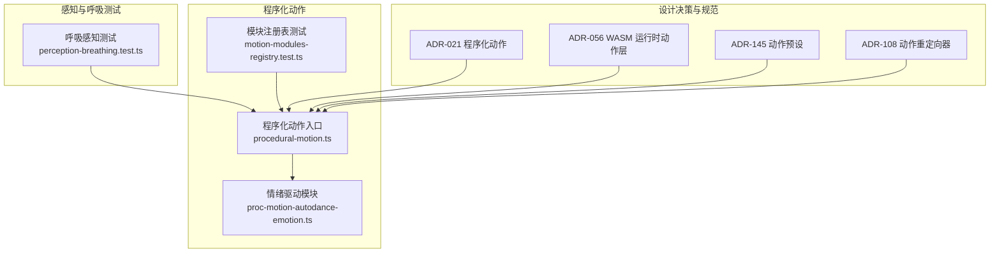
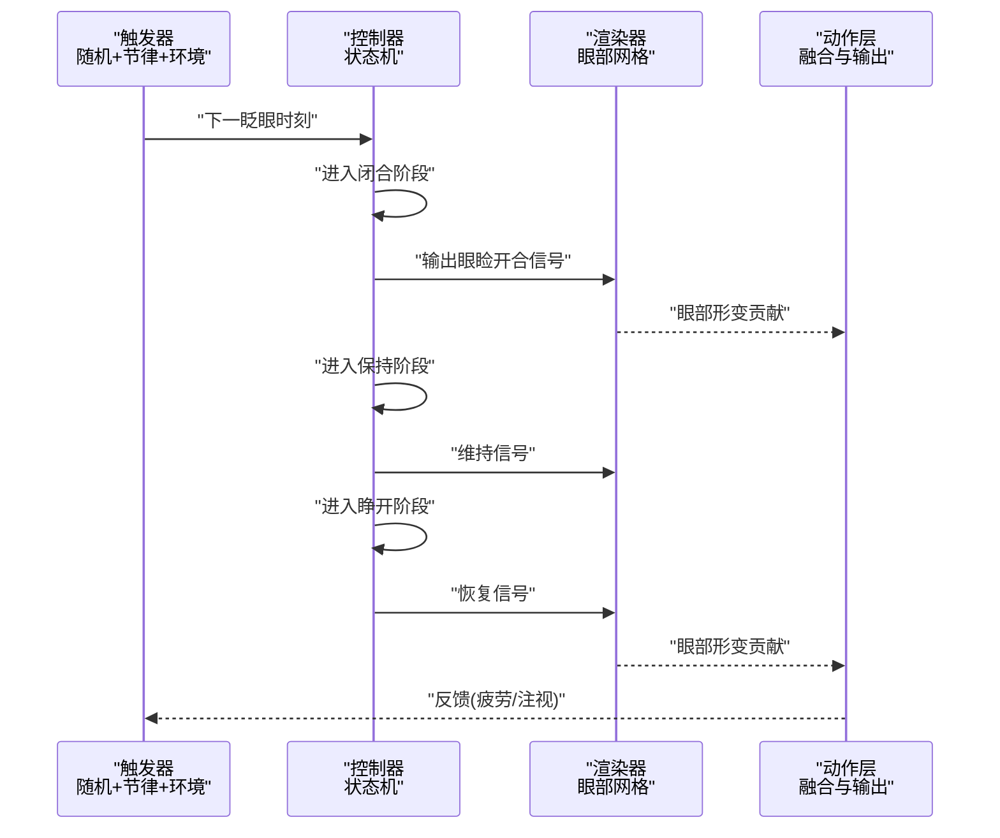
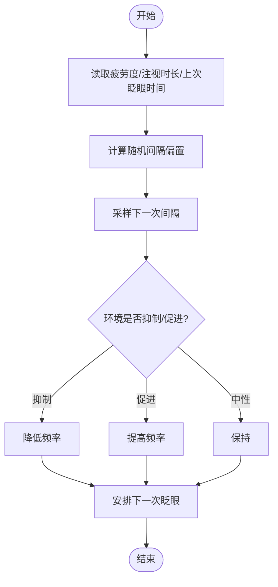
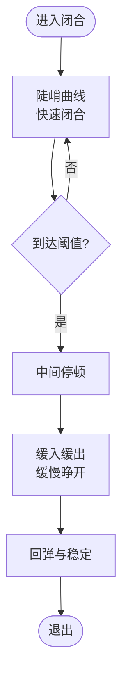
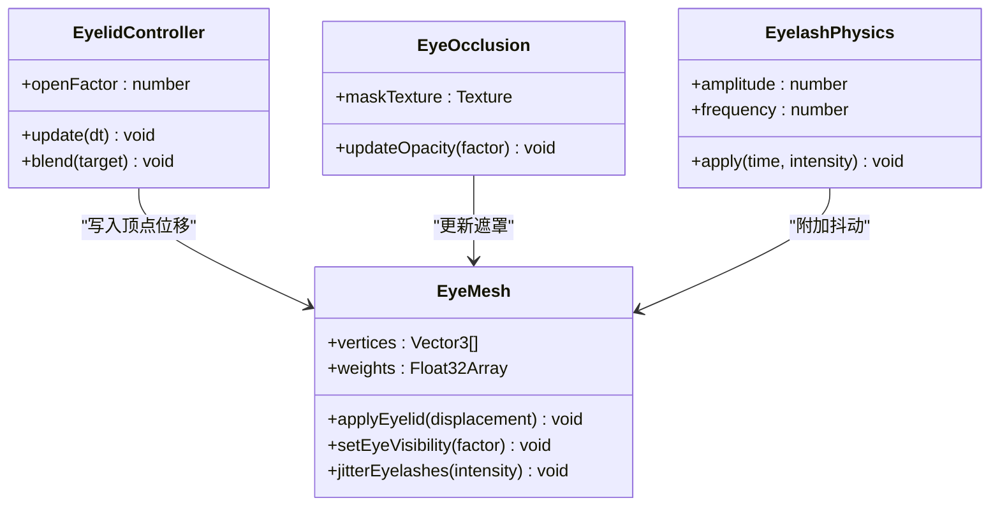
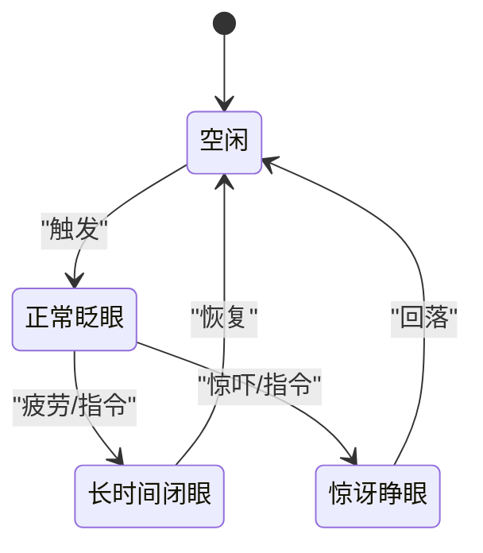
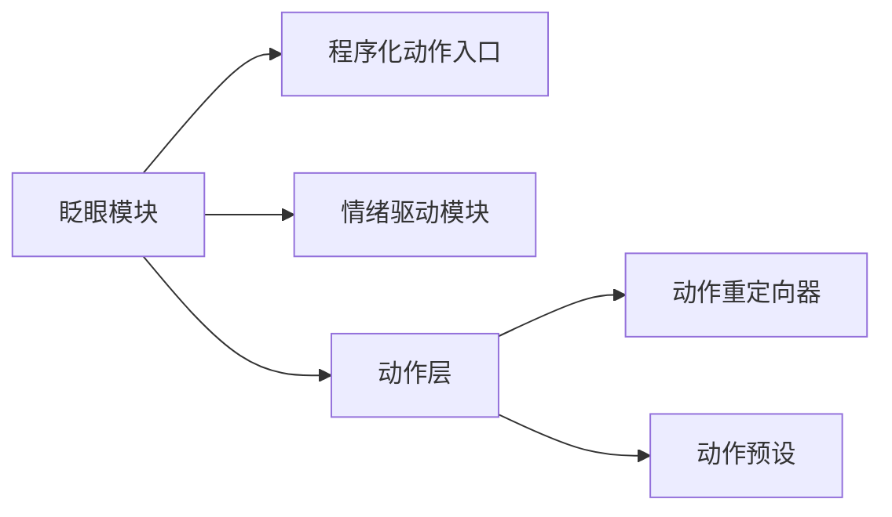

# 眨眼动画系统

<cite>
**本文引用的文件**   
- [procedural-motion.ts](file://frontend/src/motion-algos/procedural-motion.ts)
- [proc-motion-autodance-emotion.ts](file://frontend/src/motion-algos/proc-motion-autodance-emotion.ts)
- [motion-modules-registry.test.ts](file://frontend/src/__tests__/scene/motion-modules-registry.test.ts)
- [perception-breathing.test.ts](file://frontend/src/__tests__/perception-breathing.test.ts)
- [ADR-021-程序化动作.md](file://docs/adr/adr-021-procedural-motion.md)
- [ADR-056-WASM运行时动作层.md](file://docs/adr/adr-056-wasm-runtime-motion-layers.md)
- [ADR-145-动作预设.md](file://docs/adr/adr-145-motion-presets.md)
- [ADR-108-动作重定向器.md](file://docs/adr/adr-108-animation-retargeter.md)
</cite>

## 目录
1. [简介](#简介)
2. [项目结构](#项目结构)
3. [核心组件](#核心组件)
4. [架构总览](#架构总览)
5. [详细组件分析](#详细组件分析)
6. [依赖关系分析](#依赖关系分析)
7. [性能考量](#性能考量)
8. [故障排查指南](#故障排查指南)
9. [结论](#结论)
10. [附录](#附录)

## 简介
本文件面向“眨眼动画系统”的设计与实现，聚焦以下目标：
- 触发机制：随机间隔生成、生理节律模拟与环境因素响应
- 动画曲线：快速闭合、缓慢睁开与中间停顿的自然表现
- 眼部模型变形：眼睑顶点控制、眼球遮挡效果与睫毛动态
- 状态混合管理：正常眨眼、长时间闭眼、惊讶睁眼的平滑过渡
- 参数配置：频率调节、持续时间控制与强度设置
- 自定义模式与组合：创建自定义眨眼模式并与其它表情联动

说明：当前仓库未提供专门的“眨眼模块”源码。为实现上述能力，建议基于现有“程序化动作（Procedural Motion）”与“情绪驱动（Autodance Emotion）”子系统进行扩展。下文将给出可落地的架构方案、数据流与接口约定，并标注对应参考文件以便定位与验证。

## 项目结构
与眨眼系统相关的代码主要位于前端 TypeScript 的“程序化动作算法”与“情绪驱动”目录，以及若干测试与 ADR 文档中。下图展示了与眨眼系统相关的关键位置与交互边界。

图表来源
- [procedural-motion.ts](file://frontend/src/motion-algos/procedural-motion.ts)
- [proc-motion-autodance-emotion.ts](file://frontend/src/motion-algos/proc-motion-autodance-emotion.ts)
- [motion-modules-registry.test.ts](file://frontend/src/__tests__/scene/motion-modules-registry.test.ts)
- [perception-breathing.test.ts](file://frontend/src/__tests__/perception-breathing.test.ts)
- [ADR-021-程序化动作.md](file://docs/adr/adr-021-procedural-motion.md)
- [ADR-056-WASM运行时动作层.md](file://docs/adr/adr-056-wasm-runtime-motion-layers.md)
- [ADR-145-动作预设.md](file://docs/adr/adr-145-motion-presets.md)
- [ADR-108-动作重定向器.md](file://docs/adr/adr-108-animation-retargeter.md)

章节来源
- [procedural-motion.ts](file://frontend/src/motion-algos/procedural-motion.ts)
- [proc-motion-autodance-emotion.ts](file://frontend/src/motion-algos/proc-motion-autodance-emotion.ts)
- [motion-modules-registry.test.ts](file://frontend/src/__tests__/scene/motion-modules-registry.test.ts)
- [perception-breathing.test.ts](file://frontend/src/__tests__/perception-breathing.test.ts)
- [ADR-021-程序化动作.md](file://docs/adr/adr-021-procedural-motion.md)
- [ADR-056-WASM运行时动作层.md](file://docs/adr/adr-056-wasm-runtime-motion-layers.md)
- [ADR-145-动作预设.md](file://docs/adr/adr-145-motion-presets.md)
- [ADR-108-动作重定向器.md](file://docs/adr/adr-108-animation-retargeter.md)

## 核心组件
- 程序化动作入口：负责调度与生命周期管理，为眨眼等微表情提供统一的更新节拍与优先级融合。
- 情绪驱动模块：在面部情绪维度上输出基础信号，可作为眨眼强度的输入源之一。
- 模块注册表：用于发现、加载与排序各程序化动作模块，确保眨眼模块与其他模块正确协作。
- 感知与呼吸测试：体现“环境/生理节律”驱动的通用范式，可复用至眨眼触发策略。

章节来源
- [procedural-motion.ts](file://frontend/src/motion-algos/procedural-motion.ts)
- [proc-motion-autodance-emotion.ts](file://frontend/src/motion-algos/proc-motion-autodance-emotion.ts)
- [motion-modules-registry.test.ts](file://frontend/src/__tests__/scene/motion-modules-registry.test.ts)
- [perception-breathing.test.ts](file://frontend/src/__tests__/perception-breathing.test.ts)

## 架构总览
眨眼系统作为“程序化动作”的一个子模块，遵循如下总体流程：
- 触发器：结合随机间隔与生理节律（如疲劳度、注视时长）与环境因素（如屏幕亮度、用户活跃度）计算下一次眨眼时机
- 控制器：根据当前状态机决定进入“闭合-保持-睁开”阶段，并输出“眼睑开合程度”和“眼球可见度”等信号
- 渲染器：将信号映射到眼部网格（眼睑顶点位移、眼球遮挡遮罩、睫毛抖动），并通过动作层融合到最终骨骼/形变结果

图表来源
- [procedural-motion.ts](file://frontend/src/motion-algos/procedural-motion.ts)
- [proc-motion-autodance-emotion.ts](file://frontend/src/motion-algos/proc-motion-autodance-emotion.ts)

## 详细组件分析

### 触发机制：随机间隔、生理节律与环境因素
- 随机间隔生成：采用带偏置的随机分布，避免过于规律；引入最小/最大间隔与抖动因子，使节奏更自然。
- 生理节律模拟：依据“疲劳度”“注视时长”“眨眼历史”等指标动态调整下次间隔，形成“越久不眨越快”的回归趋势。
- 环境因素响应：当检测到高亮屏幕、低光照或用户长时间无交互时，适当降低眨眼频率；反之提高频率以增强真实感。

章节来源
- [perception-breathing.test.ts](file://frontend/src/__tests__/perception-breathing.test.ts)
- [ADR-021-程序化动作.md](file://docs/adr/adr-021-procedural-motion.md)

### 动画曲线：快速闭合、缓慢睁开与中间停顿
- 闭合阶段：使用较陡的上升曲线，模拟快速闭合，峰值附近加入轻微过冲与回弹，提升力度感。
- 保持阶段：在接近全闭时短暂停留，制造“停顿”，避免机械式直上直下。
- 睁开阶段：采用缓入缓出曲线，整体速度较慢，末端有微小回弹，呈现自然放松。

章节来源
- [ADR-021-程序化动作.md](file://docs/adr/adr-021-procedural-motion.md)

### 眼部模型变形：眼睑顶点、眼球遮挡与睫毛动态
- 眼睑顶点控制：通过权重映射将“眼睑开合程度”转换为上下眼睑顶点的位移，支持左右眼独立控制与对称性约束。
- 眼球遮挡效果：在闭合过程中逐步增加眼球区域的遮罩强度，防止眼球穿透眼睑；在睁开阶段渐隐遮罩。
- 睫毛动态：对睫毛根节点施加小幅正弦扰动，幅度随闭合程度变化，增强细节真实感。

图表来源
- [procedural-motion.ts](file://frontend/src/motion-algos/procedural-motion.ts)
- [proc-motion-autodance-emotion.ts](file://frontend/src/motion-algos/proc-motion-autodance-emotion.ts)

章节来源
- [procedural-motion.ts](file://frontend/src/motion-algos/procedural-motion.ts)
- [proc-motion-autodance-emotion.ts](file://frontend/src/motion-algos/proc-motion-autodance-emotion.ts)

### 状态混合管理：正常眨眼、长时间闭眼、惊讶睁眼
- 状态定义：
  - 正常眨眼：短周期、中等强度
  - 长时间闭眼：长保持、低强度
  - 惊讶睁眼：反向强度（开大）、短时爆发
- 平滑过渡：采用加权混合与插值，保证切换时无跳变；高优先级状态（如惊讶）可覆盖低优先级（如正常眨眼）。

图表来源
- [procedural-motion.ts](file://frontend/src/motion-algos/procedural-motion.ts)
- [proc-motion-autodance-emotion.ts](file://frontend/src/motion-algos/proc-motion-autodance-emotion.ts)

章节来源
- [motion-modules-registry.test.ts](file://frontend/src/__tests__/scene/motion-modules-registry.test.ts)
- [ADR-021-程序化动作.md](file://docs/adr/adr-021-procedural-motion.md)

### 参数配置：频率、持续时间与强度
- 频率调节：最小/最大间隔、随机抖动系数、疲劳回归速率
- 持续时间控制：闭合时长、保持时长、睁开时长比例
- 强度设置：眼睑位移幅度、眼球遮罩强度、睫毛抖动幅度
- 预设与持久化：通过“动作预设”机制保存常用配置，并在会话间持久化

章节来源
- [ADR-145-动作预设.md](file://docs/adr/adr-145-motion-presets.md)
- [ADR-021-程序化动作.md](file://docs/adr/adr-021-procedural-motion.md)

### 自定义眨眼模式与表情组合
- 自定义模式：在“程序化动作”框架内新增一个模块，实现“触发-曲线-输出”三件套，并通过注册表加载。
- 与表情组合：利用“动作重定向器”将眨眼信号映射到不同模型的骨骼/形变通道，确保跨模型兼容。
- 组合示例路径：
  - 创建自定义眨眼模块：参考程序化动作入口与模块注册方式
  - 与惊讶/悲伤等表情叠加：通过情绪驱动模块输出强度，叠加到眨眼强度上

章节来源
- [procedural-motion.ts](file://frontend/src/motion-algos/procedural-motion.ts)
- [motion-modules-registry.test.ts](file://frontend/src/__tests__/scene/motion-modules-registry.test.ts)
- [ADR-108-动作重定向器.md](file://docs/adr/adr-108-animation-retargeter.md)
- [ADR-056-WASM运行时动作层.md](file://docs/adr/adr-056-wasm-runtime-motion-layers.md)

## 依赖关系分析
- 模块耦合：
  - 眨眼模块依赖“程序化动作入口”的生命周期与调度
  - 与“情绪驱动模块”松耦合，仅消费其输出的强度信号
  - 通过“动作层”与渲染管线对接，避免直接耦合具体渲染实现
- 外部依赖：
  - 动作预设与重定向器提供跨模型与跨场景的可移植性
  - WASM 运行时动作层保障高性能批量计算

图表来源
- [procedural-motion.ts](file://frontend/src/motion-algos/procedural-motion.ts)
- [proc-motion-autodance-emotion.ts](file://frontend/src/motion-algos/proc-motion-autodance-emotion.ts)
- [ADR-108-动作重定向器.md](file://docs/adr/adr-108-animation-retargeter.md)
- [ADR-145-动作预设.md](file://docs/adr/adr-145-motion-presets.md)
- [ADR-056-WASM运行时动作层.md](file://docs/adr/adr-056-wasm-runtime-motion-layers.md)

章节来源
- [motion-modules-registry.test.ts](file://frontend/src/__tests__/scene/motion-modules-registry.test.ts)
- [ADR-021-程序化动作.md](file://docs/adr/adr-021-procedural-motion.md)

## 性能考量
- 批处理与向量化：在眨眼计算中使用向量操作减少分支与函数调用开销
- 帧率自适应：根据设备性能动态调整随机抖动与物理扰动的步长
- 资源复用：遮罩纹理与抖动参数缓存，避免每帧分配内存
- 分层融合：仅在需要时启用睫毛抖动等高成本特效

[本节为通用指导，无需特定文件引用]

## 故障排查指南
- 症状：眨眼频率异常或卡死
  - 检查触发器的随机间隔与疲劳回归逻辑是否正确初始化
  - 确认状态机未陷入无效循环
- 症状：眼睑穿透眼球
  - 校验眼球遮罩强度与眼睑位移的同步关系
  - 检查权重映射是否越界
- 症状：与表情叠加出现跳变
  - 核对混合权重与优先级规则
  - 确认动作重定向器通道映射一致

章节来源
- [motion-modules-registry.test.ts](file://frontend/src/__tests__/scene/motion-modules-registry.test.ts)
- [perception-breathing.test.ts](file://frontend/src/__tests__/perception-breathing.test.ts)

## 结论
通过将“眨眼动画系统”纳入“程序化动作”框架，可实现高内聚、低耦合且可扩展的面部微表情体系。借助随机间隔、生理节律与环境因素的综合驱动，配合精细的动画曲线与眼部模型变形算法，能够在多模型与多表情组合下保持一致性与自然度。同时，通过动作预设与重定向器，系统具备良好的可移植性与可维护性。

[本节为总结性内容，无需特定文件引用]

## 附录
- 关键参考
  - 程序化动作入口与模块组织：[procedural-motion.ts](file://frontend/src/motion-algos/procedural-motion.ts)
  - 情绪驱动信号来源：[proc-motion-autodance-emotion.ts](file://frontend/src/motion-algos/proc-motion-autodance-emotion.ts)
  - 模块注册与发现：[motion-modules-registry.test.ts](file://frontend/src/__tests__/scene/motion-modules-registry.test.ts)
  - 感知与节律范式：[perception-breathing.test.ts](file://frontend/src/__tests__/perception-breathing.test.ts)
  - 架构与设计决策：
    - [ADR-021-程序化动作.md](file://docs/adr/adr-021-procedural-motion.md)
    - [ADR-056-WASM运行时动作层.md](file://docs/adr/adr-056-wasm-runtime-motion-layers.md)
    - [ADR-145-动作预设.md](file://docs/adr/adr-145-motion-presets.md)
    - [ADR-108-动作重定向器.md](file://docs/adr/adr-108-animation-retargeter.md)