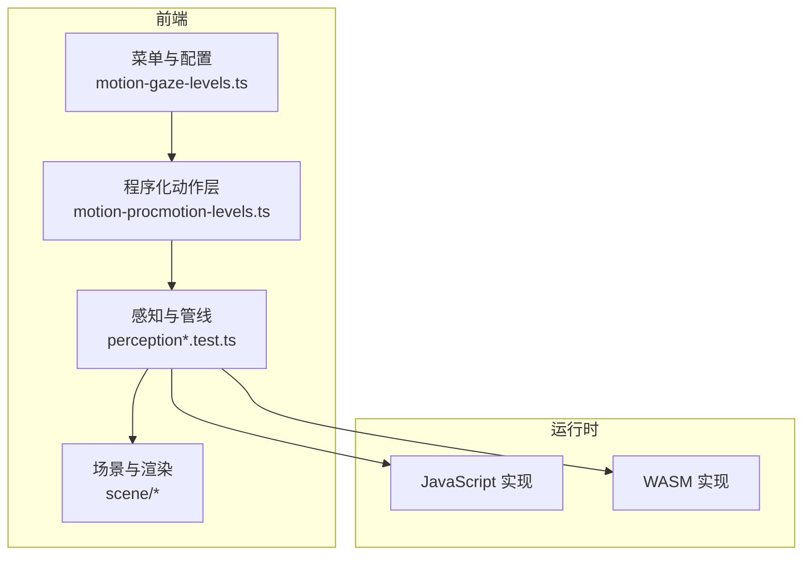
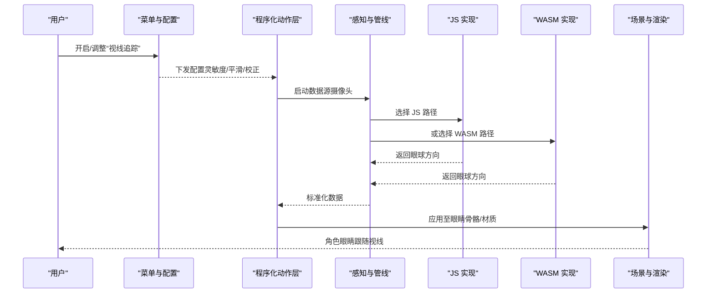
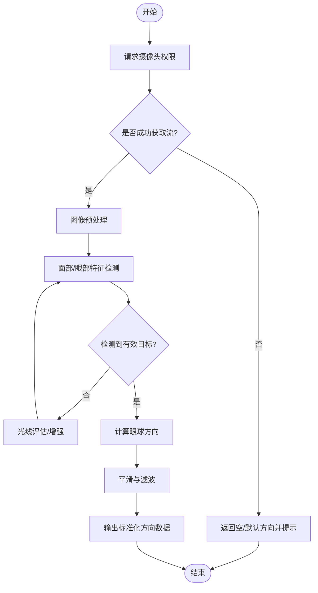
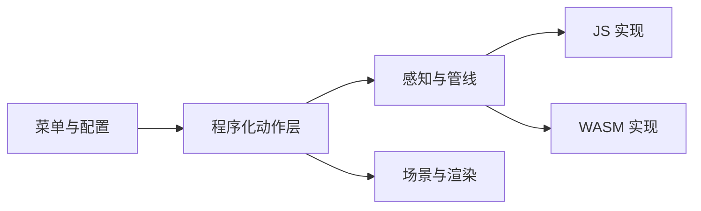

# 视线追踪系统

<cite>
**本文引用的文件**   
- [adr-016-gaze-tracking-architecture.md](file://docs/adr/adr-016-gaze-tracking-architecture.md)
- [adr-053-gaze-layer-integration.md](file://docs/adr/adr-053-gaze-layer-integration.md)
- [motion-gaze-levels.ts](file://frontend/src/menus/motion-gaze-levels.ts)
- [motion-procmotion-levels.ts](file://frontend/src/menus/motion-procmotion-levels.ts)
- [perception.test.ts](file://frontend/src/__tests__/perception.test.ts)
- [perception-breathing.test.ts](file://frontend/src/__tests__/perception-breathing.test.ts)
- [wasm-layers-blender.test.ts](file://frontend/src/__tests__/wasm-layers-blender.test.ts)
- [buglog-bone-override-gaze.md](file://docs/buglog/骨骼变换覆写无效（视线追踪 程序化骨骼旋转）.md)
</cite>

## 目录
1. [简介](#简介)
2. [项目结构](#项目结构)
3. [核心组件](#核心组件)
4. [架构总览](#架构总览)
5. [详细组件分析](#详细组件分析)
6. [依赖分析](#依赖分析)
7. [性能考虑](#性能考虑)
8. [故障排查指南](#故障排查指南)
9. [结论](#结论)
10. [附录](#附录)

## 简介
本文件面向“视线追踪系统”的完整技术文档，覆盖从摄像头采集、面部与眼球特征检测、到最终将眼球方向映射为角色眼睛模型骨骼旋转的全链路流程。文档同时对比 JavaScript 与 WASM 两种实现路径的差异与性能权衡，给出配置项说明（灵敏度、平滑、误差校正）、异常处理策略（摄像头不可用、光线不足），并提供可操作的启用与配置步骤指引。

## 项目结构
本项目采用前端 TypeScript + Go 后端 + WebAssembly 混合架构。视线追踪相关能力主要位于前端模块中：
- 菜单与配置层：提供 UI 开关与参数调节入口
- 感知与动作层：负责数据管线与算法调用（JS/WASM）
- 场景与渲染层：将计算结果应用到模型骨骼与材质效果
- ADR 文档：记录架构决策与演进历史

图表来源
- [motion-gaze-levels.ts](file://frontend/src/menus/motion-gaze-levels.ts)
- [motion-procmotion-levels.ts](file://frontend/src/menus/motion-procmotion-levels.ts)
- [perception.test.ts](file://frontend/src/__tests__/perception.test.ts)
- [perception-breathing.test.ts](file://frontend/src/__tests__/perception-breathing.test.ts)
- [wasm-layers-blender.test.ts](file://frontend/src/__tests__/wasm-layers-blender.test.ts)

章节来源
- [adr-016-gaze-tracking-architecture.md](file://docs/adr/adr-016-gaze-tracking-architecture.md)
- [adr-053-gaze-layer-integration.md](file://docs/adr/adr-053-gaze-layer-integration.md)

## 核心组件
- 菜单与配置
  - 提供“视线追踪”功能开关与参数面板，包括灵敏度、平滑系数、误差校正等选项。
  - 通过统一的菜单层级注册机制暴露给 UI。
- 程序化动作层
  - 作为上层控制器，协调感知输入与骨骼/材质更新。
  - 支持在 JS 与 WASM 之间切换执行路径。
- 感知与管线
  - 封装摄像头访问、图像预处理、特征检测与方向估计。
  - 输出标准化的“眼球方向”数据供后续使用。
- 场景与渲染
  - 接收眼球方向数据，将其转换为模型眼睛骨骼的旋转或材质参数变化。
  - 与现有动画/物理系统协作，避免冲突。

章节来源
- [motion-gaze-levels.ts](file://frontend/src/menus/motion-gaze-levels.ts)
- [motion-procmotion-levels.ts](file://frontend/src/menus/motion-procmotion-levels.ts)
- [perception.test.ts](file://frontend/src/__tests__/perception.test.ts)
- [perception-breathing.test.ts](file://frontend/src/__tests__/perception-breathing.test.ts)
- [wasm-layers-blender.test.ts](file://frontend/src/__tests__/wasm-layers-blender.test.ts)

## 架构总览
下图展示从摄像头到角色模型的端到端数据流，以及 JS/WASM 双实现的选择点。

图表来源
- [adr-016-gaze-tracking-architecture.md](file://docs/adr/adr-016-gaze-tracking-architecture.md)
- [adr-053-gaze-layer-integration.md](file://docs/adr/adr-053-gaze-layer-integration.md)
- [motion-gaze-levels.ts](file://frontend/src/menus/motion-gaze-levels.ts)
- [motion-procmotion-levels.ts](file://frontend/src/menus/motion-procmotion-levels.ts)
- [perception.test.ts](file://frontend/src/__tests__/perception.test.ts)
- [wasm-layers-blender.test.ts](file://frontend/src/__tests__/wasm-layers-blender.test.ts)

## 详细组件分析

### 菜单与配置层（UI 与参数）
- 职责
  - 暴露“视线追踪”开关与参数（灵敏度、平滑、误差校正）。
  - 将用户设置持久化并下发到程序化动作层。
- 关键交互
  - 菜单变更事件触发程序化动作层的重新初始化或参数热更新。
- 典型用法
  - 在“动作/程序化动作”菜单下找到“视线追踪”子项进行配置。

章节来源
- [motion-gaze-levels.ts](file://frontend/src/menus/motion-gaze-levels.ts)
- [motion-procmotion-levels.ts](file://frontend/src/menus/motion-procmotion-levels.ts)

### 程序化动作层（控制器）
- 职责
  - 管理“视线追踪”生命周期（启动/停止）。
  - 根据配置选择 JS 或 WASM 实现。
  - 将感知输出的“眼球方向”转换为对场景对象的写入（骨骼旋转、材质属性）。
- 关键点
  - 与现有动画/物理系统解耦，避免覆盖冲突。
  - 提供错误回退（如摄像头不可用时降级为默认状态）。

章节来源
- [motion-procmotion-levels.ts](file://frontend/src/menus/motion-procmotion-levels.ts)
- [perception.test.ts](file://frontend/src/__tests__/perception.test.ts)

### 感知与管线（摄像头、检测、方向计算）
- 职责
  - 获取摄像头视频流并进行必要的预处理（裁剪、归一化、光照补偿）。
  - 运行面部/眼球特征检测，估算眼球方向（通常为二维角度或三维向量）。
  - 输出标准化数据结构，供上层统一消费。
- 算法要点
  - 摄像头集成：权限申请、设备枚举、分辨率适配。
  - 特征检测：人脸定位、眼部区域提取、虹膜/瞳孔中心估计。
  - 方向计算：基于几何关系与相机内参，将像素坐标映射为视角方向。
- 双实现
  - JavaScript 路径：便于调试与快速迭代，适合轻量级模型。
  - WASM 路径：高性能计算，适合复杂模型与高帧率需求。

图表来源
- [perception.test.ts](file://frontend/src/__tests__/perception.test.ts)
- [perception-breathing.test.ts](file://frontend/src/__tests__/perception-breathing.test.ts)
- [wasm-layers-blender.test.ts](file://frontend/src/__tests__/wasm-layers-blender.test.ts)

章节来源
- [perception.test.ts](file://frontend/src/__tests__/perception.test.ts)
- [perception-breathing.test.ts](file://frontend/src/__tests__/perception-breathing.test.ts)
- [wasm-layers-blender.test.ts](file://frontend/src/__tests__/wasm-layers-blender.test.ts)

### 场景与渲染（骨骼绑定与视觉效果）
- 职责
  - 将“眼球方向”转换为模型眼睛骨骼的旋转矩阵或欧拉角。
  - 可选地驱动材质参数（如高光位置、瞳孔缩放）以增强真实感。
- 同步机制
  - 与现有动画系统合并时遵循优先级规则，避免被覆盖。
  - 提供偏移与限制（如最大上下/左右转动范围）。

章节来源
- [adr-053-gaze-layer-integration.md](file://docs/adr/adr-053-gaze-layer-integration.md)

## 依赖分析
- 模块耦合
  - 菜单层仅依赖配置与事件总线，低耦合。
  - 程序化动作层依赖感知层与场景层，承担编排职责。
  - 感知层可选择 JS 或 WASM 实现，具备可插拔性。
- 外部依赖
  - 浏览器媒体 API（摄像头访问）。
  - WASM 运行时加载与通信。
- 潜在循环依赖
  - 通过事件与回调解耦，避免直接双向引用。

图表来源
- [motion-gaze-levels.ts](file://frontend/src/menus/motion-gaze-levels.ts)
- [motion-procmotion-levels.ts](file://frontend/src/menus/motion-procmotion-levels.ts)
- [perception.test.ts](file://frontend/src/__tests__/perception.test.ts)
- [wasm-layers-blender.test.ts](file://frontend/src/__tests__/wasm-layers-blender.test.ts)

章节来源
- [adr-016-gaze-tracking-architecture.md](file://docs/adr/adr-016-gaze-tracking-architecture.md)
- [adr-053-gaze-layer-integration.md](file://docs/adr/adr-053-gaze-layer-integration.md)

## 性能考虑
- JS vs WASM
  - JS 路径：开发友好、易调试，但在复杂检测与高帧率场景下可能成为瓶颈。
  - WASM 路径：计算密集任务更优，适合高精度/实时性要求高的场景；需关注初始加载与内存占用。
- 流水线优化
  - 图像预处理尽量在 GPU/WebGL 或 WASM 侧完成，减少主线程压力。
  - 平滑与滤波采用轻量算法（如一阶低通），避免过度计算。
- 资源管理
  - 摄像头流按需创建与释放，避免泄漏。
  - WASM 实例复用，避免重复加载。

[本节为通用指导，不直接分析具体文件]

## 故障排查指南
- 常见问题
  - 摄像头不可用：检查权限、设备可用性、浏览器安全上下文（HTTPS）。
  - 光线不足：增加环境光或使用自动曝光/增益补偿；若仍失败则回退到默认状态。
  - 检测不稳定：提高平滑系数、放宽阈值、降低分辨率以提升稳定性。
  - 骨骼无响应：确认骨骼名称映射正确、旋转顺序一致、未被其他系统覆盖。
- 建议步骤
  - 在菜单中逐步关闭高级特性，定位问题模块。
  - 切换到 JS 路径进行调试，再切回 WASM 验证性能。
  - 查看控制台日志与测试用例，对照行为差异。

章节来源
- [buglog-bone-override-gaze.md](file://docs/buglog/骨骼变换覆写无效（视线追踪 程序化骨骼旋转）.md)

## 结论
视线追踪系统通过“菜单配置—程序化动作—感知管线—场景渲染”的分层设计，实现了灵活、可扩展且可观测的眼球方向驱动方案。JS 与 WASM 双实现兼顾了开发与性能需求。合理的配置（灵敏度、平滑、误差校正）与完善的异常处理，能够显著提升用户体验与鲁棒性。

[本节为总结性内容，不直接分析具体文件]

## 附录

### 启用与配置步骤（操作指引）
- 启用
  - 打开“动作/程序化动作”菜单，找到“视线追踪”，开启开关。
  - 授予摄像头权限，确保在 HTTPS 或本地安全环境下运行。
- 配置
  - 灵敏度：控制对微小眼动的响应强度，建议从中等值起步微调。
  - 平滑：用于抑制抖动，数值越大越稳定但延迟略增。
  - 误差校正：用于修正系统偏差（如镜头畸变、安装角度），可按设备校准。
- 切换实现
  - 在菜单中选择“JS 实现”或“WASM 实现”，观察帧率与稳定性差异后固定。
- 异常处理
  - 若摄像头不可用，系统将回退到默认状态并提示。
  - 光线不足时，可尝试提升环境亮度或启用自动增强；仍失败则暂停追踪。

章节来源
- [motion-gaze-levels.ts](file://frontend/src/menus/motion-gaze-levels.ts)
- [motion-procmotion-levels.ts](file://frontend/src/menus/motion-procmotion-levels.ts)
- [perception.test.ts](file://frontend/src/__tests__/perception.test.ts)

### 代码示例路径（不含源码）
- 菜单与配置
  - [菜单层级定义](file://frontend/src/menus/motion-gaze-levels.ts)
  - [程序化动作层级定义](file://frontend/src/menus/motion-procmotion-levels.ts)
- 感知与管线
  - [感知基础测试](file://frontend/src/__tests__/perception.test.ts)
  - [呼吸/微动感知测试](file://frontend/src/__tests__/perception-breathing.test.ts)
  - [WASM 层集成测试](file://frontend/src/__tests__/wasm-layers-blender.test.ts)
- 架构与集成
  - [视线追踪架构决策](file://docs/adr/adr-016-gaze-tracking-architecture.md)
  - [Gaze 层集成决策](file://docs/adr/adr-053-gaze-layer-integration.md)
  - [骨骼覆写问题记录](file://docs/buglog/骨骼变换覆写无效（视线追踪 程序化骨骼旋转）.md)