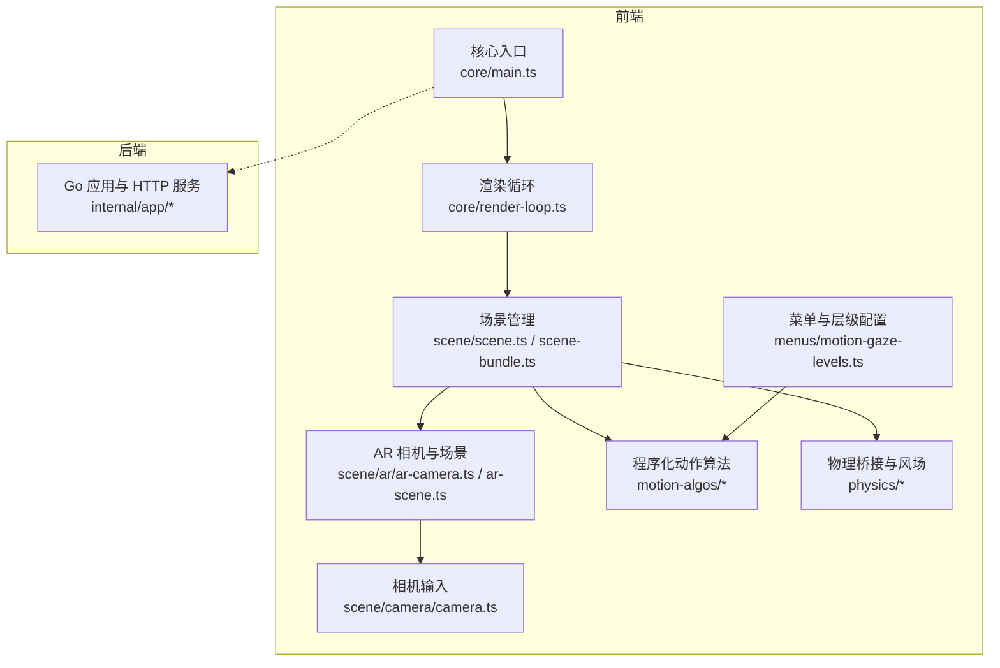
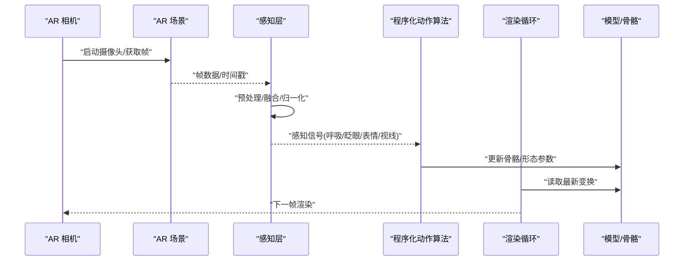
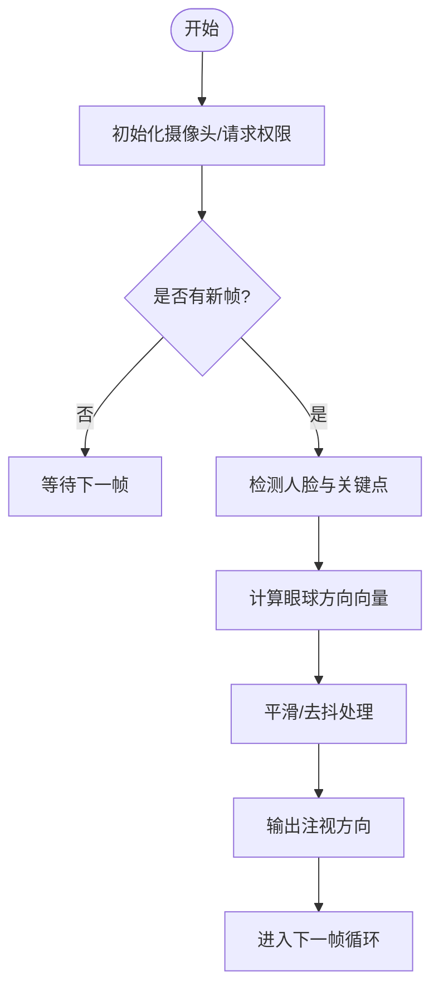
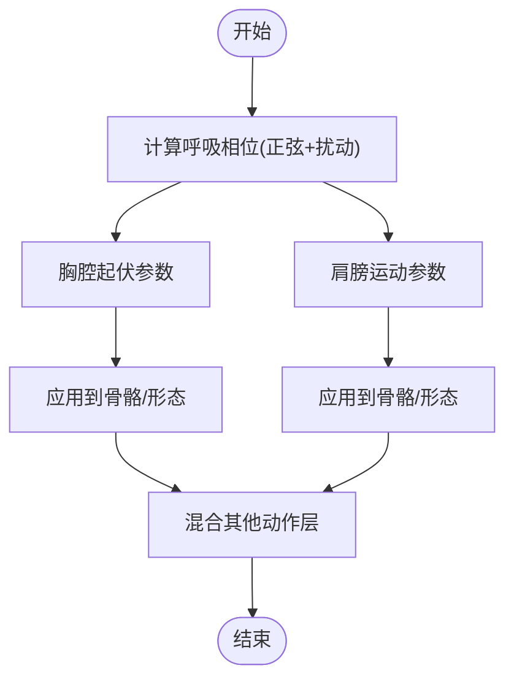
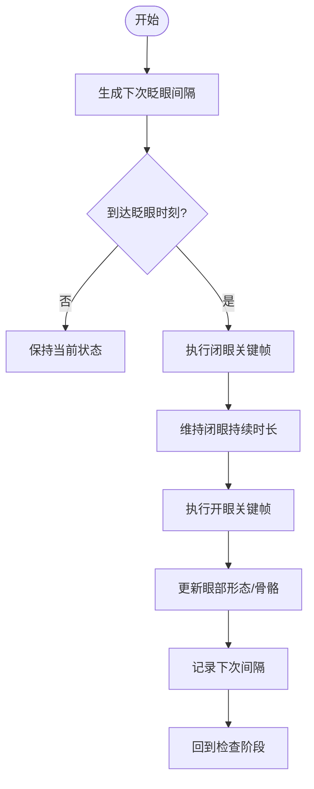
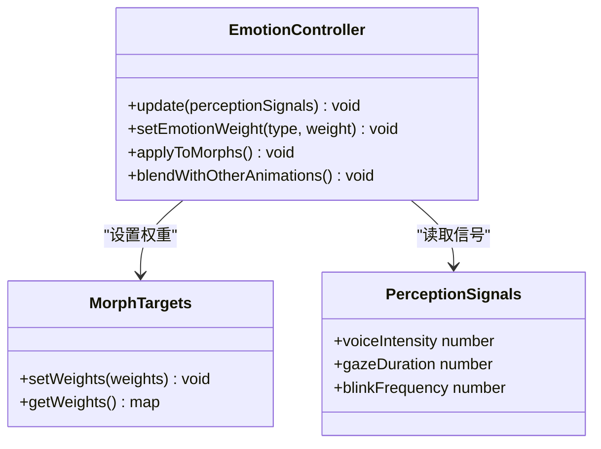
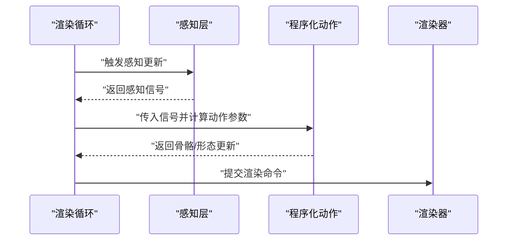
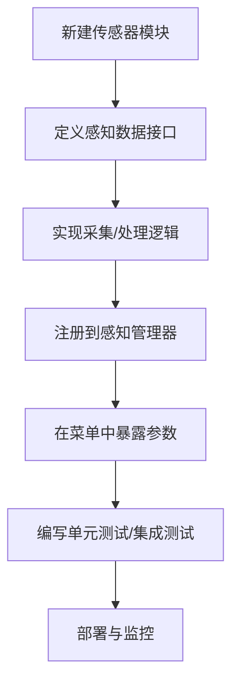
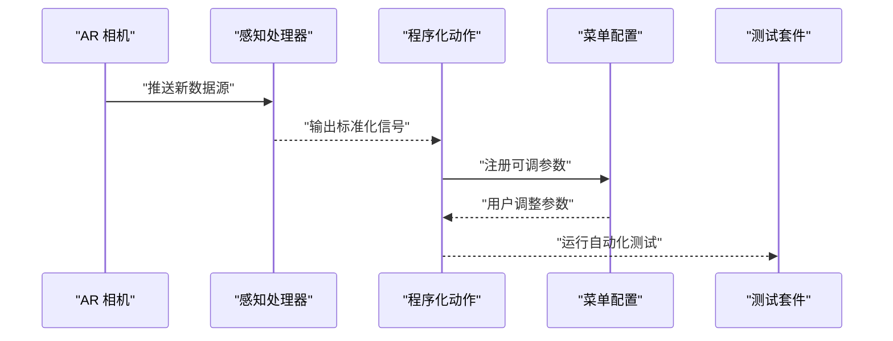
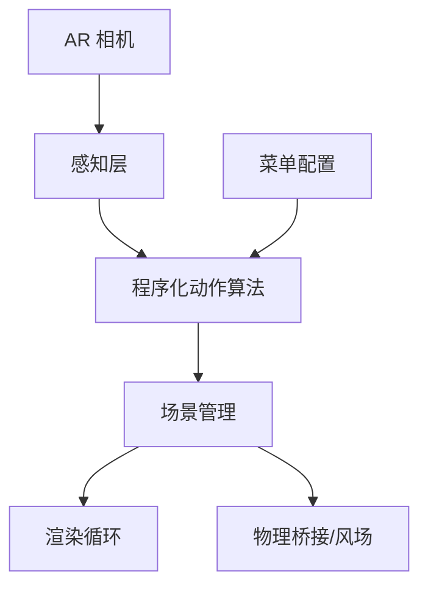

# 运动感知系统

<cite>
**本文引用的文件**   
- [adr-016-gaze-tracking-architecture.md](file://docs/adr/adr-016-gaze-tracking-architecture.md)
- [adr-053-gaze-layer-integration.md](file://docs/adr/adr-053-gaze-layer-integration.md)
- [2026-07-19-test-mock-gap-and-stale-assertions.md](file://docs/buglog/2026-07-19-test-mock-gap-and-stale-assertions.md)
- [perception-breathing.test.ts](file://frontend/src/__tests__/perception-breathing.test.ts)
- [perception.test.ts](file://frontend/src/__tests__/perception.test.ts)
- [motion-gaze-levels.ts](file://frontend/src/menus/motion-gaze-levels.ts)
- [proc-motion-autodance-emotion.ts](file://frontend/src/motion-algos/proc-motion-autodance-emotion.ts)
- [lipsync.ts](file://frontend/src/motion-algos/lipsync.ts)
- [scene-bundle.ts](file://frontend/src/scene/scene-bundle.ts)
- [scene.ts](file://frontend/src/scene/scene.ts)
- [main.ts](file://frontend/src/core/main.ts)
- [render-loop.ts](file://frontend/src/core/render-loop.ts)
- [ar-camera.ts](file://frontend/src/scene/ar/ar-camera.ts)
- [ar-scene.ts](file://frontend/src/scene/ar/ar-scene.ts)
- [camera.ts](file://frontend/src/scene/camera/camera.ts)
- [physics-bridge.ts](file://frontend/src/physics/physics-bridge.ts)
- [wind-physics.ts](file://frontend/src/physics/wind-physics.ts)
</cite>

## 目录
1. [简介](#简介)
2. [项目结构](#项目结构)
3. [核心组件](#核心组件)
4. [架构总览](#架构总览)
5. [详细组件分析](#详细组件分析)
6. [依赖分析](#依赖分析)
7. [性能考虑](#性能考虑)
8. [故障排查指南](#故障排查指南)
9. [结论](#结论)
10. [附录](#附录)

## 简介
本文件面向“运动感知系统”的完整技术文档，聚焦以下目标：
- 视线追踪实现：摄像头集成、面部特征检测与眼球方向计算。
- 呼吸模拟算法：胸腔起伏、肩膀运动与自然呼吸节奏。
- 眨眼动画：随机间隔、持续时间控制与眼部肌肉模拟。
- 表情系统集成：面部变形、情绪表达与社交互动的视觉反馈。
- 感知数据到动画系统的集成：数据流处理、实时更新与性能优化。
- 感知模块扩展开发指南：传感器接口设计与自定义感知算法实现。
- 具体示例：如何集成新的感知源并驱动相应动画效果。

## 项目结构
本项目采用前后端分离与模块化组织方式，前端以 TypeScript 为主，包含场景、渲染、动作演算、物理与环境等子系统；后端为 Go 应用，提供文件系统、HTTP 服务与平台能力封装。感知相关代码主要位于前端模块中，包括菜单配置、程序化动作算法、AR 相机与场景管理、渲染循环与主入口等。

图表来源
- [main.ts:1-200](file://frontend/src/core/main.ts#L1-L200)
- [render-loop.ts:1-200](file://frontend/src/core/render-loop.ts#L1-L200)
- [scene.ts:1-200](file://frontend/src/scene/scene.ts#L1-L200)
- [scene-bundle.ts:1-200](file://frontend/src/scene/scene-bundle.ts#L1-L200)
- [ar-camera.ts:1-200](file://frontend/src/scene/ar/ar-camera.ts#L1-L200)
- [ar-scene.ts:1-200](file://frontend/src/scene/ar/ar-scene.ts#L1-L200)
- [camera.ts:1-200](file://frontend/src/scene/camera/camera.ts#L1-L200)
- [motion-gaze-levels.ts:1-200](file://frontend/src/menus/motion-gaze-levels.ts#L1-L200)
- [physics-bridge.ts:1-200](file://frontend/src/physics/physics-bridge.ts#L1-L200)
- [wind-physics.ts:1-200](file://frontend/src/physics/wind-physics.ts#L1-L200)

章节来源
- [main.ts:1-200](file://frontend/src/core/main.ts#L1-L200)
- [render-loop.ts:1-200](file://frontend/src/core/render-loop.ts#L1-L200)
- [scene.ts:1-200](file://frontend/src/scene/scene.ts#L1-L200)
- [scene-bundle.ts:1-200](file://frontend/src/scene/scene-bundle.ts#L1-L200)
- [ar-camera.ts:1-200](file://frontend/src/scene/ar/ar-camera.ts#L1-L200)
- [ar-scene.ts:1-200](file://frontend/src/scene/ar/ar-scene.ts#L1-L200)
- [camera.ts:1-200](file://frontend/src/scene/camera/camera.ts#L1-L200)
- [motion-gaze-levels.ts:1-200](file://frontend/src/menus/motion-gaze-levels.ts#L1-L200)
- [physics-bridge.ts:1-200](file://frontend/src/physics/physics-bridge.ts#L1-L200)
- [wind-physics.ts:1-200](file://frontend/src/physics/wind-physics.ts#L1-L200)

## 核心组件
- 感知层（Perception）：负责采集与融合多源感知数据（摄像头、音频、用户输入），输出标准化信号供上层使用。
- 程序化动作（Procedural Motion）：将感知信号映射为骨骼与形态变化，驱动呼吸、眨眼、表情与视线等动画。
- AR 相机与场景：提供摄像头接入、帧数据获取与基础环境初始化，支撑视线追踪与面部检测。
- 渲染循环与主入口：统一调度感知更新、动作计算与渲染，确保实时性与稳定性。
- 菜单与层级配置：暴露可配置的感知与动作参数，便于调试与调优。

章节来源
- [perception.test.ts:1-200](file://frontend/src/__tests__/perception.test.ts#L1-L200)
- [perception-breathing.test.ts:1-200](file://frontend/src/__tests__/perception-breathing.test.ts#L1-L200)
- [motion-gaze-levels.ts:1-200](file://frontend/src/menus/motion-gaze-levels.ts#L1-L200)
- [proc-motion-autodance-emotion.ts:1-200](file://frontend/src/motion-algos/proc-motion-autodance-emotion.ts#L1-L200)
- [lipsync.ts:1-200](file://frontend/src/motion-algos/lipsync.ts#L1-L200)
- [ar-camera.ts:1-200](file://frontend/src/scene/ar/ar-camera.ts#L1-L200)
- [ar-scene.ts:1-200](file://frontend/src/scene/ar/ar-scene.ts#L1-L200)
- [render-loop.ts:1-200](file://frontend/src/core/render-loop.ts#L1-L200)
- [main.ts:1-200](file://frontend/src/core/main.ts#L1-L200)

## 架构总览
感知系统遵循“采集—融合—映射—驱动”的分层架构：
- 采集层：摄像头帧、音频波形、用户输入事件。
- 融合层：对原始数据进行滤波、平滑与归一化，生成稳定的感知信号。
- 映射层：将感知信号转换为动作参数（如呼吸幅度、眨眼概率、表情权重）。
- 驱动层：通过程序化动作与骨骼/形态系统驱动角色动画。

图表来源
- [ar-camera.ts:1-200](file://frontend/src/scene/ar/ar-camera.ts#L1-L200)
- [ar-scene.ts:1-200](file://frontend/src/scene/ar/ar-scene.ts#L1-L200)
- [render-loop.ts:1-200](file://frontend/src/core/render-loop.ts#L1-L200)
- [proc-motion-autodance-emotion.ts:1-200](file://frontend/src/motion-algos/proc-motion-autodance-emotion.ts#L1-L200)
- [lipsync.ts:1-200](file://frontend/src/motion-algos/lipsync.ts#L1-L200)

## 详细组件分析

### 视线追踪（摄像头集成、面部特征检测、眼球方向计算）
- 摄像头集成：通过 AR 相机模块获取设备摄像头权限与视频流，并在 AR 场景中绑定帧数据。
- 面部特征检测：在每帧中对人脸区域进行关键点提取（如瞳孔、虹膜边缘、眼睑轮廓），用于后续方向估计。
- 眼球方向计算：基于关键点相对位置与相机内参，估算视线向量，并进行平滑与去抖处理，输出稳定的注视方向。

图表来源
- [ar-camera.ts:1-200](file://frontend/src/scene/ar/ar-camera.ts#L1-L200)
- [ar-scene.ts:1-200](file://frontend/src/scene/ar/ar-scene.ts#L1-L200)
- [motion-gaze-levels.ts:1-200](file://frontend/src/menus/motion-gaze-levels.ts#L1-L200)

章节来源
- [adr-016-gaze-tracking-architecture.md:1-200](file://docs/adr/adr-016-gaze-tracking-architecture.md#L1-L200)
- [adr-053-gaze-layer-integration.md:1-200](file://docs/adr/adr-053-gaze-layer-integration.md#L1-L200)
- [ar-camera.ts:1-200](file://frontend/src/scene/ar/ar-camera.ts#L1-L200)
- [ar-scene.ts:1-200](file://frontend/src/scene/ar/ar-scene.ts#L1-L200)
- [motion-gaze-levels.ts:1-200](file://frontend/src/menus/motion-gaze-levels.ts#L1-L200)

### 呼吸模拟算法（胸腔起伏、肩膀运动、自然节奏）
- 呼吸周期建模：使用正弦或复合波形生成呼吸相位，结合随机扰动提升自然性。
- 胸腔起伏：根据呼吸相位调整胸骨与肋骨相关骨骼的旋转与位移。
- 肩膀运动：与胸腔联动，轻微上下移动以增强真实感。
- 自然节奏：引入低频噪声与自适应频率调节，模拟不同状态下的呼吸变化。

图表来源
- [perception-breathing.test.ts:1-200](file://frontend/src/__tests__/perception-breathing.test.ts#L1-L200)
- [proc-motion-autodance-emotion.ts:1-200](file://frontend/src/motion-algos/proc-motion-autodance-emotion.ts#L1-L200)

章节来源
- [perception-breathing.test.ts:1-200](file://frontend/src/__tests__/perception-breathing.test.ts#L1-L200)
- [proc-motion-autodance-emotion.ts:1-200](file://frontend/src/motion-algos/proc-motion-autodance-emotion.ts#L1-L200)

### 眨眼动画（随机间隔、持续时间控制、眼部肌肉模拟）
- 随机间隔：基于泊松分布或均匀随机生成下一次眨眼时间，避免机械重复。
- 持续时间控制：定义开闭眼的关键帧时长与过渡曲线，确保自然闭合与回弹。
- 眼部肌肉模拟：通过眼睑关键点与形态参数模拟上/下眼睑的收缩与扩张。

图表来源
- [perception.test.ts:1-200](file://frontend/src/__tests__/perception.test.ts#L1-L200)
- [proc-motion-autodance-emotion.ts:1-200](file://frontend/src/motion-algos/proc-motion-autodance-emotion.ts#L1-L200)

章节来源
- [perception.test.ts:1-200](file://frontend/src/__tests__/perception.test.ts#L1-L200)
- [proc-motion-autodance-emotion.ts:1-200](file://frontend/src/motion-algos/proc-motion-autodance-emotion.ts#L1-L200)

### 表情系统集成（面部变形、情绪表达、社交互动反馈）
- 面部变形：通过形态通道（morph targets）与骨骼权重组合实现微表情与强表情。
- 情绪表达：将感知信号（如语音强度、视线停留、眨眼频率）映射为情绪权重。
- 社交互动反馈：在对话或交互场景中，依据对方行为动态调整表情与姿态。

图表来源
- [proc-motion-autodance-emotion.ts:1-200](file://frontend/src/motion-algos/proc-motion-autodance-emotion.ts#L1-L200)
- [lipsync.ts:1-200](file://frontend/src/motion-algos/lipsync.ts#L1-L200)

章节来源
- [proc-motion-autodance-emotion.ts:1-200](file://frontend/src/motion-algos/proc-motion-autodance-emotion.ts#L1-L200)
- [lipsync.ts:1-200](file://frontend/src/motion-algos/lipsync.ts#L1-L200)

### 感知数据与动画系统集成（数据流处理、实时更新、性能优化）
- 数据流处理：感知层输出标准化信号，程序化动作层订阅并转换为动画参数。
- 实时更新：在渲染循环中按固定步长更新感知与动作，保证时序一致性。
- 性能优化：批量化更新、惰性计算与缓存策略，减少每帧开销。

图表来源
- [render-loop.ts:1-200](file://frontend/src/core/render-loop.ts#L1-L200)
- [scene-bundle.ts:1-200](file://frontend/src/scene/scene-bundle.ts#L1-L200)
- [scene.ts:1-200](file://frontend/src/scene/scene.ts#L1-L200)

章节来源
- [render-loop.ts:1-200](file://frontend/src/core/render-loop.ts#L1-L200)
- [scene-bundle.ts:1-200](file://frontend/src/scene/scene-bundle.ts#L1-L200)
- [scene.ts:1-200](file://frontend/src/scene/scene.ts#L1-L200)

### 感知模块扩展开发指南（传感器接口设计、自定义感知算法）
- 传感器接口设计：定义统一的感知数据格式与生命周期回调，支持热插拔。
- 自定义感知算法：实现标准接口，注册到感知管理器，参与融合与映射流程。
- 集成步骤：新增传感器模块→注册到管理器→在菜单中暴露可调参数→在测试中验证。

图表来源
- [motion-gaze-levels.ts:1-200](file://frontend/src/menus/motion-gaze-levels.ts#L1-L200)
- [perception.test.ts:1-200](file://frontend/src/__tests__/perception.test.ts#L1-L200)
- [perception-breathing.test.ts:1-200](file://frontend/src/__tests__/perception-breathing.test.ts#L1-L200)

章节来源
- [motion-gaze-levels.ts:1-200](file://frontend/src/menus/motion-gaze-levels.ts#L1-L200)
- [perception.test.ts:1-200](file://frontend/src/__tests__/perception.test.ts#L1-L200)
- [perception-breathing.test.ts:1-200](file://frontend/src/__tests__/perception-breathing.test.ts#L1-L200)

### 具体示例：集成新的感知源并驱动动画效果
- 步骤一：在 AR 相机模块中增加新的数据源（例如深度图或红外图像）。
- 步骤二：在感知层新增处理器，解析新数据并输出标准化信号。
- 步骤三：在程序化动作层添加对应的映射函数，将信号转换为骨骼/形态参数。
- 步骤四：在菜单中为新参数提供 UI 控件，便于运行时调整。
- 步骤五：编写测试用例覆盖新路径，确保稳定性与性能。

图表来源
- [ar-camera.ts:1-200](file://frontend/src/scene/ar/ar-camera.ts#L1-L200)
- [motion-gaze-levels.ts:1-200](file://frontend/src/menus/motion-gaze-levels.ts#L1-L200)
- [perception.test.ts:1-200](file://frontend/src/__tests__/perception.test.ts#L1-L200)

章节来源
- [ar-camera.ts:1-200](file://frontend/src/scene/ar/ar-camera.ts#L1-L200)
- [motion-gaze-levels.ts:1-200](file://frontend/src/menus/motion-gaze-levels.ts#L1-L200)
- [perception.test.ts:1-200](file://frontend/src/__tests__/perception.test.ts#L1-L200)

## 依赖分析
感知系统与场景、渲染、物理等模块存在紧密耦合关系，需关注以下依赖：
- 场景与 AR 相机：提供摄像头与帧数据。
- 程序化动作与表情系统：依赖感知信号进行参数映射。
- 渲染循环：统一调度感知更新与动作计算。
- 物理桥接与风场：影响身体与衣物的次级运动，间接增强感知表现。

图表来源
- [scene-bundle.ts:1-200](file://frontend/src/scene/scene-bundle.ts#L1-L200)
- [scene.ts:1-200](file://frontend/src/scene/scene.ts#L1-L200)
- [render-loop.ts:1-200](file://frontend/src/core/render-loop.ts#L1-L200)
- [physics-bridge.ts:1-200](file://frontend/src/physics/physics-bridge.ts#L1-L200)
- [wind-physics.ts:1-200](file://frontend/src/physics/wind-physics.ts#L1-L200)
- [motion-gaze-levels.ts:1-200](file://frontend/src/menus/motion-gaze-levels.ts#L1-L200)

章节来源
- [scene-bundle.ts:1-200](file://frontend/src/scene/scene-bundle.ts#L1-L200)
- [scene.ts:1-200](file://frontend/src/scene/scene.ts#L1-L200)
- [render-loop.ts:1-200](file://frontend/src/core/render-loop.ts#L1-L200)
- [physics-bridge.ts:1-200](file://frontend/src/physics/physics-bridge.ts#L1-L200)
- [wind-physics.ts:1-200](file://frontend/src/physics/wind-physics.ts#L1-L200)
- [motion-gaze-levels.ts:1-200](file://frontend/src/menus/motion-gaze-levels.ts#L1-L200)

## 性能考虑
- 帧率稳定：在渲染循环中限制感知与动作计算的耗时，避免阻塞主线程。
- 批量更新：合并骨骼与形态更新，减少 GPU/CPU 同步次数。
- 惰性计算：仅在必要时重新计算复杂感知信号（如面部关键点）。
- 资源复用：缓存中间结果与纹理，降低内存分配与 GC 压力。
- 降级策略：在低端设备上关闭高成本特性（如高精度面部检测）。

[本节为通用指导，不直接分析具体文件]

## 故障排查指南
- 测试与 Mock 问题：当测试中的 mock 对象过时或断言失效时，可能导致感知链路异常。建议定期更新测试夹具与断言。
- 常见症状：
  - 视线追踪无响应：检查摄像头权限与帧数据是否成功传递。
  - 呼吸动画不生效：确认呼吸相位计算与骨骼映射是否正确。
  - 眨眼过于频繁或不自然：调整随机间隔与持续时间参数。
  - 表情与唇语不同步：检查语音强度与形态权重映射。
- 定位方法：
  - 在渲染循环中打印感知信号与动作参数的关键值。
  - 使用菜单中的调试开关逐步隔离问题模块。
  - 运行单元测试与集成测试，复现并修复回归问题。

章节来源
- [2026-07-19-test-mock-gap-and-stale-assertions.md:1-200](file://docs/buglog/2026-07-19-test-mock-gap-and-stale-assertions.md#L1-L200)
- [perception.test.ts:1-200](file://frontend/src/__tests__/perception.test.ts#L1-L200)
- [perception-breathing.test.ts:1-200](file://frontend/src/__tests__/perception-breathing.test.ts#L1-L200)

## 结论
本运动感知系统通过分层架构实现了从摄像头到角色动画的端到端链路。视线追踪、呼吸模拟、眨眼动画与表情系统均具备可扩展性与可配置性。建议在后续迭代中继续优化性能与鲁棒性，完善测试覆盖与文档说明，以提升用户体验与开发效率。

[本节为总结性内容，不直接分析具体文件]

## 附录
- 术语表：
  - 感知信号：由感知层输出的标准化数据，用于驱动动画。
  - 程序化动作：根据感知信号实时生成的骨骼与形态变化。
  - 形态通道：用于面部与身体变形的权重集合。
- 参考文档：
  - 视线追踪架构决策：[adr-016-gaze-tracking-architecture.md](file://docs/adr/adr-016-gaze-tracking-architecture.md)
  - 视线层集成决策：[adr-053-gaze-layer-integration.md](file://docs/adr/adr-053-gaze-layer-integration.md)

[本节为补充信息，不直接分析具体文件]