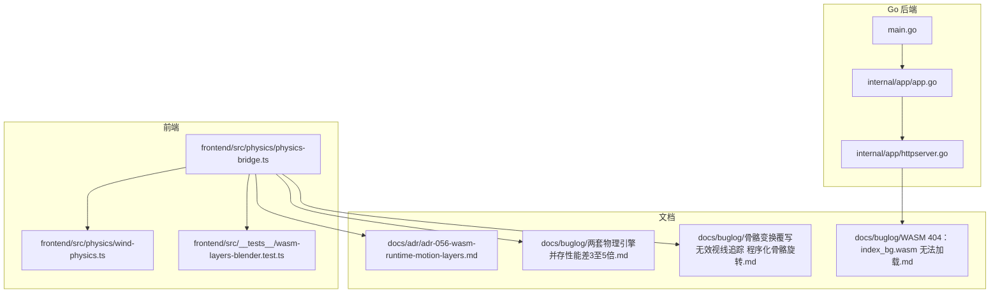
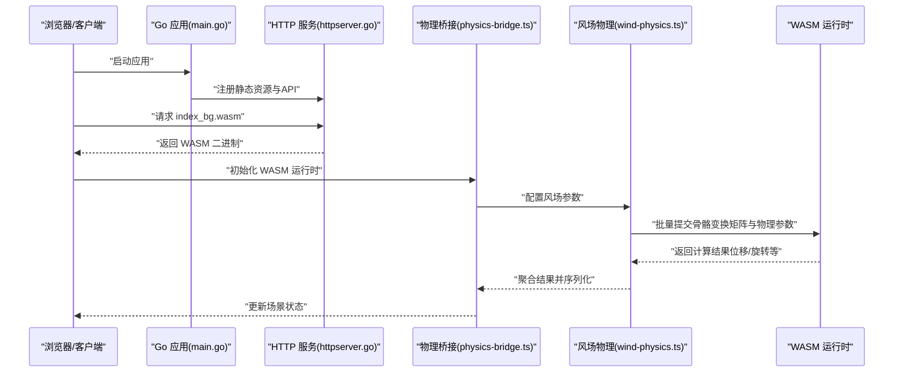
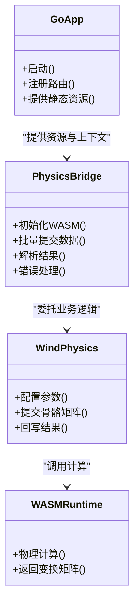
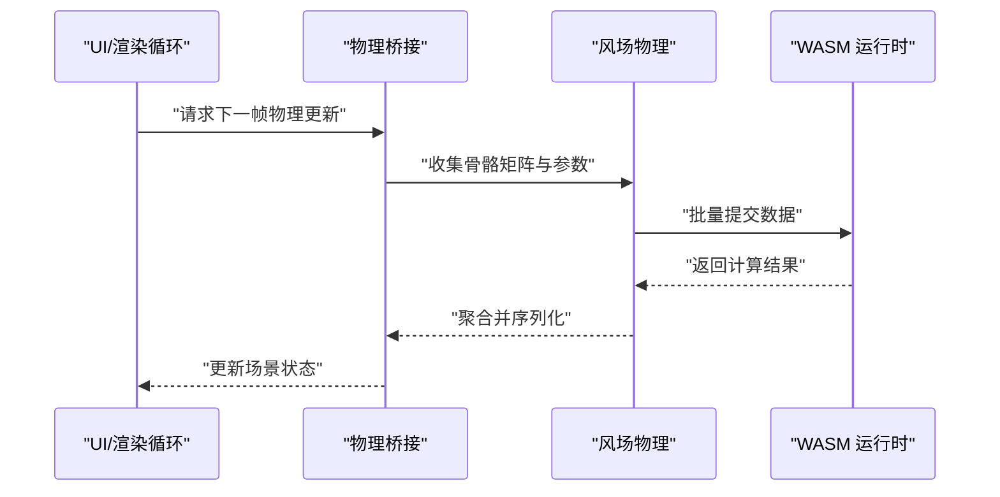
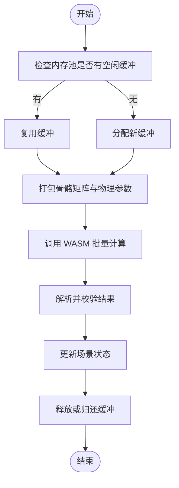
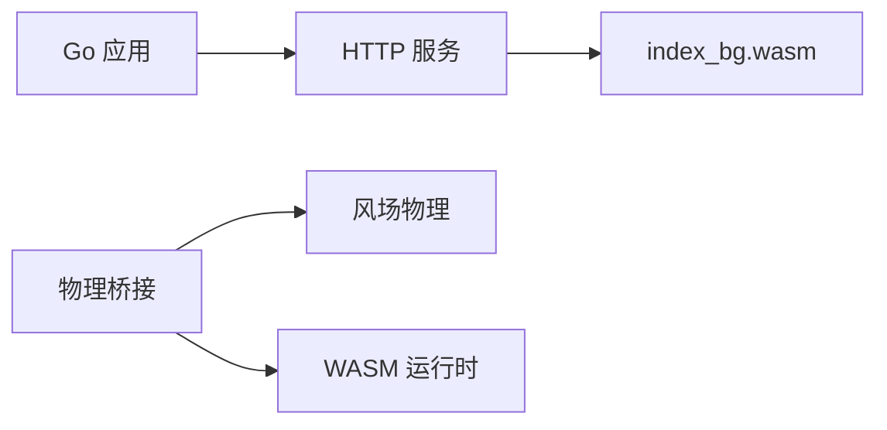

# WASM 集成与通信

<cite>
**本文引用的文件**   
- [main.go](file://main.go)
- [app.go](file://internal/app/app.go)
- [httpserver.go](file://internal/app/httpserver.go)
- [physics-bridge.ts](file://frontend/src/physics/physics-bridge.ts)
- [wind-physics.ts](file://frontend/src/physics/wind-physics.ts)
- [wasm-layers-blender.test.ts](file://frontend/src/__tests__/wasm-layers-blender.test.ts)
- [ADR-056-wasm-runtime-motion-layers.md](file://docs/adr/adr-056-wasm-runtime-motion-layers.md)
- [WASM 404：index_bg.wasm 无法加载.md](file://docs/buglog/WASM%20404%EF%BC%9Aindex_bg.wasm%20%E6%97%A0%E6%B3%95%E5%8A%A0%E8%BD%BD.md)
- [两套物理引擎并存性能差3至5倍.md](file://docs/buglog/%E4%B8%A4%E5%A5%97%E7%89%A9%E7%90%86%E5%BC%95%E6%93%8E%E5%B9%B6%E5%AD%98%E6%80%A7%E8%83%BD%E5%B7%AE3%E8%87%B35%E5%80%8D.md)
- [骨骼变换覆写无效（视线追踪 程序化骨骼旋转）.md](file://docs/buglog/%E9%AA%A8%E9%AA%B1%E5%8F%98%E6%8D%A2%E8%A6%86%E5%86%99%E6%97%A0%E6%95%88%EF%BC%88%E8%A7%86%E7%BA%BF%E8%BF%BD%E8%B8%AA%20%E7%A8%8B%E5%BA%8F%E5%8C%96%E9%AA%A8%E9%AA%B1%E6%97%8B%E8%BD%AC%EF%BC%89.md)
</cite>

## 目录
1. [简介](#简介)
2. [项目结构](#项目结构)
3. [核心组件](#核心组件)
4. [架构总览](#架构总览)
5. [详细组件分析](#详细组件分析)
6. [依赖关系分析](#依赖关系分析)
7. [性能考虑](#性能考虑)
8. [故障排查指南](#故障排查指南)
9. [结论](#结论)
10. [附录](#附录)

## 简介
本文件聚焦于 Go 后端与 WebAssembly 模块的集成与通信，围绕类型映射、内存管理、数据序列化、物理计算的数据传递流程（骨骼变换矩阵传输、物理参数配置、结果返回）、性能优化策略（批量处理、内存池、异步模式），以及调用示例、错误处理与性能监控展开。文档同时提供调试技巧与常见问题解决方案，帮助读者快速定位并解决跨语言边界（Go ↔ WASM）的典型问题。

## 项目结构
本项目采用前后端分离与多语言协作的架构：
- Go 后端负责应用生命周期、资源访问、HTTP 服务与 Wails 绑定。
- 前端 TypeScript 通过桥接层与 WASM 运行时交互，完成物理计算与渲染管线中的数据交换。
- ADR 与 Buglog 文档记录了关键决策与已知问题，为理解集成方式提供背景。

图表来源
- [main.go:1-20](file://main.go#L1-L20)
- [app.go:1-40](file://internal/app/app.go#L1-L40)
- [httpserver.go:1-40](file://internal/app/httpserver.go#L1-L40)
- [physics-bridge.ts:1-60](file://frontend/src/physics/physics-bridge.ts#L1-L60)
- [wind-physics.ts:1-60](file://frontend/src/physics/wind-physics.ts#L1-L60)
- [wasm-layers-blender.test.ts:1-40](file://frontend/src/__tests__/wasm-layers-blender.test.ts#L1-L40)
- [ADR-056-wasm-runtime-motion-layers.md:1-40](file://docs/adr/adr-056-wasm-runtime-motion-layers.md#L1-L40)
- [WASM 404：index_bg.wasm 无法加载.md:1-40](file://docs/buglog/WASM%20404%EF%BC%9Aindex_bg.wasm%20%E6%97%A0%E6%B3%95%E5%8A%A0%E8%BD%BD.md#L1-L40)
- [两套物理引擎并存性能差3至5倍.md:1-40](file://docs/buglog/%E4%B8%A4%E5%A5%97%E7%89%A9%E7%90%86%E5%BC%95%E6%93%8E%E5%B9%B6%E5%AD%98%E6%80%A7%E8%83%BD%E5%B7%AE3%E8%87%B35%E5%80%8D.md#L1-L40)
- [骨骼变换覆写无效（视线追踪 程序化骨骼旋转）.md:1-40](file://docs/buglog/%E9%AA%A8%E9%AA%B1%E5%8F%98%E6%8D%A2%E8%A6%86%E5%86%99%E6%97%A0%E6%95%88%EF%BC%88%E8%A7%86%E7%BA%BF%E8%BF%BD%E8%B8%AA%20%E7%A8%8B%E5%BA%8F%E5%8C%96%E9%AA%A8%E9%AA%B1%E6%97%8B%E8%BD%AC%EF%BC%89.md#L1-L40)

章节来源
- [main.go:1-20](file://main.go#L1-L20)
- [app.go:1-40](file://internal/app/app.go#L1-L40)
- [httpserver.go:1-40](file://internal/app/httpserver.go#L1-L40)
- [physics-bridge.ts:1-60](file://frontend/src/physics/physics-bridge.ts#L1-L60)
- [wind-physics.ts:1-60](file://frontend/src/physics/wind-physics.ts#L1-L60)
- [wasm-layers-blender.test.ts:1-40](file://frontend/src/__tests__/wasm-layers-blender.test.ts#L1-L40)
- [ADR-056-wasm-runtime-motion-layers.md:1-40](file://docs/adr/adr-056-wasm-runtime-motion-layers.md#L1-L40)
- [WASM 404：index_bg.wasm 无法加载.md:1-40](file://docs/buglog/WASM%20404%EF%BC%9Aindex_bg.wasm%20%E6%97%A0%E6%B3%95%E5%8A%A0%E8%BD%BD.md#L1-L40)
- [两套物理引擎并存性能差3至5倍.md:1-40](file://docs/buglog/%E4%B8%A4%E5%A5%97%E7%89%A9%E7%90%86%E5%BC%95%E6%93%8E%E5%B9%B6%E5%AD%98%E6%80%A7%E8%83%BD%E5%B7%AE3%E8%87%B35%E5%80%8D.md#L1-L40)
- [骨骼变换覆写无效（视线追踪 程序化骨骼旋转）.md:1-40](file://docs/buglog/%E9%AA%A8%E9%AA%B1%E5%8F%98%E6%8D%A2%E8%A6%86%E5%86%99%E6%97%A0%E6%95%88%EF%BC%88%E8%A7%86%E7%BA%BF%E8%BF%BD%E8%B8%AA%20%E7%A8%8B%E5%BA%8F%E5%8C%96%E9%AA%A8%E9%AA%B1%E6%97%8B%E8%BD%AC%EF%BC%89.md#L1-L40)

## 核心组件
- Go 应用入口与 HTTP 服务：负责启动、注册路由、提供静态资源与 WASM 二进制分发。
- 前端物理桥接层：封装对 WASM 运行时的调用，统一类型映射、内存缓冲管理与序列化协议。
- 风场物理子系统：在桥接层之上实现风场相关参数的配置与批量计算。
- 测试用例：验证 WASM 层运动层（motion layers）的集成行为与数据一致性。

章节来源
- [main.go:1-20](file://main.go#L1-L20)
- [httpserver.go:1-40](file://internal/app/httpserver.go#L1-L40)
- [physics-bridge.ts:1-60](file://frontend/src/physics/physics-bridge.ts#L1-L60)
- [wind-physics.ts:1-60](file://frontend/src/physics/wind-physics.ts#L1-L60)
- [wasm-layers-blender.test.ts:1-40](file://frontend/src/__tests__/wasm-layers-blender.test.ts#L1-L40)

## 架构总览
下图展示了从 Go 到前端再到 WASM 的整体通信路径，包括资源加载、函数调用、数据序列化与结果回传的关键节点。

图表来源
- [main.go:1-20](file://main.go#L1-L20)
- [httpserver.go:1-40](file://internal/app/httpserver.go#L1-L40)
- [physics-bridge.ts:1-60](file://frontend/src/physics/physics-bridge.ts#L1-L60)
- [wind-physics.ts:1-60](file://frontend/src/physics/wind-physics.ts#L1-L60)
- [WASM 404：index_bg.wasm 无法加载.md:1-40](file://docs/buglog/WASM%20404%EF%BC%9Aindex_bg.wasm%20%E6%97%A0%E6%B3%95%E5%8A%A0%E8%BD%BD.md#L1-L40)

## 详细组件分析

### 组件一：Go 后端与 WASM 资源分发
- 职责
  - 启动应用并注册 HTTP 路由。
  - 提供 WASM 二进制文件的静态资源访问。
  - 处理跨域与安全头（如 COEP/CORP）以便共享数组（SharedArrayBuffer）可用。
- 关键点
  - 确保 index_bg.wasm 可被正确加载，避免 404。
  - 若使用 SharedArrayBuffer，需设置必要的响应头。
- 参考路径
  - [main.go:1-20](file://main.go#L1-L20)
  - [httpserver.go:1-40](file://internal/app/httpserver.go#L1-L40)
  - [WASM 404：index_bg.wasm 无法加载.md:1-40](file://docs/buglog/WASM%20404%EF%BC%9Aindex_bg.wasm%20%E6%97%A0%E6%B3%95%E5%8A%A0%E8%BD%BD.md#L1-L40)

章节来源
- [main.go:1-20](file://main.go#L1-L20)
- [httpserver.go:1-40](file://internal/app/httpserver.go#L1-L40)
- [WASM 404：index_bg.wasm 无法加载.md:1-40](file://docs/buglog/WASM%20404%EF%BC%9Aindex_bg.wasm%20%E6%97%A0%E6%B3%95%E5%8A%A0%E8%BD%BD.md#L1-L40)

### 组件二：前端物理桥接层（类型映射、内存管理、序列化）
- 职责
  - 封装 WASM 函数调用，统一输入输出数据结构。
  - 管理 ArrayBuffer/SharedArrayBuffer 的生命周期，避免泄漏。
  - 定义类型映射规则（Go/WASM 数值类型与 JS 类型的对应）。
- 关键点
  - 批量数据处理：将多个骨骼或物理对象打包为连续缓冲区以减少跨边界调用次数。
  - 内存池：复用缓冲以避免频繁分配/释放带来的 GC 压力。
  - 错误传播：将 WASM 侧的错误码或异常信息转换为前端友好的错误对象。
- 参考路径
  - [physics-bridge.ts:1-60](file://frontend/src/physics/physics-bridge.ts#L1-L60)
  - [wasm-layers-blender.test.ts:1-40](file://frontend/src/__tests__/wasm-layers-blender.test.ts#L1-L40)

章节来源
- [physics-bridge.ts:1-60](file://frontend/src/physics/physics-bridge.ts#L1-L60)
- [wasm-layers-blender.test.ts:1-40](file://frontend/src/__tests__/wasm-layers-blender.test.ts#L1-L40)

### 组件三：风场物理子系统（参数配置与批量计算）
- 职责
  - 提供风场强度、方向、阻尼等参数配置接口。
  - 将当前帧的骨骼变换矩阵与物理参数批量提交给 WASM。
  - 解析并回写计算结果（如位移、旋转增量）到场景对象。
- 关键点
  - 数据顺序与对齐：确保矩阵布局与 WASM 期望一致（行主序/列主序、浮点精度）。
  - 异步计算：使用 requestAnimationFrame 或微任务队列进行分帧计算，避免阻塞主线程。
- 参考路径
  - [wind-physics.ts:1-60](file://frontend/src/physics/wind-physics.ts#L1-L60)
  - [ADR-056-wasm-runtime-motion-layers.md:1-40](file://docs/adr/adr-056-wasm-runtime-motion-layers.md#L1-L40)

章节来源
- [wind-physics.ts:1-60](file://frontend/src/physics/wind-physics.ts#L1-L60)
- [ADR-056-wasm-runtime-motion-layers.md:1-40](file://docs/adr/adr-056-wasm-motion-layers.md#L1-L40)

### 组件四：WASM 运行时与运动层（Motion Layers）
- 职责
  - 接收来自前端的批量数据，执行物理模拟（重力、碰撞、风场影响等）。
  - 输出每帧的骨骼最终变换矩阵供渲染使用。
- 关键点
  - 运动层叠加：不同层的权重与优先级控制，避免冲突。
  - 同步与异步：根据平台能力选择是否启用多线程（需要 SharedArrayBuffer）。
- 参考路径
  - [ADR-056-wasm-runtime-motion-layers.md:1-40](file://docs/adr/adr-056-wasm-runtime-motion-layers.md#L1-L40)

章节来源
- [ADR-056-wasm-runtime-motion-layers.md:1-40](file://docs/adr/adr-056-wasm-runtime-motion-layers.md#L1-L40)

#### 类图（概念性映射）

图表来源
- [main.go:1-20](file://main.go#L1-L20)
- [httpserver.go:1-40](file://internal/app/httpserver.go#L1-L40)
- [physics-bridge.ts:1-60](file://frontend/src/physics/physics-bridge.ts#L1-L60)
- [wind-physics.ts:1-60](file://frontend/src/physics/wind-physics.ts#L1-L60)

### 序列图：一次完整的物理计算流程

图表来源
- [physics-bridge.ts:1-60](file://frontend/src/physics/physics-bridge.ts#L1-L60)
- [wind-physics.ts:1-60](file://frontend/src/physics/wind-physics.ts#L1-L60)

### 流程图：批量数据处理与内存池策略

图表来源
- [physics-bridge.ts:1-60](file://frontend/src/physics/physics-bridge.ts#L1-L60)
- [wind-physics.ts:1-60](file://frontend/src/physics/wind-physics.ts#L1-L60)

## 依赖关系分析
- Go 后端依赖 HTTP 服务提供静态资源；前端依赖桥接层与 WASM 运行时；风场物理作为上层业务逻辑依赖桥接层。
- 潜在耦合点
  - 资源路径与文件名（如 index_bg.wasm）需在 Go 与前端保持一致。
  - 数据类型与布局（矩阵顺序、浮点精度）必须严格对齐。
- 外部依赖
  - SharedArrayBuffer 与多线程环境（如需高性能并行计算）。
  - 浏览器安全策略（COEP/CORP）对跨源隔离的影响。

图表来源
- [main.go:1-20](file://main.go#L1-L20)
- [httpserver.go:1-40](file://internal/app/httpserver.go#L1-L40)
- [physics-bridge.ts:1-60](file://frontend/src/physics/physics-bridge.ts#L1-L60)
- [wind-physics.ts:1-60](file://frontend/src/physics/wind-physics.ts#L1-L60)
- [WASM 404：index_bg.wasm 无法加载.md:1-40](file://docs/buglog/WASM%20404%EF%BC%9Aindex_bg.wasm%20%E6%97%A0%E6%B3%95%E5%8A%A0%E8%BD%BD.md#L1-L40)

章节来源
- [main.go:1-20](file://main.go#L1-L20)
- [httpserver.go:1-40](file://internal/app/httpserver.go#L1-L40)
- [physics-bridge.ts:1-60](file://frontend/src/physics/physics-bridge.ts#L1-L60)
- [wind-physics.ts:1-60](file://frontend/src/physics/wind-physics.ts#L1-L60)
- [WASM 404：index_bg.wasm 无法加载.md:1-40](file://docs/buglog/WASM%20404%EF%BC%9Aindex_bg.wasm%20%E6%97%A0%E6%B3%95%E5%8A%A0%E8%BD%BD.md#L1-L40)

## 性能考虑
- 批量数据处理
  - 将多骨骼或多对象的输入合并为单次调用，减少跨边界开销。
  - 使用连续缓冲区（ArrayBuffer/SharedArrayBuffer）避免多次拷贝。
- 内存池
  - 预分配固定大小的缓冲池，按帧复用，降低 GC 压力。
  - 注意边界条件与溢出检测，防止越界写入。
- 异步计算模式
  - 使用 requestAnimationFrame 或微任务队列分帧计算，避免阻塞渲染。
  - 在支持多线程的环境中，利用 Worker 或 SharedArrayBuffer 提升吞吐。
- 监控与指标
  - 统计每次调用的耗时、缓冲大小、失败率等指标，用于持续优化。
  - 结合浏览器性能面板与自定义埋点，定位热点路径。

[本节为通用指导，不直接分析具体文件]

## 故障排查指南
- WASM 文件 404
  - 现象：浏览器控制台报 index_bg.wasm 无法加载。
  - 排查：确认 Go HTTP 服务是否正确注册静态资源路径；检查部署路径与引用路径是否一致。
  - 参考：[WASM 404：index_bg.wasm 无法加载.md:1-40](file://docs/buglog/WASM%20404%EF%BC%9Aindex_bg.wasm%20%E6%97%A0%E6%B3%95%E5%8A%A0%E8%BD%BD.md#L1-L40)
- 两套物理引擎并存导致性能下降
  - 现象：同时启用两套物理系统时帧率显著降低。
  - 排查：评估是否重复计算相同数据；考虑合并或禁用冗余引擎；优化批量提交频率。
  - 参考：[两套物理引擎并存性能差3至5倍.md:1-40](file://docs/buglog/%E4%B8%A4%E5%A5%97%E7%89%A9%E7%90%86%E5%BC%95%E6%93%8E%E5%B9%B6%E5%AD%98%E6%80%A7%E8%83%BD%E5%B7%AE3%E8%87%B35%E5%80%8D.md#L1-L40)
- 骨骼变换覆写无效
  - 现象：程序化骨骼旋转或视线追踪导致的变换未生效。
  - 排查：检查矩阵顺序与坐标系约定；确认覆写时机是否在渲染前；验证桥接层序列化是否正确。
  - 参考：[骨骼变换覆写无效（视线追踪 程序化骨骼旋转）.md:1-40](file://docs/buglog/%E9%AA%A8%E9%AA%B1%E5%8F%98%E6%8D%A2%E8%A6%86%E5%86%99%E6%97%A0%E6%95%88%EF%BC%88%E8%A7%86%E7%BA%BF%E8%BF%BD%E8%B8%AA%20%E7%A8%8B%E5%BA%8F%E5%8C%96%E9%AA%A8%E9%AA%B1%E6%97%8B%E8%BD%AC%EF%BC%89.md#L1-L40)

章节来源
- [WASM 404：index_bg.wasm 无法加载.md:1-40](file://docs/buglog/WASM%20404%EF%BC%9Aindex_bg.wasm%20%E6%97%A0%E6%B3%95%E5%8A%A0%E8%BD%BD.md#L1-L40)
- [两套物理引擎并存性能差3至5倍.md:1-40](file://docs/buglog/%E4%B8%A4%E5%A5%97%E7%89%A9%E7%90%86%E5%BC%95%E6%93%8E%E5%B9%B6%E5%AD%98%E6%80%A7%E8%83%BD%E5%B7%AE3%E8%87%B35%E5%80%8D.md#L1-L40)
- [骨骼变换覆写无效（视线追踪 程序化骨骼旋转）.md:1-40](file://docs/buglog/%E9%AA%A8%E9%AA%B1%E5%8F%98%E6%8D%A2%E8%A6%86%E5%86%99%E6%97%A0%E6%95%88%EF%BC%88%E8%A7%86%E7%BA%BF%E8%BF%BD%E8%B8%AA%20%E7%A8%8B%E5%BA%8F%E5%8C%96%E9%AA%A8%E9%AA%B1%E6%97%8B%E8%BD%AC%EF%BC%89.md#L1-L40)

## 结论
通过将 Go 后端的资源分发与前端物理桥接层解耦，并明确类型映射、内存管理与序列化协议，项目实现了高效的 WASM 集成与通信。批量数据处理、内存池与异步计算模式进一步提升了性能。借助 ADR 与 Buglog 文档，团队能够快速定位并解决跨语言边界的典型问题。建议持续完善监控指标与自动化测试，以保障长期稳定性与可扩展性。

## 附录
- 术语
  - WASM：WebAssembly，一种可在浏览器中高效执行的二进制格式。
  - SharedArrayBuffer：允许跨线程共享的缓冲区，常用于多线程 WASM 计算。
  - 运动层（Motion Layers）：用于叠加与混合多种动作或物理效果的抽象层。
- 最佳实践清单
  - 统一资源路径与文件名，避免 404。
  - 严格对齐数据类型与布局，避免解析错误。
  - 使用内存池与批量提交，降低跨边界开销。
  - 开启必要的跨源隔离头，确保多线程能力可用。
  - 建立性能监控与回归测试，持续优化。