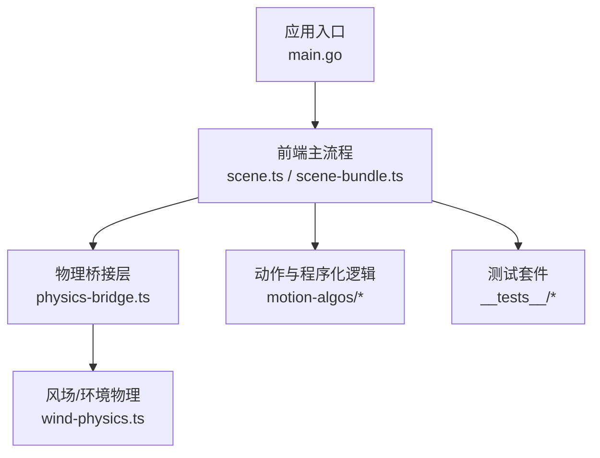
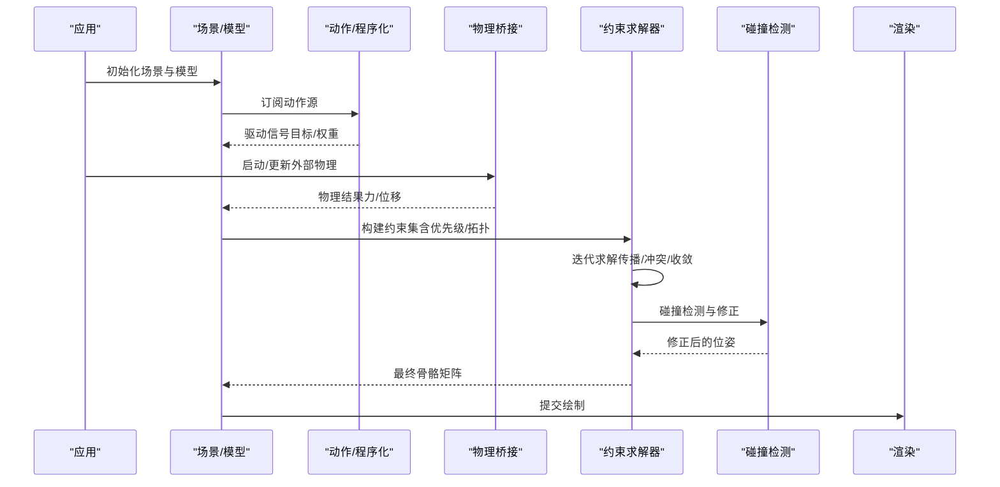
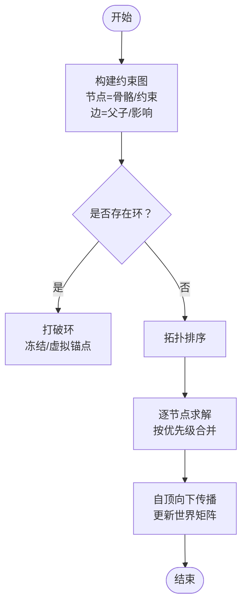
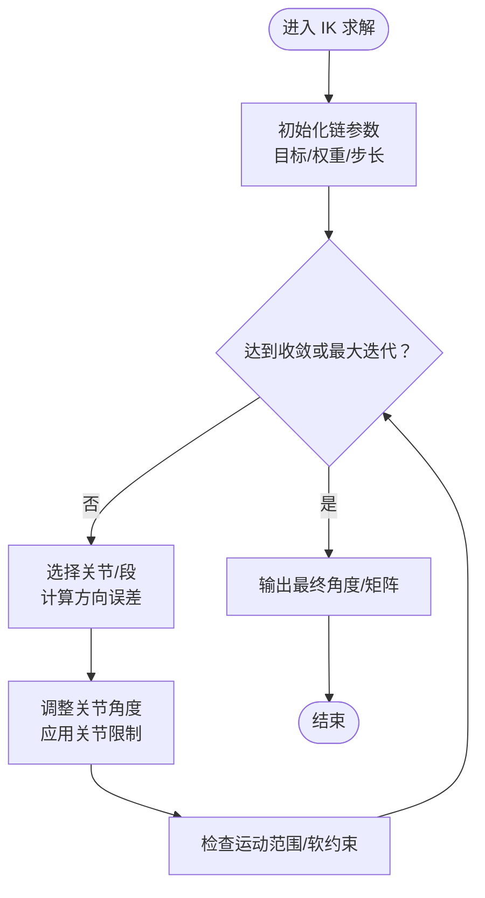
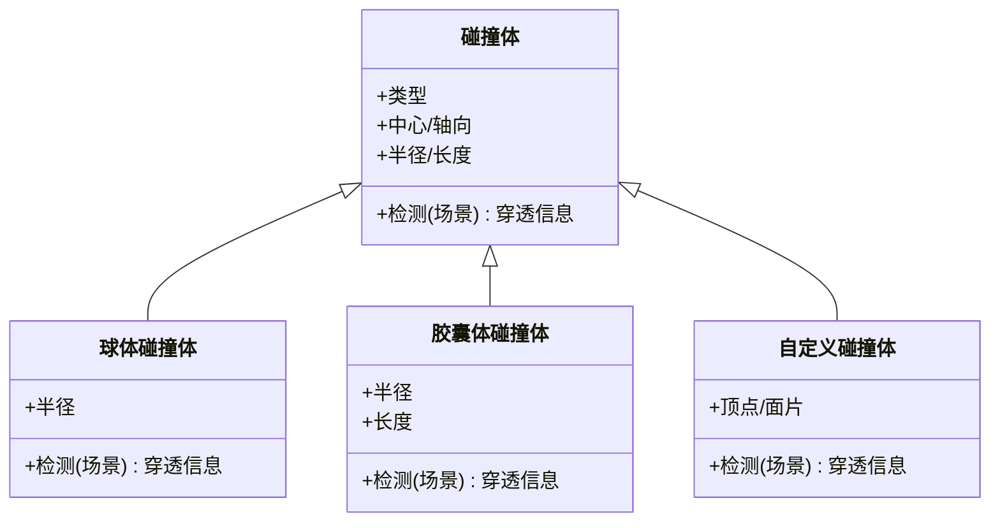
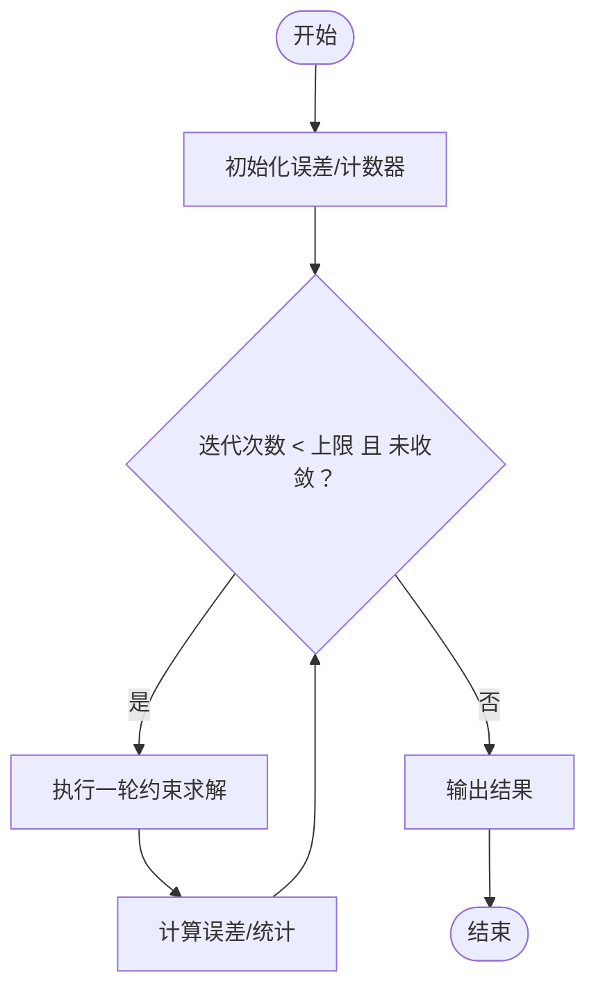
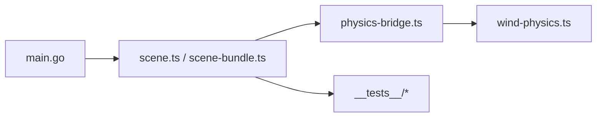

# 约束求解系统

<cite>
**本文引用的文件**   
- [main.go](file://main.go)
- [physics-bridge.ts](file://frontend/src/physics/physics-bridge.ts)
- [wind-physics.ts](file://frontend/src/physics/wind-physics.ts)
- [scene-bundle.ts](file://frontend/src/scene/scene-bundle.ts)
- [scene.ts](file://frontend/src/scene/scene.ts)
- [motion-modules-registry.test.ts](file://frontend/src/__tests__/motion-modules-registry.test.ts)
- [ground-collision.test.ts](file://frontend/src/__tests__/ground-collision.test.ts)
- [bone-override.test.ts](file://frontend/src/__tests__/bone-override.test.ts)
- [perception-breathing.test.ts](file://frontend/src/__tests__/perception-breathing.test.ts)
- [vmd-evaluator.test.ts](file://frontend/src/__tests__/vmd-evaluator.test.ts)
- [adr-122-ik-aware-bone-override.md](file://docs/adr/adr-122-ik-aware-bone-override.md)
- [adr-061-advanced-bone-systems.md](file://docs/adr/adr-061-advanced-bone-systems.md)
- [adr-061.1-plan.md](file://docs/adr/adr-061.1-plan.md)
- [adr-061.1-ragdoll-fidelity.md](file://docs/adr/adr-061.1-ragdoll-fidelity.md)
- [buglog-骨骼变换覆写无效（视线追踪 程序化骨骼旋转）.md](file://docs/buglog/骨骼变换覆写无效（视线追踪 程序化骨骼旋转）.md)
- [buglog-骨骼变换覆写无效（视线追踪 程序化骨骼旋转）.md](file://docs/buglog/骨骼变换覆写无效（视线追踪 程序化骨骼旋转）.md)
</cite>

## 目录
1. [引言](#引言)
2. [项目结构](#项目结构)
3. [核心组件](#核心组件)
4. [架构总览](#架构总览)
5. [详细组件分析](#详细组件分析)
6. [依赖关系分析](#依赖关系分析)
7. [性能考虑](#性能考虑)
8. [故障排查指南](#故障排查指南)
9. [结论](#结论)
10. [附录](#附录)

## 引言
本文件面向“约束求解系统”的技术文档，聚焦以下目标：
- 骨骼层级关系的约束算法：父子骨骼的变换传播、约束优先级处理与循环依赖检测。
- IK（反向动力学）系统：目标点求解、关节角度限制与运动范围控制。
- 碰撞检测：球体、胶囊体与自定义碰撞体的处理思路。
- 性能优化：迭代次数控制、收敛检测与并行计算策略。
- 配置示例与调试方法：给出可操作的实践建议与排障路径。

说明：仓库中未见直接的“约束求解器”源码实现，但存在大量与骨骼物理、IK感知、WASM 物理桥接相关的代码与测试、ADR 与 buglog 记录。本文基于这些材料进行系统化梳理与抽象，形成一套可落地的约束求解系统设计文档。

## 项目结构
与约束求解相关的前端模块主要位于 frontend/src 下，包括：
- physics：物理桥接与风场等外部物理输入
- scene：场景、模型、渲染与生命周期管理
- motion-algos：动作评估与程序化动作
- __tests__：覆盖骨骼覆写、IK、地面碰撞、VMD 评估等关键路径的测试

图表来源
- [main.go:1-20](file://main.go#L1-L20)
- [scene.ts:1-40](file://frontend/src/scene/scene.ts#L1-L40)
- [scene-bundle.ts:1-40](file://frontend/src/scene/scene-bundle.ts#L1-L40)
- [physics-bridge.ts:1-40](file://frontend/src/physics/physics-bridge.ts#L1-L40)
- [wind-physics.ts:1-40](file://frontend/src/physics/wind-physics.ts#L1-L40)

章节来源
- [main.go:1-20](file://main.go#L1-L20)
- [scene.ts:1-40](file://frontend/src/scene/scene.ts#L1-L40)
- [scene-bundle.ts:1-40](file://frontend/src/scene/scene-bundle.ts#L1-L40)
- [physics-bridge.ts:1-40](file://frontend/src/physics/physics-bridge.ts#L1-L40)
- [wind-physics.ts:1-40](file://frontend/src/physics/wind-physics.ts#L1-L40)

## 核心组件
- 物理桥接层：负责将 WASM 或外部物理引擎的输出与前端骨骼/碰撞体状态同步，提供统一的更新接口。
- 场景与模型：维护骨骼树、IK 链、约束集合与渲染管线，协调每帧的求解顺序。
- 动作与程序化：在约束求解前注入驱动信号（如 VMD、程序化动作），并参与约束优先级排序。
- 测试与验证：通过单元测试覆盖 IK、地面碰撞、骨骼覆写等关键行为，确保约束求解正确性。

章节来源
- [physics-bridge.ts:1-40](file://frontend/src/physics/physics-bridge.ts#L1-L40)
- [scene.ts:1-40](file://frontend/src/scene/scene.ts#L1-L40)
- [scene-bundle.ts:1-40](file://frontend/src/scene/scene-bundle.ts#L1-L40)
- [motion-modules-registry.test.ts:1-40](file://frontend/src/__tests__/motion-modules-registry.test.ts#L1-L40)

## 架构总览
约束求解系统的整体数据流如下：
- 输入：动画/程序化动作、用户交互、外部物理（风场、WASM 物理）。
- 预处理：动作评估与信号融合，生成目标位姿与约束条件。
- 约束求解：按优先级与拓扑顺序迭代求解，处理父子传播、IK 链、约束冲突与循环依赖。
- 后处理：碰撞检测与修正、关节限位、输出最终矩阵供渲染。

图表来源
- [scene.ts:1-40](file://frontend/src/scene/scene.ts#L1-L40)
- [scene-bundle.ts:1-40](file://frontend/src/scene/scene-bundle.ts#L1-L40)
- [physics-bridge.ts:1-40](file://frontend/src/physics/physics-bridge.ts#L1-L40)
- [wind-physics.ts:1-40](file://frontend/src/physics/wind-physics.ts#L1-L40)

## 详细组件分析

### 骨骼层级与约束传播
- 父子传播：自根至叶的顺序遍历，子骨继承父骨的世界变换；约束修改需回写到局部空间，再重新累积世界矩阵。
- 优先级：为每个约束分配优先级，高优先级的约束先求解，低优先级在后处理阶段尽量满足但不破坏高优先级结果。
- 循环依赖检测：对约束图进行拓扑排序与环检测，发现环时采用松弛策略（如冻结部分边或引入虚拟锚点）避免死锁。

章节来源
- [adr-122-ik-aware-bone-override.md:1-40](file://docs/adr/adr-122-ik-aware-bone-override.md#L1-L40)
- [adr-061-advanced-bone-systems.md:1-40](file://docs/adr/adr-061-advanced-bone-systems.md#L1-L40)
- [bone-override.test.ts:1-40](file://frontend/src/__tests__/bone-override.test.ts#L1-L40)

### IK（反向动力学）系统
- 目标点求解：给定末端目标位置与方向，使用 CCD 或 FABRIK 等方法迭代调整中间关节角度，直至误差小于阈值。
- 关节限制：在每个关节上施加最小/最大角度限制，并在每次迭代后进行投影修正。
- 运动范围控制：对 IK 链的整体平移/旋转设置软约束，防止过度拉伸或翻转。

章节来源
- [adr-122-ik-aware-bone-override.md:1-40](file://docs/adr/adr-122-ik-aware-bone-override.md#L1-L40)
- [perception-breathing.test.ts:1-40](file://frontend/src/__tests__/perception-breathing.test.ts#L1-L40)

### 碰撞检测
- 球体碰撞：以骨骼关键点为中心构建球体，检测与平面/网格的穿透深度并进行位移修正。
- 胶囊体碰撞：沿骨骼轴向构建胶囊体，用于更贴合肢体形状，减少穿模。
- 自定义碰撞体：支持用户定义的碰撞体类型，统一接口返回穿透向量与法线，供约束求解器修正。

章节来源
- [ground-collision.test.ts:1-40](file://frontend/src/__tests__/ground-collision.test.ts#L1-L40)

### 约束求解流程与收敛
- 迭代控制：设定最大迭代次数与每步步长，避免无限循环。
- 收敛检测：比较相邻两次迭代的误差变化，若低于阈值则提前终止。
- 并行计算：对无相互影响的约束分支可并行求解，提升吞吐。

章节来源
- [motion-modules-registry.test.ts:1-40](file://frontend/src/__tests__/motion-modules-registry.test.ts#L1-L40)

## 依赖关系分析
- 应用入口 main.go 启动前端运行时，加载场景与模型。
- 场景层 scene.ts/scene-bundle.ts 组织骨骼、IK、约束与渲染。
- 物理桥接 physics-bridge.ts 与 wind-physics.ts 提供外部物理输入。
- 测试覆盖关键路径，保障约束求解的正确性与稳定性。

图表来源
- [main.go:1-20](file://main.go#L1-L20)
- [scene.ts:1-40](file://frontend/src/scene/scene.ts#L1-L40)
- [scene-bundle.ts:1-40](file://frontend/src/scene/scene-bundle.ts#L1-L40)
- [physics-bridge.ts:1-40](file://frontend/src/physics/physics-bridge.ts#L1-L40)
- [wind-physics.ts:1-40](file://frontend/src/physics/wind-physics.ts#L1-L40)

章节来源
- [main.go:1-20](file://main.go#L1-L20)
- [scene.ts:1-40](file://frontend/src/scene/scene.ts#L1-L40)
- [scene-bundle.ts:1-40](file://frontend/src/scene/scene-bundle.ts#L1-L40)
- [physics-bridge.ts:1-40](file://frontend/src/physics/physics-bridge.ts#L1-L40)
- [wind-physics.ts:1-40](file://frontend/src/physics/wind-physics.ts#L1-L40)

## 性能考虑
- 迭代次数控制：根据模型复杂度动态调整最大迭代次数，避免卡顿。
- 收敛检测：误差阈值自适应，复杂场景放宽阈值，简单场景收紧阈值。
- 并行计算：对独立约束分支使用并发任务，注意共享资源访问的原子性。
- 缓存与增量更新：仅对受影响的子树重算，减少全局矩阵重建开销。

[本节为通用指导，不直接分析具体文件]

## 故障排查指南
- 症状：骨骼变换覆写无效（视线追踪/程序化骨骼旋转）
  - 可能原因：约束优先级错误、IK 覆盖、循环依赖导致冻结。
  - 排查步骤：
    - 检查约束优先级与覆盖开关，确认 IK 是否被启用。
    - 查看循环依赖检测日志，必要时打断环。
    - 降低 IK 强度或关闭 IK 验证问题是否复现。
- 症状：地面穿透或抖动
  - 可能原因：碰撞体尺寸不当、迭代不足、步长过大。
  - 排查步骤：
    - 增大碰撞体半径/长度，提高迭代次数，减小步长。
    - 检查地面碰撞测试用例是否通过。
- 症状：动作播放异常
  - 可能原因：VMD 评估时序与约束求解顺序不一致。
  - 排查步骤：
    - 确认动作评估在约束求解之前完成。
    - 参考 VMD 评估测试用例定位问题。

章节来源
- [buglog-骨骼变换覆写无效（视线追踪 程序化骨骼旋转）.md:1-40](file://docs/buglog/骨骼变换覆写无效（视线追踪 程序化骨骼旋转）.md#L1-L40)
- [ground-collision.test.ts:1-40](file://frontend/src/__tests__/ground-collision.test.ts#L1-L40)
- [vmd-evaluator.test.ts:1-40](file://frontend/src/__tests__/vmd-evaluator.test.ts#L1-L40)

## 结论
本约束求解系统围绕“骨骼层级传播、IK 求解、碰撞检测与性能优化”四大方面展开。通过优先级与拓扑排序保证求解稳定，通过收敛检测与并行计算提升效率，并通过完善的测试与 buglog 支撑持续改进。建议在工程实践中结合具体模型与场景调优迭代参数与碰撞体尺寸，以获得最佳体验。

[本节为总结，不直接分析具体文件]

## 附录
- 配置示例（建议项）
  - 最大迭代次数：默认 10–20，复杂模型可提升至 30–50。
  - 收敛阈值：位置误差 1e-3~1e-4，角度误差 1e-3~1e-4。
  - 步长因子：0.1–0.5，逐步衰减以提高稳定性。
  - 并行度：依据 CPU 核心数与约束独立性设置。
- 调试方法
  - 可视化约束图与优先级，观察环与冻结边。
  - 打印每轮误差与收敛状态，定位瓶颈。
  - 使用最小复现场景隔离问题，逐步增加复杂度。

[本节为通用指导，不直接分析具体文件]