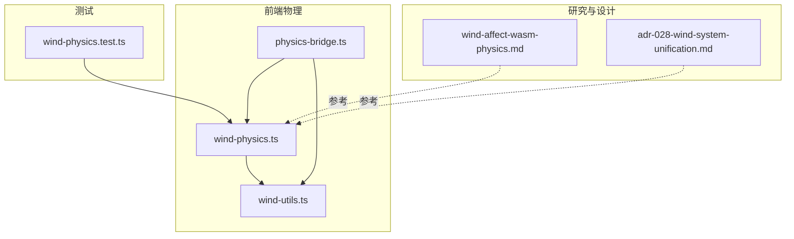
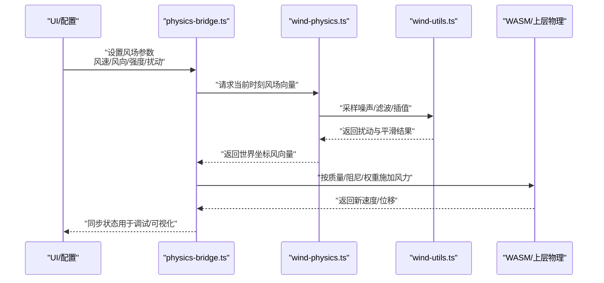
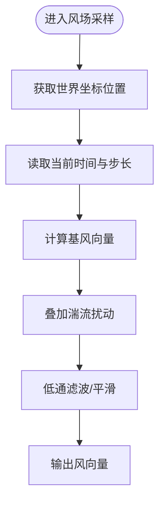
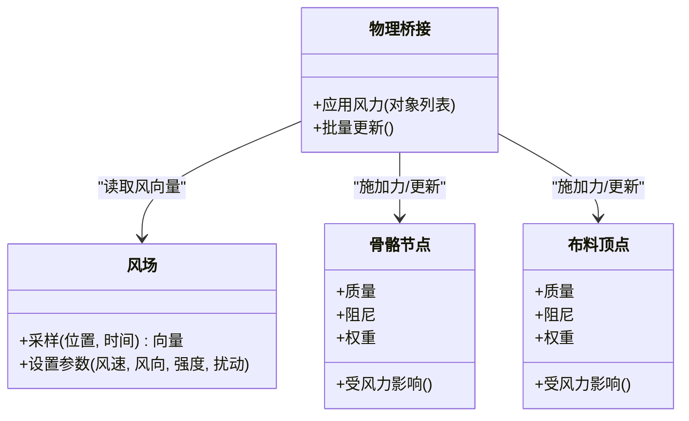
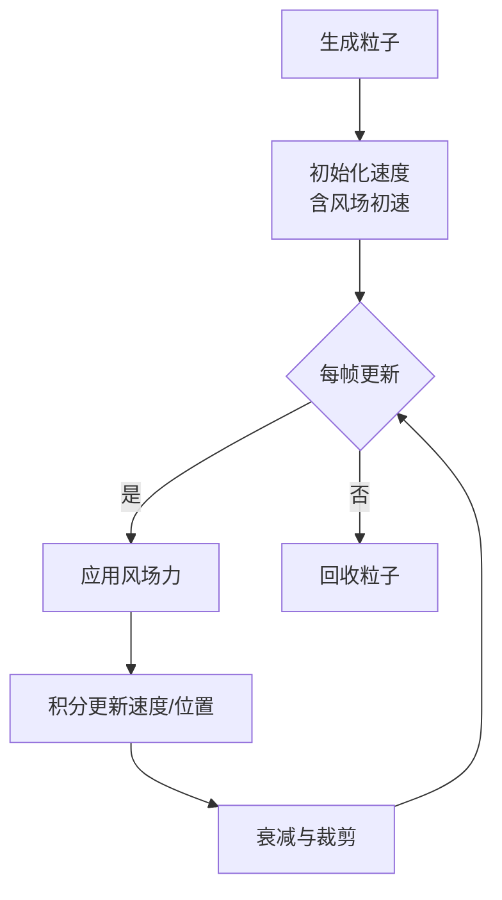

# 风场物理模拟

<cite>
**本文引用的文件**   
- [wind-physics.ts](file://frontend/src/physics/wind-physics.ts)
- [physics-bridge.ts](file://frontend/src/physics/physics-bridge.ts)
- [wind-utils.ts](file://frontend/src/core/wind-utils.ts)
- [wind-affect-wasm-physics.md](file://docs/research/wind-affect-wasm-physics.md)
- [adr-028-wind-system-unification.md](file://docs/adr/adr-028-wind-system-unification.md)
- [wind-physics.test.ts](file://frontend/src/__tests__/wind-physics.test.ts)
</cite>

## 目录
1. [简介](#简介)
2. [项目结构](#项目结构)
3. [核心组件](#核心组件)
4. [架构总览](#架构总览)
5. [详细组件分析](#详细组件分析)
6. [依赖关系分析](#依赖关系分析)
7. [性能考虑](#性能考虑)
8. [故障排查指南](#故障排查指南)
9. [结论](#结论)
10. [附录](#附录)

## 简介
本文件面向风力场的物理模拟，覆盖以下关键主题：
- 数学模型：向量场计算、湍流模拟与时间相关变化
- 对骨骼与布料的影响：力的分解、加速度计算与位置更新
- 粒子系统与风场集成：生成、运动与衰减
- 实时参数调整：风速、风向、强度与扰动的动态修改
- 可视化调试工具与性能优化建议
- 配置示例与效果调优指南

## 项目结构
与风场相关的代码主要位于前端 TypeScript 模块中，并通过研究文档与 ADR 补充设计背景与决策。

图表来源
- [wind-physics.ts](file://frontend/src/physics/wind-physics.ts)
- [physics-bridge.ts](file://frontend/src/physics/physics-bridge.ts)
- [wind-utils.ts](file://frontend/src/core/wind-utils.ts)
- [wind-affect-wasm-physics.md](file://docs/research/wind-affect-wasm-physics.md)
- [adr-028-wind-system-unification.md](file://docs/adr/adr-028-wind-system-unification.md)
- [wind-physics.test.ts](file://frontend/src/__tests__/wind-physics.test.ts)

章节来源
- [wind-physics.ts](file://frontend/src/physics/wind-physics.ts)
- [physics-bridge.ts](file://frontend/src/physics/physics-bridge.ts)
- [wind-utils.ts](file://frontend/src/core/wind-utils.ts)
- [wind-affect-wasm-physics.md](file://docs/research/wind-affect-wasm-physics.md)
- [adr-028-wind-system-unification.md](file://docs/adr/adr-028-wind-system-unification.md)
- [wind-physics.test.ts](file://frontend/src/__tests__/wind-physics.test.ts)

## 核心组件
- 风场向量场与扰动（wind-physics.ts）
  - 提供空间向量场采样、时间演化与湍流扰动能力
  - 暴露统一接口供骨骼/布料/粒子系统调用
- 物理桥接（physics-bridge.ts）
  - 将风场力注入到 WASM 物理层或上层物理管线
  - 协调帧级更新与批处理策略
- 风场工具集（wind-utils.ts）
  - 提供噪声、滤波、插值等基础数学工具
  - 封装常用风场变换与单位换算

章节来源
- [wind-physics.ts](file://frontend/src/physics/wind-physics.ts)
- [physics-bridge.ts](file://frontend/src/physics/physics-bridge.ts)
- [wind-utils.ts](file://frontend/src/core/wind-utils.ts)

## 架构总览
下图展示了从 UI/配置到风场计算、再到物理层与渲染的端到端流程。

图表来源
- [physics-bridge.ts](file://frontend/src/physics/physics-bridge.ts)
- [wind-physics.ts](file://frontend/src/physics/wind-physics.ts)
- [wind-utils.ts](file://frontend/src/core/wind-utils.ts)

## 详细组件分析

### 风场数学模型与实现要点
- 向量场计算
  - 以空间位置和时间作为输入，输出三维风向量
  - 支持全局基风与局部扰动叠加
- 湍流模拟
  - 使用噪声函数与低通滤波产生自然风切变与阵风
  - 通过频率与振幅控制湍流的“粗糙度”和“强度”
- 时间相关变化
  - 采用相位偏移与缓动函数使风随时间平滑过渡
  - 支持周期性阵风与随机突变

图表来源
- [wind-physics.ts](file://frontend/src/physics/wind-physics.ts)
- [wind-utils.ts](file://frontend/src/core/wind-utils.ts)

章节来源
- [wind-physics.ts](file://frontend/src/physics/wind-physics.ts)
- [wind-utils.ts](file://frontend/src/core/wind-utils.ts)

### 风对骨骼与布料的影响算法
- 力的分解
  - 将风向量投影到骨骼/布料的局部坐标系
  - 根据方向性权重区分前后/左右/上下影响
- 加速度计算
  - 依据 F=ma 思想，结合质量与阻力系数得到瞬时加速度
  - 引入阻尼项抑制高频抖动
- 位置更新
  - 在每帧内对速度与位移进行积分更新
  - 对末端肢体与布料顶点施加更大权重，增强飘动感

图表来源
- [wind-physics.ts](file://frontend/src/physics/wind-physics.ts)
- [physics-bridge.ts](file://frontend/src/physics/physics-bridge.ts)

章节来源
- [wind-physics.ts](file://frontend/src/physics/wind-physics.ts)
- [physics-bridge.ts](file://frontend/src/physics/physics-bridge.ts)

### 粒子系统与风场集成
- 粒子生成
  - 在指定区域与速率下持续发射粒子
  - 初始速度与方向可受风场影响
- 粒子运动
  - 每帧根据风场向量更新速度与位置
  - 引入重力与阻力形成更自然的轨迹
- 粒子衰减
  - 基于生命周期与距离衰减透明度/尺寸
  - 超出边界或寿命结束时回收

图表来源
- [wind-physics.ts](file://frontend/src/physics/wind-physics.ts)
- [physics-bridge.ts](file://frontend/src/physics/physics-bridge.ts)

章节来源
- [wind-physics.ts](file://frontend/src/physics/wind-physics.ts)
- [physics-bridge.ts](file://frontend/src/physics/physics-bridge.ts)

### 风场参数的实时调整
- 可调参数
  - 风速：整体强度缩放
  - 风向：水平/垂直偏角
  - 强度：湍流幅度与频率
  - 扰动：随机性与阵风突变的概率
- 动态修改
  - 通过 UI 或脚本在运行时更新参数
  - 内部采用平滑过渡避免突变导致的视觉跳变

章节来源
- [wind-physics.ts](file://frontend/src/physics/wind-physics.ts)
- [physics-bridge.ts](file://frontend/src/physics/physics-bridge.ts)

### 可视化调试工具
- 风场可视化
  - 绘制箭头场或流线，显示空间风向量分布
  - 支持时间轴播放，观察风场随时间的演变
- 受力可视化
  - 高亮受风影响的骨骼节点与布料顶点
  - 以颜色深浅表示力的大小
- 性能面板
  - 展示每帧风场采样次数、物理更新耗时
  - 提供阈值告警与降档策略开关

章节来源
- [wind-physics.ts](file://frontend/src/physics/wind-physics.ts)
- [physics-bridge.ts](file://frontend/src/physics/physics-bridge.ts)

### 配置示例与效果调优指南
- 典型场景
  - 微风拂面：低风速、低扰动、强平滑
  - 狂风暴雨：高风速、高扰动、弱平滑
  - 室内通风：极低风速、定向风向、小范围扰动
- 调优步骤
  - 先设定基风与风向，再逐步增加湍流强度
  - 调节阻尼与权重，避免过度抖动
  - 针对布料与头发分别设置权重，突出细节
- 验证方法
  - 使用风场可视化确认流向与强度
  - 录制回放对比不同参数组合的效果差异

章节来源
- [wind-physics.ts](file://frontend/src/physics/wind-physics.ts)
- [wind-affect-wasm-physics.md](file://docs/research/wind-affect-wasm-physics.md)

## 依赖关系分析
- 模块耦合
  - wind-physics.ts 依赖 wind-utils.ts 的基础数学工具
  - physics-bridge.ts 同时依赖 wind-physics.ts 与底层物理层
- 外部依赖
  - WASM 物理层负责最终动力学求解
  - 渲染层仅消费状态，不直接参与风场计算

图表来源
- [wind-physics.ts](file://frontend/src/physics/wind-physics.ts)
- [physics-bridge.ts](file://frontend/src/physics/physics-bridge.ts)
- [wind-utils.ts](file://frontend/src/core/wind-utils.ts)

章节来源
- [wind-physics.ts](file://frontend/src/physics/wind-physics.ts)
- [physics-bridge.ts](file://frontend/src/physics/physics-bridge.ts)
- [wind-utils.ts](file://frontend/src/core/wind-utils.ts)

## 性能考虑
- 采样优化
  - 对风场向量进行空间分块缓存，减少重复计算
  - 使用较低分辨率网格并插值提升性能
- 物理更新
  - 批量处理骨骼与布料顶点，降低函数调用开销
  - 自适应步长与阻尼，避免过冲与抖动
- 渲染联动
  - 仅在需要时启用风场可视化，避免额外绘制成本
  - 使用 GPU 缓冲传输风场数据，减少 CPU-GPU 同步

[本节为通用指导，无需特定文件引用]

## 故障排查指南
- 常见问题
  - 风场突变导致抖动：检查平滑与阻尼参数
  - 布料飘动异常：核对权重与质量分配
  - 性能下降：关闭可视化、降低采样分辨率
- 定位方法
  - 使用风场可视化确认向量场是否正确
  - 查看物理桥接日志，确认力是否被正确施加
  - 运行单元测试回归验证

章节来源
- [wind-physics.test.ts](file://frontend/src/__tests__/wind-physics.test.ts)

## 结论
本风场系统通过统一的向量场与扰动模型，为骨骼、布料与粒子提供了稳定且可控的物理驱动。借助可视化调试与性能优化手段，可在不同场景下获得高质量的动态效果。建议在项目中遵循本文的配置与调优指南，以获得一致的风场表现。

[本节为总结性内容，无需特定文件引用]

## 附录
- 设计与决策参考
  - 风系统统一化决策记录
  - 风对 WASM 物理影响的研究笔记

章节来源
- [adr-028-wind-system-unification.md](file://docs/adr/adr-028-wind-system-unification.md)
- [wind-affect-wasm-physics.md](file://docs/research/wind-affect-wasm-physics.md)