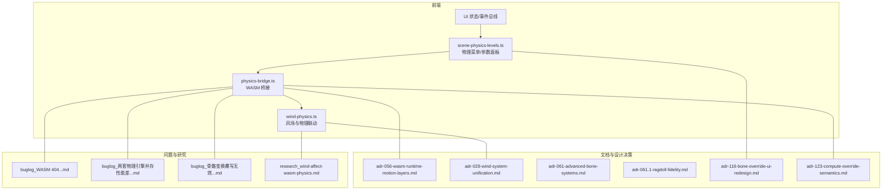
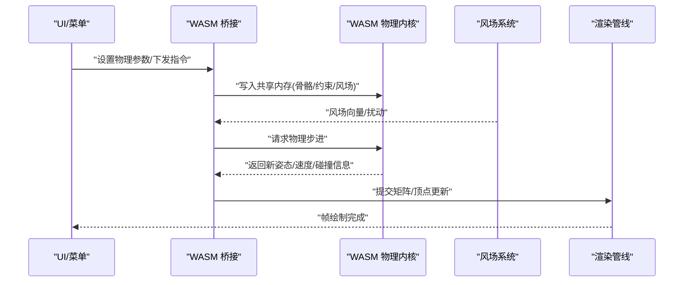
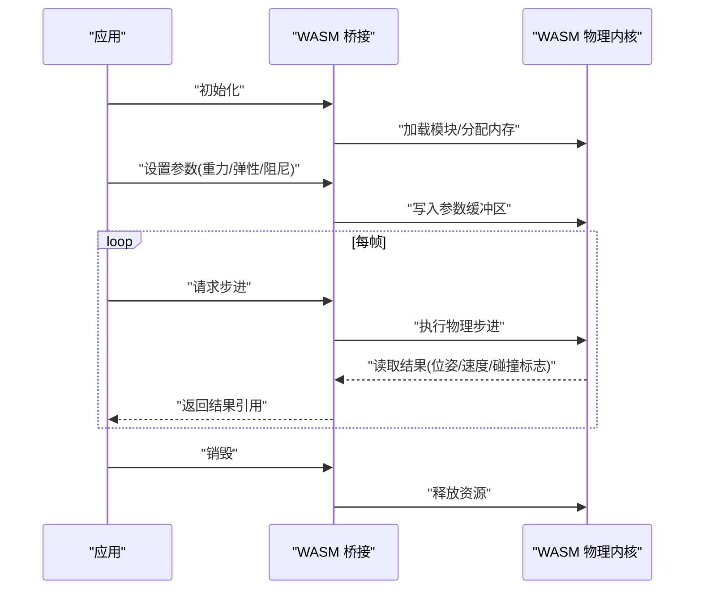
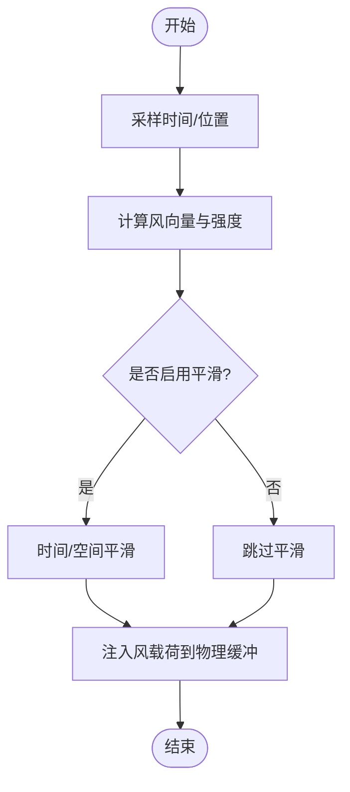
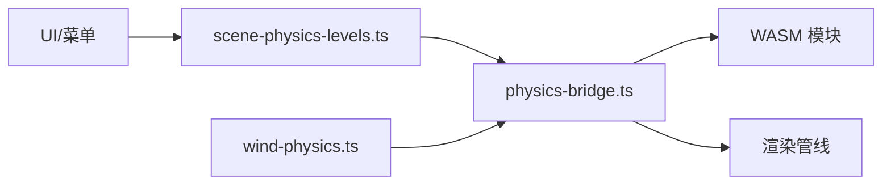

# 骨骼物理

<cite>
**本文引用的文件**   
- [physics-bridge.ts](file://frontend/src/physics/physics-bridge.ts)
- [wind-physics.ts](file://frontend/src/physics/wind-physics.ts)
- [scene-physics-levels.ts](file://frontend/src/menus/scene-physics-levels.ts)
- [adr-028-wind-system-unification.md](file://docs/adr/adr-028-wind-system-unification.md)
- [adr-056-wasm-runtime-motion-layers.md](file://docs/adr/adr-056-wasm-runtime-motion-layers.md)
- [adr-061.1-ragdoll-fidelity.md](file://docs/adr/adr-061.1-ragdoll-fidelity.md)
- [adr-061-advanced-bone-systems.md](file://docs/adr/adr-061-advanced-bone-systems.md)
- [adr-077-plaza-cookie-relay.md](file://docs/adr/adr-077-plaza-cookie-relay.md)
- [adr-116-bone-override-ui-redesign.md](file://docs/adr/adr-116-bone-override-ui-redesign.md)
- [adr-123-compute-override-semantics.md](file://docs/adr/adr-123-compute-override-semantics.md)
- [buglog_wasm_404_index_bg_wasm无法加载.md](file://docs/buglog/WASM%20404：%60index_bg.wasm%60%20%E6%97%A0%E6%B3%95%E5%8A%A0%E8%BD%BD.md)
- [buglog_两套物理引擎并存性能差3至5倍.md](file://docs/buglog/%E4%B8%A4%E5%A5%97%E7%89%A9%E7%90%86%E5%BC%95%E6%93%8E%E5%B9%B6%E5%AD%98%E6%80%A7%E8%83%BD%E5%B7%AE3%E8%87%B35%E5%80%8D.md)
- [buglog_骨骼变换覆写无效（视线追踪%20程序化骨骼旋转）.md](file://docs/buglog/%E9%AA%A8%E9%AA%A8%E5%8F%98%E6%8D%A2%E8%A6%86%E5%86%99%E6%97%A0%E6%95%88%EF%BC%88%E8%A7%86%E7%BA%BF%E8%BF%BD%E8%B8%AA%20%E7%A8%8B%E5%BA%8F%E5%8C%96%E9%AA%A8%E9%AA%A8%E6%97%8B%E8%BD%AC%EF%BC%89.md)
- [research_wind-affect-wasm-physics.md](file://docs/research/wind-affect-wasm-physics.md)
</cite>

## 目录
1. [简介](#简介)
2. [项目结构](#项目结构)
3. [核心组件](#核心组件)
4. [架构总览](#架构总览)
5. [详细组件分析](#详细组件分析)
6. [依赖分析](#依赖分析)
7. [性能考虑](#性能考虑)
8. [故障排查指南](#故障排查指南)
9. [结论](#结论)
10. [附录](#附录)

## 简介
本文件面向“骨骼物理系统”的完整技术文档，聚焦以下目标：
- WASM 物理计算的集成方案：Go 与 WebAssembly 的双向通信、数据传递与性能优化策略。
- 骨骼约束系统实现：父子关系处理、约束求解思路、碰撞检测与响应机制。
- 风场系统物理模拟：风力计算、粒子系统与布料物理的集成方式。
- 物理参数实时调整：重力、弹性、阻尼等属性的动态修改路径。
- 调试工具使用指南：可视化调试、性能监控与问题诊断方法。
- 配置与优化示例：通过可定位的代码片段路径展示如何配置和优化物理效果。

## 项目结构
围绕骨骼物理的前端实现主要位于 frontend/src/physics 与相关菜单层；WASM 运行时与风场统一、高级骨骼系统等设计决策在 docs/adr 中记录；若干典型问题与优化经验在 docs/buglog 与 docs/research 中沉淀。

图表来源
- [physics-bridge.ts:1-200](file://frontend/src/physics/physics-bridge.ts#L1-L200)
- [wind-physics.ts:1-200](file://frontend/src/physics/wind-physics.ts#L1-L200)
- [scene-physics-levels.ts:1-200](file://frontend/src/menus/scene-physics-levels.ts#L1-L200)
- [adr-056-wasm-runtime-motion-layers.md:1-200](file://docs/adr/adr-056-wasm-runtime-motion-layers.md#L1-L200)
- [adr-028-wind-system-unification.md:1-200](file://docs/adr/adr-028-wind-system-unification.md#L1-L200)
- [adr-061-advanced-bone-systems.md:1-200](file://docs/adr/adr-061-advanced-bone-systems.md#L1-L200)
- [adr-061.1-ragdoll-fidelity.md:1-200](file://docs/adr/adr-061.1-ragdoll-fidelity.md#L1-L200)
- [adr-116-bone-override-ui-redesign.md:1-200](file://docs/adr/adr-116-bone-override-ui-redesign.md#L1-L200)
- [adr-123-compute-override-semantics.md:1-200](file://docs/adr/adr-123-compute-override-semantics.md#L1-L200)
- [research_wind-affect-wasm-physics.md:1-200](file://docs/research/wind-affect-wasm-physics.md#L1-L200)
- [buglog_WASM 404...md:1-200](file://docs/buglog/WASM%20404：%60index_bg.wasm%60%20%E6%97%A0%E6%B3%95%E5%8A%A0%E8%BD%BD.md#L1-L200)
- [buglog_两套物理引擎并存性能差3至5倍.md:1-200](file://docs/buglog/%E4%B8%A4%E5%A5%97%E7%89%A9%E7%90%86%E5%BC%95%E6%93%8E%E5%B9%B6%E5%AD%98%E6%80%A7%E8%83%BD%E5%B7%AE3%E8%87%B35%E5%80%8D.md#L1-L200)
- [buglog_骨骼变换覆写无效（视线追踪%20程序化骨骼旋转）.md:1-200](file://docs/buglog/%E9%AA%A8%E9%AA%A8%E5%8F%98%E6%8D%A2%E8%A6%86%E5%86%99%E6%97%A0%E6%95%88%EF%BC%88%E8%A7%86%E7%BA%BF%E8%BF%BD%E8%B8%AA%20%E7%A8%8B%E5%BA%8F%E5%8C%96%E9%AA%A8%E9%AA%A8%E6%97%8B%E8%BD%AC%EF%BC%89.md#L1-L200)

章节来源
- [physics-bridge.ts:1-200](file://frontend/src/physics/physics-bridge.ts#L1-L200)
- [wind-physics.ts:1-200](file://frontend/src/physics/wind-physics.ts#L1-L200)
- [scene-physics-levels.ts:1-200](file://frontend/src/menus/scene-physics-levels.ts#L1-L200)

## 核心组件
- WASM 物理桥接（physics-bridge.ts）
  - 负责与 WASM 模块建立连接、初始化内存缓冲、批量读写骨骼/约束/风场数据、调度步进与结果回传。
  - 提供参数更新接口（重力、弹性、阻尼等），并封装错误与日志上报。
- 风场与物理联动（wind-physics.ts）
  - 计算全局/局部风场向量，驱动 WASM 物理步中的风载荷项，并与粒子系统、布料物理进行耦合。
- 物理菜单与参数面板（scene-physics-levels.ts）
  - 暴露 UI 控件，将用户输入映射为物理参数变更，触发桥接层的增量更新。

章节来源
- [physics-bridge.ts:1-200](file://frontend/src/physics/physics-bridge.ts#L1-L200)
- [wind-physics.ts:1-200](file://frontend/src/physics/wind-physics.ts#L1-L200)
- [scene-physics-levels.ts:1-200](file://frontend/src/menus/scene-physics-levels.ts#L1-L200)

## 架构总览
整体流程由前端 UI 发起参数或指令，经桥接层写入 WASM 共享内存，WASM 执行物理步进后返回结果，再由渲染管线消费。

图表来源
- [physics-bridge.ts:1-200](file://frontend/src/physics/physics-bridge.ts#L1-L200)
- [wind-physics.ts:1-200](file://frontend/src/physics/wind-physics.ts#L1-L200)

## 详细组件分析

### WASM 物理桥接（physics-bridge.ts）
职责与要点
- 生命周期管理：创建/销毁 WASM 实例、分配/释放共享内存、注册回调。
- 数据通道：以 ArrayBuffer/TypedArray 作为零拷贝通道，批量传输骨骼初始位姿、约束定义、风场参数。
- 步进调度：按帧调用 WASM 步进函数，合并风场影响，收集碰撞与约束残差用于调试。
- 错误处理：捕获加载失败、内存不足、类型不匹配等问题，向上抛出结构化错误。

关键交互序列

图表来源
- [physics-bridge.ts:1-200](file://frontend/src/physics/physics-bridge.ts#L1-L200)

章节来源
- [physics-bridge.ts:1-200](file://frontend/src/physics/physics-bridge.ts#L1-L200)

### 风场系统（wind-physics.ts）
职责与要点
- 风场模型：支持全局恒定风、时变风、空间梯度风，输出单位向量与强度。
- 耦合点：在 WASM 步进前注入风载荷到相应骨骼/软体节点；与粒子系统共享风场采样器。
- 性能优化：对风场进行时间平滑与空间降采样，减少高频抖动与重复计算。

风场计算流程

图表来源
- [wind-physics.ts:1-200](file://frontend/src/physics/wind-physics.ts#L1-L200)

章节来源
- [wind-physics.ts:1-200](file://frontend/src/physics/wind-physics.ts#L1-L200)

### 物理菜单与参数面板（scene-physics-levels.ts）
职责与要点
- 参数映射：将 UI 滑块/开关映射为物理参数（重力、弹性系数、阻尼、风强等）。
- 实时更新：监听 UI 变化，增量更新桥接层参数缓存，避免全量重算。
- 预设与持久化：保存常用配置，支持一键切换。

章节来源
- [scene-physics-levels.ts:1-200](file://frontend/src/menus/scene-physics-levels.ts#L1-L200)

### 高级骨骼与约束系统（设计层面）
说明
- 父子关系：基于层级树维护父指针与相对变换，保证约束传播顺序。
- 约束求解：采用迭代式约束求解（如 PBD/PGS 风格），在每帧多次松弛以满足距离/角度/体积约束。
- 碰撞检测与响应：使用包围体层次（AABB/OBB）与简单形状（球/胶囊）做快速剔除，再对候选对进行精细检测与冲量/位置修正。

参考设计决策
- 高级骨骼系统设计与约束体系
- 布娃娃高保真度要求与稳定性权衡
- 计算覆写的语义与优先级

章节来源
- [adr-061-advanced-bone-systems.md:1-200](file://docs/adr/adr-061-advanced-bone-systems.md#L1-L200)
- [adr-061.1-ragdoll-fidelity.md:1-200](file://docs/adr/adr-061.1-ragdoll-fidelity.md#L1-L200)
- [adr-123-compute-override-semantics.md:1-200](file://docs/adr/adr-123-compute-override-semantics.md#L1-L200)

### WASM 运行时与运动层（adr-056）
说明
- 运行时分层：将动作层、物理层、风场层解耦，便于并行与按需启用。
- 数据边界：明确各层间的数据契约（缓冲布局、步长、同步点），降低跨语言开销。

章节来源
- [adr-056-wasm-runtime-motion-layers.md:1-200](file://docs/adr/adr-056-wasm-runtime-motion-layers.md#L1-L200)

### 风场统一（adr-028）
说明
- 统一风场协议：将环境风、局部风、角色风统一为同一数据结构，供 WASM 物理与粒子系统共用。
- 向后兼容：保留旧版风场入口，逐步迁移到新协议。

章节来源
- [adr-028-wind-system-unification.md:1-200](file://docs/adr/adr-028-wind-system-unification.md#L1-L200)

### 骨骼覆写 UI 与计算语义（adr-116, adr-123）
说明
- UI 重构：提供更直观的骨骼覆写界面，区分“覆盖模式”和“叠加模式”。
- 计算语义：明确覆写与物理求解的执行顺序与权重，避免冲突。

章节来源
- [adr-116-bone-override-ui-redesign.md:1-200](file://docs/adr/adr-116-bone-override-ui-redesign.md#L1-L200)
- [adr-123-compute-override-semantics.md:1-200](file://docs/adr/adr-123-compute-override-semantics.md#L1-L200)

## 依赖分析
- 内部依赖
  - physics-bridge.ts 依赖 wind-physics.ts 提供的风场数据。
  - scene-physics-levels.ts 依赖 physics-bridge.ts 的参数接口。
- 外部依赖
  - WASM 模块（例如 index_bg.wasm）需正确部署与加载。
  - 渲染管线消费桥接层输出的位姿/顶点数据。

图表来源
- [physics-bridge.ts:1-200](file://frontend/src/physics/physics-bridge.ts#L1-L200)
- [wind-physics.ts:1-200](file://frontend/src/physics/wind-physics.ts#L1-L200)
- [scene-physics-levels.ts:1-200](file://frontend/src/menus/scene-physics-levels.ts#L1-L200)

章节来源
- [physics-bridge.ts:1-200](file://frontend/src/physics/physics-bridge.ts#L1-L200)
- [wind-physics.ts:1-200](file://frontend/src/physics/wind-physics.ts#L1-L200)
- [scene-physics-levels.ts:1-200](file://frontend/src/menus/scene-physics-levels.ts#L1-L200)

## 性能考虑
- 双引擎并存的性能风险
  - 同时运行两套物理引擎会导致 CPU/GPU 压力倍增，建议仅启用一套主引擎，另一套作为降级或离线工具。
- WASM 加载失败与资源路径
  - 若 WASM 资源未正确部署或路径错误，会导致 404 并中断物理链路，需在构建与部署阶段校验产物完整性。
- 数据搬运与批量化
  - 尽量使用 TypedArray 批量读写，减少跨语言调用次数；合并多骨骼/多约束的更新为一帧一次。
- 风场与粒子耦合
  - 对风场进行时空平滑与降采样，避免高频噪声导致数值不稳定与额外计算。

章节来源
- [buglog_两套物理引擎并存性能差3至5倍.md:1-200](file://docs/buglog/%E4%B8%A4%E5%A5%97%E7%89%A9%E7%90%86%E5%BC%95%E6%93%8E%E5%B9%B6%E5%AD%98%E6%80%A7%E8%83%BD%E5%B7%AE3%E8%87%B35%E5%80%8D.md#L1-L200)
- [buglog_WASM 404...md:1-200](file://docs/buglog/WASM%20404：%60index_bg.wasm%60%20%E6%97%A0%E6%B3%95%E5%8A%A0%E8%BD%BD.md#L1-L200)

## 故障排查指南
常见问题与定位步骤
- WASM 模块 404 无法加载
  - 检查构建产物是否存在、静态资源路径是否正确、服务器是否允许跨域访问。
- 两套物理引擎并存导致性能骤降
  - 确认是否误启双引擎；关闭冗余引擎或将其置于非主循环路径。
- 骨骼变换覆写无效（视线追踪/程序化骨骼旋转）
  - 核对覆写优先级与计算语义，确保覆写在物理求解之后生效且未被后续步骤覆盖。
- 风场影响异常
  - 检查风场强度、方向、平滑参数；验证风场数据是否正确注入到 WASM 缓冲。

章节来源
- [buglog_WASM 404...md:1-200](file://docs/buglog/WASM%20404：%60index_bg.wasm%60%20%E6%97%A0%E6%B3%95%E5%8A%A0%E8%BD%BD.md#L1-L200)
- [buglog_两套物理引擎并存性能差3至5倍.md:1-200](file://docs/buglog/%E4%B8%A4%E5%A5%97%E7%89%A9%E7%90%86%E5%BC%95%E6%93%8E%E5%B9%B6%E5%AD%98%E6%80%A7%E8%83%BD%E5%B7%AE3%E8%87%B35%E5%80%8D.md#L1-L200)
- [buglog_骨骼变换覆写无效（视线追踪%20程序化骨骼旋转）.md:1-200](file://docs/buglog/%E9%AA%A8%E9%AA%A8%E5%8F%98%E6%8D%A2%E8%A6%86%E5%86%99%E6%97%A0%E6%95%88%EF%BC%88%E8%A7%86%E7%BA%BF%E8%BF%BD%E8%B8%AA%20%E7%A8%8B%E5%BA%8F%E5%8C%96%E9%AA%A8%E9%AA%A8%E6%97%8B%E8%BD%AC%EF%BC%89.md#L1-L200)

## 结论
通过将风场、WASM 物理与 UI 菜单解耦并以桥接层统一管理，系统在可扩展性与性能之间取得平衡。遵循本文的配置与优化建议，可在复杂场景下获得稳定高效的骨骼物理表现。

## 附录

### 代码示例与最佳实践（以路径指引为主）
- 初始化 WASM 物理桥接
  - 参考：[physics-bridge.ts:1-200](file://frontend/src/physics/physics-bridge.ts#L1-L200)
- 设置物理参数（重力/弹性/阻尼）
  - 参考：[physics-bridge.ts:1-200](file://frontend/src/physics/physics-bridge.ts#L1-L200)
- 配置风场并注入物理步进
  - 参考：[wind-physics.ts:1-200](file://frontend/src/physics/wind-physics.ts#L1-L200)
- 在菜单中绑定物理参数滑块
  - 参考：[scene-physics-levels.ts:1-200](file://frontend/src/menus/scene-physics-levels.ts#L1-L200)
- 高级骨骼与约束设计参考
  - 参考：[adr-061-advanced-bone-systems.md:1-200](file://docs/adr/adr-061-advanced-bone-systems.md#L1-L200)、[adr-061.1-ragdoll-fidelity.md:1-200](file://docs/adr/adr-061.1-ragdoll-fidelity.md#L1-L200)
- WASM 运行时与运动层分层
  - 参考：[adr-056-wasm-runtime-motion-layers.md:1-200](file://docs/adr/adr-056-wasm-runtime-motion-layers.md#L1-L200)
- 风场统一协议
  - 参考：[adr-028-wind-system-unification.md:1-200](file://docs/adr/adr-028-wind-system-unification.md#L1-L200)
- 骨骼覆写 UI 与计算语义
  - 参考：[adr-116-bone-override-ui-redesign.md:1-200](file://docs/adr/adr-116-bone-override-ui-redesign.md#L1-L200)、[adr-123-compute-override-semantics.md:1-200](file://docs/adr/adr-123-compute-override-semantics.md#L1-L200)
- 风场影响 WASM 物理的研究笔记
  - 参考：[research_wind-affect-wasm-physics.md:1-200](file://docs/research/wind-affect-wasm-physics.md#L1-L200)