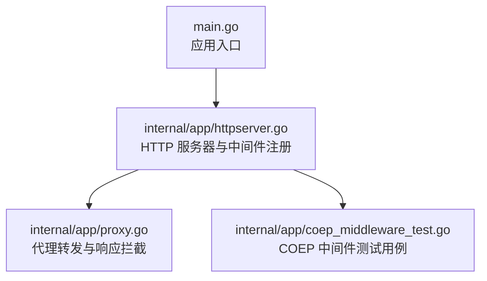
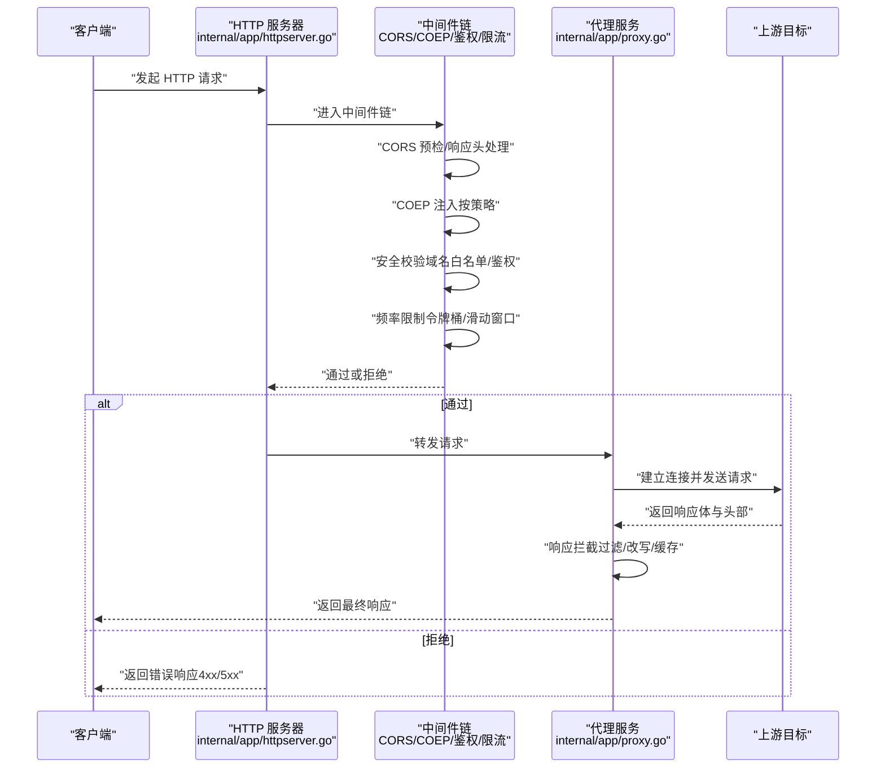
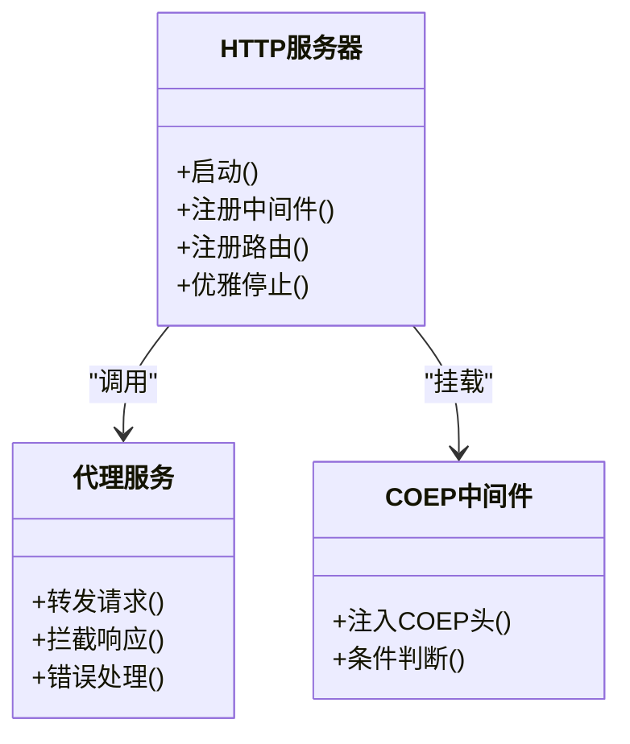

# HTTP 代理服务

<cite>
**本文引用的文件**
- [main.go](file://main.go)
- [internal/app/httpserver.go](file://internal/app/httpserver.go)
- [internal/app/proxy.go](file://internal/app/proxy.go)
- [internal/app/coep_middleware_test.go](file://internal/app/coep_middleware_test.go)
</cite>

## 目录
1. [简介](#简介)
2. [项目结构](#项目结构)
3. [核心组件](#核心组件)
4. [架构总览](#架构总览)
5. [详细组件分析](#详细组件分析)
6. [依赖关系分析](#依赖关系分析)
7. [性能考量](#性能考量)
8. [故障排查指南](#故障排查指南)
9. [结论](#结论)
10. [附录：HTTP API 使用与集成示例](#附录http-api-使用与集成示例)

## 简介
本文件聚焦于后端内置 HTTP 代理服务的实现与文档，覆盖以下关键主题：
- 内置 HTTP 服务器的启动、监听与生命周期管理
- 请求路由与中间件处理链（含 CORS 配置）
- 代理服务核心能力：请求转发、响应拦截、安全验证
- COEP（Cross-Origin-Embedder-Policy）中间件的实现与跨域资源安全加载策略
- 网络请求安全控制：域名白名单、请求频率限制、错误处理
- HTTP API 的使用示例与集成指南

## 项目结构
与 HTTP 代理服务相关的代码主要位于 Go 后端模块中，入口在根级 main.go，HTTP 服务与代理逻辑集中在 internal/app 子包。

图表来源
- [main.go](file://main.go)
- [internal/app/httpserver.go](file://internal/app/httpserver.go)
- [internal/app/proxy.go](file://internal/app/proxy.go)
- [internal/app/coep_middleware_test.go](file://internal/app/coep_middleware_test.go)

章节来源
- [main.go](file://main.go)
- [internal/app/httpserver.go](file://internal/app/httpserver.go)
- [internal/app/proxy.go](file://internal/app/proxy.go)
- [internal/app/coep_middleware_test.go](file://internal/app/coep_middleware_test.go)

## 核心组件
- HTTP 服务器与中间件注册：负责创建并启动 HTTP 服务，挂载路由与中间件，统一处理请求/响应生命周期。
- 代理服务：对上游目标进行请求转发，并对响应进行拦截与增强（如注入安全头）。
- COEP 中间件：为特定路径或全局响应注入 Cross-Origin-Embedder-Policy 等头部，确保跨域资源的安全加载。
- 安全控制：包含域名白名单校验、请求频率限制、错误处理与日志记录。

章节来源
- [internal/app/httpserver.go](file://internal/app/httpserver.go)
- [internal/app/proxy.go](file://internal/app/proxy.go)
- [internal/app/coep_middleware_test.go](file://internal/app/coep_middleware_test.go)

## 架构总览
下图展示了从客户端到上游目标的完整请求链路，以及中间件与安全控制的介入点。

图表来源
- [internal/app/httpserver.go](file://internal/app/httpserver.go)
- [internal/app/proxy.go](file://internal/app/proxy.go)
- [internal/app/coep_middleware_test.go](file://internal/app/coep_middleware_test.go)

## 详细组件分析

### HTTP 服务器与中间件注册
- 职责
  - 初始化 HTTP 服务器实例，绑定端口与上下文
  - 注册路由与中间件链（CORS、COEP、鉴权、限流、日志等）
  - 提供优雅启停与错误上报
- 关键点
  - 中间件顺序决定处理优先级，通常顺序为：CORS → COEP → 鉴权 → 限流 → 业务路由
  - 支持基于路径前缀的路由匹配与静态资源托管
  - 可配置超时、最大请求体大小、TLS 选项等

章节来源
- [internal/app/httpserver.go](file://internal/app/httpserver.go)

### 代理服务（请求转发与响应拦截）
- 职责
  - 将入站请求转发至上游目标，保持必要的头部与参数
  - 对响应进行拦截与增强（例如注入安全头、压缩、缓存）
  - 统一错误处理与重试策略
- 关键点
  - 上游地址解析与选择（单目标或多目标负载均衡）
  - 请求体流式转发，避免内存峰值
  - 响应头过滤与合并策略，防止泄露内部信息
  - 错误分类与降级（如上游不可达时的默认响应）

章节来源
- [internal/app/proxy.go](file://internal/app/proxy.go)

### COEP 中间件（跨域资源安全加载）
- 职责
  - 根据策略为响应注入 Cross-Origin-Embedder-Policy 与相关头部
  - 配合 CORS 中间件，确保跨域脚本、WASM、纹理等资源的安全加载
- 关键点
  - 条件注入：仅对受控路径或满足条件的响应添加 COEP
  - 与 CSP、CORP 的协同策略，避免过度宽松导致安全风险
  - 测试覆盖：通过测试用例验证不同场景下的响应头组合

章节来源
- [internal/app/coep_middleware_test.go](file://internal/app/coep_middleware_test.go)

### 安全控制机制
- 域名白名单
  - 校验上游目标域名是否在允许列表中
  - 支持通配符与正则表达式规则
- 请求频率限制
  - 基于 IP 或用户标识的限流策略
  - 支持令牌桶或滑动窗口算法
- 错误处理
  - 统一错误码与消息格式
  - 敏感信息脱敏与审计日志

章节来源
- [internal/app/httpserver.go](file://internal/app/httpserver.go)
- [internal/app/proxy.go](file://internal/app/proxy.go)

## 依赖关系分析
HTTP 服务器与代理服务之间的依赖关系如下：

图表来源
- [internal/app/httpserver.go](file://internal/app/httpserver.go)
- [internal/app/proxy.go](file://internal/app/proxy.go)
- [internal/app/coep_middleware_test.go](file://internal/app/coep_middleware_test.go)

章节来源
- [internal/app/httpserver.go](file://internal/app/httpserver.go)
- [internal/app/proxy.go](file://internal/app/proxy.go)
- [internal/app/coep_middleware_test.go](file://internal/app/coep_middleware_test.go)

## 性能考量
- 连接复用与池化：上游连接复用减少握手开销
- 流式处理：请求体与响应体采用流式转发，降低内存占用
- 并发控制：限制并发数与队列长度，避免雪崩
- 缓存策略：对静态资源与高频响应启用缓存
- 监控指标：暴露 QPS、延迟分布、错误率等指标

[本节为通用指导，不直接分析具体文件]

## 故障排查指南
- 常见问题
  - 上游不可达：检查域名白名单与网络连通性
  - CORS 预检失败：确认中间件顺序与响应头设置
  - COEP 导致资源加载失败：核对 COEP 策略与 CSP/CORP 协同
  - 频率限制触发：调整阈值或优化客户端重试策略
- 定位方法
  - 查看错误日志与审计日志
  - 开启调试模式输出请求/响应摘要
  - 使用抓包工具验证头部与状态码

章节来源
- [internal/app/httpserver.go](file://internal/app/httpserver.go)
- [internal/app/proxy.go](file://internal/app/proxy.go)
- [internal/app/coep_middleware_test.go](file://internal/app/coep_middleware_test.go)

## 结论
本代理服务以清晰的中间件链为核心，结合严格的域名白名单与频率限制，实现了安全的请求转发与响应拦截。COEP 中间件确保了跨域资源的安全加载，提升了整体安全性与稳定性。建议在生产环境完善监控与告警，持续优化性能与容错能力。

[本节为总结，不直接分析具体文件]

## 附录：HTTP API 使用与集成示例
- 基础用法
  - 启动服务后，向指定路由发起请求，中间件链自动处理 CORS、COEP、鉴权与限流
  - 代理服务将请求转发至上游目标，并返回标准化响应
- 典型场景
  - 跨域资源加载：通过 COEP 与 CORS 协同，确保 WASM、纹理等资源的正确加载
  - 安全访问控制：基于域名白名单与鉴权中间件，限制可访问的上游目标
  - 流量治理：通过频率限制保护上游服务免受突发流量冲击
- 集成建议
  - 在前端应用中配置代理基地址，避免硬编码上游域名
  - 在 CI/CD 中加入接口契约测试，确保中间件行为符合预期
  - 定期审查安全策略与日志，及时更新白名单与限流阈值

[本节为概念性说明，不直接分析具体文件]