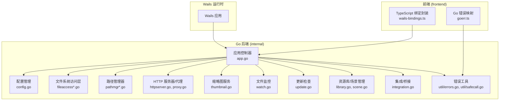
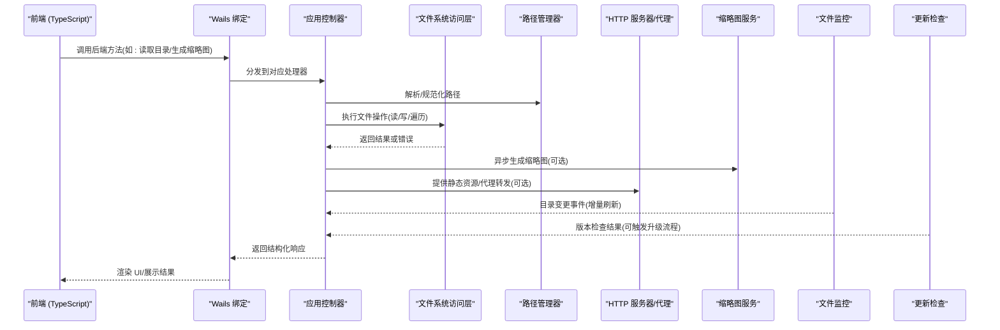
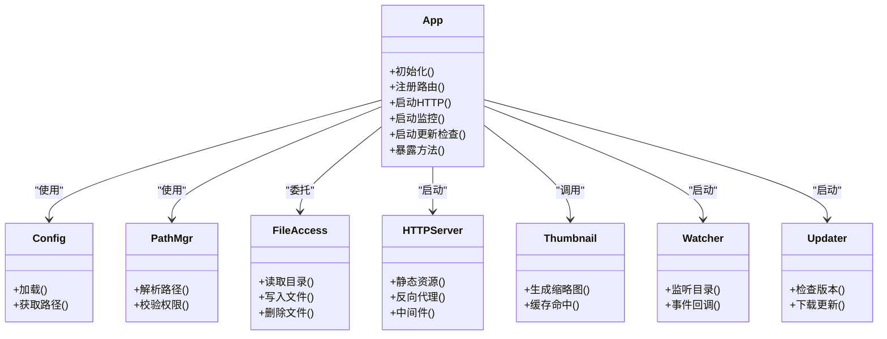
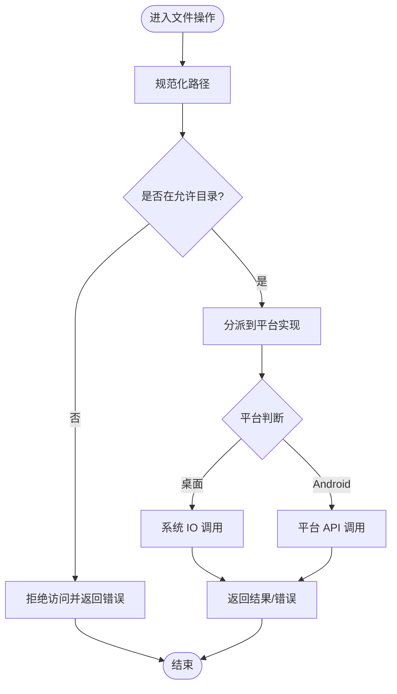
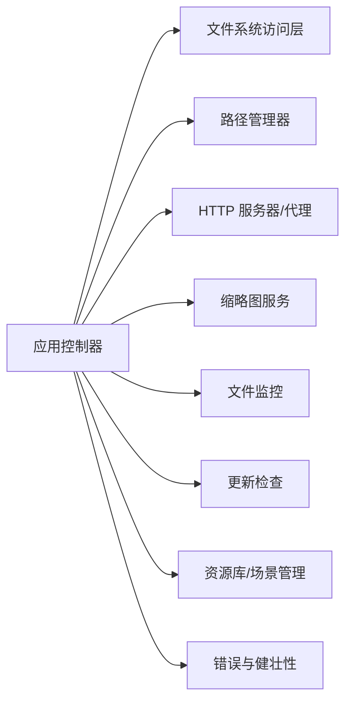
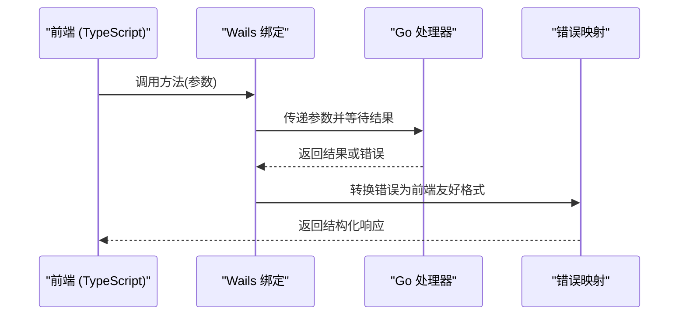

# 后端服务

<cite>
**本文引用的文件**   
- [main.go](file://main.go)
- [app.go](file://internal/app/app.go)
- [config.go](file://internal/app/config.go)
- [fileaccess.go](file://internal/app/fileaccess.go)
- [fileaccess_desktop.go](file://internal/app/fileaccess_desktop.go)
- [fileaccess_android.go](file://internal/app/fileaccess_android.go)
- [pathmgr.go](file://internal/app/pathmgr.go)
- [pathmgr_desktop.go](file://internal/app/pathmgr_desktop.go)
- [pathmgr_android.go](file://internal/app/pathmgr_android.go)
- [httpserver.go](file://internal/app/httpserver.go)
- [proxy.go](file://internal/app/proxy.go)
- [thumbnail.go](file://internal/app/thumbnail.go)
- [watch.go](file://internal/app/watch.go)
- [update.go](file://internal/app/update.go)
- [library.go](file://internal/app/library.go)
- [scene.go](file://internal/app/scene.go)
- [integration.go](file://internal/app/integration.go)
- [errors.go](file://internal/util/errors.go)
- [safecall.go](file://internal/util/safecall.go)
- [goerr.ts](file://frontend/src/core/i18n/goerr.ts)
- [wails-bindings.ts](file://frontend/src/core/wails-bindings.ts)
</cite>

## 目录
1. [简介](#简介)
2. [项目结构](#项目结构)
3. [核心组件](#核心组件)
4. [架构总览](#架构总览)
5. [详细组件分析](#详细组件分析)
6. [依赖关系分析](#依赖关系分析)
7. [性能考虑](#性能考虑)
8. [故障排查指南](#故障排查指南)
9. [结论](#结论)
10. [附录：API 与集成示例](#附录api-与集成示例)

## 简介
本文件面向前端开发者与维护者，系统性梳理基于 Go 的后端服务。该服务运行在 Wails v3 框架之上，提供应用控制器、文件系统访问层、HTTP 代理服务、平台适配层等关键能力；并通过 Wails 绑定机制实现 Go 与 JavaScript 的双向通信。文档覆盖跨平台文件操作抽象、安全访问控制、错误处理策略，以及缩略图生成、文件监控、更新检查等后台服务的实现细节，并给出 API 接口说明与集成示例，帮助前端高效使用后端能力。

## 项目结构
后端代码主要位于 internal 目录，按职责划分为应用入口、平台适配、文件系统、HTTP 代理、缩略图、文件监控、更新检查、库与场景管理等模块。前端通过 Wails 自动生成的绑定类型与函数调用后端方法，并在 TypeScript 侧进行封装与错误映射。

图表来源
- [main.go:1-200](file://main.go#L1-L200)
- [app.go:1-200](file://internal/app/app.go#L1-L200)
- [httpserver.go:1-200](file://internal/app/httpserver.go#L1-L200)
- [proxy.go:1-200](file://internal/app/proxy.go#L1-L200)
- [fileaccess.go:1-200](file://internal/app/fileaccess.go#L1-L200)
- [pathmgr.go:1-200](file://internal/app/pathmgr.go#L1-L200)
- [thumbnail.go:1-200](file://internal/app/thumbnail.go#L1-L200)
- [watch.go:1-200](file://internal/app/watch.go#L1-L200)
- [update.go:1-200](file://internal/app/update.go#L1-L200)
- [library.go:1-200](file://internal/app/library.go#L1-L200)
- [scene.go:1-200](file://internal/app/scene.go#L1-L200)
- [integration.go:1-200](file://internal/app/integration.go#L1-L200)
- [errors.go:1-200](file://internal/util/errors.go#L1-L200)
- [safecall.go:1-200](file://internal/util/safecall.go#L1-L200)
- [wails-bindings.ts:1-200](file://frontend/src/core/wails-bindings.ts#L1-L200)
- [goerr.ts:1-200](file://frontend/src/core/i18n/goerr.ts#L1-L200)

章节来源
- [main.go:1-200](file://main.go#L1-L200)
- [app.go:1-200](file://internal/app/app.go#L1-L200)

## 核心组件
- 应用控制器（App）
  - 负责初始化配置、注册路由、启动 HTTP 服务、挂载插件与中间件、暴露给前端的业务方法。
  - 协调各子系统（文件、路径、缩略图、监控、更新、库/场景）。
- 文件系统访问层（File Access）
  - 提供跨平台文件读写、目录遍历、权限校验与安全沙箱。
  - 桌面与 Android 平台分别实现，统一对外接口。
- 路径管理器（Path Manager）
  - 管理应用数据目录、用户库目录、缓存目录等，屏蔽平台差异。
- HTTP 服务器与代理（HTTP Server & Proxy）
  - 提供本地静态资源服务、反向代理、CORS/COEP 中间件、请求鉴权与限流。
- 缩略图服务（Thumbnail Service）
  - 异步生成模型/资源的缩略图，支持缓存与并发控制。
- 文件监控（File Watcher）
  - 监听库目录变更，触发增量刷新与索引重建。
- 更新检查（Updater）
  - 定期检查新版本，支持静默下载与提示升级。
- 资源库与场景管理（Library & Scene）
  - 维护资源清单、元数据、场景序列化与加载。
- 错误与健壮性（Errors & Safecall）
  - 统一错误类型、国际化错误消息、安全调用包装避免崩溃。

章节来源
- [app.go:1-200](file://internal/app/app.go#L1-L200)
- [fileaccess.go:1-200](file://internal/app/fileaccess.go#L1-L200)
- [pathmgr.go:1-200](file://internal/app/pathmgr.go#L1-L200)
- [httpserver.go:1-200](file://internal/app/httpserver.go#L1-L200)
- [proxy.go:1-200](file://internal/app/proxy.go#L1-L200)
- [thumbnail.go:1-200](file://internal/app/thumbnail.go#L1-L200)
- [watch.go:1-200](file://internal/app/watch.go#L1-L200)
- [update.go:1-200](file://internal/app/update.go#L1-L200)
- [library.go:1-200](file://internal/app/library.go#L1-L200)
- [scene.go:1-200](file://internal/app/scene.go#L1-L200)
- [errors.go:1-200](file://internal/util/errors.go#L1-L200)
- [safecall.go:1-200](file://internal/util/safecall.go#L1-L200)

## 架构总览
整体采用“应用控制器 + 多子系统”的模块化设计。前端通过 Wails 绑定调用 Go 方法，Go 侧再调度具体服务完成工作。HTTP 服务用于静态资源与代理转发，文件监控与缩略图服务以异步方式提升用户体验，更新检查在后台周期性执行。

图表来源
- [app.go:1-200](file://internal/app/app.go#L1-L200)
- [fileaccess.go:1-200](file://internal/app/fileaccess.go#L1-L200)
- [pathmgr.go:1-200](file://internal/app/pathmgr.go#L1-L200)
- [httpserver.go:1-200](file://internal/app/httpserver.go#L1-L200)
- [proxy.go:1-200](file://internal/app/proxy.go#L1-L200)
- [thumbnail.go:1-200](file://internal/app/thumbnail.go#L1-L200)
- [watch.go:1-200](file://internal/app/watch.go#L1-L200)
- [update.go:1-200](file://internal/app/update.go#L1-L200)

## 详细组件分析

### 应用控制器（App）
- 职责
  - 初始化配置与日志
  - 注册 HTTP 路由与中间件
  - 启动后台任务（监控、更新检查）
  - 暴露给前端的业务方法（库、场景、设置等）
- 关键点
  - 使用统一的错误包装与国际化错误码
  - 对耗时操作进行协程化与超时控制
  - 通过路径管理器确保所有 IO 操作在受控目录下执行

图表来源
- [app.go:1-200](file://internal/app/app.go#L1-L200)
- [config.go:1-200](file://internal/app/config.go#L1-L200)
- [pathmgr.go:1-200](file://internal/app/pathmgr.go#L1-L200)
- [fileaccess.go:1-200](file://internal/app/fileaccess.go#L1-L200)
- [httpserver.go:1-200](file://internal/app/httpserver.go#L1-L200)
- [thumbnail.go:1-200](file://internal/app/thumbnail.go#L1-L200)
- [watch.go:1-200](file://internal/app/watch.go#L1-L200)
- [update.go:1-200](file://internal/app/update.go#L1-L200)

章节来源
- [app.go:1-200](file://internal/app/app.go#L1-L200)
- [config.go:1-200](file://internal/app/config.go#L1-L200)

### 文件系统访问层（跨平台抽象与安全）
- 设计要点
  - 统一接口：读取目录、读取文件、写入文件、删除、重命名、是否存在等
  - 平台实现：桌面端直接系统 IO；Android 端通过平台特定 API 访问
  - 安全控制：白名单目录、路径规范化、禁止符号链接逃逸、大小限制
- 典型流程

图表来源
- [fileaccess.go:1-200](file://internal/app/fileaccess.go#L1-L200)
- [fileaccess_desktop.go:1-200](file://internal/app/fileaccess_desktop.go#L1-L200)
- [fileaccess_android.go:1-200](file://internal/app/fileaccess_android.go#L1-L200)

章节来源
- [fileaccess.go:1-200](file://internal/app/fileaccess.go#L1-L200)
- [fileaccess_desktop.go:1-200](file://internal/app/fileaccess_desktop.go#L1-L200)
- [fileaccess_android.go:1-200](file://internal/app/fileaccess_android.go#L1-L200)

### 路径管理器（Path Manager）
- 职责
  - 提供应用数据目录、用户库目录、缓存目录、临时目录等
  - 路径拼接与规范化，保证跨平台一致性
  - 与文件访问层配合，确保所有 IO 在受控根下执行
- 平台差异
  - 桌面端：使用标准用户目录
  - Android 端：使用应用私有存储或外部存储（视权限）

章节来源
- [pathmgr.go:1-200](file://internal/app/pathmgr.go#L1-L200)
- [pathmgr_desktop.go:1-200](file://internal/app/pathmgr_desktop.go#L1-L200)
- [pathmgr_android.go:1-200](file://internal/app/pathmgr_android.go#L1-L200)

### HTTP 服务器与代理（HTTP Server & Proxy）
- 功能
  - 提供静态资源服务（前端构建产物、资源包）
  - 反向代理到内部或外部服务（如模型仓库、CDN）
  - 中间件：CORS、COEP、鉴权、限流、日志
- 安全
  - 仅允许本地回环或指定域名
  - 代理目标白名单与 URL 校验
  - 请求体大小限制与超时控制

章节来源
- [httpserver.go:1-200](file://internal/app/httpserver.go#L1-L200)
- [proxy.go:1-200](file://internal/app/proxy.go#L1-L200)

### 缩略图服务（Thumbnail Service）
- 流程
  - 接收资源路径，计算唯一键（路径+尺寸+时间戳）
  - 查询缓存，命中则直接返回
  - 未命中则解码图像/模型封面，生成缩略图并落盘缓存
  - 并发控制与队列化，避免大量并发导致卡顿
- 优化
  - 懒加载与预取策略
  - 缓存清理与容量上限

章节来源
- [thumbnail.go:1-200](file://internal/app/thumbnail.go#L1-L200)

### 文件监控（File Watcher）
- 行为
  - 监听库目录变化（新增、修改、删除）
  - 去抖与批量处理，避免频繁刷新
  - 触发索引重建与缩略图再生
- 可靠性
  - 异常恢复与重试
  - 平台差异适配（Windows/macOS/Linux/Android）

章节来源
- [watch.go:1-200](file://internal/app/watch.go#L1-L200)

### 更新检查（Updater）
- 行为
  - 定时检查远程版本信息
  - 比较当前版本与最新版本
  - 支持下载更新包与提示升级
- 安全
  - 签名校验与完整性检查
  - 网络超时与重试退避

章节来源
- [update.go:1-200](file://internal/app/update.go#L1-L200)

### 资源库与场景管理（Library & Scene）
- 资源库
  - 扫描与索引资源（模型、动作、材质等）
  - 元数据持久化与快速检索
- 场景
  - 场景序列化/反序列化
  - 资源引用与依赖解析
  - 场景切换与状态保存

章节来源
- [library.go:1-200](file://internal/app/library.go#L1-L200)
- [scene.go:1-200](file://internal/app/scene.go#L1-L200)

### 集成与桥接（Integration）
- 作用
  - 将多个子系统组合为对外一致的 API
  - 处理跨域、事件总线、生命周期钩子
- 扩展点
  - 插件式中间件
  - 可扩展的路由与处理器

章节来源
- [integration.go:1-200](file://internal/app/integration.go#L1-L200)

### 错误处理与健壮性（Errors & Safecall）
- 错误体系
  - 统一错误类型与错误码
  - 国际化错误消息映射
- 安全调用
  - 捕获 panic 并转换为友好错误
  - 超时与取消信号支持

章节来源
- [errors.go:1-200](file://internal/util/errors.go#L1-L200)
- [safecall.go:1-200](file://internal/util/safecall.go#L1-L200)
- [goerr.ts:1-200](file://frontend/src/core/i18n/goerr.ts#L1-L200)

## 依赖关系分析
- 耦合与内聚
  - 应用控制器作为编排中心，低耦合地调用各子系统
  - 文件系统访问层与路径管理器强内聚，共同保障安全与一致
- 外部依赖
  - Wails 运行时与绑定生成
  - 标准库与第三方网络/压缩/图像处理库
- 循环依赖
  - 通过接口与分层避免循环导入

图表来源
- [app.go:1-200](file://internal/app/app.go#L1-L200)
- [fileaccess.go:1-200](file://internal/app/fileaccess.go#L1-L200)
- [pathmgr.go:1-200](file://internal/app/pathmgr.go#L1-L200)
- [httpserver.go:1-200](file://internal/app/httpserver.go#L1-L200)
- [proxy.go:1-200](file://internal/app/proxy.go#L1-L200)
- [thumbnail.go:1-200](file://internal/app/thumbnail.go#L1-L200)
- [watch.go:1-200](file://internal/app/watch.go#L1-L200)
- [update.go:1-200](file://internal/app/update.go#L1-L200)
- [library.go:1-200](file://internal/app/library.go#L1-L200)
- [scene.go:1-200](file://internal/app/scene.go#L1-L200)
- [errors.go:1-200](file://internal/util/errors.go#L1-L200)
- [safecall.go:1-200](file://internal/util/safecall.go#L1-L200)

章节来源
- [app.go:1-200](file://internal/app/app.go#L1-L200)

## 性能考虑
- 缩略图生成
  - 使用缓存与并发队列，避免重复计算
  - 按需生成与懒加载，减少首屏开销
- 文件监控
  - 去抖与批量合并事件，降低 IO 压力
  - 增量索引与差异化更新
- HTTP 代理
  - 连接复用与缓存头
  - 限流与超时保护
- 错误与健壮性
  - 安全调用避免主线程阻塞
  - 合理超时与取消信号

[本节为通用指导，不直接分析具体文件]

## 故障排查指南
- 常见错误
  - 路径越界：检查路径规范化与白名单逻辑
  - 权限不足：确认平台权限与应用数据目录
  - 代理失败：检查目标白名单与网络连通性
  - 缩略图缺失：查看缓存目录与生成队列
  - 监控失效：确认平台事件源与去抖参数
- 定位步骤
  - 启用详细日志，关注错误码与堆栈
  - 使用安全调用包装可疑方法，捕获 panic
  - 隔离问题模块，逐步验证依赖

章节来源
- [errors.go:1-200](file://internal/util/errors.go#L1-L200)
- [safecall.go:1-200](file://internal/util/safecall.go#L1-L200)
- [goerr.ts:1-200](file://frontend/src/core/i18n/goerr.ts#L1-L200)

## 结论
本后端服务以应用控制器为核心，结合文件系统访问层、HTTP 代理、缩略图、文件监控与更新检查等子系统，形成高内聚、低耦合的可扩展架构。通过 Wails 绑定实现前后端双向通信，并提供跨平台文件操作抽象与安全控制。错误处理与健壮性机制保障了稳定性与可维护性。

[本节为总结，不直接分析具体文件]

## 附录：API 与集成示例

### Wails v3 绑定机制与双向通信
- 绑定生成
  - Go 方法通过 Wails 注解暴露给前端
  - 自动生成 TypeScript 类型与调用封装
- 调用流程
  - 前端调用绑定方法 -> Wails 运行时 -> Go 处理器 -> 返回结果/错误
- 错误映射
  - Go 错误码在前端映射为友好消息与类型

图表来源
- [wails-bindings.ts:1-200](file://frontend/src/core/wails-bindings.ts#L1-L200)
- [goerr.ts:1-200](file://frontend/src/core/i18n/goerr.ts#L1-L200)

章节来源
- [wails-bindings.ts:1-200](file://frontend/src/core/wails-bindings.ts#L1-L200)
- [goerr.ts:1-200](file://frontend/src/core/i18n/goerr.ts#L1-L200)

### 文件系统访问 API（摘要）
- 读取目录
  - 输入：相对路径（在允许目录下）
  - 输出：文件列表（名称、类型、大小、时间戳）
  - 错误：路径非法、权限不足、IO 错误
- 写入文件
  - 输入：相对路径、二进制数据
  - 输出：成功标志
  - 错误：路径非法、空间不足、权限不足
- 删除/重命名
  - 输入：相对路径
  - 输出：成功标志
  - 错误：路径非法、文件不存在、权限不足

章节来源
- [fileaccess.go:1-200](file://internal/app/fileaccess.go#L1-L200)
- [fileaccess_desktop.go:1-200](file://internal/app/fileaccess_desktop.go#L1-L200)
- [fileaccess_android.go:1-200](file://internal/app/fileaccess_android.go#L1-L200)

### HTTP 代理 API（摘要）
- 静态资源
  - 路径：/static/*
  - 行为：从应用目录提供静态文件
- 反向代理
  - 路径：/proxy/*
  - 行为：转发到白名单目标，附加必要头与鉴权
- 中间件
  - CORS/COEP、鉴权、限流、日志

章节来源
- [httpserver.go:1-200](file://internal/app/httpserver.go#L1-L200)
- [proxy.go:1-200](file://internal/app/proxy.go#L1-L200)

### 缩略图 API（摘要）
- 生成缩略图
  - 输入：资源路径、尺寸
  - 输出：缩略图路径或 Base64
  - 行为：缓存命中直接返回，否则异步生成
- 查询缓存
  - 输入：资源路径、尺寸
  - 输出：是否命中

章节来源
- [thumbnail.go:1-200](file://internal/app/thumbnail.go#L1-L200)

### 文件监控 API（摘要）
- 启动监听
  - 输入：目录路径
  - 输出：监听句柄
- 事件回调
  - 事件类型：新增、修改、删除
  - 负载：变更文件路径与时间戳

章节来源
- [watch.go:1-200](file://internal/app/watch.go#L1-L200)

### 更新检查 API（摘要）
- 检查版本
  - 输入：当前版本号
  - 输出：是否有新版本、下载地址、说明
- 下载更新
  - 输入：下载地址
  - 输出：进度与结果

章节来源
- [update.go:1-200](file://internal/app/update.go#L1-L200)

### 集成示例（前端调用）
- 读取目录
  - 调用绑定方法，传入相对路径
  - 处理返回的文件列表，渲染 UI
- 生成缩略图
  - 先查询缓存，未命中则触发生成
  - 显示占位图，完成后替换
- 代理请求
  - 通过 /proxy/* 访问外部资源
  - 处理网络错误与超时

章节来源
- [wails-bindings.ts:1-200](file://frontend/src/core/wails-bindings.ts#L1-L200)
- [goerr.ts:1-200](file://frontend/src/core/i18n/goerr.ts#L1-L200)