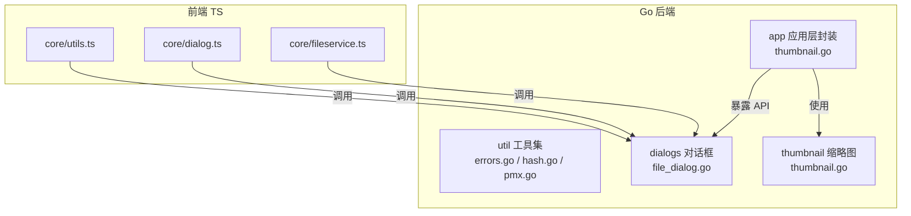
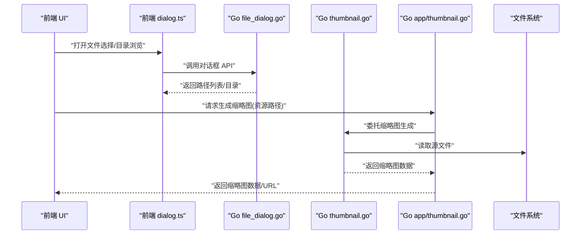
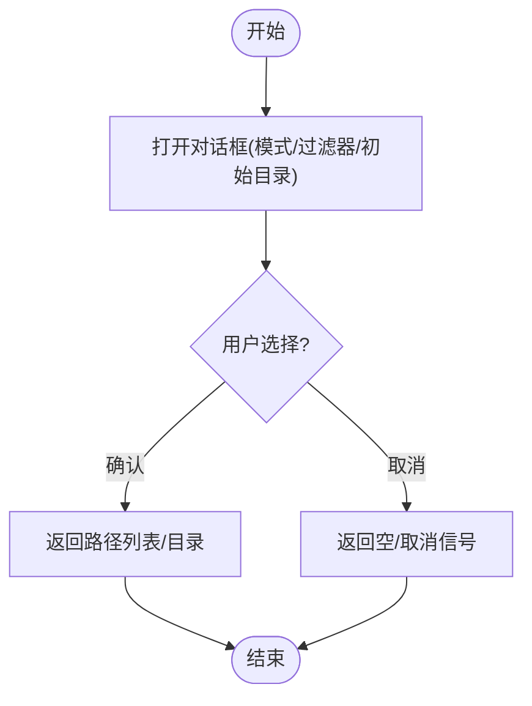
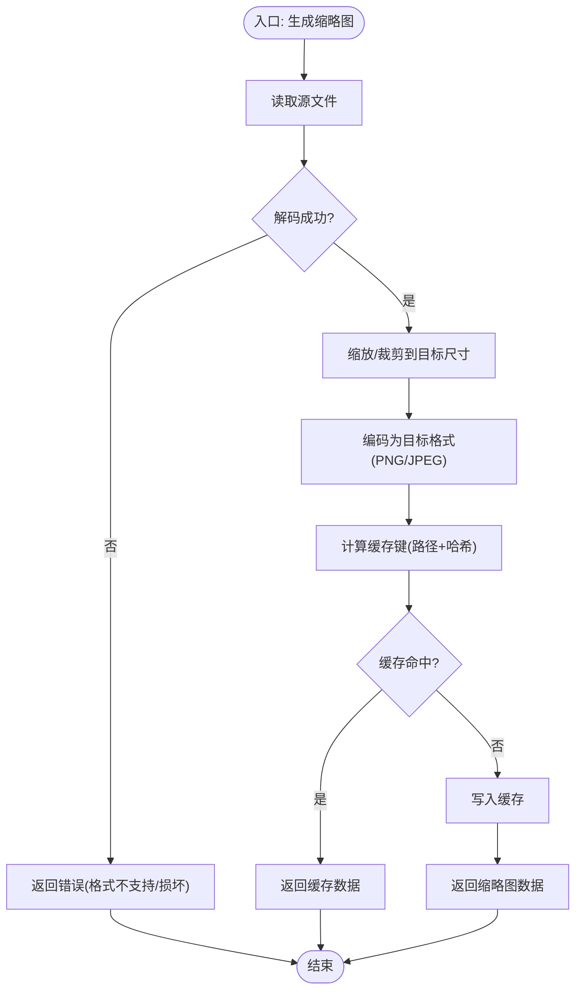
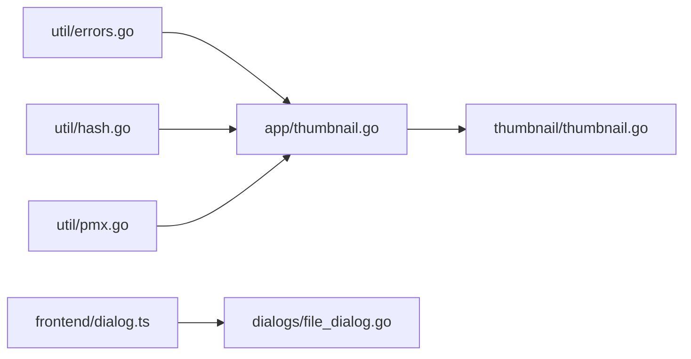

# 工具服务

<cite>
**本文引用的文件**   
- [internal/util/errors.go](file://internal/util/errors.go)
- [internal/util/hash.go](file://internal/util/hash.go)
- [internal/util/pmx.go](file://internal/util/pmx.go)
- [internal/dialogs/file_dialog.go](file://internal/dialogs/file_dialog.go)
- [internal/thumbnail/thumbnail.go](file://internal/thumbnail/thumbnail.go)
- [internal/app/thumbnail.go](file://internal/app/thumbnail.go)
- [frontend/src/core/utils.ts](file://frontend/src/core/utils.ts)
- [frontend/src/core/dialog.ts](file://frontend/src/core/dialog.ts)
- [frontend/src/core/fileservice.ts](file://frontend/src/core/fileservice.ts)
</cite>

## 目录
1. [简介](#简介)
2. [项目结构](#项目结构)
3. [核心组件](#核心组件)
4. [架构总览](#架构总览)
5. [详细组件分析](#详细组件分析)
6. [依赖分析](#依赖分析)
7. [性能考虑](#性能考虑)
8. [故障排查指南](#故障排查指南)
9. [结论](#结论)
10. [附录](#附录)

## 简介
本章节面向“工具服务”模块，聚焦以下能力：
- 通用工具函数：错误处理、哈希计算、PMX 文件解析等实用工具。
- 对话框服务：文件选择、目录浏览与用户交互的后端支撑（Go 后端 + 前端桥接）。
- 缩略图生成服务：支持的图片格式、图像处理算法与缓存策略。
- 辅助工具：为开发者提供完整工具链参考与最佳实践。

目标读者包括前端/后端开发者、集成方与维护者，文档以渐进式方式呈现，从高层到代码级细节逐步深入。

## 项目结构
工具服务横跨 Go 后端与前端 TypeScript 两部分：
- Go 后端
  - internal/util：通用工具（错误、哈希、PMX 解析）
  - internal/dialogs：跨平台对话框（文件/目录选择）
  - internal/thumbnail：缩略图生成核心逻辑
  - internal/app：应用层对缩略图服务的封装与集成
- 前端
  - frontend/src/core：UI 侧工具与桥接（utils、dialog、fileservice）

图表来源
- [internal/util/errors.go](file://internal/util/errors.go)
- [internal/util/hash.go](file://internal/util/hash.go)
- [internal/util/pmx.go](file://internal/util/pmx.go)
- [internal/dialogs/file_dialog.go](file://internal/dialogs/file_dialog.go)
- [internal/thumbnail/thumbnail.go](file://internal/thumbnail/thumbnail.go)
- [internal/app/thumbnail.go](file://internal/app/thumbnail.go)
- [frontend/src/core/utils.ts](file://frontend/src/core/utils.ts)
- [frontend/src/core/dialog.ts](file://frontend/src/core/dialog.ts)
- [frontend/src/core/fileservice.ts](file://frontend/src/core/fileservice.ts)

章节来源
- [internal/util/errors.go](file://internal/util/errors.go)
- [internal/util/hash.go](file://internal/util/hash.go)
- [internal/util/pmx.go](file://internal/util/pmx.go)
- [internal/dialogs/file_dialog.go](file://internal/dialogs/file_dialog.go)
- [internal/thumbnail/thumbnail.go](file://internal/thumbnail/thumbnail.go)
- [internal/app/thumbnail.go](file://internal/app/thumbnail.go)
- [frontend/src/core/utils.ts](file://frontend/src/core/utils.ts)
- [frontend/src/core/dialog.ts](file://frontend/src/core/dialog.ts)
- [frontend/src/core/fileservice.ts](file://frontend/src/core/fileservice.ts)

## 核心组件
本节概述各子模块的职责与对外能力，便于快速定位与理解整体协作关系。

- 通用工具（internal/util）
  - 错误处理：统一错误类型与包装，便于跨语言/跨层传递与展示。
  - 哈希计算：提供稳定、可复现的哈希方法，用于资源标识与缓存键生成。
  - PMX 解析：轻量读取 PMX 头部或关键元信息，避免全量解析带来的开销。
- 对话框服务（internal/dialogs）
  - 文件选择：支持多文件/单文件、过滤器、初始目录。
  - 目录浏览：返回选定目录路径，供后续操作使用。
  - 用户交互：在桌面/移动端平台差异下提供一致的前端接口。
- 缩略图生成（internal/thumbnail + internal/app）
  - 输入：模型或纹理等资源文件。
  - 输出：固定尺寸的 PNG/JPEG 缩略图数据流。
  - 策略：按资源路径/内容哈希生成缓存键，命中则直接返回；未命中则解码图像并生成。
- 前端工具（frontend/src/core）
  - utils：通用 UI/业务小工具（如格式化、校验、节流防抖等）。
  - dialog：封装对话框调用，屏蔽平台差异。
  - fileservice：文件访问抽象，统一读写与权限处理。

章节来源
- [internal/util/errors.go](file://internal/util/errors.go)
- [internal/util/hash.go](file://internal/util/hash.go)
- [internal/util/pmx.go](file://internal/util/pmx.go)
- [internal/dialogs/file_dialog.go](file://internal/dialogs/file_dialog.go)
- [internal/thumbnail/thumbnail.go](file://internal/thumbnail/thumbnail.go)
- [internal/app/thumbnail.go](file://internal/app/thumbnail.go)
- [frontend/src/core/utils.ts](file://frontend/src/core/utils.ts)
- [frontend/src/core/dialog.ts](file://frontend/src/core/dialog.ts)
- [frontend/src/core/fileservice.ts](file://frontend/src/core/fileservice.ts)

## 架构总览
下图展示了“工具服务”在前端与后端的交互关系，以及关键数据流向。

图表来源
- [frontend/src/core/dialog.ts](file://frontend/src/core/dialog.ts)
- [internal/dialogs/file_dialog.go](file://internal/dialogs/file_dialog.go)
- [internal/app/thumbnail.go](file://internal/app/thumbnail.go)
- [internal/thumbnail/thumbnail.go](file://internal/thumbnail/thumbnail.go)

## 详细组件分析

### 通用工具：错误处理（internal/util/errors.go）
- 职责
  - 定义统一的错误类型与包装器，便于跨层传播与国际化展示。
  - 提供上下文附加能力，帮助定位问题来源。
- 设计要点
  - 错误分层：基础错误 -> 业务错误 -> 系统错误。
  - 可序列化：确保错误能安全地在前后端之间传递。
- 使用建议
  - 上层捕获并转换为友好提示，保留原始错误用于日志。
  - 结合日志 ID 进行追踪。

章节来源
- [internal/util/errors.go](file://internal/util/errors.go)

### 通用工具：哈希计算（internal/util/hash.go）
- 职责
  - 提供稳定的哈希算法，用于资源唯一标识与缓存键生成。
- 设计要点
  - 一致性：相同输入在不同运行期产生相同结果。
  - 安全性：避免碰撞导致的缓存污染。
- 典型用法
  - 作为缩略图缓存键的一部分。
  - 用于资源变更检测与增量更新。

章节来源
- [internal/util/hash.go](file://internal/util/hash.go)

### 通用工具：PMX 解析（internal/util/pmx.go）
- 职责
  - 轻量解析 PMX 文件头或关键字段，获取模型基本信息（如名称、顶点数、材质数等）。
- 设计要点
  - 只读、最小化 I/O：仅读取必要字节，避免大对象加载。
  - 容错：对非标准 PMX 给出明确错误信息。
- 适用场景
  - 库面板快速预览、资源清单构建、预检流程。

章节来源
- [internal/util/pmx.go](file://internal/util/pmx.go)

### 对话框服务：文件选择与目录浏览（internal/dialogs/file_dialog.go）
- 职责
  - 提供跨平台的文件/目录选择能力，屏蔽平台差异。
- 功能点
  - 文件选择：支持单/多选、扩展名过滤、默认目录。
  - 目录浏览：返回所选目录路径。
  - 取消与异常：正确处理用户取消与权限不足等场景。
- 前端桥接
  - 通过 frontend/src/core/dialog.ts 暴露统一 API，简化调用。

图表来源
- [internal/dialogs/file_dialog.go](file://internal/dialogs/file_dialog.go)
- [frontend/src/core/dialog.ts](file://frontend/src/core/dialog.ts)

章节来源
- [internal/dialogs/file_dialog.go](file://internal/dialogs/file_dialog.go)
- [frontend/src/core/dialog.ts](file://frontend/src/core/dialog.ts)

### 缩略图生成服务（internal/thumbnail/thumbnail.go + internal/app/thumbnail.go）
- 职责
  - 根据输入资源生成固定尺寸的缩略图，并提供缓存策略以减少重复计算。
- 支持格式
  - 常见位图格式（如 PNG、JPEG、BMP、GIF 静态帧等），具体以运行时解码器为准。
- 处理流程
  - 读取源文件 -> 解码图像 -> 缩放/裁剪至目标尺寸 -> 编码为输出格式 -> 写入缓存或直接返回。
- 缓存策略
  - 缓存键：由资源路径与内容哈希组合而成，保证路径变化或内容变更均失效。
  - 存储位置：本地磁盘或内存（视部署环境而定）。
  - 清理策略：基于容量或时间窗口（若实现）。
- 错误处理
  - 非法文件、解码失败、IO 异常均返回结构化错误，便于前端提示。

图表来源
- [internal/thumbnail/thumbnail.go](file://internal/thumbnail/thumbnail.go)
- [internal/app/thumbnail.go](file://internal/app/thumbnail.go)

章节来源
- [internal/thumbnail/thumbnail.go](file://internal/thumbnail/thumbnail.go)
- [internal/app/thumbnail.go](file://internal/app/thumbnail.go)

### 前端工具：utils、dialog、fileservice（frontend/src/core）
- utils.ts
  - 提供通用工具函数（如字符串/日期/数值格式化、校验、节流防抖等），提升 UI 层开发效率。
- dialog.ts
  - 封装对话框调用，统一参数与返回值，屏蔽平台差异。
- fileservice.ts
  - 文件访问抽象，统一读写、权限检查与错误转换，便于在不同环境中复用。

章节来源
- [frontend/src/core/utils.ts](file://frontend/src/core/utils.ts)
- [frontend/src/core/dialog.ts](file://frontend/src/core/dialog.ts)
- [frontend/src/core/fileservice.ts](file://frontend/src/core/fileservice.ts)

## 依赖分析
- 内部依赖
  - 应用层（internal/app/thumbnail.go）依赖缩略图核心（internal/thumbnail/thumbnail.go）。
  - 前端（dialog.ts）依赖后端对话框（file_dialog.go）。
  - 通用工具被多处复用（错误、哈希、PMX）。
- 外部依赖
  - 图像编解码库（由 Go 标准库或第三方库提供）。
  - 文件系统与平台对话框 API。

图表来源
- [internal/app/thumbnail.go](file://internal/app/thumbnail.go)
- [internal/thumbnail/thumbnail.go](file://internal/thumbnail/thumbnail.go)
- [frontend/src/core/dialog.ts](file://frontend/src/core/dialog.ts)
- [internal/dialogs/file_dialog.go](file://internal/dialogs/file_dialog.go)
- [internal/util/errors.go](file://internal/util/errors.go)
- [internal/util/hash.go](file://internal/util/hash.go)
- [internal/util/pmx.go](file://internal/util/pmx.go)

章节来源
- [internal/app/thumbnail.go](file://internal/app/thumbnail.go)
- [internal/thumbnail/thumbnail.go](file://internal/thumbnail/thumbnail.go)
- [frontend/src/core/dialog.ts](file://frontend/src/core/dialog.ts)
- [internal/dialogs/file_dialog.go](file://internal/dialogs/file_dialog.go)
- [internal/util/errors.go](file://internal/util/errors.go)
- [internal/util/hash.go](file://internal/util/hash.go)
- [internal/util/pmx.go](file://internal/util/pmx.go)

## 性能考虑
- 缩略图生成
  - 优先使用缓存键命中，减少重复解码与编码。
  - 控制并发：限制同时处理的缩略图数量，避免 IO/CPU 峰值。
  - 渐进式：先返回低分辨率占位，再异步替换高分辨率。
- 哈希计算
  - 对大文件采用分块哈希或仅对关键元数据计算，降低 CPU 压力。
- PMX 解析
  - 仅读取头部与必要字段，避免全量加载导致内存抖动。
- 对话框
  - 批量选择时延迟渲染，避免 UI 卡顿。

[本节为通用指导，不直接分析具体文件]

## 故障排查指南
- 错误处理
  - 使用统一错误类型包装，记录上下文与日志 ID，便于定位。
  - 前端将错误映射为用户可读消息，同时保留原始错误用于诊断。
- 常见问题
  - 缩略图生成失败：检查文件格式是否受支持、文件是否损坏、路径权限。
  - 对话框无响应：检查平台权限、初始目录是否存在、用户是否取消。
  - PMX 解析异常：确认文件是否为有效 PMX，必要时降级为更严格的校验。
- 调试建议
  - 开启详细日志，记录关键步骤与耗时。
  - 使用最小复现用例验证问题边界条件。

章节来源
- [internal/util/errors.go](file://internal/util/errors.go)

## 结论
工具服务模块通过清晰的职责划分与良好的抽象，为前端与后端提供了稳定、可复用的基础设施：
- 通用工具确保错误、哈希与 PMX 解析的一致性与健壮性。
- 对话框服务屏蔽平台差异，提供一致的交互体验。
- 缩略图生成服务兼顾性能与用户体验，具备完善的缓存策略。
- 前端工具进一步提升了开发与维护效率。

建议在新增功能时遵循现有模式，保持错误处理、缓存键设计与接口契约的一致性。

[本节为总结，不直接分析具体文件]

## 附录
- 术语
  - PMX：MikuMikuDance 使用的 3D 模型文件格式。
  - 缩略图：用于快速预览的小尺寸图像。
- 相关文档
  - 审计与 ADR 中关于缩略图系统与对话框设计的决策记录，可作为背景参考。

[本节为补充说明，不直接分析具体文件]